+++
draft=false
date = 2014-12-18T21:11:07Z
title = "Matthew - Chapter 1 - Cherokee New Testament"
weight = 1418955067

[taxonomies]

authors = ["Timothy Legg"]
categories = []
tags = []

[extra]
+++

<table>
<tbody>
<tr class="odd">
<td><a href="010101.png">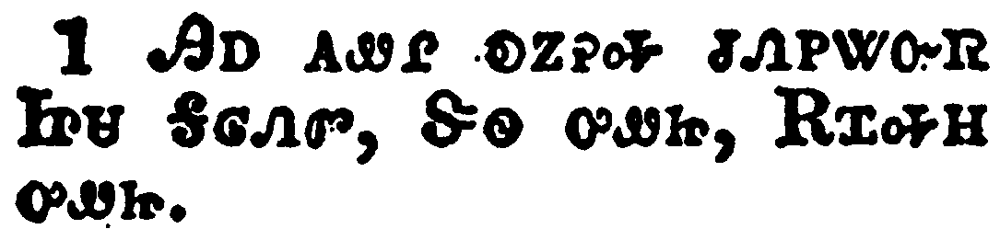</a></td>
</tr>
<tr class="even">
<td>The book of the generation of Jesus Christ, the son of David, the son of Abraham.</td>
</tr>
<tr class="odd">
<td>ᎯᎠ ᎪᏪᎵ ᎧᏃᎮᎭ ᏧᏁᏢᏔᏅᏒ ᏥᏌ ᎦᎶᏁᏛ, ᏕᏫ ᎤᏪᏥ, ᎡᏆᎭᎻ ᎤᏪᏥ.</td>
</tr>
<tr class="even">
<td>Hi-a go-we-li ka-no-he-ha tsu-ne-tlv-ta-nv-sv Tsi-sa Ga-lo-ne-dv, De-wi u-we-tsi, E-qua-ha-mi u-we-tsi.</td>
</tr>
</tbody>
</table>

<table>
<tbody>
<tr class="odd">
<td><a href="010102.png">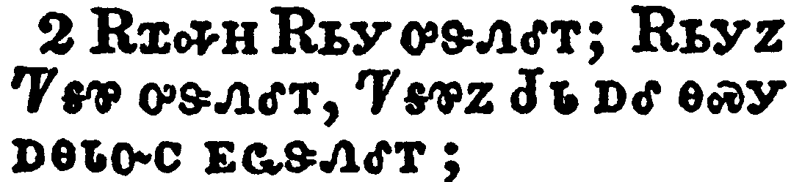</a></td>
</tr>
<tr class="even">
<td>Abraham begat Isaac; and Isaac begat Jacob; and Jacob begat Judas and his brethren;</td>
</tr>
<tr class="odd">
<td>ᎡᏆᎭᎻ ᎡᏏᎩ ᎤᏕᏁᎴᎢ; ᎡᏏᎩᏃ ᏤᎦᏈ ᎤᏕᏁᎴᎢ, ᏤᎦᏈᏃ ᏧᏓ ᎠᎴ ᎾᏍᎩ ᎠᎾᏓᏅᏟ ᎬᏩᏕᏁᎴᎢ;</td>
</tr>
<tr class="even">
<td>E-qua-ha-mi E-si-gi u-de-ne-le-i; E-si-gi-no Tse-ga-qui u-de-ne-le-i, Tse-ga-qui-no Tsu-da a-le na-s-gi a-na-da-nv-tli gv-wa-de-ne-le-i;</td>
</tr>
</tbody>
</table>

<table>
<tbody>
<tr class="odd">
<td><a href="010103.png">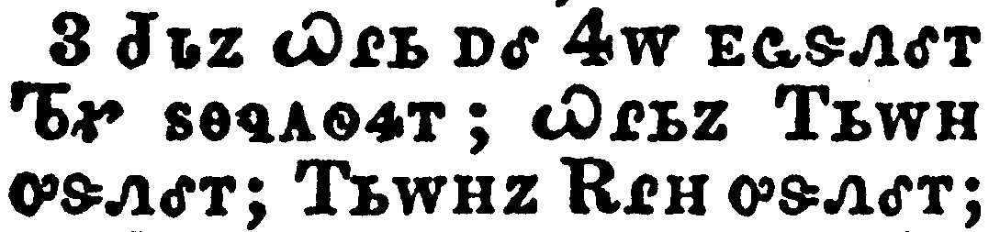</a></td>
</tr>
<tr class="even">
<td>And Judas begat Phares and Zara of Thamar; and Phares begat Esrom; and Esrom begat Aram;</td>
</tr>
<tr class="odd">
<td>ᏧᏓᏃ ᏇᎵᏏ ᎠᎴ ᏎᎳ ᎬᏩᏕᏁᎴᎢ ᏖᎹ ᏚᎾᏄᎪᏫᏎᎢ; ᏇᎵᏏᏃ ᎢᏏᎳᎻ ᎤᏕᏁᎴᎢ; ᎢᏏᎳᎻᏃ ᎡᎵᎻ ᎤᏕᏁᎴᎢ;</td>
</tr>
<tr class="even">
<td>Tsu-da-no Que-li-si a-le Se-la gv-wa-de-ne-le-i Te-ma du-na-nu-go-wi-se-i; Que-li-si-no I-si-la-mi u-de-ne-le-i; I-si-la-mi-no E-li-mi u-de-ne-le-i;</td>
</tr>
</tbody>
</table>

<table>
<tbody>
<tr class="odd">
<td><a href="010104.png">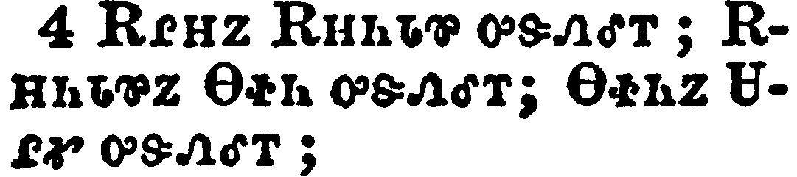</a></td>
</tr>
<tr class="even">
<td>And Aram begat Aminadab; and Aminadab begat Naasson; and Naasson begat Salmon;</td>
</tr>
<tr class="odd">
<td>ᎡᎵᎻᏃ ᎡᎻᏂᏓᏈ ᎤᏕᏁᎴᎢ; ᎡᎻᏂᏓᏈᏃ ᎾᏐᏂ ᎤᏕᏁᎴᎢ; ᎾᏐᏂᏃ ᏌᎵᎹ ᎤᏕᏁᎴᎢ;</td>
</tr>
<tr class="even">
<td>E-li-mi-no E-mi-ni-da-qui u-de-ne-le-i; E-mi-ni-da-qui-no Na-so-ni u-de-ne-le-i; Na-so-ni-no Sa-li-ma u-de-ne-le-i;</td>
</tr>
</tbody>
</table>

<table>
<tbody>
<tr class="odd">
<td><a href="010105.png">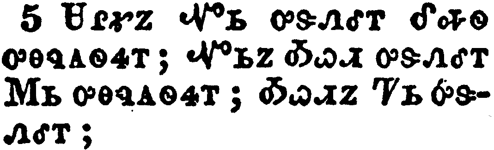</a></td>
</tr>
<tr class="even">
<td>And Salmon begat Booz of Rachab; and Booz begat Obed of Ruth; and Obed begat Jesse;</td>
</tr>
<tr class="odd">
<td>ᏌᎵᎹᏃ ᏉᏏ ᎤᏕᏁᎴᎢ ᎴᎭᏫ ᎤᎾᎸᎪᏫᏎᎢ; ᏉᏏᏃ ᎣᏇᏗ ᎤᏕᏁᎴᎢ ᎷᏏ ᎤᎾᏄᎪᏫᏎᎢ; ᎣᏇᏗᏃ ᏤᏏ ᎤᏕᏁᎴᎢ;</td>
</tr>
<tr class="even">
<td>Sa-li-ma-no Quo-si u-de-ne-le-i Le-ha-wi u-na-lv-go-wi-se-i; Quo-si-no O-que-di u-de-ne-le-i Lu-si u-na-nu-go-wi-se-i; O-que-di-no Tse-si u-de-ne-le-i;</td>
</tr>
</tbody>
</table>

<table>
<tbody>
<tr class="odd">
<td><a href="010106.png">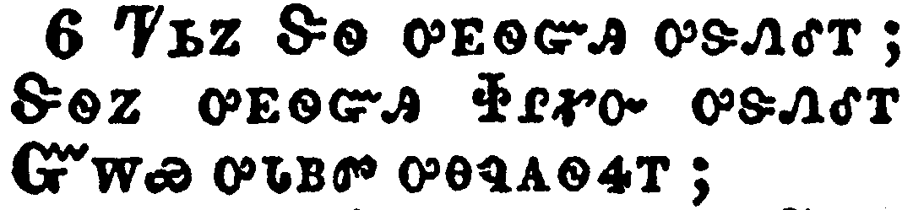</a></td>
</tr>
<tr class="even">
<td>And Jesse begat David the king; and David the king begat Solomon of her that had been the wife of Urias;</td>
</tr>
<tr class="odd">
<td>ᏤᏏᏃ ᏕᏫ ᎤᎬᏫᏳᎯ ᎤᏕᏁᎴᎢ; ᏕᏫᏃ ᎤᎬᏫᏳᎯ ᏐᎵᎹᏅ ᎤᏕᏁᎴᎢ ᏳᎳᏯ ᎤᏓᏴᏛ ᎤᎾᏄᎪᏫᏎᎢ;</td>
</tr>
<tr class="even">
<td>Tse-si-no De-wi u-gv-wi-yu-hi u-de-ne-le-i; De-wi-no u-gv-wi-yu-hi So-li-ma-nv u-de-ne-le-i Yu-la-ya u-da-yv-dv u-na-nu-go-wi-se-i;</td>
</tr>
</tbody>
</table>

<table>
<tbody>
<tr class="odd">
<td><a href="010107.png">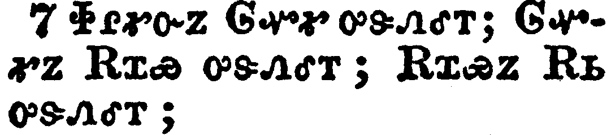</a></td>
</tr>
<tr class="even">
<td>And Solomon begat Roboam; and Roboam begat Abia; and Abia begat Asa;</td>
</tr>
<tr class="odd">
<td>ᏐᎵᎹᏅᏃ ᎶᏉᎹ ᎤᏕᏁᎴᎢ; ᎶᏉᎹᏃ ᎡᏆᏯ ᎤᏕᏁᎴᎢ; ᎡᏆᏯᏃ ᎡᏏ ᎤᏕᏁᎴᎢ;</td>
</tr>
<tr class="even">
<td>So-li-ma-nv-no Lo-quo-ma u-de-ne-le-i; Lo-quo-ma-no E-qua-ya u-de-ne-le-i; E-qua-ya-no E-si u-de-ne-le-i;</td>
</tr>
</tbody>
</table>

<table>
<tbody>
<tr class="odd">
<td><a href="010108.png">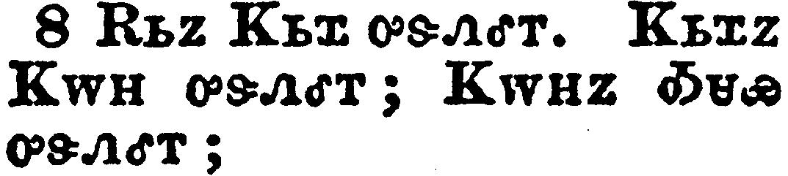</a></td>
</tr>
<tr class="even">
<td>And Asa begat Josaphat; and Josaphat begat Joram; and Joram begat Ozias;</td>
</tr>
<tr class="odd">
<td>ᎡᏏᏃ ᏦᏏᏆ ᎤᏕᏁᎴᎢ. ᏦᏏᏆᏃ ᏦᎳᎻ ᎤᏕᏁᎴᎢ; ᏦᎳᎻᏃ ᎣᏌᏯ ᎤᏕᏁᎴᎢ;</td>
</tr>
<tr class="even">
<td>E-si-no Tso-si-qua u-de-ne-le-i. Tso-si-qua-no Tso-la-mi u-de-ne-le-i; Tso-la-mi-no O-sa-ya u-de-ne-le-i;</td>
</tr>
</tbody>
</table>

<table>
<tbody>
<tr class="odd">
<td><a href="010109.png">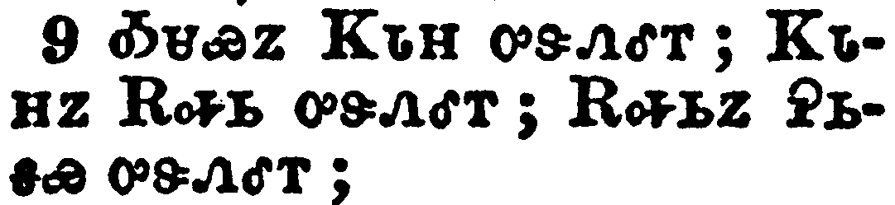</a></td>
</tr>
<tr class="even">
<td>And Ozias begat Joatham; and Joatham begat Achaz; and Achaz begat Ezekias;</td>
</tr>
<tr class="odd">
<td>ᎣᏌᏯᏃ ᏦᏓᎻ ᎤᏕᏁᎴᎢ; ᏦᏓᎻᏃ ᎡᎭᏏ ᎤᏕᏁᎴᎢ; ᎡᎭᏏᏃ ᎮᏏᎦᏯ ᎤᏕᏁᎴᎢ;</td>
</tr>
<tr class="even">
<td>O-sa-ya-no Tso-da-mi u-de-ne-le-i; Tso-da-mi-no E-ha-si u-de-ne-le-i; E-ha-si-no He-si-ga-ya u-de-ne-le-i;</td>
</tr>
</tbody>
</table>

<table>
<tbody>
<tr class="odd">
<td><a href="010110.png">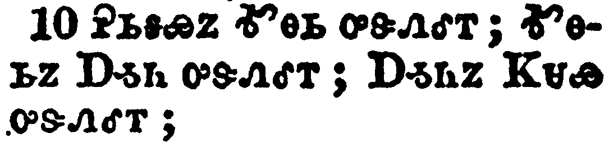</a></td>
</tr>
<tr class="even">
<td>And Ezekias begat Manasses; and Manasses begat Amon; and Amon begat Josias;</td>
</tr>
<tr class="odd">
<td>ᎮᏏᎦᏯᏃ ᎹᎾᏏ ᎤᏕᏁᎴᎢ; ᎹᎾᏏᏃ ᎠᎼᏂ ᎤᏕᏁᎴᎢ; ᎠᎼᏂᏃ ᏦᏌᏯ ᎤᏕᏁᎴᎢ;</td>
</tr>
<tr class="even">
<td>He-si-ga-ya-no Ma-na-si u-de-ne-le-i; Ma-na-si-no A-mo-ni u-de-ne-le-i; A-mo-ni-no Tso-sa-ya u-de-ne-le-i;</td>
</tr>
</tbody>
</table>

<table>
<tbody>
<tr class="odd">
<td><a href="010111.png">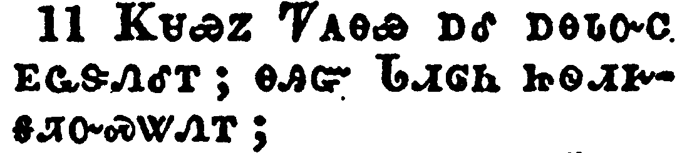</a></td>
</tr>
<tr class="even">
<td>And Josias begat Jechonias and his brethren, about the time they were carried away to Babylon:</td>
</tr>
<tr class="odd">
<td>ᏦᏌᏯᏃ ᏤᎪᎾᏯ ᎠᎴ ᎠᎾᏓᏅᏟ ᎬᏩᏕᏁᎴᎢ; ᎾᎯᏳ ᏓᏗᎶᏂ ᏥᏫᏗᎨᎦᏘᏅᏍᏔᏁᎢ;</td>
</tr>
<tr class="even">
<td>Tso-sa-ya-no Tse-go-na-ya a-le a-na-da-nv-tli gv-wa-de-ne-le-i; na-hi-yu Da-di-lo-ni tsi-wi-di-ge-ga-ti-nv-s-ta-ne-i;</td>
</tr>
</tbody>
</table>

<table>
<tbody>
<tr class="odd">
<td><a href="010112.png">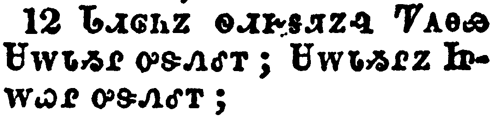</a></td>
</tr>
<tr class="even">
<td>And after they were brought to Babylon, Jechonias begat Salathiel; and Salathiel begat Zorobabel;</td>
</tr>
<tr class="odd">
<td>ᏓᏗᎶᏂᏃ ᏫᏗᎨᎦᏘᏃᎸ ᏤᎪᎾᏯ ᏌᎳᏓᏱᎵ ᎤᏕᏁᎴᎢ; ᏌᎳᏓᏱᎵᏃ ᏥᎳᏇᎵ ᎤᏕᏁᎴᎢ;</td>
</tr>
<tr class="even">
<td>Da-di-lo-ni-no wi-di-ge-ga-ti-no-lv Tse-go-na-ya Sa-la-da-yi-li u-de-ne-le-i; Sa-la-da-yi-li-no Tsi-la-que-li u-de-ne-le-i;</td>
</tr>
</tbody>
</table>

<table>
<tbody>
<tr class="odd">
<td><a href="010113.png">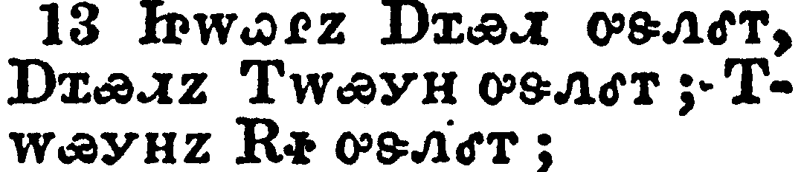</a></td>
</tr>
<tr class="even">
<td>And Zorobabel begat Abiud; and Abiud begat Eliakim; and Eliakim begat Azor;</td>
</tr>
<tr class="odd">
<td>ᏥᎳᏇᎵᏃ ᎠᏆᏯᏗ ᎤᏕᏁᎴᎢ, ᎠᏆᏯᏗᏃ ᎢᎳᏯᎩᎻ ᎤᏕᏁᎴᎢ; ᎢᎳᏯᎩᎻᏃ ᎡᏐ ᎤᏕᏁᎴᎢ;</td>
</tr>
<tr class="even">
<td>Tsi-la-que-li-no A-qua-ya-di u-de-ne-le-i, A-qua-ya-di-no I-la-ya-gi-mi u-de-ne-le-i; I-la-ya-gi-mi-no E-so u-de-ne-le-i;</td>
</tr>
</tbody>
</table>

<table>
<tbody>
<tr class="odd">
<td><a href="010114.png">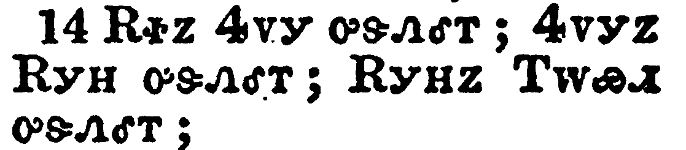</a></td>
</tr>
<tr class="even">
<td>And Azor begat Sadoc; and Sadoc begat Achim; and Achim begat Eliud;</td>
</tr>
<tr class="odd">
<td>ᎡᏐᏃ ᏎᏙᎩ ᎤᏕᏁᎴᎢ; ᏎᏙᎩᏃ ᎡᎩᎻ ᎤᏕᏁᎴᎢ; ᎡᎩᎻᏃ ᎢᎳᏯᏗ ᎤᏕᏁᎴᎢ;</td>
</tr>
<tr class="even">
<td>E-so-no Se-do-gi u-de-ne-le-i; Se-do-gi-no E-gi-mi u-de-ne-le-i; E-gi-mi-no I-la-ya-di u-de-ne-le-i;</td>
</tr>
</tbody>
</table>

<table>
<tbody>
<tr class="odd">
<td><a href="010115.png">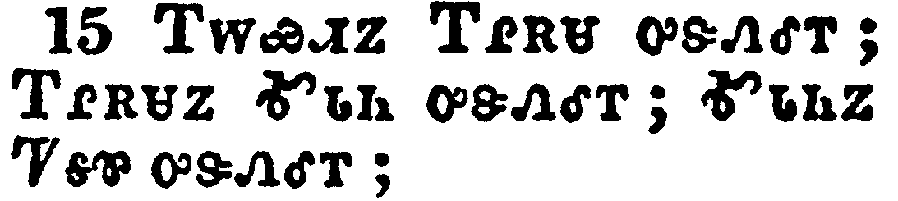</a></td>
</tr>
<tr class="even">
<td>And Eliud begat Eleazar; and Eleazar begat Matthan; and Matthan begat Jacob;</td>
</tr>
<tr class="odd">
<td>ᎢᎳᏯᏗᏃ ᎢᎵᎡᏌ ᎤᏕᏁᎴᎢ; ᎢᎵᎡᏌᏃ ᎹᏓᏂ ᎤᏕᏁᎴᎢ; ᎹᏓᏂᏃ ᏤᎦᏈ ᎤᏕᏁᎴᎢ;</td>
</tr>
<tr class="even">
<td>I-la-ya-di-no I-li-e-sa u-de-ne-le-i; I-li-e-sa-no Ma-da-ni u-de-ne-le-i; Ma-da-ni-no Tse-ga-qui u-de-ne-le-i;</td>
</tr>
</tbody>
</table>

<table>
<tbody>
<tr class="odd">
<td><a href="010116.png">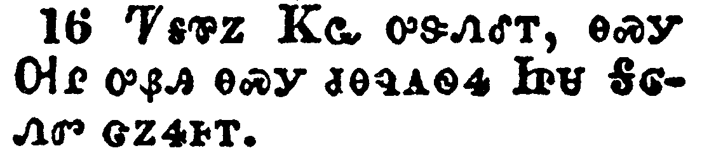</a></td>
</tr>
<tr class="even">
<td>And Jacob begat Joseph the husband of Mary, of whom was born Jesus, who is called Christ.</td>
</tr>
<tr class="odd">
<td>ᏤᎦᏈᏃ ᏦᏩ ᎤᏕᏁᎴᎢ, ᎾᏍᎩ ᎺᎵ ᎤᏰᎯ ᎾᏍᎩ ᏧᎾᏄᎪᏫᏎ ᏥᏌ ᎦᎶᏁᏛ ᏣᏃᎭᎰᎢ.</td>
</tr>
<tr class="even">
<td>Tse-ga-qui-no Tso-wa u-de-ne-le-i, na-s-gi Me-li u-ye-hi na-s-gi tsu-na-nu-go-wi-se Tsi-sa Ga-lo-ne-dv tsa-no-ha-ho-i.</td>
</tr>
</tbody>
</table>

<table>
<tbody>
<tr class="odd">
<td><a href="010117.png">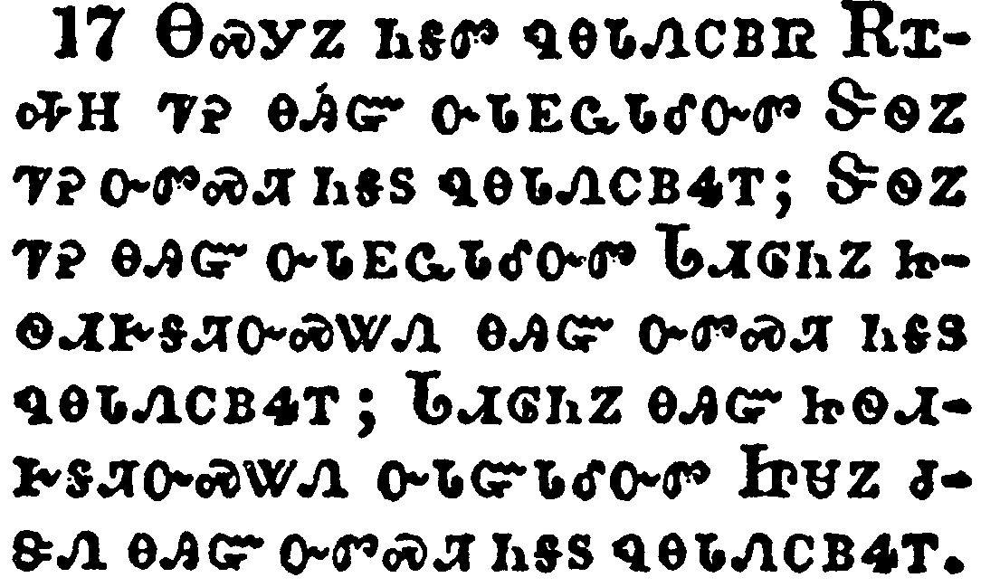</a></td>
</tr>
<tr class="even">
<td>So all the generations from Abraham to David are fourteen generations; and from David until the carrying away into Babylon are fourteen generations; and from the carrying away into Babylon unto Christ are fourteen generations.</td>
</tr>
<tr class="odd">
<td>ᎾᏍᎩᏃ ᏂᎦᏛ ᏄᎾᏓᏁᏟᏴᏒ ᎡᏆᎭᎻ ᏤᎮ ᎾᎯᏳ ᏅᏓᎬᏩᏓᎴᏅᏛ ᏕᏫᏃ ᏤᎮ ᏅᏛᏍᏘ ᏂᎦᏚ ᏄᎾᏓᏁᏟᏴᏎᎢ; ᏕᏫᏃ ᏤᎮ ᎾᎯᏳ ᏅᎵᎬᏩᏓᎴᏅᏛ ᏓᏗᎶᏂᏃ ᏥᏫᏗᎨᎦᏘᏅᏍᏔᏁ ᎾᎯᏳ ᏅᏛᏍᏘ ᏂᎦᏚ ᏄᎾᏓᏁᏟᏴᏎᎢ; ᏓᏗᎶᏂᏃ ᎾᎯᏳ ᏥᏫᏗᎨᎦᏘᏅᏍᏔᏁ ᎤᏓᏳᏓᎴᏅᏛ ᏥᏌᏃ ᏧᏕᏁ ᎾᎯᏳ ᏅᏛᏍᏘ ᏂᎦᏚ ᏄᎾᏓᏁᏟᏴᏎᎢ.</td>
</tr>
<tr class="even">
<td>Na-s-gi-no ni-ga-dv nu-na-da-ne-tli-yv-sv E-qua-ha-mi tse-he na-hi-yu nv-da-gv-wa-da-le-nv-dv De-wi-no tse-he nv-dv-s-ti ni-ga-du nu-na-da-ne-tli-yv-se-i; De-wi-no tse-he na-hi-yu nv-li-gv-wa-da-le-nv-dv Da-di-lo-ni-no tsi-wi-di-ge-ga-ti-nv-s-ta-ne na-hi-yu nv-dv-s-ti ni-ga-du nu-na-da-ne-tli-yv-se-i; Da-di-lo-ni-no na-hi-yu tsi-wi-di-ge-ga-ti-nv-s-ta-ne u-da-yu-da-le-nv-dv Tsi-sa-no tsu-de-ne na-hi-yu nv-dv-s-ti ni-ga-du nu-na-da-ne-tli-yv-se-i.</td>
</tr>
</tbody>
</table>

<table>
<tbody>
<tr class="odd">
<td><a href="010118.png">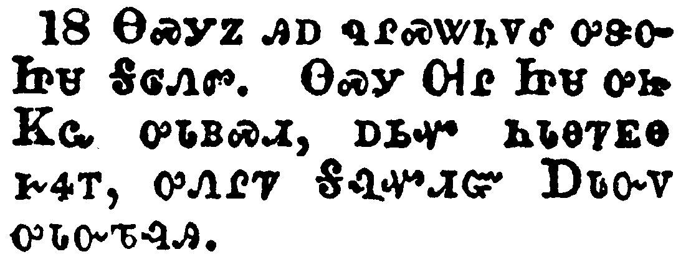</a></td>
</tr>
<tr class="even">
<td>Now the birth of Jesus Christ was on this wise: When as his mother Mary was espoused to Joseph, before they came together, she was found with child of the Holy Ghost.</td>
</tr>
<tr class="odd">
<td>ᎾᏍᎩᏃ ᎯᎠ ᏄᎵᏍᏔᏂᏙᎴ ᎤᏕᏅ ᏥᏌ ᎦᎶᏁᏛ. ᎾᏍᎩ ᎺᎵ ᏥᏌ ᎤᏥ ᏦᏩ ᎤᏓᏴᏍᏗ, ᎠᏏᏉ ᏂᏓᎾᏤᎬᎾ ᎨᏎᎢ, ᎤᏁᎵᏤ ᎦᎸᏉᏗᏳ ᎠᏓᏅᏙ ᎤᏓᏅᏖᎸᎯ.</td>
</tr>
<tr class="even">
<td>Na-s-gi-no hi-a nu-li-s-ta-ni-do-le u-de-nv Tsi-sa Ga-lo-ne-dv. Na-s-gi Me-li Tsi-sa u-tsi Tso-wa u-da-yv-s-di, a-si-quo ni-da-na-tse-gv-na ge-se-i, u-ne-li-tse Ga-lv-quo-di-yu A-da-nv-do u-da-nv-te-lv-hi.</td>
</tr>
</tbody>
</table>

<table>
<tbody>
<tr class="odd">
<td><a href="010119.png">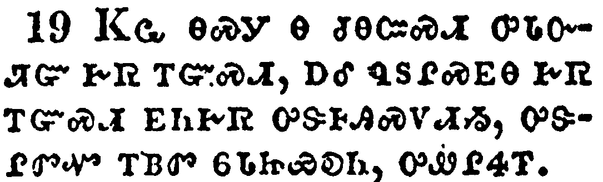</a></td>
</tr>
<tr class="even">
<td>Then Joseph her husband, being a just man, and not willing to make her a publick example, was minded to put her away privily.</td>
</tr>
<tr class="odd">
<td>ᏦᏩ ᎾᏍᎩ Ꮎ ᏧᎾᏨᏍᏗ ᎤᏓᏅᏘᏳ ᎨᏒ ᎢᏳᏍᏗ, ᎠᎴ ᏄᏚᎵᏍᎬᎾ ᎨᏒ ᎢᏳᏍᏗ ᎬᏂᎨᏒ ᎤᏕᎰᎯᏍᏙᏗᏱ, ᎤᏕᎵᏛᏉ ᎢᏴᏛ ᏮᏓᏥᏯᎧᏂ, ᎤᏪᎵᏎᎢ.</td>
</tr>
<tr class="even">
<td>Tso-wa na-s-gi na tsu-na-tsv-s-di u-da-nv-ti-yu ge-sv i-yu-s-di, a-le nu-du-li-s-gv-na ge-sv i-yu-s-di gv-ni-ge-sv u-de-ho-hi-s-do-di-yi, u-de-li-dv-quo i-yv-dv wv-da-tsi-ya-ka-ni, u-we-li-se-i.</td>
</tr>
</tbody>
</table>

<table>
<tbody>
<tr class="odd">
<td><a href="010120.png">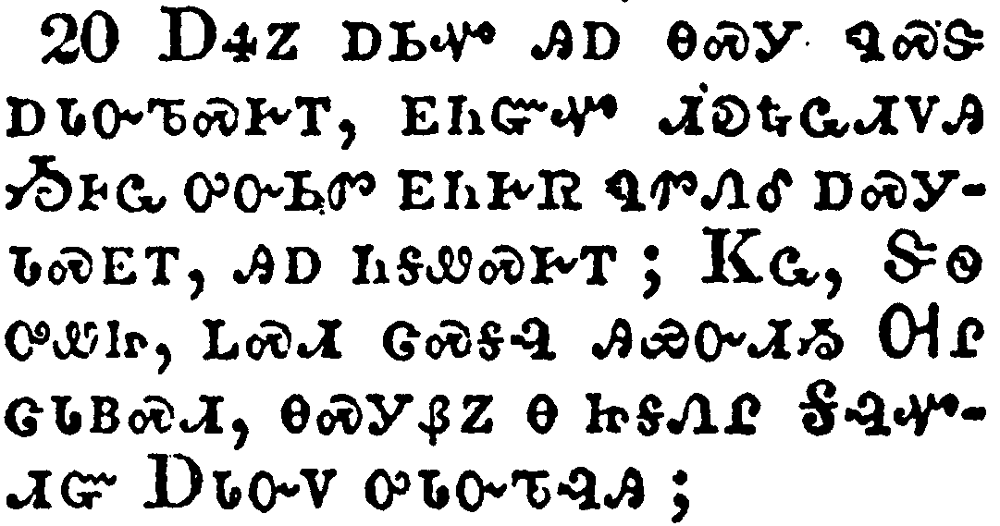</a></td>
</tr>
<tr class="even">
<td>But while he thought on these things, behold, the angel of the Lord appeared unto him in a dream, saying, Joseph, thou son of David, fear not to take unto thee Mary thy wife: for that which is conceived in her is of the Holy Ghost.</td>
</tr>
<tr class="odd">
<td>ᎠᏎᏃ ᎠᏏᏉ ᎯᎠ ᎾᏍᎩ ᏄᏍᏕᎠᏓᏅᏖᏍᎨᎢ, ᎬᏂᏳᏉ ᏗᎧᎿᎭᏩᏗᏙᎯ ᏱᎰᏩ ᎤᏅᏏᏛ ᎬᏂᎨᏒ ᏄᏛᏁᎴ ᎠᏍᎩᏓᏍᎬᎢ, ᎯᎠ ᏂᎦᏪᏍᎨᎢ; ᏦᏩ, ᏕᏫ ᎤᏪᏥ, ᏞᏍᏗ ᏣᏍᎦᎸ ᎯᏯᏅᏗᏱ ᎺᎵ ᏣᏓᏴᏍᏗ, ᎾᏍᎩᏰᏃ Ꮎ ᏥᎦᏁᎵ ᎦᎸᏉᏗᏳ ᎠᏓᏅᏙ ᎤᏓᏅᏖᎸᎯ;</td>
</tr>
<tr class="even">
<td>A-se-no a-si-quo hi-a na-s-gi nu-s-de-a-da-nv-te-s-ge-i, gv-ni-yu-quo di-ka-hna-wa-di-do-hi Yi-ho-wa u-nv-si-dv gv-ni-ge-sv nu-dv-ne-le a-s-gi-da-s-gv-i, hi-a ni-ga-we-s-ge-i; Tso-wa, De-wi u-we-tsi, tle-s-di tsa-s-ga-lv hi-ya-nv-di-yi Me-li tsa-da-yv-s-di, na-s-gi-ye-no na tsi-ga-ne-li Ga-lv-quo-di-yu A-da-nv-do u-da-nv-te-lv-hi;</td>
</tr>
</tbody>
</table>

<table>
<tbody>
<tr class="odd">
<td><a href="010121.png">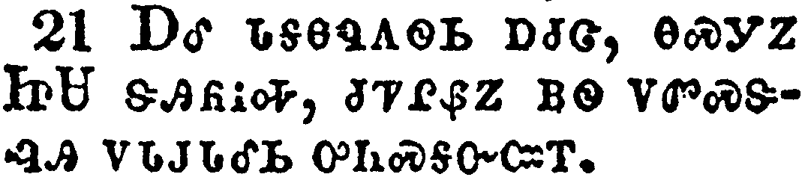</a></td>
</tr>
<tr class="even">
<td>And she shall bring forth a son, and thou shalt call his name JESUS: for he shall save his people from their sins.</td>
</tr>
<tr class="odd">
<td>ᎠᎴ ᏓᎦᎾᏄᎪᏫᏏ ᎠᏧᏣ, ᎾᏍᎩᏃ ᏥᏌ ᏕᎯᏲᎥᎭ, ᏧᏤᎵᏰᏃ ᏴᏫ ᏙᏛᏍᏕᎸᎯ ᏙᏓᎫᏓᎴᏏ ᎤᏂᏍᎦᏅᏨᎢ.</td>
</tr>
<tr class="even">
<td>A-le da-ga-na-nu-go-wi-si a-tsu-tsa, na-s-gi-no Tsi-Sa de-hi-yo-v-ha, tsu-tse-li-ye-no yv-wi do-dv-s-de-lv-hi do-da-gu-da-le-si u-ni-s-ga-nv-tsv-i.</td>
</tr>
</tbody>
</table>

<table>
<tbody>
<tr class="odd">
<td><a href="010122.png">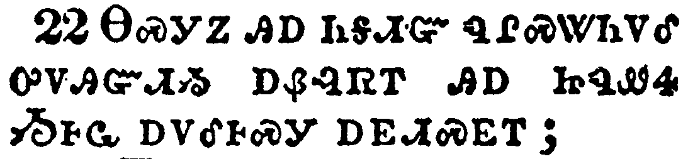</a></td>
</tr>
<tr class="even">
<td>Now all this was done, that it might be fulfilled which was spoken of the Lord by the prophet, saying,</td>
</tr>
<tr class="odd">
<td>ᎾᏍᎩᏃ ᎯᎠ ᏂᎦᏗᏳ ᏄᎵᏍᏔᏂᏙᎴ ᎤᏙᎯᏳᏗᏱ ᎠᏰᎸᏒᎢ ᎯᎠ ᏥᏄᏪᏎ ᏱᎰᏩ ᎠᏙᎴᎰᏍᎩ ᎠᎬᏗᏍᎬᎢ;</td>
</tr>
<tr class="even">
<td>Na-s-gi-no hi-a ni-ga-di-yu nu-li-s-ta-ni-do-le u-do-hi-yu-di-yi a-ye-lv-sv-i hi-a tsi-nu-we-se Yi-ho-wa a-do-le-ho-s-gi a-gv-di-s-gv-i;</td>
</tr>
</tbody>
</table>

<table>
<tbody>
<tr class="odd">
<td><a href="010123.png">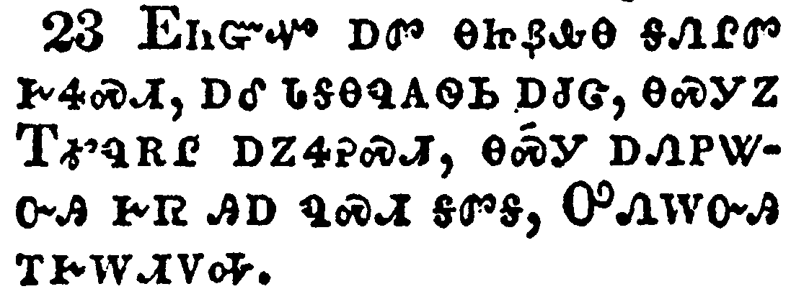</a></td>
</tr>
<tr class="even">
<td>Behold, a virgin shall be with child, and shall bring forth a son, and they shall call his name Emmanuel, which being interpreted is, God with us.</td>
</tr>
<tr class="odd">
<td>ᎬᏂᏳᏉ ᎠᏛ ᎾᏥᏰᎲᎾ ᎦᏁᎵᏛ ᎨᏎᏍᏗ, ᎠᎴ ᏓᎦᎾᏄᎪᏫᏏ ᎠᏧᏣ, ᎾᏍᎩᏃ ᎢᎹᏄᎡᎵ ᎠᏃᏎᎮᏍᏗ, ᎾᏍᎩ ᎠᏁᏢᏔᏅᎯ ᎨᏒ ᎯᎠ ᏄᏍᏗ ᎦᏛᎦ, ᎤᏁᎳᏅᎯ ᎢᎨᎳᏗᏙᎭ.</td>
</tr>
<tr class="even">
<td>Gv-ni-yu-quo a-dv na-tsi-ye-hv-na ga-ne-li-dv ge-se-s-di, a-le da-ga-na-nu-go-wi-si a-tsu-tsa, na-s-gi-no I-ma-nu-e-li a-no-se-he-s-di, na-s-gi a-ne-tlv-ta-nv-hi ge-sv hi-a nu-s-di ga-dv-ga, U-ne-la-nv-hi i-ge-la-di-do-ha.</td>
</tr>
</tbody>
</table>

<table>
<tbody>
<tr class="odd">
<td><a href="010124.png">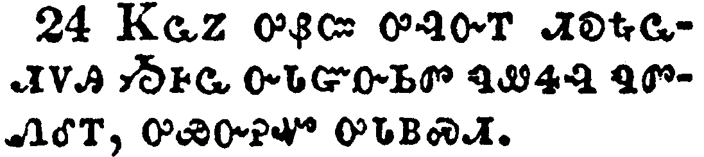</a></td>
</tr>
<tr class="even">
<td>Then Joseph being raised from sleep did as the angel of the Lord had bidden him, and took unto him his wife:</td>
</tr>
<tr class="odd">
<td>ᏦᏩᏃ ᎤᏰᏨ ᎤᎸᏅᎢ ᏗᎧᎿᎭᏩᏗᏙᎯ ᏱᎰᏩ ᏅᏓᏳᏅᏏᏛ ᏄᏪᏎᎸ ᏄᏛᏁᎴᎢ, ᎤᏯᏅᎨᏉ ᎤᏓᏴᏍᏗ.</td>
</tr>
<tr class="even">
<td>Tso-wa-no u-ye-tsv u-lv-nv-i di-ka-hna-wa-di-do-hi Yi-ho-wa nv-da-yu-nv-si-dv nu-we-se-lv nu-dv-ne-le-i, u-ya-nv-ge-quo u-da-yv-s-di.</td>
</tr>
</tbody>
</table>

<table>
<tbody>
<tr class="odd">
<td><a href="010125.png">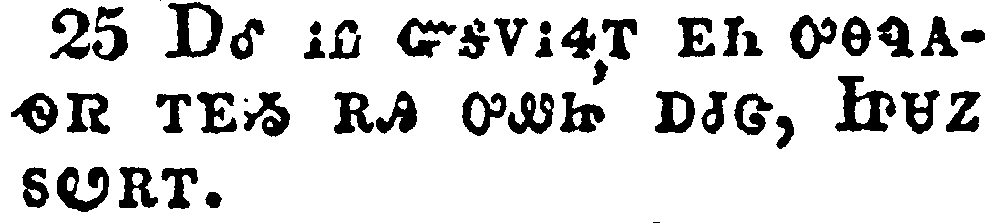</a></td>
</tr>
<tr class="even">
<td>And knew her not till she had brought forth her firstborn son: and he called his name JESUS.</td>
</tr>
<tr class="odd">
<td>ᎠᎴ ᎥᏝ ᏳᎦᏙᎥᏎᎢ ᎬᏂ ᎤᎾᏄᎪᏫᏒ ᎢᎬᏱ ᎡᎯ ᎤᏪᏥ ᎠᏧᏣ, ᏥᏌᏃ ᏑᏬᎡᎢ.</td>
</tr>
<tr class="even">
<td>A-le v-tla yu-ga-do-v-se-i gv-ni u-na-nu-go-wi-sv i-gv-yi e-hi u-we-tsi a-tsu-tsa, Tsi-sa-no su-wo-e-i.</td>
</tr>
</tbody>
</table>

