+++
draft=false
date = 2014-12-18T21:11:07Z
title = "Matthew - Chapter 10 - Cherokee New Testament"
weight = 1418955067

[taxonomies]

authors = ["Timothy Legg"]
categories = []
tags = []

[extra]
+++

<table>
<tbody>
<tr class="odd">
<td><a href="011001.png">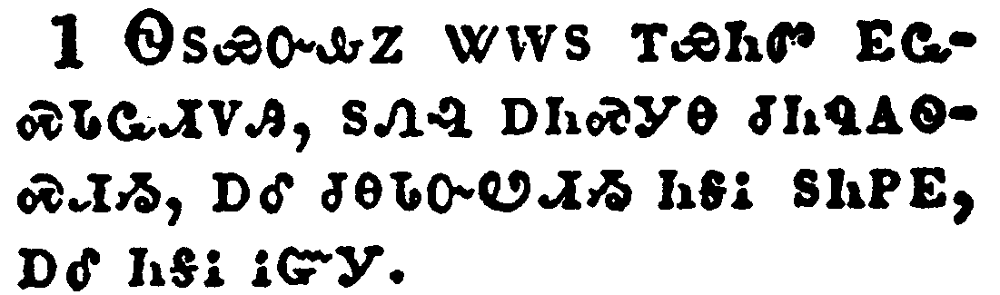</a></td>
</tr>
<tr class="even">
<td>And when he had called unto him his twelve disciples, he gave them power against unclean spirits, to cast them out, and to heal all manner of sickness and all manner of disease.</td>
</tr>
<tr class="odd">
<td>ᏫᏚᏯᏅᎲᏃ ᏔᎳᏚ ᎢᏯᏂᏛ ᎬᏩᏍᏓᏩᏗᏙᎯ, ᏚᏁᎸ ᎠᏂᏍᎩᎾ ᏧᏂᏄᎪᏫᏍᏗᏱ, ᎠᎴ ᏧᎾᏓᏅᏬᏗᏱ ᏂᎦᎥ ᏚᏂᏢᎬ, ᎠᎴ ᏂᎦᎥ ᎥᏳᎩ.</td>
</tr>
<tr class="even">
<td>Wi-du-ya-nv-hv-no ta-la-du i-ya-ni-dv gv-wa-s-da-wa-di-do-hi, du-ne-lv a-ni-s-gi-na tsu-ni-nu-go-wi-s-di-yi, a-le tsu-na-da-nv-wo-di-yi ni-ga-v du-ni-tlv-gv, a-le ni-ga-v v-yu-gi.</td>
</tr>
</tbody>
</table>

<table>
<tbody>
<tr class="odd">
<td><a href="011002.png">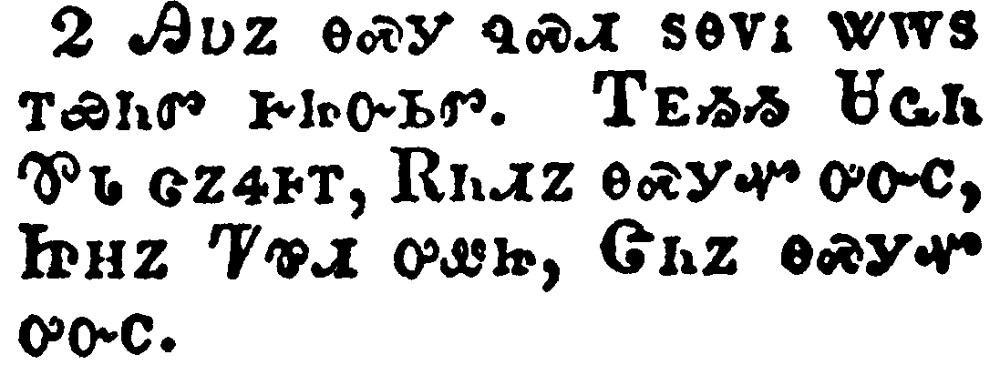</a></td>
</tr>
<tr class="even">
<td>Now the names of the twelve apostles are these; The first, Simon, who is called Peter, and Andrew his brother; James the son of Zebedee, and John his brother;</td>
</tr>
<tr class="odd">
<td>ᎯᎠᏃ ᎾᏍᎩ ᏄᏍᏗ ᏚᎾᏙᎥ ᏔᎳᏚ ᎢᏯᏂᏛ ᎨᏥᏅᏏᏛ. ᎢᎬᏱᏱ ᏌᏩᏂ ᏈᏓ ᏣᏃᏎᎰᎢ, ᎡᏂᏗᏃ ᎾᏍᎩᏉ ᎤᏅᏟ, ᏥᎻᏃ ᏤᏈᏗ ᎤᏪᏥ, ᏣᏂᏃ ᎾᏍᎩᏉ ᎤᏅᏟ.</td>
</tr>
<tr class="even">
<td>Hi-a-no na-s-gi nu-s-di du-na-do-v ta-la-du i-ya-ni-dv ge-tsi-nv-si-dv. I-gv-yi-yi Sa-wa-ni Qui-da tsa-no-se-ho-i, E-ni-di-no na-s-gi-quo u-nv-tli, Tsi-mi-no Tse-qui-di u-we-tsi, Tsa-ni-no na-s-gi-quo u-nv-tli.</td>
</tr>
</tbody>
</table>

<table>
<tbody>
<tr class="odd">
<td><a href="011003.png">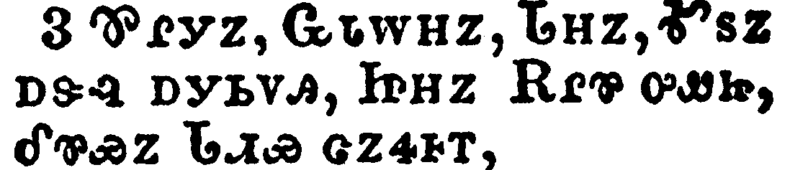</a></td>
</tr>
<tr class="even">
<td>Philip, and Bartholomew; Thomas, and Matthew the publican; James the son of Alphaeus, and Lebbaeus, whose surname was Thaddaeus;</td>
</tr>
<tr class="odd">
<td>ᏈᎵᎩᏃ, ᏩᏓᎳᎻᏃ, ᏓᎻᏃ, ᎹᏚᏃ ᎠᏕᎸ ᎠᎩᏏᏙᎯ, ᏥᎻᏃ ᎡᎵᏈ ᎤᏪᏥ, ᎴᏈᏯᏃ ᏓᏗᏯ ᏣᏃᏎᎰᎢ,</td>
</tr>
<tr class="even">
<td>Qui-li-gi-no, Wa-da-la-mi-no, Da-mi-no, Ma-du-no a-de-lv a-gi-si-do-hi, Tsi-mi-no E-li-qui u-we-tsi, Le-qui-ya-no Da-di-ya tsa-no-se-ho-i,</td>
</tr>
</tbody>
</table>

<table>
<tbody>
<tr class="odd">
<td><a href="011004.png">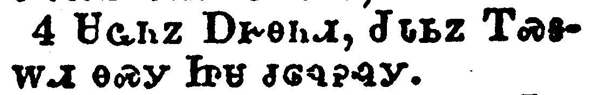</a></td>
</tr>
<tr class="even">
<td>Simon the Canaanite, and Judas Iscariot, who also betrayed him.</td>
</tr>
<tr class="odd">
<td>ᏌᏩᏂᏃ ᎠᎨᎾᏂᏗ, ᏧᏓᏏᏃ ᎢᏍᎦᎳᏗ ᎾᏍᎩ ᏥᏌ ᏧᎶᏄᎮᎸᎩ.</td>
</tr>
<tr class="even">
<td>Sa-wa-ni-no A-ge-na-ni-di, Tsu-da-si-no I-s-ga-la-di na-s-gi Tsi-sa tsu-lo-nu-he-lv-gi.</td>
</tr>
</tbody>
</table>

<table>
<tbody>
<tr class="odd">
<td><a href="011005.png">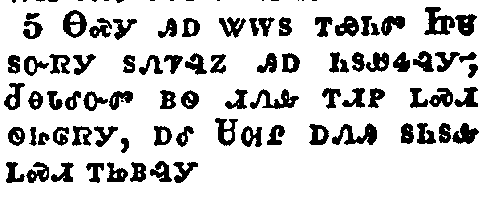</a></td>
</tr>
<tr class="even">
<td>These twelve Jesus sent forth, and commanded them, saying, Go not into the way of the Gentiles, and into any city of the Samaritans enter ye not:</td>
</tr>
<tr class="odd">
<td>ᎾᏍᎩ ᎯᎠ ᏔᎳᏚ ᎢᏯᏂᏛ ᏥᏌ ᏚᏅᏒᎩ ᏚᏁᏤᎸᏃ ᎯᎠ ᏂᏚᏪᏎᎸᎩ; ᏧᎾᏓᎴᏅᏛ ᏴᏫ ᏗᏁᎲ ᎢᏗᏢ ᏞᏍᏗ ᏫᏥᎶᏒᎩ, ᎠᎴ ᏌᎺᎵ ᎠᏁᎯ ᏚᏂᏚᎲ ᏞᏍᏗ ᎢᏥᏴᎸᎩ</td>
</tr>
<tr class="even">
<td>Na-s-gi hi-a ta-la-du i-ya-ni-dv Tsi-sa du-nv-sv-gi du-ne-tse-lv-no hi-a ni-du-we-se-lv-gi; Tsu-na-da-le-nv-dv yv-wi di-ne-hv i-di-tlv tle-s-di wi-tsi-lo-sv-gi, a-le Sa-me-li a-ne-hi du-ni-du-hv tle-s-di i-tsi-yv-lv-gi</td>
</tr>
</tbody>
</table>

<table>
<tbody>
<tr class="odd">
<td><a href="011006.png">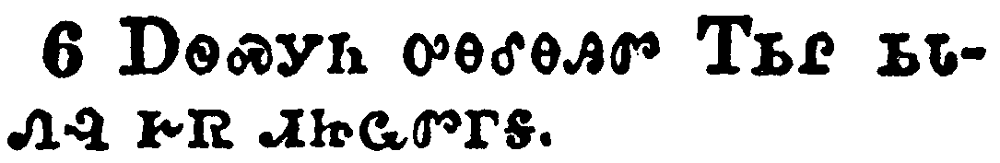</a></td>
</tr>
<tr class="even">
<td>But go rather to the lost sheep of the house of Israel.</td>
</tr>
<tr class="odd">
<td>ᎠᏫᏍᎩᏂ ᎤᎾᎴᎾᎯᏛ ᎢᏏᎵ ᏏᏓᏁᎸ ᎨᏒ ᏗᏥᏩᏛᎱᎦ.</td>
</tr>
<tr class="even">
<td>A-wi-s-gi-ni u-na-le-na-hi-dv I-si-li si-da-ne-lv ge-sv di-tsi-wa-dv-hu-ga.</td>
</tr>
</tbody>
</table>

<table>
<tbody>
<tr class="odd">
<td><a href="011007.png">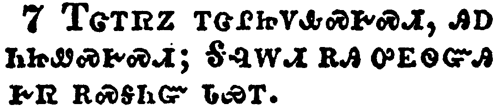</a></td>
</tr>
<tr class="even">
<td>And as ye go, preach, saying, The kingdom of heaven is at hand.</td>
</tr>
<tr class="odd">
<td>ᎢᏣᎢᏒᏃ ᎢᏣᎵᏥᏙᎲᏍᎨᏍᏗ, ᎯᎠ ᏂᏥᏪᏍᎨᏍᏗ; ᎦᎸᎳᏗ ᎡᎯ ᎤᎬᏫᏳᎯ ᎨᏒ ᎡᏍᎦᏂᏳ ᏓᏯᎢ.</td>
</tr>
<tr class="even">
<td>I-tsa-i-sv-no i-tsa-li-tsi-do-hv-s-ge-s-di, hi-a ni-tsi-we-s-ge-s-di; Ga-lv-la-di e-hi u-gv-wi-yu-hi ge-sv e-s-ga-ni-yu da-ya-i.</td>
</tr>
</tbody>
</table>

<table>
<tbody>
<tr class="odd">
<td><a href="011008.png">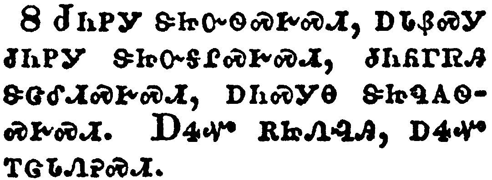</a></td>
</tr>
<tr class="even">
<td>Heal the sick, cleanse the lepers, raise the dead, cast out devils: freely ye have received, freely give.</td>
</tr>
<tr class="odd">
<td>ᏧᏂᏢᎩ ᏕᏥᏅᏫᏍᎨᏍᏗ, ᎠᏓᏰᏍᎩ ᏧᏂᏢᎩ ᏕᏥᏅᎦᎵᏍᎨᏍᏗ, ᏧᏂᏲᎱᏒᎯ ᏕᏣᎴᏗᏍᎨᏍᏗ, ᎠᏂᏍᎩᎾ ᏕᏥᏄᎪᏫᏍᎨᏍᏗ. ᎠᏎᏉ ᎡᏥᏁᎸᎯ, ᎠᏎᏉ ᎢᏣᏓᏁᎮᏍᏗ.</td>
</tr>
<tr class="even">
<td>Tsu-ni-tlv-gi de-tsi-nv-wi-s-ge-s-di, a-da-ye-s-gi tsu-ni-tlv-gi de-tsi-nv-ga-li-s-ge-s-di, tsu-ni-yo-hu-sv-hi de-tsa-le-di-s-ge-s-di, a-ni-s-gi-na de-tsi-nu-go-wi-s-ge-s-di. A-se-quo e-tsi-ne-lv-hi, a-se-quo i-tsa-da-ne-he-s-di.</td>
</tr>
</tbody>
</table>

<table>
<tbody>
<tr class="odd">
<td><a href="011009.png">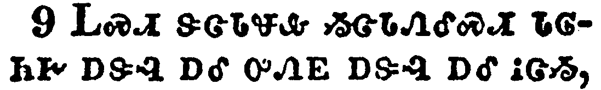</a></td>
</tr>
<tr class="even">
<td>Provide neither gold, nor silver, nor brass in your purses,</td>
</tr>
<tr class="odd">
<td>ᏞᏍᏗ ᏕᏣᏓᏠᎲ ᏱᏣᏓᏁᎴᏍᏗ ᏓᎶᏂᎨ ᎠᏕᎸ ᎠᎴ ᎤᏁᎬ ᎠᏕᎸ ᎠᎴ ᎥᏣᏱ,</td>
</tr>
<tr class="even">
<td>Tle-s-di de-tsa-da-tlo-hv yi-tsa-da-ne-le-s-di da-lo-ni-ge a-de-lv a-le u-ne-gv a-de-lv a-le v-tsa-yi,</td>
</tr>
</tbody>
</table>

<table>
<tbody>
<tr class="odd">
<td><a href="011010.png">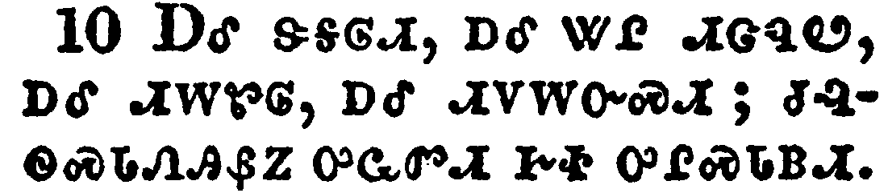</a></td>
</tr>
<tr class="even">
<td>Nor scrip for your journey, neither two coats, neither shoes, nor yet staves: for the workman is worthy of his meat.</td>
</tr>
<tr class="odd">
<td>ᎠᎴ ᏕᎦᎶᏗ, ᎠᎴ ᏔᎵ ᏗᏣᏄᏬ, ᎠᎴ ᏗᎳᏑᎶ, ᎠᎴ ᏗᏙᎳᏅᏍᏗ; ᏧᎸᏫᏍᏓᏁᎯᏰᏃ ᎤᏩᏛᏗ ᎨᏐ ᎤᎵᏍᏓᏴᏗ.</td>
</tr>
<tr class="even">
<td>A-le de-ga-lo-di, a-le ta-li di-tsa-nu-wo, a-le di-la-su-lo, a-le di-do-la-nv-s-di; tsu-lv-wi-s-da-ne-hi-ye-no u-wa-dv-di ge-so u-li-s-da-yv-di.</td>
</tr>
</tbody>
</table>

<table>
<tbody>
<tr class="odd">
<td><a href="011011.png">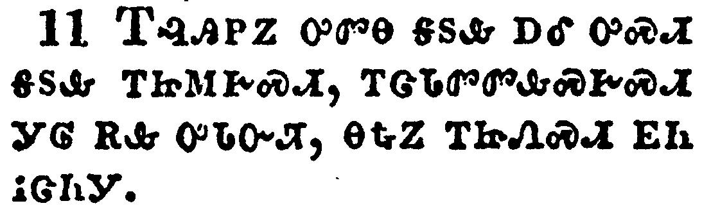</a></td>
</tr>
<tr class="even">
<td>And into whatsoever city or town ye shall enter, inquire who in it is worthy; and there abide till ye go thence.</td>
</tr>
<tr class="odd">
<td>ᎢᎸᎯᏢᏃ ᎤᏛᎾ ᎦᏚᎲ ᎠᎴ ᎤᏍᏗ ᎦᏚᎲ ᎢᏥᎷᎨᏍᏗ, ᎢᏣᏓᏛᏛᎲᏍᎨᏍᏗ ᎩᎶ ᎡᎲ ᎤᏓᏅᏘ, ᎾᎿᎭᏃ ᎢᏥᏁᏍᏗ ᎬᏂ ᎥᏣᏂᎩ.</td>
</tr>
<tr class="even">
<td>I-lv-hi-tlv-no u-dv-na ga-du-hv a-le u-s-di ga-du-hv i-tsi-lu-ge-s-di, i-tsa-da-dv-dv-hv-s-ge-s-di gi-lo e-hv u-da-nv-ti, na-hna-no i-tsi-ne-s-di gv-ni v-tsa-ni-gi.</td>
</tr>
</tbody>
</table>

<table>
<tbody>
<tr class="odd">
<td></td>
</tr>
<tr class="even">
<td>And when ye come into an house, salute it.</td>
</tr>
<tr class="odd">
<td>ᎠᏓᏁᎸᏃ ᎢᏥᏴᎭ ᎢᏥᏲᎵᎮᏍᏗ.</td>
</tr>
<tr class="even">
<td>A-da-ne-lv-no i-tsi-yv-ha i-tsi-yo-li-he-s-di.</td>
</tr>
</tbody>
</table>

<table>
<tbody>
<tr class="odd">
<td><a href="011013.png">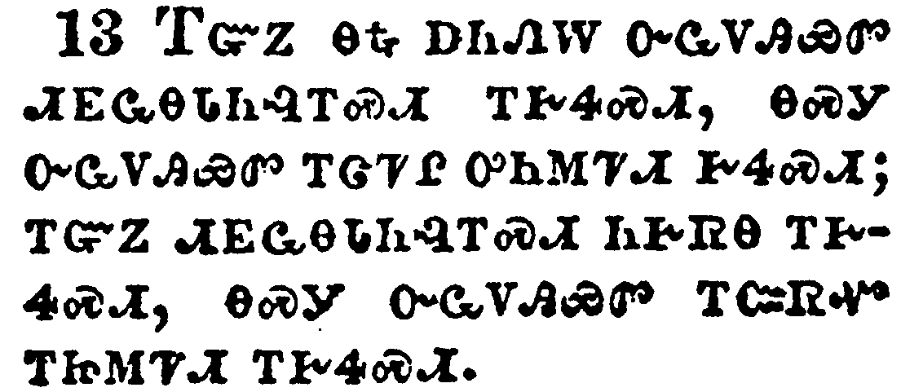</a></td>
</tr>
<tr class="even">
<td>And if the house be worthy, let your peace come upon it: but if it be not worthy, let your peace return to you.</td>
</tr>
<tr class="odd">
<td>ᎢᏳᏃ ᎾᎿᎭᎠᏂᏁᎳ ᎤᏩᏙᎯᏯᏛ ᏗᎬᏩᎾᏓᏂᎸᎢᏍᏗ ᎢᎨᏎᏍᏗ, ᎾᏍᎩ ᎤᏩᏙᎯᏯᏛ ᎢᏣᏤᎵ ᎤᏂᎷᏤᏗ ᎨᏎᏍᏗ; ᎢᏳᏃ ᏗᎬᏩᎾᏓᏂᎸᎢᏍᏗ ᏂᎨᏒᎾ ᎢᎨᏎᏍᏗ, ᎾᏍᎩ ᏅᏩᏙᎯᏯᏛ ᎢᏨᏒᏉ ᎢᏥᎷᏤᏗ ᎢᎨᏎᏍᏗ.</td>
</tr>
<tr class="even">
<td>I-yu-no na-hna a-ni-ne-la u-wa-do-hi-ya-dv di-gv-wa-na-da-ni-lv-i-s-di i-ge-se-s-di, na-s-gi u-wa-do-hi-ya-dv i-tsa-tse-li u-ni-lu-tse-di ge-se-s-di; i-yu-no di-gv-wa-na-da-ni-lv-i-s-di ni-ge-sv-na i-ge-se-s-di, na-s-gi nv-wa-do-hi-ya-dv i-tsv-sv-quo i-tsi-lu-tse-di i-ge-se-s-di.</td>
</tr>
</tbody>
</table>

<table>
<tbody>
<tr class="odd">
<td><a href="011014.png">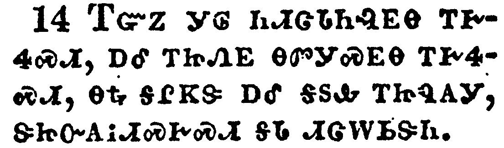</a></td>
</tr>
<tr class="even">
<td>And whosoever shall not receive you, nor hear your words, when ye depart out of that house or city, shake off the dust of your feet.</td>
</tr>
<tr class="odd">
<td>ᎢᏳᏃ ᎩᎶ ᏂᏗᏣᏓᏂᎸᎬᎾ ᎢᎨᏎᏍᏗ, ᎠᎴ ᎢᏥᏁᎬ ᎾᏛᎩᏍᎬᎾ ᎢᎨᏎᏍᏗ, ᎾᎿᎭᎦᎵᏦᏕ ᎠᎴ ᎦᏚᎲ ᎢᏥᏄᎪᎩ, ᏕᏥᏅᎪᎥᏗᏍᎨᏍᏗ ᎦᏓ ᏗᏣᎳᏏᏕᏂ.</td>
</tr>
<tr class="even">
<td>I-yu-no gi-lo ni-di-tsa-da-ni-lv-gv-na i-ge-se-s-di, a-le i-tsi-ne-gv na-dv-gi-s-gv-na i-ge-se-s-di, na-hna ga-li-tso-de a-le ga-du-hv i-tsi-nu-go-gi, de-tsi-nv-go-v-di-s-ge-s-di ga-da di-tsa-la-si-de-ni.</td>
</tr>
</tbody>
</table>

<table>
<tbody>
<tr class="odd">
<td><a href="011015.png">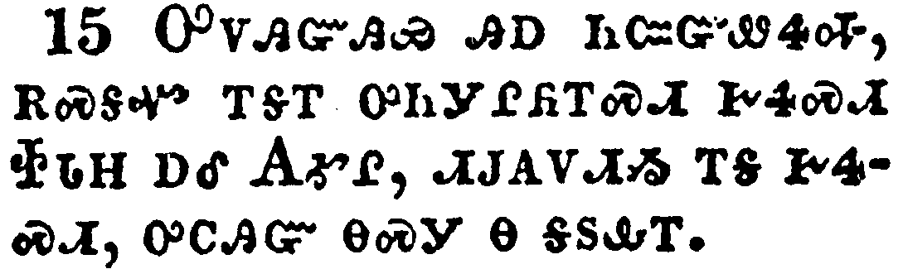</a></td>
</tr>
<tr class="even">
<td>Verily I say unto you, It shall be more tolerable for the land of Sodom and Gomorrha in the day of judgment, than for that city.</td>
</tr>
<tr class="odd">
<td>ᎤᏙᎯᏳᎯᏯ ᎯᎠ ᏂᏨᏳᏪᏎᎭ, ᎡᏍᎦᏉ ᎢᎦᎢ ᎤᏂᎩᎵᏲᎢᏍᏗ ᎨᏎᏍᏗ ᏐᏓᎻ ᎠᎴ ᎪᎹᎵ, ᏗᎫᎪᏙᏗᏱ ᎢᎦ ᎨᏎᏍᏗ, ᎤᏟᎯᏳ ᎾᏍᎩ Ꮎ ᎦᏚᎲᎢ.</td>
</tr>
<tr class="even">
<td>U-do-hi-yu-hi-ya hi-a ni-tsv-yu-we-se-ha, e-s-ga-quo i-ga-i u-ni-gi-li-yo-i-s-di ge-se-s-di So-da-mi a-le Go-ma-li, di-gu-go-do-di-yi i-ga ge-se-s-di, u-tli-hi-yu na-s-gi na ga-du-hv-i.</td>
</tr>
</tbody>
</table>

<table>
<tbody>
<tr class="odd">
<td><a href="011016.png">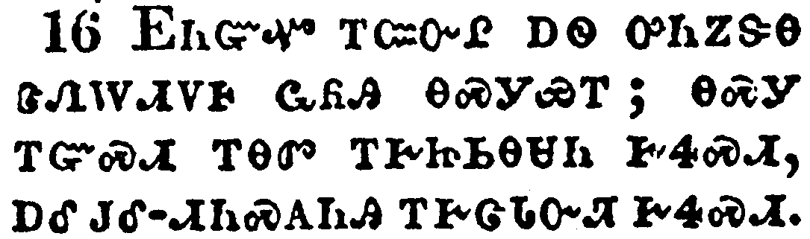</a></td>
</tr>
<tr class="even">
<td>Behold, I send you forth as sheep in the midst of wolves: be ye therefore wise as serpents, and harmless as doves.</td>
</tr>
<tr class="odd">
<td>ᎬᏂᏳᏉ ᎢᏨᏅᎵ ᎠᏫ ᎤᏂᏃᏕᎾ ᏣᏁᎳᏗᏙᎰ ᏩᏲᎯ ᎾᏍᎩᏯᎢ; ᎾᏍᎩ ᎢᏳᏍᏗ ᎢᎾᏛ ᎢᎨᏥᏏᎾᏌᏂ ᎨᏌᏍᏗ, ᎠᎴ ᎫᎴ-ᏗᏂᏍᎪᏂᎯ ᎢᎨᏣᏓᏅᏘ ᎨᏎᏍᏗ.</td>
</tr>
<tr class="even">
<td>Gv-ni-yu-quo i-tsv-nv-li a-wi u-ni-no-de-na tsa-ne-la-di-do-ho wa-yo-hi na-s-gi-ya-i; na-s-gi i-yu-s-di i-na-dv i-ge-tsi-si-na-sa-ni ge-sa-s-di, a-le gu-le--di-ni-s-go-ni-hi i-ge-tsa-da-nv-ti ge-se-s-di.</td>
</tr>
</tbody>
</table>

<table>
<tbody>
<tr class="odd">
<td><a href="011017.png">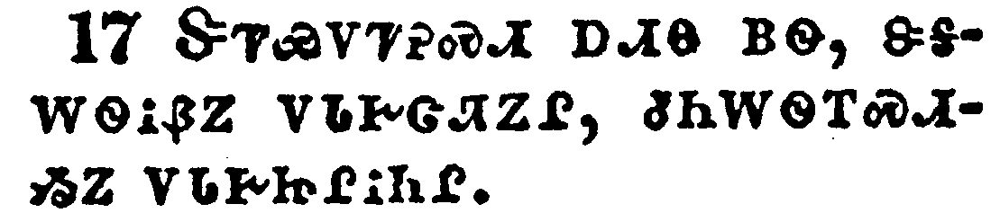</a></td>
</tr>
<tr class="even">
<td>But beware of men: for they will deliver you up to the councils, and they will scourge you in their synagogues;</td>
</tr>
<tr class="odd">
<td>ᏕᏤᏯᏙᏤᎮᏍᏗ ᎠᏗᎾ ᏴᏫ, ᏕᎦᎳᏫᎥᏰᏃ ᏙᏓᎨᏣᏘᏃᎵ, ᏧᏂᎳᏫᎢᏍᏗᏱᏃ ᏙᏓᎨᏥᎵᎥᏂᎵ.</td>
</tr>
<tr class="even">
<td>De-tse-ya-do-tse-he-s-di a-di-na yv-wi, de-ga-la-wi-v-ye-no do-da-ge-tsa-ti-no-li, tsu-ni-la-wi-i-s-di-yi-no do-da-ge-tsi-li-v-ni-li.</td>
</tr>
</tbody>
</table>

<table>
<tbody>
<tr class="odd">
<td><a href="011018.png">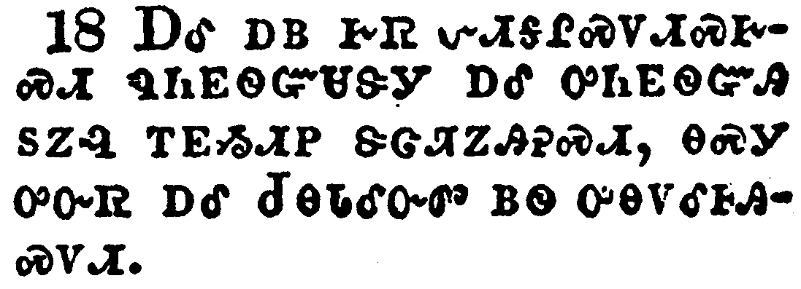</a></td>
</tr>
<tr class="even">
<td>And ye shall be brought before governors and kings for my sake, for a testimony against them and the Gentiles.</td>
</tr>
<tr class="odd">
<td>ᎠᎴ ᎠᏴ ᎨᏒ ᏅᏗᎦᎵᏍᏙᏗᏍᎨᏍᏗ ᏄᏂᎬᏫᏳᏌᏕᎩ ᎠᎴ ᎤᏂᎬᏫᏳᎯ ᏚᏃᎸ ᎢᎬᏱᏗᏢ ᏕᏣᏘᏃᎯᎮᏍᏗ, ᎾᏍᎩ ᎤᏅᏒ ᎠᎴ ᏧᎾᏓᎴᏅᏛ ᏴᏫ ᎤᎾᏙᎴᎰᎯᏍᏙᏗ.</td>
</tr>
<tr class="even">
<td>A-le a-yv ge-sv nv-di-ga-li-s-do-di-s-ge-s-di nu-ni-gv-wi-yu-sa-de-gi a-le u-ni-gv-wi-yu-hi du-no-lv i-gv-yi-di-tlv de-tsa-ti-no-hi-he-s-di, na-s-gi u-nv-sv a-le Tsu-na-da-le-nv-dv yv-wi u-na-do-le-ho-hi-s-do-di.</td>
</tr>
</tbody>
</table>

<table>
<tbody>
<tr class="odd">
<td><a href="011019.png">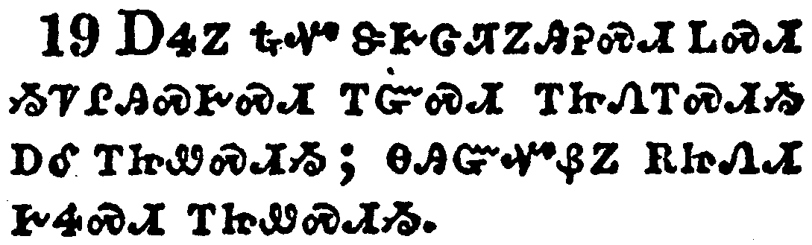</a></td>
</tr>
<tr class="even">
<td>But when they deliver you up, take no thought how or what ye shall speak: for it shall be given you in that same hour what ye shall speak.</td>
</tr>
<tr class="odd">
<td>ᎠᏎᏃ ᎿᎭᏉ ᏕᎨᏣᏘᏃᎯᎮᏍᏗ ᏞᏍᏗ ᏱᏤᎵᎯᏍᎨᏍᏗ ᎢᏳᏍᏗ ᎢᏥᏁᎢᏍᏗᏱ ᎠᎴ ᎢᏥᏪᏍᏗᏱ; ᎾᎯᏳᏉᏰᏃ ᎡᏥᏁᏗ ᎨᏎᏍᏗ ᎢᏥᏪᏍᏗᏱ.</td>
</tr>
<tr class="even">
<td>A-se-no hna-quo de-ge-tsa-ti-no-hi-he-s-di tle-s-di yi-tse-li-hi-s-ge-s-di i-yu-s-di i-tsi-ne-i-s-di-yi a-le i-tsi-we-s-di-yi; na-hi-yu-quo-ye-no e-tsi-ne-di ge-se-s-di i-tsi-we-s-di-yi.</td>
</tr>
</tbody>
</table>

<table>
<tbody>
<tr class="odd">
<td><a href="011020.png">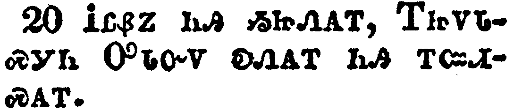</a></td>
</tr>
<tr class="even">
<td>For it is not ye that speak, but the Spirit of your Father which speaketh in you.</td>
</tr>
<tr class="odd">
<td>ᎥᏝᏰᏃ ᏂᎯ ᏱᏥᏁᎪᎢ, ᎢᏥᏙᏓᏍᎩᏂ ᎤᏓᏅᏙ ᎧᏁᎪᎢ ᏂᎯ ᎢᏨᏗᏍᎪᎢ.</td>
</tr>
<tr class="even">
<td>V-tla-ye-no ni-hi yi-tsi-ne-go-i, I-tsi-do-da-s-gi-ni U-da-nv-do ka-ne-go-i ni-hi i-tsv-di-s-go-i.</td>
</tr>
</tbody>
</table>

<table>
<tbody>
<tr class="odd">
<td></td>
</tr>
<tr class="even">
<td>And the brother shall deliver up the brother to death, and the father the child: and the children shall rise up against their parents, and cause them to be put to death.</td>
</tr>
<tr class="odd">
<td>ᎠᏍᎦᏯᏃ ᏙᏓᏳᏲᏏ ᎤᏲᎱᎯᏍᏗᏱ ᏗᎾᏓᏅᏟ, ᎠᎦᏴᎵᎨᏃ ᎤᏪᏥ ᏙᏓᏳᏲᏏ, ᎠᎴ ᎣᏂ ᏧᎾᏛᏒᎯ ᏙᏛᎾᏡᏔᏂ ᏧᏂᎦᏴᎵᎨᎢ, ᎠᎴ ᎾᏍᎩ ᏅᏛᏅᏂᏌᏂ ᏗᎨᏥᎢᏍᏗ ᎨᏎᏍᏗ.</td>
</tr>
<tr class="even">
<td>A-s-ga-ya-no do-da-yu-yo-si u-yo-hu-hi-s-di-yi di-na-da-nv-tli, a-ga-yv-li-ge-no u-we-tsi do-da-yu-yo-si, a-le o-ni tsu-na-dv-sv-hi do-dv-na-tlu-ta-ni tsu-ni-ga-yv-li-ge-i, a-le na-s-gi nv-dv-nv-ni-sa-ni di-ge-tsi-i-s-di ge-se-s-di.</td>
</tr>
</tbody>
</table>

<table>
<tbody>
<tr class="odd">
<td><a href="011022.png">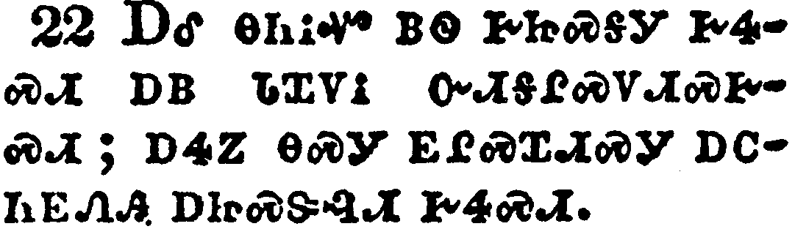</a></td>
</tr>
<tr class="even">
<td>And ye shall be hated of all men for my name's sake: but he that endureth to the end shall be saved.</td>
</tr>
<tr class="odd">
<td>ᎠᎴ ᎾᏂᎥᏉ ᏴᏫ ᎨᏥᏍᎦᎩ ᎨᏎᏍᏗ ᎠᏴ ᏓᏆᏙᎥ ᏅᏗᎦᎵᏍᏙᏗᏍᎨᏍᏗ; ᎠᏎᏃ ᎾᏍᎩ ᎬᎵᏍᏆᏗᏍᎩ ᎠᏟᏂᎬᏁᎯ ᎠᏥᏍᏕᎸᏗ ᎨᏎᏍᏗ.</td>
</tr>
<tr class="even">
<td>A-le na-ni-v-quo yv-wi ge-tsi-s-ga-gi ge-se-s-di a-yv da-qua-do-v nv-di-ga-li-s-do-di-s-ge-s-di; a-se-no na-s-gi gv-li-s-qua-di-s-gi a-tli-ni-gv-ne-hi a-tsi-s-de-lv-di ge-se-s-di.</td>
</tr>
</tbody>
</table>

<table>
<tbody>
<tr class="odd">
<td><a href="011023.png">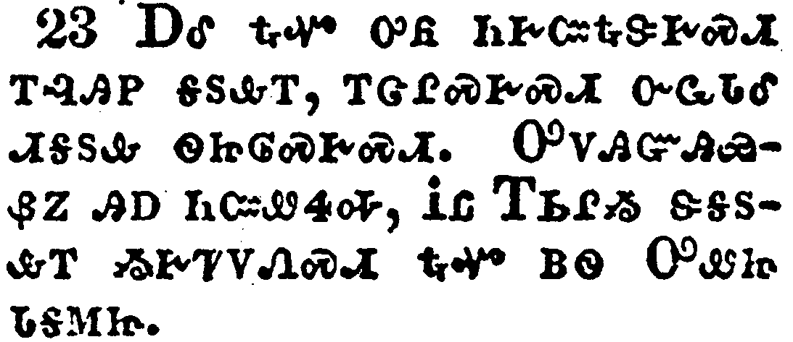</a></td>
</tr>
<tr class="even">
<td>But when they persecute you in this city, flee ye into another: for verily I say unto you, Ye shall not have gone over the cities of Israel, till the Son of man be come.</td>
</tr>
<tr class="odd">
<td>ᎠᎴ ᎿᎭᏉ ᎤᏲ ᏂᎨᏨᎿᎭᏕᎨᏍᏗ ᎢᎸᎯᏢ ᎦᏚᎲᎢ, ᎢᎶᎵᏍᎨᏍᏗ ᏅᏩᎵᎴ ᏗᎦᏚᎲ ᏫᏥᎶᏍᎨᏍᏗ. ᎤᏙᎯᏳᎯᏯᏰᏃ ᎯᎠ ᏂᏨᏪᏎᎭ, ᎥᏝ ᎢᏏᎵᏱ ᏕᎦᏚᎲᎢ ᏱᎨᏤᏙᏁᏍᏗ ᎿᎭᏉ ᏴᏫ ᎤᏪᏥ ᏓᎦᎷᏥ.</td>
</tr>
<tr class="even">
<td>A-le hna-quo u-yo ni-ge-tsv-hna-de-ge-s-di i-lv-hi-tlv ga-du-hv-i, i-lo-li-s-ge-s-di nv-wa-li-le di-ga-du-hv wi-tsi-lo-s-ge-s-di. U-do-hi-yu-hi-ya-ye-no hi-a ni-tsv-we-se-ha, V-tla I-si-li-yi de-ga-du-hv-i yi-ge-tse-do-ne-s-di hna-quo yv-wi U-we-tsi da-ga-lu-tsi.</td>
</tr>
</tbody>
</table>

<table>
<tbody>
<tr class="odd">
<td><a href="011024.png">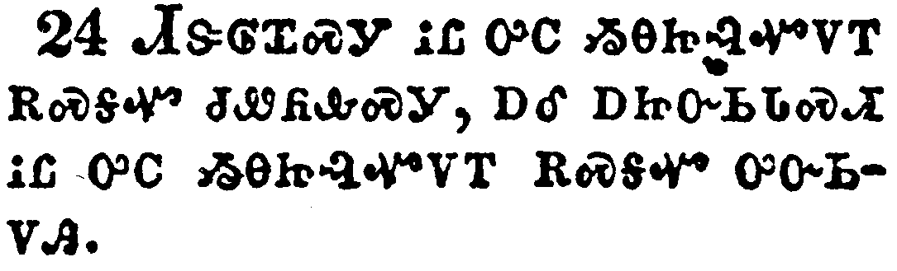</a></td>
</tr>
<tr class="even">
<td>The disciple is not above his master, nor the servant above his lord.</td>
</tr>
<tr class="odd">
<td>ᏗᏕᎶᏆᏍᎩ ᎥᏝ ᎤᏟ ᏱᎾᏥᎸᏉᏙᎢ ᎡᏍᎦᏉ ᏧᏪᏲᎲᏍᎩ, ᎠᎴ ᎠᏥᏅᏏᏓᏍᏗ ᎥᏝ ᎤᏟ ᏱᎾᏥᎸᏉᏙᎢ ᏒᏍᎦᏉ ᎤᏅᏏᏙᎯ.</td>
</tr>
<tr class="even">
<td>Di-de-lo-qua-s-gi v-tla u-tli yi-na-tsi-lv-quo-do-i e-s-ga-quo tsu-we-yo-hv-s-gi, a-le a-tsi-nv-si-da-s-di v-tla u-tli yi-na-tsi-lv-quo-do-i sv-s-ga-quo u-nv-si-do-hi.</td>
</tr>
</tbody>
</table>

<table>
<tbody>
<tr class="odd">
<td><a href="011025.png">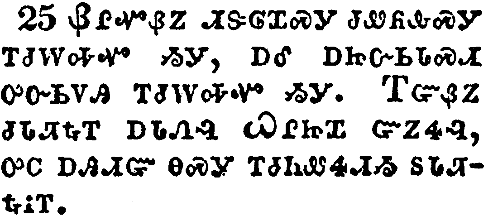</a></td>
</tr>
<tr class="even">
<td>It is enough for the disciple that he be as his master, and the servant as his lord. If they have called the master of the house Beelzebub, how much more shall they call them of his household?</td>
</tr>
<tr class="odd">
<td>ᏰᎵᏉᏰᏃ ᏗᏕᎶᏆᏍᎩ ᏧᏪᏲᎲᏍᎩ ᎢᏧᎳᎭᏉ ᏱᎩ, ᎠᎴ ᎠᏥᏅᏏᏓᏍᏗ ᎤᏅᏏᏙᎯ ᎢᏧᎳᎭᏉ ᏱᎩ. ᎢᏳᏰᏃ ᏧᏓᏘᎿᎭᎢ ᎠᏓᏁᎸ ᏇᎵᏥᏆ ᏳᏃᏎᎸ, ᎤᏟ ᎠᎯᏗᏳ ᎾᏍᎩ ᎢᏧᏂᏪᏎᏗᏱ ᏚᏓᏘᎿᎭᎥᎢ.</td>
</tr>
<tr class="even">
<td>Ye-li-quo-ye-no di-de-lo-qua-s-gi tsu-we-yo-hv-s-gi i-tsu-la-ha-quo yi-gi, a-le a-tsi-nv-si-da-s-di u-nv-si-do-hi i-tsu-la-ha-quo yi-gi. I-yu-ye-no tsu-da-ti-hna-i a-da-ne-lv Que-li-tsi-qua yu-no-se-lv, u-tli a-hi-di-yu na-s-gi i-tsu-ni-we-se-di-yi du-da-ti-hna-v-i.</td>
</tr>
</tbody>
</table>

<table>
<tbody>
<tr class="odd">
<td><a href="011026.png">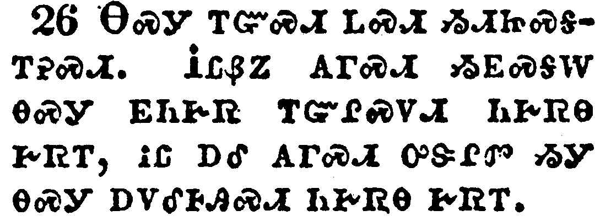</a></td>
</tr>
<tr class="even">
<td>Fear them not therefore: for there is nothing covered, that shall not be revealed; and hid, that shall not be known.</td>
</tr>
<tr class="odd">
<td>ᎾᏍᎩ ᎢᏳᏍᏗ ᏞᏍᏗ ᏱᏗᏥᏍᎦᎢᎮᏍᏗ. ᎥᏝᏰᏃ ᎪᎱᏍᏗ ᏱᎬᏍᎦᎳ ᎾᏍᎩ ᎬᏂᎨᏒ ᎢᏳᎵᏍᏙᏗ ᏂᎨᏒᎾ ᎨᏒᎢ, ᎥᏝ ᎠᎴ ᎪᎱᏍᏗ ᎤᏕᎵᏛ ᏱᎩ ᎾᏍᎩ ᎠᏙᎴᎰᎯᏍᏗ ᏂᎨᏒᎾ ᎨᏒᎢ.</td>
</tr>
<tr class="even">
<td>Na-s-gi i-yu-s-di tle-s-di yi-di-tsi-s-ga-i-he-s-di. V-tla-ye-no go-hu-s-di yi-gv-s-ga-la na-s-gi gv-ni-ge-sv i-yu-li-s-do-di ni-ge-sv-na ge-sv-i, v-tla a-le go-hu-s-di u-de-li-dv yi-gi na-s-gi a-do-le-ho-hi-s-di ni-ge-sv-na ge-sv-i.</td>
</tr>
</tbody>
</table>

<table>
<tbody>
<tr class="odd">
<td></td>
</tr>
<tr class="even">
<td>What I tell you in darkness, that speak ye in light: and what ye hear in the ear, that preach ye upon the housetops.</td>
</tr>
<tr class="odd">
<td>ᎤᎵᏏᎬ ᎢᏨᏁᏤᎸᎢ ᎢᎦᎦᏛ ᎢᏥ ᏁᎨᏍᏗ; ᎡᏣᏙᏅᎡᎸᏃ ᎨᏒ ᎦᏌᎾᎵ ᎢᏣᎵᏥᏙᎲᏍᎨᏍᏗ.</td>
</tr>
<tr class="even">
<td>U-li-si-gv i-tsv-ne-tse-lv-i i-ga-ga-dv i-tsi ne-ge-s-di; e-tsa-do-nv-e-lv-no ge-sv ga-sa-na-li i-tsa-li-tsi-do-hv-s-ge-s-di.</td>
</tr>
</tbody>
</table>

<table>
<tbody>
<tr class="odd">
<td><a href="011028.png">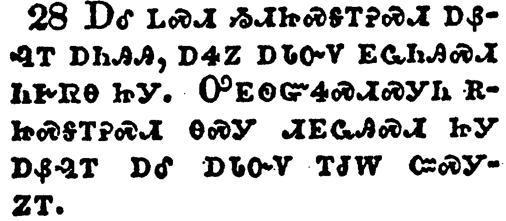</a></td>
</tr>
<tr class="even">
<td>And fear not them which kill the body, but are not able to kill the soul: but rather fear him which is able to destroy both soul and body in hell.</td>
</tr>
<tr class="odd">
<td>ᎠᎴ ᏞᏍᏗ ᏱᏗᏥᏍᎦᎢᎮᏍᏗ ᎠᏰᎸᎢ ᎠᏂᎯᎯ, ᎠᏎᏃ ᎠᏓᏅᏙ ᎬᏩᏂᎯᏍᏗ ᏂᎨᏒᎾ ᏥᎩ. ᎤᎬᏫᏳᏎᏍᏗᏍᎩᏂ ᎡᏥᏍᎦᎢᎮᏍᏗ ᎾᏍᎩ ᏗᎬᏩᎯᏍᏗ ᏥᎩ ᎠᏰᎸᎢ ᎠᎴ ᎠᏓᏅᏙ ᎢᏧᎳ ᏨᏍᎩᏃᎢ.</td>
</tr>
<tr class="even">
<td>A-le tle-s-di yi-di-tsi-s-ga-i-he-s-di a-ye-lv-i a-ni-hi-hi, a-se-no a-da-nv-do gv-wa-ni-hi-s-di ni-ge-sv-na tsi-gi. U-gv-wi-yu-se-s-di-s-gi-ni e-tsi-s-ga-i-he-s-di na-s-gi di-gv-wa-hi-s-di tsi-gi a-ye-lv-i a-le a-da-nv-do i-tsu-la tsv-s-gi-no-i.</td>
</tr>
</tbody>
</table>

<table>
<tbody>
<tr class="odd">
<td><a href="011029.png">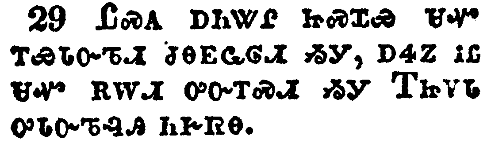</a></td>
</tr>
<tr class="even">
<td>Are not two sparrows sold for a farthing? and one of them shall not fall on the ground without your Father.</td>
</tr>
<tr class="odd">
<td>ᏝᏍᎪ ᎠᏂᏔᎵ ᏥᏍᏆᏯ ᏌᏉ ᎢᏯᏓᏅᏖᏗ ᏧᎾᎬᏩᎶᏗ ᏱᎩ, ᎠᏎᏃ ᎥᏝ ᏌᏉ ᎡᎳᏗ ᎤᏅᎢᏍᏗ ᏱᎩ ᎢᏥᏙᏓ ᎤᏓᏅᏖᎸᎯ ᏂᎨᏒᎾ.</td>
</tr>
<tr class="even">
<td>Tla-s-go a-ni-ta-li tsi-s-qua-ya sa-quo i-ya-da-nv-te-di tsu-na-gv-wa-lo-di yi-gi, a-se-no v-tla sa-quo e-la-di u-nv-i-s-di yi-gi I-tsi-do-da u-da-nv-te-lv-hi ni-ge-sv-na.</td>
</tr>
</tbody>
</table>

<table>
<tbody>
<tr class="odd">
<td><a href="011030.png">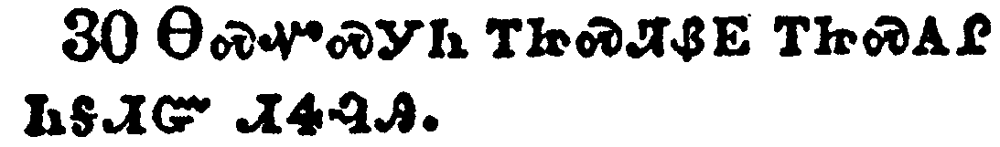</a></td>
</tr>
<tr class="even">
<td>But the very hairs of your head are all numbered.</td>
</tr>
<tr class="odd">
<td>ᎾᏍᏉᏍᎩᏂ ᎢᏥᏍᏘᏰᎬ ᎢᏥᏍᎪᎵ ᏂᎦᏗᏳ ᏗᏎᎸᎯ.</td>
</tr>
<tr class="even">
<td>Na-s-quo-s-gi-ni i-tsi-s-ti-ye-gv i-tsi-s-go-li ni-ga-di-yu di-se-lv-hi.</td>
</tr>
</tbody>
</table>

<table>
<tbody>
<tr class="odd">
<td><a href="011031.png">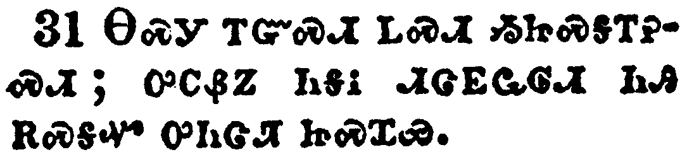</a></td>
</tr>
<tr class="even">
<td>Fear ye not therefore, ye are of more value than many sparrows.</td>
</tr>
<tr class="odd">
<td>ᎾᏍᎩ ᎢᏳᏍᏗ ᏞᏍᏗ ᏱᏥᏍᎦᎢᎮᏍᏗ; ᎤᏟᏰᏃ ᏂᎦᎥ ᏗᏣᎬᏩᎶᏗ ᏂᎯ ᎡᏍᎦᏉ ᎤᏂᏣᏘ ᏥᏍᏆᏯ.</td>
</tr>
<tr class="even">
<td>Na-s-gi i-yu-s-di tle-s-di yi-tsi-s-ga-i-he-s-di; u-tli-ye-no ni-ga-v di-tsa-gv-wa-lo-di ni-hi e-s-ga-quo u-ni-tsa-ti tsi-s-qua-ya.</td>
</tr>
</tbody>
</table>

<table>
<tbody>
<tr class="odd">
<td><a href="011032.png">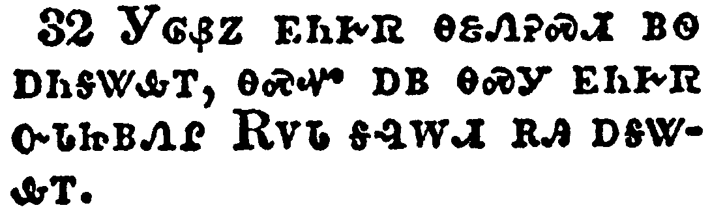</a></td>
</tr>
<tr class="even">
<td>Whosoever therefore shall confess me before men, him will I confess also before my Father which is in heaven.</td>
</tr>
<tr class="odd">
<td>ᎩᎶᏰᏃ ᎬᏂᎨᏒ ᎾᏋᏁᎮᏍᏗ ᏴᏫ ᎠᏂᎦᏔᎲᎢ, ᎾᏍᏉ ᎠᏴ ᎾᏍᎩ ᎬᏂᎨᏒ ᎤᏓᏥᏴᏁᎵ ᎡᏙᏓ ᎦᎸᎳᏗ ᎡᎯ ᎠᎦᏔᎲᎢ.</td>
</tr>
<tr class="even">
<td>Gi-lo-ye-no gv-ni-ge-sv na-quv-ne-he-s-di yv-wi a-ni-ga-ta-hv-i, na-s-quo a-yv na-s-gi gv-ni-ge-sv u-da-tsi-yv-ne-li E-do-da ga-lv-la-di e-hi a-ga-ta-hv-i.</td>
</tr>
</tbody>
</table>

<table>
<tbody>
<tr class="odd">
<td><a href="011033.png">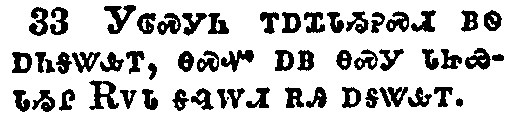</a></td>
</tr>
<tr class="even">
<td>But whosoever shall deny me before men, him will I also deny before my Father which is in heaven.</td>
</tr>
<tr class="odd">
<td>ᎩᎶᏍᎩᏂ ᎢᎠᏆᏓᏱᎮᏍᏗ ᏴᏫ ᎠᏂᎦᏔᎲᎢ, ᎾᏍᏉ ᎠᏴ ᎾᏍᎩ ᏓᏥᏯᏓᏱᎵ ᎡᏙᏓ ᎦᎸᎳᏗ ᎡᎯ ᎠᎦᏔᎲᎢ.</td>
</tr>
<tr class="even">
<td>Gi-lo-s-gi-ni i-a-qua-da-yi-he-s-di yv-wi a-ni-ga-ta-hv-i, na-s-quo a-yv na-s-gi da-tsi-ya-da-yi-li E-do-da ga-lv-la-di e-hi a-ga-ta-hv-i.</td>
</tr>
</tbody>
</table>

<table>
<tbody>
<tr class="odd">
<td><a href="011034.png">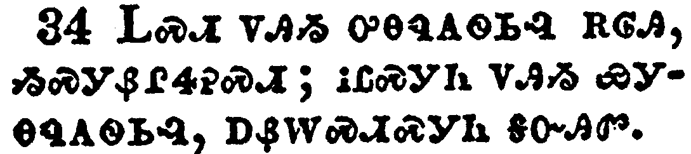</a></td>
</tr>
<tr class="even">
<td>Think not that I am come to send peace on earth: I came not to send peace, but a sword.</td>
</tr>
<tr class="odd">
<td>ᏞᏍᏗ ᏙᎯᏱ ᎤᎾᏄᎪᏫᏏᎸ ᎡᎶᎯ, ᏱᏍᎩᏰᎵᏎᎮᏍᏗ; ᎥᏝᏍᎩᏂ ᏙᎯᏱ ᏯᎩᎾᏄᎪᏫᏏᎸ, ᎠᏰᎳᏍᏗᏍᎩᏂ ᎦᏅᎯᏛ.</td>
</tr>
<tr class="even">
<td>Tle-s-di do-hi-yi u-na-nu-go-wi-si-lv e-lo-hi, yi-s-gi-ye-li-se-he-s-di; v-tla-s-gi-ni do-hi-yi ya-gi-na-nu-go-wi-si-lv, a-ye-la-s-di-s-gi-ni ga-nv-hi-dv.</td>
</tr>
</tbody>
</table>

<table>
<tbody>
<tr class="odd">
<td></td>
</tr>
<tr class="even">
<td>For I am come to set a man at variance against his father, and the daughter against her mother, and the daughter in law against her mother in law.</td>
</tr>
<tr class="odd">
<td>ᎠᏴᏰᏃ ᎠᎩᎷᏥᎸ, ᏗᎾᏓᏍᎦᎩ ᎢᏳᎵᏍᏙᏗᏱ ᎠᏍᎦᏯ ᎤᏙᏓᏃ, ᎠᎴ ᎠᎦᏅᎩ ᎠᎨᏴ ᎤᏥᏃ, ᎠᎴ ᎤᏓᏦᎯᏯ ᎤᏦᎯᏃ;</td>
</tr>
<tr class="even">
<td>A-yv-ye-no a-gi-lu-tsi-lv, di-na-da-s-ga-gi i-yu-li-s-do-di-yi a-s-ga-ya u-do-da-no, a-le a-ga-nv-gi a-ge-yv u-tsi-no, a-le u-da-tso-hi-ya u-tso-hi-no;</td>
</tr>
</tbody>
</table>

<table>
<tbody>
<tr class="odd">
<td><a href="011036.png">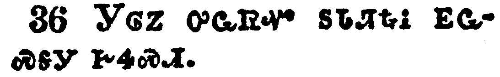</a></td>
</tr>
<tr class="even">
<td>And a man's foes shall be they of his own household.</td>
</tr>
<tr class="odd">
<td>ᎩᎶᏃ ᎤᏩᏒᏉ ᏚᏓᏘᎿᎭᎥ ᎬᏩᏍᎦᎩ ᎨᏎᏍᏗ.</td>
</tr>
<tr class="even">
<td>Gi-lo-no u-wa-sv-quo du-da-ti-hna-v gv-wa-s-ga-gi ge-se-s-di.</td>
</tr>
</tbody>
</table>

<table>
<tbody>
<tr class="odd">
<td><a href="011037.png">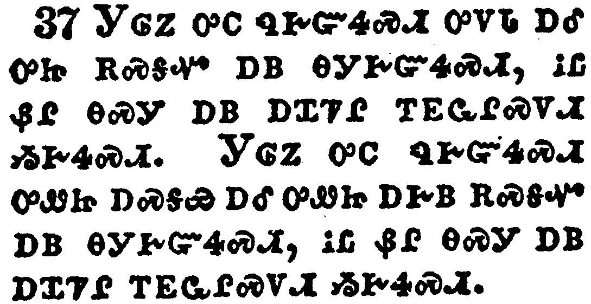</a></td>
</tr>
<tr class="even">
<td>He that loveth father or mother more than me is not worthy of me: and he that loveth son or daughter more than me is not worthy of me.</td>
</tr>
<tr class="odd">
<td>ᎩᎶᏃ ᎤᏟ ᏄᎨᏳᏎᏍᏗ ᎤᏙᏓ ᎠᎴ ᎤᏥ ᎡᏍᎦᏉ ᎠᏴ ᎾᎩᎨᏳᏎᏍᏗ, ᎥᏝ ᏰᎵ ᎾᏍᎩ ᎠᏴ ᎠᏆᏤᎵ ᎢᎬᏩᎵᏍᏙᏗ ᏱᎨᏎᏍᏗ. ᎩᎶᏃ ᎤᏟ ᏄᎨᏳᏎᏍᏗ ᎤᏪᏥ ᎠᏍᎦᏯ ᎠᎴ ᎤᏪᏥ ᎠᎨᏴ ᎡᏍᎦᏉ ᎠᏴ ᎾᎩᎨᏳᏎᏍᏗ, ᎥᏝ ᏰᎵ ᎾᏍᎩ ᎠᏴ ᎠᏆᏤᎵ ᎢᎬᏩᎵᏍᏙᏗ ᏱᎨᏎᏍᏗ.</td>
</tr>
<tr class="even">
<td>Gi-lo-no u-tli nu-ge-yu-se-s-di u-do-da a-le u-tsi e-s-ga-quo a-yv na-gi-ge-yu-se-s-di, v-tla ye-li na-s-gi a-yv a-qua-tse-li i-gv-wa-li-s-do-di yi-ge-se-s-di. Gi-lo-no u-tli nu-ge-yu-se-s-di u-we-tsi a-s-ga-ya a-le u-we-tsi a-ge-yv e-s-ga-quo a-yv na-gi-ge-yu-se-s-di, v-tla ye-li na-s-gi a-yv a-qua-tse-li i-gv-wa-li-s-do-di yi-ge-se-s-di.</td>
</tr>
</tbody>
</table>

<table>
<tbody>
<tr class="odd">
<td></td>
</tr>
<tr class="even">
<td>And he that taketh not his cross, and followeth after me, is not worthy of me.</td>
</tr>
<tr class="odd">
<td>ᎩᎶ ᎾᏱᏍᎬᎾ ᎢᎨᏎᏍᏗ ᎤᏤᎵ ᏧᏓᎿᎭᏩᏛ ᎠᎴ ᎾᎩᏍᏓᏩᏕᎬᎾ ᎢᎨᏎᏍᏗ, ᎥᏝ ᏰᎵ ᎠᏴ ᎠᏆᏤᎵ ᎢᎬᏩᎵᏍᏙᏗ ᏱᎨᏎᏍᏗ.</td>
</tr>
<tr class="even">
<td>Gi-lo na-yi-s-gv-na i-ge-se-s-di u-tse-li tsu-da-hna-wa-dv a-le na-gi-s-da-wa-de-gv-na i-ge-se-s-di, v-tla ye-li a-yv a-qua-tse-li i-gv-wa-li-s-do-di yi-ge-se-s-di.</td>
</tr>
</tbody>
</table>

<table>
<tbody>
<tr class="odd">
<td></td>
</tr>
<tr class="even">
<td>He that findeth his life shall lose it: and he that loseth his life for my sake shall find it.</td>
</tr>
<tr class="odd">
<td>ᎩᎶᏃ ᎬᏅ ᎢᎠᏩᏘᏍᎨᏍᏗ, ᎾᏍᎩ ᎤᏲᎱᏎᏗ ᎨᏎᏍᏗ; ᎩᎶᏃ ᎢᎤᏲᎱᏎᎮᏍᏗ ᎬᏅ ᎠᏴ ᏅᏗᎦᎵᏍᏙᏗᏍᎨᏍᏗ, ᎾᏍᎩ ᎤᏩᏛᏗ ᎨᏎᏍᏗ.</td>
</tr>
<tr class="even">
<td>Gi-lo-no gv-nv i-a-wa-ti-s-ge-s-di, na-s-gi u-yo-hu-se-di ge-se-s-di; gi-lo-no i-u-yo-hu-se-he-s-di gv-nv a-yv nv-di-ga-li-s-do-di-s-ge-s-di, na-s-gi u-wa-dv-di ge-se-s-di.</td>
</tr>
</tbody>
</table>

<table>
<tbody>
<tr class="odd">
<td><a href="011040.png">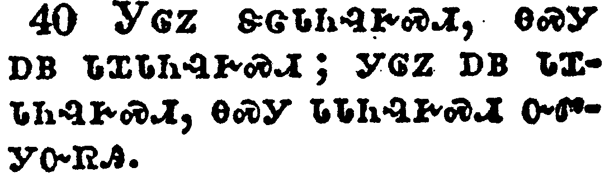</a></td>
</tr>
<tr class="even">
<td>He that receiveth you receiveth me, and he that receiveth me receiveth him that sent me.</td>
</tr>
<tr class="odd">
<td>ᎩᎶᏃ ᏕᏣᏓᏂᎸᎨᏍᏗ, ᎾᏍᎩ ᎠᏴ ᏓᏆᏓᏂᎸᎨᏍᏗ; ᎩᎶᏃ ᎠᏴ ᏓᏆᏓᏂᎸᎨᏍᏗ, ᎾᏍᎩ ᏓᏓᏂᎸᎨᏍᏗ ᏅᏛᎩᏅᏒᎯ</td>
</tr>
<tr class="even">
<td>Gi-lo-no de-tsa-da-ni-lv-ge-s-di, na-s-gi a-yv da-qua-da-ni-lv-ge-s-di; gi-lo-no a-yv da-qua-da-ni-lv-ge-s-di, na-s-gi da-da-ni-lv-ge-s-di nv-dv-gi-nv-sv-hi</td>
</tr>
</tbody>
</table>

<table>
<tbody>
<tr class="odd">
<td><a href="011041.png">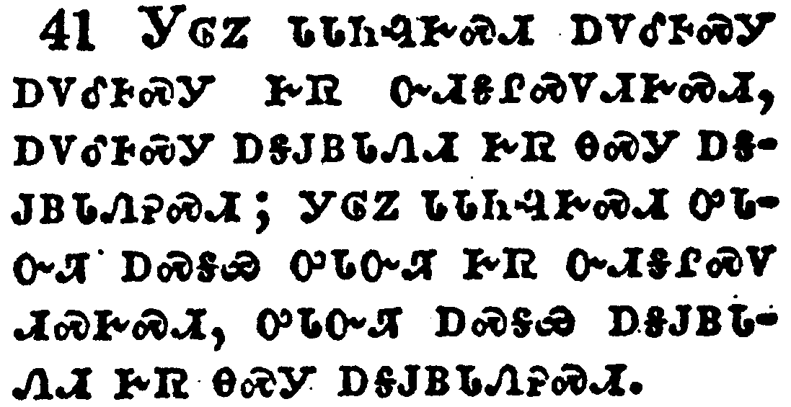</a></td>
</tr>
<tr class="even">
<td>He that receiveth a prophet in the name of a prophet shall receive a prophet's reward; and he that receiveth a righteous man in the name of a righteous man shall receive a righteous man's reward.</td>
</tr>
<tr class="odd">
<td>ᎩᎶᏃ ᏓᏓᏂᎸᎨᏍᏗ ᎠᏙᎴᎰᏍᎩ ᎠᏙᎴᎰᏍᎩ ᎨᏒ ᎤᏗᎦᎵᏍᏙᏗᎨᏍᏗ, ᎠᏙᎴᎰᏍᎩ ᎠᎦᎫᏴᏓᏁᏗ ᎨᏒ ᎾᏍᎩ ᎠᎦᎫᏴᏓᏁᎮᏍᏗ; ᎩᎶᏃ ᏓᏓᏂᎸᎨᏍᏗ ᎤᏓᏅᏘ ᎠᏍᎦᏯ ᎤᏓᏅᏘ ᎨᏒ ᎤᏗᎦᎵᏍᏙ ᏗᏍᎨᏍᏗ, ᎤᏓᏅᏘ ᎠᏍᎦᏯ ᎠᎦᎫᏴᏓᏁᏗ ᎨᏒ ᎾᏍᎩ ᎠᎦᎫᏴᏓᏁᎮᏍᏗ.</td>
</tr>
<tr class="even">
<td>Gi-lo-no da-da-ni-lv-ge-s-di a-do-le-ho-s-gi a-do-le-ho-s-gi ge-sv u-di-ga-li-s-do-di-ge-s-di, a-do-le-ho-s-gi a-ga-gu-yv-da-ne-di ge-sv na-s-gi a-ga-gu-yv-da-ne-he-s-di; gi-lo-no da-da-ni-lv-ge-s-di u-da-nv-ti a-s-ga-ya u-da-nv-ti ge-sv u-di-ga-li-s-do di-s-ge-s-di, u-da-nv-ti a-s-ga-ya a-ga-gu-yv-da-ne-di ge-sv na-s-gi a-ga-gu-yv-da-ne-he-s-di.</td>
</tr>
</tbody>
</table>

<table>
<tbody>
<tr class="odd">
<td><a href="011042.png">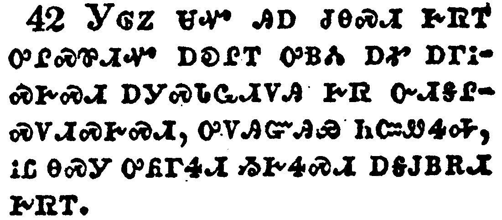</a></td>
</tr>
<tr class="even">
<td>And whosoever shall give to drink unto one of these little ones a cup of cold water only in the name of a disciple, verily I say unto you, he shall in no wise lose his reward.</td>
</tr>
<tr class="odd">
<td>ᎩᎶᏃ ᏌᏉ ᎯᎠ ᏧᎾᏍᏗ ᎨᏒᎢ ᎤᎵᏍᏈᏗᏉ ᎠᎧᎵᎢ ᎤᏴᏜᏓᎠᎹ ᎠᎱᎥᏍᎨᏍᏗ ᎠᎩᏍᏓᏩᏗᏙᎯ ᎨᏒ ᏅᏗᎦᎵᏍᏙᏗᏍᎨᏍᏗ, ᎤᏙᎯᏳᎯᏯ ᏂᏨᏪᏎᎭ, ᎥᏝ ᎾᏍᎩ ᎤᏲᎱᏎᏗ ᏱᎨᏎᏍᏗ ᎠᎦᎫᏴᎡᏗ ᎨᏒᎢ.</td>
</tr>
<tr class="even">
<td>Gi-lo-no sa-quo hi-a tsu-na-s-di ge-sv-i u-li-s-qui-di-quo a-ka-li-i u-yv-dla a-ma a-hu-v-s-ge-s-di a-gi-s-da-wa-di-do-hi ge-sv nv-di-ga-li-s-do-di-s-ge-s-di, u-do-hi-yu-hi-ya ni-tsv-we-se-ha, v-tla na-s-gi u-yo-hu-se-di yi-ge-se-s-di a-ga-gu-yv-e-di ge-sv-i.</td>
</tr>
</tbody>
</table>

