+++
draft=false
date = 2014-12-18T21:11:07Z
title = "Matthew - Chapter 15 - Cherokee New Testament"
weight = 1418955067

[taxonomies]

authors = ["Timothy Legg"]
categories = []
tags = []

[extra]
+++

<table>
<tbody>
<tr class="odd">
<td><a href="011501.png">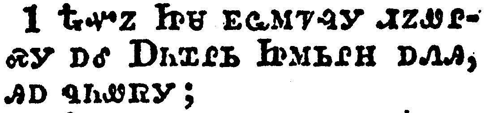</a></td>
</tr>
<tr class="even">
<td>Then came to Jesus scribes and Pharisees, which were of Jerusalem, saying,</td>
</tr>
<tr class="odd">
<td>ᎿᎭᏉᏃ ᏥᏌ ᎬᏩᎷᏤᎸᎩ ᏗᏃᏪᎵᏍᎩ ᎠᎴ ᎠᏂᏆᎵᏏ ᏥᎷᏏᎵᎻ ᎠᏁᎯ, ᎯᎠ ᏄᏂᏪᏒᎩ;</td>
</tr>
<tr class="even">
<td>Hna-quo-no Tsi-sa gv-wa-lu-tse-lv-gi di-no-we-li-s-gi a-le A-ni-qua-li-si Tsi-lu-si-li-mi a-ne-hi, hi-a nu-ni-we-sv-gi;</td>
</tr>
</tbody>
</table>

<table>
<tbody>
<tr class="odd">
<td><a href="011502.png">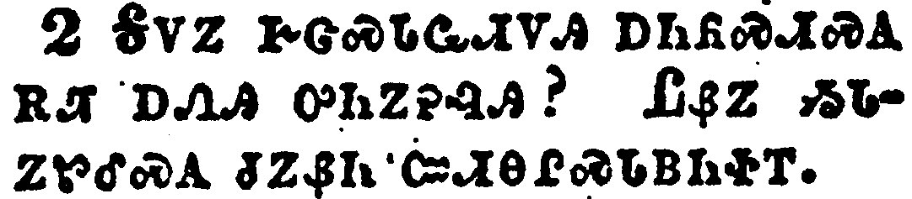</a></td>
</tr>
<tr class="even">
<td>Why do thy disciples transgress the tradition of the elders? for they wash not their hands when they eat bread.</td>
</tr>
<tr class="odd">
<td>ᎦᏙᏃ ᎨᏣᏍᏓᏩᏗᏙᎯ ᎠᏂᏲᏍᏗᏍᎪ ᎡᏘ ᎠᏁᎯ ᎤᏂᏃᎮᎸᎯ? ᏝᏰᏃ ᏱᏓᏃᏑᎴᏍᎪ ᏧᏃᏰᏂ ᏨᏗᎾᎵᏍᏓᏴᏂᏐᎢ.</td>
</tr>
<tr class="even">
<td>Ga-do-no ge-tsa-s-da-wa-di-do-hi a-ni-yo-s-di-s-go e-ti a-ne-hi u-ni-no-he-lv-hi? Tla-ye-no yi-da-no-su-le-s-go tsu-no-ye-ni tsv-di-na-li-s-da-yv-ni-so-i.</td>
</tr>
</tbody>
</table>

<table>
<tbody>
<tr class="odd">
<td><a href="011503.png">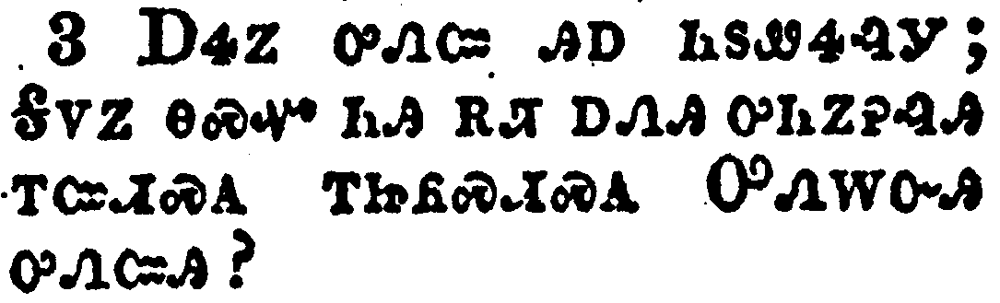</a></td>
</tr>
<tr class="even">
<td>But he answered and said unto them, Why do ye also transgress the commandment of God by your tradition?</td>
</tr>
<tr class="odd">
<td>ᎠᏎᏃ ᎤᏁᏨ ᎯᎠ ᏂᏚᏪᏎᎸᎩ; ᎦᏙᏃ ᎾᏍᏉ ᏂᎯ ᎡᏘ ᎠᏁᎯ ᎤᏂᏃᎮᎸᎯ ᎢᏨᏗᏍᎪ ᎢᏥᏲᏍᏗᏍᎪ ᎤᏁᎳᏅᎯ ᎤᏁᏨᎯ?</td>
</tr>
<tr class="even">
<td>A-se-no u-ne-tsv hi-a ni-du-we-se-lv-gi; ga-do-no na-s-quo ni-hi e-ti a-ne-hi u-ni-no-he-lv-hi i-tsv-di-s-go i-tsi-yo-s-di-s-go U-ne-la-nv-hi u-ne-tsv-hi?</td>
</tr>
</tbody>
</table>

<table>
<tbody>
<tr class="odd">
<td><a href="011504.png">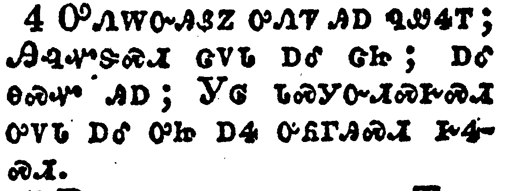</a></td>
</tr>
<tr class="even">
<td>For God commanded, saying, Honour thy father and mother: and, He that curseth father or mother, let him die the death.</td>
</tr>
<tr class="odd">
<td>ᎤᏁᎳᏅᎯᏰᏃ ᎤᏁᏤ ᎯᎠ ᏄᏪᏎᎢ; ᎯᎸᏉᏕᏍᏗ ᏣᏙᏓ ᎠᎴ ᏣᏥ; ᎠᎴ ᎾᏍᏉ ᎯᎠ; ᎩᎶ ᏓᏍᎩᏅᏗᏍᎨᏍᏗ ᎤᏙᏓ ᎠᎴ ᎤᏥ ᎠᏎ ᎤᏲᎱᎯᏍᏗ ᎨᏎᏍᏗ.</td>
</tr>
<tr class="even">
<td>U-ne-la-nv-hi-ye-no u-ne-tse hi-a nu-we-se-i; Hi-lv-quo-de-s-di tsa-do-da a-le tsa-tsi; a-le na-s-quo hi-a; Gi-lo da-s-gi-nv-di-s-ge-s-di u-do-da a-le u-tsi a-se u-yo-hu-hi-s-di ge-se-s-di.</td>
</tr>
</tbody>
</table>

<table>
<tbody>
<tr class="odd">
<td><a href="011505.png">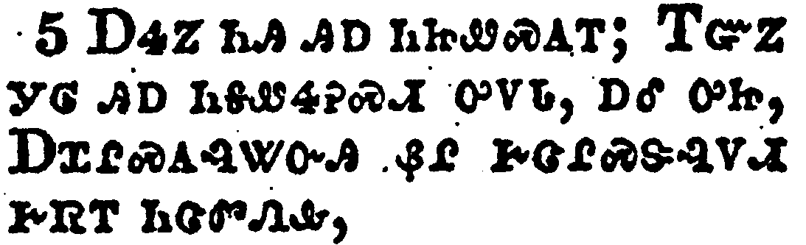</a></td>
</tr>
<tr class="even">
<td>But ye say, Whosoever shall say to his father or his mother, It is a gift, by whatsoever thou mightest be profited by me;</td>
</tr>
<tr class="odd">
<td>ᎠᏎᏃ ᏂᎯ ᎯᎠ ᏂᏥᏪᏍᎪᎢ; ᎢᏳᏃ ᎩᎶ ᎯᎠ ᏂᎦᏪᏎᎮᏍᏗ ᎤᏙᏓ, ᎠᎴ ᎤᏥ, ᎠᏆᎵᏍᎪᎸᏔᏅᎯ ᏰᎵ ᎨᏣᎵᏍᏕᎸᏙᏗ ᎨᏒᎢ ᏂᏣᏛᏁᎲ,</td>
</tr>
<tr class="even">
<td>A-se-no ni-hi hi-a ni-tsi-we-s-go-i; I-yu-no gi-lo hi-a ni-ga-we-se-he-s-di u-do-da, a-le u-tsi, A-qua-li-s-go-lv-ta-nv-hi ye-li ge-tsa-li-s-de-lv-do-di ge-sv-i ni-tsa-dv-ne-hv,</td>
</tr>
</tbody>
</table>

<table>
<tbody>
<tr class="odd">
<td><a href="011506.png">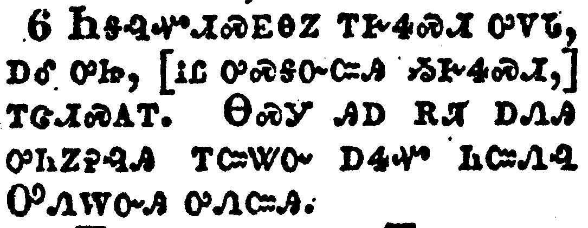</a></td>
</tr>
<tr class="even">
<td>And honour not his father or his mother, he shall be free. Thus have ye made the commandment of God of none effect by your tradition.</td>
</tr>
<tr class="odd">
<td>ᏂᎦᎸᏉᏗᏍᎬᎾᏃ ᎢᎨᏎᏍᏗ ᎤᏙᏓ, ᎠᎴ ᎤᏥ, [ᎥᏝ ᎤᏍᎦᏅᏨᎯ ᏱᎨᏎᏍᏗ,] ᎢᏣᏗᏍᎪᎢ. ᎾᏍᎩ ᎯᎠ ᎡᏘ ᎠᏁᎯ ᎤᏂᏃᎮᎸᎯ ᎢᏨᏔᏅ ᎠᏎᏉ ᏂᏨᏁᎸ ᎤᏁᎳᏅᎯ ᎤᏁᏨᎯ.</td>
</tr>
<tr class="even">
<td>Ni-ga-lv-quo-di-s-gv-na-no i-ge-se-s-di u-do-da, a-le u-tsi, [v-tla u-s-ga-nv-tsv-hi yi-ge-se-s-di,] i-tsa-di-s-go-i. Na-s-gi hi-a e-ti a-ne-hi u-ni-no-he-lv-hi i-tsv-ta-nv a-se-quo ni-tsv-ne-lv U-ne-la-nv-hi u-ne-tsv-hi.</td>
</tr>
</tbody>
</table>

<table>
<tbody>
<tr class="odd">
<td><a href="011507.png">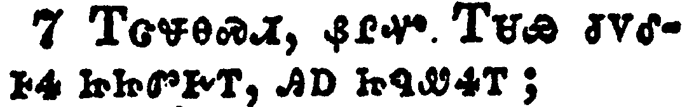</a></td>
</tr>
<tr class="even">
<td>Ye hypocrites, well did Esaias prophesy of you, saying,</td>
</tr>
<tr class="odd">
<td>ᎢᏣᏠᎾᏍᏗ, ᏰᎵᏉ ᎢᏌᏯ ᏧᏙᎴᎰᏎ ᏥᏥᏛᎨᎢ, ᎯᎠ ᏥᏄᏪᏎᎢ;</td>
</tr>
<tr class="even">
<td>I-tsa-tlo-na-s-di, ye-li-quo I-sa-ya tsu-do-le-ho-se tsi-tsi-dv-ge-i, hi-a tsi-nu-we-se-i;</td>
</tr>
</tbody>
</table>

<table>
<tbody>
<tr class="odd">
<td><a href="011508.png">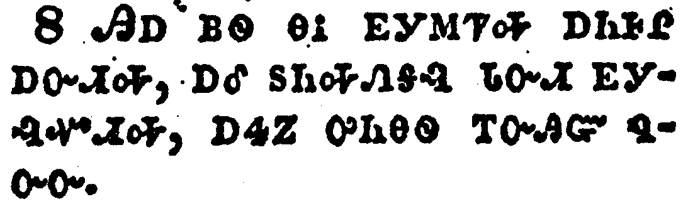</a></td>
</tr>
<tr class="even">
<td>This people draweth nigh unto me with their mouth, and honoureth me with their lips; but their heart is far from me.</td>
</tr>
<tr class="odd">
<td>ᎯᎠ ᏴᏫ ᎾᎥ ᎬᎩᎷᏤᎭ ᎠᏂᎰᎵ ᎠᏅᏗᎭ, ᎠᎴ ᏚᏂᎭᏁᎦᎸ ᏓᏅᏗ ᎬᎩᎸᏉᏗᎭ, ᎠᏎᏃ ᎤᏂᎾᏫ ᎢᏅᎯᏳ ᏄᏅᏅ.</td>
</tr>
<tr class="even">
<td>Hi-a yv-wi na-v gv-gi-lu-tse-ha a-ni-ho-li a-nv-di-ha, a-le du-ni-ha-ne-ga-lv da-nv-di gv-gi-lv-quo-di-ha, a-se-no u-ni-na-wi i-nv-hi-yu nu-nv-nv.</td>
</tr>
</tbody>
</table>

<table>
<tbody>
<tr class="odd">
<td><a href="011509.png">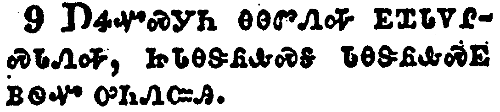</a></td>
</tr>
<tr class="even">
<td>But in vain they do worship me, teaching for doctrines the commandments of men.</td>
</tr>
<tr class="odd">
<td>ᎠᏎᏉᏍᎩᏂ ᎾᎾᏛᏁᎭ ᎬᏆᏓᏙᎵᏍᏓᏁᎭ, ᏥᏓᎾᏕᏲᎲᏍᎦ ᏓᎾᏕᏲᎲᏍᎬ ᏴᏫᏉ ᎤᏂᏁᏨᎯ.</td>
</tr>
<tr class="even">
<td>A-se-quo-s-gi-ni na-na-dv-ne-ha gv-qua-da-do-li-s-da-ne-ha, tsi-da-na-de-yo-hv-s-ga da-na-de-yo-hv-s-gv yv-wi-quo u-ni-ne-tsv-hi.</td>
</tr>
</tbody>
</table>

<table>
<tbody>
<tr class="odd">
<td><a href="011510.png">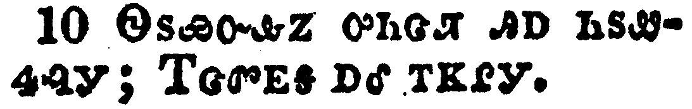</a></td>
</tr>
<tr class="even">
<td>And he called the multitude, and said unto them, Hear, and understand:</td>
</tr>
<tr class="odd">
<td>ᏫᏚᏯᎲᏃ ᎤᏂᏣᏘ ᎯᎠ ᏂᏚᏪᏎᎸᎩ; ᎢᏣᏛᎬᎦ ᎠᎴ ᎢᏦᎵᎩ.</td>
</tr>
<tr class="even">
<td>Wi-du-ya-hv-no u-ni-tsa-ti hi-a ni-du-we-se-lv-gi; I-tsa-dv-gv-ga a-le i-tso-li-gi.</td>
</tr>
</tbody>
</table>

<table>
<tbody>
<tr class="odd">
<td><a href="011511.png">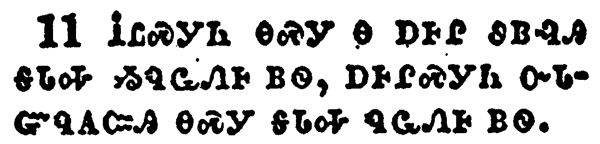</a></td>
</tr>
<tr class="even">
<td>Not that which goeth into the mouth defileth a man; but that which cometh out of the mouth, this defileth a man.</td>
</tr>
<tr class="odd">
<td>ᎥᏝᏍᎩᏂ ᎾᏍᎩ Ꮎ ᎠᎰᎵ ᏭᏴᎸᎯ ᎦᏓᎭ ᏱᏄᏩᏁᎰ ᏴᏫ, ᎠᎰᎵᏍᎩᏂ ᏅᏓᏳᏄᎪᏨᎯ ᎾᏍᎩ ᎦᏓᎭ ᏄᏩᏁᎰ ᏴᏫ.</td>
</tr>
<tr class="even">
<td>V-tla-s-gi-ni na-s-gi na a-ho-li wu-yv-lv-hi ga-da-ha yi-nu-wa-ne-ho yv-wi, a-ho-li-s-gi-ni nv-da-yu-nu-go-tsv-hi na-s-gi ga-da-ha nu-wa-ne-ho yv-wi.</td>
</tr>
</tbody>
</table>

<table>
<tbody>
<tr class="odd">
<td><a href="011512.png">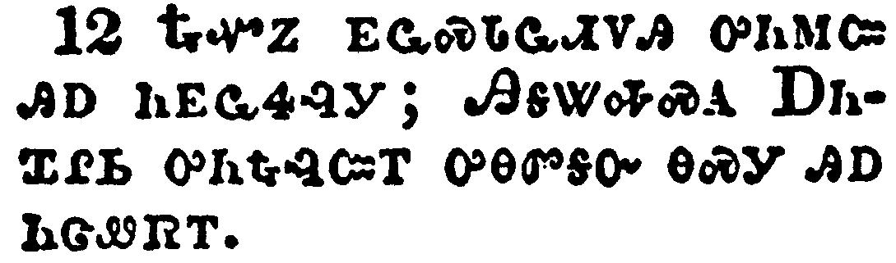</a></td>
</tr>
<tr class="even">
<td>Then came his disciples, and said unto him, Knowest thou that the Pharisees were offended, after they heard this saying?</td>
</tr>
<tr class="odd">
<td>ᎿᎭᏉᏃ ᎬᏩᏍᏓᏩᏗᏙᎯ ᎤᏂᎷᏨ ᎯᎠ ᏂᎬᏩᏎᎸᎩ; ᎯᎦᏔᎭᏍᎪ ᎠᏂᏆᎵᏏ ᎤᏂᎿᎭᎸᏨᎢ ᎤᎾᏛᎦᏅ ᎾᏍᎩ ᎯᎠ ᏂᏣᏪᏒᎢ.</td>
</tr>
<tr class="even">
<td>Hna-quo-no gv-wa-s-da-wa-di-do-hi u-ni-lu-tsv hi-a ni-gv-wa-se-lv-gi; Hi-ga-ta-ha-s-go A-ni-qua-li-si u-ni-hna-lv-tsv-i u-na-dv-ga-nv na-s-gi hi-a ni-tsa-we-sv-i.</td>
</tr>
</tbody>
</table>

<table>
<tbody>
<tr class="odd">
<td><a href="011513.png">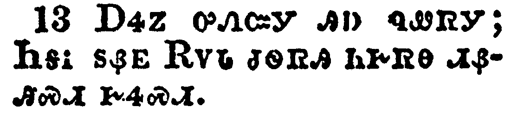</a></td>
</tr>
<tr class="even">
<td>But he answered and said, Every plant, which my heavenly Father hath not planted, shall be rooted up.</td>
</tr>
<tr class="odd">
<td>ᎠᏎᏃ ᎤᏁᏨᎩ ᎯᎠ ᏄᏪᏒᎩ; ᏂᎦᎥ ᏚᏰᎬ ᎡᏙᏓ ᏧᏫᏒᎯ ᏂᎨᏒᎾ ᏗᏰᎯᏍᏗ ᎨᏎᏍᏗ.</td>
</tr>
<tr class="even">
<td>A-se-no u-ne-tsv-gi hi-a nu-we-sv-gi; ni-ga-v du-ye-gv E-do-da tsu-wi-sv-hi ni-ge-sv-na di-ye-hi-s-di ge-se-s-di.</td>
</tr>
</tbody>
</table>

<table>
<tbody>
<tr class="odd">
<td><a href="011514.png">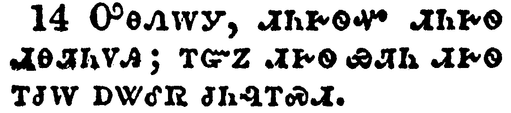</a></td>
</tr>
<tr class="even">
<td>Let them alone: they be blind leaders of the blind. And if the blind lead the blind, both shall fall into the ditch.</td>
</tr>
<tr class="odd">
<td>ᎤᎾᏁᎳᎩ, ᏗᏂᎨᏫᏉ ᏗᏂᎨᏫ ᏗᎾᏘᏂᏙᎯ; ᎢᏳᏃ ᏗᎨᏫ ᏯᏘᏂ ᏗᎨᏫ ᎢᏧᎳ ᎠᏔᎴᏒ ᏧᏂᎸᎢᏍᏗ.</td>
</tr>
<tr class="even">
<td>U-na-ne-la-gi, di-ni-ge-wi-quo di-ni-ge-wi di-na-ti-ni-do-hi; i-yu-no di-ge-wi ya-ti-ni di-ge-wi i-tsu-la a-ta-le-sv tsu-ni-lv-i-s-di.</td>
</tr>
</tbody>
</table>

<table>
<tbody>
<tr class="odd">
<td><a href="011515.png">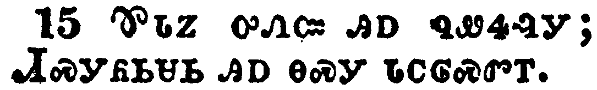</a></td>
</tr>
<tr class="even">
<td>Then answered Peter and said unto him, Declare unto us this parable.</td>
</tr>
<tr class="odd">
<td>ᏈᏓᏃ ᎤᏁᏨ ᎯᎠ ᏄᏪᏎᎸᎩ; ᏗᏍᎩᏲᏏᏌᏏ ᎯᎠ ᎾᏍᎩ ᏓᏟᎶᏍᏛᎢ.</td>
</tr>
<tr class="even">
<td>Qui-da-no u-ne-tsv hi-a nu-we-se-lv-gi; di-s-gi-yo-si-sa-si hi-a na-s-gi da-tli-lo-s-dv-i.</td>
</tr>
</tbody>
</table>

<table>
<tbody>
<tr class="odd">
<td><a href="011516.png">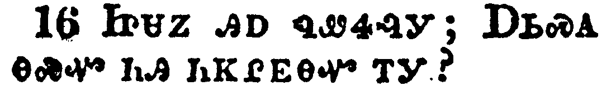</a></td>
</tr>
<tr class="even">
<td>And Jesus said, Are ye also yet without understanding?</td>
</tr>
<tr class="odd">
<td>ᏥᏌᏃ ᎯᎠ ᏄᏪᏎᎸᎩ; ᎠᏏᏍᎪ ᎾᏍᏉ ᏂᎯ ᏂᏦᎵᎬᎾᏉ ᎢᎩ?</td>
</tr>
<tr class="even">
<td>Tsi-sa-no hi-a nu-we-se-lv-gi; A-si-s-go na-s-quo ni-hi ni-tso-li-gv-na-quo i-gi?</td>
</tr>
</tbody>
</table>

<table>
<tbody>
<tr class="odd">
<td><a href="011517.png">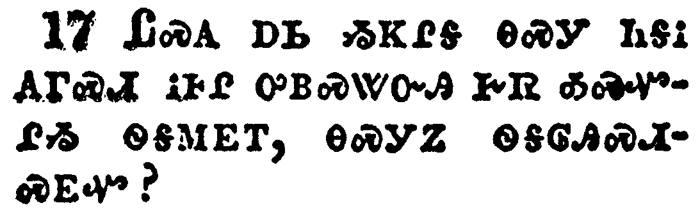</a></td>
</tr>
<tr class="even">
<td>Do not ye yet understand, that whatsoever entereth in at the mouth goeth into the belly, and is cast out into the draught?</td>
</tr>
<tr class="odd">
<td>ᏝᏍᎪ ᎠᏏ ᏱᏦᎵᎦ ᎾᏍᎩ ᏂᎦᎥ ᎪᎱᏍᏗ ᎥᎰᎵ ᎤᏴᏍᏔᏅᎯ ᎨᏒ ᎣᏍᏉᎵᏱ ᏫᎦᎷᎬᎢ, ᎾᏍᎩᏃ ᏫᎦᎶᎯᏍᏗᏍᎬᏉ?</td>
</tr>
<tr class="even">
<td>Tla-s-go a-si yi-tso-li-ga na-s-gi ni-ga-v go-hu-s-di v-ho-li u-yv-s-ta-nv-hi ge-sv o-s-quo-li-yi wi-ga-lu-gv-i, na-s-gi-no wi-ga-lo-hi-s-di-s-gv-quo?</td>
</tr>
</tbody>
</table>

<table>
<tbody>
<tr class="odd">
<td><a href="011518.png">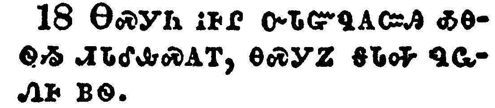</a></td>
</tr>
<tr class="even">
<td>But those things which proceed out of the mouth come forth from the heart; and they defile the man.</td>
</tr>
<tr class="odd">
<td>ᎾᏍᎩᏂ ᎥᎰᎵ ᏅᏓᏳᏄᎪᏨᎯ ᎣᎾᏫᏱ ᏗᏓᎴᎲᏍᎪᎢ, ᎾᏍᎩᏃ ᎦᏓᎭ ᏄᏩᏁᎰ ᏴᏫ.</td>
</tr>
<tr class="even">
<td>Na-s-gi-ni v-ho-li nv-da-yu-nu-go-tsv-hi o-na-wi-yi di-da-le-hv-s-go-i, na-s-gi-no ga-da-ha nu-wa-ne-ho yv-wi.</td>
</tr>
</tbody>
</table>

<table>
<tbody>
<tr class="odd">
<td><a href="011519.png">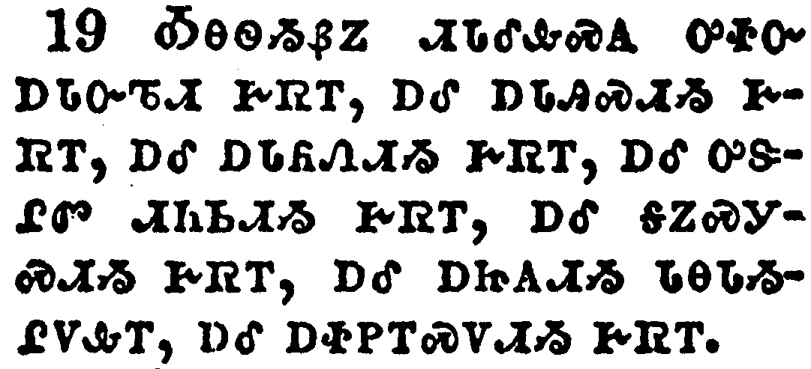</a></td>
</tr>
<tr class="even">
<td>For out of the heart proceed evil thoughts, murders, adulteries, fornications, thefts, false witness, blasphemies:</td>
</tr>
<tr class="odd">
<td>ᎣᎾᏫᏱᏰᏃ ᏗᏓᎴᎲᏍᎪ ᎤᏐᏅ ᎠᏓᏅᏖᏗ ᎨᏒᎢ, ᎠᎴ ᎠᏓᎯᏍᏗᏱ ᎨᏒᎢ, ᎠᎴ ᎠᏓᏲᏁᏗᏱ ᎨᏒᎢ, ᎠᎴ ᎤᏕᎵᏛ ᏗᏂᏏᏗᏱ ᎨᏒᎢ, ᎠᎴ ᎦᏃᏍᎩᏍᏗᏱ ᎨᏒᎢ, ᎠᎴ ᎠᏥᎪᏗᏱ ᏓᎾᏓᏱᎵᏙᎲᎢ, ᎠᎴ ᎠᏐᏢᎢᏍᏙᏗᏱ ᎨᏒᎢ.</td>
</tr>
<tr class="even">
<td>O-na-wi-yi-ye-no di-da-le-hv-s-go u-so-nv a-da-nv-te-di ge-sv-i, a-le a-da-hi-s-di-yi ge-sv-i, a-le a-da-yo-ne-di-yi ge-sv-i, a-le u-de-li-dv di-ni-si-di-yi ge-sv-i, a-le ga-no-s-gi-s-di-yi ge-sv-i, a-le a-tsi-go-di-yi da-na-da-yi-li-do-hv-i, a-le a-so-tlv-i-s-do-di-yi ge-sv-i.</td>
</tr>
</tbody>
</table>

<table>
<tbody>
<tr class="odd">
<td><a href="011520.png">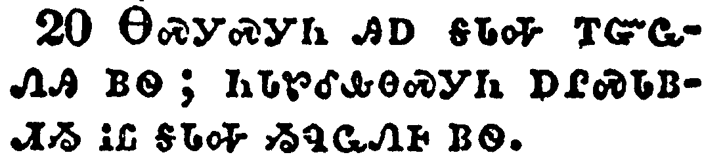</a></td>
</tr>
<tr class="even">
<td>These are the things which defile a man: but to eat with unwashen hands defileth not a man.</td>
</tr>
<tr class="odd">
<td>ᎾᏍᎩᏍᎩᏂ ᎯᎠ ᎦᏓᎭ ᎢᏳᏩᏁᎯ ᏴᏫ; ᏂᏓᏑᎴᎲᎾᏍᎩᏂ ᎠᎵᏍᏓᏴᏗᏱ ᎥᏝ ᎦᏓᎭ ᏱᏄᏩᏁᎰ ᏴᏫ.</td>
</tr>
<tr class="even">
<td>Na-s-gi-s-gi-ni hi-a ga-da-ha i-yu-wa-ne-hi yv-wi; ni-da-su-le-hv-na-s-gi-ni a-li-s-da-yv-di-yi v-tla ga-da-ha yi-nu-wa-ne-ho yv-wi.</td>
</tr>
</tbody>
</table>

<table>
<tbody>
<tr class="odd">
<td><a href="011521.png">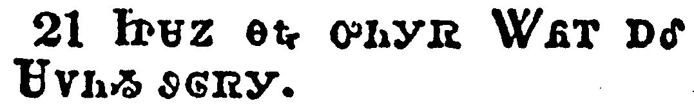</a></td>
</tr>
<tr class="even">
<td>Then Jesus went thence, and departed into the coasts of Tyre and Sidon.</td>
</tr>
<tr class="odd">
<td>ᏥᏌᏃ ᎾᎿᎭᎤᏂᎩᏒ ᏔᏲᎢ ᎠᎴ ᏌᏙᏂᏱ ᏭᎶᏒᎩ.</td>
</tr>
<tr class="even">
<td>Tsi-sa-no na-hna u-ni-gi-sv Ta-yo-i a-le Sa-do-ni-yi wu-lo-sv-gi.</td>
</tr>
</tbody>
</table>

<table>
<tbody>
<tr class="odd">
<td><a href="011522.png">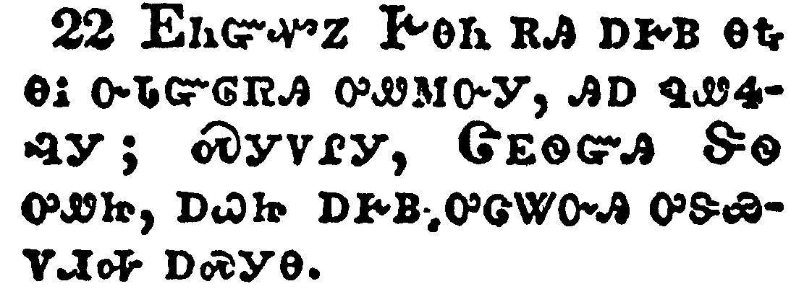</a></td>
</tr>
<tr class="even">
<td>And, behold, a woman of Canaan came out of the same coasts, and cried unto him, saying, Have mercy on me, O Lord, thou Son of David; my daughter is grievously vexed with a devil.</td>
</tr>
<tr class="odd">
<td>ᎬᏂᏳᏉᏃ ᎨᎾᏂ ᎡᎯ ᎠᎨᏴ ᎾᎿᎭᎾᎥ ᏅᏓᏳᎶᏒᎯ ᎤᏪᎷᏅᎩ, ᎯᎠ ᏄᏪᏎᎸᎩ; ᏍᎩᏙᎵᎩ, ᏣᎬᏫᏳᎯ ᏕᏫ ᎤᏪᏥ, ᎠᏇᏥ ᎠᎨᏴ ᎤᏣᏔᏅᎯ ᎤᏕᏯᏙᏗᎭ ᎠᏍᎩᎾ.</td>
</tr>
<tr class="even">
<td>Gv-ni-yu-quo-no Ge-na-ni e-hi a-ge-yv na-hna na-v nv-da-yu-lo-sv-hi u-we-lu-nv-gi, hi-a nu-we-se-lv-gi; S-gi-do-li-gi, Tsa-gv-wi-yu-hi De-wi u-we-tsi, a-que-tsi a-ge-yv u-tsa-ta-nv-hi u-de-ya-do-di-ha a-s-gi-na.</td>
</tr>
</tbody>
</table>

<table>
<tbody>
<tr class="odd">
<td></td>
</tr>
<tr class="even">
<td>But he answered her not a word. And his disciples came and besought him, saying, Send her away; for she crieth after us.</td>
</tr>
<tr class="odd">
<td>ᎠᏎᏃ ᏄᏁᏤᎸᎾᏉ ᎥᎨᏒᎩ. ᎬᏩᏍᏓᏩᏗᏙᎯᏃ ᎬᏩᎷᏤᎸᎩ, ᎬᏩᏔᏲᏎᎸᎩ, ᎯᎠ ᏄᏂᏪᏒᎩ; ᏫᎡᎾ, ᎢᎩᏍᎪᏂᎭᏰᏃ.</td>
</tr>
<tr class="even">
<td>A-se-no nu-ne-tse-lv-na-quo v-ge-sv-gi. Gv-wa-s-da-wa-di-do-hi-no gv-wa-lu-tse-lv-gi, gv-wa-ta-yo-se-lv-gi, hi-a nu-ni-we-sv-gi; Wi-e-na, i-gi-s-go-ni-ha-ye-no.</td>
</tr>
</tbody>
</table>

<table>
<tbody>
<tr class="odd">
<td><a href="011524.png">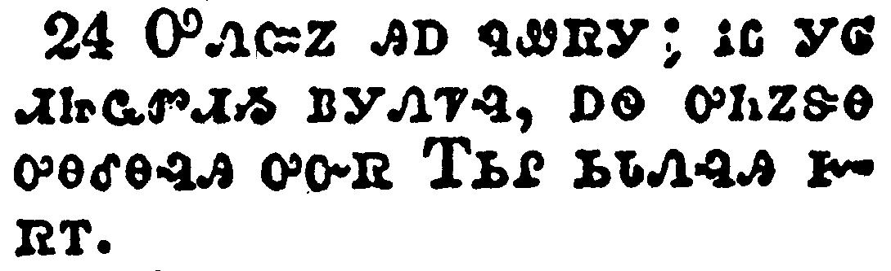</a></td>
</tr>
<tr class="even">
<td>But he answered and said, I am not sent but unto the lost sheep of the house of Israel.</td>
</tr>
<tr class="odd">
<td>ᎤᏁᏨᏃ ᎯᎠ ᏄᏪᏒᎩ; ᎥᏝ ᎩᎶ ᏗᏥᏩᏛᏗᏱ ᏴᎩᏁᏤᎸ, ᎠᏫ ᎤᏂᏃᏕᎾ ᎤᎾᎴᎾᎸᎯ ᎤᏅᏒ ᎢᏏᎵ ᏏᏓᏁᎸᎯ ᎬᏒᎢ.</td>
</tr>
<tr class="even">
<td>U-ne-tsv-no hi-a nu-we-sv-gi; v-tla gi-lo di-tsi-wa-dv-di-yi yv-gi-ne-tse-lv, a-wi u-ni-no-de-na u-na-le-na-lv-hi u-nv-sv I-si-li si-da-ne-lv-hi gv-sv-i.</td>
</tr>
</tbody>
</table>

<table>
<tbody>
<tr class="odd">
<td><a href="011525.png">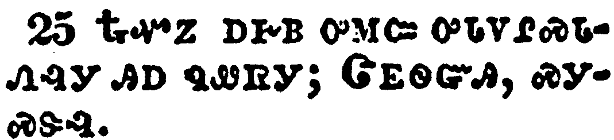</a></td>
</tr>
<tr class="even">
<td>Then came she and worshipped him, saying, Lord, help me.</td>
</tr>
<tr class="odd">
<td>ᎿᎭᏉᏃ ᎠᎨᏴ ᎤᎷᏨ ᎤᏓᏙᎵᏍᏓᏁᎸᎩ ᎯᎠ ᏄᏪᏒᎩ; ᏣᎬᏫᏳᎯ, ᏍᎩᏍᏕᎸ.</td>
</tr>
<tr class="even">
<td>Hna-quo-no a-ge-yv u-lu-tsv u-da-do-li-s-da-ne-lv-gi hi-a nu-we-sv-gi; Tsa-gv-wi-yu-hi, s-gi-s-de-lv.</td>
</tr>
</tbody>
</table>

<table>
<tbody>
<tr class="odd">
<td><a href="011526.png">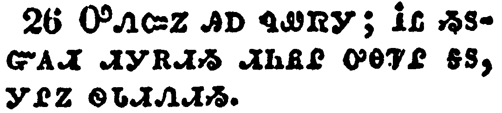</a></td>
</tr>
<tr class="even">
<td>But he answered and said, It is not meet to take the children's bread, and to cast it to dogs.</td>
</tr>
<tr class="odd">
<td>ᎤᏁᏨᏃ ᎯᎠ ᏄᏪᏒᎩ; ᎥᏝ ᏱᏚᏳᎪᏗ ᏗᎩᎡᏗᏱ ᏗᏂᏲᎵ ᎤᎾᏤᎵ ᎦᏚ, ᎩᎵᏃ ᏫᏓᏗᏁᏗᏱ.</td>
</tr>
<tr class="even">
<td>U-ne-tsv-no hi-a nu-we-sv-gi; v-tla yi-du-yu-go-di di-gi-e-di-yi di-ni-yo-li u-na-tse-li ga-du, gi-li-no wi-da-di-ne-di-yi.</td>
</tr>
</tbody>
</table>

<table>
<tbody>
<tr class="odd">
<td><a href="011527.png">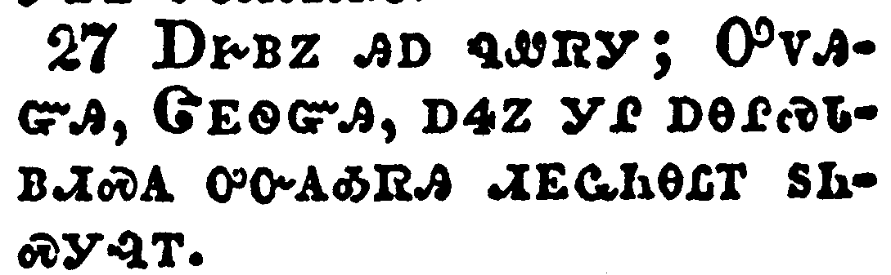</a></td>
</tr>
<tr class="even">
<td>And she said, Truth, Lord: yet the dogs eat of the crumbs which fall from their masters' table.</td>
</tr>
<tr class="odd">
<td>ᎠᎨᏴᏃ ᎯᎠ ᏄᏪᏒᎩ; ᎤᏙᎯᏳᎯ, ᏣᎬᏫᏳᎯ, ᎠᏎᏃ ᎩᎵ ᎠᎾᎵᏍᏓᏴᏗᏍᎪ ᎤᏅᎪᎣᏒᎯ ᏗᎬᏩᏂᎾᏝᎢ ᏚᏂᏍᎩᎸᎢ.</td>
</tr>
<tr class="even">
<td>A-ge-yv-no hi-a nu-we-sv-gi; U-do-hi-yu-hi, Tsa-gv-wi-yu-hi, a-se-no gi-li a-na-li-s-da-yv-di-s-go u-nv-go-o-sv-hi di-gv-wa-ni-na-tla-i du-ni-s-gi-lv-i.</td>
</tr>
</tbody>
</table>

<table>
<tbody>
<tr class="odd">
<td><a href="011528.png">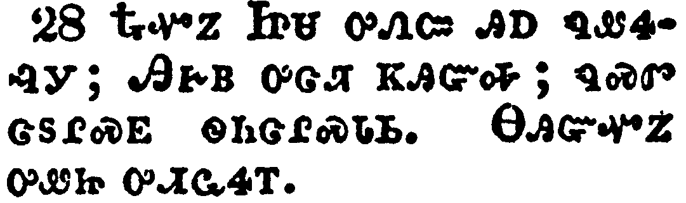</a></td>
</tr>
<tr class="even">
<td>Then Jesus answered and said unto her, O woman, great is thy faith: be it unto thee even as thou wilt. And her daughter was made whole from that very hour.</td>
</tr>
<tr class="odd">
<td>ᎿᎭᏉᏃ ᏥᏌ ᎤᏁᏨ ᎯᎠ ᏄᏪᏎᎸᎩ; ᎯᎨᏴ ᎤᏣᏘ ᏦᎯᏳᎭ; ᏄᏍᏛ ᏣᏚᎵᏍᎬ ᏫᏂᏣᎵᏍᏓᏏ. ᎾᎯᏳᏉᏃ ᎤᏪᏥ ᎤᏗᏩᏎᎢ.</td>
</tr>
<tr class="even">
<td>Hna-quo-no Tsi-sa u-ne-tsv hi-a nu-we-se-lv-gi; Hi-ge-yv u-tsa-ti tso-hi-yu-ha; nu-s-dv tsa-du-li-s-gv wi-ni-tsa-li-s-da-si. Na-hi-yu-quo-no u-we-tsi u-di-wa-se-i.</td>
</tr>
</tbody>
</table>

<table>
<tbody>
<tr class="odd">
<td><a href="011529.png">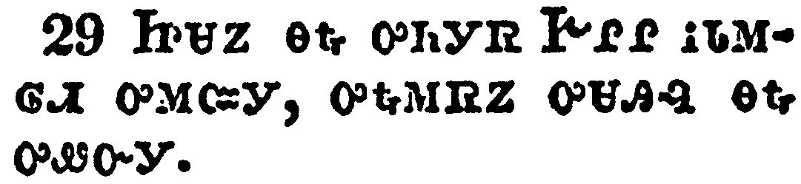</a></td>
</tr>
<tr class="even">
<td>And Jesus departed from thence, and came nigh unto the sea of Galilee; and went up into a mountain, and sat down there.</td>
</tr>
<tr class="odd">
<td>ᏥᏌᏃ ᎾᎿᎭᎤᏂᎩᏒ ᎨᎵᎵ ᎥᏓᎷᎶᏗ ᎤᎷᏨᎩ, ᎤᎿᎭᎷᏒᏃ ᎤᏌᎯᎸ ᎾᎿᎭᎤᏪᏅᎩ.</td>
</tr>
<tr class="even">
<td>Tsi-sa-no na-hna u-ni-gi-sv Ge-li-li v-da-lu-lo-di u-lu-tsv-gi, u-hna-lu-sv-no u-sa-hi-lv na-hna u-we-nv-gi.</td>
</tr>
</tbody>
</table>

<table>
<tbody>
<tr class="odd">
<td><a href="011530.png">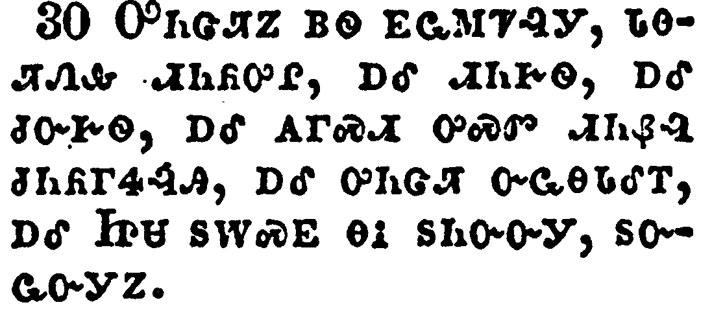</a></td>
</tr>
<tr class="even">
<td>And great multitudes came unto him, having with them those that were lame, blind, dumb, maimed, and many others, and cast them down at Jesus' feet; and he healed them:</td>
</tr>
<tr class="odd">
<td>ᎤᏂᏣᏘᏃ ᏴᏫ ᎬᏩᎷᏤᎸᎩ, ᏓᎾᏘᏁᎲ ᏗᏂᏲᎤᎵ, ᎠᎴ ᏗᏂᎨᏫ, ᎠᎴ ᏧᏅᎨᏫ, ᎠᎴ ᎪᎱᏍᏗ ᎤᏍᏛ ᏗᏂᏰᎸ ᏧᏂᏲᎱᏎᎸᎯ, ᎠᎴ ᎤᏂᏣᏘ ᏅᏩᎾᏓᎴᎢ, ᎠᎴ ᏥᏌ ᏚᎳᏍᎬ ᎾᎥ ᏚᏂᏅᏅᎩ, ᏚᏅᏩᏅᎩᏃ.</td>
</tr>
<tr class="even">
<td>U-ni-tsa-ti-no yv-wi gv-wa-lu-tse-lv-gi, da-na-ti-ne-hv di-ni-yo-u-li, a-le di-ni-ge-wi, a-le tsu-nv-ge-wi, a-le go-hu-s-di u-s-dv di-ni-ye-lv tsu-ni-yo-hu-se-lv-hi, a-le u-ni-tsa-ti nv-wa-na-da-le-i, a-le Tsi-sa du-la-s-gv na-v du-ni-nv-nv-gi, du-nv-wa-nv-gi-no.</td>
</tr>
</tbody>
</table>

<table>
<tbody>
<tr class="odd">
<td><a href="011531.png">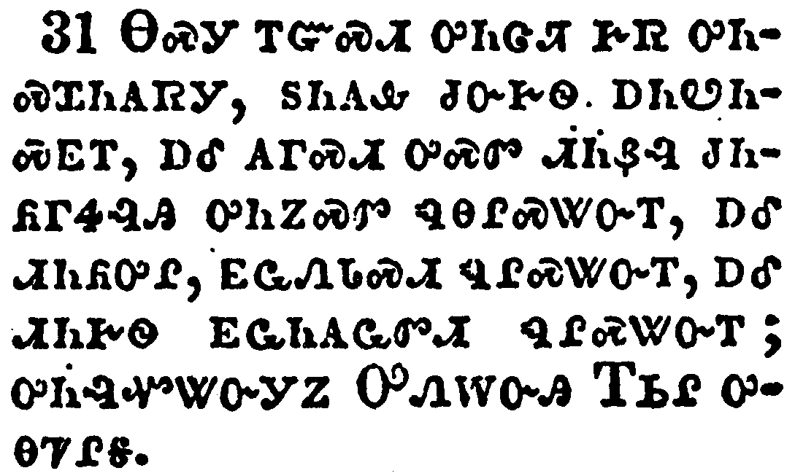</a></td>
</tr>
<tr class="even">
<td>Insomuch that the multitude wondered, when they saw the dumb to speak, the maimed to be whole, the lame to walk, and the blind to see: and they glorified the God of Israel.</td>
</tr>
<tr class="odd">
<td>ᎾᏍᎩ ᎢᏳᏍᏗ ᎤᏂᏣᏘ ᎨᏒ ᎤᏂᏍᏆᏂᎪᏒᎩ, ᏚᏂᎪᎲ ᏧᏅᎨᏫ ᎠᏂᏬᏂᏍᎪᎢ, ᎠᎴ ᎠᎱᏍᏗ ᎤᏍᏛ ᏗᏂᏰᎸ ᏧᏂᏲᎱᏎᎸᎯ ᎤᏂᏃᏍᏛ ᏄᎾᎵᏍᏔᏅᎢ, ᎠᎴ ᏗᏗᏲᎤᎵ, ᎬᏩᏁᏓᏍᏗ ᏄᎵᏍᏔᏅᎢ ᎠᎴ ᏗᏂᎨᏫ ᎬᏩᏂᎪᏩᏛᏗ ᏄᎵᏍᏔᏅᎢ; ᎤᏂᎸᏉᏔᏅᎩᏃ ᎤᏁᎳᏅᎯ ᎢᏏᎵ ᎤᎾᏤᎵᎦ.</td>
</tr>
<tr class="even">
<td>Na-s-gi i-yu-s-di u-ni-tsa-ti ge-sv u-ni-s-qua-ni-go-sv-gi, du-ni-go-hv tsu-nv-ge-wi a-ni-wo-ni-s-go-i, a-le a-hu-s-di u-s-dv di-ni-ye-lv tsu-ni-yo-hu-se-lv-hi u-ni-no-s-dv nu-na-li-s-ta-nv-i, a-le di-di-yo-u-li, gv-wa-ne-da-s-di nu-li-s-ta-nv-i a-le di-ni-ge-wi gv-wa-ni-go-wa-dv-di nu-li-s-ta-nv-i; u-ni-lv-quo-ta-nv-gi-no U-ne-la-nv-hi I-si-li u-na-tse-li-ga.</td>
</tr>
</tbody>
</table>

<table>
<tbody>
<tr class="odd">
<td><a href="011532.png">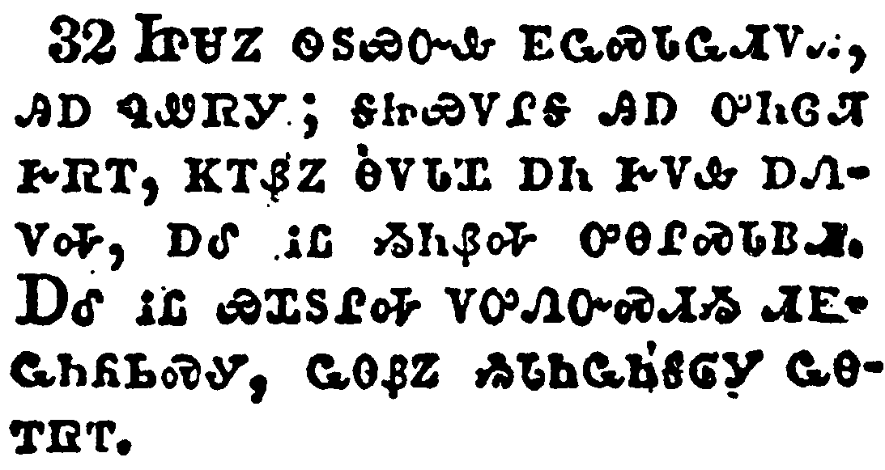</a></td>
</tr>
<tr class="even">
<td>Then Jesus called his disciples unto him, and said, I have compassion on the multitude, because they continue with me now three days, and have nothing to eat: and I will not send them away fasting, lest they faint in the way.</td>
</tr>
<tr class="odd">
<td>ᏥᏌᏃ ᏫᏚᏯᏅᎲ ᎬᏩᏍᏓᏩᏗᏙᎯ, ᎯᎠ ᏄᏪᏒᎩ; ᎦᏥᏯᏙᎵᎦ ᎯᎠ ᎤᏂᏣᏘ ᎨᏒᎢ, ᏦᎢᏰᏃ ᎾᏙᏓᏆ ᎠᏂ ᎨᏙᎲ ᎠᏁᏙᎭ, ᎠᎴ ᎥᏝ ᏱᏂᏰᎭ ᎤᎾᎵᏍᏓᏴᏗ. ᎠᎴ ᎢᏝ ᏯᏆᏚᎵᎭ ᏙᎤᏁᏅᏍᏗᏱ ᏗᎬᏩᏂᏲᏏᏍᎩ, ᏩᎾᏰᏃ ᏱᏓᏂᏩᏂᎦᎶᎩ ᏩᎾᎢᏒᎢ.</td>
</tr>
<tr class="even">
<td>Tsi-sa-no wi-du-ya-nv-hv gv-wa-s-da-wa-di-do-hi, hi-a nu-we-sv-gi; ga-tsi-ya-do-li-ga hi-a u-ni-tsa-ti ge-sv-i, tso-i-ye-no na-do-da-qua a-ni ge-do-hv a-ne-do-ha, a-le v-tla yi-ni-ye-ha u-na-li-s-da-yv-di. A-le i-tla ya-qua-du-li-ha do-u-ne-nv-s-di-yi di-gv-wa-ni-yo-si-s-gi, wa-na-ye-no yi-da-ni-wa-ni-ga-lo-gi wa-na-i-sv-i.</td>
</tr>
</tbody>
</table>

<table>
<tbody>
<tr class="odd">
<td><a href="011533.png">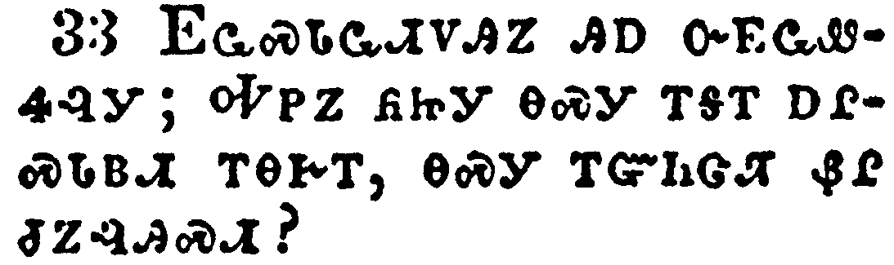</a></td>
</tr>
<tr class="even">
<td>And his disciples say unto him, Whence should we have so much bread in the wilderness, as to fill so great a multitude?</td>
</tr>
<tr class="odd">
<td>ᎬᏩᏍᏓᏩᏗᏙᎯᏃ ᎯᎠ ᏅᎬᏩᏪᏎᎸᎩ; ᎭᏢᏃ ᏲᏥᎩ ᎾᏍᎩ ᎢᎦᎢ ᎠᎵᏍᏓᏴᏗ ᎢᎾᎨᎢ, ᎾᏍᎩ ᎢᏳᏂᏣᏘ ᏰᎵ ᏧᏃᎸᎯᏍᏗ?</td>
</tr>
<tr class="even">
<td>Gv-wa-s-da-wa-di-do-hi-no hi-a nv-gv-wa-we-se-lv-gi; Ha-tlv-no yo-tsi-gi na-s-gi i-ga-i a-li-s-da-yv-di i-na-ge-i, na-s-gi i-yu-ni-tsa-ti ye-li tsu-no-lv-hi-s-di?</td>
</tr>
</tbody>
</table>

<table>
<tbody>
<tr class="odd">
<td><a href="011534.png">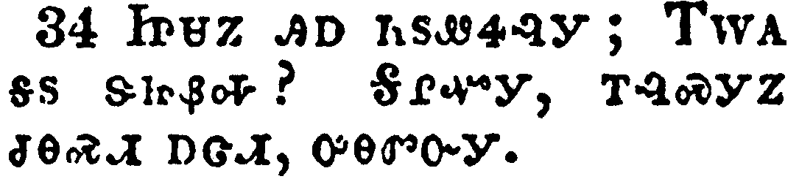</a></td>
</tr>
<tr class="even">
<td>And Jesus saith unto them, How many loaves have ye? And they said, Seven, and a few little fishes.</td>
</tr>
<tr class="odd">
<td>ᏥᏌᏃ ᎯᎠ ᏂᏚᏪᏎᎸᎩ; ᎢᎳᎪ ᎦᏚ ᏕᏥᏰᎭ? ᎦᎵᏉᎩ, ᎢᎸᏍᎩᏃ ᏧᎾᏍᏗ ᎠᏣᏗ, ᎤᎾᏛᏅᎩ.</td>
</tr>
<tr class="even">
<td>Tsi-sa-no hi-a ni-du-we-se-lv-gi; I-la-go ga-du de-tsi-ye-ha? Ga-li-quo-gi, i-lv-s-gi-no tsu-na-s-di a-tsa-di, u-na-dv-nv-gi.</td>
</tr>
</tbody>
</table>

<table>
<tbody>
<tr class="odd">
<td><a href="011535.png">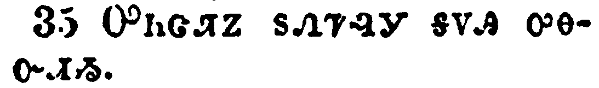</a></td>
</tr>
<tr class="even">
<td>And he commanded the multitude to sit down on the ground.</td>
</tr>
<tr class="odd">
<td>ᎤᏂᏣᏘᏃ ᏚᏁᏤᎸᎩ ᎦᏙᎯ ᎤᎾᏅᏗᏱ.</td>
</tr>
<tr class="even">
<td>U-ni-tsa-ti-no du-ne-tse-lv-gi ga-do-hi u-na-nv-di-yi.</td>
</tr>
</tbody>
</table>

<table>
<tbody>
<tr class="odd">
<td><a href="011536.png">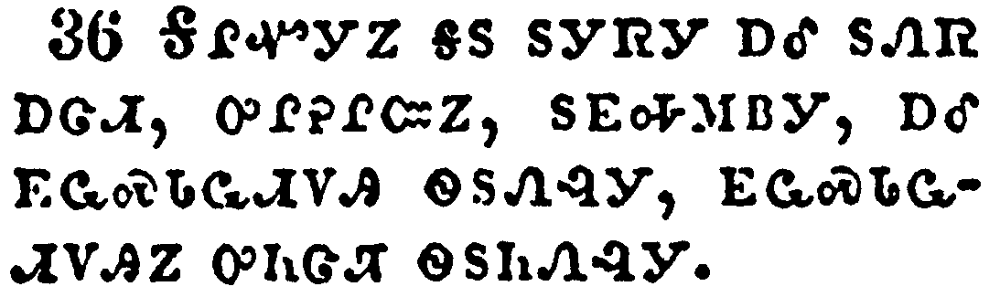</a></td>
</tr>
<tr class="even">
<td>And he took the seven loaves and the fishes, and gave thanks, and brake them, and gave to his disciples, and the disciples to the multitude.</td>
</tr>
<tr class="odd">
<td>ᎦᎵᏉᎩᏃ ᎦᏚ ᏚᎩᏒᎩ ᎠᎴ ᏚᏁᏒ ᎠᏣᏗ, ᎤᎵᎮᎵᏨᏃ, ᏚᎬᎭᎷᏴᎩ, ᎠᎴ ᎬᏩᏍᏓᏩᏗᏙᎯ ᏫᏚᏁᎸᎩ, ᎬᏩᏍᏓᏩᏗᏙᎯᏃ ᎤᏂᏣᏘ ᏫᏚᏂᏁᎸᎩ.</td>
</tr>
<tr class="even">
<td>Ga-li-quo-gi-no ga-du du-gi-sv-gi a-le du-ne-sv a-tsa-di, u-li-he-li-tsv-no, du-gv-ha-lu-yv-gi, a-le gv-wa-s-da-wa-di-do-hi wi-du-ne-lv-gi, gv-wa-s-da-wa-di-do-hi-no u-ni-tsa-ti wi-du-ni-ne-lv-gi.</td>
</tr>
</tbody>
</table>

<table>
<tbody>
<tr class="odd">
<td><a href="011537.png">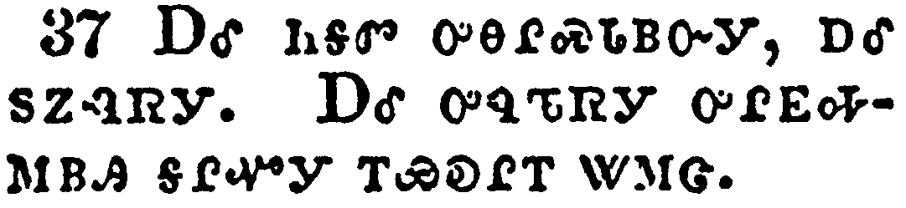</a></td>
</tr>
<tr class="even">
<td>And they did all eat, and were filled: and they took up of the broken meat that was left seven baskets full.</td>
</tr>
<tr class="odd">
<td>ᎠᎴ ᏂᎦᏛ ᎤᎾᎵᏍᏓᏴᏅᎩ, ᎠᎴ ᏚᏃᎸᏒᎩ. ᎠᎴ ᎤᏄᏖᏒᎩ ᎤᎵᎬᎭᎷᏴᎯ ᎦᎵᏉᎩ ᎢᏯᎧᎵᎢ ᏔᎷᏣ.</td>
</tr>
<tr class="even">
<td>A-le ni-ga-dv u-na-li-s-da-yv-nv-gi, a-le du-no-lv-sv-gi. A-le u-nu-te-sv-gi u-li-gv-ha-lu-yv-hi ga-li-quo-gi i-ya-ka-li-i ta-lu-tsa.</td>
</tr>
</tbody>
</table>

<table>
<tbody>
<tr class="odd">
<td></td>
</tr>
<tr class="even">
<td>And they that did eat were four thousand men, beside women and children.</td>
</tr>
<tr class="odd">
<td>ᎤᎾᎵᏍᏓᏴᎯᏃ ᏅᎩᎭ ᎢᏯᎦᏴᎵ ᎾᏂᎥᎩ ᎠᏂᏍᎦᏯ, ᏂᏓᏁᏢᏛᎾ ᎠᏂᎨᏴ ᎠᎴ ᏗᏂᏲᎵ.</td>
</tr>
<tr class="even">
<td>U-na-li-s-da-yv-hi-no nv-gi-ha i-ya-ga-yv-li na-ni-v-gi a-ni-s-ga-ya, ni-da-ne-tlv-dv-na a-ni-ge-yv a-le di-ni-yo-li.</td>
</tr>
</tbody>
</table>

<table>
<tbody>
<tr class="odd">
<td><a href="011539.png">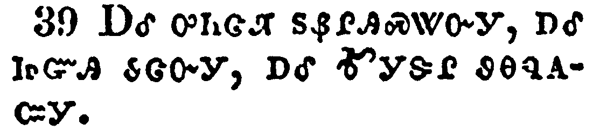</a></td>
</tr>
<tr class="even">
<td>And he sent away the multitude, and took ship, and came into the coasts of Magdala,</td>
</tr>
<tr class="odd">
<td>ᎠᎴ ᎤᏂᏣᏘ ᏚᏰᎵᎯᏍᏔᏅᎩ, ᎠᎴ ᏥᏳᎯ ᏭᏣᏅᎩ, ᎠᎴ ᎹᎩᏕᎵ ᏭᎾᏄᎪᏨᎩ.</td>
</tr>
<tr class="even">
<td>A-le u-ni-tsa-ti du-ye-li-hi-s-ta-nv-gi, a-le tsi-yu-hi wu-tsa-nv-gi, a-le ma-gi-de-li wu-na-nu-go-tsv-gi.</td>
</tr>
</tbody>
</table>

