+++
draft=false
date = 2014-12-18T21:11:07Z
title = "Matthew - Chapter 22 - Cherokee New Testament"
weight = 1418955067

[taxonomies]

authors = ["Timothy Legg"]
categories = []
tags = []

[extra]
+++

<table>
<tbody>
<tr class="odd">
<td><a href="012201.png">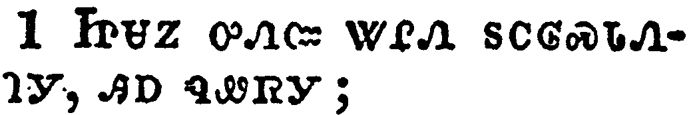</a></td>
</tr>
<tr class="even">
<td>And Jesus answered and spake unto them again by parables, and said,</td>
</tr>
<tr class="odd">
<td>ᏥᏌᏃ ᎤᏁᏨ ᏔᎵᏁ ᏚᏟᎶᏍᏓᏁᎸᎩ, ᎯᎠ ᏄᏪᏒᎩ;</td>
</tr>
<tr class="even">
<td>Tsi-sa-no u-ne-tsv ta-li-ne du-tli-lo-s-da-ne-lv-gi, hi-a nu-we-sv-gi;</td>
</tr>
</tbody>
</table>

<table>
<tbody>
<tr class="odd">
<td></td>
</tr>
<tr class="even">
<td>The kingdom of heaven is like unto a certain king, which made a marriage for his son,</td>
</tr>
<tr class="odd">
<td>ᎦᎸᎳᏗ ᎤᏤᎵᎪᎯ ᎾᏍᎩᏯᏉ ᎩᎶ ᎤᎬᏫᏳᎯ ᏧᏛᏅᎢᏍᏔᏁ ᏣᎦᏨᏍᏙᏗᏱ ᎤᏪᏥ ᎠᏫᏅ,</td>
</tr>
<tr class="even">
<td>Ga-lv-la-di u-tse-li-go-hi na-s-gi-ya-quo gi-lo u-gv-wi-yu-hi tsu-dv-nv-i-s-ta-ne tsa-ga-tsv-s-do-di-yi u-we-tsi a-wi-nv,</td>
</tr>
</tbody>
</table>

<table>
<tbody>
<tr class="odd">
<td></td>
</tr>
<tr class="even">
<td>And sent forth his servants to call them that were bidden to the wedding: and they would not come.</td>
</tr>
<tr class="odd">
<td>ᎠᎴ ᏥᏚᏅᏎ ᏧᏅᏏᏓᏍᏗ ᏧᏂᏯᏅᎲᏍᏗᏱ ᏫᎨᏥᏯᏅᏛ ᏕᎨᎦᏨᏍᏗᏍᎬ ᎤᏂᎷᎯᏍᏗᏱ; ᎠᏎᏃ ᏗᎤᏂᏳᎸᏁᏉ ᏅᏓᏳᏁᏅᏍᏗᏱ.</td>
</tr>
<tr class="even">
<td>A-le tsi-du-nv-se tsu-nv-si-da-s-di tsu-ni-ya-nv-hv-s-di-yi wi-ge-tsi-ya-nv-dv de-ge-ga-tsv-s-di-s-gv u-ni-lu-hi-s-di-yi; a-se-no di-u-ni-yu-lv-ne-quo nv-da-yu-ne-nv-s-di-yi.</td>
</tr>
</tbody>
</table>

<table>
<tbody>
<tr class="odd">
<td></td>
</tr>
<tr class="even">
<td>Again, he sent forth other servants, saying, Tell them which are bidden, Behold, I have prepared my dinner: my oxen and my fatlings are killed, and all things are ready: come unto the marriage.</td>
</tr>
<tr class="odd">
<td>ᏔᎵᏁᏃ ᏅᏩᎾᏓᎴ ᏧᏅᏏᏓᏍᏗ ᏚᏅᏎᎢ, ᎯᎠ ᏂᏚᏪᏎᎴᎢ; ᎯᎠ ᏫᏂᏗᏥᏪᏏ ᏫᎨᏥᏯᏅᏛ; ᎬᏂᏳᏉ ᎠᏆᏛᏅᎢᏍᏗ ᎠᎵᏍᏓᏴᏗ, ᏗᏆᏤᎵ ᏩᎦ ᎠᎴ ᏗᎦᎵᏦᏔᏅᎯ ᏚᏂᎸ, ᏂᎦᏗᏳᏃ ᎠᏛᏅᎢᏍᏔᏃᏅᎯ; ᏕᎨᎦᏨᏍᏗᏍᎬ ᎢᏥᎷᎩ.</td>
</tr>
<tr class="even">
<td>Ta-li-ne-no nv-wa-na-da-le tsu-nv-si-da-s-di du-nv-se-i, hi-a ni-du-we-se-le-i; Hi-a wi-ni-di-tsi-we-si wi-ge-tsi-ya-nv-dv; Gv-ni-yu-quo a-qua-dv-nv-i-s-di a-li-s-da-yv-di, di-qua-tse-li wa-ga a-le di-ga-li-tso-ta-nv-hi du-ni-lv, ni-ga-di-yu-no a-dv-nv-i-s-ta-no-nv-hi; de-ge-ga-tsv-s-di-s-gv i-tsi-lu-gi.</td>
</tr>
</tbody>
</table>

<table>
<tbody>
<tr class="odd">
<td></td>
</tr>
<tr class="even">
<td>But they made light of it, and went their ways, one to his farm, another to his merchandise:</td>
</tr>
<tr class="odd">
<td>ᎠᏎᏃ ᏅᎵᏌᎵᏉ ᏗᎤᏂᏰᎸᏁᎢ, ᎠᎴ ᎤᏣᏘᏂᏉ ᏭᏂᎶᏎᎢ, ᎠᏏᏴᏫ ᏧᎶᎨᏒᎢ, ᏐᎢᏃ ᎤᏃᏙᏗᏱ.</td>
</tr>
<tr class="even">
<td>A-se-no nv-li-sa-li-quo di-u-ni-ye-lv-ne-i, a-le u-tsa-ti-ni-quo wu-ni-lo-se-i, a-si-yv-wi tsu-lo-ge-sv-i, so-i-no u-no-do-di-yi.</td>
</tr>
</tbody>
</table>

<table>
<tbody>
<tr class="odd">
<td></td>
</tr>
<tr class="even">
<td>And the remnant took his servants, and entreated them spitefully, and slew them.</td>
</tr>
<tr class="odd">
<td>ᎠᏂᏐᎢᏃ ᏚᏂᏂᏴᎮ ᏧᏅᏏᏓᏍᏗ, ᎠᎴ ᏗᎬᏩᏂᏐᏢᏔᏁᎢ, ᎠᎴ ᏚᏂᎴᎢ.</td>
</tr>
<tr class="even">
<td>A-ni-so-i-no du-ni-ni-yv-he tsu-nv-si-da-s-di, a-le di-gv-wa-ni-so-tlv-ta-ne-i, a-le du-ni-le-i.</td>
</tr>
</tbody>
</table>

<table>
<tbody>
<tr class="odd">
<td><a href="012207.png">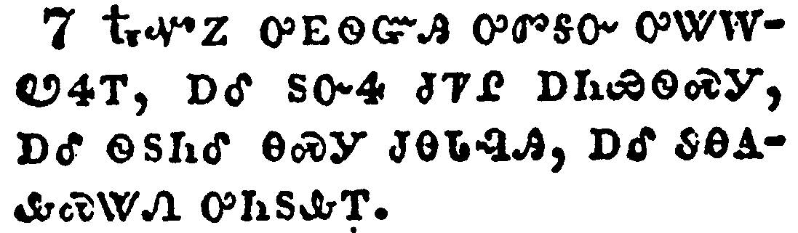</a></td>
</tr>
<tr class="even">
<td>But when the king heard thereof, he was wroth: and he sent forth his armies, and destroyed those murderers, and burned up their city.</td>
</tr>
<tr class="odd">
<td>ᎿᎭᏉᏃ ᎤᎬᏫᏳᎯ ᎤᏛᎦᏅ ᎤᏔᎳᏬᏎᎢ, ᎠᎴ ᏚᏅᏎ ᏧᏤᎵ ᎠᏂᏯᏫᏍᎩ, ᎠᎴ ᏫᏚᏂᎴ ᎾᏍᎩ ᏧᎾᏓᎸᎯ, ᎠᎴ ᏭᎾᎪᎲᏍᏔᏁ ᎤᏂᏚᎲᎢ.</td>
</tr>
<tr class="even">
<td>Hna-quo-no u-gv-wi-yu-hi u-dv-ga-nv u-ta-la-wo-se-i, a-le du-nv-se tsu-tse-li a-ni-ya-wi-s-gi, a-le wi-du-ni-le na-s-gi tsu-na-da-lv-hi, a-le wu-na-go-hv-s-ta-ne u-ni-du-hv-i.</td>
</tr>
</tbody>
</table>

<table>
<tbody>
<tr class="odd">
<td><a href="012208.png">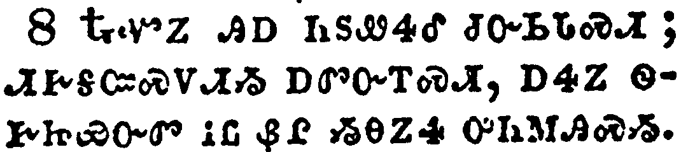</a></td>
</tr>
<tr class="even">
<td>Then saith he to his servants, The wedding is ready, but they which were bidden were not worthy.</td>
</tr>
<tr class="odd">
<td>ᎿᎭᏉᏃ ᎯᎠ ᏂᏚᏪᏎᎴ ᏧᏅᏏᏓᏍᏗ; ᏗᎨᎦᏨᏍᏙᏗᏱ ᎠᏛᏅᎢᏍᏗ, ᎠᏎᏃ ᏫᎨᏥᏯᏅᏛ ᎥᏝ ᏰᎵ ᏱᎾᏃᏎ ᎤᏂᎷᎯᏍᏱ.</td>
</tr>
<tr class="even">
<td>Hna-quo-no hi-a ni-du-we-se-le tsu-nv-si-da-s-di; di-ge-ga-tsv-s-do-di-yi a-dv-nv-i-s-di, a-se-no wi-ge-tsi-ya-nv-dv v-tla ye-li yi-na-no-se u-ni-lu-hi-s-yi.</td>
</tr>
</tbody>
</table>

<table>
<tbody>
<tr class="odd">
<td></td>
</tr>
<tr class="even">
<td>Go ye therefore into the highways, and as many as ye shall find, bid to the marriage.</td>
</tr>
<tr class="odd">
<td>ᎾᏍᎩᏃ ᎢᏳᏍᏗ ᏕᎦᏅᎿᎭᏩᏗᏒ ᏫᏥᎶᎯ, ᎾᏂᎥᏃ ᏕᏥᏩᏘᏍᎨᏍᏗ ᏕᏥᏁᏤᎮᏍᏗ ᎤᏂᎷᎯᏍᏗᏱ ᎠᏂ ᏙᏗᎨᎦᏨᏍᏔᏂᏒᎢ.</td>
</tr>
<tr class="even">
<td>Na-s-gi-no i-yu-s-di de-ga-nv-hna-wa-di-sv wi-tsi-lo-hi, na-ni-v-no de-tsi-wa-ti-s-ge-s-di de-tsi-ne-tse-he-s-di u-ni-lu-hi-s-di-yi a-ni do-di-ge-ga-tsv-s-ta-ni-sv-i.</td>
</tr>
</tbody>
</table>

<table>
<tbody>
<tr class="odd">
<td><a href="012210.png">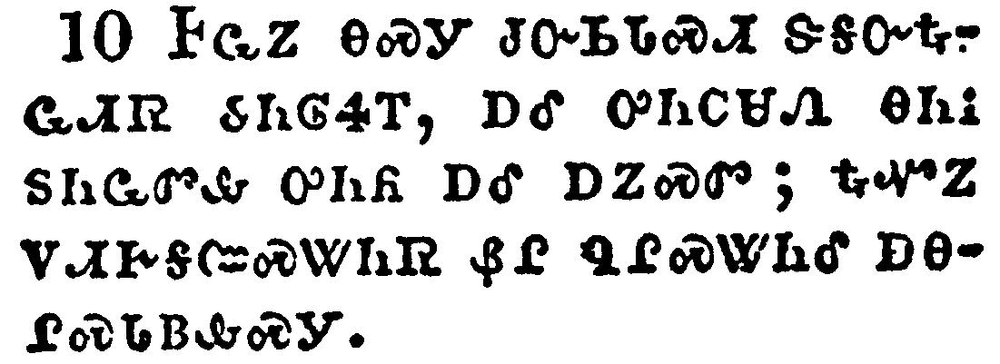</a></td>
</tr>
<tr class="even">
<td>So those servants went out into the highways, and gathered together all as many as they found, both bad and good: and the wedding was furnished with guests.</td>
</tr>
<tr class="odd">
<td>ᎰᏩᏃ ᎾᏍᎩ ᏧᏅᏏᏓᏍᏗ ᏕᎦᏅᎿᎭᏩᏗᏒ ᏭᏂᎶᏎᎢ, ᎠᎴ ᎤᏂᏟᏌᏁ ᎾᏂᎥ ᏚᏂᏩᏛᎲ ᎤᏂᏲ ᎠᎴ ᎠᏃᏍᏛ; ᎿᎭᏉᏃ ᏙᏗᎨᎦᏨᏍᏔᏂᏒ ᏰᎵ ᏄᎵᏍᏔᏂᎴ ᎠᎾᎵᏍᏓᏴᎲᏍᎩ.</td>
</tr>
<tr class="even">
<td>Ho-wa-no na-s-gi tsu-nv-si-da-s-di de-ga-nv-hna-wa-di-sv wu-ni-lo-se-i, a-le u-ni-tli-sa-ne na-ni-v du-ni-wa-dv-hv u-ni-yo a-le a-no-s-dv; hna-quo-no do-di-ge-ga-tsv-s-ta-ni-sv ye-li nu-li-s-ta-ni-le a-na-li-s-da-yv-hv-s-gi.</td>
</tr>
</tbody>
</table>

<table>
<tbody>
<tr class="odd">
<td><a href="012211.png">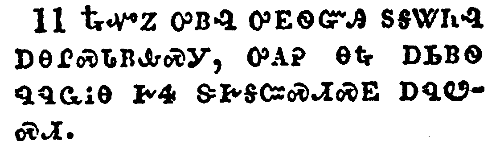</a></td>
</tr>
<tr class="even">
<td>And when the king came in to see the guests, he saw there a man which had not on a wedding garment:</td>
</tr>
<tr class="odd">
<td>ᎿᎭᏉᏃ ᎤᏴᎸ ᎤᎬᏫᏳᎯ ᏚᎦᏔᏂᎸ ᎠᎾᎵᏍᏓᏴᎲᏍᎩ, ᎤᎪᎮ ᎾᎿᎭᎠᏏᏴᏫ ᏄᏄᏩᎥᎾ ᎨᏎ ᏕᎨᎦᏨᏍᏗᏍᎬ ᎠᏄᏬᏍᏗ.</td>
</tr>
<tr class="even">
<td>Hna-quo-no u-yv-lv u-gv-wi-yu-hi du-ga-ta-ni-lv a-na-li-s-da-yv-hv-s-gi, u-go-he na-hna a-si-yv-wi nu-nu-wa-v-na ge-se de-ge-ga-tsv-s-di-s-gv a-nu-wo-s-di.</td>
</tr>
</tbody>
</table>

<table>
<tbody>
<tr class="odd">
<td><a href="012212.png">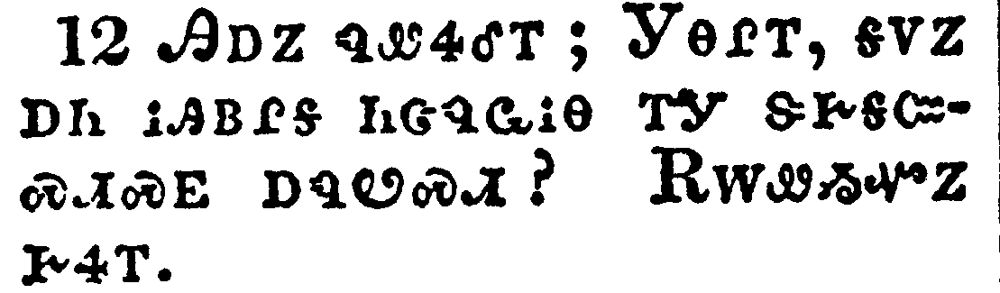</a></td>
</tr>
<tr class="even">
<td>And he saith unto him, Friend, how camest thou in hither not having a wedding garment? And he was speechless.</td>
</tr>
<tr class="odd">
<td>ᎯᎠᏃ ᏄᏪᏎᎴᎢ; ᎩᎾᎵᎢ, ᎦᏙᏃ ᎠᏂ ᎥᎯᏴᎵᎦ ᏂᏣᏄᏩᎥᎾ ᎢᎩ ᏕᎨᎦᏨᏍᏗᏍᎬ ᎠᏄᏬᏍᏗ? ᎡᎳᏪᏱᏉᏃ ᎨᏎᎢ.</td>
</tr>
<tr class="even">
<td>Hi-a-no nu-we-se-le-i; Gi-na-li-i, ga-do-no a-ni v-hi-yv-li-ga ni-tsa-nu-wa-v-na i-gi de-ge-ga-tsv-s-di-s-gv a-nu-wo-s-di? E-la-we-yi-quo-no ge-se-i.</td>
</tr>
</tbody>
</table>

<table>
<tbody>
<tr class="odd">
<td><a href="012213.png">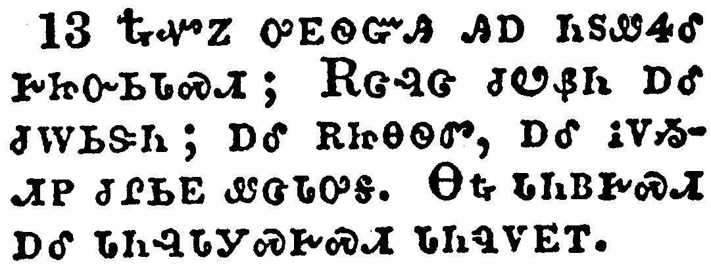</a></td>
</tr>
<tr class="even">
<td>Then said the king to the servants, Bind him hand and foot, and take him away, and cast him into outer darkness; there shall be weeping and gnashing of teeth.</td>
</tr>
<tr class="odd">
<td>ᎿᎭᏉᏃ ᎤᎬᏫᏳᎯ ᎯᎠ ᏂᏚᏪᏎᎴ ᎨᏥᏅᏏᏓᏍᏗ; ᎡᏣᎸᏣ ᏧᏬᏰᏂ ᎠᎴ ᏧᎳᏏᏕᏂ; ᎠᎴ ᎡᏥᎾᏫᏛ, ᎠᎴ ᎥᏙᏱᏗᏢ ᏧᎵᏏᎬ ᏪᏣᏓᎤᎦ. ᎾᎿᎭᏓᏂᏴᎨᏍᏗ ᎠᎴ ᏓᏂᎸᏓᎩᏍᎨᏍᏗ ᏓᏂᏄᏙᎬᎢ.</td>
</tr>
<tr class="even">
<td>Hna-quo-no u-gv-wi-yu-hi hi-a ni-du-we-se-le ge-tsi-nv-si-da-s-di; E-tsa-lv-tsa tsu-wo-ye-ni a-le tsu-la-si-de-ni; a-le e-tsi-na-wi-dv, a-le v-do-yi-di-tlv tsu-li-si-gv we-tsa-da-u-ga. Na-hna da-ni-yv-ge-s-di a-le da-ni-lv-da-gi-s-ge-s-di da-ni-nu-do-gv-i.</td>
</tr>
</tbody>
</table>

<table>
<tbody>
<tr class="odd">
<td></td>
</tr>
<tr class="even">
<td>For many are called, but few are chosen.</td>
</tr>
<tr class="odd">
<td>ᎤᏂᏣᏘᏰᏃ ᎨᏥᏯᏅᏛ, ᎠᏎᏃ ᎠᏂᎩᏲᎵᏳ ᎨᎦᏑᏰᏛ.</td>
</tr>
<tr class="even">
<td>U-ni-tsa-ti-ye-no ge-tsi-ya-nv-dv, a-se-no a-ni-gi-yo-li-yu ge-ga-su-ye-dv.</td>
</tr>
</tbody>
</table>

<table>
<tbody>
<tr class="odd">
<td></td>
</tr>
<tr class="even">
<td>Then went the Pharisees, and took counsel how they might entangle him in his talk.</td>
</tr>
<tr class="odd">
<td>ᎿᎭᏉᏃ ᎠᏂᏆᎵᏏ ᎤᏁᏅᏒᎩ ᏭᏂᏃᎮᎸᎩ ᎢᏳᎾᏛᏁᏗᏱ ᎤᏂᏌᏛᏗᏱ ᎦᏬᏂᏍᎬᎢ.</td>
</tr>
<tr class="even">
<td>Hna-quo-no A-ni-qua-li-si u-ne-nv-sv-gi wu-ni-no-he-lv-gi i-yu-na-dv-ne-di-yi u-ni-sa-dv-di-yi ga-wo-ni-s-gv-i.</td>
</tr>
</tbody>
</table>

<table>
<tbody>
<tr class="odd">
<td><a href="012216.png">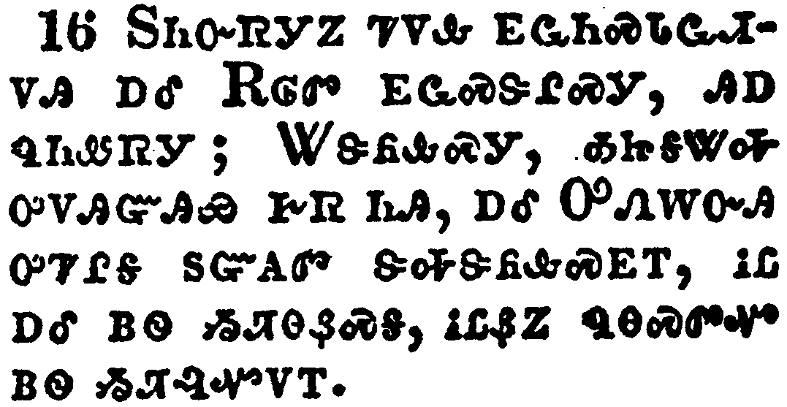</a></td>
</tr>
<tr class="even">
<td>And they sent out unto him their disciples with the Herodians, saying, Master, we know that thou art true, and teachest the way of God in truth, neither carest thou for any man: for thou regardest not the person of men.</td>
</tr>
<tr class="odd">
<td>ᏚᏂᏅᏒᎩᏃ ᏤᏙᎲ ᎬᏩᏂᏍᏓᏩᏗᏙᎯ ᎠᎴ ᎡᎶᏛ ᎬᏩᏍᏕᎵᏍᎩ, ᎯᎠ ᏄᏂᏪᏒᎩ; ᏔᏕᏲᎲᏍᎩ, ᎣᏥᎦᏔᎭ ᎤᏙᎯᏳᎩᏯ ᎨᏒ ᏂᎯ, ᎠᎴ ᎤᏁᎳᏅᎯ ᎤᏤᎵᎦ ᏚᏳᎪᏛ ᏕᎭᏕᏲᎲᏍᎬᎢ, ᎥᏝ ᎠᎴ ᏴᏫ ᏱᏘᎾᏰᏍᎦ, ᎥᏝᏰᏃ ᏄᎾᏍᏛᏉ ᏴᏫ ᏱᏘᎸᏉᏙᎢ.</td>
</tr>
<tr class="even">
<td>Du-ni-nv-sv-gi-no tse-do-hv gv-wa-ni-s-da-wa-di-do-hi a-le E-lo-dv gv-wa-s-de-li-s-gi, hi-a nu-ni-we-sv-gi; Ta-de-yo-hv-s-gi, o-tsi-ga-ta-ha u-do-hi-yu-gi-ya ge-sv ni-hi, a-le U-ne-la-nv-hi u-tse-li-ga du-yu-go-dv de-ha-de-yo-hv-s-gv-i, v-tla a-le yv-wi yi-ti-na-ye-s-ga, v-tla-ye-no nu-na-s-dv-quo yv-wi yi-ti-lv-quo-do-i.</td>
</tr>
</tbody>
</table>

<table>
<tbody>
<tr class="odd">
<td></td>
</tr>
<tr class="even">
<td>Tell us therefore, What thinkest thou? Is it lawful to give tribute unto Caesar, or not?</td>
</tr>
<tr class="odd">
<td>ᎾᏍᎩ ᎢᏳᏍᏗ ᏍᎩᏃᎲᏏ, ᎦᏙ ᎮᎵᎭ? ᏥᏌ ᏚᏳᎪᏗ ᏏᏌ ᎠᎫᏴᎡᏗᏱ ᎠᏰᎵ ᎠᎫᏴᏗ ᎨᏒᎢ; ᏝᎨ?</td>
</tr>
<tr class="even">
<td>Na-s-gi i-yu-s-di s-gi-no-hv-si, Ga-do he-li-ha? Tsi-sa du-yu-go-di Si-sa a-gu-yv-e-di-yi a-ye-li a-gu-yv-di ge-sv-i; tla-ge?</td>
</tr>
</tbody>
</table>

<table>
<tbody>
<tr class="odd">
<td></td>
</tr>
<tr class="even">
<td>But Jesus perceived their wickedness, and said, Why tempt ye me, ye hypocrites?</td>
</tr>
<tr class="odd">
<td>ᎠᏎᏃ ᏥᏌ ᎤᏙᎴᎰᏒᎩ ᎤᏲᏉ ᎠᎾᏓᏅᏖᏍᎬᎢ, ᎠᎴ ᎯᎠ ᏂᏚᏪᏎᎸᎩ; ᎦᏙᏃ ᎢᏍᎩᏌᏛᎥᏍᎦ, ᎢᏣᏠᎾᏍᏗ?</td>
</tr>
<tr class="even">
<td>A-se-no Tsi-sa u-do-le-ho-sv-gi u-yo-quo a-na-da-nv-te-s-gv-i, a-le hi-a ni-du-we-se-lv-gi; Ga-do-no i-s-gi-sa-dv-v-s-ga, i-tsa-tlo-na-s-di?</td>
</tr>
</tbody>
</table>

<table>
<tbody>
<tr class="odd">
<td></td>
</tr>
<tr class="even">
<td>Shew me the tribute money. And they brought unto him a penny.</td>
</tr>
<tr class="odd">
<td>ᏥᎪᏩᏛ ᎠᏕᎸ ᎠᏰᎵ ᎠᎫᏴᏙᏗ. ᎠᎩᏏᏃ ᏧᎬᏩᎶᏗ ᎬᏩᏲᎮᎸᎩ.</td>
</tr>
<tr class="even">
<td>Tsi-go-wa-dv a-de-lv a-ye-li a-gu-yv-do-di. A-gi-si-no tsu-gv-wa-lo-di gv-wa-yo-he-lv-gi.</td>
</tr>
</tbody>
</table>

<table>
<tbody>
<tr class="odd">
<td></td>
</tr>
<tr class="even">
<td>And he saith unto them, Whose is this image and superscription?</td>
</tr>
<tr class="odd">
<td>ᎯᎠᏃ ᏂᏚᏪᎭᎸᎩ; ᎦᎪ ᎯᎠ ᏓᎦᏟᎶᏍᏗ, ᎠᎴ ᎦᎪ ᎠᏥᏃᎮᎭ ᎯᎠ ᏥᎪᏪᎳ?</td>
</tr>
<tr class="even">
<td>Hi-a-no ni-du-we-ha-lv-gi; Ga-go hi-a da-ga-tli-lo-s-di, a-le Ga-go a-tsi-no-he-ha hi-a tsi-go-we-la?</td>
</tr>
</tbody>
</table>

<table>
<tbody>
<tr class="odd">
<td><a href="012221.png">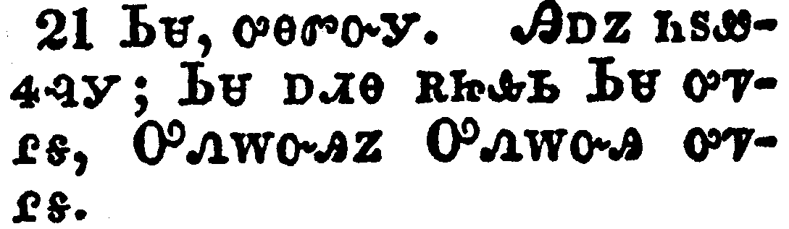</a></td>
</tr>
<tr class="even">
<td>They say unto him, Caesar's. Then saith he unto them, Render therefore unto Caesar the things which are Caesar's; and unto God the things that are God's.</td>
</tr>
<tr class="odd">
<td>ᏏᏌ, ᎤᎾᏛᏅᎩ. ᎯᎠᏃ ᏂᏚᏪᏎᎸᎩ; ᏏᏌ ᎠᏗᎾ ᎡᏥᎲᏏ ᏏᏌ ᎤᏤᎵᎦ, ᎤᏁᎳᏅᎯᏃ ᎤᏁᎳᏅᎯ ᎤᏤᎵᎦ.</td>
</tr>
<tr class="even">
<td>Si-sa, u-na-dv-nv-gi. Hi-a-no ni-du-we-se-lv-gi; Si-sa a-di-na e-tsi-hv-si Si-sa u-tse-li-ga, U-ne-la-nv-hi-no U-ne-la-nv-hi u-tse-li-ga.</td>
</tr>
</tbody>
</table>

<table>
<tbody>
<tr class="odd">
<td><a href="012222.png">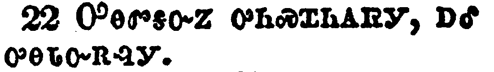</a></td>
</tr>
<tr class="even">
<td>When they had heard these words, they marvelled, and left him, and went their way.</td>
</tr>
<tr class="odd">
<td>ᎤᎾᏛᎦᏅᏃ ᎤᏂᏍᏆᏂᎪᏒᎩ, ᎠᎴ ᎤᎾᏓᏅᎡᎸᎩ.</td>
</tr>
<tr class="even">
<td>U-na-dv-ga-nv-no u-ni-s-qua-ni-go-sv-gi, a-le u-na-da-nv-e-lv-gi.</td>
</tr>
</tbody>
</table>

<table>
<tbody>
<tr class="odd">
<td><a href="012223.png">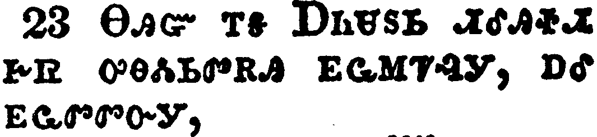</a></td>
</tr>
<tr class="even">
<td>The same day came to him the Sadducees, which say that there is no resurrection, and asked him,</td>
</tr>
<tr class="odd">
<td>ᎾᎯᏳ ᎢᎦ ᎠᏂᏌᏚᏏ ᏗᎴᎯᏐᏗ ᎨᏒ ᎤᎾᏜᏓᏏᏛᎡᎯ ᎬᏩᎷᏤᎸᎩ, ᎠᎴ ᎬᏩᏛᏛᏅᎩ,</td>
</tr>
<tr class="even">
<td>Na-hi-yu i-ga A-ni-sa-du-si di-le-hi-so-di ge-sv u-na-dla-si-dv-e-hi gv-wa-lu-tse-lv-gi, a-le gv-wa-dv-dv-nv-gi,</td>
</tr>
</tbody>
</table>

<table>
<tbody>
<tr class="odd">
<td></td>
</tr>
<tr class="even">
<td>Saying, Master, Moses said, If a man die, having no children, his brother shall marry his wife, and raise up seed unto his brother.</td>
</tr>
<tr class="odd">
<td>ᎯᎠ ᏄᏂᏪᏒᎩ; ᏔᏕᏲᎲᏍᎩ, ᎼᏏ ᎤᏁᏤ ᎯᎠ ᏄᏪᏎᎢ; ᎢᏳᏃ ᎠᏍᎦᏯ ᎠᏲᎱᏍᎨᏍᏗ ᏧᏪᏥ ᎾᏁᎲᎾ ᎨᏎᏍᏗ, ᏗᎾᏓᏅᏟ ᎠᏓᏰᎨᏍᏗ ᎤᏓᏴᏛ, ᎾᏍᎩᏃ ᏓᏛᎯᏍᏓᏁᎮᏍᏗ ᏗᏂᏲᎵ ᏗᎾᏓᏅᏟ.</td>
</tr>
<tr class="even">
<td>Hi-a nu-ni-we-sv-gi; Ta-de-yo-hv-s-gi, Mo-si u-ne-tse hi-a nu-we-se-i; I-yu-no a-s-ga-ya a-yo-hu-s-ge-s-di tsu-we-tsi na-ne-hv-na ge-se-s-di, di-na-da-nv-tli a-da-ye-ge-s-di u-da-yv-dv, na-s-gi-no da-dv-hi-s-da-ne-he-s-di di-ni-yo-li di-na-da-nv-tli.</td>
</tr>
</tbody>
</table>

<table>
<tbody>
<tr class="odd">
<td></td>
</tr>
<tr class="even">
<td>Now there were with us seven brethren: and the first, when he had married a wife, deceased, and, having no issue, left his wife unto his brother:</td>
</tr>
<tr class="odd">
<td>ᎾᏍᎩᏃ ᎠᏴ ᎣᏤᎲ ᎠᏁᎲᎩ ᎦᎵᏉᎩ ᎢᏯᏂᏛ ᎠᎾᏓᏅᏟ; ᎤᏓᏂᎵᎨᏃ ᎤᏕᏒᏅ ᎤᏲᎱᏒᏉ, ᏧᏪᏥᏃ ᎾᏁᎲᎾ ᎨᏒ ᎢᏳᏍᏗ ᎤᏓᎵᎢ ᎤᏪᎪᏓᏁᎸ ᎤᏅᏟ.</td>
</tr>
<tr class="even">
<td>Na-s-gi-no a-yv o-tse-hv a-ne-hv-gi ga-li-quo-gi i-ya-ni-dv a-na-da-nv-tli; u-da-ni-li-ge-no u-de-sv-nv u-yo-hu-sv-quo, tsu-we-tsi-no na-ne-hv-na ge-sv i-yu-s-di u-da-li-i u-we-go-da-ne-lv u-nv-tli.</td>
</tr>
</tbody>
</table>

<table>
<tbody>
<tr class="odd">
<td><a href="012226.png">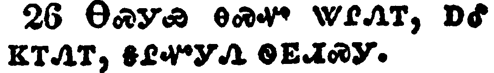</a></td>
</tr>
<tr class="even">
<td>Likewise the second also, and the third, unto the seventh.</td>
</tr>
<tr class="odd">
<td>ᎾᏍᎩᏯ ᎾᏍᏉ ᏔᎵᏁᎢ, ᎠᎴ ᏦᎢᏁᎢ, ᎦᎵᏉᎩᏁ ᏫᎬᏗᏍᎩ.</td>
</tr>
<tr class="even">
<td>Na-s-gi-ya na-s-quo ta-li-ne-i, a-le tso-i-ne-i, ga-li-quo-gi-ne wi-gv-di-s-gi.</td>
</tr>
</tbody>
</table>

<table>
<tbody>
<tr class="odd">
<td></td>
</tr>
<tr class="even">
<td>And last of all the woman died also.</td>
</tr>
<tr class="odd">
<td>ᎤᎵᏍᏆᎸᏗᏃ ᎠᎨᏴ ᎾᏍᏉ ᎤᏲᎱᏒᎩ.</td>
</tr>
<tr class="even">
<td>U-li-s-qua-lv-di-no a-ge-yv na-s-quo u-yo-hu-sv-gi.</td>
</tr>
</tbody>
</table>

<table>
<tbody>
<tr class="odd">
<td><a href="012228.png">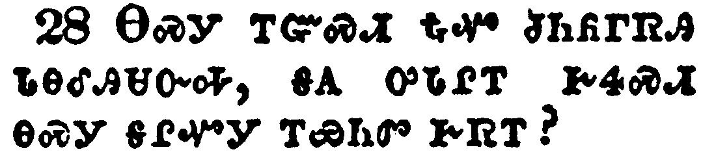</a></td>
</tr>
<tr class="even">
<td>Therefore in the resurrection whose wife shall she be of the seven? for they all had her.</td>
</tr>
<tr class="odd">
<td>ᎾᏍᎩ ᎢᏳᏍᏗ ᎿᎭᏉ ᏧᏂᏲᎱᏒᎯ ᏓᎾᎴᎯᏌᏅᎭ, ᎦᎪ ᎤᏓᎵᎢ ᎨᏎᏍᏗ ᎾᏍᎩ ᎦᎵᏉᎩ ᎢᏯᏂᏛ ᎨᏒᎢ?</td>
</tr>
<tr class="even">
<td>Na-s-gi i-yu-s-di hna-quo tsu-ni-yo-hu-sv-hi da-na-le-hi-sa-nv-ha, ga-go u-da-li-i ge-se-s-di na-s-gi ga-li-quo-gi i-ya-ni-dv ge-sv-i?</td>
</tr>
</tbody>
</table>

<table>
<tbody>
<tr class="odd">
<td><a href="012229.png">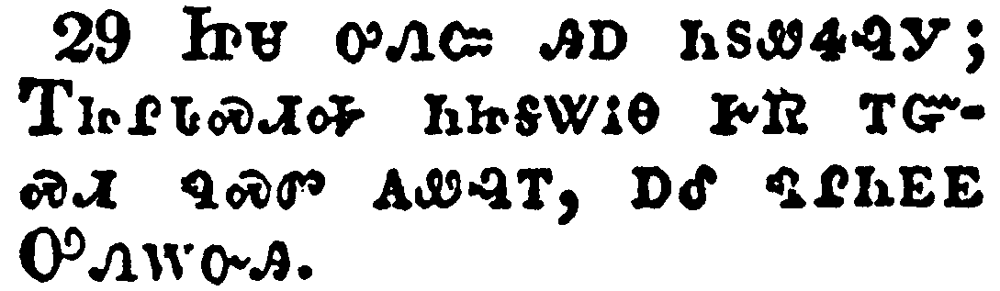</a></td>
</tr>
<tr class="even">
<td>Jesus answered and said unto them, Ye do err, not knowing the scriptures, nor the power of God.</td>
</tr>
<tr class="odd">
<td>ᏥᏌ ᎤᏁᏨ ᎯᎠ ᏂᏚᏪᏎᎸᎩ; ᎢᏥᎵᏓᏍᏗᎭ ᏂᏥᎦᏔᎥᎾ ᎨᏒ ᎢᏳᏍᏗ ᏄᏍᏛ ᎪᏪᎸᎢ, ᎠᎴ ᏄᎵᏂᎬᎬ ᎤᏁᎳᏅᎯ.</td>
</tr>
<tr class="even">
<td>Tsi-sa u-ne-tsv hi-a ni-du-we-se-lv-gi; I-tsi-li-da-s-di-ha ni-tsi-ga-ta-v-na ge-sv i-yu-s-di nu-s-dv go-we-lv-i, a-le nu-li-ni-gv-gv U-ne-la-nv-hi.</td>
</tr>
</tbody>
</table>

<table>
<tbody>
<tr class="odd">
<td><a href="012230.png">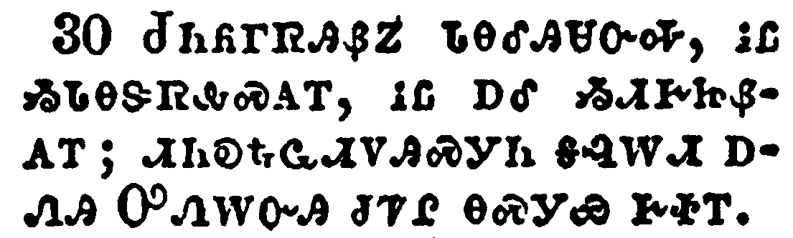</a></td>
</tr>
<tr class="even">
<td>For in the resurrection they neither marry, nor are given in marriage, but are as the angels of God in heaven.</td>
</tr>
<tr class="odd">
<td>ᏧᏂᏲᎱᏒᎯᏰᏃ ᏓᎾᎴᎯᏌᏅᎭ, ᎥᏝ ᏱᏓᎾᏕᏒᎲᏍᎪᎢ, ᎥᏝ ᎠᎴ ᏱᏗᎨᏥᏰᎪᎢ; ᏗᏂᎧᎿᎭᏩᏗᏙᎯᏍᎩᏂ ᎦᎸᎳᏗ ᎠᏁᎯ ᎤᏁᎳᏅᎯ ᏧᏤᎵ ᎾᏍᎩᏯ ᎨᏐᎢ.</td>
</tr>
<tr class="even">
<td>Tsu-ni-yo-hu-sv-hi-ye-no da-na-le-hi-sa-nv-ha, v-tla yi-da-na-de-sv-hv-s-go-i, v-tla a-le yi-di-ge-tsi-ye-go-i; di-ni-ka-hna-wa-di-do-hi-s-gi-ni ga-lv-la-di a-ne-hi U-ne-la-nv-hi tsu-tse-li na-s-gi-ya ge-so-i.</td>
</tr>
</tbody>
</table>

<table>
<tbody>
<tr class="odd">
<td><a href="012231.png">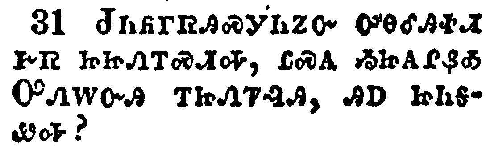</a></td>
</tr>
<tr class="even">
<td>But as touching the resurrection of the dead, have ye not read that which was spoken unto you by God, saying,</td>
</tr>
<tr class="odd">
<td>ᏧᏂᏲᎱᏒᎯᏍᎩᏂᏃᏅ ᎤᎾᎴᎯᏐᏗ ᎨᏒ ᏥᏥᏁᎢᏍᏗᎭ, ᏝᏍᎪ ᏱᏥᎪᎵᏰᎣ ᎤᏁᎳᏅᎯ ᎢᏥᏁᏤᎸᎯ, ᎯᎠ ᏥᏂᎦᏪᎭ?</td>
</tr>
<tr class="even">
<td>Tsu-ni-yo-hu-sv-hi-s-gi-ni-no-nv u-na-le-hi-so-di ge-sv tsi-tsi-ne-i-s-di-ha, tla-s-go yi-tsi-go-li-ye-o U-ne-la-nv-hi i-tsi-ne-tse-lv-hi, hi-a tsi-ni-ga-we-ha?</td>
</tr>
</tbody>
</table>

<table>
<tbody>
<tr class="odd">
<td></td>
</tr>
<tr class="even">
<td>I am the God of Abraham, and the God of Isaac, and the God of Jacob? God is not the God of the dead, but of the living.</td>
</tr>
<tr class="odd">
<td>ᎠᏴ ᎤᏁᎳᏅᎯ ᎡᏆᎭᎻ ᎤᏤᎵᎦ, ᎠᎴ ᎤᏁᎳᏅᎯ ᎡᏏᎩ ᎤᏤᎵᎦ, ᎠᎴ ᎤᏁᎳᏅᎯ ᏤᎦᏈ ᎤᏤᎵᎦ. ᎥᏝ ᎤᏁᎳᏅᎯ ᏧᏂᏲᎱᏒᎯ ᎤᎾᏤᎵ ᏱᎩ, ᏗᏅᏃᏛᏉᏍᎩᏂ ᎤᏅᏒ.</td>
</tr>
<tr class="even">
<td>A-yv U-ne-la-nv-hi E-qua-ha-mi u-tse-li-ga, a-le U-ne-la-nv-hi E-si-gi u-tse-li-ga, a-le U-ne-la-nv-hi Tse-ga-qui u-tse-li-ga. V-tla U-ne-la-nv-hi tsu-ni-yo-hu-sv-hi u-na-tse-li yi-gi, di-nv-no-dv-quo-s-gi-ni u-nv-sv.</td>
</tr>
</tbody>
</table>

<table>
<tbody>
<tr class="odd">
<td></td>
</tr>
<tr class="even">
<td>And when the multitude heard this, they were astonished at his doctrine.</td>
</tr>
<tr class="odd">
<td>ᎤᏂᏣᏘᏃ ᎤᎾᏛᎦᏅ ᎤᏂᏍᏆᏂᎪᏒᎩ ᏄᏍᏛ ᏓᏕᏲᎲᏍᎬᎢ.</td>
</tr>
<tr class="even">
<td>U-ni-tsa-ti-no u-na-dv-ga-nv u-ni-s-qua-ni-go-sv-gi nu-s-dv da-de-yo-hv-s-gv-i.</td>
</tr>
</tbody>
</table>

<table>
<tbody>
<tr class="odd">
<td></td>
</tr>
<tr class="even">
<td>But when the Pharisees had heard that he had put the Sadducees to silence, they were gathered together.</td>
</tr>
<tr class="odd">
<td>ᎠᏂᏆᎵᏏᏍᎩᏂ ᎤᎾᏛᎦᏅ ᎡᎳᏪᏱ ᏚᏩᏅ ᎠᏂᏌᏚᏏ, ᎾᏍᎩ ᏚᏂᎳᏫᏨᎩ.</td>
</tr>
<tr class="even">
<td>A-ni-qua-li-si-s-gi-ni u-na-dv-ga-nv e-la-we-yi du-wa-nv A-ni-sa-du-si, na-s-gi du-ni-la-wi-tsv-gi.</td>
</tr>
</tbody>
</table>

<table>
<tbody>
<tr class="odd">
<td><a href="012235.png">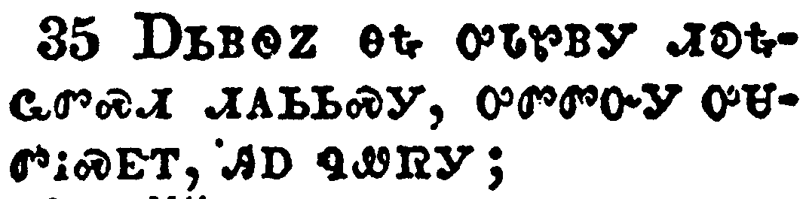</a></td>
</tr>
<tr class="even">
<td>Then one of them, which was a lawyer, asked him a question, tempting him, and saying,</td>
</tr>
<tr class="odd">
<td>ᎠᏏᏴᏫᏃ ᎾᎿᎭᎤᏓᏑᏴᎩ ᏗᎧᎿᎭᏩᏛᏍᏗ ᏗᎪᏏᏏᏍᎩ, ᎤᏛᏛᏅᎩ ᎤᏌᏛᎥᏍᎬᎢ, ᎯᎠ ᏄᏪᏒᎩ;</td>
</tr>
<tr class="even">
<td>A-si-yv-wi-no na-hna u-da-su-yv-gi di-ka-hna-wa-dv-s-di di-go-si-si-s-gi, u-dv-dv-nv-gi u-sa-dv-v-s-gv-i, hi-a nu-we-sv-gi;</td>
</tr>
</tbody>
</table>

<table>
<tbody>
<tr class="odd">
<td></td>
</tr>
<tr class="even">
<td>Master, which is the great commandment in the law?</td>
</tr>
<tr class="odd">
<td>ᏔᏕᏲᎲᏍᎩ, ᎦᏙ ᎤᏍᏗ ᎤᏟ ᎦᎸᏉᏗᏳ ᎤᎵᏁᏨ ᏗᎧᎿᎭᏩᏛᏍᏗ?</td>
</tr>
<tr class="even">
<td>Ta-de-yo-hv-s-gi, ga-do u-s-di u-tli ga-lv-quo-di-yu u-li-ne-tsv di-ka-hna-wa-dv-s-di?</td>
</tr>
</tbody>
</table>

<table>
<tbody>
<tr class="odd">
<td></td>
</tr>
<tr class="even">
<td>Jesus said unto him, Thou shalt love the Lord thy God with all thy heart, and with all thy soul, and with all thy mind.</td>
</tr>
<tr class="odd">
<td>ᏥᏌᏃ ᎯᎠ ᏄᏪᏎᎸᎩ; ᏱᎰᏩ ᏣᏁᎳᏅᎯ ᎯᎨᏳᏎᏍᏗ ᏂᎦᎥ ᏣᎾᏫ ᎲᏗᏍᎨᏍᏗ, ᎠᎴ ᏂᎦᎥ ᏣᏓᏅᏙ, ᎠᎴ ᏂᎦᎥ ᏣᏓᏅᏖᏗᏱ.</td>
</tr>
<tr class="even">
<td>Tsi-sa-no hi-a nu-we-se-lv-gi; Yi-ho-wa Tsa-ne-la-nv-hi hi-ge-yu-se-s-di ni-ga-v tsa-na-wi hv-di-s-ge-s-di, a-le ni-ga-v tsa-da-nv-do, a-le ni-ga-v tsa-da-nv-te-di-yi.</td>
</tr>
</tbody>
</table>

<table>
<tbody>
<tr class="odd">
<td><a href="012238.png">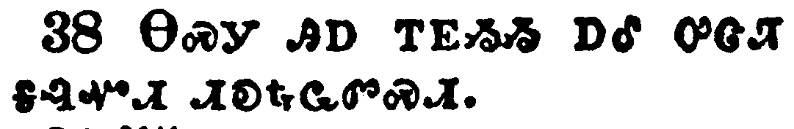</a></td>
</tr>
<tr class="even">
<td>This is the first and great commandment.</td>
</tr>
<tr class="odd">
<td>ᎾᏍᎩ ᎯᎠ ᎢᎬᏱᏱ ᎠᎴ ᎤᏣᏘ ᎦᎸᏉᏗ ᏗᎧᎿᎭᏩᏛᏍᏗ.</td>
</tr>
<tr class="even">
<td>Na-s-gi hi-a i-gv-yi-yi a-le u-tsa-ti ga-lv-quo-di di-ka-hna-wa-dv-s-di.</td>
</tr>
</tbody>
</table>

<table>
<tbody>
<tr class="odd">
<td><a href="012239.png">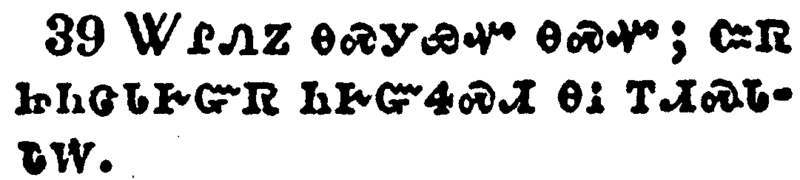</a></td>
</tr>
<tr class="even">
<td>And the second is like unto it, Thou shalt love thy neighbour as thyself.</td>
</tr>
<tr class="odd">
<td>ᏔᎵᏁᏃ ᎾᏍᎩᏯᏉ ᎾᏍᏉ; ᏨᏒ ᏥᏂᏣᏓᎨᏳᏒ ᏂᎨᏳᏎᏍᏗ ᎾᎥ ᎢᏗᏍᏓᏓᎳ.</td>
</tr>
<tr class="even">
<td>Ta-li-ne-no na-s-gi-ya-quo na-s-quo; tsv-sv tsi-ni-tsa-da-ge-yu-sv ni-ge-yu-se-s-di na-v i-di-s-da-da-la.</td>
</tr>
</tbody>
</table>

<table>
<tbody>
<tr class="odd">
<td><a href="012240.png">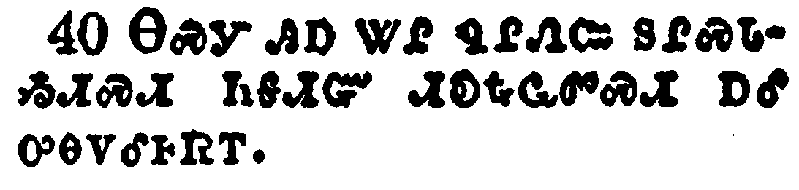</a></td>
</tr>
<tr class="even">
<td>On these two commandments hang all the law and the prophets.</td>
</tr>
<tr class="odd">
<td>ᎾᏍᎩ ᎯᎠ ᏔᎵ ᏄᎵᏁᏨ ᏚᎵᏍᏓᏱᏗᏍᏗ ᏂᎦᏗᏳ ᏗᎧᎿᎭᏩᏛᏍᏗ ᎠᎴ ᎤᎾᏙᎴᎰᏒᎢ.</td>
</tr>
<tr class="even">
<td>Na-s-gi hi-a ta-li nu-li-ne-tsv du-li-s-da-yi-di-s-di ni-ga-di-yu di-ka-hna-wa-dv-s-di a-le u-na-do-le-ho-sv-i.</td>
</tr>
</tbody>
</table>

<table>
<tbody>
<tr class="odd">
<td><a href="012241.png">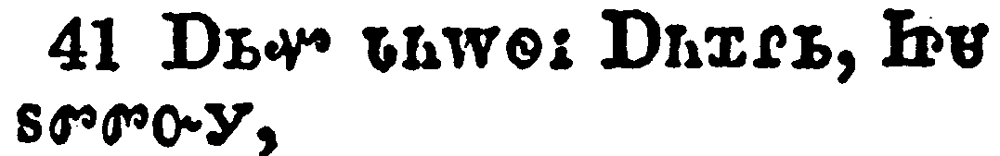</a></td>
</tr>
<tr class="even">
<td>While the Pharisees were gathered together, Jesus asked them,</td>
</tr>
<tr class="odd">
<td>ᎠᏏᏉ ᏓᏂᎳᏫᎥ ᎠᏂᏆᎵᏏ, ᏥᏌ ᏚᏛᏛᏅᎩ,</td>
</tr>
<tr class="even">
<td>A-si-quo da-ni-la-wi-v A-ni-qua-li-si, Tsi-sa du-dv-dv-nv-gi,</td>
</tr>
</tbody>
</table>

<table>
<tbody>
<tr class="odd">
<td></td>
</tr>
<tr class="even">
<td>Saying, What think ye of Christ? whose son is he? They say unto him, The Son of David.</td>
</tr>
<tr class="odd">
<td>ᎯᎠ ᏄᏪᏒᎩ; ᎦᏙ ᎢᏤᎵ ᎡᏣᏓᏅᏖᏍᎬ ᎦᎶᏁᏛ, ᎦᎪ ᎤᏪᏥ? ᏕᏫ, ᎥᎬᏬᏎᎸᎩ.</td>
</tr>
<tr class="even">
<td>Hi-a nu-we-sv-gi; Ga-do i-tse-li e-tsa-da-nv-te-s-gv Ga-lo-ne-dv, Ga-go u-we-tsi? De-wi, v-gv-wo-se-lv-gi.</td>
</tr>
</tbody>
</table>

<table>
<tbody>
<tr class="odd">
<td></td>
</tr>
<tr class="even">
<td>He saith unto them, How then doth David in spirit call him Lord, saying,</td>
</tr>
<tr class="odd">
<td>ᎯᎠ ᏂᏚᏪᏎᎸᎩ; ᎦᏙᏃ ᏗᎦᎵᏍᏙᏗᎭ, ᏕᏫ ᎠᏓᏅᏙ ᎤᏪᏲᎲᏍᎬᎢ, ᏣᎬᏫᏳᎯ, ᏥᎪᏎᎭ? ᎯᎠ ᏥᏂᎦᏪᎭ;</td>
</tr>
<tr class="even">
<td>Hi-a ni-du-we-se-lv-gi; Ga-do-no di-ga-li-s-do-di-ha, De-wi a-da-nv-do u-we-yo-hv-s-gv-i, Tsa-gv-wi-yu-hi, tsi-go-se-ha? Hi-a tsi-ni-ga-we-ha;</td>
</tr>
</tbody>
</table>

<table>
<tbody>
<tr class="odd">
<td></td>
</tr>
<tr class="even">
<td>The LORD said unto my Lord, Sit thou on my right hand, till I make thine enemies thy footstool?</td>
</tr>
<tr class="odd">
<td>ᏱᎰᏩ ᎯᎠ ᏄᏪᏎᎸᎩ ᎤᎬᏫᏳᎯ ᎠᏆᏤᎵᎦ; ᏥᎦᏘᏏ ᎢᏗᏢ ᏦᎴᏍᏗ, ᎬᏂ ᎨᏣᏍᎦᎩ ᏗᏣᎳᏏᏗᏱ ᎦᏍᎩᎶ ᏂᎦᏥᏴᏁᎸᎭ;</td>
</tr>
<tr class="even">
<td>Yi-ho-wa hi-a nu-we-se-lv-gi U-gv-wi-yu-hi a-qua-tse-li-ga; Tsi-ga-ti-si i-di-tlv tso-le-s-di, gv-ni ge-tsa-s-ga-gi di-tsa-la-si-di-yi ga-s-gi-lo ni-ga-tsi-yv-ne-lv-ha;</td>
</tr>
</tbody>
</table>

<table>
<tbody>
<tr class="odd">
<td></td>
</tr>
<tr class="even">
<td>If David then call him Lord, how is he his son?</td>
</tr>
<tr class="odd">
<td>ᎢᏳᏰᏃ ᏕᏫ, ᏣᎬᏫᏳᎯ, ᏱᎪᏎᎭ, ᎦᏙ ᏱᎦᎵᏍᏙᏓ ᎤᏪᏥ ᏱᎩ?</td>
</tr>
<tr class="even">
<td>I-yu-ye-no De-wi, Tsa-gv-wi-yu-hi, yi-go-se-ha, Ga-do yi-ga-li-s-do-da u-we-tsi yi-gi?</td>
</tr>
</tbody>
</table>

<table>
<tbody>
<tr class="odd">
<td></td>
</tr>
<tr class="even">
<td>And no man was able to answer him a word, neither durst any man from that day forth ask him any more questions.</td>
</tr>
<tr class="odd">
<td>Ꮭ ᎿᎭᏉ ᏰᎵ ᎩᎶ ᏍᎦᏁᏨᎯ ᎬᏩᏁᏤᏗ ᏱᎨᏎᎢ; Ꮭ ᎠᎴ ᎩᎶ ᎾᎯᏳ ᎢᏳᏓᎴᏅᏛ ᏰᎵ ᎦᎬᏩᏛᏛᏗ ᏱᎨᏎᎢ.</td>
</tr>
<tr class="even">
<td>Tla hna-quo ye-li gi-lo s-ga-ne-tsv-hi gv-wa-ne-tse-di yi-ge-se-i; tla a-le gi-lo na-hi-yu i-yu-da-le-nv-dv ye-li ga-gv-wa-dv-dv-di yi-ge-se-i.</td>
</tr>
</tbody>
</table>

