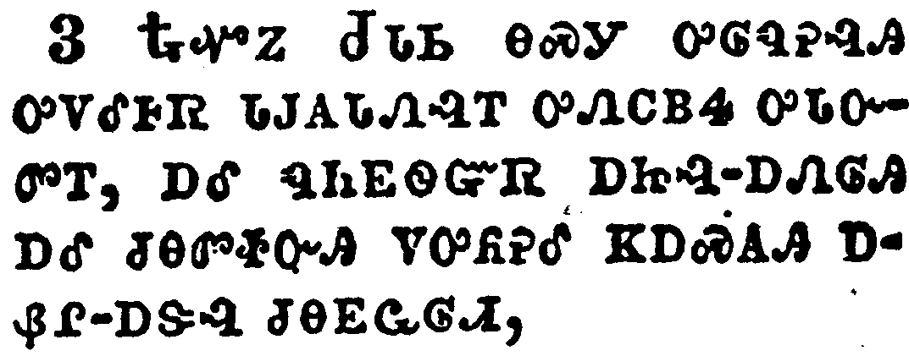
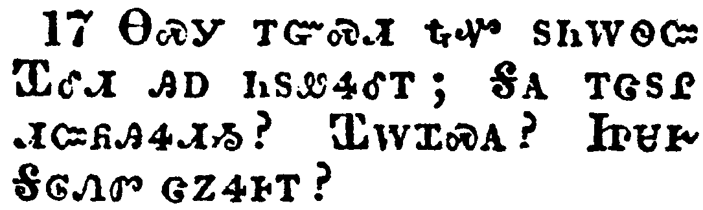
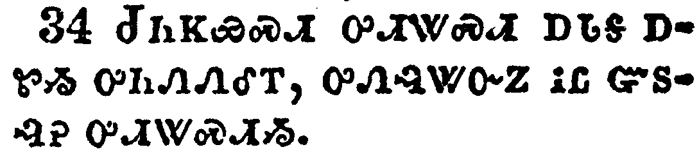
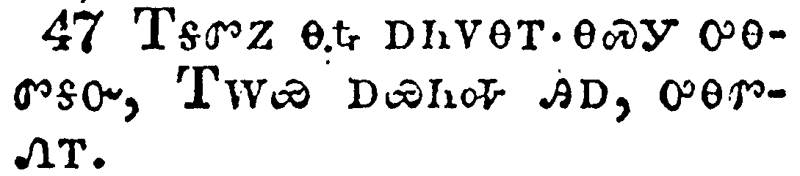

+++
draft=false
date = 2014-12-18T21:11:07Z
title = "Matthew - Chapter 27 - Cherokee New Testament"
weight = 1418955067

[taxonomies]

authors = ["Timothy Legg"]
categories = []
tags = []

[extra]
+++

<table>
<tbody>
<tr class="odd">
<td></td>
</tr>
<tr class="even">
<td>When the morning was come, all the chief priests and elders of the people took counsel against Jesus to put him to death:</td>
</tr>
<tr class="odd">
<td>ᏑᎾᎴᏃ ᏄᎵᏍᏔᏅ, ᏂᎦᏛ ᏄᏂᎬᏫᏳᏒ ᎠᏥᎸ-ᎠᏁᎶᎯ ᎠᎴ ᏗᏂᎳᏫᎩ ᎠᏁᎲ ᎠᏫ ᎤᏂᏃᎮᎴ ᎢᏳᎾᏛᏁᏗᏱ ᏥᏌ ᎤᏂᎯᏍᏗᏱ.</td>
</tr>
<tr class="even">
<td>Su-na-le-no nu-li-s-ta-nv, ni-ga-dv nu-ni-gv-wi-yu-sv a-tsi-lv--a-ne-lo-hi a-le di-ni-la-wi-gi a-ne-hv a-wi u-ni-no-he-le i-yu-na-dv-ne-di-yi Tsi-sa u-ni-hi-s-di-yi.</td>
</tr>
</tbody>
</table>

<table>
<tbody>
<tr class="odd">
<td></td>
</tr>
<tr class="even">
<td>And when they had bound him, they led him away, and delivered him to Pontius Pilate the governor.</td>
</tr>
<tr class="odd">
<td>ᎿᎭᏉᏃ ᎤᎾᎸᎸ ᎤᏁᎵᏌᎾᏫᏛᎮᎢ, ᏆᏂᏛ ᏆᎴᏗ ᎤᎬᏫᏳᎯ ᏫᏚᏂᏲᎯᏎᎴᎢ.</td>
</tr>
<tr class="even">
<td>Hna-quo-no u-na-lv-lv u-ne-li-sa-na-wi-dv-he-i, Qua-ni-dv Qua-le-di u-gv-wi-yu-hi wi-du-ni-yo-hi-se-le-i.</td>
</tr>
</tbody>
</table>

<table>
<tbody>
<tr class="odd">
<td></td>
</tr>
<tr class="even">
<td>Then Judas, which had betrayed him, when he saw that he was condemned, repented himself, and brought again the thirty pieces of silver to the chief priests and elders,</td>
</tr>
<tr class="odd">
<td>ᎿᎭᏉᏃ ᏧᏓᏏ ᎾᏍᎩ ᎤᎶᏄᎮᎸᎯ ᎤᏙᎴᎰᏒ ᏓᎫᎪᏓᏁᎸᎢ ᎤᏁᏟᏴᏎ ᎤᏓᏅᏛᎢ, ᎠᎴ ᏄᏂᎬᏫᏳᏒ ᎠᏥᎸ-ᎠᏁᎶᎯ ᎠᎴ ᏧᎾᏛᏐᏅᎯ ᏙᎤᏲᎮᎴ ᏦᎠᏍᎪᎯ ᎠᏰᎵ-ᎠᏕᎸ ᏧᎾᎬᏩᎶᏗ,</td>
</tr>
<tr class="even">
<td>Hna-quo-no Tsu-da-si na-s-gi u-lo-nu-he-lv-hi u-do-le-ho-sv da-gu-go-da-ne-lv-i u-ne-tli-yv-se u-da-nv-dv-i, a-le nu-ni-gv-wi-yu-sv a-tsi-lv--a-ne-lo-hi a-le tsu-na-dv-so-nv-hi do-u-yo-he-le tso-a-s-go-hi a-ye-li--a-de-lv tsu-na-gv-wa-lo-di,</td>
</tr>
</tbody>
</table>

<table>
<tbody>
<tr class="odd">
<td></td>
</tr>
<tr class="even">
<td>Saying, I have sinned in that I have betrayed the innocent blood. And they said, What is that to us? see thou to that.</td>
</tr>
<tr class="odd">
<td>ᎯᎠ ᏄᏪᏎᎢ; ᏥᏍᎦᏅᎩ ᏄᏍᎦᏅᏨᎾ ᎩᎬ ᏥᎦᏡᏓ. ᎯᎠᏃ ᏄᏂᏪᏎᎢ; ᎦᏙ ᎾᏍᎩ ᎠᏴ ᎣᎬᏙᏗ? ᏨᏒ ᎾᏍᎩ ᏗᏣᎸᏫᏍᏓᏏ.</td>
</tr>
<tr class="even">
<td>Hi-a nu-we-se-i; tsi-s-ga-nv-gi nu-s-ga-nv-tsv-na gi-gv tsi-ga-tlu-da. Hi-a-no nu-ni-we-se-i; Ga-do na-s-gi a-yv o-gv-do-di? Tsv-sv na-s-gi di-tsa-lv-wi-s-da-si.</td>
</tr>
</tbody>
</table>

<table>
<tbody>
<tr class="odd">
<td></td>
</tr>
<tr class="even">
<td>And he cast down the pieces of silver in the temple, and departed, and went and hanged himself.</td>
</tr>
<tr class="odd">
<td>ᎠᎴ ᏚᏗᏅ ᎠᏕᎸ ᎾᎿᎭᏗᎦᎳᏫᎢᏍᏗᏱ, ᎠᎴ ᎤᏄᎪᏤᎢ, ᎠᎴ ᎢᏴᏛ ᏭᎶᏒ, ᎤᏩᏒ ᏭᏓᏛᏁᎢ.</td>
</tr>
<tr class="even">
<td>A-le du-di-nv a-de-lv na-hna di-ga-la-wi-i-s-di-yi, a-le u-nu-go-tse-i, a-le i-yv-dv wu-lo-sv, u-wa-sv wu-da-dv-ne-i.</td>
</tr>
</tbody>
</table>

<table>
<tbody>
<tr class="odd">
<td></td>
</tr>
<tr class="even">
<td>And the chief priests took the silver pieces, and said, It is not lawful for to put them into the treasury, because it is the price of blood.</td>
</tr>
<tr class="odd">
<td>ᏄᏂᎬᏫᏳᏒᏃ ᎠᏥᎸ-ᎠᏁᎶᎯ ᏚᏂᎩᏒ ᎠᏕᎸ ᎯᎠ ᏄᏂᏪᏎᎢ; ᎥᏝ ᏚᏳᎪᏛ ᏱᎦᎩ ᎠᏕᎸ-ᏗᏗᏱ ᏱᏗᏗᎲᏍᎦ, ᎩᎬᏰᏃ ᏧᎬᏩᎳᏅᎯ.</td>
</tr>
<tr class="even">
<td>Nu-ni-gv-wi-yu-sv-no a-tsi-lv--a-ne-lo-hi du-ni-gi-sv a-de-lv hi-a nu-ni-we-se-i; v-tla du-yu-go-dv yi-ga-gi a-de-lv--di-di-yi yi-di-di-hv-s-ga, gi-gv-ye-no tsu-gv-wa-la-nv-hi.</td>
</tr>
</tbody>
</table>

<table>
<tbody>
<tr class="odd">
<td></td>
</tr>
<tr class="even">
<td>And they took counsel, and bought with them the potter's field, to bury strangers in.</td>
</tr>
<tr class="odd">
<td>ᎤᏂᏃᎮᎸᏃ, ᎤᏂᏩᎯᏍᏔᏁ ᎥᏘ ᏗᎪᏢᏍᎩ ᎤᎶᎨᏒᎢ ᎾᎿᎭᎠᏁᏙᎯ ᏗᎨᏥᏂᏐᏗᏱ.</td>
</tr>
<tr class="even">
<td>U-ni-no-he-lv-no, u-ni-wa-hi-s-ta-ne v-ti di-go-tlv-s-gi u-lo-ge-sv-i na-hna a-ne-do-hi di-ge-tsi-ni-so-di-yi.</td>
</tr>
</tbody>
</table>

<table>
<tbody>
<tr class="odd">
<td></td>
</tr>
<tr class="even">
<td>Wherefore that field was called, The field of blood, unto this day.</td>
</tr>
<tr class="odd">
<td>ᎾᏍᎩ ᎢᏳᏍᏗ ᎾᏍᎩ ᏠᎨᏏ ᎩᎬ ᎤᎶᎨᏒ ᎠᏃᏎᎭ ᎪᎯ ᏥᎩ.</td>
</tr>
<tr class="even">
<td>Na-s-gi i-yu-s-di na-s-gi tlo-ge-si gi-gv u-lo-ge-sv a-no-se-ha go-hi tsi-gi.</td>
</tr>
</tbody>
</table>

<table>
<tbody>
<tr class="odd">
<td></td>
</tr>
<tr class="even">
<td>Then was fulfilled that which was spoken by Jeremy the prophet, saying, And they took the thirty pieces of silver, the price of him that was valued, whom they of the children of Israel did value;</td>
</tr>
<tr class="odd">
<td>ᎿᎭᏉᏃ ᎤᏙᎯᏳᏁ ᏧᏁᏤ ᏤᎵᎹᏯ ᎠᏙᎴᎰᏍᎩ, ᎯᎠ ᏥᏄᏪᏎᎢ; ᎠᎴ ᏚᏂᎩᏒᎩ ᏦᎠᏍᎪᎯ ᎠᏰᎵ-ᎠᏕᎸ ᎾᏍᎩ Ꮎ ᏧᎬᏩᏔᏅᎯ, ᎾᏍᎩ ᏣᏥᎬᏩᎶᏔᏅᎯ, ᎢᏏᎵ ᏧᏪᏥ ᏧᏂᎬᏩᎶᏔᏅᎯ,</td>
</tr>
<tr class="even">
<td>Hna-quo-no u-do-hi-yu-ne tsu-ne-tse Tse-li-ma-ya a-do-le-ho-s-gi, hi-a tsi-nu-we-se-i; A-le du-ni-gi-sv-gi tso-a-s-go-hi a-ye-li--a-de-lv na-s-gi na tsu-gv-wa-ta-nv-hi, na-s-gi tsa-tsi-gv-wa-lo-ta-nv-hi, I-si-li tsu-we-tsi tsu-ni-gv-wa-lo-ta-nv-hi,</td>
</tr>
</tbody>
</table>

<table>
<tbody>
<tr class="odd">
<td></td>
</tr>
<tr class="even">
<td>And gave them for the potter's field, as the Lord appointed me.</td>
</tr>
<tr class="odd">
<td>ᎠᎴ ᎤᏂᏩᎯᏍᏔᏅᎩ ᎥᏘ ᏗᎪᏢᏍᎩ ᎤᎶᎨᏒᎢ, ᎾᏍᎩᏯ ᏱᎰᏩ ᎠᏇᏲᏅᎢ.</td>
</tr>
<tr class="even">
<td>A-le u-ni-wa-hi-s-ta-nv-gi v-ti di-go-tlv-s-gi u-lo-ge-sv-i, na-s-gi-ya Yi-ho-wa a-que-yo-nv-i.</td>
</tr>
</tbody>
</table>

<table>
<tbody>
<tr class="odd">
<td></td>
</tr>
<tr class="even">
<td>And Jesus stood before the governor: and the governor asked him, saying, Art thou the King of the Jews? And Jesus said unto him, Thou sayest.</td>
</tr>
<tr class="odd">
<td>ᏥᏌᏃ ᎦᏙᎨ ᎢᎬᏱᏗᏢ ᎤᎬᏫᏳᎯ ᎤᏬᎸᎢ. ᎤᎬᏫᏳᎯᏃ ᎤᏛᏛᏁᎢ, ᎯᎠ ᏄᏪᏎᎢ; ᏂᎯᏍᎪ ᏣᎬᏫᏳᎯ ᎠᏂᏧᏏ ᎤᎾᏤᎵᎦ? ᏥᏌᏃ ᎯᎠ ᏄᏪᏎᎴᎢ; ᏰᎵᏂᏫ.</td>
</tr>
<tr class="even">
<td>Tsi-sa-no ga-do-ge i-gv-yi-di-tlv u-gv-wi-yu-hi u-wo-lv-i. U-gv-wi-yu-hi-no u-dv-dv-ne-i, hi-a nu-we-se-i; ni-hi-s-go Tsa-gv-wi-yu-hi A-ni-tsu-si u-na-tse-li-ga? Tsi-sa-no hi-a nu-we-se-le-i; Ye-li-ni-wi.</td>
</tr>
</tbody>
</table>

<table>
<tbody>
<tr class="odd">
<td></td>
</tr>
<tr class="even">
<td>And when he was accused of the chief priests and elders, he answered nothing.</td>
</tr>
<tr class="odd">
<td>ᏄᏂᎬᏫᏳᏒᏃ ᎠᏥᎸ-ᎠᏁᎶᎯ ᎠᎴ ᏗᏂᎳᏫᎩ ᎬᏩᏱᎵᏙᎸ ᎥᏝ ᏳᏁᏤᎢ.</td>
</tr>
<tr class="even">
<td>Nu-ni-gv-wi-yu-sv-no a-tsi-lv--a-ne-lo-hi a-le di-ni-la-wi-gi gv-wa-yi-li-do-lv v-tla yu-ne-tse-i.</td>
</tr>
</tbody>
</table>

<table>
<tbody>
<tr class="odd">
<td></td>
</tr>
<tr class="even">
<td>Then said Pilate unto him, Hearest thou not how many things they witness against thee?</td>
</tr>
<tr class="odd">
<td>ᎿᎭᏉᏃ ᏆᎴᏗ ᎯᎠ ᏄᏪᏎᎴᎢ; ᏝᏍᎪ ᏯᏛᎩᎭ ᏂᎦᎥ ᎬᏂᎨᏒ ᎾᏅᏁᎲ ᎠᏂᎦᏔᎯ ᎨᏣᏡᏗᏍᎬᎢ?</td>
</tr>
<tr class="even">
<td>Hna-quo-no Qua-le-di hi-a nu-we-se-le-i; Tla-s-go ya-dv-gi-ha ni-ga-v gv-ni-ge-sv na-nv-ne-hv a-ni-ga-ta-hi ge-tsa-tlu-di-s-gv-i?</td>
</tr>
</tbody>
</table>

<table>
<tbody>
<tr class="odd">
<td></td>
</tr>
<tr class="even">
<td>And he answered him to never a word; insomuch that the governor marvelled greatly.</td>
</tr>
<tr class="odd">
<td>ᎠᏎᏃ ᎥᏝ ᏌᏉᎤᏅ ᏱᏄᏁᏤᎢ, ᎾᏍᎩ ᎢᏳᏍᏗ ᎤᎬᏫᏳᎯ ᎤᏣᏘ ᎤᏍᏆᏂᎪᏎᎢ.</td>
</tr>
<tr class="even">
<td>A-se-no v-tla sa-quo-u-nv yi-nu-ne-tse-i, na-s-gi i-yu-s-di u-gv-wi-yu-hi u-tsa-ti u-s-qua-ni-go-se-i.</td>
</tr>
</tbody>
</table>

<table>
<tbody>
<tr class="odd">
<td></td>
</tr>
<tr class="even">
<td>Now at that feast the governor was wont to release unto the people a prisoner, whom they would.</td>
</tr>
<tr class="odd">
<td>ᏗᎵᏍᏓᏴᏗᏱᏃ ᎨᏒ ᎢᏳᎢ ᎤᎬᏫᏳᎯ ᏧᏲᎯᏎᏗ ᎨᏐ ᏌᏉ ᎠᏴᎩ, ᎯᎠᏉ ᎠᏁᎳ ᏴᏫ.</td>
</tr>
<tr class="even">
<td>Di-li-s-da-yv-di-yi-no ge-sv i-yu-i u-gv-wi-yu-hi tsu-yo-hi-se-di ge-so sa-quo a-yv-gi, hi-a-quo a-ne-la yv-wi.</td>
</tr>
</tbody>
</table>

<table>
<tbody>
<tr class="odd">
<td></td>
</tr>
<tr class="even">
<td>And they had then a notable prisoner, called Barabbas.</td>
</tr>
<tr class="odd">
<td>ᎾᎯᏳᏃ ᏗᎦᏃᏣᎵ ᎠᏴᎩ ᎤᏂᎧᎮ ᏆᎳᏆ ᏧᏙᎢᏛ.</td>
</tr>
<tr class="even">
<td>Na-hi-yu-no di-ga-no-tsa-li a-yv-gi u-ni-ka-he Qua-la-qua tsu-do-i-dv.</td>
</tr>
</tbody>
</table>

<table>
<tbody>
<tr class="odd">
<td></td>
</tr>
<tr class="even">
<td>Therefore when they were gathered together, Pilate said unto them, Whom will ye that I release unto you? Barabbas, or Jesus which is called Christ?</td>
</tr>
<tr class="odd">
<td>ᎾᏍᎩ ᎢᏳᏍᏗ ᎿᎭᏉ ᏚᏂᎳᏫᏨ ᏆᎴᏗ ᎯᎠ ᏂᏚᏪᏎᎴᎢ; ᎦᎪ ᎢᏣᏚᎵ ᏗᏨᏲᎯᏎᏗᏱ? ᏆᎳᏆᏍᎪ? ᏥᏌᎨ ᎦᎶᏁᏛ ᏣᏃᏎᎰᎢ?</td>
</tr>
<tr class="even">
<td>Na-s-gi i-yu-s-di hna-quo du-ni-la-wi-tsv Qua-le-di hi-a ni-du-we-se-le-i; Ga-go i-tsa-du-li di-tsv-yo-hi-se-di-yi? Qua-la-qua-s-go? Tsi-sa-ge Ga-lo-ne-dv tsa-no-se-ho-i?</td>
</tr>
</tbody>
</table>

<table>
<tbody>
<tr class="odd">
<td></td>
</tr>
<tr class="even">
<td>For he knew that for envy they had delivered him.</td>
</tr>
<tr class="odd">
<td>ᎠᎦᏔᎮᏰᏃ ᎠᏅᏳᎬᏉ ᏅᏗᎦᎵᏍᏙᏗᏍᎬ ᏚᏂᏲᏒᎢ.</td>
</tr>
<tr class="even">
<td>A-ga-ta-he-ye-no a-nv-yu-gv-quo nv-di-ga-li-s-do-di-s-gv du-ni-yo-sv-i.</td>
</tr>
</tbody>
</table>

<table>
<tbody>
<tr class="odd">
<td></td>
</tr>
<tr class="even">
<td>When he was set down on the judgment seat, his wife sent unto him, saying, Have thou nothing to do with that just man: for I have suffered many things this day in a dream because of him.</td>
</tr>
<tr class="odd">
<td>ᎤᏬᎸᏃ ᏗᎫᎪᏙᏗᏱ ᎦᏍᎩᎸᎢ ᎤᏓᎵᎢ ᏧᏓᏅᏎᎢ, ᎯᎠ ᏅᏧᏪᏎᎴᎢ; ᏞᏍᏗ ᏂᎯ ᎪᎱᏍᏗ Ꮎ ᎾᏍᎦᏅᎾ ᎠᏍᎦᏯ ᎤᎬᏩᎵ ᏱᏗᏣᎸᏫᏍᏓᏁᎴᏍᏗ, ᎤᏣᏘᏰᏃ ᏥᎩᎵᏲᎩ ᎪᎯ ᎢᎦ ᎦᏍᎩᏓᏍᎬᎢ ᎾᏍᎩ ᏅᏗᎦᎵᏍᏙᏗᏍᎬᎢ.</td>
</tr>
<tr class="even">
<td>U-wo-lv-no di-gu-go-do-di-yi ga-s-gi-lv-i u-da-li-i tsu-da-nv-se-i, hi-a nv-tsu-we-se-le-i; Tle-s-di ni-hi go-hu-s-di na na-s-ga-nv-na a-s-ga-ya u-gv-wa-li yi-di-tsa-lv-wi-s-da-ne-le-s-di, u-tsa-ti-ye-no tsi-gi-li-yo-gi go-hi i-ga ga-s-gi-da-s-gv-i na-s-gi nv-di-ga-li-s-do-di-s-gv-i.</td>
</tr>
</tbody>
</table>

<table>
<tbody>
<tr class="odd">
<td></td>
</tr>
<tr class="even">
<td>But the chief priests and elders persuaded the multitude that they should ask Barabbas, and destroy Jesus.</td>
</tr>
<tr class="odd">
<td>ᎠᏎᏃ ᏄᏂᎬᏫᏳᏒ ᎠᏥᎸ-ᎠᏁᎶᎯ ᎠᎴ ᏗᏂᎳᏫᎩ ᏚᏂᏍᏗᏰᏔᏁ ᎤᏂᏣᏘ ᎨᏒ ᏆᎳᏆ ᎤᏂᏔᏲᏎᏗᏱ, ᏥᏌᏃ ᎤᏂᎯᏍᏗᏱ.</td>
</tr>
<tr class="even">
<td>A-se-no nu-ni-gv-wi-yu-sv a-tsi-lv--a-ne-lo-hi a-le di-ni-la-wi-gi du-ni-s-di-ye-ta-ne u-ni-tsa-ti ge-sv Qua-la-qua u-ni-ta-yo-se-di-yi, Tsi-sa-no u-ni-hi-s-di-yi.</td>
</tr>
</tbody>
</table>

<table>
<tbody>
<tr class="odd">
<td></td>
</tr>
<tr class="even">
<td>The governor answered and said unto them, Whether of the twain will ye that I release unto you? They said, Barabbas.</td>
</tr>
<tr class="odd">
<td>ᎤᎬᏫᏳᎯᏃ ᎤᏁᏨ ᎯᎠ ᏂᏚᏪᏎᎴᎢ; ᎦᎪ ᎯᎠ ᎠᏂᏔᎵ ᎨᏒ ᎢᏣᏚᎵ ᏗᏨᏲᎯᏎᏗᏱ? ᏆᎳᏆ, ᎤᎾᏛᏁᎢ.</td>
</tr>
<tr class="even">
<td>U-gv-wi-yu-hi-no u-ne-tsv hi-a ni-du-we-se-le-i; Ga-go hi-a a-ni-ta-li ge-sv i-tsa-du-li di-tsv-yo-hi-se-di-yi? Qua-la-qua, u-na-dv-ne-i.</td>
</tr>
</tbody>
</table>

<table>
<tbody>
<tr class="odd">
<td></td>
</tr>
<tr class="even">
<td>Pilate saith unto them, What shall I do then with Jesus which is called Christ? They all say unto him, Let him be crucified.</td>
</tr>
<tr class="odd">
<td>ᏆᎴᏗ ᎯᎠ ᏂᏚᏪᏎᎴᎢ; ᎦᏙᏃ ᏓᏥᏴᏁᎵ ᏥᏌ, ᎦᎶᏁᏛ ᏣᏃᏎᎰᎢ? ᏩᎦᏛᎥᎦ, ᎬᏬᏎᎴ ᏂᎦᏛ.</td>
</tr>
<tr class="even">
<td>Qua-le-di hi-a ni-du-we-se-le-i; Ga-do-no da-tsi-yv-ne-li Tsi-sa, Ga-lo-ne-dv tsa-no-se-ho-i? Wa-ga-dv-v-ga, gv-wo-se-le ni-ga-dv.</td>
</tr>
</tbody>
</table>

<table>
<tbody>
<tr class="odd">
<td></td>
</tr>
<tr class="even">
<td>And the governor said, Why, what evil hath he done? But they cried out the more, saying, Let him be crucified.</td>
</tr>
<tr class="odd">
<td>ᎤᎬᏫᏳᎯᏃ ᎯᎠ ᏄᏪᏎᎢ; ᎦᏙᏃ, ᎦᏙ ᎤᏛᏁᎸ ᎤᏍᎦᏅᏨ? ᎠᏎᏃ ᎤᏟᏉ ᏂᎦᎡ ᎤᏁᎷᏁᎢ, ᏩᎦᏛᎥᎦ, ᎠᎾᏗᏍᎬᎢ.</td>
</tr>
<tr class="even">
<td>U-gv-wi-yu-hi-no hi-a nu-we-se-i; Ga-do-no, ga-do u-dv-ne-lv u-s-ga-nv-tsv? A-se-no u-tli-quo ni-ga-e u-ne-lu-ne-i, wa-ga-dv-v-ga, a-na-di-s-gv-i.</td>
</tr>
</tbody>
</table>

<table>
<tbody>
<tr class="odd">
<td></td>
</tr>
<tr class="even">
<td>When Pilate saw that he could prevail nothing, but that rather a tumult was made, he took water, and washed his hands before the multitude, saying, I am innocent of the blood of this just person: see ye to it.</td>
</tr>
<tr class="odd">
<td>ᏆᎴᏗ ᎤᏙᎴᎰᏒ ᏗᎬᏩᏎᎪᎩᏍᏗ ᏂᎨᏒᎾ ᎨᏒᎢ, ᎠᎴ ᎤᎾᏓᏑᏰᏛ ᎤᎾᎵᏔᎸᏅᎩ, ᎠᎹ ᏬᏁᎩᏎᎢ, ᎠᎴ ᏚᏑᎴᎮ ᎤᏂᏣᏘ ᎠᏂᎦᏔᎲᎢ, ᎯᎠ ᏄᏪᏎᎢ; ᎠᏴ ᎥᏝ ᎠᎩᏍᎦᏅᏨᎯ ᏱᎩ ᎯᎠ ᏄᏍᎦᏅᏨᎾ ᏴᏫ ᎤᎩᎬ. ᏂᎯ ᎢᏣᎦᏌᏯᏍᏓ.</td>
</tr>
<tr class="even">
<td>Qua-le-di u-do-le-ho-sv di-gv-wa-se-go-gi-s-di ni-ge-sv-na ge-sv-i, a-le u-na-da-su-ye-dv u-na-li-ta-lv-nv-gi, a-ma wo-ne-gi-se-i, a-le du-su-le-he u-ni-tsa-ti a-ni-ga-ta-hv-i, hi-a nu-we-se-i; A-yv v-tla a-gi-s-ga-nv-tsv-hi yi-gi hi-a nu-s-ga-nv-tsv-na yv-wi u-gi-gv. Ni-hi i-tsa-ga-sa-ya-s-da.</td>
</tr>
</tbody>
</table>

<table>
<tbody>
<tr class="odd">
<td></td>
</tr>
<tr class="even">
<td>Then answered all the people, and said, His blood be on us, and on our children.</td>
</tr>
<tr class="odd">
<td>ᏂᎦᏛᏃ ᏴᏫ ᎤᏂᏁᏤᎢ, ᎯᎠ ᏄᏂᏪᏎᎢ; ᎤᎩᎬ ᎠᏴ ᎠᎴ ᏦᎨᏥ ᎣᎩᏅᎦᎴᏍᏗ.</td>
</tr>
<tr class="even">
<td>Ni-ga-dv-no yv-wi u-ni-ne-tse-i, hi-a nu-ni-we-se-i; U-gi-gv a-yv a-le tso-ge-tsi o-gi-nv-ga-le-s-di.</td>
</tr>
</tbody>
</table>

<table>
<tbody>
<tr class="odd">
<td></td>
</tr>
<tr class="even">
<td>Then released he Barabbas unto them: and when he had scourged Jesus, he delivered him to be crucified.</td>
</tr>
<tr class="odd">
<td>ᎿᎭᏉᏃ ᏆᎳᏆ ᏕᎤᏲᎯᏎᎴᎢ; ᎤᎵᎥᏃᏅᏃ ᏥᏌ ᏚᏲᏎ ᎠᎦᏛᏗᏱ.</td>
</tr>
<tr class="even">
<td>Hna-quo-no Qua-la-qua de-u-yo-hi-se-le-i; u-li-v-no-nv-no Tsi-sa du-yo-se a-ga-dv-di-yi.</td>
</tr>
</tbody>
</table>

<table>
<tbody>
<tr class="odd">
<td></td>
</tr>
<tr class="even">
<td>Then the soldiers of the governor took Jesus into the common hall, and gathered unto him the whole band of soldiers.</td>
</tr>
<tr class="odd">
<td>ᎿᎭᏉᏃ ᎠᏂᏯᏫᏍᎩ ᎤᎬᏫᏳᎯ ᏧᏤᎵᎦ ᎤᎬᏫᏳᎯ ᎦᏁᎸ ᎤᏂᏴᏔᏁ ᏥᏌ, ᎠᎴ ᎾᎿᎭᏕᎬᏩᏚᏫᏍᏔᏁ ᏂᎦᏛ ᏑᎾᏓᏡᎩ ᎠᏂᏯᏫᏍᎩ.</td>
</tr>
<tr class="even">
<td>Hna-quo-no a-ni-ya-wi-s-gi u-gv-wi-yu-hi tsu-tse-li-ga u-gv-wi-yu-hi ga-ne-lv u-ni-yv-ta-ne Tsi-sa, a-le na-hna de-gv-wa-du-wi-s-ta-ne ni-ga-dv su-na-da-tlu-gi a-ni-ya-wi-s-gi.</td>
</tr>
</tbody>
</table>

<table>
<tbody>
<tr class="odd">
<td></td>
</tr>
<tr class="even">
<td>And they stripped him, and put on him a scarlet robe.</td>
</tr>
<tr class="odd">
<td>ᏚᏂᏄᏪᏒᏃ, ᎩᎦᎨ ᎦᏌᎴᎾ ᎤᏂᏄᏬᎡᎢ.</td>
</tr>
<tr class="even">
<td>Du-ni-nu-we-sv-no, gi-ga-ge ga-sa-le-na u-ni-nu-wo-e-i.</td>
</tr>
</tbody>
</table>

<table>
<tbody>
<tr class="odd">
<td></td>
</tr>
<tr class="even">
<td>And when they had platted a crown of thorns, they put it upon his head, and a reed in his right hand: and they bowed the knee before him, and mocked him, saying, Hail, King of the Jews!</td>
</tr>
<tr class="odd">
<td>ᎠᎴ ᎤᏂᏍᏕᏲᏅ ᎠᎵᏍᏚᎶ ᏧᏣᏲᏍᏗ ᎪᏢᏔᏅᎯ, ᎤᏂᏍᏚᎳᏁᎢ, ᎠᎴ ᎦᎾᏍᏓ ᎠᎦᏘᏏ ᎢᏗᏢ ᎤᎾᏒᎦᎳᏗᏍᏔᏁᎢ; ᎠᎴ ᏓᎾᎵᏂᏆᏅᏁᎮ ᎠᎴ ᎠᎾᏕᎰᏗᏍᎨᎢ, ᎯᎠ ᎾᏂᏪᏍᎨᎢ; ᎢᏨᏲᎵᎦ, ᏣᎬᏫᏳᎯ ᎠᏂᏧᏏ ᎤᎾᏤᎵᎦ.</td>
</tr>
<tr class="even">
<td>A-le u-ni-s-de-yo-nv a-li-s-du-lo tsu-tsa-yo-s-di go-tlv-ta-nv-hi, u-ni-s-du-la-ne-i, a-le ga-na-s-da a-ga-ti-si i-di-tlv u-na-sv-ga-la-di-s-ta-ne-i; a-le da-na-li-ni-qua-nv-ne-he a-le a-na-de-ho-di-s-ge-i, hi-a na-ni-we-s-ge-i; I-tsv-yo-li-ga, Tsa-gv-wi-yu-hi A-ni-tsu-si u-na-tse-li-ga.</td>
</tr>
</tbody>
</table>

<table>
<tbody>
<tr class="odd">
<td></td>
</tr>
<tr class="even">
<td>And they spit upon him, and took the reed, and smote him on the head.</td>
</tr>
<tr class="odd">
<td>ᏚᎾᎵᏥᏇᏃ ᎠᎴ ᎤᏂᏴᎡᎴ ᎦᎾᏍᏓ ᎠᎴ ᎤᏂᏍᏆᎸᏂᏍᏔᏁᎢ.</td>
</tr>
<tr class="even">
<td>Du-na-li-tsi-que-no a-le u-ni-yv-e-le ga-na-s-da a-le u-ni-s-qua-lv-ni-s-ta-ne-i.</td>
</tr>
</tbody>
</table>

<table>
<tbody>
<tr class="odd">
<td></td>
</tr>
<tr class="even">
<td>And after that they had mocked him, they took the robe off from him, and put his own raiment on him, and led him away to crucify him.</td>
</tr>
<tr class="odd">
<td>ᎤᎾᏕᎰᏔᏃᏅᏃ ᎤᏂᏄᏪᏎ ᎦᏌᎴᎾ, ᎠᎴ ᎤᏩᏒ ᏧᏄᏪ ᏚᏂᏄᏬᎡᎢ; ᎠᎴ ᎤᎾᏛᏗᏱ ᏭᎾᏘᏅᏍᏔᏁᎢ.</td>
</tr>
<tr class="even">
<td>U-na-de-ho-ta-no-nv-no u-ni-nu-we-se ga-sa-le-na, a-le u-wa-sv tsu-nu-we du-ni-nu-wo-e-i; a-le u-na-dv-di-yi wu-na-ti-nv-s-ta-ne-i.</td>
</tr>
</tbody>
</table>

<table>
<tbody>
<tr class="odd">
<td></td>
</tr>
<tr class="even">
<td>And as they came out, they found a man of Cyrene, Simon by name: him they compelled to bear his cross.</td>
</tr>
<tr class="odd">
<td>ᎤᏂᏄᎪᏨᏃ ᎤᏂᏩᏛᎮ ᎠᏍᎦᏯ ᏌᎵᏂ ᎡᎯ ᏌᏩᏂ ᏧᏙᎢᏛ; ᎾᏍᎩ ᎬᏍᎦᎢᏍᏓᎩ ᏄᏅᏁᎴ ᎤᏪᏅᏍᏗᏱ ᏧᏓᎿᎭᏩᏛ.</td>
</tr>
<tr class="even">
<td>U-ni-nu-go-tsv-no u-ni-wa-dv-he a-s-ga-ya Sa-li-ni e-hi Sa-wa-ni tsu-do-i-dv; na-s-gi gv-s-ga-i-s-da-gi nu-nv-ne-le u-we-nv-s-di-yi tsu-da-hna-wa-dv.</td>
</tr>
</tbody>
</table>

<table>
<tbody>
<tr class="odd">
<td></td>
</tr>
<tr class="even">
<td>And when they were come unto a place called Golgotha, that is to say, a place of a skull,</td>
</tr>
<tr class="odd">
<td>ᏭᏂᎷᏨᏃ ᎪᎵᎦᏓ ᏚᏙᎥᎢ, ᎾᏍᎩ ᎤᏍᏆᎷᎪᎢ ᏥᎦᏛᎦ,</td>
</tr>
<tr class="even">
<td>Wu-ni-lu-tsv-no Go-li-ga-da du-do-v-i, na-s-gi u-s-qua-lu-go-i tsi-ga-dv-ga,</td>
</tr>
</tbody>
</table>

<table>
<tbody>
<tr class="odd">
<td></td>
</tr>
<tr class="even">
<td>They gave him vinegar to drink mingled with gall: and when he had tasted thereof, he would not drink.</td>
</tr>
<tr class="odd">
<td>ᏧᏂᏦᏯᏍᏗ ᎤᏗᏔᏍᏗ ᎠᏓᎦ ᎠᏑᏱ ᎤᏂᏁᏁᎴᎢ, ᎤᏁᎸᏔᏅᏃ ᎥᏝ ᏳᏚᎸᎮ ᎤᏗᏔᏍᏗᏱ.</td>
</tr>
<tr class="even">
<td>Tsu-ni-tso-ya-s-di u-di-ta-s-di a-da-ga a-su-yi u-ni-ne-ne-le-i, u-ne-lv-ta-nv-no v-tla yu-du-lv-he u-di-ta-s-di-yi.</td>
</tr>
</tbody>
</table>

<table>
<tbody>
<tr class="odd">
<td></td>
</tr>
<tr class="even">
<td>And they crucified him, and parted his garments, casting lots: that it might be fulfilled which was spoken by the prophet, They parted my garments among them, and upon my vesture did they cast lots.</td>
</tr>
<tr class="odd">
<td>ᎤᎾᏛᏁᏃ ᎠᎴ ᏚᏂᏯᏙᎴ ᏧᏄᏬ ᎠᎾᏌᏍᏗᏍᎨᎢ; ᎾᏍᎩᏃ ᎤᏙᎯᏳᏁ ᎠᏙᎴᎰᏍᎩ ᏧᏁᏤᎢ, ᎯᎠ ᏥᏄᏪᏎᎢ; ᏗᏆᏄᏬ ᏚᏂᏯᏙᎸᎩ, ᎠᎴ ᎠᏆᏄᏬ ᎤᎾᏌᏍᏔᏅᎩ.</td>
</tr>
<tr class="even">
<td>U-na-dv-ne-no a-le du-ni-ya-do-le tsu-nu-wo a-na-sa-s-di-s-ge-i; na-s-gi-no u-do-hi-yu-ne a-do-le-ho-s-gi tsu-ne-tse-i, hi-a tsi-nu-we-se-i; Di-qua-nu-wo du-ni-ya-do-lv-gi, a-le a-qua-nu-wo u-na-sa-s-ta-nv-gi.</td>
</tr>
</tbody>
</table>

<table>
<tbody>
<tr class="odd">
<td></td>
</tr>
<tr class="even">
<td>And sitting down they watched him there;</td>
</tr>
<tr class="odd">
<td>ᎤᎾᏅᏁᏃ ᎠᎴ ᎤᏂᏯᏫᏎ.</td>
</tr>
<tr class="even">
<td>U-na-nv-ne-no a-le u-ni-ya-wi-se.</td>
</tr>
</tbody>
</table>

<table>
<tbody>
<tr class="odd">
<td></td>
</tr>
<tr class="even">
<td>And set up over his head his accusation written, THIS IS JESUS THE KING OF THE JEWS.</td>
</tr>
<tr class="odd">
<td>ᎤᏂᏯᎸᏁᏃ ᎦᎸᎳᏗᏢ ᎤᎵᏍᏓᏛᎢ ᎢᏳᏍᏗ ᎨᏒ ᎤᎵᏱᎵᏕᎲᎢ, ᎯᎠ ᏂᎬᏁ ᎪᏪᎴᎢ; ᎯᎠᏲ ᏥᏌ ᎤᎬᏫᏳᎯ ᎠᏂᏧᏏ ᎤᎾᏤᎵᎦ.</td>
</tr>
<tr class="even">
<td>U-ni-ya-lv-ne-no ga-lv-la-di-tlv u-li-s-da-dv-i i-yu-s-di ge-sv u-li-yi-li-de-hv-i, hi-a ni-gv-ne go-we-le-i; Hi-A-Yo Tsi-Sa U-Gv-Wi-Yu-Hi A-Ni-Tsu-Si U-Na-Tse-Li-Ga.</td>
</tr>
</tbody>
</table>

<table>
<tbody>
<tr class="odd">
<td></td>
</tr>
<tr class="even">
<td>Then were there two thieves crucified with him, one on the right hand, and another on the left.</td>
</tr>
<tr class="odd">
<td>ᎾᏍᏉᏃ ᎢᏧᎳᎭ ᏕᎨᎦᏛᏁ ᎠᏂᏔᎵ ᎠᏂᏃᏍᎩᏍᎩ, ᏌᏉ ᎠᎦᏘᏏ ᎢᏗᏢ, ᏐᎢᏃ ᎠᎦᏍᎦᏂ ᎢᏗᏢ.</td>
</tr>
<tr class="even">
<td>Na-s-quo-no i-tsu-la-ha de-ge-ga-dv-ne a-ni-ta-li a-ni-no-s-gi-s-gi, sa-quo a-ga-ti-si i-di-tlv, so-i-no a-ga-s-ga-ni i-di-tlv.</td>
</tr>
</tbody>
</table>

<table>
<tbody>
<tr class="odd">
<td></td>
</tr>
<tr class="even">
<td>And they that passed by reviled him, wagging their heads,</td>
</tr>
<tr class="odd">
<td>ᎾᎥᏃ ᎠᏂᎶᏍᎩ ᎦᎬᏩᏐᏢᏕᎢ, ᎠᎴ ᏓᎾᎵᏍᏛᏁᎮᎢ,</td>
</tr>
<tr class="even">
<td>Na-v-no a-ni-lo-s-gi ga-gv-wa-so-tlv-de-i, a-le da-na-li-s-dv-ne-he-i,</td>
</tr>
</tbody>
</table>

<table>
<tbody>
<tr class="odd">
<td></td>
</tr>
<tr class="even">
<td>And saying, Thou that destroyest the temple, and buildest it in three days, save thyself. If thou be the Son of God, come down from the cross.</td>
</tr>
<tr class="odd">
<td>ᎯᎠ ᎾᏂᏪᏍᎨᎢ; ᎤᏛᎾ-ᏗᎦᎳᏫᎢᏍᏗᏱ ᎯᏲᏍᏗᏍᎩ, ᏦᎢᏉᏃ ᎢᎦ ᎯᏰᎢᎵᏙᎯ ᎭᏁᏍᎨᏍᎩ, ᎭᎵᏍᏕᎸ ᏨᏒ; ᎢᏳᏃ ᏂᎯ ᎤᏁᎳᏅᎯ ᎤᏪᏥ ᎨᏎᏍᏗ, ᏓᏓᎿᎭᏩᏍᏛ ᎡᎭᏠᎠᎯ.</td>
</tr>
<tr class="even">
<td>Hi-a na-ni-we-s-ge-i; u-dv-na--di-ga-la-wi-i-s-di-yi hi-yo-s-di-s-gi, tso-i-quo-no i-ga hi-ye-i-li-do-hi ha-ne-s-ge-s-gi, ha-li-s-de-lv tsv-sv; i-yu-no ni-hi U-ne-la-nv-hi U-we-tsi ge-se-s-di, da-da-hna-wa-s-dv e-ha-tlo-a-hi.</td>
</tr>
</tbody>
</table>

<table>
<tbody>
<tr class="odd">
<td></td>
</tr>
<tr class="even">
<td>Likewise also the chief priests mocking him, with the scribes and elders, said,</td>
</tr>
<tr class="odd">
<td>ᎾᏍᏉᏃ ᏄᏂᎬᏫᏳᏒ ᎠᏥᎸᎠᏁᎶᎯ ᎠᎴ ᏗᏃᏪᎵᏍᎩ ᎠᎴ ᏗᏂᎳᏫᎩ ᎠᏂᏰᎵᏍᎬᎢ ᎯᎠ ᎾᏂᏪᏍᎨᎢ;</td>
</tr>
<tr class="even">
<td>Na-s-quo-no nu-ni-gv-wi-yu-sv a-tsi-lv-a-ne-lo-hi a-le di-no-we-li-s-gi a-le di-ni-la-wi-gi a-ni-ye-li-s-gv-i hi-a na-ni-we-s-ge-i;</td>
</tr>
</tbody>
</table>

<table>
<tbody>
<tr class="odd">
<td></td>
</tr>
<tr class="even">
<td>He saved others; himself he cannot save. If he be the King of Israel, let him now come down from the cross, and we will believe him.</td>
</tr>
<tr class="odd">
<td>ᎠᏂᏐᎢ ᏓᏍᏕᎵᏍᎬᎩ, ᎤᏩᏒᏍᎩᏂ ᎥᏝ ᏴᎬᎵᏍᏕᎸ. ᎢᏳᏃ ᎤᎬᏫᏳᎯ ᎢᏏᎵ ᎤᎾᏤᎵ ᎨᏎᏍᏗ, ᎿᎭᏉ ᏓᏓᎿᎭᏩᏍᏛ ᎡᎠᏠᎠᎯ, ᎩᎳᏃ ᏓᏰᏙᎢᏳᏂ.</td>
</tr>
<tr class="even">
<td>A-ni-so-i da-s-de-li-s-gv-gi, u-wa-sv-s-gi-ni v-tla yv-gv-li-s-de-lv. I-yu-no U-gv-wi-yu-hi I-si-li u-na-tse-li ge-se-s-di, hna-quo da-da-hna-wa-s-dv e-a-tlo-a-hi, gi-la-no da-ye-do-i-yu-ni.</td>
</tr>
</tbody>
</table>

<table>
<tbody>
<tr class="odd">
<td></td>
</tr>
<tr class="even">
<td>He trusted in God; let him deliver him now, if he will have him: for he said, I am the Son of God.</td>
</tr>
<tr class="odd">
<td>ᎤᏁᎳᏅᎯ ᎤᎵᏍᎦᏍᏙᏛᎩ; ᎿᎭᏉ ᏭᏍᏕᎸ ᎢᏳᏃ ᎤᎸᏉᏕᏍᏗ; ᎯᎠᏰᏃ ᏥᏂᎦᏪᏍᎬᎩ, ᎤᏁᎳᏅᎯ ᎡᏙᏓ.</td>
</tr>
<tr class="even">
<td>U-ne-la-nv-hi u-li-s-ga-s-do-dv-gi; hna-quo wu-s-de-lv i-yu-no u-lv-quo-de-s-di; hi-a-ye-no tsi-ni-ga-we-s-gv-gi, U-ne-la-nv-hi E-do-da.</td>
</tr>
</tbody>
</table>

<table>
<tbody>
<tr class="odd">
<td></td>
</tr>
<tr class="even">
<td>The thieves also, which were crucified with him, cast the same in his teeth.</td>
</tr>
<tr class="odd">
<td>ᎠᏂᏃᏍᎩᏍᎩᏃ ᎾᏍᎩ ᎢᏧᎳᎭ ᏗᎨᎦᏛᏅᎯ ᎾᏍᏉ ᎦᎬᏩᏐᏢᏕᎢ.</td>
</tr>
<tr class="even">
<td>A-ni-no-s-gi-s-gi-no na-s-gi i-tsu-la-ha di-ge-ga-dv-nv-hi na-s-quo ga-gv-wa-so-tlv-de-i.</td>
</tr>
</tbody>
</table>

<table>
<tbody>
<tr class="odd">
<td></td>
</tr>
<tr class="even">
<td>Now from the sixth hour there was darkness over all the land unto the ninth hour.</td>
</tr>
<tr class="odd">
<td>ᎿᎭᏉᏃ ᎢᎦ ᎤᏓᎴᏅᏛ ᏦᎢᏁ ᎢᏳᏟᎶᏛ ᎧᎳᏩᏗᏒ ᎢᏯᏍᏘ ᎤᏒᎯᏰᏱ ᎢᏗᏢ ᎤᎵᏏᎲᏒᎩ ᏂᎬ ᎾᏍᎩ ᎦᏙᎯ.</td>
</tr>
<tr class="even">
<td>Hna-quo-no i-ga u-da-le-nv-dv tso-i-ne i-yu-tli-lo-dv ka-la-wa-di-sv i-ya-s-ti u-sv-hi-ye-yi i-di-tlv u-li-si-hv-sv-gi ni-gv na-s-gi ga-do-hi.</td>
</tr>
</tbody>
</table>

<table>
<tbody>
<tr class="odd">
<td></td>
</tr>
<tr class="even">
<td>And about the ninth hour Jesus cried with a loud voice, saying, Eli, Eli, lama sabachthani? that is to say, My God, my God, why hast thou forsaken me?</td>
</tr>
<tr class="odd">
<td>ᏦᎢᏁᏃ ᎢᏳᏟᎶᏛ ᎢᏴ ᎧᏔᏩᏗᏒ ᎤᏒᎯᏰᏱ ᎢᏗᏢ ᏥᏌ ᎤᏁᏤ ᎠᏍᏓᏯ, ᎯᎠ ᏄᏪᏎᎢ; ᎢᎳ, ᎢᎳ, ᎳᎹ ᏌᏆᏓᏂ? ᎾᏍᎩ ᎯᎠ ᏄᏍᏗ ᎦᏛᎬᎢ, ᎤᏁᎳᏅᎯ ᎠᏆᏤᎵᎦ, ᎤᏁᎳᏅᎯ ᎠᏆᏤᎵᎦ, ᎦᏙᏃ ᎢᏍᏋᏕᏨᏉ?</td>
</tr>
<tr class="even">
<td>Tso-i-ne-no i-yu-tli-lo-dv i-yv ka-ta-wa-di-sv u-sv-hi-ye-yi i-di-tlv Tsi-sa u-ne-tse a-s-da-ya, hi-a nu-we-se-i; I-la, I-la, la-ma sa-qua-da-ni? Na-s-gi hi-a nu-s-di ga-dv-gv-i, U-ne-la-nv-hi a-qua-tse-li-ga, U-ne-la-nv-hi a-qua-tse-li-ga, ga-do-no i-s-quv-de-tsv-quo?</td>
</tr>
</tbody>
</table>

<table>
<tbody>
<tr class="odd">
<td></td>
</tr>
<tr class="even">
<td>Some of them that stood there, when they heard that, said, This man calleth for Elias.</td>
</tr>
<tr class="odd">
<td>ᎢᎦᏛᏃ ᎾᎿᎭᎠᏂᏙᎾᎢ ᎾᏍᎩ ᎤᎾᏛᎦᏅ, ᎢᎳᏯ ᎠᏯᏂᎭ ᎯᎠ, ᎤᎾᏛᏁᎢ.</td>
</tr>
<tr class="even">
<td>I-ga-dv-no na-hna a-ni-do-na-i na-s-gi u-na-dv-ga-nv, I-la-ya a-ya-ni-ha hi-a, u-na-dv-ne-i.</td>
</tr>
</tbody>
</table>

<table>
<tbody>
<tr class="odd">
<td></td>
</tr>
<tr class="even">
<td>And straightway one of them ran, and took a spunge, and filled it with vinegar, and put it on a reed, and gave him to drink.</td>
</tr>
<tr class="odd">
<td>ᎩᎳᏉᏃ ᎢᏴᏛ ᎠᏏᏴᏫ ᏚᏍᏆᎸᏔᏁᎢ, ᎠᎴ ᏭᏁᏎ ᏚᏬᎵ, ᎠᎴ ᏧᏂᏦᏯᏍᏗ ᎤᎧᎵᎢᏍᏔᏁᎢ, ᎦᎾᏍᏙᎯᏃ ᎤᏪᏆᏙᏔᏅ ᏭᏅᏁᎴ ᎾᏍᎩ ᎤᏗᏔᏍᏗ.</td>
</tr>
<tr class="even">
<td>Gi-la-quo-no i-yv-dv a-si-yv-wi du-s-qua-lv-ta-ne-i, a-le wu-ne-se du-wo-li, a-le tsu-ni-tso-ya-s-di u-ka-li-i-s-ta-ne-i, ga-na-s-do-hi-no u-we-qua-do-ta-nv wu-nv-ne-le na-s-gi u-di-ta-s-di.</td>
</tr>
</tbody>
</table>

<table>
<tbody>
<tr class="odd">
<td></td>
</tr>
<tr class="even">
<td>The rest said, Let be, let us see whether Elias will come to save him.</td>
</tr>
<tr class="odd">
<td>ᎢᎦᏛᏃ ᎯᎠ ᏄᏂᏪᏎᎢ; ᎤᏁᎳᎩ, ᎢᏓᏙᎴᎰᎯ, ᏥᎪᏃ ᎢᎳᏯ ᏓᎦᎷᏥ ᏓᏳᏍᏕᎸᎯᎵ.</td>
</tr>
<tr class="even">
<td>I-ga-dv-no hi-a nu-ni-we-se-i; U-ne-la-gi, i-da-do-le-ho-hi, tsi-go-no I-la-ya da-ga-lu-tsi da-yu-s-de-lv-hi-li.</td>
</tr>
</tbody>
</table>

<table>
<tbody>
<tr class="odd">
<td></td>
</tr>
<tr class="even">
<td>Jesus, when he had cried again with a loud voice, yielded up the ghost.</td>
</tr>
<tr class="odd">
<td>ᏥᏌᏃ ᏔᎵᏁ ᎠᏍᏓᏯ ᎤᏁᏨ ᏕᎤᏲᏎ ᎤᏓᏅᏙ.</td>
</tr>
<tr class="even">
<td>Tsi-sa-no ta-li-ne a-s-da-ya u-ne-tsv de-u-yo-se u-da-nv-do.</td>
</tr>
</tbody>
</table>

<table>
<tbody>
<tr class="odd">
<td></td>
</tr>
<tr class="even">
<td>And, behold, the veil of the temple was rent in twain from the top to the bottom; and the earth did quake, and the rocks rent;</td>
</tr>
<tr class="odd">
<td>ᎬᏂᏳᏉᏃ ᎠᏄᏬ ᎠᏰᏙᎳᏛ ᎤᏛᎾ-ᏗᎦᎳᏫᎢᏍᏗᏱ ᏚᎵᏍᏡᏰᎢ, ᎦᎸᎳᏗ ᏧᎴᏅᎮ ᎡᎳᏗ ᏭᏍᏆᏗᏍᏔᏁᎢ; ᎠᎴ ᎦᏙᎯ ᎤᎵᏖᎸᏁᎢ, ᎠᎴ ᏅᏯ ᏚᎾᎵᏍᏡᏰᎢ.</td>
</tr>
<tr class="even">
<td>Gv-ni-yu-quo-no a-nu-wo a-ye-do-la-dv u-dv-na--di-ga-la-wi-i-s-di-yi du-li-s-tlu-ye-i, ga-lv-la-di tsu-le-nv-he e-la-di wu-s-qua-di-s-ta-ne-i; a-le ga-do-hi u-li-te-lv-ne-i, a-le nv-ya du-na-li-s-tlu-ye-i.</td>
</tr>
</tbody>
</table>

<table>
<tbody>
<tr class="odd">
<td></td>
</tr>
<tr class="even">
<td>And the graves were opened; and many bodies of the saints which slept arose,</td>
</tr>
<tr class="odd">
<td>ᏓᏤᎵᏍᏛᏃ ᏚᎵᏍᏚᎢᏎᎢ, ᎠᎴ ᎤᏂᏣᏘ ᎤᎾᏓᏅᏘ ᎤᏂᎵᏅᏨᎯ ᎤᎾᏗᏓᏁᏎᎢ,</td>
</tr>
<tr class="even">
<td>Da-tse-li-s-dv-no du-li-s-du-i-se-i, a-le u-ni-tsa-ti u-na-da-nv-ti u-ni-li-nv-tsv-hi u-na-di-da-ne-se-i,</td>
</tr>
</tbody>
</table>

<table>
<tbody>
<tr class="odd">
<td></td>
</tr>
<tr class="even">
<td>And came out of the graves after his resurrection, and went into the holy city, and appeared unto many.</td>
</tr>
<tr class="odd">
<td>ᎠᎴ ᏓᏤᎵᏍᏛ ᏚᏂᏄᎪᏤ ᏧᎴᏅᎯ ᏂᎨᏎᎢ, ᎠᎴ ᎦᎸᏉᏗᏳ ᎦᏚᎲ ᎤᏂᏴᎴᎢ, ᎠᎴ ᎤᏂᏣᏖ ᎬᏂᎨᏒ ᏂᏚᎾᏛᏁᎴᎢ.</td>
</tr>
<tr class="even">
<td>A-le da-tse-li-s-dv du-ni-nu-go-tse tsu-le-nv-hi ni-ge-se-i, a-le ga-lv-quo-di-yu ga-du-hv u-ni-yv-le-i, a-le u-ni-tsa-te gv-ni-ge-sv ni-du-na-dv-ne-le-i.</td>
</tr>
</tbody>
</table>

<table>
<tbody>
<tr class="odd">
<td></td>
</tr>
<tr class="even">
<td>Now when the centurion, and they that were with him, watching Jesus, saw the earthquake, and those things that were done, they feared greatly, saying, Truly this was the Son of God.</td>
</tr>
<tr class="odd">
<td>ᎿᎭᏉᏃ ᎠᏍᎪᎯᏧᏈ ᏗᏓᏘᏂᏙᎯ ᎠᎴ ᎾᏍᎩ Ꮎ ᎢᏧᎳᎭ ᏥᏌ ᎬᏩᏯᏫᏍᎩ, ᎤᎾᏙᎴᎰᏒ ᎦᏙᎯ ᎠᎵᏖᎸᎲᏍᎬᎢ, ᎠᎴ ᎾᏍᎩ ᏄᎵᏍᏔᏂᏙᎸᎢ, ᎤᏣᏖ ᎤᏂᏍᎦᎴᎢ, ᎯᎠ ᏄᏂᏪᏎᎢ; ᎤᏙᎯᏳᎯᏯ ᎤᏁᎳᏅᎯ ᎤᏪᏥ ᎨᏎ ᎯᎠ.</td>
</tr>
<tr class="even">
<td>Hna-quo-no a-s-go-hi-tsu-qui di-da-ti-ni-do-hi a-le na-s-gi na i-tsu-la-ha Tsi-sa gv-wa-ya-wi-s-gi, u-na-do-le-ho-sv ga-do-hi a-li-te-lv-hv-s-gv-i, a-le na-s-gi nu-li-s-ta-ni-do-lv-i, u-tsa-te u-ni-s-ga-le-i, hi-a nu-ni-we-se-i; U-do-hi-yu-hi-ya U-ne-la-nv-hi U-we-tsi ge-se hi-a.</td>
</tr>
</tbody>
</table>

<table>
<tbody>
<tr class="odd">
<td></td>
</tr>
<tr class="even">
<td>And many women were there beholding afar off, which followed Jesus from Galilee, ministering unto him:</td>
</tr>
<tr class="odd">
<td>ᎾᎿᎭᏃ ᎠᏂᏙᎾᎡ ᎤᏂᏣᏖ ᎠᏂᎨᏴ Ꭸ ᎢᏴᏛ ᏙᏗᏂᎧᏁᎢ, ᎾᏍᎩ ᏥᏌ ᎨᎵᎵ ᏅᏓᎬᏩᏍᏓᏩᏛᏛ ᎬᏩᏍᏕᎸᎯᏙᎸᎯ,</td>
</tr>
<tr class="even">
<td>Na-hna-no a-ni-do-na-e u-ni-tsa-te a-ni-ge-yv ge i-yv-dv do-di-ni-ka-ne-i, na-s-gi Tsi-sa Ge-li-li nv-da-gv-wa-s-da-wa-dv-dv gv-wa-s-de-lv-hi-do-lv-hi,</td>
</tr>
</tbody>
</table>

<table>
<tbody>
<tr class="odd">
<td></td>
</tr>
<tr class="even">
<td>Among which was Mary Magdalene, and Mary the mother of James and Joses, and the mother of Zebedee's children.</td>
</tr>
<tr class="odd">
<td>ᎾᎿᎭᎤᎾᏓᏑᏰ ᎺᎵ ᎹᎩᏕᎵ ᎡᎯ, ᎠᎴ ᎺᎵ ᏥᎻ ᎠᎴ ᏦᏏ ᎤᏂᏥ, ᎠᎴ ᏤᏈᏗ ᏧᏪᏥ ᎤᏂᏥ.</td>
</tr>
<tr class="even">
<td>Na-hna u-na-da-su-ye Me-li Ma-gi-de-li e-hi, a-le Me-li Tsi-mi a-le Tso-si u-ni-tsi, a-le Tse-qui-di tsu-we-tsi u-ni-tsi.</td>
</tr>
</tbody>
</table>

<table>
<tbody>
<tr class="odd">
<td></td>
</tr>
<tr class="even">
<td>When the even was come, there came a rich man of Arimathaea, named Joseph, who also himself was Jesus' disciple:</td>
</tr>
<tr class="odd">
<td>ᎤᏒᏃ ᏄᎵᏍᏔᏅ ᎤᎷᏤ ᎤᏪᎿᎭᎢ ᎠᏍᎦᏯ ᎠᎵᎹᏗᏱ ᎡᎯ ᏦᏩ ᏧᏙᎢᏛ, ᎾᏍᏉ ᎾᏍᎩ ᏥᏌ ᎤᏍᏓᏩᏗᏙᎯ ᎨᏎᎢ;</td>
</tr>
<tr class="even">
<td>U-sv-no nu-li-s-ta-nv u-lu-tse u-we-hna-i a-s-ga-ya A-li-ma-di-yi e-hi Tso-wa tsu-do-i-dv, na-s-quo na-s-gi Tsi-sa u-s-da-wa-di-do-hi ge-se-i;</td>
</tr>
</tbody>
</table>

<table>
<tbody>
<tr class="odd">
<td></td>
</tr>
<tr class="even">
<td>He went to Pilate, and begged the body of Jesus. Then Pilate commanded the body to be delivered.</td>
</tr>
<tr class="odd">
<td>ᏆᎴᏗᏱ ᎤᏪᏅᏎᎢ, ᏥᏌ ᎠᏰᎸᎢ ᏭᏔᏲᎴᎢ. ᎿᎭᏉᏃ ᏆᎴᏗ ᎤᏁᏤ ᎠᏰᎸᎢ ᏧᏂᏲᎯᏎᏗᏱ.</td>
</tr>
<tr class="even">
<td>Qua-le-di-yi u-we-nv-se-i, Tsi-sa a-ye-lv-i wu-ta-yo-le-i. Hna-quo-no Qua-le-di u-ne-tse a-ye-lv-i tsu-ni-yo-hi-se-di-yi.</td>
</tr>
</tbody>
</table>

<table>
<tbody>
<tr class="odd">
<td></td>
</tr>
<tr class="even">
<td>And when Joseph had taken the body, he wrapped it in a clean linen cloth,</td>
</tr>
<tr class="odd">
<td>ᏦᏩᏃ ᎠᏰᎸ ᎤᏁᏒ ᎤᏪᏣᏄᎶᏔᏁ ᎦᏓᎭ ᏂᎨᏒᎾ ᎠᏄᏬ ᎤᏁᎬ;</td>
</tr>
<tr class="even">
<td>Tso-wa-no a-ye-lv u-ne-sv u-we-tsa-nu-lo-ta-ne ga-da-ha ni-ge-sv-na a-nu-wo u-ne-gv;</td>
</tr>
</tbody>
</table>

<table>
<tbody>
<tr class="odd">
<td></td>
</tr>
<tr class="even">
<td>And laid it in his own new tomb, which he had hewn out in the rock: and he rolled a great stone to the door of the sepulchre, and departed.</td>
</tr>
<tr class="odd">
<td>ᎠᎴ ᎤᏅᏁ ᎤᏩᏒ ᎤᏤᎵ ᎢᏤ ᏗᏓᏂᏐᏗᏱ, ᎾᏍᎩ ᎤᏲᎯ ᎤᏔᎴᏒᎢ; ᎡᏆᏃ ᏅᏯ ᎦᎶᎯᏍᏗᏱ ᎠᏤᎵᏍᏛ ᏭᏪᏌᏆᎴᎸ ᎤᏓᏅᏎᎢ.</td>
</tr>
<tr class="even">
<td>A-le u-nv-ne u-wa-sv u-tse-li i-tse di-da-ni-so-di-yi, na-s-gi u-yo-hi u-ta-le-sv-i; e-qua-no nv-ya ga-lo-hi-s-di-yi a-tse-li-s-dv wu-we-sa-qua-le-lv u-da-nv-se-i.</td>
</tr>
</tbody>
</table>

<table>
<tbody>
<tr class="odd">
<td></td>
</tr>
<tr class="even">
<td>And there was Mary Magdalene, and the other Mary, sitting over against the sepulchre.</td>
</tr>
<tr class="odd">
<td>ᎾᎿᎭᏃ ᎢᎬᏱᏗᏢ ᏗᏓᏂᏐᏗᏱ ᏚᏃᎴ ᎺᎵ ᎹᎩᏕᎵ ᎡᎯ ᎠᎴ ᏐᎢ ᎺᎵ.</td>
</tr>
<tr class="even">
<td>Na-hna-no i-gv-yi-di-tlv di-da-ni-so-di-yi du-no-le Me-li Ma-gi-de-li e-hi a-le so-i Me-li.</td>
</tr>
</tbody>
</table>

<table>
<tbody>
<tr class="odd">
<td></td>
</tr>
<tr class="even">
<td>Now the next day, that followed the day of the preparation, the chief priests and Pharisees came together unto Pilate,</td>
</tr>
<tr class="odd">
<td>ᎠᎴ ᎤᎩᏨᏛ, ᎠᏛᏅᎢᏍᏙᏗᏱ ᎢᎦ ᎤᎶᏐᏅᎯ, ᏄᏂᎬᏫᏳᏒ ᎠᏥᎸ-ᎠᏁᎶᎯ ᎠᎴ ᎠᏂᏆᎵᏏ ᏕᎬᏩᎳᏫᏤ ᏆᎴᏗ,</td>
</tr>
<tr class="even">
<td>A-le u-gi-tsv-dv, a-dv-nv-i-s-do-di-yi i-ga u-lo-so-nv-hi, nu-ni-gv-wi-yu-sv a-tsi-lv--a-ne-lo-hi a-le A-ni-qua-li-si de-gv-wa-la-wi-tse Qua-le-di,</td>
</tr>
</tbody>
</table>

<table>
<tbody>
<tr class="odd">
<td></td>
</tr>
<tr class="even">
<td>Saying, Sir, we remember that that deceiver said, while he was yet alive, After three days I will rise again.</td>
</tr>
<tr class="odd">
<td>ᎯᎠ ᏄᏂᏪᏎᎢ; ᏣᎬᏫᏳᎯ, ᎣᎦᏅᏔ ᎾᏍᎩ Ꮎ ᎠᏓᎶᏄᎮᏍᎩ, ᎠᏏᏉ ᏥᎬᏅᎩ, ᎯᎠ ᏥᏄᏪᏒᎩ; ᏦᎢᏁᏉ ᎢᎦ ᏙᏛᎦᎴᏂ.</td>
</tr>
<tr class="even">
<td>Hi-a nu-ni-we-se-i; Tsa-gv-wi-yu-hi, o-ga-nv-ta na-s-gi na a-da-lo-nu-he-s-gi, a-si-quo tsi-gv-nv-gi, hi-a tsi-nu-we-sv-gi; Tso-i-ne-quo i-ga do-dv-ga-le-ni.</td>
</tr>
</tbody>
</table>

<table>
<tbody>
<tr class="odd">
<td></td>
</tr>
<tr class="even">
<td>Command therefore that the sepulchre be made sure until the third day, lest his disciples come by night, and steal him away, and say unto the people, He is risen from the dead: so the last error shall be worse than the first.</td>
</tr>
<tr class="odd">
<td>ᎾᏍᎩ ᎢᏳᏍᏗ ᎯᏁᎩ ᎠᏍᏓᏯ ᎢᏳᏅᏁᏗᏱ ᎠᏤᎵᏍᏛᎢ ᏦᎢᏁ ᎢᎦ ᎢᎪᎯᏛ, ᎬᏩᏍᏓᏩᏗᏙᎯᏰᏃ ᏒᏃᏱ ᏯᏂᎷᎩ ᏱᎬᏩᏃᏍᎩ, ᎯᎠᏃ ᏱᏂᏓᏂᏪᏏ ᏴᏫ; ᏧᏲᎱᏒ ᏙᎤᎴᏅ; ᎣᏂᏱᏃ ᎤᎾᏠᏄᎮᎸᎢ ᎤᏟ ᎤᏲᎢᏳ ᏱᎩ ᎡᏍᎦᏉ ᎢᎬᏱᏱ.</td>
</tr>
<tr class="even">
<td>Na-s-gi i-yu-s-di hi-ne-gi a-s-da-ya i-yu-nv-ne-di-yi a-tse-li-s-dv-i tso-i-ne i-ga i-go-hi-dv, gv-wa-s-da-wa-di-do-hi-ye-no sv-no-yi ya-ni-lu-gi yi-gv-wa-no-s-gi, hi-a-no yi-ni-da-ni-we-si yv-wi; Tsu-yo-hu-sv do-u-le-nv; o-ni-yi-no u-na-tlo-nu-he-lv-i u-tli u-yo-i-yu yi-gi e-s-ga-quo i-gv-yi-yi.</td>
</tr>
</tbody>
</table>

<table>
<tbody>
<tr class="odd">
<td></td>
</tr>
<tr class="even">
<td>Pilate said unto them, Ye have a watch: go your way, make it as sure as ye can.</td>
</tr>
<tr class="odd">
<td>ᏆᎴᏗ ᎯᎠ ᏂᏚᏪᏎᎴᎢ; ᎠᏂᏯᏫᏍᎩ ᏕᏥᎧᎭ, ᎢᏤᎾ ᎾᏍᏓᏴ ᎢᎨᏨᏁᏗ ᎨᎡ ᏫᏂᏨᎦ.</td>
</tr>
<tr class="even">
<td>Qua-le-di hi-a ni-du-we-se-le-i; A-ni-ya-wi-s-gi de-tsi-ka-ha, i-tse-na na-s-da-yv i-ge-tsv-ne-di ge-e wi-ni-tsv-ga.</td>
</tr>
</tbody>
</table>

<table>
<tbody>
<tr class="odd">
<td></td>
</tr>
<tr class="even">
<td>So they went, and made the sepulchre sure, sealing the stone, and setting a watch.</td>
</tr>
<tr class="odd">
<td>ᎰᏩᏃ ᎤᏁᏅᏎ ᎠᏍᏓᏱᏳ ᏫᏄᏅᏁᎴ ᎠᏤᎵᏍᏛᎢ, ᎤᏂᏰᎸᏔᏁ ᏅᏲᎯ, ᎠᎴ ᏚᏂᎧᏁ ᎠᏂᎦᏘᏗᏍᎩ.</td>
</tr>
<tr class="even">
<td>Ho-wa-no u-ne-nv-se a-s-da-yi-yu wi-nu-nv-ne-le a-tse-li-s-dv-i, u-ni-ye-lv-ta-ne nv-yo-hi, a-le du-ni-ka-ne a-ni-ga-ti-di-s-gi.</td>
</tr>
</tbody>
</table>

