+++
draft=false
date = 2014-12-18T21:11:07Z
title = "Matthew - Chapter 28 - Cherokee New Testament"
weight = 1418955067

[taxonomies]

authors = ["Timothy Legg"]
categories = []
tags = []

[extra]
+++

<table>
<tbody>
<tr class="odd">
<td><a href="012801.png">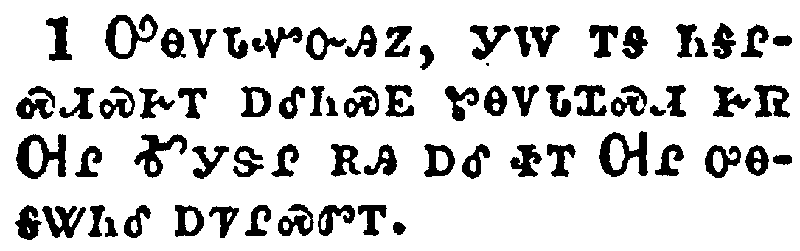</a></td>
</tr>
<tr class="even">
<td>In the end of the sabbath, as it began to dawn toward the first day of the week, came Mary Magdalene and the other Mary to see the sepulchre.</td>
</tr>
<tr class="odd">
<td>ᎤᎾᏙᏓᏉᏅᎯᏃ, ᎩᎳ ᎢᎦ ᏂᎦᎵᏍᏗᏍᎨᎢ ᎠᎴᏂᏍᎬ ᏑᎾᏙᏓᏆᏍᏗ ᎨᏒ ᎺᎵ ᎹᎩᏕᎵ ᎡᎯ ᎠᎴ ᏐᎢ ᎺᎵ ᎤᎾᎦᏔᏂᎴ ᎠᏤᎵᏍᏛᎢ.</td>
</tr>
<tr class="even">
<td>U-na-do-da-quo-nv-hi-no, gi-la i-ga ni-ga-li-s-di-s-ge-i a-le-ni-s-gv su-na-do-da-qua-s-di ge-sv Me-li Ma-gi-de-li e-hi a-le so-i Me-li u-na-ga-ta-ni-le a-tse-li-s-dv-i.</td>
</tr>
</tbody>
</table>

<table>
<tbody>
<tr class="odd">
<td><a href="012802.png">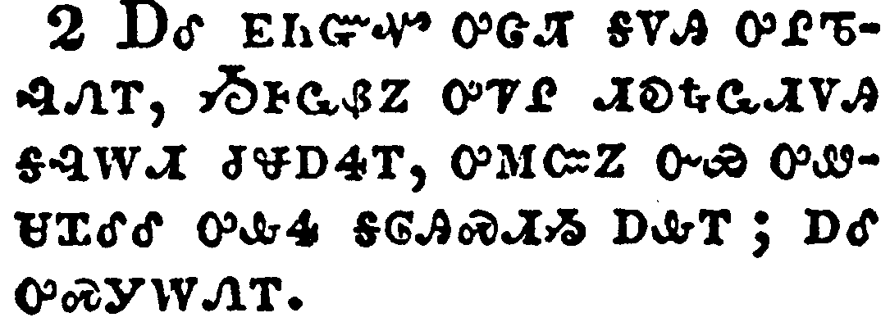</a></td>
</tr>
<tr class="even">
<td>And, behold, there was a great earthquake: for the angel of the Lord descended from heaven, and came and rolled back the stone from the door, and sat upon it.</td>
</tr>
<tr class="odd">
<td>ᎠᎴ ᎬᏂᏳᏉ ᎤᏣᏘ ᎦᏙᎯ ᎤᎵᏖᎸᏁᎢ, ᏱᎰᏩᏰᏃ ᎤᏤᎵ ᏗᎧᎿᎭᏩᏗᏙᎯ ᎦᎸᎳᏗ ᏧᏠᎠᏎᎢ, ᎤᎷᏨᏃ ᏅᏯ ᎤᏪᏌᏆᎴᎴ ᎤᎲᏎ ᎦᎶᎯᏍᏗᏱ ᎠᎲᎢ; ᎠᎴ ᎤᏍᎩᎳᏁᎢ.</td>
</tr>
<tr class="even">
<td>A-le gv-ni-yu-quo u-tsa-ti ga-do-hi u-li-te-lv-ne-i, Yi-ho-wa-ye-no u-tse-li di-ka-hna-wa-di-do-hi ga-lv-la-di tsu-tlo-a-se-i, u-lu-tsv-no nv-ya u-we-sa-qua-le-le u-hv-se ga-lo-hi-s-di-yi a-hv-i; a-le u-s-gi-la-ne-i.</td>
</tr>
</tbody>
</table>

<table>
<tbody>
<tr class="odd">
<td><a href="012803.png">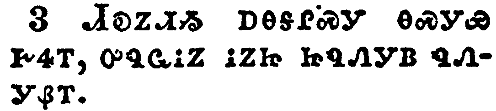</a></td>
</tr>
<tr class="even">
<td>His countenance was like lightning, and his raiment white as snow:</td>
</tr>
<tr class="odd">
<td>ᏗᎧᏃᏗᏱ ᎠᎾᎦᎵᏍᎩ ᎾᏍᎩᏯ ᎨᏎᎢ, ᎤᏄᏩᎥᏃ ᎥᏃᏥ ᏥᏄᏁᎩᏴ ᏄᏁᎩᏰᎢ.</td>
</tr>
<tr class="even">
<td>Di-ka-no-di-yi a-na-ga-li-s-gi na-s-gi-ya ge-se-i, u-nu-wa-v-no v-no-tsi tsi-nu-ne-gi-yv nu-ne-gi-ye-i.</td>
</tr>
</tbody>
</table>

<table>
<tbody>
<tr class="odd">
<td><a href="012804.png">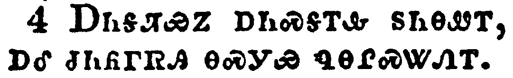</a></td>
</tr>
<tr class="even">
<td>And for fear of him the keepers did shake, and became as dead men.</td>
</tr>
<tr class="odd">
<td>ᎠᏂᎦᏘᏯᏃ ᎠᏂᏍᎦᎢᎲ ᏚᏂᎾᏪᎢ, ᎠᎴ ᏧᏂᏲᎱᏒᎯ ᎾᏍᎩᏯ ᏄᎾᎵᏍᏔᏁᎢ.</td>
</tr>
<tr class="even">
<td>A-ni-ga-ti-ya-no a-ni-s-ga-i-hv du-ni-na-we-i, a-le tsu-ni-yo-hu-sv-hi na-s-gi-ya nu-na-li-s-ta-ne-i.</td>
</tr>
</tbody>
</table>

<table>
<tbody>
<tr class="odd">
<td></td>
</tr>
<tr class="even">
<td>And the angel answered and said unto the women, Fear not ye: for I know that ye seek Jesus, which was crucified.</td>
</tr>
<tr class="odd">
<td>ᏗᎧᎿᎭᏩᏗᏙᎯᏃ ᎤᏁᏨ ᎯᎠ ᏂᏚᏪᏎᎴ ᎠᏂᎨᏴ; ᏞᏍᏗ ᏂᎯ ᏱᏍᏗᏍᎦᎢᎮᏍᏗ, ᏥᎦᏔᎭᏰᏃ ᏥᏌ ᎠᎦᏛᏅᎯ ᎡᏍᏗᏲᎲᎢ.</td>
</tr>
<tr class="even">
<td>Di-ka-hna-wa-di-do-hi-no u-ne-tsv hi-a ni-du-we-se-le a-ni-ge-yv; Tle-s-di ni-hi yi-s-di-s-ga-i-he-s-di, tsi-ga-ta-ha-ye-no Tsi-sa a-ga-dv-nv-hi e-s-di-yo-hv-i.</td>
</tr>
</tbody>
</table>

<table>
<tbody>
<tr class="odd">
<td></td>
</tr>
<tr class="even">
<td>He is not here: for he is risen, as he said. Come, see the place where the Lord lay.</td>
</tr>
<tr class="odd">
<td>ᎥᏝ ᎠᏂ ᏘᎦᎾ, ᏚᎴᏅᏰᏃ ᎾᏍᎩᏯ ᏄᏪᏒᎢ; ᎡᏍᏕᎾ ᎡᏍᏓᎦᏔ ᎤᎬᏫᏳᎯ ᎠᏥᏅᏅᎢ.</td>
</tr>
<tr class="even">
<td>V-tla a-ni ti-ga-na, du-le-nv-ye-no na-s-gi-ya nu-we-sv-i; E-s-de-na e-s-da-ga-ta U-gv-wi-yu-hi a-tsi-nv-nv-i.</td>
</tr>
</tbody>
</table>

<table>
<tbody>
<tr class="odd">
<td><a href="012807.png">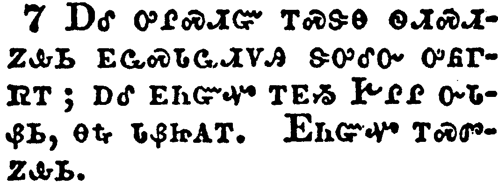</a></td>
</tr>
<tr class="even">
<td>And go quickly, and tell his disciples that he is risen from the dead; and, behold, he goeth before you into Galilee; there shall ye see him: lo, I have told you.</td>
</tr>
<tr class="odd">
<td>ᎠᎴ ᎤᎵᏍᏗᏳ ᎢᏍᏕᎾ ᏫᏗᏍᏗᏃᎲᏏ ᎬᏩᏍᏓᏩᏗᏙᎯ ᏕᎤᎴᏅ ᎤᏲᎱᏒᎢ; ᎠᎴ ᎬᏂᏳᏉ ᎢᎬᏱ ᎨᎵᎵ ᏅᏓᏰᏏ, ᎾᎿᎭᏓᏰᏥᎪᎢ. ᎬᏂᏳᏉ ᎢᏍᏛᏃᎲᏏ.</td>
</tr>
<tr class="even">
<td>A-le u-li-s-di-yu i-s-de-na wi-di-s-di-no-hv-si gv-wa-s-da-wa-di-do-hi de-u-le-nv u-yo-hu-sv-i; a-le gv-ni-yu-quo i-gv-yi Ge-li-li nv-da-ye-si, na-hna da-ye-tsi-go-i. Gv-ni-yu-quo i-s-dv-no-hv-si.</td>
</tr>
</tbody>
</table>

<table>
<tbody>
<tr class="odd">
<td><a href="012808.png">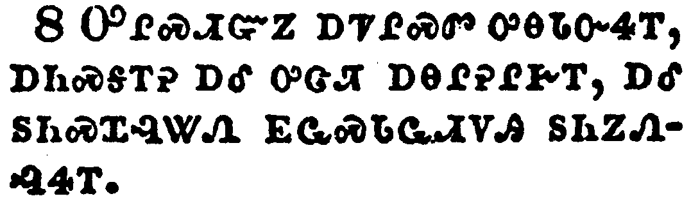</a></td>
</tr>
<tr class="even">
<td>And they departed quickly from the sepulchre with fear and great joy; and did run to bring his disciples word.</td>
</tr>
<tr class="odd">
<td>ᎤᎵᏍᏗᏳᏃ ᎠᏤᎵᏍᏛ ᎤᎾᏓᏅᏎᎢ, ᎠᏂᏍᎦᎢᎮ ᎠᎴ ᎤᏣᏘ ᎠᎾᎵᎮᎵᎨᎢ, ᎠᎴ ᏚᏂᏍᏆᎸᏔᏁ ᎬᏩᏍᏓᏩᏗᏙᎯ ᏚᏂᏃᏁᎸᏎᎢ.</td>
</tr>
<tr class="even">
<td>U-li-s-di-yu-no a-tse-li-s-dv u-na-da-nv-se-i, a-ni-s-ga-i-he a-le u-tsa-ti a-na-li-he-li-ge-i, a-le du-ni-s-qua-lv-ta-ne gv-wa-s-da-wa-di-do-hi du-ni-no-ne-lv-se-i.</td>
</tr>
</tbody>
</table>

<table>
<tbody>
<tr class="odd">
<td><a href="012809.png">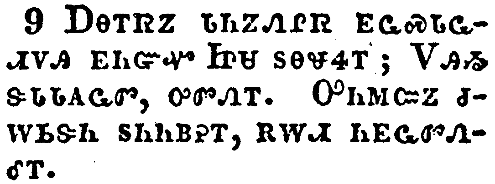</a></td>
</tr>
<tr class="even">
<td>And as they went to tell his disciples, behold, Jesus met them, saying, All hail. And they came and held him by the feet, and worshipped him.</td>
</tr>
<tr class="odd">
<td>ᎠᎾᎢᏒᏃ ᏓᏂᏃᏁᎵᏒ ᎬᏩᏍᏓᏩᏗᏙᎯ ᎬᏂᏳᏉ ᏥᏌ ᏚᎾᏠᏎᎢ; ᏙᎯᏱ ᏕᏓᏓᎪᏩᏛ, ᎤᏛᏁᎢ. ᎤᏂᎷᏨᏃ ᏧᎳᏏᏕᏂ ᏚᏂᏂᏴᎮᎢ, ᎡᎳᏗ ᏂᎬᏩᏛᏁᎴᎢ.</td>
</tr>
<tr class="even">
<td>A-na-i-sv-no da-ni-no-ne-li-sv gv-wa-s-da-wa-di-do-hi gv-ni-yu-quo Tsi-sa du-na-tlo-se-i; Do-hi-yi de-da-da-go-wa-dv, u-dv-ne-i. U-ni-lu-tsv-no tsu-la-si-de-ni du-ni-ni-yv-he-i, e-la-di ni-gv-wa-dv-ne-le-i.</td>
</tr>
</tbody>
</table>

<table>
<tbody>
<tr class="odd">
<td><a href="012810.png">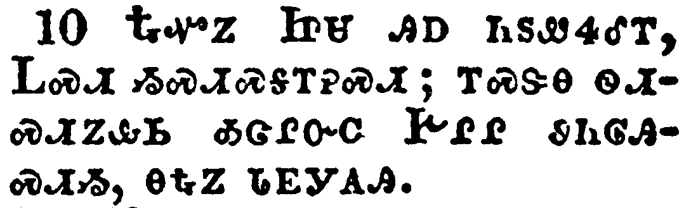</a></td>
</tr>
<tr class="even">
<td>Then said Jesus unto them, Be not afraid: go tell my brethren that they go into Galilee, and there shall they see me.</td>
</tr>
<tr class="odd">
<td>ᎿᎭᏉᏃ ᏥᏌ ᎯᎠ ᏂᏚᏪᏎᎴᎢ, ᏞᏍᏗ ᏱᏍᏗᏍᎦᎢᎮᏍᏗ; ᎢᏍᏕᎾ ᏫᏗᏍᏗᏃᎲᏏ ᎣᏣᎵᏅᏟ ᎨᎵᎵ ᏭᏂᎶᎯᏍᏗᏱ, ᎾᎿᎭᏃ ᏓᎬᎩᎪᎯ.</td>
</tr>
<tr class="even">
<td>Hna-quo-no Tsi-sa hi-a ni-du-we-se-le-i, Tle-s-di yi-s-di-s-ga-i-he-s-di; i-s-de-na wi-di-s-di-no-hv-si o-tsa-li-nv-tli Ge-li-li wu-ni-lo-hi-s-di-yi, na-hna-no da-gv-gi-go-hi.</td>
</tr>
</tbody>
</table>

<table>
<tbody>
<tr class="odd">
<td></td>
</tr>
<tr class="even">
<td>Now when they were going, behold, some of the watch came into the city, and shewed unto the chief priests all the things that were done.</td>
</tr>
<tr class="odd">
<td>ᎠᎾᎢᏒᏃ ᎬᏂᏳᏉ ᎢᎦᏛ ᎤᏂᏯᏫᏒᎯ ᎤᏂᎷᏤ ᎦᏚᎲᎢ, ᎠᎴ ᏄᏂᎬᏫᏳᏒ ᎠᏥᎸ-ᎠᏁᎶᎯ ᏚᏂᏃᏁᎴ ᏂᎦᏛ ᏄᎵᏍᏔᏂᏙᎸᎢ.</td>
</tr>
<tr class="even">
<td>A-na-i-sv-no gv-ni-yu-quo i-ga-dv u-ni-ya-wi-sv-hi u-ni-lu-tse ga-du-hv-i, a-le nu-ni-gv-wi-yu-sv a-tsi-lv--a-ne-lo-hi du-ni-no-ne-le ni-ga-dv nu-li-s-ta-ni-do-lv-i.</td>
</tr>
</tbody>
</table>

<table>
<tbody>
<tr class="odd">
<td></td>
</tr>
<tr class="even">
<td>And when they were assembled with the elders, and had taken counsel, they gave large money unto the soldiers,</td>
</tr>
<tr class="odd">
<td>ᎾᏍᎩᏃ ᎠᎴ ᏗᏂᎳᏫᎩ ᏚᏂᎳᏫᏨ ᎠᎴ ᎤᏂᏃᎮᎸ, ᎤᏣᏘ ᎠᏕᎸ ᏚᏂᏁᎴ ᎠᏂᏯᏫᏍᎩ,</td>
</tr>
<tr class="even">
<td>Na-s-gi-no a-le di-ni-la-wi-gi du-ni-la-wi-tsv a-le u-ni-no-he-lv, u-tsa-ti a-de-lv du-ni-ne-le a-ni-ya-wi-s-gi,</td>
</tr>
</tbody>
</table>

<table>
<tbody>
<tr class="odd">
<td><a href="012813.png">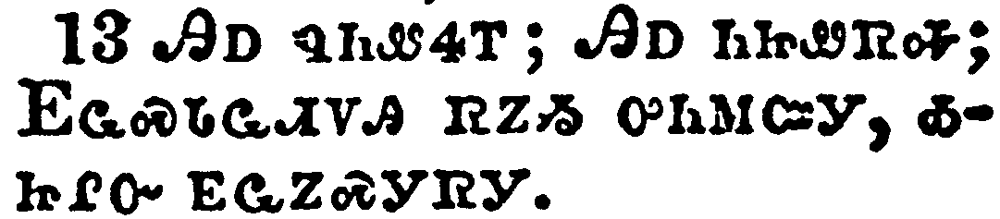</a></td>
</tr>
<tr class="even">
<td>Saying, Say ye, His disciples came by night, and stole him away while we slept.</td>
</tr>
<tr class="odd">
<td>ᎯᎠ ᏄᏂᏪᏎᎢ; ᎯᎠ ᏂᏥᏪᏒᎭ; ᎬᏩᏍᏓᏩᏗᏙᎯ ᏒᏃᏱ ᎤᏂᎷᏨᎩ, ᎣᏥᎵᏅ ᎬᏩᏃᏍᎩᏒᎩ.</td>
</tr>
<tr class="even">
<td>Hi-a nu-ni-we-se-i; Hi-a ni-tsi-we-sv-ha; Gv-wa-s-da-wa-di-do-hi sv-no-yi u-ni-lu-tsv-gi, o-tsi-li-nv gv-wa-no-s-gi-sv-gi.</td>
</tr>
</tbody>
</table>

<table>
<tbody>
<tr class="odd">
<td><a href="012814.png">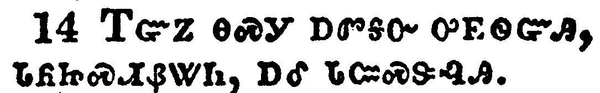</a></td>
</tr>
<tr class="even">
<td>And if this come to the governor's ears, we will persuade him, and secure you.</td>
</tr>
<tr class="odd">
<td>ᎢᏳᏃ ᎾᏍᎩ ᎠᏛᎦᏅ ᎤᎬᏫᏳᎯ, ᏓᏲᏥᏍᏗᏰᏔᏂ, ᎠᎴ ᏓᏨᏍᏕᎸᎯ.</td>
</tr>
<tr class="even">
<td>I-yu-no na-s-gi a-dv-ga-nv u-gv-wi-yu-hi, da-yo-tsi-s-di-ye-ta-ni, a-le da-tsv-s-de-lv-hi.</td>
</tr>
</tbody>
</table>

<table>
<tbody>
<tr class="odd">
<td></td>
</tr>
<tr class="even">
<td>So they took the money, and did as they were taught: and this saying is commonly reported among the Jews until this day.</td>
</tr>
<tr class="odd">
<td>ᏚᏂᎩᏒᏃ ᎠᏕᎸ, ᏂᎨᏥᏪᏎᎸ ᏄᎾᏛᏁᎴᎢ. ᎾᏍᎩᏃ ᎯᎠ ᎧᏃᎮᏛ ᎠᏏ ᎠᏂᏃᎮᎵᏙᎭ ᎠᏂᏧᏏ.</td>
</tr>
<tr class="even">
<td>Du-ni-gi-sv-no a-de-lv, ni-ge-tsi-we-se-lv nu-na-dv-ne-le-i. Na-s-gi-no hi-a ka-no-he-dv a-si a-ni-no-he-li-do-ha A-ni-tsu-si.</td>
</tr>
</tbody>
</table>

<table>
<tbody>
<tr class="odd">
<td></td>
</tr>
<tr class="even">
<td>Then the eleven disciples went away into Galilee, into a mountain where Jesus had appointed them.</td>
</tr>
<tr class="odd">
<td>ᎿᎭᏉᏃ ᏌᏚ ᎢᏯᏂᏛ ᎬᏩᏍᏓᏩᏗᏙᎯ ᎨᎵᎵ ᎤᏁᏅᏒᎩ ᏦᏓᎸ ᏥᏌ ᎤᎾᏎᎮᎸᎢ.</td>
</tr>
<tr class="even">
<td>Hna-quo-no sa-du i-ya-ni-dv gv-wa-s-da-wa-di-do-hi Ge-li-li u-ne-nv-sv-gi tso-da-lv Tsi-sa u-na-se-he-lv-i.</td>
</tr>
</tbody>
</table>

<table>
<tbody>
<tr class="odd">
<td></td>
</tr>
<tr class="even">
<td>And when they saw him, they worshipped him: but some doubted.</td>
</tr>
<tr class="odd">
<td>ᎬᏩᎪᎲᏃ ᎡᎳᏗ ᏂᎬᏩᏛᏁᎸᎩ. ᎠᏎᏃ ᎢᎦᏛ ᎤᎾᏜᏓᏏᏛᎡᎸᏉ.</td>
</tr>
<tr class="even">
<td>Gv-wa-go-hv-no e-la-di ni-gv-wa-dv-ne-lv-gi. A-se-no i-ga-dv u-na-dla-si-dv-e-lv-quo.</td>
</tr>
</tbody>
</table>

<table>
<tbody>
<tr class="odd">
<td><a href="012818.png">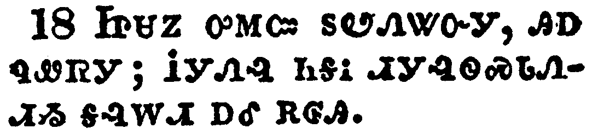</a></td>
</tr>
<tr class="even">
<td>And Jesus came and spake unto them, saying, All power is given unto me in heaven and in earth.</td>
</tr>
<tr class="odd">
<td>ᏥᏌᏃ ᎤᎷᏨ ᏚᏬᏁᏔᏅᎩ, ᎯᎠ ᏄᏪᏒᎩ; ᎥᎩᏁᎸ ᏂᎦᎥ ᏗᎩᎸᏫᏍᏓᏁᏗᏱ ᎦᎸᎳᏗ ᎠᎴ ᎡᎶᎯ.</td>
</tr>
<tr class="even">
<td>Tsi-sa-no u-lu-tsv du-wo-ne-ta-nv-gi, hi-a nu-we-sv-gi; V-gi-ne-lv ni-ga-v di-gi-lv-wi-s-da-ne-di-yi ga-lv-la-di a-le e-lo-hi.</td>
</tr>
</tbody>
</table>

<table>
<tbody>
<tr class="odd">
<td></td>
</tr>
<tr class="even">
<td>Go ye therefore, and teach all nations, baptizing them in the name of the Father, and of the Son, and of the Holy Ghost:</td>
</tr>
<tr class="odd">
<td>ᎾᏍᎩ ᎢᏳᏍᏗ ᎢᏤᎾ ᏫᏗᏤᏲᎲᎦ ᎾᎦᏛ ᏄᎾᏓᎴᏒ ᏴᏫ, ᏕᏣᏬᏍᎨᏍᏗ ᎢᏨᏗᏍᎨᏍᏗ ᏚᏙᎥ ᎠᎦᏴᎵᎨᎢ ᎠᎴ ᎤᏪᏥ ᎠᎴ ᎦᎸᏉᏗᏳ ᎠᏓᏅᏙ,</td>
</tr>
<tr class="even">
<td>Na-s-gi i-yu-s-di i-tse-na wi-di-tse-yo-hv-ga na-ga-dv nu-na-da-le-sv yv-wi, de-tsa-wo-s-ge-s-di i-tsv-di-s-ge-s-di du-do-v A-ga-yv-li-ge-i a-le U-we-tsi a-le Ga-lv-quo-di-yu A-da-nv-do,</td>
</tr>
</tbody>
</table>

<table>
<tbody>
<tr class="odd">
<td></td>
</tr>
<tr class="even">
<td>Teaching them to observe all things whatsoever I have commanded you: and, lo, I am with you always, even unto the end of the world. Amen.</td>
</tr>
<tr class="odd">
<td>ᏕᏤᏲᎲᏍᎨᏍᏗ ᏧᏂᎧᎿᎭᏩᏛᏍᏗᏱ ᏂᎦᎥ ᎢᏨᏁᏤᎸᎢ; ᎬᏂᏳᏉᏃ ᏂᎪᎯᎸ ᎢᏨᏰᎳᏗᏙᎭ ᏫᎬᎵᏍᏆᏗᏍᎩ ᎡᎶᎯ. ᎡᎺᏅ.</td>
</tr>
<tr class="even">
<td>De-tse-yo-hv-s-ge-s-di tsu-ni-ka-hna-wa-dv-s-di-yi ni-ga-v i-tsv-ne-tse-lv-i; gv-ni-yu-quo-no ni-go-hi-lv i-tsv-ye-la-di-do-ha wi-gv-li-s-qua-di-s-gi e-lo-hi. E-me-nv.</td>
</tr>
</tbody>
</table>

