+++
draft=false
date = 2014-12-18T21:11:07Z
title = "Philippians - Chapter 2 - Cherokee New Testament"
weight = 1418955067

[taxonomies]

authors = ["Timothy Legg"]
categories = []
tags = []

[extra]
+++
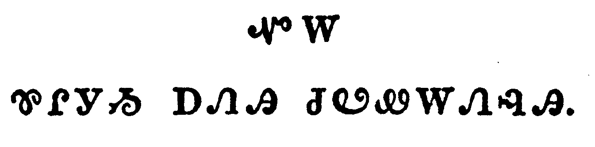

<table>
<tbody>
<tr class="odd">
<td><a href="110201.png">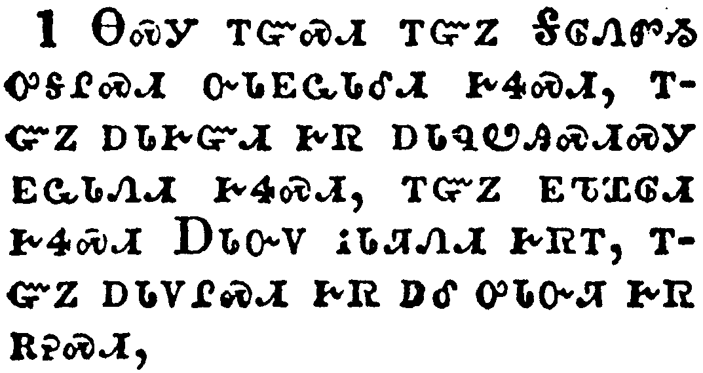</a></td>
</tr>
<tr class="even">
<td>If there be therefore any consolation in Christ, if any comfort of love, if any fellowship of the Spirit, if any bowels and mercies,</td>
</tr>
<tr class="odd">
<td>ᎾᏍᎩ ᎢᏳᏍᏗ ᎢᏳᏃ ᎦᎶᏁᏛᏱ ᎤᎦᎵᏍᏗ ᏅᏓᎬᏩᏓᎴᏗ ᎨᏎᏍᏗ, ᎢᏳᏃ ᎠᏓᎨᏳᏗ ᎨᏒ ᎠᏓᏄᏬᎯᏍᏗᏍᎩ ᎬᏩᏓᏁᏗ ᎨᏎᏍᏗ, ᎢᏳᏃ ᎬᏖᏆᎶᏗ ᎨᏎᏍᏗ ᎠᏓᏅᏙ ᎥᏓᏘᏁᏗ ᎨᏒᎢ, ᎢᏳᏃ ᎠᏓᏙᎵᏍᏗ ᎨᏒ ᎠᎴ ᎤᏓᏅᏘ ᎨᏒ ᎡᎮᏍᏗ,</td>
</tr>
<tr class="even">
<td>Na-s-gi i-yu-s-di i-yu-no Ga-lo-ne-dv-yi u-ga-li-s-di nv-da-gv-wa-da-le-di ge-se-s-di, i-yu-no a-da-ge-yu-di ge-sv a-da-nu-wo-hi-s-di-s-gi gv-wa-da-ne-di ge-se-s-di, i-yu-no gv-te-qua-lo-di ge-se-s-di A-da-nv-do v-da-ti-ne-di ge-sv-i, i-yu-no a-da-do-li-s-di ge-sv a-le u-da-nv-ti ge-sv e-he-s-di,</td>
</tr>
</tbody>
</table>

<table>
<tbody>
<tr class="odd">
<td><a href="110202.png">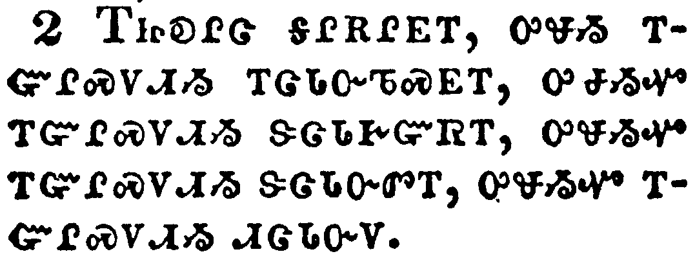</a></td>
</tr>
<tr class="even">
<td>Fulfill ye my joy, that ye be likeminded, having the same love, being of one accord, of one mind.</td>
</tr>
<tr class="odd">
<td>ᎢᏥᎧᎵᏣ ᎦᎵᎡᎵᎬᎢ, ᎤᏠᏱ ᎢᏳᎵᏍᏙᏗᏱ ᎢᏣᏓᏅᏖᏍᎬᎢ, ᎤᏠᏱᏉ ᎢᏳᎵᏍᏙᏗᏱ ᏕᏣᏓᎨᏳᏒᎢ, ᎤᏠᏱᏉ ᎢᏳᎵᏍᏙᏗᏱ ᏕᏣᏓᏅᏛᎢ, ᎤᏠᏱᏉ ᎢᏳᎵᏍᏙᏗᏱ ᏗᏣᏓᏅᏙ.</td>
</tr>
<tr class="even">
<td>I-tsi-ka-li-tsa ga-li-e-li-gv-i, u-tlo-yi i-yu-li-s-do-di-yi i-tsa-da-nv-te-s-gv-i, u-tlo-yi-quo i-yu-li-s-do-di-yi de-tsa-da-ge-yu-sv-i, u-tlo-yi-quo i-yu-li-s-do-di-yi de-tsa-da-nv-dv-i, u-tlo-yi-quo i-yu-li-s-do-di-yi di-tsa-da-nv-do.</td>
</tr>
</tbody>
</table>

<table>
<tbody>
<tr class="odd">
<td><a href="110203.png">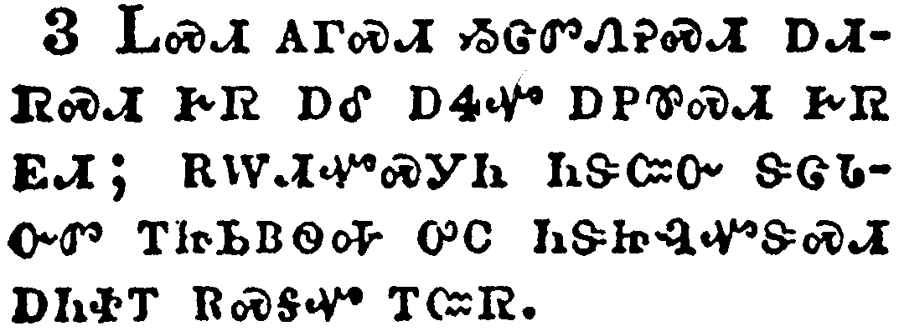</a></td>
</tr>
<tr class="even">
<td>Let nothing be done through strife or vainglory; but in lowliness of mind let each esteem other better than themselves.</td>
</tr>
<tr class="odd">
<td>ᏞᏍᏗ ᎪᎱᏍᏗ ᏱᏣᏛᏁᎮᏍᏗ ᎠᏗᏒᏍᏗ ᎨᏒ ᎠᎴ ᎠᏎᏉ ᎠᏢᏈᏍᏗ ᎨᏒ ᎬᏗ; ᎡᎳᏗᏉᏍᎩᏂ ᏂᏕᏨᏅ ᏕᏣᏓᏅᏛ ᎢᏥᏏᏴᏫᎭ ᎤᏟ ᏂᏕᏥᎸᏉᏕᏍᏗ ᎠᏂᏐᎢ ᎡᏍᎦᏉ ᎢᏨᏒ.</td>
</tr>
<tr class="even">
<td>Tle-s-di go-hu-s-di yi-tsa-dv-ne-he-s-di a-di-sv-s-di ge-sv a-le a-se-quo a-tlv-qui-s-di ge-sv gv-di; e-la-di-quo-s-gi-ni ni-de-tsv-nv de-tsa-da-nv-dv i-tsi-si-yv-wi-ha u-tli ni-de-tsi-lv-quo-de-s-di a-ni-so-i e-s-ga-quo i-tsv-sv.</td>
</tr>
</tbody>
</table>

<table>
<tbody>
<tr class="odd">
<td></td>
</tr>
<tr class="even">
<td>Look not every man on his own things, but every man also on the things of others.</td>
</tr>
<tr class="odd">
<td>ᏞᏍᏗ ᎩᎶ ᎤᏩᏒᏉ ᎤᏤᎵ ᏳᎦᏌᏯᏍᏕᏍᏗ, ᎾᏂᎥᏍᎩᏂ ᎠᏂᏐᎢ ᎾᏍᏉ ᎤᎾᏤᎵᎦ.</td>
</tr>
<tr class="even">
<td>Tle-s-di gi-lo u-wa-sv-quo u-tse-li yu-ga-sa-ya-s-de-s-di, na-ni-v-s-gi-ni a-ni-so-i na-s-quo u-na-tse-li-ga.</td>
</tr>
</tbody>
</table>

<table>
<tbody>
<tr class="odd">
<td><a href="110205.png">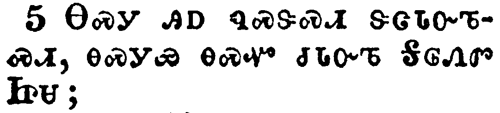</a></td>
</tr>
<tr class="even">
<td>Let this mind be in you, which was also in Christ Jesus:</td>
</tr>
<tr class="odd">
<td>ᎾᏍᎩ ᎯᎠ ᏄᏍᏕᏍᏗ ᏕᏣᏓᏅᏖᏍᏗ, ᎾᏍᎩᏯ ᎾᏍᏉ ᏧᏓᏅᏖ ᎦᎶᏁᏛ ᏥᏌ;</td>
</tr>
<tr class="even">
<td>Na-s-gi hi-a nu-s-de-s-di de-tsa-da-nv-te-s-di, na-s-gi-ya na-s-quo tsu-da-nv-te Ga-lo-ne-dv Tsi-sa;</td>
</tr>
</tbody>
</table>

<table>
<tbody>
<tr class="odd">
<td><a href="110206.png">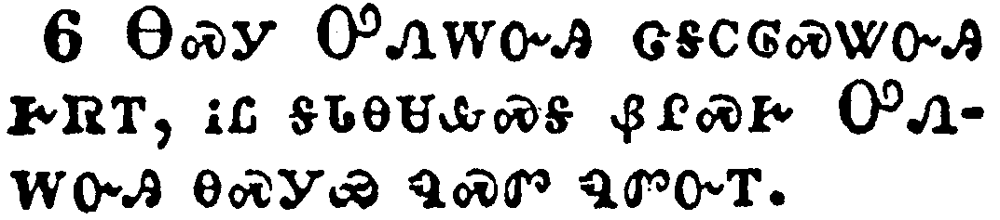</a></td>
</tr>
<tr class="even">
<td>Who, being in the form of God, thought it not robbery to be equal with God:</td>
</tr>
<tr class="odd">
<td>ᎾᏍᎩ ᎤᏁᎳᏅᎯ ᏣᎦᏟᎶᏍᏔᏅᎯ ᎨᏒᎢ, ᎥᏝ ᎦᏓᎾᏌᎲᏍᎦ ᏰᎵᏍᎨ ᎤᏁᎳᏅᎯ ᎾᏍᎩᏯ ᏄᏍᏛ ᏄᏛᏅᎢ.</td>
</tr>
<tr class="even">
<td>Na-s-gi U-ne-la-nv-hi tsa-ga-tli-lo-s-ta-nv-hi ge-sv-i, v-tla ga-da-na-sa-hv-s-ga ye-li-s-ge U-ne-la-nv-hi na-s-gi-ya nu-s-dv nu-dv-nv-i.</td>
</tr>
</tbody>
</table>

<table>
<tbody>
<tr class="odd">
<td><a href="110207.png">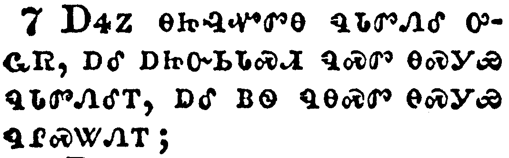</a></td>
</tr>
<tr class="even">
<td>But made himself of no reputation, and took upon him the form of a servant, and was made in the likeness of men:</td>
</tr>
<tr class="odd">
<td>ᎠᏎᏃ ᎾᏥᎸᏉᏛᎾ ᏄᏓᏛᏁᎴ ᎤᏩᏒ, ᎠᎴ ᎠᏥᏅᏏᏓᏍᏗ ᏄᏍᏛ ᎾᏍᎩᏯ ᏄᏓᏛᏁᎴᎢ, ᎠᎴ ᏴᏫ ᏄᎾᏍᏛ ᎾᏍᎩᏯ ᏄᎵᏍᏔᏁᎢ;</td>
</tr>
<tr class="even">
<td>A-se-no na-tsi-lv-quo-dv-na nu-da-dv-ne-le u-wa-sv, a-le a-tsi-nv-si-da-s-di nu-s-dv na-s-gi-ya nu-da-dv-ne-le-i, a-le yv-wi nu-na-s-dv na-s-gi-ya nu-li-s-ta-ne-i;</td>
</tr>
</tbody>
</table>

<table>
<tbody>
<tr class="odd">
<td><a href="110208.png">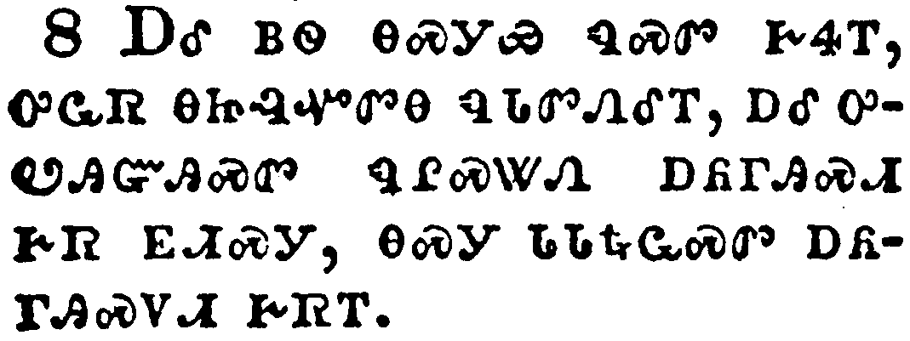</a></td>
</tr>
<tr class="even">
<td>And being found in fashion as a man, he humbled himself, and became obedient unto death, even the death of the cross.</td>
</tr>
<tr class="odd">
<td>ᎠᎴ ᏴᏫ ᎾᏍᎩᏯ ᏄᏍᏛ ᎨᏎᎢ, ᎤᏩᏒ ᎾᏥᎸᏉᏛᎾ ᏄᏓᏛᏁᎴᎢ, ᎠᎴ ᎤᏬᎯᏳᎯᏍᏛ ᏄᎵᏍᏔᏁ ᎠᏲᎱᎯᏍᏗ ᎨᏒ ᎬᏗᏍᎩ, ᎾᏍᎩ ᏓᏓᎿᎭᏩᏍᏛ ᎠᏲᎱᎯᏍᏙᏗ ᎨᏒᎢ.</td>
</tr>
<tr class="even">
<td>A-le yv-wi na-s-gi-ya nu-s-dv ge-se-i, u-wa-sv na-tsi-lv-quo-dv-na nu-da-dv-ne-le-i, a-le u-wo-hi-yu-hi-s-dv nu-li-s-ta-ne a-yo-hu-hi-s-di ge-sv gv-di-s-gi, na-s-gi da-da-hna-wa-s-dv a-yo-hu-hi-s-do-di ge-sv-i.</td>
</tr>
</tbody>
</table>

<table>
<tbody>
<tr class="odd">
<td><a href="110209.png">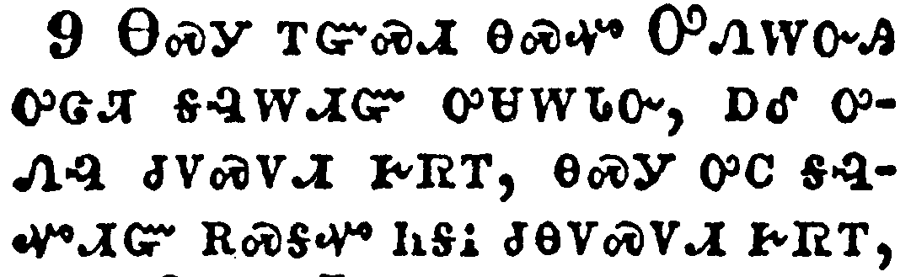</a></td>
</tr>
<tr class="even">
<td>Wherefore God also hath highly exalted him, and given him a name which is above every name:</td>
</tr>
<tr class="odd">
<td>ᎾᏍᎩ ᎢᏳᏍᏗ ᎾᏍᏉ ᎤᏁᎳᏅᎯ ᎤᏣᏘ ᎦᎸᎳᏗᏳ ᎤᏌᎳᏓᏅ, ᎠᎴ ᎤᏁᎸ ᏧᏙᏍᏙᏗ ᎨᏒᎢ, ᎾᏍᎩ ᎤᏟ ᎦᎸᏉᏗᏳ ᎡᏍᎦᏉ ᏂᎦᎥ ᏧᎾᏙᏍᏙᏗ ᎨᏒᎢ,</td>
</tr>
<tr class="even">
<td>Na-s-gi i-yu-s-di na-s-quo U-ne-la-nv-hi u-tsa-ti ga-lv-la-di-yu u-sa-la-da-nv, a-le u-ne-lv tsu-do-s-do-di ge-sv-i, na-s-gi u-tli ga-lv-quo-di-yu e-s-ga-quo ni-ga-v tsu-na-do-s-do-di ge-sv-i,</td>
</tr>
</tbody>
</table>

<table>
<tbody>
<tr class="odd">
<td><a href="110210.png">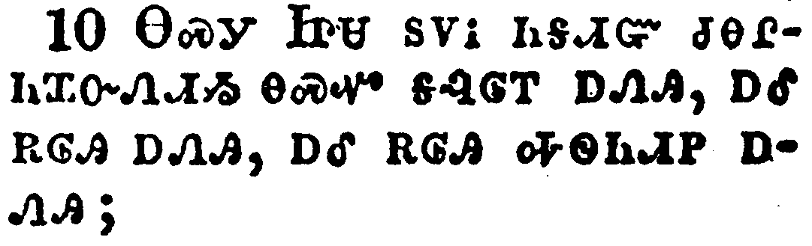</a></td>
</tr>
<tr class="even">
<td>That at the name of Jesus every knee should bow, of things in heaven, and things in earth, and things under the earth;</td>
</tr>
<tr class="odd">
<td>ᎾᏍᎩ ᏥᏌ ᏚᏙᎥ ᏂᎦᏗᏳ ᏧᎾᎵᏂᏆᏁᏗᏱ ᎾᏍᏉ ᎦᎸᎶᎢ ᎠᏁᎯ, ᎠᎴ ᎡᎶᎯ ᎠᏁᎯ, ᎠᎴ ᎡᎶᎯ ᎭᏫᏂᏗᏢ ᎠᏁᎯ;</td>
</tr>
<tr class="even">
<td>Na-s-gi Tsi-sa du-do-v ni-ga-di-yu tsu-na-li-ni-qua-ne-di-yi na-s-quo ga-lv-lo-i a-ne-hi, a-le e-lo-hi a-ne-hi, a-le e-lo-hi ha-wi-ni-di-tlv a-ne-hi;</td>
</tr>
</tbody>
</table>

<table>
<tbody>
<tr class="odd">
<td><a href="110211.png">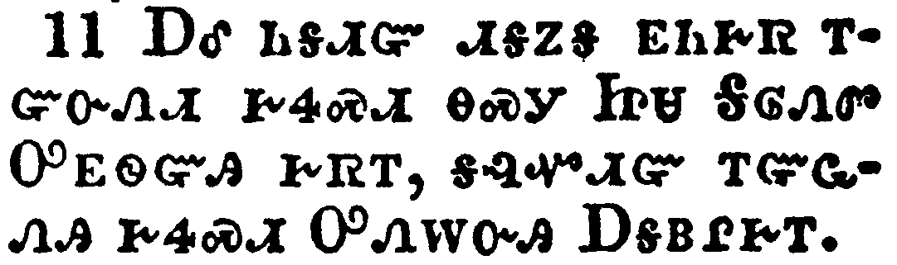</a></td>
</tr>
<tr class="even">
<td>And that every tongue should confess that Jesus Christ is Lord, to the glory of God the Father.</td>
</tr>
<tr class="odd">
<td>ᎠᎴ ᏂᎦᏗᏳ ᏗᎦᏃᎦ ᎬᏂᎨᏒ ᎢᏳᏅᏁᏗ ᎨᏎᏍᏗ ᎾᏍᎩ ᏥᏌ ᎦᎶᏁᏛ ᎤᎬᏫᏳᎯ ᎨᏒᎢ, ᎦᎸᏉᏗᏳ ᎢᏳᏩᏁᎯ ᎨᏎᏍᏗ ᎤᏁᎳᏅᎯ ᎠᎦᏴᎵᎨᎢ.</td>
</tr>
<tr class="even">
<td>A-le ni-ga-di-yu di-ga-no-ga gv-ni-ge-sv i-yu-nv-ne-di ge-se-s-di na-s-gi Tsi-sa Ga-lo-ne-dv U-gv-wi-yu-hi ge-sv-i, ga-lv-quo-di-yu i-yu-wa-ne-hi ge-se-s-di U-ne-la-nv-hi A-ga-yv-li-ge-i.</td>
</tr>
</tbody>
</table>

<table>
<tbody>
<tr class="odd">
<td><a href="110212.png">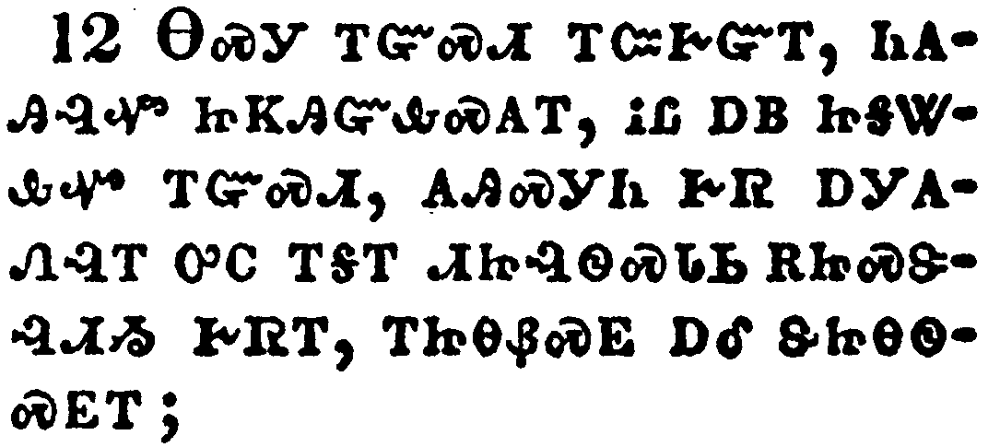</a></td>
</tr>
<tr class="even">
<td>Wherefore, my beloved, as ye have always obeyed, not as in my presence only, but now much more in my absence, work out your own salvation with fear and trembling.</td>
</tr>
<tr class="odd">
<td>ᎾᏍᎩ ᎢᏳᏍᏗ ᎢᏨᎨᏳᎢ, ᏂᎪᎯᎸᏉ ᏥᏦᎯᏳᎲᏍᎪᎢ, ᎥᏝ ᎠᏴ ᏥᎦᏔᎲᏉ ᎢᏳᏍᏗ, ᎪᎯᏍᎩᏂ ᎨᏒ ᎠᎩᎪᏁᎸᎢ ᎤᏟ ᎢᎦᎢ ᏗᏥᎸᏫᏍᏓᏏ ᎡᏥᏍᏕᎸᏗᏱ ᎨᏒᎢ, ᎢᏥᎾᏰᏍᎬ ᎠᎴ ᏕᏥᎾᏫᏍᎬᎢ;</td>
</tr>
<tr class="even">
<td>Na-s-gi i-yu-s-di i-tsv-ge-yu-i, ni-go-hi-lv-quo tsi-tso-hi-yu-hv-s-go-i, v-tla a-yv tsi-ga-ta-hv-quo i-yu-s-di, go-hi-s-gi-ni ge-sv a-gi-go-ne-lv-i u-tli i-ga-i di-tsi-lv-wi-s-da-si e-tsi-s-de-lv-di-yi ge-sv-i, i-tsi-na-ye-s-gv a-le de-tsi-na-wi-s-gv-i;</td>
</tr>
</tbody>
</table>

<table>
<tbody>
<tr class="odd">
<td><a href="110213.png">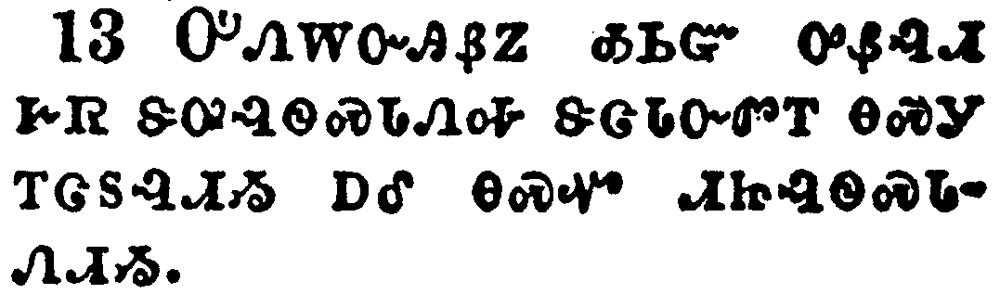</a></td>
</tr>
<tr class="even">
<td>For it is God which worketh in you both to will and to do of his good pleasure.</td>
</tr>
<tr class="odd">
<td>ᎤᏁᎳᏅᎯᏰᏃ ᎣᏏᏳ ᎤᏰᎸᏗ ᎨᏒ ᏕᎤᎸᏫᏍᏓᏁᎭ ᏕᏣᏓᏅᏛᎢ ᎾᏍᎩ ᎢᏣᏚᎸᏗᏱ ᎠᎴ ᎾᏍᏉ ᏗᏥᎸᏫᏍᏓᏁᏗᏱ.</td>
</tr>
<tr class="even">
<td>U-ne-la-nv-hi-ye-no o-si-yu u-ye-lv-di ge-sv de-u-lv-wi-s-da-ne-ha de-tsa-da-nv-dv-i na-s-gi i-tsa-du-lv-di-yi a-le na-s-quo di-tsi-lv-wi-s-da-ne-di-yi.</td>
</tr>
</tbody>
</table>

<table>
<tbody>
<tr class="odd">
<td><a href="110214.png">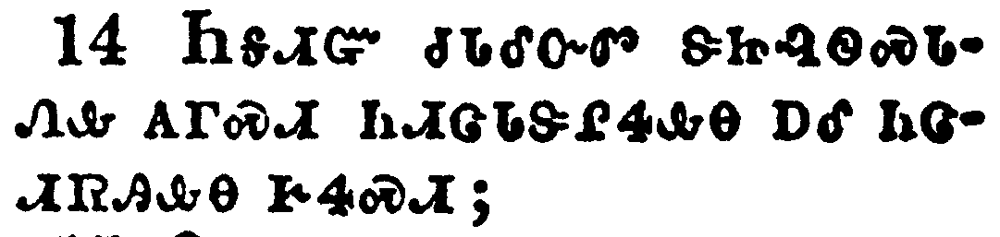</a></td>
</tr>
<tr class="even">
<td>Do all things without murmurings and disputings:</td>
</tr>
<tr class="odd">
<td>ᏂᎦᏗᏳ ᏧᏓᎴᏅᏛ ᏕᏥᎸᏫᏍᏓᏁᎲ ᎪᎱᏍᏗ ᏂᏗᏣᏓᏕᎵᏎᎲᎾ ᎠᎴ ᏥᏣᏗᏒᎯᎲᎾ ᎨᏎᏍᏗ;</td>
</tr>
<tr class="even">
<td>Ni-ga-di-yu tsu-da-le-nv-dv de-tsi-lv-wi-s-da-ne-hv go-hu-s-di ni-di-tsa-da-de-li-se-hv-na a-le tsi-tsa-di-sv-hi-hv-na ge-se-s-di;</td>
</tr>
</tbody>
</table>

<table>
<tbody>
<tr class="odd">
<td><a href="110215.png">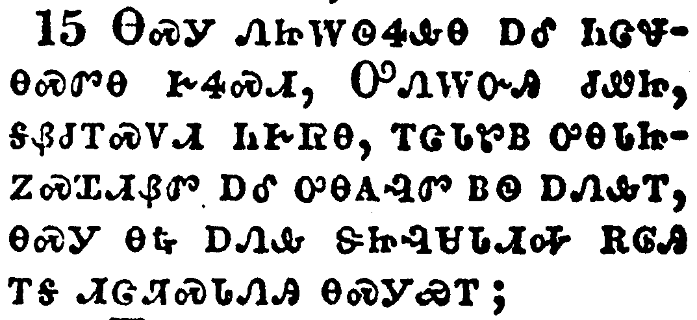</a></td>
</tr>
<tr class="even">
<td>That ye may be blameless and harmless, the sons of God, without rebuke, in the midst of a crooked and perverse nation, among whom ye shine as lights in the world;</td>
</tr>
<tr class="odd">
<td>ᎾᏍᎩ ᏁᏥᎳᏫᏎᎲᎾ ᎠᎴ ᏂᏣᏠᎾᏍᏛᎾ ᎨᏎᏍᏗ, ᎤᏁᎳᏅᎯ ᏧᏪᏥ, ᎦᏰᏧᎢᏍᏙᏗ ᏂᎨᏒᎾ, ᎢᏣᏓᏑᏴ ᎤᎾᏓᏥᏃᏍᏆᏗᏰᏛ ᎠᎴ ᎤᎾᎪᎸᏛ ᏴᏫ ᎠᏁᎲᎢ, ᎾᏍᎩ ᎾᎿᎭᎠᏁᎲ ᏕᏥᎸᏌᏓᏗᎭ ᎡᎶᎯ ᎢᎦ ᏗᏣᏘᏍᏓᏁᎯ ᎾᏍᎩᏯᎢ;</td>
</tr>
<tr class="even">
<td>Na-s-gi ne-tsi-la-wi-se-hv-na a-le ni-tsa-tlo-na-s-dv-na ge-se-s-di, U-ne-la-nv-hi tsu-we-tsi, ga-ye-tsu-i-s-do-di ni-ge-sv-na, i-tsa-da-su-yv u-na-da-tsi-no-s-qua-di-ye-dv a-le u-na-go-lv-dv yv-wi a-ne-hv-i, na-s-gi na-hna a-ne-hv de-tsi-lv-sa-da-di-ha e-lo-hi i-ga di-tsa-ti-s-da-ne-hi na-s-gi-ya-i;</td>
</tr>
</tbody>
</table>

<table>
<tbody>
<tr class="odd">
<td><a href="110216.png">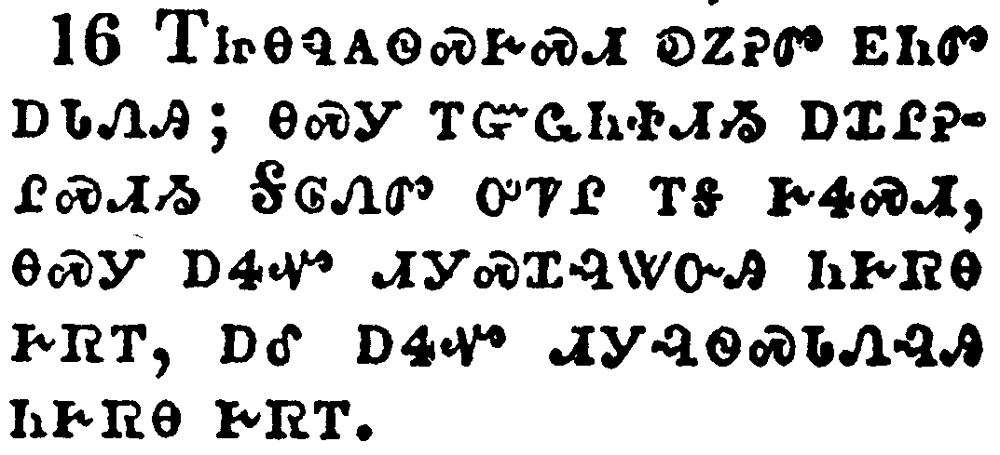</a></td>
</tr>
<tr class="even">
<td>Holding forth the word of life; that I may rejoice in the day of Christ, that I have not run in vain, neither laboured in vain.</td>
</tr>
<tr class="odd">
<td>ᎢᏥᎾᏄᎪᏫᏍᎨᏍᏗ ᎧᏃᎮᏛ ᎬᏂᏛ ᎠᏓᏁᎯ; ᎾᏍᎩ ᎢᏳᏩᏂᏐᏗᏱ ᎠᏆᎵᎮᎵᏍᏗᏱ ᎦᎶᏁᏛ ᎤᏤᎵ ᎢᎦ ᎨᏎᏍᏗ, ᎾᏍᎩ ᎠᏎᏉ ᏗᎩᏍᏆᎸᏔᏅᎯ ᏂᎨᏒᎾ ᎨᏒᎢ, ᎠᎴ ᎠᏎᏉ ᏗᎩᎸᏫᏍᏓᏁᎸᎯ ᏂᎨᏒᎾ ᎨᏒᎢ.</td>
</tr>
<tr class="even">
<td>I-tsi-na-nu-go-wi-s-ge-s-di ka-no-he-dv gv-ni-dv a-da-ne-hi; na-s-gi i-yu-wa-ni-so-di-yi a-qua-li-he-li-s-di-yi Ga-lo-ne-dv u-tse-li i-ga ge-se-s-di, na-s-gi a-se-quo di-gi-s-qua-lv-ta-nv-hi ni-ge-sv-na ge-sv-i, a-le a-se-quo di-gi-lv-wi-s-da-ne-lv-hi ni-ge-sv-na ge-sv-i.</td>
</tr>
</tbody>
</table>

<table>
<tbody>
<tr class="odd">
<td><a href="110217.png">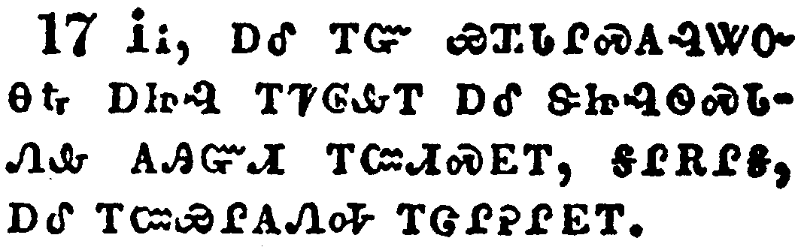</a></td>
</tr>
<tr class="even">
<td>Yea, and if I be offered upon the sacrifice and service of your faith, I joy, and rejoice with you all.</td>
</tr>
<tr class="odd">
<td>ᎥᎥ, ᎠᎴ ᎢᏳ ᏯᏆᏓᎵᏍᎪᎸᏔᏅ ᎾᎿᎭᎠᏥᎸ ᎢᏤᎶᎲᎢ ᎠᎴ ᏕᏥᎸᏫᏍᏓᏁᎲ ᎪᎯᏳᏗ ᎢᏨᏗᏍᎬᎢ, ᎦᎵᎡᎵᎦ, ᎠᎴ ᎢᏨᏯᎵᎪᏁᎭ ᎢᏣᎵᎮᎵᎬᎢ.</td>
</tr>
<tr class="even">
<td>V-v, a-le i-yu ya-qua-da-li-s-go-lv-ta-nv na-hna a-tsi-lv i-tse-lo-hv-i a-le de-tsi-lv-wi-s-da-ne-hv go-hi-yu-di i-tsv-di-s-gv-i, ga-li-e-li-ga, a-le i-tsv-ya-li-go-ne-ha i-tsa-li-he-li-gv-i.</td>
</tr>
</tbody>
</table>

<table>
<tbody>
<tr class="odd">
<td><a href="110218.png">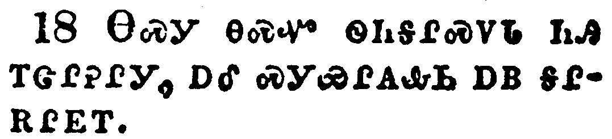</a></td>
</tr>
<tr class="even">
<td>For the same cause also do ye joy, and rejoice with me.</td>
</tr>
<tr class="odd">
<td>ᎾᏍᎩ ᎾᏍᏉ ᏫᏂᎦᎵᏍᏙᏓ ᏂᎯ ᎢᏣᎵᎮᎵᎩ, ᎠᎴ ᏍᎩᏯᎵᎪᎲᏏ ᎠᏴ ᎦᎵᎡᎵᎬᎢ.</td>
</tr>
<tr class="even">
<td>Na-s-gi na-s-quo wi-ni-ga-li-s-do-da ni-hi i-tsa-li-he-li-gi, a-le s-gi-ya-li-go-hv-si a-yv ga-li-e-li-gv-i.</td>
</tr>
</tbody>
</table>

<table>
<tbody>
<tr class="odd">
<td><a href="110219.png">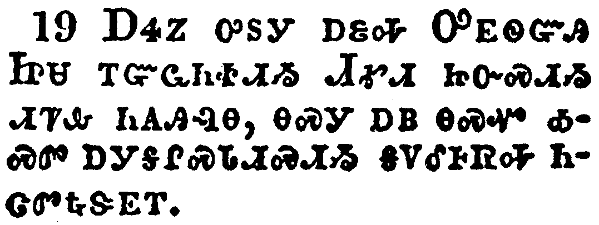</a></td>
</tr>
<tr class="even">
<td>But I trust in the Lord Jesus to send Timotheus shortly unto you, that I also may be of good comfort, when I know your state.</td>
</tr>
<tr class="odd">
<td>ᎠᏎᏃ ᎤᏚᎩ ᎠᏋᎭ ᎤᎬᏫᏳᎯ ᏥᏌ ᎢᏳᏩᏂᏐᏗᏱ ᏗᎹᏗ ᏥᏅᏍᏗᏱ ᏗᏤᎲ ᏂᎪᎯᎸᎾ, ᎾᏍᎩ ᎠᏴ ᎾᏍᏉ ᎣᏍᏛ ᎠᎩᎦᎵᏍᏓᏗᏍᏗᏱ ᎦᏙᎴᎰᏒᎭ ᏂᏣᏛᎿᎭᏕᎬᎢ.</td>
</tr>
<tr class="even">
<td>A-se-no u-du-gi a-quv-ha U-gv-wi-yu-hi Tsi-sa i-yu-wa-ni-so-di-yi Di-ma-di tsi-nv-s-di-yi di-tse-hv ni-go-hi-lv-na, na-s-gi a-yv na-s-quo o-s-dv a-gi-ga-li-s-da-di-s-di-yi ga-do-le-ho-sv-ha ni-tsa-dv-hna-de-gv-i.</td>
</tr>
</tbody>
</table>

<table>
<tbody>
<tr class="odd">
<td><a href="110220.png">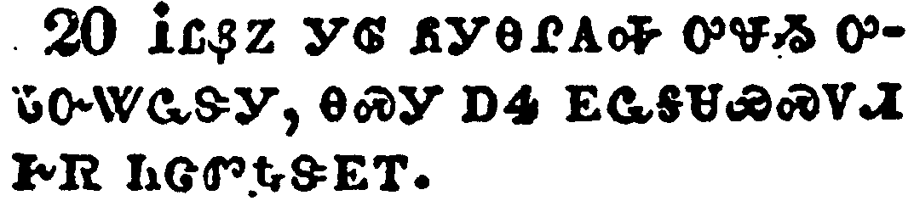</a></td>
</tr>
<tr class="even">
<td>For I have no man likeminded, who will naturally care for your state.</td>
</tr>
<tr class="odd">
<td>ᎥᏝᏰᏃ ᎩᎶ ᏲᎩᎾᎵᎪᎭ ᎤᏠᏱ ᎤᏓᏅᏔᏩᏕᎩ, ᎾᏍᎩ ᎠᏎ ᎬᏩᎦᏌᏯᏍᏙᏗ ᎨᏒ ᏂᏣᏛᎿᎭᏕᎬᎢ.</td>
</tr>
<tr class="even">
<td>V-tla-ye-no gi-lo yo-gi-na-li-go-ha u-tlo-yi u-da-nv-ta-wa-de-gi, na-s-gi a-se gv-wa-ga-sa-ya-s-do-di ge-sv ni-tsa-dv-hna-de-gv-i.</td>
</tr>
</tbody>
</table>

<table>
<tbody>
<tr class="odd">
<td><a href="110221.png">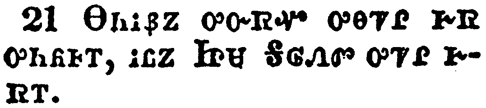</a></td>
</tr>
<tr class="even">
<td>For all seek their own, not the things which are Jesus Christ's.</td>
</tr>
<tr class="odd">
<td>ᎾᏂᎥᏰᏃ ᎤᏅᏒᏉ ᎤᎾᏤᎵ ᎨᏒ ᎤᏂᏲᎰᎢ, ᎥᏝᏃ ᏥᏌ ᎦᎶᏁᏛ ᎤᏤᎵ ᎨᏒᎢ.</td>
</tr>
<tr class="even">
<td>Na-ni-v-ye-no u-nv-sv-quo u-na-tse-li ge-sv u-ni-yo-ho-i, v-tla-no Tsi-sa Ga-lo-ne-dv u-tse-li ge-sv-i.</td>
</tr>
</tbody>
</table>

<table>
<tbody>
<tr class="odd">
<td><a href="110222.png">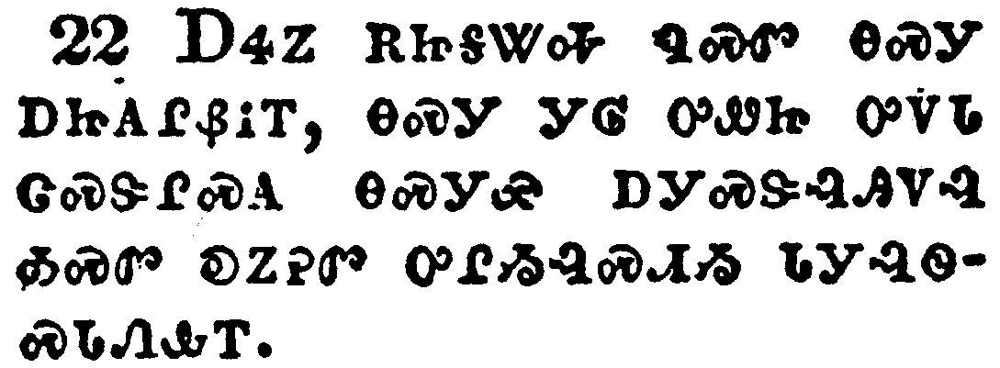</a></td>
</tr>
<tr class="even">
<td>But ye know the proof of him, that, as a son with the father, he hath served with me in the gospel.</td>
</tr>
<tr class="odd">
<td>ᎠᏎᏃ ᎡᏥᎦᏔᎭ ᏄᏍᏛ ᎾᏍᎩ ᎠᏥᎪᎵᏰᎥᎢ, ᎾᏍᎩ ᎩᎶ ᎤᏪᏥ ᎤᏙᏓ ᏣᏍᏕᎵᏍᎪ ᎾᏍᎩᏯ ᎠᎩᏍᏕᎸᎯᏙᎸ ᎣᏍᏛ ᎧᏃᎮᏛ ᎤᎵᏱᎸᏍᏗᏱ ᏓᎩᎸᏫᏍᏓᏁᎲᎢ.</td>
</tr>
<tr class="even">
<td>A-se-no e-tsi-ga-ta-ha nu-s-dv na-s-gi a-tsi-go-li-ye-v-i, na-s-gi gi-lo u-we-tsi u-do-da tsa-s-de-li-s-go na-s-gi-ya a-gi-s-de-lv-hi-do-lv o-s-dv ka-no-he-dv u-li-yi-lv-s-di-yi da-gi-lv-wi-s-da-ne-hv-i.</td>
</tr>
</tbody>
</table>

<table>
<tbody>
<tr class="odd">
<td><a href="110223.png">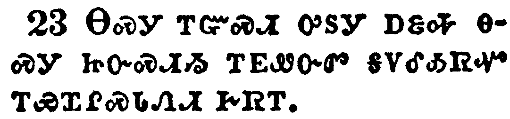</a></td>
</tr>
<tr class="even">
<td>Him therefore I hope to send presently, so soon as I shall see how it will go with me.</td>
</tr>
<tr class="odd">
<td>ᎾᏍᎩ ᎢᏳᏍᏗ ᎤᏚᎩ ᎠᏋᎭ ᎾᏍᎩ ᏥᏅᏍᏗᏱ ᎢᎬᏪᏅᏛ ᎦᏙᎴᎣᏒᏉ ᎢᏯᏉᎵᏍᏓᏁᏗ ᎨᏒᎢ.</td>
</tr>
<tr class="even">
<td>Na-s-gi i-yu-s-di u-du-gi a-quv-ha na-s-gi tsi-nv-s-di-yi i-gv-we-nv-dv ga-do-le-o-sv-quo i-ya-quo-li-s-da-ne-di ge-sv-i.</td>
</tr>
</tbody>
</table>

<table>
<tbody>
<tr class="odd">
<td><a href="110224.png">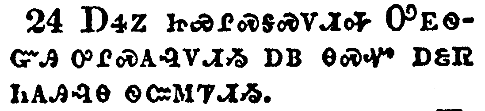</a></td>
</tr>
<tr class="even">
<td>But I trust in the Lord that I also myself shall come shortly.</td>
</tr>
<tr class="odd">
<td>ᎠᏎᏃ ᏥᏯᎵᏍᎦᏍᏙᏗᎭ ᎤᎬᏫᏳᎯ ᎤᎵᏍᎪᎸᏙᏗᏱ ᎠᏴ ᎾᏍᏉ ᎠᏋᏒ ᏂᎪᎯᎸᎾ ᏫᏨᎷᏤᏗᏱ.</td>
</tr>
<tr class="even">
<td>A-se-no tsi-ya-li-s-ga-s-do-di-ha U-gv-wi-yu-hi u-li-s-go-lv-do-di-yi a-yv na-s-quo a-quv-sv ni-go-hi-lv-na wi-tsv-lu-tse-di-yi.</td>
</tr>
</tbody>
</table>

<table>
<tbody>
<tr class="odd">
<td><a href="110225.png">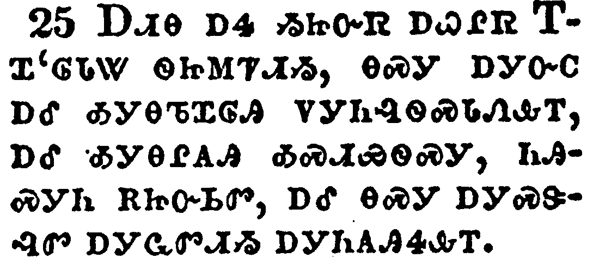</a></td>
</tr>
<tr class="even">
<td>Yet I supposed it necessary to send to you Epaphroditus, my brother, and companion in labour, and fellowsoldier, but your messenger, and he that ministered to my wants.</td>
</tr>
<tr class="odd">
<td>ᎠᏗᎾ ᎠᏎ ᏱᏥᏅᏒ ᎠᏇᎵᏒ ᎢᏆ'ᎶᏓᏔ ᏫᏥᎷᏤᏗᏱ, ᎾᏍᎩ ᎠᎩᏅᏟ ᎠᎴ ᎣᎩᎾᏖᏆᎶᎯ ᏙᎩᏂᎸᏫᏍᏓᏁᎲᎢ, ᎠᎴ ᎣᎩᎾᎵᎪᎯ ᎣᏍᏗᏯᏫᏍᎩ, ᏂᎯᏍᎩᏂ ᎡᏥᏅᏏᏛ, ᎠᎴ ᎾᏍᎩ ᎠᎩᏍᏕᎸᏛ ᎠᎩᏩᏛᏗᏱ ᎠᎩᏂᎪᎯᏎᎲᎢ.</td>
</tr>
<tr class="even">
<td>A-di-na a-se yi-tsi-nv-sv a-que-li-sv I-qua-'-lo-da-ta wi-tsi-lu-tse-di-yi, na-s-gi a-gi-nv-tli a-le o-gi-na-te-qua-lo-hi do-gi-ni-lv-wi-s-da-ne-hv-i, a-le o-gi-na-li-go-hi o-s-di-ya-wi-s-gi, ni-hi-s-gi-ni e-tsi-nv-si-dv, a-le na-s-gi a-gi-s-de-lv-dv a-gi-wa-dv-di-yi a-gi-ni-go-hi-se-hv-i.</td>
</tr>
</tbody>
</table>

<table>
<tbody>
<tr class="odd">
<td><a href="110226.png">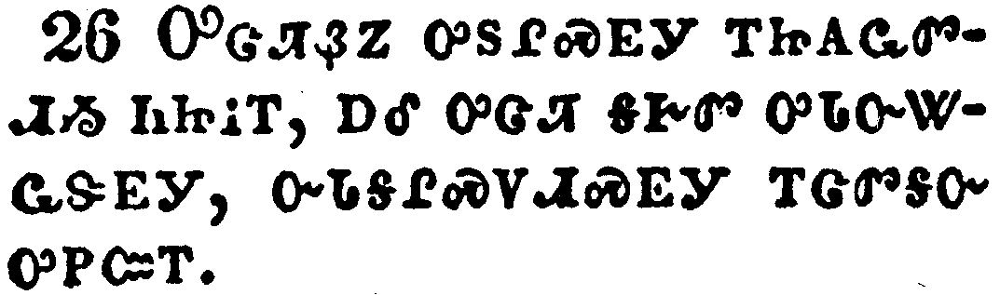</a></td>
</tr>
<tr class="even">
<td>For he longed after you all, and was full of heaviness, because that ye had heard that he had been sick.</td>
</tr>
<tr class="odd">
<td>ᎤᏣᏘᏰᏃ ᎤᏚᎵᏍᎬᎩ ᎢᏥᎪᏩᏛᏗᏱ ᏂᏥᎥᎢ, ᎠᎴ ᎤᏣᏘ ᎦᎨᏛ ᎤᏓᏅᏔᏩᏕᎬᎩ, ᏅᏓᎦᎵᏍᏙᏗᏍᎬᎩ ᎢᏣᏛᎦᏅ ᎤᏢᏨᎢ.</td>
</tr>
<tr class="even">
<td>U-tsa-ti-ye-no u-du-li-s-gv-gi i-tsi-go-wa-dv-di-yi ni-tsi-v-i, a-le u-tsa-ti ga-ge-dv u-da-nv-ta-wa-de-gv-gi, nv-da-ga-li-s-do-di-s-gv-gi i-tsa-dv-ga-nv u-tlv-tsv-i.</td>
</tr>
</tbody>
</table>

<table>
<tbody>
<tr class="odd">
<td><a href="110227.png">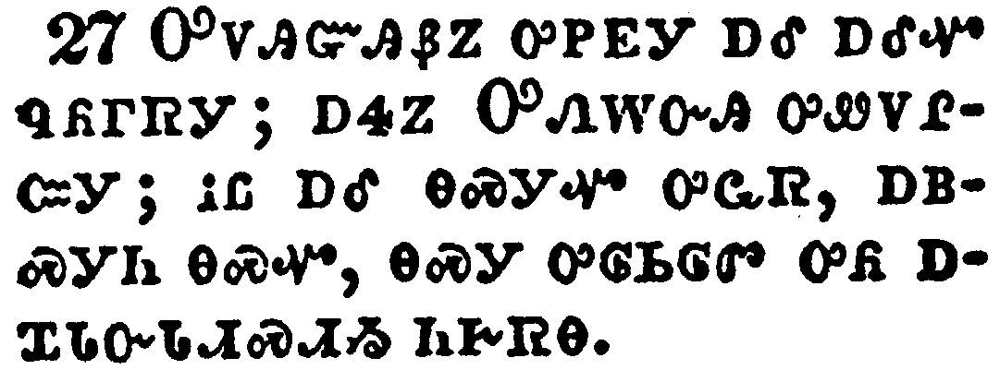</a></td>
</tr>
<tr class="even">
<td>For indeed he was sick nigh unto death: but God had mercy on him; and not on him only, but on me also, lest I should have sorrow upon sorrow.</td>
</tr>
<tr class="odd">
<td>ᎤᏙᎯᏳᎯᏰᏃ ᎤᏢᎬᎩ ᎠᎴ ᎠᎴᏉ ᏄᏲᎱᏒᎩ; ᎠᏎᏃ ᎤᏁᎳᏅᎯ ᎤᏪᏙᎵᏨᎩ; ᎥᏝ ᎠᎴ ᎾᏍᎩᏉ ᎤᏩᏒ, ᎠᏴᏍᎩᏂ ᎾᏍᏉ, ᎾᏍᎩ ᎤᎶᏏᎶᏛ ᎤᏲ ᎠᏆᏓᏅᏓᏗᏍᏗᏱ ᏂᎨᏒᎾ.</td>
</tr>
<tr class="even">
<td>U-do-hi-yu-hi-ye-no u-tlv-gv-gi a-le a-le-quo nu-yo-hu-sv-gi; a-se-no U-ne-la-nv-hi u-we-do-li-tsv-gi; v-tla a-le na-s-gi-quo u-wa-sv, a-yv-s-gi-ni na-s-quo, na-s-gi u-lo-si-lo-dv u-yo a-qua-da-nv-da-di-s-di-yi ni-ge-sv-na.</td>
</tr>
</tbody>
</table>

<table>
<tbody>
<tr class="odd">
<td><a href="110228.png">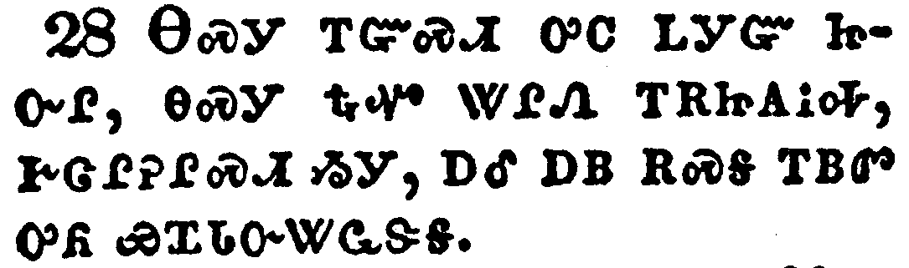</a></td>
</tr>
<tr class="even">
<td>I sent him therefore the more carefully, that, when ye see him again, ye may rejoice, and that I may be the less sorrowful.</td>
</tr>
<tr class="odd">
<td>ᎾᏍᎩ ᎢᏳᏍᏗ ᎤᏟ ᏞᎩᏳ ᏥᏅᎵ, ᎾᏍᎩ ᎿᎭᏉ ᏔᎵᏁ ᎢᎡᏥᎪᎥᎭ, ᎨᏣᎵᎮᎵᏍᏗ ᏱᎩ, ᎠᎴ ᎠᏴ ᎡᏍᎦ ᎢᏴᏛ ᎤᏲ ᏯᏆᏓᏅᏔᏩᏕᎦ.</td>
</tr>
<tr class="even">
<td>Na-s-gi i-yu-s-di u-tli tle-gi-yu tsi-nv-li, na-s-gi hna-quo ta-li-ne i-e-tsi-go-v-ha, ge-tsa-li-he-li-s-di yi-gi, a-le a-yv e-s-ga i-yv-dv u-yo ya-qua-da-nv-ta-wa-de-ga.</td>
</tr>
</tbody>
</table>

<table>
<tbody>
<tr class="odd">
<td><a href="110229.png">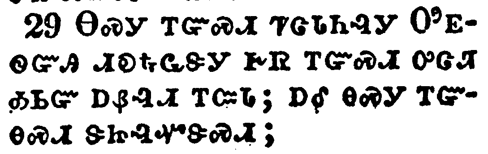</a></td>
</tr>
<tr class="even">
<td>Receive him therefore in the Lord with all gladness; and hold such in reputation:</td>
</tr>
<tr class="odd">
<td>ᎾᏍᎩ ᎢᏳᏍᏗ ᏤᏣᏓᏂᎸᎩ ᎤᎬᏫᏳᎯ ᏗᎧᎿᎭᏩᏕᎩ ᎨᏒ ᎢᏳᏍᏗ ᎤᏣᏘ ᎣᏏᏳ ᎠᏰᎸᏗ ᎢᏨᏓ; ᎠᎴ ᎾᏍᎩ ᎢᏳᎾᏍᏗ ᏕᏥᎸᏉᏕᏍᏗ;</td>
</tr>
<tr class="even">
<td>Na-s-gi i-yu-s-di tse-tsa-da-ni-lv-gi U-gv-wi-yu-hi di-ka-hna-wa-de-gi ge-sv i-yu-s-di u-tsa-ti o-si-yu a-ye-lv-di i-tsv-da; a-le na-s-gi i-yu-na-s-di de-tsi-lv-quo-de-s-di;</td>
</tr>
</tbody>
</table>

<table>
<tbody>
<tr class="odd">
<td><a href="110230.png">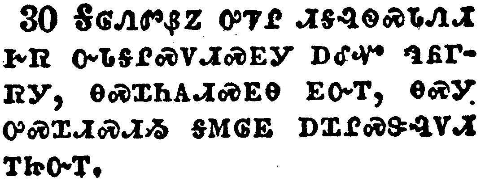</a></td>
</tr>
<tr class="even">
<td>Because for the work of Christ he was nigh unto death, not regarding his life, to supply your lack of service toward me.</td>
</tr>
<tr class="odd">
<td>ᎦᎶᏁᏛᏰᏃ ᎤᏤᎵ ᏗᎦᎸᏫᏍᏓᏁᏗ ᎨᏒ ᏅᏓᎦᎵᏍᏙᏗᏍᎬᎩ ᎠᎴᏉ ᏄᏲᎱᏒᎩ, ᎾᏍᏆᏂᎪᏗᏍᎬᎾ ᎬᏅᎢ, ᎾᏍᎩ ᎤᏍᏆᏗᏍᏗᏱ ᎦᎷᎶᎬ ᎠᏆᎵᏍᏕᎸᏙᏗ ᎢᏥᏅᎢ.</td>
</tr>
<tr class="even">
<td>Ga-lo-ne-dv-ye-no u-tse-li di-ga-lv-wi-s-da-ne-di ge-sv nv-da-ga-li-s-do-di-s-gv-gi a-le-quo nu-yo-hu-sv-gi, na-s-qua-ni-go-di-s-gv-na gv-nv-i, na-s-gi u-s-qua-di-s-di-yi ga-lu-lo-gv a-qua-li-s-de-lv-do-di i-tsi-nv-i.</td>
</tr>
</tbody>
</table>

