+++
draft=false
date = 2014-12-18T21:11:07Z
title = "Revelation - Chapter 7 - Cherokee New Testament"
weight = 1418955067

[taxonomies]

authors = ["Timothy Legg"]
categories = []
tags = []

[extra]
+++

<table>
<tbody>
<tr class="odd">
<td><a href="270701.png">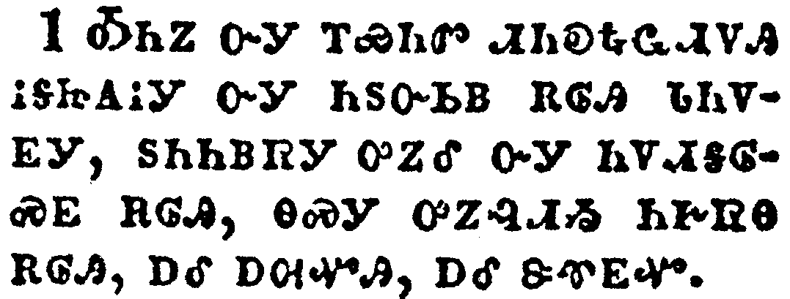</a></td>
</tr>
<tr class="even">
<td>And after these things I saw four angels standing on the four corners of the earth, holding the four winds of the earth, that the wind should not blow on the earth, nor on the sea, nor on any tree.</td>
</tr>
<tr class="odd">
<td>ᎣᏂᏃ ᏅᎩ ᎢᏯᏂᏛ ᏗᏂᎧᎿᎭᏩᏗᏙᎯ ᎥᎦᏥᎪᎥᎩ ᏅᎩ ᏂᏚᏅᏏᏴ ᎡᎶᎯ ᏓᏂᏙᎬᎩ, ᏚᏂᏂᏴᏒᎩ ᎤᏃᎴ ᏅᎩ ᏂᏙᏗᎦᎶᏍᎬ ᎡᎶᎯ, ᎾᏍᎩ ᎤᏃᎸᏗᏱ ᏂᎨᏒᎾ ᎡᎶᎯ, ᎠᎴ ᎠᎺᏉᎯ, ᎠᎴ ᏕᏡᎬᏉ.</td>
</tr>
<tr class="even">
<td>O-ni-no nv-gi i-ya-ni-dv di-ni-ka-hna-wa-di-do-hi v-ga-tsi-go-v-gi nv-gi ni-du-nv-si-yv e-lo-hi da-ni-do-gv-gi, du-ni-ni-yv-sv-gi u-no-le nv-gi ni-do-di-ga-lo-s-gv e-lo-hi, na-s-gi u-no-lv-di-yi ni-ge-sv-na e-lo-hi, a-le a-me-quo-hi, a-le de-tlu-gv-quo.</td>
</tr>
</tbody>
</table>

<table>
<tbody>
<tr class="odd">
<td><a href="270702.png">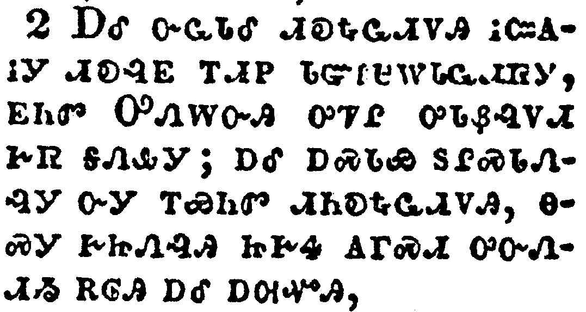</a></td>
</tr>
<tr class="even">
<td>And I saw another angel ascending from the east, having the seal of the living God: and he cried with a loud voice to the four angels, to whom it was given to hurt the earth and the sea,</td>
</tr>
<tr class="odd">
<td>ᎠᎴ ᏅᏩᏓᎴ ᏗᎧᎿᎭᏩᏗᏙᎯ ᎥᏨᎪᎥᎩ ᏗᎧᎸᎬ ᎢᏗᏢ ᏧᏳᎵᏌᎳᏓᏩᏗᏒᎩ, ᎬᏂᏛ ᎤᏁᎳᏅᎯ ᎤᏤᎵ ᎤᏓᏰᎸᏙᏗ ᎨᏒ ᎦᏁᎲᎩ; ᎠᎴ ᎠᏍᏓᏯ ᏚᎵᏍᏓᏁᎸᎩ ᏅᎩ ᎢᏯᏂᏛ ᏗᏂᎧᎿᎭᏩᏗᏙᎯ, ᎾᏍᎩ ᎨᏥᏁᎸᎯ ᏥᎨᏎ ᎪᎱᏍᏗ ᎤᏅᏁᏗᏱ ᎡᎶᎯ ᎠᎴ ᎠᎺᏉᎯ,</td>
</tr>
<tr class="even">
<td>A-le nv-wa-da-le di-ka-hna-wa-di-do-hi v-tsv-go-v-gi di-ka-lv-gv i-di-tlv tsu-yu-li-sa-la-da-wa-di-sv-gi, gv-ni-dv U-ne-la-nv-hi u-tse-li u-da-ye-lv-do-di ge-sv ga-ne-hv-gi; a-le a-s-da-ya du-li-s-da-ne-lv-gi nv-gi i-ya-ni-dv di-ni-ka-hna-wa-di-do-hi, na-s-gi ge-tsi-ne-lv-hi tsi-ge-se go-hu-s-di u-nv-ne-di-yi e-lo-hi a-le a-me-quo-hi,</td>
</tr>
</tbody>
</table>

<table>
<tbody>
<tr class="odd">
<td><a href="270703.png">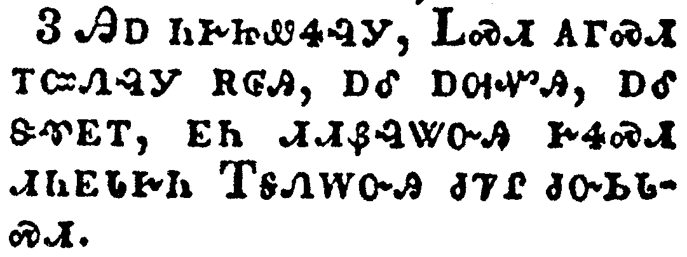</a></td>
</tr>
<tr class="even">
<td>Saying, Hurt not the earth, neither the sea, nor the trees, till we have sealed the servants of our God in their foreheads.</td>
</tr>
<tr class="odd">
<td>ᎯᎠ ᏂᎨᏥᏪᏎᎸᎩ, ᏞᏍᏗ ᎪᎱᏍᏗ ᎢᏨᏁᎸᎩ ᎡᎶᎯ, ᎠᎴ ᎠᎺᏉᎯ, ᎠᎴ ᏕᏡᎬᎢ, ᎬᏂ ᏗᏗᏰᎸᏔᏅᎯ ᎨᏎᏍᏗ ᏗᏂᎬᏓᎨᏂ ᎢᎦᏁᎳᏅᎯ ᏧᏤᎵ ᏧᏅᏏᏓᏍᏗ.</td>
</tr>
<tr class="even">
<td>Hi-a ni-ge-tsi-we-se-lv-gi, Tle-s-di go-hu-s-di i-tsv-ne-lv-gi e-lo-hi, a-le a-me-quo-hi, a-le de-tlu-gv-i, gv-ni di-di-ye-lv-ta-nv-hi ge-se-s-di di-ni-gv-da-ge-ni I-ga-ne-la-nv-hi tsu-tse-li tsu-nv-si-da-s-di.</td>
</tr>
</tbody>
</table>

<table>
<tbody>
<tr class="odd">
<td><a href="270704.png">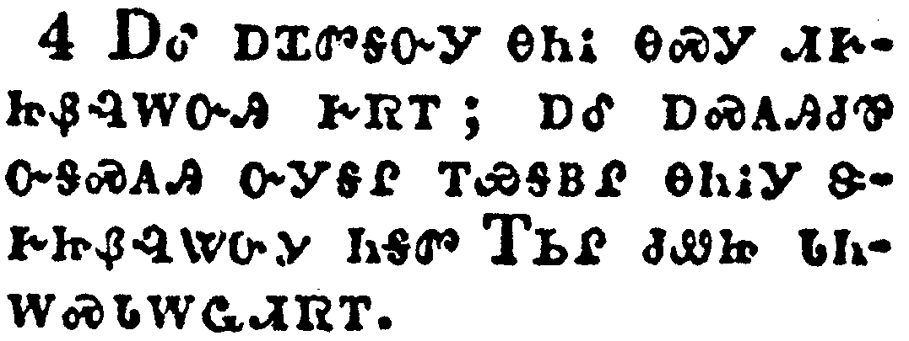</a></td>
</tr>
<tr class="even">
<td>And I heard the number of them which were sealed: and there were sealed an hundred and forty and four thousand of all the tribes of the children of Israel.</td>
</tr>
<tr class="odd">
<td>ᎠᎴ ᎠᏆᏛᎦᏅᎩ ᎾᏂᎥ ᎾᏍᎩ ᏗᎨᏥᏰᎸᎳᏅᎯ ᎨᏒᎢ; ᎠᎴ ᎠᏍᎪᎯᏧᏈ ᏅᎦᏍᎪᎯ ᏅᎩᎦᎵ ᎢᏯᎦᏴᎵ ᎾᏂᎥᎩ ᏕᎨᏥᏰᎸᏔᏅᎩ ᏂᎦᏛ ᎢᏏᎵ ᏧᏪᏥ ᏓᏂᎳᏍᏓᎳᏩᏗᏒᎢ.</td>
</tr>
<tr class="even">
<td>A-le a-qua-dv-ga-nv-gi na-ni-v na-s-gi di-ge-tsi-ye-lv-la-nv-hi ge-sv-i; a-le a-s-go-hi-tsu-qui nv-ga-s-go-hi nv-gi-ga-li i-ya-ga-yv-li na-ni-v-gi de-ge-tsi-ye-lv-ta-nv-gi ni-ga-dv I-si-li tsu-we-tsi da-ni-la-s-da-la-wa-di-sv-i.</td>
</tr>
</tbody>
</table>

<table>
<tbody>
<tr class="odd">
<td><a href="270705.png">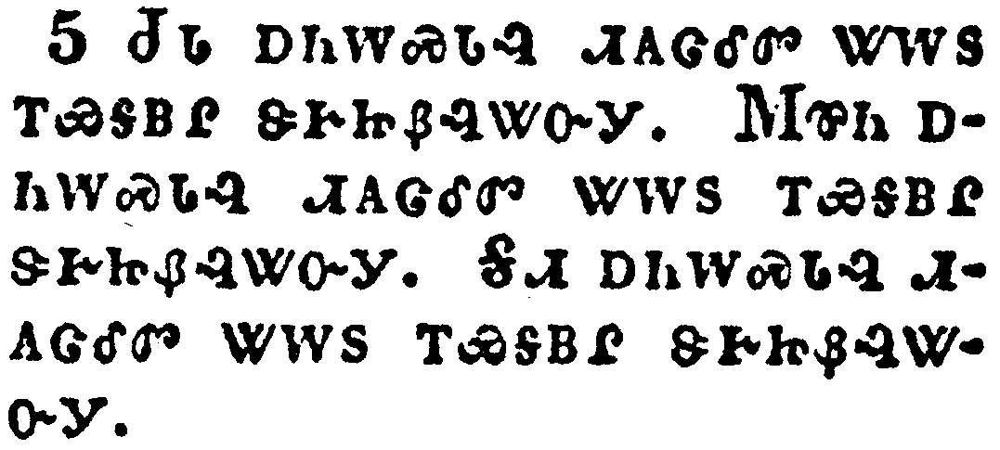</a></td>
</tr>
<tr class="even">
<td>Of the tribe of Juda were sealed twelve thousand. Of the tribe of Reuben were sealed twelve thousand. Of the tribe of Gad were sealed twelve thousand.</td>
</tr>
<tr class="odd">
<td>ᏧᏓ ᎠᏂᎳᏍᏓᎸ ᏗᎪᏣᎴᏛ ᏔᎳᏚ ᎢᏯᎦᏴᎵ ᏕᎨᏥᏰᎸᏔᏅᎩ. ᎷᏈᏂ ᎠᏂᎳᏍᏓᎸ ᏗᎪᏣᎴᏛ ᏔᎳᏚ ᎢᏯᎦᏴᎵ ᏕᎨᏥᏰᎸᏔᏅᎩ. ᎦᏗ ᎠᏂᎳᏍᏓᎸ ᏗᎪᏣᎴᏛ ᏔᎳᏚ ᎢᏯᎦᏴᎵ ᏕᎨᏥᏰᎸᏔᏅᎩ.</td>
</tr>
<tr class="even">
<td>Tsu-da a-ni-la-s-da-lv di-go-tsa-le-dv ta-la-du i-ya-ga-yv-li de-ge-tsi-ye-lv-ta-nv-gi. Lu-qui-ni a-ni-la-s-da-lv di-go-tsa-le-dv ta-la-du i-ya-ga-yv-li de-ge-tsi-ye-lv-ta-nv-gi. Ga-di a-ni-la-s-da-lv di-go-tsa-le-dv ta-la-du i-ya-ga-yv-li de-ge-tsi-ye-lv-ta-nv-gi.</td>
</tr>
</tbody>
</table>

<table>
<tbody>
<tr class="odd">
<td><a href="270706.png">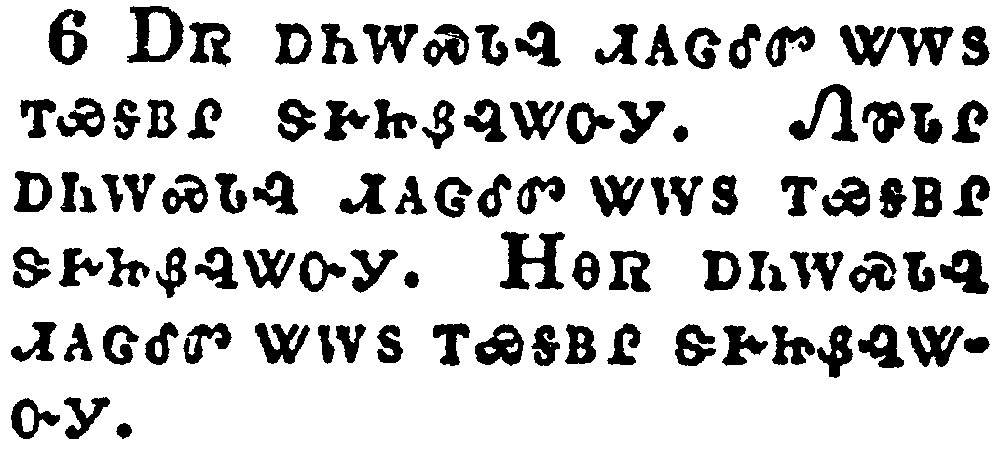</a></td>
</tr>
<tr class="even">
<td>Of the tribe of Aser were sealed twelve thousand. Of the tribe of Nepthalim were sealed twelve thousand. Of the tribe of Manasses were sealed twelve thousand.</td>
</tr>
<tr class="odd">
<td>ᎠᏒ ᎠᏂᎳᏍᏓᎸ ᏗᎪᏣᎴᏛ ᏔᎳᏚ ᎢᏯᎦᏴᎵ ᏕᎨᏥᏰᎸᏔᏅᎩ. ᏁᏈᏓᎵ ᎠᏂᎳᏍᏓᎸ ᏗᎪᏣᎴᏛ ᏔᎳᏚ ᎢᏯᎦᏴᎵ ᏕᎨᏥᏰᎸᏔᏅᎩ. ᎻᎾᏒ ᎠᏂᎳᏍᏓᎸ ᏗᎪᏣᎴᏛ ᏔᎳᏚ ᎢᏯᎦᏴᎵ ᏕᎨᏥᏰᎸᏔᏅᎩ.</td>
</tr>
<tr class="even">
<td>A-sv a-ni-la-s-da-lv di-go-tsa-le-dv ta-la-du i-ya-ga-yv-li de-ge-tsi-ye-lv-ta-nv-gi. Ne-qui-da-li a-ni-la-s-da-lv di-go-tsa-le-dv ta-la-du i-ya-ga-yv-li de-ge-tsi-ye-lv-ta-nv-gi. Mi-na-sv a-ni-la-s-da-lv di-go-tsa-le-dv ta-la-du i-ya-ga-yv-li de-ge-tsi-ye-lv-ta-nv-gi.</td>
</tr>
</tbody>
</table>

<table>
<tbody>
<tr class="odd">
<td><a href="270707.png">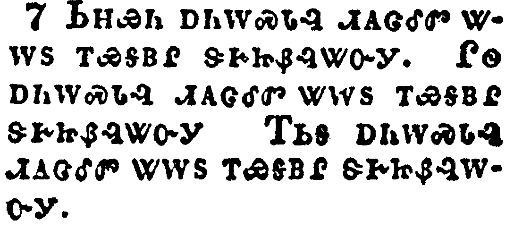</a></td>
</tr>
<tr class="even">
<td>Of the tribe of Simeon were sealed twelve thousand. Of the tribe of Levi were sealed twelve thousand. Of the tribe of Issachar were sealed twelve thousand.</td>
</tr>
<tr class="odd">
<td>ᏏᎻᏯᏂ ᎠᏂᎳᏍᏓᎸ ᏗᎪᏣᎴᏛ ᏔᎷᏚ ᎢᏯᎦᏴᎵ ᏕᎨᏥᏰᎸᏔᏅᎩ. ᎵᏫ ᎠᏂᎳᏍᏓᎸ ᏗᎪᏣᎴᏛ ᏔᎳᏚ ᎢᏯᎦᏴᎵ ᏕᎨᏥᏰᎸᏔᏅᎩ ᎢᏏᎦ ᎠᏂᎳᏍᏓᎸ ᏗᎪᏣᎴᏛ ᏔᎳᏚ ᎢᏯᎦᏴᎵ ᏕᎨᏥᏰᎸᎳᏅᎩ.</td>
</tr>
<tr class="even">
<td>Si-mi-ya-ni a-ni-la-s-da-lv di-go-tsa-le-dv ta-lu-du i-ya-ga-yv-li de-ge-tsi-ye-lv-ta-nv-gi. Li-wi a-ni-la-s-da-lv di-go-tsa-le-dv ta-la-du i-ya-ga-yv-li de-ge-tsi-ye-lv-ta-nv-gi I-si-ga a-ni-la-s-da-lv di-go-tsa-le-dv ta-la-du i-ya-ga-yv-li de-ge-tsi-ye-lv-la-nv-gi.</td>
</tr>
</tbody>
</table>

<table>
<tbody>
<tr class="odd">
<td><a href="270708.png">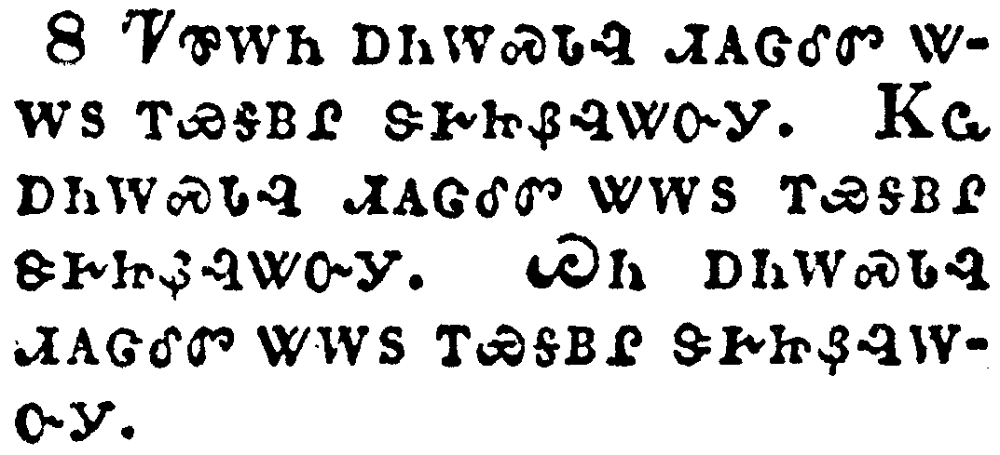</a></td>
</tr>
<tr class="even">
<td>Of the tribe of Zabulon were sealed twelve thousand. Of the tribe of Joseph were sealed twelve thousand. Of the tribe of Benjamin were sealed twelve thousand.</td>
</tr>
<tr class="odd">
<td>ᏤᏈᎳᏂ ᎠᏂᎳᏍᏓᎸ ᏗᎪᏣᎴᏛ ᏔᎳᏚ ᎢᏯᎦᏴᎵ ᏕᎨᏥᏰᎸᏔᏅᎩ. ᏦᏩ ᎠᏂᎳᏍᏓᎸ ᏗᎪᏣᎴᏛ ᏔᎳᏚ ᎢᏯᎦᏴᎵ ᏕᎨᏥᏰᎸᏔᏅᎩ. ᏇᏂ ᎠᏂᎳᏍᏓᎸ ᏗᎪᏣᎴᏛ ᏔᎳᏚ ᎢᏯᎦᏴᎵ ᏕᎨᏥᏰᎸᎳᏅᎩ.</td>
</tr>
<tr class="even">
<td>Tse-qui-la-ni a-ni-la-s-da-lv di-go-tsa-le-dv ta-la-du i-ya-ga-yv-li de-ge-tsi-ye-lv-ta-nv-gi. Tso-wa a-ni-la-s-da-lv di-go-tsa-le-dv ta-la-du i-ya-ga-yv-li de-ge-tsi-ye-lv-ta-nv-gi. Que-ni a-ni-la-s-da-lv di-go-tsa-le-dv ta-la-du i-ya-ga-yv-li de-ge-tsi-ye-lv-la-nv-gi.</td>
</tr>
</tbody>
</table>

<table>
<tbody>
<tr class="odd">
<td><a href="270709.png">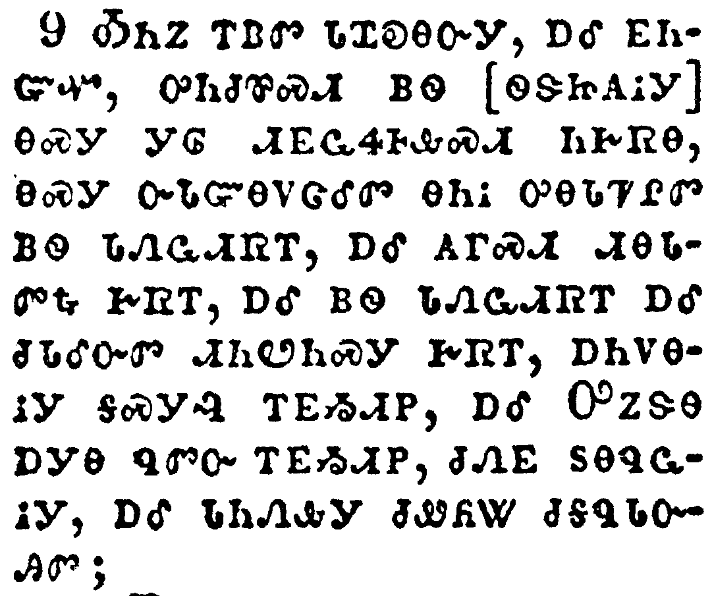</a></td>
</tr>
<tr class="even">
<td>After this I beheld, and, lo, a great multitude, which no man could number, of all nations, and kindreds, and people, and tongues, stood before the throne, and before the Lamb, clothed with white robes, and palms in their hands;</td>
</tr>
<tr class="odd">
<td>ᎣᏂᏃ ᎢᏴᏛ ᏓᏆᎧᎾᏅᎩ, ᎠᎴ ᎬᏂᏳᏉ, ᎤᏂᏧᏈᏍᏗ ᏴᏫ [ᏫᏕᏥᎪᎥᎩ] ᎾᏍᎩ ᎩᎶ ᏗᎬᏩᏎᎰᎲᏍᏗ ᏂᎨᏒᎾ, ᎾᏍᎩ ᏅᏓᏳᎾᏙᏣᎴᏛ ᎾᏂᎥ ᎤᎾᏓᏤᎵᏛ ᏴᏫ ᏓᏁᏩᏗᏒᎢ, ᎠᎴ ᎪᎱᏍᏗ ᏗᎾᏓᏛᎿᎭᎨᏒᎢ, ᎠᎴ ᏴᏫ ᏓᏁᏩᏗᏒᎢ ᎠᎴ ᏧᏓᎴᏅᏛ ᏗᏂᏬᏂᏍᎩ ᎨᏒᎢ, ᎠᏂᏙᎾᎥᎩ ᎦᏍᎩᎸ ᎢᎬᏱᏗᏢ, ᎠᎴ ᎤᏃᏕᎾ ᎠᎩᎾ ᏄᏛᏅ ᎢᎬᏱᏗᏢ, ᏧᏁᎬ ᏚᎾᏄᏩᎥᎩ, ᎠᎴ ᏗᏂᏁᎲᎩ ᏧᏪᏲᏔ ᏧᎦᏄᏓᏅᎯᏛ;</td>
</tr>
<tr class="even">
<td>O-ni-no i-yv-dv da-qua-ka-na-nv-gi, a-le gv-ni-yu-quo, u-ni-tsu-qui-s-di yv-wi [wi-de-tsi-go-v-gi] na-s-gi gi-lo di-gv-wa-se-ho-hv-s-di ni-ge-sv-na, na-s-gi nv-da-yu-na-do-tsa-le-dv na-ni-v u-na-da-tse-li-dv yv-wi da-ne-wa-di-sv-i, a-le go-hu-s-di di-na-da-dv-hna ge-sv-i, a-le yv-wi da-ne-wa-di-sv-i a-le tsu-da-le-nv-dv di-ni-wo-ni-s-gi ge-sv-i, a-ni-do-na-v-gi ga-s-gi-lv i-gv-yi-di-tlv, a-le U-no-de-na a-gi-na nu-dv-nv i-gv-yi-di-tlv, tsu-ne-gv du-na-nu-wa-v-gi, a-le di-ni-ne-hv-gi tsu-we-yo-ta tsu-ga-nu-da-nv-hi-dv;</td>
</tr>
</tbody>
</table>

<table>
<tbody>
<tr class="odd">
<td><a href="270710.png">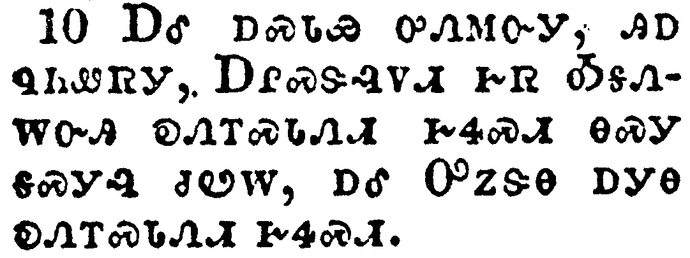</a></td>
</tr>
<tr class="even">
<td>And cried with a loud voice, saying, Salvation to our God which sitteth upon the throne, and unto the Lamb.</td>
</tr>
<tr class="odd">
<td>ᎠᎴ ᎠᏍᏓᏯ ᎤᏁᎷᏅᎩ, ᎯᎠ ᏄᏂᏪᏒᎩ, ᎠᎵᏍᏕᎸᏙᏗ ᎨᏒ ᎣᎦᏁᎳᏅᎯ ᎧᏁᎢᏍᏓᏁᏗ ᎨᏎᏍᏗ ᎾᏍᎩ ᎦᏍᎩᎸ ᏧᏬᎳ, ᎠᎴ ᎤᏃᏕᎾ ᎠᎩᎾ ᎧᏁᎢᏍᏓᏁᏗ ᎨᏎᏍᏗ.</td>
</tr>
<tr class="even">
<td>A-le a-s-da-ya u-ne-lu-nv-gi, hi-a nu-ni-we-sv-gi, A-li-s-de-lv-do-di ge-sv O-ga-ne-la-nv-hi ka-ne-i-s-da-ne-di ge-se-s-di na-s-gi ga-s-gi-lv tsu-wo-la, a-le U-no-de-na a-gi-na ka-ne-i-s-da-ne-di ge-se-s-di.</td>
</tr>
</tbody>
</table>

<table>
<tbody>
<tr class="odd">
<td><a href="270711.png">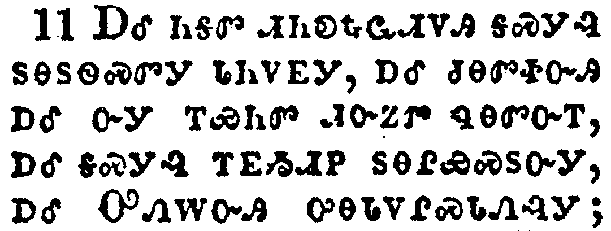</a></td>
</tr>
<tr class="even">
<td>And all the angels stood round about the throne, and about the elders and the four beasts, and fell before the throne on their faces, and worshipped God,</td>
</tr>
<tr class="odd">
<td>ᎠᎴ ᏂᎦᏛ ᏗᏂᎧᎿᎭᏩᏗᏙᎯ ᎦᏍᎩᎸ ᏚᎾᏚᏫᏍᏛᎩ ᏓᏂᏙᎬᎩ, ᎠᎴ ᏧᎾᏛᏐᏅᎯ ᎠᎴ ᏅᎩ ᎢᏯᏂᏛ ᏗᏅᏃᏛ ᏄᎾᏛᏅᎢ, ᎠᎴ ᎦᏍᎩᎸ ᎢᎬᏱᏗᏢ ᏚᎾᎵᏯᏍᏚᏅᎩ, ᎠᎴ ᎤᏁᎳᏅᎯ ᎤᎾᏓᏙᎵᏍᏓᏁᎸᎩ;</td>
</tr>
<tr class="even">
<td>A-le ni-ga-dv di-ni-ka-hna-wa-di-do-hi ga-s-gi-lv du-na-du-wi-s-dv-gi da-ni-do-gv-gi, a-le tsu-na-dv-so-nv-hi a-le nv-gi i-ya-ni-dv di-nv-no-dv nu-na-dv-nv-i, a-le ga-s-gi-lv i-gv-yi-di-tlv du-na-li-ya-s-du-nv-gi, a-le U-ne-la-nv-hi u-na-da-do-li-s-da-ne-lv-gi;</td>
</tr>
</tbody>
</table>

<table>
<tbody>
<tr class="odd">
<td><a href="270712.png">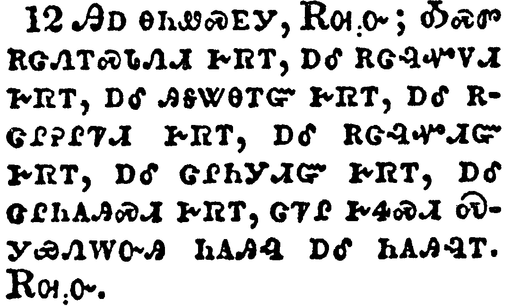</a></td>
</tr>
<tr class="even">
<td>Saying, Amen: Blessing, and glory, and wisdom, and thanksgiving, and honour, and power, and might, be unto our God for ever and ever. Amen.</td>
</tr>
<tr class="odd">
<td>ᎯᎠ ᎾᏂᏪᏍᎬᎩ, ᎡᎺᏅ; ᎣᏍᏛ ᎡᏣᏁᎢᏍᏓᏁᏗ ᎨᏒᎢ, ᎠᎴ ᎡᏣᎸᏉᏙᏗ ᎨᏒᎢ, ᎠᎴ ᎯᎦᏔᎾᎢᏳ ᎨᏒᎢ, ᎠᎴ ᎡᏣᎵᎮᎵᏤᏗ ᎨᏒᎢ, ᎠᎴ ᎡᏣᎸᏉᏗᏳ ᎨᏒᎢ, ᎠᎴ ᏣᎵᏂᎩᏗᏳ ᎨᏒᎢ, ᎠᎴ ᏣᎵᏂᎪᎯᏍᏗ ᎨᏒᎢ, ᏣᏤᎵ ᎨᏎᏍᏗ ᏍᎩᏯᏁᎳᏅᎯ ᏂᎪᎯᎸ ᎠᎴ ᏂᎪᎯᎸᎢ. ᎡᎺᏅ.</td>
</tr>
<tr class="even">
<td>Hi-a na-ni-we-s-gv-gi, E-me-nv; O-s-dv e-tsa-ne-i-s-da-ne-di ge-sv-i, a-le e-tsa-lv-quo-do-di ge-sv-i, a-le hi-ga-ta-na-i-yu ge-sv-i, a-le e-tsa-li-he-li-tse-di ge-sv-i, a-le e-tsa-lv-quo-di-yu ge-sv-i, a-le tsa-li-ni-gi-di-yu ge-sv-i, a-le tsa-li-ni-go-hi-s-di ge-sv-i, tsa-tse-li ge-se-s-di S-gi-ya-ne-la-nv-hi ni-go-hi-lv a-le ni-go-hi-lv-i. E-me-nv.</td>
</tr>
</tbody>
</table>

<table>
<tbody>
<tr class="odd">
<td><a href="270713.png">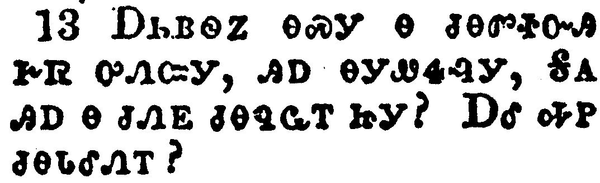</a></td>
</tr>
<tr class="even">
<td>And one of the elders answered, saying unto me, What are these which are arrayed in white robes? and whence came they?</td>
</tr>
<tr class="odd">
<td>ᎠᏂᏴᏫᏃ ᎾᏍᎩ Ꮎ ᏧᎾᏛᏐᏅᎯ ᎨᏒ ᎤᏁᏨᎩ, ᎯᎠ ᎾᎩᏪᏎᎸᎩ, ᎦᎪ ᎯᎠ Ꮎ ᏧᏁᎬ ᏧᎾᏄᏩᎢ ᏥᎩ? ᎠᎴ ᎭᏢ ᏧᎾᏓᎴᏁᎢ?</td>
</tr>
<tr class="even">
<td>A-ni-yv-wi-no na-s-gi na tsu-na-dv-so-nv-hi ge-sv u-ne-tsv-gi, hi-a na-gi-we-se-lv-gi, Ga-go hi-a na tsu-ne-gv tsu-na-nu-wa-i tsi-gi? A-le ha-tlv tsu-na-da-le-ne-i?</td>
</tr>
</tbody>
</table>

<table>
<tbody>
<tr class="odd">
<td><a href="270714.png">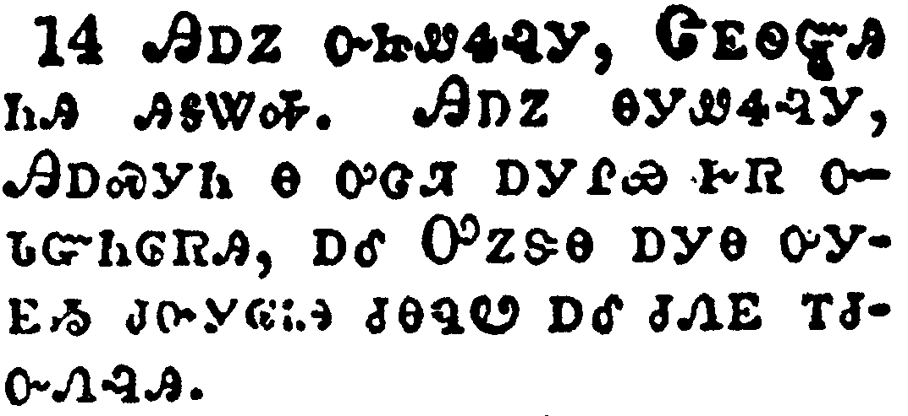</a></td>
</tr>
<tr class="even">
<td>And I said unto him, Sir, thou knowest. And he said to me, These are they which came out of great tribulation, and have washed their robes, and made them white in the blood of the Lamb.</td>
</tr>
<tr class="odd">
<td>ᎯᎠᏃ ᏅᏥᏪᏎᎸᎩ, ᏣᎬᏫᏳᎯ ᏂᎯ ᎯᎦᏔᎭ. ᎯᎠᏃ ᎾᎩᏪᏎᎸᎩ, ᎯᎠᏍᎩᏂ Ꮎ ᎤᏣᏘ ᎠᎩᎵᏯ ᎨᏒ ᏅᏓᏳᏂᎶᏒᎯ, ᎠᎴ ᎤᏃᏕᎾ ᎠᎩᎾ ᎤᎩᎬᏱ ᏧᏅᎩᎶᎥᎯ ᏧᎾᏄᏬ ᎠᎴ ᏧᏁᎬ ᎢᏧᏅᏁᎸᎯ.</td>
</tr>
<tr class="even">
<td>Hi-a-no nv-tsi-we-se-lv-gi, Tsa-gv-wi-yu-hi ni-hi hi-ga-ta-ha. Hi-a-no na-gi-we-se-lv-gi, Hi-a-s-gi-ni na u-tsa-ti a-gi-li-ya ge-sv nv-da-yu-ni-lo-sv-hi, a-le U-no-de-na a-gi-na u-gi-gv-yi tsu-nv-gi-lo-v-hi tsu-na-nu-wo a-le tsu-ne-gv i-tsu-nv-ne-lv-hi.</td>
</tr>
</tbody>
</table>

<table>
<tbody>
<tr class="odd">
<td><a href="270715.png">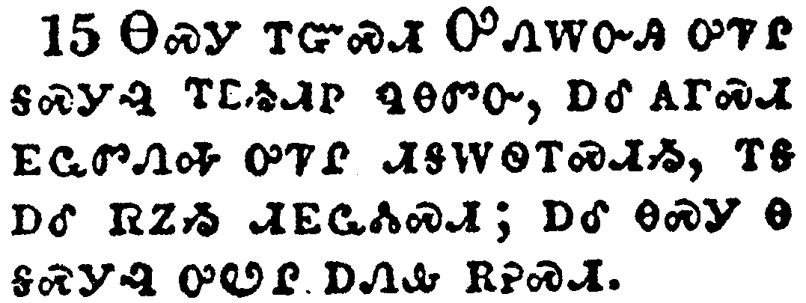</a></td>
</tr>
<tr class="even">
<td>Therefore are they before the throne of God, and serve him day and night in his temple: and he that sitteth on the throne shall dwell among them.</td>
</tr>
<tr class="odd">
<td>ᎾᏍᎩ ᎢᏳᏍᏗ ᎤᏁᎳᏅᎯ ᎤᏤᎵ ᎦᏍᎩᎸ ᎢᎬᏱᏗᏢ ᏄᎾᏛᏅ, ᎠᎴ ᎪᎱᏍᏗ ᎬᏩᏛᏁᎭ ᎤᏤᎵ ᏗᎦᎳᏫᎢᏍᏗᏱ, ᎢᎦ ᎠᎴ ᎡᏃᏱ ᏗᎬᏩᏜᏓᏍᏗ; ᎠᎴ ᎾᏍᎩ Ꮎ ᎦᏍᎩᎸ ᎤᏬᎵ ᎠᏁᎲ ᎡᎮᏍᏗ.</td>
</tr>
<tr class="even">
<td>Na-s-gi i-yu-s-di U-ne-la-nv-hi u-tse-li ga-s-gi-lv i-gv-yi-di-tlv nu-na-dv-nv, a-le go-hu-s-di gv-wa-dv-ne-ha u-tse-li di-ga-la-wi-i-s-di-yi, i-ga a-le e-no-yi di-gv-wa-dla-s-di; a-le na-s-gi na ga-s-gi-lv u-wo-li a-ne-hv e-he-s-di.</td>
</tr>
</tbody>
</table>

<table>
<tbody>
<tr class="odd">
<td><a href="270716.png">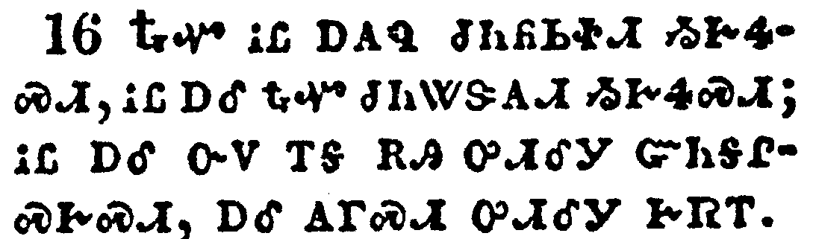</a></td>
</tr>
<tr class="even">
<td>They shall hunger no more, neither thirst any more; neither shall the sun light on them, nor any heat.</td>
</tr>
<tr class="odd">
<td>ᎿᎭᏉ ᎥᏝ ᎠᎪᏄ ᏧᏂᏲᏏᏐᏗ ᏱᎨᏎᏍᏗ, ᎥᏝ ᎠᎴ ᎿᎭᏉ ᏧᏂᏔᏕᎪᏗ ᏱᎨᏎᏍᏗ; ᎥᏝ ᎠᎴ ᏅᏙ ᎢᎦ ᎡᎯ ᎤᏗᎴᎩ ᏳᏂᎦᎵᏍᎨᏍᏗ, ᎠᎴ ᎪᎱᏍᏗ ᎤᏗᎴᎩ ᎨᏒᎢ.</td>
</tr>
<tr class="even">
<td>Hna-quo v-tla a-go-nu tsu-ni-yo-si-so-di yi-ge-se-s-di, v-tla a-le hna-quo tsu-ni-ta-de-go-di yi-ge-se-s-di; v-tla a-le nv-do i-ga e-hi u-di-le-gi yu-ni-ga-li-s-ge-s-di, a-le go-hu-s-di u-di-le-gi ge-sv-i.</td>
</tr>
</tbody>
</table>

<table>
<tbody>
<tr class="odd">
<td><a href="270717.png">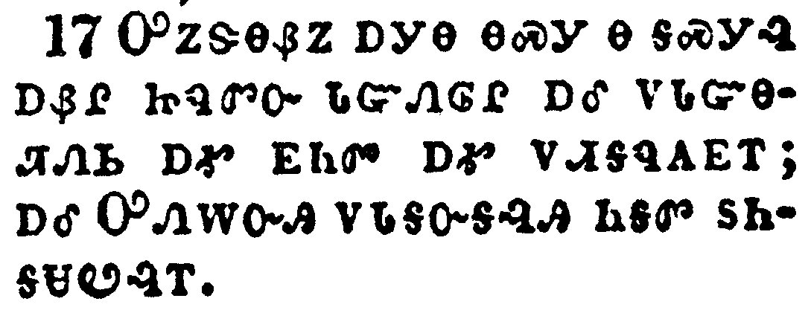</a></td>
</tr>
<tr class="even">
<td>For the Lamb which is in the midst of the throne shall feed them, and shall lead them unto living fountains of waters: and God shall wipe away all tears from their eyes.</td>
</tr>
<tr class="odd">
<td>ᎤᏃᏕᎾᏰᏃ ᎠᎩᎾ ᎾᏍᎩ Ꮎ ᎦᏍᎩᎸ ᎠᏰᎵ ᏥᏄᏛᏅ ᏓᏳᏁᎶᎵ ᎠᎴ ᏙᏓᏳᎾᏘᏁᏏ ᎠᎹ ᎬᏂᏛ ᎠᎹ ᏙᏗᎦᏄᎪᎬᎢ; ᎠᎴ ᎤᏁᎳᏅᎯ ᏙᏓᎦᏅᎦᎸᎯ ᏂᎦᏛ ᏚᏂᎦᏌᏬᎸᎢ.</td>
</tr>
<tr class="even">
<td>U-no-de-na-ye-no a-gi-na na-s-gi na ga-s-gi-lv a-ye-li tsi-nu-dv-nv da-yu-ne-lo-li a-le do-da-yu-na-ti-ne-si a-ma gv-ni-dv a-ma do-di-ga-nu-go-gv-i; a-le U-ne-la-nv-hi do-da-ga-nv-ga-lv-hi ni-ga-dv du-ni-ga-sa-wo-lv-i.</td>
</tr>
</tbody>
</table>

