+++
draft=false
date = 2014-12-18T21:11:07Z
title = "Revelation - Chapter 16 - Cherokee New Testament"
weight = 1418955067

[taxonomies]

authors = ["Timothy Legg"]
categories = []
tags = []

[extra]
+++

<table>
<tbody>
<tr class="odd">
<td><a href="271601.png">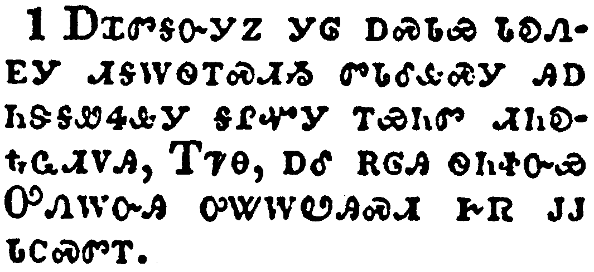</a></td>
</tr>
<tr class="even">
<td>And I heard a great voice out of the temple saying to the seven angels, Go your ways, and pour out the vials of the wrath of God upon the earth.</td>
</tr>
<tr class="odd">
<td>ᎠᏆᏛᎦᏅᎩᏃ ᎩᎶ ᎠᏍᏓᏯ ᏓᎧᏁᎬᎩ ᏗᎦᎳᏫᎢᏍᏗᏱ ᏛᏓᎴᎲᏍᎩ ᎯᎠ ᏂᏕᎦᏪᏎᎲᎩ ᎦᎵᏉᎩ ᎢᏯᏂᏛ ᏗᏂᎧᎿᎭᏩᏗᏙᎯ, ᎢᏤᎾ, ᎠᎴ ᎡᎶᎯ ᏫᏂᏐᏅᏯ ᎤᏁᎳᏅᎯ ᎤᏔᎳᏬᎯᏍᏗ ᎨᏒ ᎫᎫ ᏓᏟᏍᏛᎢ.</td>
</tr>
<tr class="even">
<td>A-qua-dv-ga-nv-gi-no gi-lo a-s-da-ya da-ka-ne-gv-gi di-ga-la-wi-i-s-di-yi dv-da-le-hv-s-gi hi-a ni-de-ga-we-se-hv-gi ga-li-quo-gi i-ya-ni-dv di-ni-ka-hna-wa-di-do-hi, I-tse-na, a-le e-lo-hi wi-ni-so-nv-ya U-ne-la-nv-hi u-ta-la-wo-hi-s-di ge-sv gu-gu da-tli-s-dv-i.</td>
</tr>
</tbody>
</table>

<table>
<tbody>
<tr class="odd">
<td><a href="271602.png">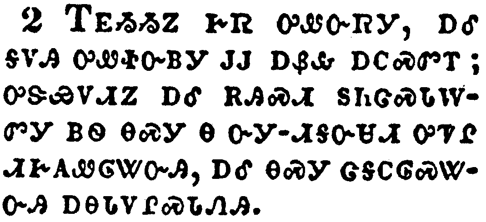</a></td>
</tr>
<tr class="even">
<td>And the first went, and poured out his vial upon the earth; and there fell a noisome and grievous sore upon the men which had the mark of the beast, and upon them which worshipped his image.</td>
</tr>
<tr class="odd">
<td>ᎢᎬᏱᏱᏃ ᎨᏒ ᎤᏪᏅᏒᎩ, ᎠᎴ ᎦᏙᎯ ᎤᏪᏐᏅᏴᎩ ᎫᎫ ᎠᏰᎲ ᎠᏟᏍᏛᎢ; ᎤᏕᏯᏙᏗᏃ ᎠᎴ ᎡᎯᏍᏗ ᏚᏂᏣᏍᏓᎳᏛᎩ ᏴᏫ ᎾᏍᎩ Ꮎ ᏅᎩ-ᏗᎦᏅᏌᏗ ᎤᏤᎵ ᏗᎨᎪᏪᎶᏔᏅᎯ, ᎠᎴ ᎾᏍᎩ ᏣᎦᏟᎶᏍᏔᏅᎯ ᎠᎾᏓᏙᎵᏍᏓᏁᎯ.</td>
</tr>
<tr class="even">
<td>I-gv-yi-yi-no ge-sv u-we-nv-sv-gi, a-le ga-do-hi u-we-so-nv-yv-gi gu-gu a-ye-hv a-tli-s-dv-i; u-de-ya-do-di-no a-le e-hi-s-di du-ni-tsa-s-da-la-dv-gi yv-wi na-s-gi na nv-gi--di-ga-nv-sa-di u-tse-li di-ge-go-we-lo-ta-nv-hi, a-le na-s-gi tsa-ga-tli-lo-s-ta-nv-hi a-na-da-do-li-s-da-ne-hi.</td>
</tr>
</tbody>
</table>

<table>
<tbody>
<tr class="odd">
<td><a href="271603.png">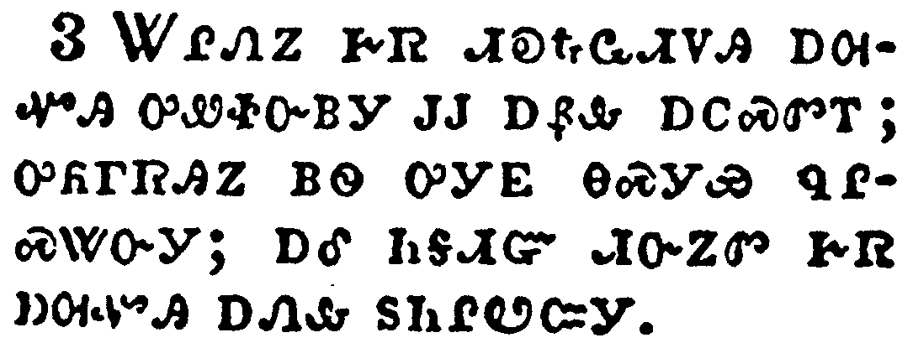</a></td>
</tr>
<tr class="even">
<td>And the second angel poured out his vial upon the sea; and it became as the blood of a dead man: and every living soul died in the sea.</td>
</tr>
<tr class="odd">
<td>ᏔᎵᏁᏃ ᎨᏒ ᏗᎧᎿᎭᏩᏗᏙᎯ ᎠᎺᏉᎯ ᎤᏪᏐᏅᏴᎩ ᎫᎫ ᎠᏰᎲ ᎠᏟᏍᏛᎢ; ᎤᏲᎱᏒᎯᏃ ᏴᏫ ᎤᎩᎬ ᎾᏍᎩᏯ ᏄᎵᏍᏔᏅᎩ; ᎠᎴ ᏂᎦᏗᏳ ᏗᏅᏃᏛ ᎨᏒ ᎠᎺᏉᎯ ᎠᏁᎲ ᏚᏂᎵᏬᏨᎩ.</td>
</tr>
<tr class="even">
<td>Ta-li-ne-no ge-sv di-ka-hna-wa-di-do-hi a-me-quo-hi u-we-so-nv-yv-gi gu-gu a-ye-hv a-tli-s-dv-i; u-yo-hu-sv-hi-no yv-wi u-gi-gv na-s-gi-ya nu-li-s-ta-nv-gi; a-le ni-ga-di-yu di-nv-no-dv ge-sv a-me-quo-hi a-ne-hv du-ni-li-wo-tsv-gi.</td>
</tr>
</tbody>
</table>

<table>
<tbody>
<tr class="odd">
<td><a href="271604.png">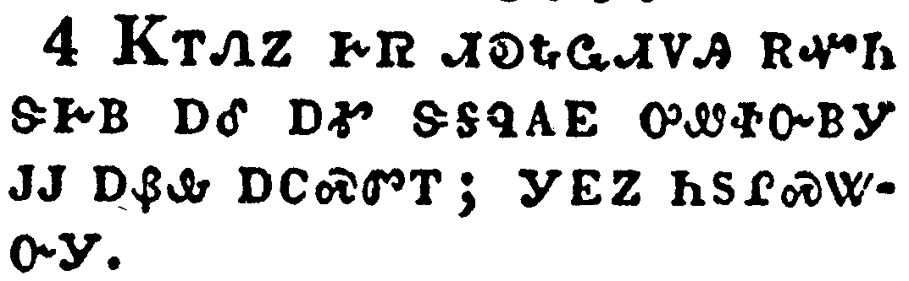</a></td>
</tr>
<tr class="even">
<td>And the third angel poured out his vial upon the rivers and fountains of waters; and they became blood.</td>
</tr>
<tr class="odd">
<td>ᏦᎢᏁᏃ ᎨᏒ ᏗᎧᎿᎭᏩᏗᏙᎯ ᎡᏉᏂ ᏕᎨᏴ ᎠᎴ ᎠᎹ ᏕᎦᏄᎪᎬ ᎤᏪᏐᏅᏴᎩ ᎫᎫ ᎠᏰᎲ ᎠᏟᏍᏛᎢ; ᎩᎬᏃ ᏂᏚᎵᏍᏔᏅᎩ.</td>
</tr>
<tr class="even">
<td>Tso-i-ne-no ge-sv di-ka-hna-wa-di-do-hi e-quo-ni de-ge-yv a-le a-ma de-ga-nu-go-gv u-we-so-nv-yv-gi gu-gu a-ye-hv a-tli-s-dv-i; gi-gv-no ni-du-li-s-ta-nv-gi.</td>
</tr>
</tbody>
</table>

<table>
<tbody>
<tr class="odd">
<td><a href="271605.png">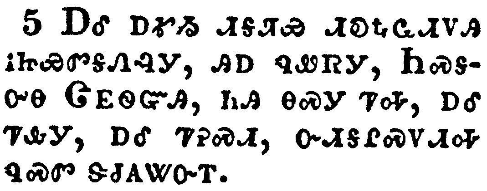</a></td>
</tr>
<tr class="even">
<td>And I heard the angel of the waters say, Thou art righteous, O Lord, which art, and wast, and shalt be, because thou hast judged thus.</td>
</tr>
<tr class="odd">
<td>ᎠᎴ ᎠᎹᏱ ᏗᎦᏘᏯ ᏗᎧᎿᎭᏩᏗᏙᎯ ᎥᏥᏯᏛᎦᏁᎸᎩ, ᎯᎠ ᏄᏪᏒᎩ, ᏂᏍᎦᎤᎾ ᏣᎬᏫᏳᎯ, ᏂᎯ ᎾᏍᎩ ᏤᎭ, ᎠᎴ ᏤᎲᎩ, ᎠᎴ ᏤᎮᏍᏗ, ᏅᏗᎦᎵᏍᏙᏗᎭ ᏄᏍᏛ ᏕᏧᎪᏔᏅᎢ.</td>
</tr>
<tr class="even">
<td>A-le a-ma-yi di-ga-ti-ya di-ka-hna-wa-di-do-hi v-tsi-ya-dv-ga-ne-lv-gi, hi-a nu-we-sv-gi, Ni-s-ga-u-na Tsa-gv-wi-yu-hi, ni-hi na-s-gi tse-ha, a-le tse-hv-gi, a-le tse-he-s-di, nv-di-ga-li-s-do-di-ha nu-s-dv de-tsu-go-ta-nv-i.</td>
</tr>
</tbody>
</table>

<table>
<tbody>
<tr class="odd">
<td><a href="271606.png">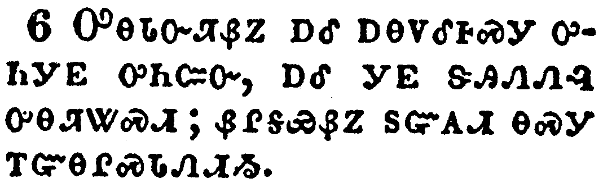</a></td>
</tr>
<tr class="even">
<td>For they have shed the blood of saints and prophets, and thou hast given them blood to drink; for they are worthy.</td>
</tr>
<tr class="odd">
<td>ᎤᎾᏓᏅᏘᏰᏃ ᎠᎴ ᎠᎾᏙᎴᎰᏍᎩ ᎤᏂᎩᎬ ᎤᏂᏨᏅ, ᎠᎴ ᎩᎬ ᏕᎯᏁᏁᎸ ᎤᎾᏘᏔᏍᏗ; ᏰᎵᎦᏯᏰᏃ ᏚᏳᎪᏗ ᎾᏍᎩ ᎢᏳᎾᎵᏍᏓᏁᏗᏱ.</td>
</tr>
<tr class="even">
<td>U-na-da-nv-ti-ye-no a-le a-na-do-le-ho-s-gi u-ni-gi-gv u-ni-tsv-nv, a-le gi-gv de-hi-ne-ne-lv u-na-ti-ta-s-di; ye-li-ga-ya-ye-no du-yu-go-di na-s-gi i-yu-na-li-s-da-ne-di-yi.</td>
</tr>
</tbody>
</table>

<table>
<tbody>
<tr class="odd">
<td><a href="271607.png">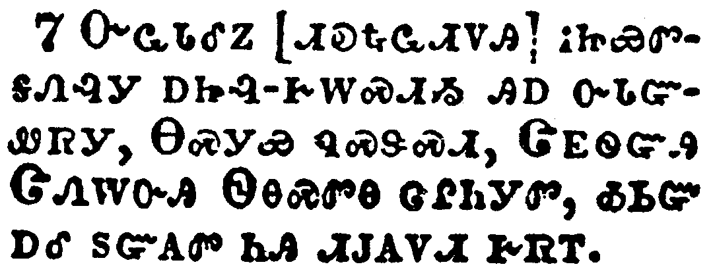</a></td>
</tr>
<tr class="even">
<td>And I heard another out of the altar say, Even so, Lord God Almighty, true and righteous are thy judgments.</td>
</tr>
<tr class="odd">
<td>ᏅᏩᏓᎴᏃ [ᏗᎧᎿᎭᏩᏗᏙᎯ] ᎥᏥᏯᏛᎦᏁᎸᎩ ᎠᏥᎸ-ᎨᎳᏍᏗᏱ ᎯᎠ ᏅᏓᏳᏪᏒᎩ, ᎾᏍᎩᏯ ᏄᏍᏕᏍᏗ, ᏣᎬᏫᏳᎯ ᏣᏁᎳᏅᎯ ᏫᎾᏍᏛᎾ ᏣᎵᏂᎩᏛ, ᎣᏏᏳ ᎠᎴ ᏚᏳᎪᏛ ᏂᎯ ᏗᎫᎪᏙᏗ ᎨᏒᎢ.</td>
</tr>
<tr class="even">
<td>Nv-wa-da-le-no [di-ka-hna-wa-di-do-hi] v-tsi-ya-dv-ga-ne-lv-gi a-tsi-lv--ge-la-s-di-yi hi-a nv-da-yu-we-sv-gi, Na-s-gi-ya nu-s-de-s-di, Tsa-gv-wi-yu-hi Tsa-ne-la-nv-hi Wi-na-s-dv-na tsa-li-ni-gi-dv, o-si-yu a-le du-yu-go-dv ni-hi di-gu-go-do-di ge-sv-i.</td>
</tr>
</tbody>
</table>

<table>
<tbody>
<tr class="odd">
<td><a href="271608.png">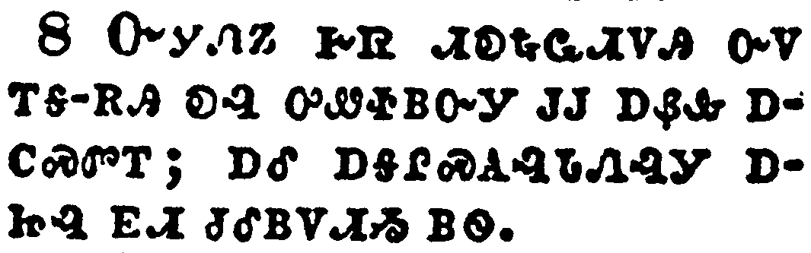</a></td>
</tr>
<tr class="even">
<td>And the fourth angel poured out his vial upon the sun; and power was given unto him to scorch men with fire.</td>
</tr>
<tr class="odd">
<td>ᏅᎩᏁᏃ ᎨᏒ ᏗᎧᎿᎭᏩᏗᏙᎯ ᏅᏙ ᎢᎦ-ᎡᎯ ᎧᎸ ᎤᏪᏐᏴᏅᎩ ᎫᎫ ᎠᏰᎲ ᎠᏟᏍᏛᎢ; ᎠᎴ ᎠᎦᎵᏍᎪᎸᏓᏁᎸᎩ ᎠᏥᎸ ᎬᏗ ᏧᎴᏴᏙᏗᏱ ᏴᏫ.</td>
</tr>
<tr class="even">
<td>Nv-gi-ne-no ge-sv di-ka-hna-wa-di-do-hi nv-do i-ga--e-hi ka-lv u-we-so-yv-nv-gi gu-gu a-ye-hv a-tli-s-dv-i; a-le a-ga-li-s-go-lv-da-ne-lv-gi a-tsi-lv gv-di tsu-le-yv-do-di-yi yv-wi.</td>
</tr>
</tbody>
</table>

<table>
<tbody>
<tr class="odd">
<td><a href="271609.png">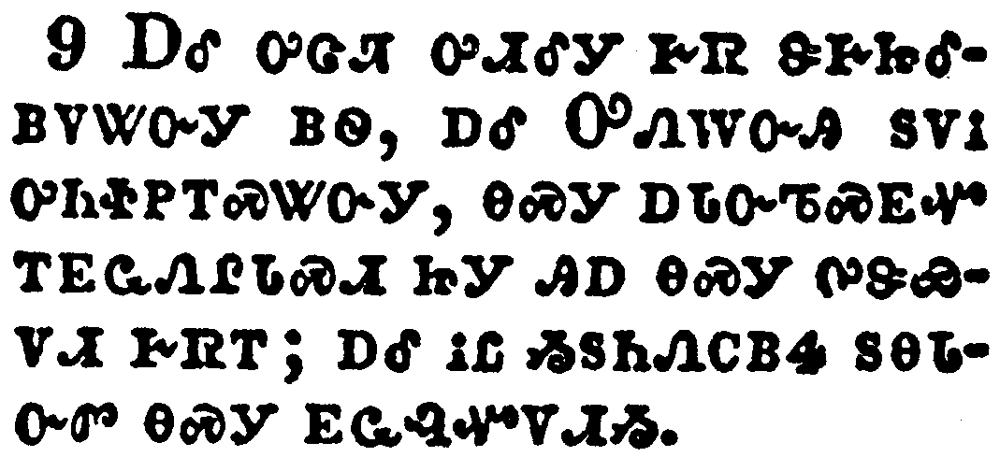</a></td>
</tr>
<tr class="even">
<td>And men were scorched with great heat, and blasphemed the name of God, which hath power over these plagues: and they repented not to give him glory.</td>
</tr>
<tr class="odd">
<td>ᎠᎴ ᎤᏣᏘ ᎤᏗᎴᎩ ᎨᏒ ᏕᎨᏥᎴᏴᏙᏔᏅᎩ ᏴᏫ, ᎠᎴ ᎤᏁᎳᏅᎯ ᏚᏙᎥ ᎤᏂᏐᏢᎢᏍᏔᏅᎩ, ᎾᏍᎩ ᎠᏓᏅᏖᏍᎬᏉ ᎢᎬᏩᏁᎵᏓᏍᏗ ᏥᎩ ᎯᎠ ᎾᏍᎩ ᎤᏕᏯᏙᏗ ᎨᏒᎢ; ᎠᎴ ᎥᏝ ᏱᏚᏂᏁᏟᏴᏎ ᏚᎾᏓᏅᏛ ᎾᏍᎩ ᎬᏩᎸᏉᏙᏗᏱ.</td>
</tr>
<tr class="even">
<td>A-le u-tsa-ti u-di-le-gi ge-sv de-ge-tsi-le-yv-do-ta-nv-gi yv-wi, a-le U-ne-la-nv-hi du-do-v u-ni-so-tlv-i-s-ta-nv-gi, na-s-gi a-da-nv-te-s-gv-quo i-gv-wa-ne-li-da-s-di tsi-gi hi-a na-s-gi u-de-ya-do-di ge-sv-i; a-le v-tla yi-du-ni-ne-tli-yv-se du-na-da-nv-dv na-s-gi gv-wa-lv-quo-do-di-yi.</td>
</tr>
</tbody>
</table>

<table>
<tbody>
<tr class="odd">
<td><a href="271610.png">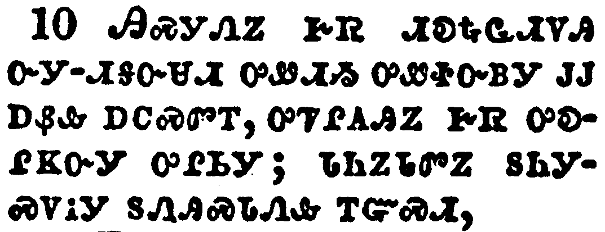</a></td>
</tr>
<tr class="even">
<td>And the fifth angel poured out his vial upon the seat of the beast; and his kingdom was full of darkness; and they gnawed their tongues for pain,</td>
</tr>
<tr class="odd">
<td>ᎯᏍᎩᏁᏃ ᎨᏒ ᏗᎧᎿᎭᏩᏗᏙᎯ ᏅᎩ-ᏗᎦᏅᏌᏗ ᎤᏪᏗᏱ ᎤᏪᏐᏅᏴᎩ ᎫᎫ ᎠᏰᎲ ᎠᏟᏍᏛᎢ, ᎤᏥᎵᎪᎯᏃ ᎨᏒ ᎤᎧᎵᏦᏅᎩ ᎤᎵᏏᎩ; ᏓᏂᏃᏓᏛᏃ ᏚᏂᎩᏍᏙᎥᎩ ᏚᏁᎯᏍᏓᏁᎲ ᎢᏳᏍᏗ,</td>
</tr>
<tr class="even">
<td>Hi-s-gi-ne-no ge-sv di-ka-hna-wa-di-do-hi nv-gi--di-ga-nv-sa-di u-we-di-yi u-we-so-nv-yv-gi gu-gu a-ye-hv a-tli-s-dv-i, u-tsi-li-go-hi-no ge-sv u-ka-li-tso-nv-gi u-li-si-gi; da-ni-no-da-dv-no du-ni-gi-s-do-v-gi du-ne-hi-s-da-ne-hv i-yu-s-di,</td>
</tr>
</tbody>
</table>

<table>
<tbody>
<tr class="odd">
<td><a href="271611.png">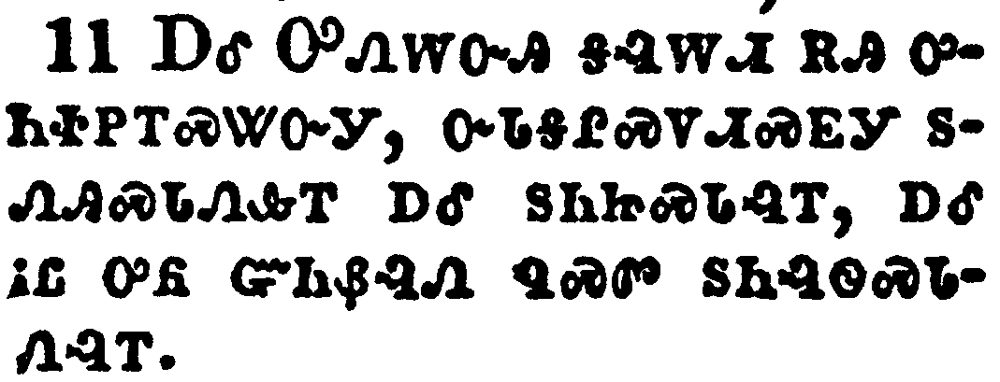</a></td>
</tr>
<tr class="even">
<td>And blasphemed the God of heaven because of their pains and their sores, and repented not of their deeds.</td>
</tr>
<tr class="odd">
<td>ᎠᎴ ᎤᏁᎳᏅᎯ ᎦᎸᎳᏗ ᎡᎯ ᎤᏂᏐᏢᎢᏍᏔᏅᎩ, ᏅᏓᎦᎵᏍᏙᏗᏍᎬᎩ ᏚᏁᎯᏍᏓᏁᎲᎢ ᎠᎴ ᏚᏂᏥᏍᏓᎸᎢ, ᎠᎴ ᎥᏝ ᎤᏲ ᏳᏂᏰᎸᏁ ᏄᏍᏛ ᏚᏂᎸᏫᏍᏓᏁᎸᎢ.</td>
</tr>
<tr class="even">
<td>A-le U-ne-la-nv-hi ga-lv-la-di e-hi u-ni-so-tlv-i-s-ta-nv-gi, nv-da-ga-li-s-do-di-s-gv-gi du-ne-hi-s-da-ne-hv-i a-le du-ni-tsi-s-da-lv-i, a-le v-tla u-yo yu-ni-ye-lv-ne nu-s-dv du-ni-lv-wi-s-da-ne-lv-i.</td>
</tr>
</tbody>
</table>

<table>
<tbody>
<tr class="odd">
<td><a href="271612.png">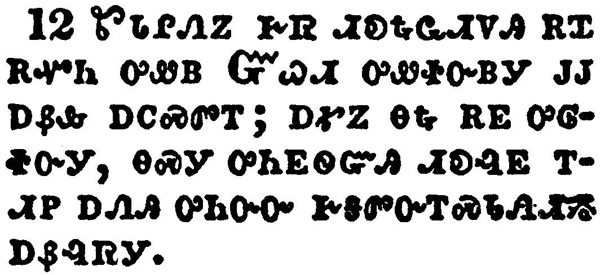</a></td>
</tr>
<tr class="even">
<td>And the sixth angel poured out his vial upon the great river Euphrates; and the water thereof was dried up, that the way of the kings of the east might be prepared.</td>
</tr>
<tr class="odd">
<td>ᏑᏓᎵᏁᏃ ᎨᏒ ᏗᎧᎿᎭᏩᏗᏙᎯ ᎡᏆ ᎡᏉᏂ ᎤᏪᏴ ᏳᏇᏗ ᎤᏪᏐᏅᏴᎩ ᎫᎫ ᎠᏰᎲ ᎠᏟᏍᏛᎢ; ᎠᎹᏃ ᎾᎿᎭᎡᎬ ᎤᎶᏐᏅᎩ, ᎾᏍᎩ ᎤᏂᎬᏫᏳᎯ ᏗᎧᎸᎬ ᎢᏗᏢ ᎠᏁᎯ ᎤᏂᏅᏅ ᎨᎦᏛᏅᎢᏍᏓᏁᏗᏱ ᎠᏰᎸᏒᎩ.</td>
</tr>
<tr class="even">
<td>Su-da-li-ne-no ge-sv di-ka-hna-wa-di-do-hi e-qua e-quo-ni u-we-yv Yu-que-di u-we-so-nv-yv-gi gu-gu a-ye-hv a-tli-s-dv-i; a-ma-no na-hna e-gv u-lo-so-nv-gi, na-s-gi u-ni-gv-wi-yu-hi di-ka-lv-gv i-di-tlv a-ne-hi u-ni-nv-nv ge-ga-dv-nv-i-s-da-ne-di-yi a-ye-lv-sv-gi.</td>
</tr>
</tbody>
</table>

<table>
<tbody>
<tr class="odd">
<td><a href="271613.png">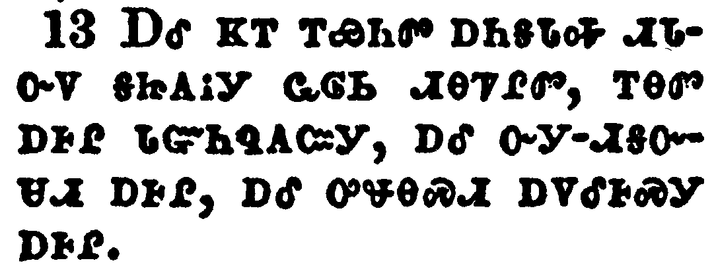</a></td>
</tr>
<tr class="even">
<td>And I saw three unclean spirits like frogs come out of the mouth of the dragon, and out of the mouth of the beast, and out of the mouth of the false prophet.</td>
</tr>
<tr class="odd">
<td>ᎠᎴ ᏦᎢ ᎢᏯᏂᏛ ᎠᏂᎦᏓᎭ ᏗᏓᏅᏙ ᎦᏥᎪᎥᎩ ᏩᎶᏏ ᏗᎾᏤᎵᏛ, ᎢᎾᏛ ᎠᎰᎵ ᏓᏳᏂᏄᎪᏨᎩ, ᎠᎴ ᏅᎩ-ᏗᎦᏅᏌᏗ ᎠᎰᎵ, ᎠᎴ ᎤᏠᎾᏍᏗ ᎠᏙᎴᎰᏍᎩ ᎠᎰᎵ.</td>
</tr>
<tr class="even">
<td>A-le tso-i i-ya-ni-dv a-ni-ga-da-ha di-da-nv-do ga-tsi-go-v-gi wa-lo-si di-na-tse-li-dv, i-na-dv a-ho-li da-yu-ni-nu-go-tsv-gi, a-le nv-gi--di-ga-nv-sa-di a-ho-li, a-le u-tlo-na-s-di a-do-le-ho-s-gi a-ho-li.</td>
</tr>
</tbody>
</table>

<table>
<tbody>
<tr class="odd">
<td><a href="271614.png">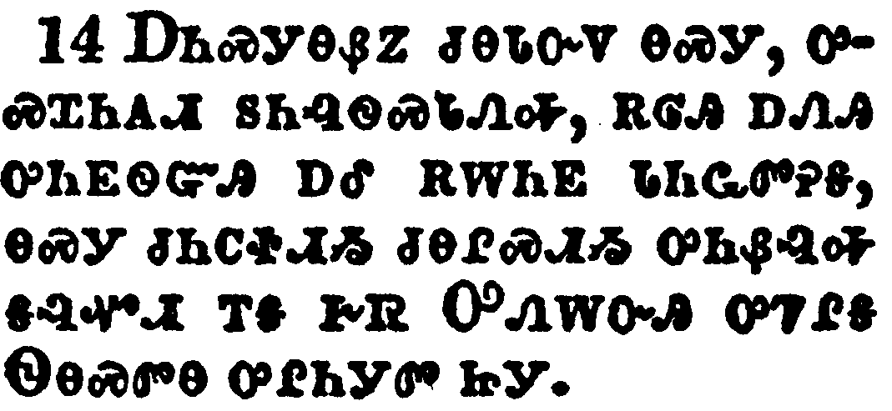</a></td>
</tr>
<tr class="even">
<td>For they are the spirits of devils, working miracles, which go forth unto the kings of the earth and of the whole world, to gather them to the battle of that great day of God Almighty.</td>
</tr>
<tr class="odd">
<td>ᎠᏂᏍᎩᎾᏰᏃ ᏧᎾᏓᏅᏙ ᎾᏍᎩ, ᎤᏍᏆᏂᎪᏗ ᏚᏂᎸᏫᏍᏓᏁᎭ, ᎡᎶᎯ ᎠᏁᎯ ᎤᏂᎬᏫᏳᎯ ᎠᎴ ᎡᎳᏂᎬ ᏓᏂᏩᏛᎮᎦ, ᎾᏍᎩ ᏧᏂᏟᏐᏗᏱ ᏧᎾᎵᏍᏗᏱ ᎤᏂᏰᎸᎭ ᎦᎸᏉᏗ ᎢᎦ ᎨᏒ ᎤᏁᎳᏅᎯ ᎤᏤᎵᎦ ᏫᎾᏍᏛᎾ ᎤᎵᏂᎩᏛ ᏥᎩ.</td>
</tr>
<tr class="even">
<td>A-ni-s-gi-na-ye-no tsu-na-da-nv-do na-s-gi, u-s-qua-ni-go-di du-ni-lv-wi-s-da-ne-ha, e-lo-hi a-ne-hi u-ni-gv-wi-yu-hi a-le e-la-ni-gv da-ni-wa-dv-he-ga, na-s-gi tsu-ni-tli-so-di-yi tsu-na-li-s-di-yi u-ni-ye-lv-ha ga-lv-quo-di i-ga ge-sv U-ne-la-nv-hi u-tse-li-ga Wi-na-s-dv-na u-li-ni-gi-dv tsi-gi.</td>
</tr>
</tbody>
</table>

<table>
<tbody>
<tr class="odd">
<td><a href="271615.png">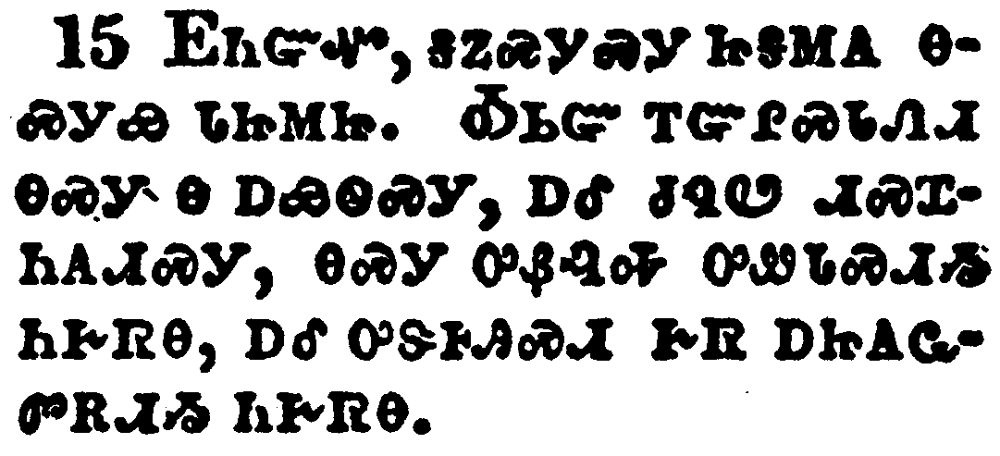</a></td>
</tr>
<tr class="even">
<td>Behold, I come as a thief. Blessed is he that watcheth, and keepeth his garments, lest he walk naked, and they see his shame.</td>
</tr>
<tr class="odd">
<td>ᎬᏂᏳᏉ, ᎦᏃᏍᎩᏍᎩ ᏥᎦᎷᎪ ᎾᏍᎩᏯ ᏓᏥᎷᏥ. ᎣᏏᏳ ᎢᏳᎵᏍᏓᏁᏗ ᎾᏍᎩ Ꮎ ᎠᏯᏫᏍᎩ, ᎠᎴ ᏧᏄᏬ ᏗᏍᏆᏂᎪᏗᏍᎩ, ᎾᏍᎩ ᎤᏰᎸᎭ ᎤᏪᏓᏍᏗᏱ ᏂᎨᏒᎾ, ᎠᎴ ᎤᏕᎰᎯᏍᏗ ᎨᏒ ᎠᏥᎪᏩᏛᎡᏗᏱ ᏂᎨᏒᎾ.</td>
</tr>
<tr class="even">
<td>Gv-ni-yu-quo, ga-no-s-gi-s-gi tsi-ga-lu-go na-s-gi-ya da-tsi-lu-tsi. O-si-yu i-yu-li-s-da-ne-di na-s-gi na a-ya-wi-s-gi, a-le tsu-nu-wo di-s-qua-ni-go-di-s-gi, na-s-gi u-ye-lv-ha u-we-da-s-di-yi ni-ge-sv-na, a-le u-de-ho-hi-s-di ge-sv a-tsi-go-wa-dv-e-di-yi ni-ge-sv-na.</td>
</tr>
</tbody>
</table>

<table>
<tbody>
<tr class="odd">
<td><a href="271616.png">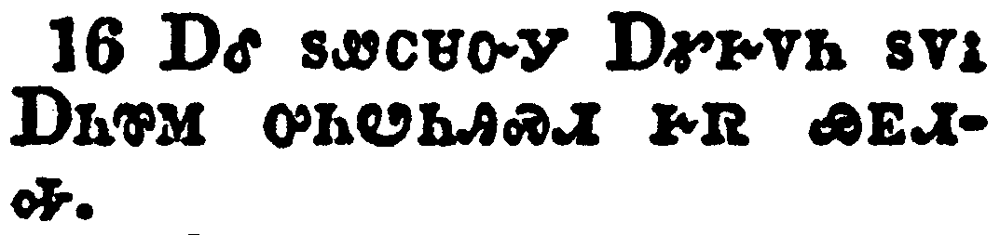</a></td>
</tr>
<tr class="even">
<td>And he gathered them together into a place called in the Hebrew tongue Armageddon.</td>
</tr>
<tr class="odd">
<td>ᎠᎴ ᏚᏪᏟᏌᏅᎩ ᎠᎹᎨᏙᏂ ᏚᏙᎥ ᎠᏂᏈᎷ ᎤᏂᏬᏂᎯᏍᏗ ᎨᏒ ᏯᎬᏗᎭ.</td>
</tr>
<tr class="even">
<td>A-le du-we-tli-sa-nv-gi A-ma-ge-do-ni du-do-v A-ni-qui-lu u-ni-wo-ni-hi-s-di ge-sv ya-gv-di-ha.</td>
</tr>
</tbody>
</table>

<table>
<tbody>
<tr class="odd">
<td><a href="271617.png">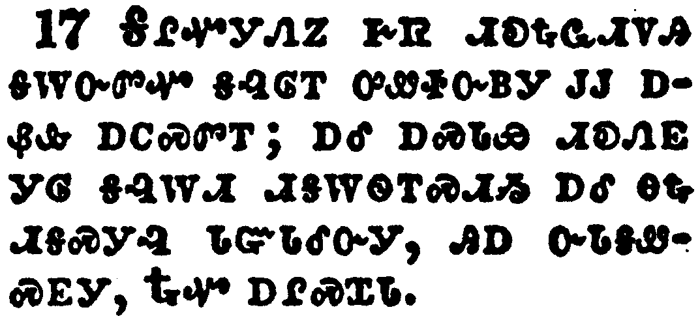</a></td>
</tr>
<tr class="even">
<td>And the seventh angel poured out his vial into the air; and there came a great voice out of the temple of heaven, from the throne, saying, It is done.</td>
</tr>
<tr class="odd">
<td>ᎦᎵᏉᎩᏁᏃ ᎨᏒ ᏗᎧᎿᎭᏩᏗᏙᎯ ᎦᎳᏅᏛᏉ ᎦᎸᎶᎢ ᎤᏪᏐᏅᏴᎩ ᎫᎫ ᎠᏰᎲ ᎠᏟᏍᏛᎢ; ᎠᎴ ᎠᏍᏓᏯ ᏗᎧᏁᎬ ᎩᎶ ᎦᎸᎳᏗ ᏗᎦᎳᏫᎢᏍᏗᏱ ᎠᎴ ᎾᎿᎭᏗᎦᏍᎩᎸ ᏓᏳᏓᎴᏅᎩ, ᎯᎠ ᏅᏓᎦᏪᏍᎬᎩ, ᎿᎭᏉ ᎠᎵᏍᏆᏓ.</td>
</tr>
<tr class="even">
<td>Ga-li-quo-gi-ne-no ge-sv di-ka-hna-wa-di-do-hi ga-la-nv-dv-quo ga-lv-lo-i u-we-so-nv-yv-gi gu-gu a-ye-hv a-tli-s-dv-i; a-le a-s-da-ya di-ka-ne-gv gi-lo ga-lv-la-di di-ga-la-wi-i-s-di-yi a-le na-hna di-ga-s-gi-lv da-yu-da-le-nv-gi, hi-a nv-da-ga-we-s-gv-gi, Hna-quo a-li-s-qua-da.</td>
</tr>
</tbody>
</table>

<table>
<tbody>
<tr class="odd">
<td><a href="271618.png">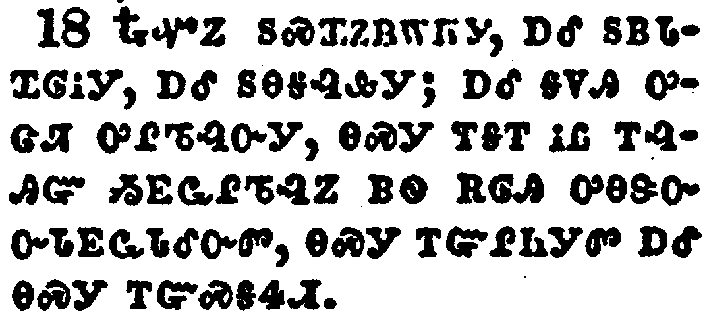</a></td>
</tr>
<tr class="even">
<td>And there were voices, and thunders, and lightnings; and there was a great earthquake, such as was not since men were upon the earth, so mighty an earthquake, and so great.</td>
</tr>
<tr class="odd">
<td>ᎿᎭᏉᏃ ᏚᏍᏆᏃᏴᎳᏒᎩ, ᎠᎴ ᏚᏴᏓᏉᎶᎥᎩ, ᎠᎴ ᏚᎾᎦᎸᎲᎩ; ᎠᎴ ᎦᏙᎯ ᎤᏣᏘ ᎤᎵᏖᎸᏅᎩ, ᎾᏍᎩ ᎢᎦᎢ ᎥᏝ ᎢᎸᎯᏳ ᏱᎬᏩᎵᏖᎸᏃ ᏴᏫ ᎡᎶᎯ ᎤᎾᏕᏅ ᏅᏓᎬᏩᏓᎴᏅᏛ, ᎾᏍᎩ ᎢᏳᎵᏂᎩᏛ ᎠᎴ ᎾᏍᎩ ᎢᏳᏍᎦᏎᏗ.</td>
</tr>
<tr class="even">
<td>Hna-quo-no du-s-qua-no-yv-la-sv-gi, a-le du-yv-da-quo-lo-v-gi, a-le du-na-ga-lv-hv-gi; a-le ga-do-hi u-tsa-ti u-li-te-lv-nv-gi, na-s-gi i-ga-i v-tla i-lv-hi-yu yi-gv-wa-li-te-lv-no yv-wi e-lo-hi u-na-de-nv nv-da-gv-wa-da-le-nv-dv, na-s-gi i-yu-li-ni-gi-dv a-le na-s-gi i-yu-s-ga-se-di.</td>
</tr>
</tbody>
</table>

<table>
<tbody>
<tr class="odd">
<td><a href="271619.png">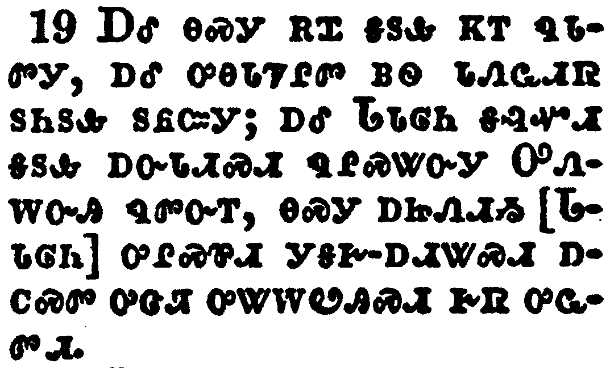</a></td>
</tr>
<tr class="even">
<td>And the great city was divided into three parts, and the cities of the nations fell: and great Babylon came in remembrance before God, to give unto her the cup of the wine of the fierceness of his wrath.</td>
</tr>
<tr class="odd">
<td>ᎠᎴ ᎾᏍᎩ ᎡᏆ ᎦᏚᎲ ᏦᎢ ᏄᏓᏛᎩ, ᎠᎴ ᎤᎾᏓᏤᎵᏛ ᏴᏫ ᏓᏁᏩᏗᏒ ᏚᏂᏚᎲ ᏚᏲᏨᎩ; ᎠᎴ ᏓᏓᎶᏂ ᎦᎸᏉᏗ ᎦᏚᎲ ᎠᏅᏓᏗᏍᏗ ᏄᎵᏍᏔᏅᎩ ᎤᏁᎳᏅᎯ ᏄᏛᏅᎢ, ᎾᏍᎩ ᎠᏥᏁᏗᏱ [ᏓᏓᎶᏂ] ᎤᎵᏍᏈᏗ ᎩᎦᎨ-ᎠᏗᏔᏍᏗ ᎠᏟᏍᏛ ᎤᏣᏘ ᎤᏔᎳᏬᎯᏍᏗ ᎨᏒ ᎤᏩᏛᏗ.</td>
</tr>
<tr class="even">
<td>A-le na-s-gi e-qua ga-du-hv tso-i nu-da-dv-gi, a-le u-na-da-tse-li-dv yv-wi da-ne-wa-di-sv du-ni-du-hv du-yo-tsv-gi; a-le Da-da-lo-ni ga-lv-quo-di ga-du-hv a-nv-da-di-s-di nu-li-s-ta-nv-gi U-ne-la-nv-hi nu-dv-nv-i, na-s-gi a-tsi-ne-di-yi [Da-da-lo-ni] u-li-s-qui-di gi-ga-ge--a-di-ta-s-di a-tli-s-dv u-tsa-ti u-ta-la-wo-hi-s-di ge-sv u-wa-dv-di.</td>
</tr>
</tbody>
</table>

<table>
<tbody>
<tr class="odd">
<td><a href="271620.png">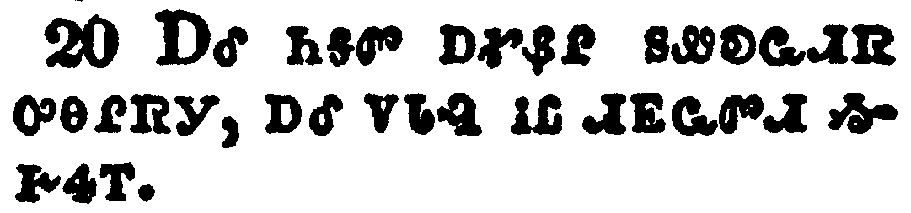</a></td>
</tr>
<tr class="even">
<td>And every island fled away, and the mountains were not found.</td>
</tr>
<tr class="odd">
<td>ᎠᎴ ᏂᎦᏛ ᎠᎹᏰᎵ ᏚᏪᎧᏩᏗᏒ ᎤᎾᎵᏒᎩ, ᎠᎴ ᏙᏓᎸ ᎥᏝ ᏗᎬᏩᏛᏗ ᏱᎨᏎᎢ.</td>
</tr>
<tr class="even">
<td>A-le ni-ga-dv a-ma-ye-li du-we-ka-wa-di-sv u-na-li-sv-gi, a-le do-da-lv v-tla di-gv-wa-dv-di yi-ge-se-i.</td>
</tr>
</tbody>
</table>

<table>
<tbody>
<tr class="odd">
<td><a href="271621.png">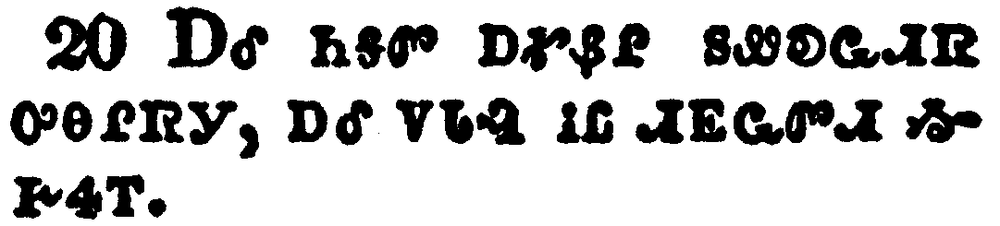</a></td>
</tr>
<tr class="even">
<td>And there fell upon men a great hail out of heaven, every stone about the weight of a talent: and men blasphemed God because of the plague of the hail; for the plague thereof was exceeding great.</td>
</tr>
<tr class="odd">
<td>ᎡᏆᏃ ᎤᏁᏐᎠᏒᎩ ᏴᏫ ᎠᏁᎲ ᎦᎸᎳᏗ ᏅᏓᏳᏓᎴᏅᎯ, ᏌᏉᎭ ᎨᏒ ᏔᎸᏗ ᏄᏓᎨᏒ ᏄᏓᎨᏒᎩ; ᏴᏫᏃ ᎤᏁᎳᏅᎯ ᎤᏂᏐᏢᎢᏍᏔᏅᎩ ᏅᏓᎦᎵᏍᏙᏗᏍᎬᎩ ᎤᏁᏍᏓᎳ ᎤᎾᏕᏯᏙᏗᏍᎬᎢ; ᎤᏣᏘᏰᏃ ᎤᎾᏕᏯᏙᏗᏍᎬᎩ ᎾᏍᎩ.</td>
</tr>
<tr class="even">
<td>e-qua-no u-ne-so-a-sv-gi yv-wi a-ne-hv ga-lv-la-di nv-da-yu-da-le-nv-hi, sa-quo-ha ge-sv ta-lv-di nu-da-ge-sv nu-da-ge-sv-gi; yv-wi-no u-ne-la-nv-hi u-ni-so-tlv-i-s-ta-nv-gi nv-da-ga-li-s-do-di-s-gv-gi u-ne-s-da-la u-na-de-ya-do-di-s-gv-i; u-tsa-ti-ye-no u-na-de-ya-do-di-s-gv-gi na-s-gi.</td>
</tr>
</tbody>
</table>

