+++
draft=false
date = 2014-12-18T21:11:07Z
title = "Revelation - Chapter 19 - Cherokee New Testament"
weight = 1418955067

[taxonomies]

authors = ["Timothy Legg"]
categories = []
tags = []

[extra]
+++

<table>
<tbody>
<tr class="odd">
<td><a href="271901.png">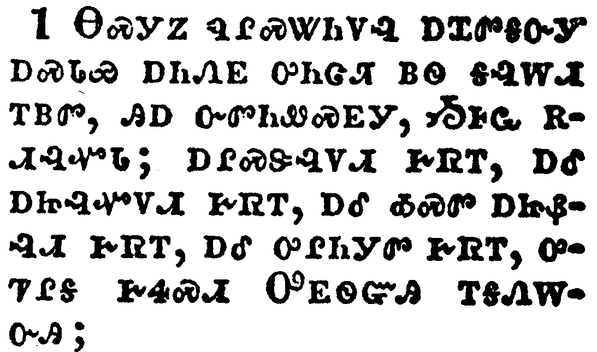</a></td>
</tr>
<tr class="even">
<td>And after these things I heard a great voice of much people in heaven, saying, Alleluia; Salvation, and glory, and honour, and power, unto the Lord our God:</td>
</tr>
<tr class="odd">
<td>ᎾᏍᎩᏃ ᏄᎵᏍᏔᏂᏙᎸ ᎠᏆᏛᎦᏅᎩ ᎠᏍᏓᏯ ᎠᏂᏁᎬ ᎤᏂᏣᏘ ᏴᏫ ᎦᎸᎳᏗ ᎢᏴᏛ, ᎯᎠ ᏅᏛᏂᏪᏍᎬᎩ, ᏱᎰᏩ ᎡᏗᎸᏉᏓ; ᎠᎵᏍᏕᎸᏙᏗ ᎨᏒᎢ, ᎠᎴ ᎠᏥᎸᏉᏙᏗ ᎨᏒᎢ, ᎠᎴ ᎣᏍᏛ ᎠᏥᏰᎸᏗ ᎨᏒᎢ, ᎠᎴ ᎤᎵᏂᎩᏛ ᎨᏒᎢ, ᎤᏤᎵᎦ ᎨᏎᏍᏗ ᎤᎬᏫᏳᎯ ᎢᎦᏁᎳᏅᎯ;</td>
</tr>
<tr class="even">
<td>Na-s-gi-no nu-li-s-ta-ni-do-lv a-qua-dv-ga-nv-gi a-s-da-ya a-ni-ne-gv u-ni-tsa-ti yv-wi ga-lv-la-di i-yv-dv, hi-a nv-dv-ni-we-s-gv-gi, Yi-ho-wa e-di-lv-quo-da; a-li-s-de-lv-do-di ge-sv-i, a-le a-tsi-lv-quo-do-di ge-sv-i, a-le o-s-dv a-tsi-ye-lv-di ge-sv-i, a-le u-li-ni-gi-dv ge-sv-i, u-tse-li-ga ge-se-s-di U-gv-wi-yu-hi i-ga-ne-la-nv-hi;</td>
</tr>
</tbody>
</table>

<table>
<tbody>
<tr class="odd">
<td><a href="271902.png">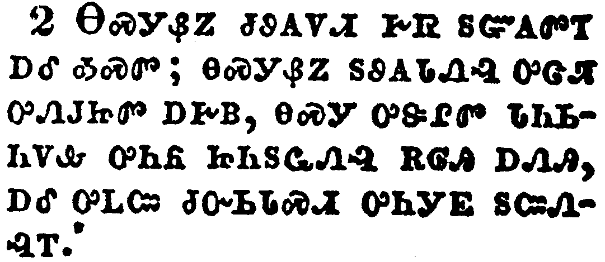</a></td>
</tr>
<tr class="even">
<td>For true and righteous are his judgments: for he hath judged the great whore, which did corrupt the earth with her fornication, and hath avenged the blood of his servants at her hand.</td>
</tr>
<tr class="odd">
<td>ᎾᏍᎩᏰᏃ ᏧᏭᎪᏙᏗ ᎨᏒ ᏚᏳᎪᏛᎢ ᎠᎴ ᎣᏍᏛ; ᎾᏍᎩᏰᏃ ᏚᏭᎪᏓᏁᎸ ᎤᏣᏘ ᎤᏁᎫᏥᏛ ᎠᎨᏴ, ᎾᏍᎩ ᎤᏕᎵᏛ ᏓᏂᏏᏂᏙᎲ ᎤᏂᏲ ᏥᏂᏚᏩᏁᎸ ᎡᎶᎯ ᎠᏁᎯ, ᎠᎴ ᎤᏞᏨ ᏧᏅᏏᏓᏍᏗ ᎤᏂᎩᎬ ᏚᏨᏁᎸᎢ.</td>
</tr>
<tr class="even">
<td>Na-s-gi-ye-no tsu-wu-go-do-di ge-sv du-yu-go-dv-i a-le o-s-dv; na-s-gi-ye-no du-wu-go-da-ne-lv u-tsa-ti u-ne-gu-tsi-dv a-ge-yv, na-s-gi u-de-li-dv da-ni-si-ni-do-hv u-ni-yo tsi-ni-du-wa-ne-lv e-lo-hi a-ne-hi, a-le u-tle-tsv tsu-nv-si-da-s-di u-ni-gi-gv du-tsv-ne-lv-i.</td>
</tr>
</tbody>
</table>

<table>
<tbody>
<tr class="odd">
<td><a href="271903.png">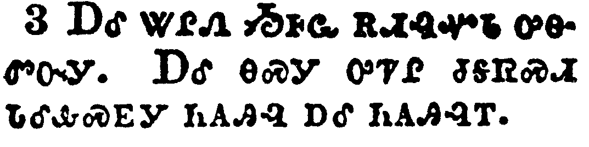</a></td>
</tr>
<tr class="even">
<td>And again they said, Alleluia. And her smoke rose up for ever and ever.</td>
</tr>
<tr class="odd">
<td>ᎠᎴ ᏔᎵᏁ ᏱᎰᏩ ᎡᏗᎸᏉᏓ ᎤᎾᏛᏅᎩ. ᎠᎴ ᎾᏍᎩ ᎤᏤᎵ ᏧᎦᏒᏍᏗ ᏓᎴᎲᏍᎬᎩ ᏂᎪᎯᎸ ᎠᎴ ᏂᎪᎯᎸᎢ.</td>
</tr>
<tr class="even">
<td>A-le ta-li-ne Yi-ho-wa e-di-lv-quo-da u-na-dv-nv-gi. A-le na-s-gi u-tse-li tsu-ga-sv-s-di da-le-hv-s-gv-gi ni-go-hi-lv a-le ni-go-hi-lv-i.</td>
</tr>
</tbody>
</table>

<table>
<tbody>
<tr class="odd">
<td><a href="271904.png">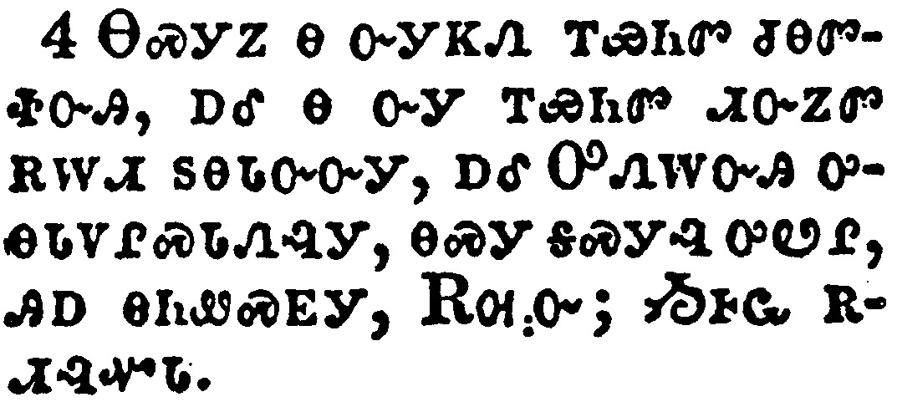</a></td>
</tr>
<tr class="even">
<td>And the four and twenty elders and the four beasts fell down and worshipped God that sat on the throne, saying, Amen; Alleluia.</td>
</tr>
<tr class="odd">
<td>ᎾᏍᎩᏃ Ꮎ ᏅᎩᏦᏁ ᎢᏯᏂᏛ ᏧᎾᏛᏐᏅᎯ, ᎠᎴ Ꮎ ᏅᎩ ᎢᏯᏂᏛ ᏗᏅᏃᏛ ᎡᎳᏗ ᏚᎾᏓᏅᏅᎩ, ᎠᎴ ᎤᏁᎳᏅᎯ ᎤᎾᏓᏙᎵᏍᏓᏁᎸᎩ, ᎾᏍᎩ ᎦᏍᎩᎸ ᎤᏪᎵ, ᎯᎠ ᎾᏂᏪᏍᎬᎩ, ᎡᎺᏅ; ᏱᎰᏩ ᎡᏗᎸᏉᏓ.</td>
</tr>
<tr class="even">
<td>Na-s-gi-no na nv-gi-tso-ne i-ya-ni-dv tsu-na-dv-so-nv-hi, a-le na nv-gi i-ya-ni-dv di-nv-no-dv e-la-di du-na-da-nv-nv-gi, a-le U-ne-la-nv-hi u-na-da-do-li-s-da-ne-lv-gi, na-s-gi ga-s-gi-lv u-we-li, hi-a na-ni-we-s-gv-gi, E-me-nv; Yi-ho-wa e-di-lv-quo-da.</td>
</tr>
</tbody>
</table>

<table>
<tbody>
<tr class="odd">
<td><a href="271905.png">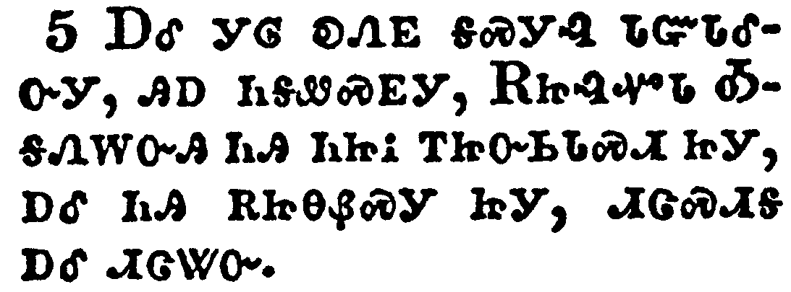</a></td>
</tr>
<tr class="even">
<td>And a voice came out of the throne, saying, Praise our God, all ye his servants, and ye that fear him, both small and great.</td>
</tr>
<tr class="odd">
<td>ᎠᎴ ᎩᎶ ᎧᏁᎬ ᎦᏍᎩᎸ ᏓᏳᏓᎴᏅᎩ, ᎯᎠ ᏂᎦᏪᏍᎬᎩ, ᎡᏥᎸᏉᏓ ᎣᎦᏁᎳᏅᎯ ᏂᎯ ᏂᏥᎥ ᎢᏥᏅᏏᏓᏍᏗ ᏥᎩ, ᎠᎴ ᏂᎯ ᎡᏥᎾᏰᏍᎩ ᏥᎩ, ᏗᏣᏍᏗᎦ ᎠᎴ ᏗᏣᏔᏅ.</td>
</tr>
<tr class="even">
<td>A-le gi-lo ka-ne-gv ga-s-gi-lv da-yu-da-le-nv-gi, hi-a ni-ga-we-s-gv-gi, E-tsi-lv-quo-da O-ga-ne-la-nv-hi ni-hi ni-tsi-v i-tsi-nv-si-da-s-di tsi-gi, a-le ni-hi e-tsi-na-ye-s-gi tsi-gi, di-tsa-s-di-ga a-le di-tsa-ta-nv.</td>
</tr>
</tbody>
</table>

<table>
<tbody>
<tr class="odd">
<td><a href="271906.png">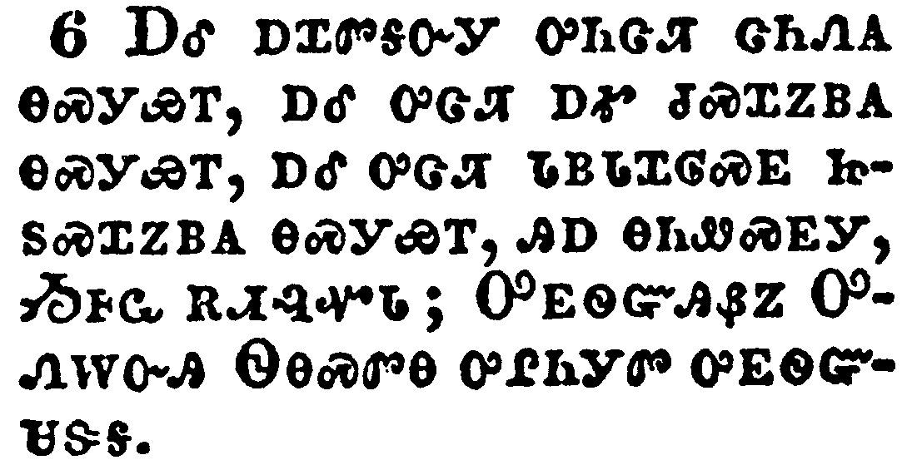</a></td>
</tr>
<tr class="even">
<td>And I heard as it were the voice of a great multitude, and as the voice of many waters, and as the voice of mighty thunderings, saying, Alleluia: for the Lord God omnipotent reigneth.</td>
</tr>
<tr class="odd">
<td>ᎠᎴ ᎠᏆᏛᎦᏅᎩ ᎤᏂᏣᏘ ᏣᏂᏁᎪ ᎾᏍᎩᏯᎢ, ᎠᎴ ᎤᏣᏘ ᎠᎹ ᏧᏍᏆᏃᏴᎪ ᎾᏍᎩᏯᎢ, ᎠᎴ ᎤᏣᏘ ᏓᏴᏓᏆᎶᏍᎬ ᏥᏚᏍᏆᏃᏴᎪ ᎾᏍᎩᏯᎢ, ᎯᎠ ᎾᏂᏪᏍᎬᎩ, ᏱᎰᏩ ᎡᏗᎸᏉᏓ; ᎤᎬᏫᏳᎯᏰᏃ ᎤᏁᎳᏅᎯ ᏫᎾᏍᏛᎾ ᎤᎵᏂᎩᏛ ᎤᎬᏫᏳᏌᏕᎦ.</td>
</tr>
<tr class="even">
<td>A-le a-qua-dv-ga-nv-gi u-ni-tsa-ti tsa-ni-ne-go na-s-gi-ya-i, a-le u-tsa-ti a-ma tsu-s-qua-no-yv-go na-s-gi-ya-i, a-le u-tsa-ti da-yv-da-qua-lo-s-gv tsi-du-s-qua-no-yv-go na-s-gi-ya-i, hi-a na-ni-we-s-gv-gi, Yi-ho-wa e-di-lv-quo-da; U-gv-wi-yu-hi-ye-no U-ne-la-nv-hi Wi-na-s-dv-na u-li-ni-gi-dv u-gv-wi-yu-sa-de-ga.</td>
</tr>
</tbody>
</table>

<table>
<tbody>
<tr class="odd">
<td><a href="271907.png">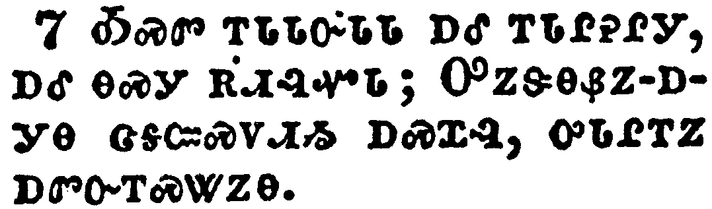</a></td>
</tr>
<tr class="even">
<td>Let us be glad and rejoice, and give honour to him: for the marriage of the Lamb is come, and his wife hath made herself ready.</td>
</tr>
<tr class="odd">
<td>ᎣᏍᏛ ᎢᏓᏓᏅᏓᏓ ᎠᎴ ᎢᏓᎵᎮᎵᎩ, ᎠᎴ ᎾᏍᎩ ᎡᏗᎸᏉᏓ; ᎤᏃᏕᎾᏰᏃ-ᎠᎩᎾ ᏣᎦᏨᏍᏙᏗᏱ ᎠᏍᏆᎸ, ᎤᏓᎵᎢᏃ ᎠᏛᏅᎢᏍᏔᏃᎾ.</td>
</tr>
<tr class="even">
<td>O-s-dv i-da-da-nv-da-da a-le i-da-li-he-li-gi, a-le na-s-gi e-di-lv-quo-da; U-no-de-na-ye-no--a-gi-na tsa-ga-tsv-s-do-di-yi a-s-qua-lv, u-da-li-i-no a-dv-nv-i-s-ta-no-na.</td>
</tr>
</tbody>
</table>

<table>
<tbody>
<tr class="odd">
<td><a href="271908.png">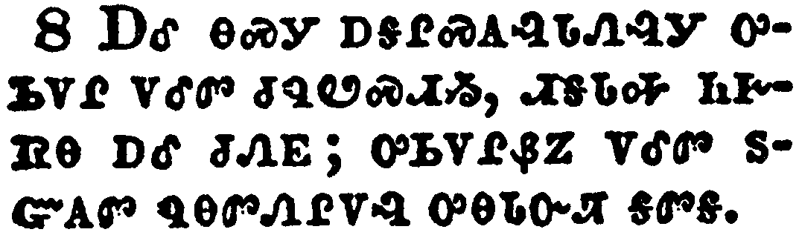</a></td>
</tr>
<tr class="even">
<td>And to her was granted that she should be arrayed in fine linen, clean and white: for the fine linen is the righteousness of saints.</td>
</tr>
<tr class="odd">
<td>ᎠᎴ ᎾᏍᎩ ᎠᎦᎵᏍᎪᎸᏓᏁᎸᎩ ᎤᏏᏙᎵ ᏙᎴᏛ ᏧᏄᏬᏍᏗᏱ, ᏗᎦᏓᎭ ᏂᎨᏒᎾ ᎠᎴ ᏧᏁᎬ; ᎤᏏᏙᎵᏰᏃ ᏙᎴᏛ ᏚᏳᎪᏛ ᏄᎾᏛᏁᎵᏙᎸ ᎤᎾᏓᏅᏘ ᎦᏛᎦ.</td>
</tr>
<tr class="even">
<td>A-le na-s-gi a-ga-li-s-go-lv-da-ne-lv-gi u-si-do-li do-le-dv tsu-nu-wo-s-di-yi, di-ga-da-ha ni-ge-sv-na a-le tsu-ne-gv; u-si-do-li-ye-no do-le-dv du-yu-go-dv nu-na-dv-ne-li-do-lv u-na-da-nv-ti ga-dv-ga.</td>
</tr>
</tbody>
</table>

<table>
<tbody>
<tr class="odd">
<td><a href="271909.png">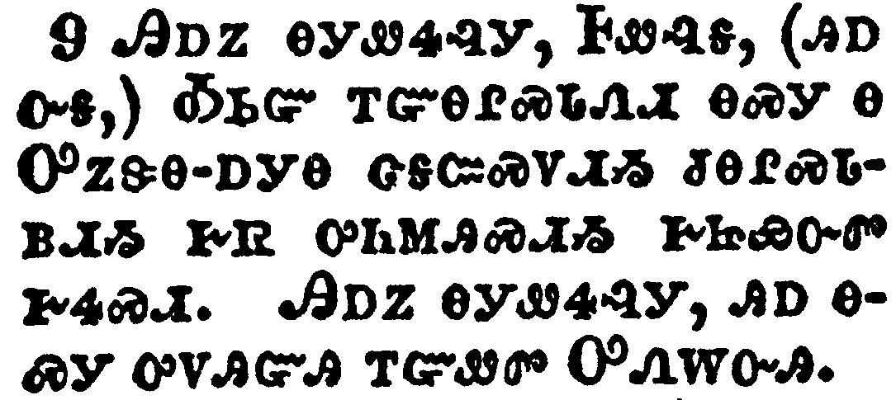</a></td>
</tr>
<tr class="even">
<td>And he saith unto me, Write, Blessed are they which are called unto the marriage supper of the Lamb. And he saith unto me, These are the true sayings of God.</td>
</tr>
<tr class="odd">
<td>ᎯᎠᏃ ᎾᎩᏪᏎᎸᎩ, ᎰᏪᎸᎦ, (ᎯᎠᏅᎦ,) ᎣᏏᏳ ᎢᏳᎾᎵᏍᏓᏁᏗ ᎾᏍᎩ Ꮎ ᎤᏃᏕᎾ-ᎠᎩᎾ ᏣᎦᏨᏍᏙᏗᏱ ᏧᎾᎵᏍᏓᏴᏗᏱ ᎨᏒ ᎤᏂᎷᎯᏍᏗᏱ ᎨᏥᏯᏅᏛ ᎨᏎᏍᏗ. ᎯᎠᏃ ᎾᎩᏪᏎᎸᎩ, ᎯᎠ ᎾᏍᎩ ᎤᏙᎯᏳᎯ ᎢᏳᏪᏛ ᎤᏁᎳᏅᎯ.</td>
</tr>
<tr class="even">
<td>Hi-a-no na-gi-we-se-lv-gi, Ho-we-lv-ga, (hi-a-nv-ga,) O-si-yu i-yu-na-li-s-da-ne-di na-s-gi na U-no-de-na--a-gi-na tsa-ga-tsv-s-do-di-yi tsu-na-li-s-da-yv-di-yi ge-sv u-ni-lu-hi-s-di-yi ge-tsi-ya-nv-dv ge-se-s-di. Hi-a-no na-gi-we-se-lv-gi, hi-a na-s-gi u-do-hi-yu-hi i-yu-we-dv U-ne-la-nv-hi.</td>
</tr>
</tbody>
</table>

<table>
<tbody>
<tr class="odd">
<td><a href="271910.png">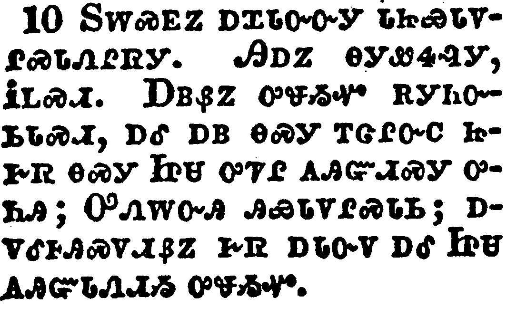</a></td>
</tr>
<tr class="even">
<td>And I fell at his feet to worship him. And he said unto me, See thou do it not: I am thy fellowservant, and of thy brethren that have the testimony of Jesus: worship God: for the testimony of Jesus is the spirit of prophecy.</td>
</tr>
<tr class="odd">
<td>ᏚᎳᏍᎬᏃ ᎠᏆᏓᏅᏅᎩ ᏓᏥᏯᏓᏙᎵᏍᏓᏁᎵᏒᎩ. ᎯᎠᏃ ᎾᎩᏪᏎᎸᎩ, ᎥᏞᏍᏗ. ᎠᏴᏰᏃ ᎤᏠᏱᏉ ᎡᎩᏂᏅᏏᏓᏍᏗ, ᎠᎴ ᎠᏴ ᎾᏍᎩ ᎢᏣᎵᏅᏟ ᏥᎨᏒ ᎾᏍᎩ ᏥᏌ ᎤᏤᎵ ᎪᎯᏳᏗᏍᎩ ᎤᏂᎯ; ᎤᏁᎳᏅᎯ ᎯᏯᏓᏙᎵᏍᏓᏏ; ᎠᏙᎴᎰᎯᏍᏙᏗᏰᏃ ᎨᏒ ᎠᏓᏅᏙ ᎠᎴ ᏥᏌ ᎪᎯᏳᏓᏁᏗᏱ ᎤᏠᏱᏉ.</td>
</tr>
<tr class="even">
<td>Du-la-s-gv-no a-qua-da-nv-nv-gi da-tsi-ya-da-do-li-s-da-ne-li-sv-gi. Hi-a-no na-gi-we-se-lv-gi, V-tle-s-di. A-yv-ye-no u-tlo-yi-quo e-gi-ni-nv-si-da-s-di, a-le a-yv na-s-gi i-tsa-li-nv-tli tsi-ge-sv na-s-gi Tsi-sa u-tse-li go-hi-yu-di-s-gi u-ni-hi; U-ne-la-nv-hi hi-ya-da-do-li-s-da-si; a-do-le-ho-hi-s-do-di-ye-no ge-sv a-da-nv-do a-le Tsi-sa go-hi-yu-da-ne-di-yi u-tlo-yi-quo.</td>
</tr>
</tbody>
</table>

<table>
<tbody>
<tr class="odd">
<td><a href="271911.png">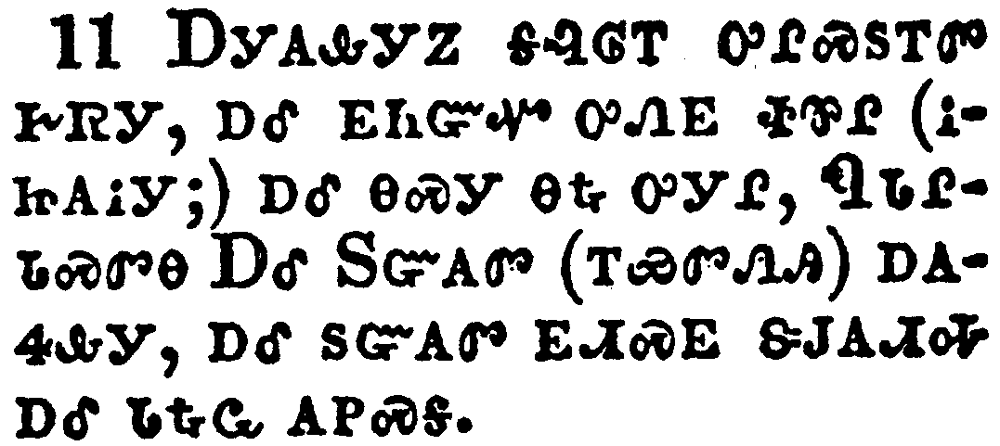</a></td>
</tr>
<tr class="even">
<td>And I saw heaven opened, and behold a white horse; and he that sat upon him was called Faithful and True, and in righteousness he doth judge and make war.</td>
</tr>
<tr class="odd">
<td>ᎠᎩᎪᎲᎩᏃ ᎦᎸᎶᎢ ᎤᎵᏍᏚᎢᏛ ᎨᏒᎩ, ᎠᎴ ᎬᏂᏳᏉ ᎤᏁᎬ ᏐᏈᎵ (ᎥᏥᎪᎥᎩ;) ᎠᎴ ᎾᏍᎩ ᎾᎿᎭᎤᎩᎵ, ᏄᏓᎵᏓᏍᏛᎾ ᎠᎴ ᏚᏳᎪᏛ (ᎢᏯᏛᏁᎯ) ᎠᎪᏎᎲᎩ, ᎠᎴ ᏚᏳᎪᏛ ᎬᏗᏍᎬ ᏕᎫᎪᏗᎭ ᎠᎴ ᏓᎿᎭᏩ ᎪᏢᏍᎦ.</td>
</tr>
<tr class="even">
<td>A-gi-go-hv-gi-no ga-lv-lo-i u-li-s-du-i-dv ge-sv-gi, a-le gv-ni-yu-quo u-ne-gv so-qui-li (v-tsi-go-v-gi;) a-le na-s-gi na-hna u-gi-li, Nu-da-li-da-s-dv-na A-le Du-yu-go-dv (i-ya-dv-ne-hi) a-go-se-hv-gi, a-le du-yu-go-dv gv-di-s-gv de-gu-go-di-ha a-le da-hna-wa go-tlv-s-ga.</td>
</tr>
</tbody>
</table>

<table>
<tbody>
<tr class="odd">
<td><a href="271912.png">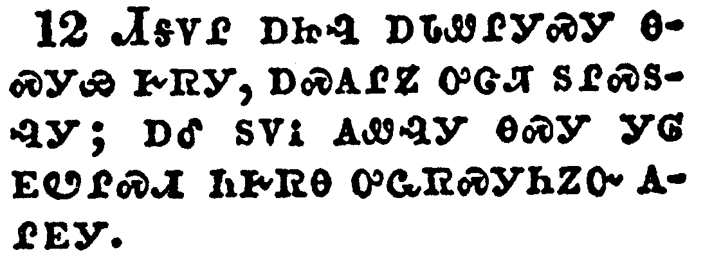</a></td>
</tr>
<tr class="even">
<td>His eyes were as a flame of fire, and on his head were many crowns; and he had a name written, that no man knew, but he himself.</td>
</tr>
<tr class="odd">
<td>ᏗᎦᏙᎵ ᎠᏥᎸ ᎠᏓᏪᎵᎩᏍᎩ ᎾᏍᎩᏯ ᎨᏒᎩ, ᎠᏍᎪᎵᏃ ᎤᏣᏘ ᏚᎵᏍᏚᎸᎩ; ᎠᎴ ᏚᏙᎥ ᎪᏪᎸᎩ ᎾᏍᎩ ᎩᎶ ᎬᏬᎵᏍᏗ ᏂᎨᏒᎾ ᎤᏩᏒᏍᎩᏂᏃᏅ ᎪᎵᎬᎩ.</td>
</tr>
<tr class="even">
<td>Di-ga-do-li a-tsi-lv a-da-we-li-gi-s-gi na-s-gi-ya ge-sv-gi, a-s-go-li-no u-tsa-ti du-li-s-du-lv-gi; a-le du-do-v go-we-lv-gi na-s-gi gi-lo gv-wo-li-s-di ni-ge-sv-na u-wa-sv-s-gi-ni-no-nv go-li-gv-gi.</td>
</tr>
</tbody>
</table>

<table>
<tbody>
<tr class="odd">
<td><a href="271913.png">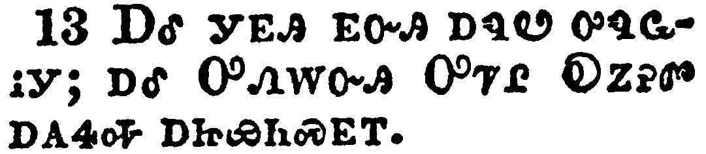</a></td>
</tr>
<tr class="even">
<td>And he was clothed with a vesture dipped in blood: and his name is called The Word of God.</td>
</tr>
<tr class="odd">
<td>ᎠᎴ ᎩᎬᎯ ᎬᏅᎯ ᎠᏄᏬ ᎤᏄᏩᎥᎩ; ᎠᎴ ᎤᏁᎳᏅᎯ ᎤᏤᎵ ᎧᏃᎮᏛ ᎠᎪᏎᎭ ᎠᏥᏯᏂᏍᎬᎢ.</td>
</tr>
<tr class="even">
<td>A-le gi-gv-hi gv-nv-hi a-nu-wo u-nu-wa-v-gi; a-le U-ne-la-nv-hi U-tse-li Ka-no-he-dv a-go-se-ha a-tsi-ya-ni-s-gv-i.</td>
</tr>
</tbody>
</table>

<table>
<tbody>
<tr class="odd">
<td><a href="271914.png">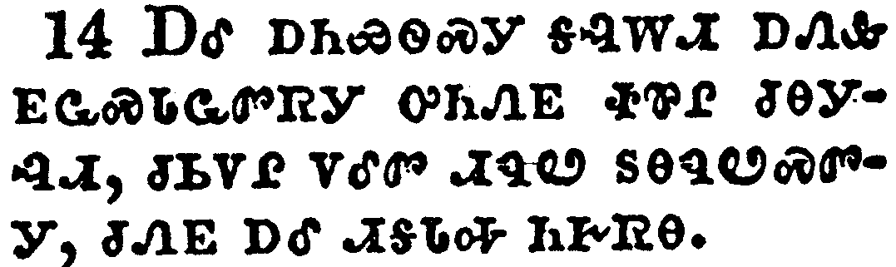</a></td>
</tr>
<tr class="even">
<td>And the armies which were in heaven followed him upon white horses, clothed in fine linen, white and clean.</td>
</tr>
<tr class="odd">
<td>ᎠᎴ ᎠᏂᏯᏫᏍᎩ ᎦᎸᎳᏗ ᎠᏁᎲ ᎬᏩᏍᏓᏩᏛᏒᎩ ᎤᏂᏁᎬ ᏐᏈᎵ ᏧᎾᎩᎸᏗ, ᏧᏏᏙᎵ ᏙᎴᏛ ᏗᏄᏬ ᏚᎾᏄᏬᏍᏛᎩ, ᏧᏁᎬ ᎠᎴ ᏗᎦᏓᎭ ᏂᎨᏒᎾ.</td>
</tr>
<tr class="even">
<td>A-le a-ni-ya-wi-s-gi ga-lv-la-di a-ne-hv gv-wa-s-da-wa-dv-sv-gi u-ni-ne-gv so-qui-li tsu-na-gi-lv-di, tsu-si-do-li do-le-dv di-nu-wo du-na-nu-wo-s-dv-gi, tsu-ne-gv a-le di-ga-da-ha ni-ge-sv-na.</td>
</tr>
</tbody>
</table>

<table>
<tbody>
<tr class="odd">
<td><a href="271915.png">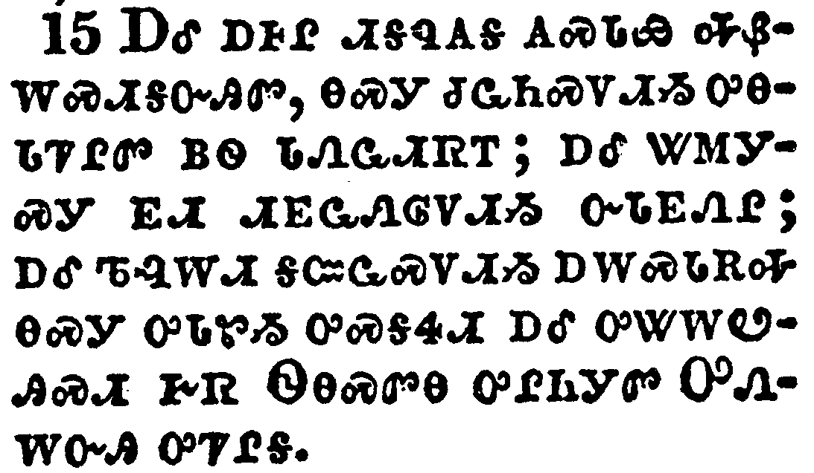</a></td>
</tr>
<tr class="even">
<td>And out of his mouth goeth a sharp sword, that with it he should smite the nations: and he shall rule them with a rod of iron: and he treadeth the winepress of the fierceness and wrath of Almighty God.</td>
</tr>
<tr class="odd">
<td>ᎠᎴ ᎠᎰᎵ ᏗᎦᏄᎪᎦ ᎪᏍᏓᏯ ᎭᏰᎳᏍᏗᎦᏅᎯᏛ, ᎾᏍᎩ ᏧᏩᏂᏍᏙᏗᏱ ᎤᎾᏓᏤᎵᏛ ᏴᏫ ᏓᏁᏩᏗᏒᎢ; ᎠᎴ ᏔᎷᎩᏍᎩ ᎬᏗ ᏗᎬᏩᏁᎶᏙᏗᏱ ᏅᏓᎬᏁᎵ; ᎠᎴ ᏖᎸᎳᏗ ᎦᏨᏩᏍᏙᏗᏱ ᎠᎳᏍᏓᎡᎭ ᎾᏍᎩ ᎤᏓᏑᏱ ᎤᏍᎦᏎᏗ ᎠᎴ ᎤᏔᎳᏬᎯᏍᏗ ᎨᏒ ᏫᎾᏍᏛᎾ ᎤᎵᏂᎩᏛ ᎤᏁᎳᏅᎯ ᎤᏤᎵᎦ.</td>
</tr>
<tr class="even">
<td>A-le a-ho-li di-ga-nu-go-ga go-s-da-ya ha-ye-la-s-di-ga-nv-hi-dv, na-s-gi tsu-wa-ni-s-do-di-yi u-na-da-tse-li-dv yv-wi da-ne-wa-di-sv-i; a-le ta-lu-gi-s-gi gv-di di-gv-wa-ne-lo-do-di-yi nv-da-gv-ne-li; a-le te-lv-la-di ga-tsv-wa-s-do-di-yi a-la-s-da-e-ha na-s-gi u-da-su-yi u-s-ga-se-di a-le u-ta-la-wo-hi-s-di ge-sv Wi-na-s-dv-na u-li-ni-gi-dv U-ne-la-nv-hi u-tse-li-ga.</td>
</tr>
</tbody>
</table>

<table>
<tbody>
<tr class="odd">
<td><a href="271916.png">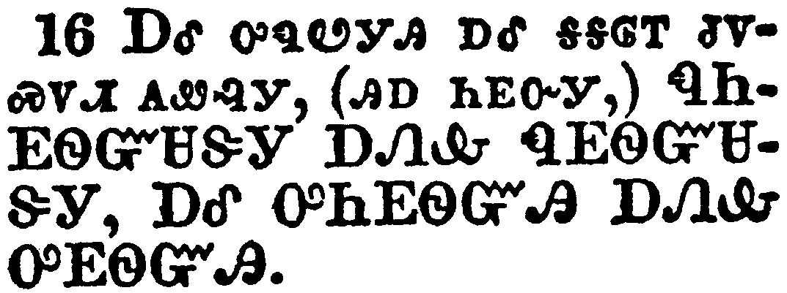</a></td>
</tr>
<tr class="even">
<td>And he hath on his vesture and on his thigh a name written, KING OF KINGS, AND LORD OF LORDS.</td>
</tr>
<tr class="odd">
<td>ᎠᎴ ᎤᏄᏬᎩᎯ ᎠᎴ ᎦᎦᎶᎢ ᏧᏙᏍᏙᏗ ᎪᏪᎸᎩ, (ᎯᎠ ᏂᎬᏅᎩ,) ᏄᏂᎬᏫᏳᏌᏕᎩ ᎠᏁᎲ ᏄᎬᏫᏳᏌᏕᎩ, ᎠᎴ ᎤᏂᎬᏫᏳᎯ ᎠᏁᎲ ᎤᎬᏫᏳᎯ.</td>
</tr>
<tr class="even">
<td>A-le u-nu-wo-gi-hi a-le ga-ga-lo-i tsu-do-s-do-di go-we-lv-gi, (hi-a ni-gv-nv-gi,) Nu-Ni-Gv-Wi-Yu-Sa-De-Gi A-Ne-Hv Nu-Gv-Wi-Yu-Sa-De-Gi, A-Le U-Ni-Gv-Wi-Yu-Hi A-Ne-Hv U-Gv-Wi-Yu-Hi.</td>
</tr>
</tbody>
</table>

<table>
<tbody>
<tr class="odd">
<td><a href="271917.png">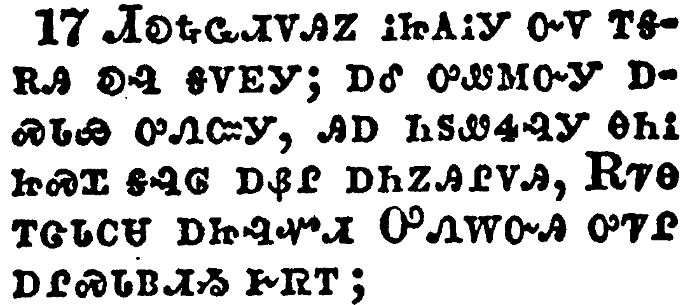</a></td>
</tr>
<tr class="even">
<td>And I saw an angel standing in the sun; and he cried with a loud voice, saying to all the fowls that fly in the midst of heaven, Come and gather yourselves together unto the supper of the great God;</td>
</tr>
<tr class="odd">
<td>ᏗᎧᎿᎭᏩᏗᏙᎯᏃ ᎥᏥᎪᎥᎩ ᏅᏙ ᎢᎦᎡᎯ ᎧᎸ ᎬᏙᎬᎩ; ᎠᎴ ᎤᏪᎷᏅᎩ ᎠᏍᏓᏯ ᎤᏁᏨᎩ, ᎯᎠ ᏂᏚᏪᏎᎸᎩ ᎾᎯᎥ ᏥᏍᏆ ᎦᎸᎶ ᎠᏰᎵ ᎠᏂᏃᎯᎵᏙᎯ, ᎡᏤᎾ ᎢᏣᏓᏟᏌ ᎠᏥᎸᏉᏗ ᎤᏁᎳᏅᎯ ᎤᏤᎵ ᎠᎵᏍᏓᏴᏗᏱ ᎨᏒᎢ;</td>
</tr>
<tr class="even">
<td>Di-ka-hna-wa-di-do-hi-no v-tsi-go-v-gi nv-do i-ga-e-hi ka-lv gv-do-gv-gi; a-le u-we-lu-nv-gi a-s-da-ya u-ne-tsv-gi, hi-a ni-du-we-se-lv-gi na-hi-v tsi-s-qua ga-lv-lo a-ye-li a-ni-no-hi-li-do-hi, E-tse-na i-tsa-da-tli-sa a-tsi-lv-quo-di U-ne-la-nv-hi u-tse-li a-li-s-da-yv-di-yi ge-sv-i;</td>
</tr>
</tbody>
</table>

<table>
<tbody>
<tr class="odd">
<td><a href="271918.png">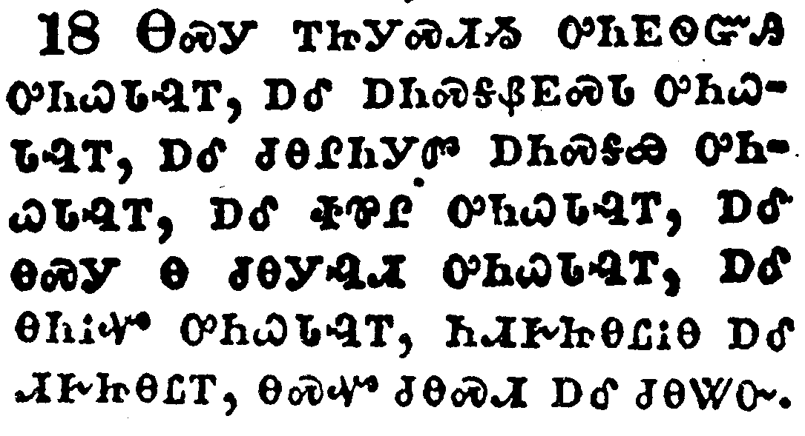</a></td>
</tr>
<tr class="even">
<td>That ye may eat the flesh of kings, and the flesh of captains, and the flesh of mighty men, and the flesh of horses, and of them that sit on them, and the flesh of all men, both free and bond, both small and great.</td>
</tr>
<tr class="odd">
<td>ᎾᏍᎩ ᎢᏥᎩᏍᏗᏱ ᎤᏂᎬᏫᏳᎯ ᎤᏂᏇᏓᎸᎢ, ᎠᎴ ᎠᏂᏍᎦᏰᎬᏍᏓ ᎤᏂᏇᏓᎸᎢ, ᎠᎴ ᏧᎾᎵᏂᎩᏛ ᎠᏂᏍᎦᏯ ᎤᏂᏇᏓᎸᎢ, ᎠᎴ ᏐᏈᎵ ᎤᏂᏇᏓᎸᎢ, ᎠᎴ ᎾᏍᎩ Ꮎ ᏧᎾᎩᎸᏗ, ᏂᏗᎨᏥᎾᏝᎥᎾ ᎠᎴ ᏗᎨᏥᎾᏝᎢ, ᎾᏍᏉ ᏧᎾᏍᏗ ᎠᎴ ᏧᎾᏔᏅ.</td>
</tr>
<tr class="even">
<td>Na-s-gi i-tsi-gi-s-di-yi u-ni-gv-wi-yu-hi u-ni-que-da-lv-i, a-le a-ni-s-ga-ye-gv-s-da u-ni-que-da-lv-i, a-le tsu-na-li-ni-gi-dv a-ni-s-ga-ya u-ni-que-da-lv-i, a-le so-qui-li u-ni-que-da-lv-i, a-le na-s-gi na tsu-na-gi-lv-di, ni-di-ge-tsi-na-tla-v-na a-le di-ge-tsi-na-tla-i, na-s-quo tsu-na-s-di a-le tsu-na-ta-nv.</td>
</tr>
</tbody>
</table>

<table>
<tbody>
<tr class="odd">
<td><a href="271919.png">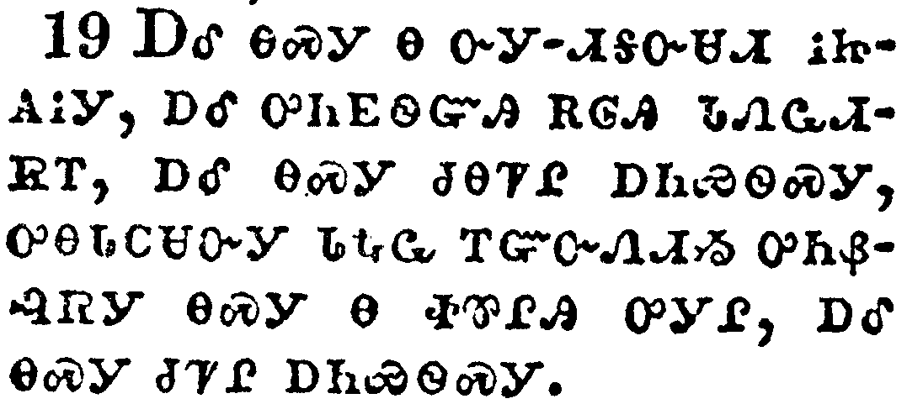</a></td>
</tr>
<tr class="even">
<td>And I saw the beast, and the kings of the earth, and their armies, gathered together to make war against him that sat on the horse, and against his army.</td>
</tr>
<tr class="odd">
<td>ᎠᎴ ᎾᏍᎩ Ꮎ ᏅᎩ-ᏗᎦᏅᏌᏗ ᎥᏥᎪᎥᎩ, ᎠᎴ ᎤᏂᎬᏫᏳᎯ ᎡᎶᎯ ᏓᏁᏩᏗᏒᎢ, ᎠᎴ ᎾᏍᎩ ᏧᎾᏤᎵ ᎠᏂᏯᏫᏍᎩ, ᎤᎾᏓᏟᏌᏅᎩ ᏓᎿᎭᏩ ᎢᏳᏅᏁᏗᏱ ᎤᏂᏰᎸᏒᎩ ᎾᏍᎩ Ꮎ ᏐᏈᎵᎯ ᎤᎩᎵ, ᎠᎴ ᎾᏍᎩ ᏧᏤᎵ ᎠᏂᏯᏫᏍᎩ.</td>
</tr>
<tr class="even">
<td>A-le na-s-gi na nv-gi--di-ga-nv-sa-di v-tsi-go-v-gi, a-le u-ni-gv-wi-yu-hi e-lo-hi da-ne-wa-di-sv-i, a-le na-s-gi tsu-na-tse-li a-ni-ya-wi-s-gi, u-na-da-tli-sa-nv-gi da-hna-wa i-yu-nv-ne-di-yi u-ni-ye-lv-sv-gi na-s-gi na so-qui-li-hi u-gi-li, a-le na-s-gi tsu-tse-li a-ni-ya-wi-s-gi.</td>
</tr>
</tbody>
</table>

<table>
<tbody>
<tr class="odd">
<td><a href="271920.png">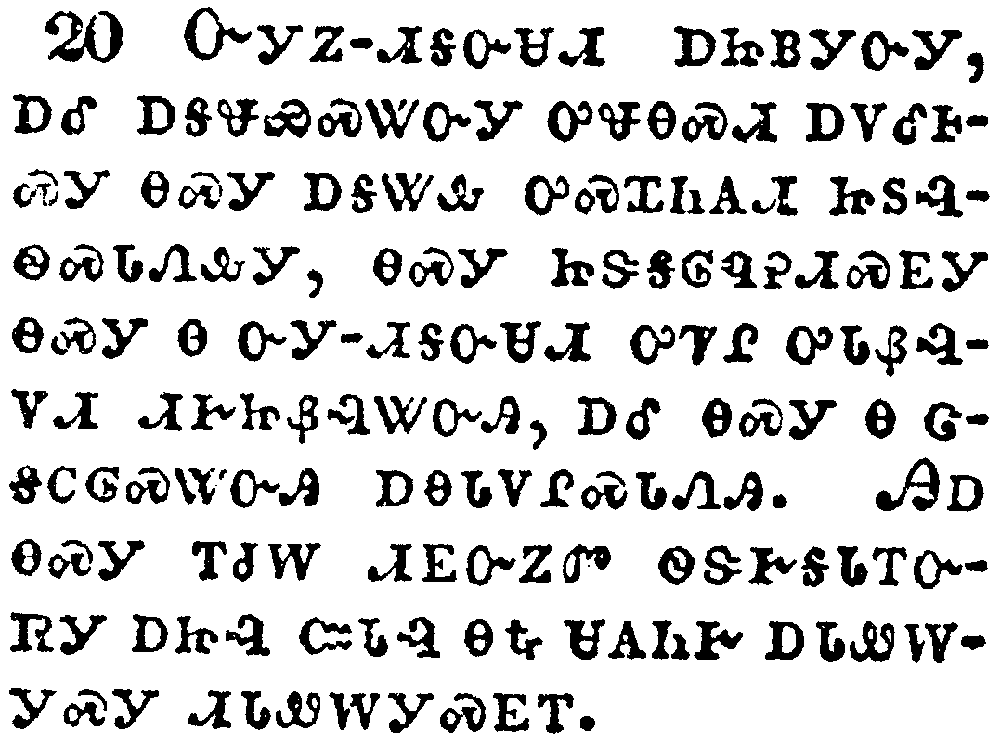</a></td>
</tr>
<tr class="even">
<td>And the beast was taken, and with him the false prophet that wrought miracles before him, with which he deceived them that had received the mark of the beast, and them that worshipped his image. These both were cast alive into a lake of fire burning with brimstone.</td>
</tr>
<tr class="odd">
<td>ᏅᎩᏃ-ᏗᎦᏅᏌᏗ ᎠᏥᏴᎩᏅᎩ, ᎠᎴ ᎠᎦᏠᏯᏍᏔᏅᎩ ᎤᏠᎾᏍᏗ ᎠᏙᎴᎰᏍᎩ ᎾᏍᎩ ᎠᎦᏔᎲ ᎤᏍᏆᏂᎪᏗ ᏥᏚᎸᏫᏍᏓᏁᎲᎩ, ᎾᏍᎩ ᏥᏕᎦᎶᏄᎮᏗᏍᎬᎩ ᎾᏍᎩ Ꮎ ᏅᎩ-ᏗᎦᏅᏌᏗ ᎤᏤᎵ ᎤᏓᏰᎸᏙᏗ ᏗᎨᏥᏰᎸᏔᏅᎯ, ᎠᎴ ᎾᏍᎩ Ꮎ ᏣᎦᏟᎶᏍᏔᏅᎯ ᎠᎾᏓᏙᎵᏍᏓᏁᎯ. ᎯᎠ ᎾᏍᎩ ᎢᏧᎳ ᏗᎬᏅᏃᏛ ᏫᏕᎨᎦᏓᎢᏅᏒᎩ ᎠᏥᎸ ᏨᏓᎸ ᎾᎿᎭᏌᎪᏂᎨ ᎠᏓᏪᎳᎩᏍᎩ ᏗᏓᏪᎳᎩᏍᎬᎢ.</td>
</tr>
<tr class="even">
<td>Nv-gi-no--di-ga-nv-sa-di a-tsi-yv-gi-nv-gi, a-le a-ga-tlo-ya-s-ta-nv-gi u-tlo-na-s-di a-do-le-ho-s-gi na-s-gi a-ga-ta-hv u-s-qua-ni-go-di tsi-du-lv-wi-s-da-ne-hv-gi, na-s-gi tsi-de-ga-lo-nu-he-di-s-gv-gi na-s-gi na nv-gi--di-ga-nv-sa-di u-tse-li u-da-ye-lv-do-di di-ge-tsi-ye-lv-ta-nv-hi, a-le na-s-gi na tsa-ga-tli-lo-s-ta-nv-hi a-na-da-do-li-s-da-ne-hi. Hi-a na-s-gi i-tsu-la di-gv-nv-no-dv wi-de-ge-ga-da-i-nv-sv-gi a-tsi-lv tsv-da-lv na-hna sa-go-ni-ge a-da-we-la-gi-s-gi di-da-we-la-gi-s-gv-i.</td>
</tr>
</tbody>
</table>

<table>
<tbody>
<tr class="odd">
<td><a href="271921.png">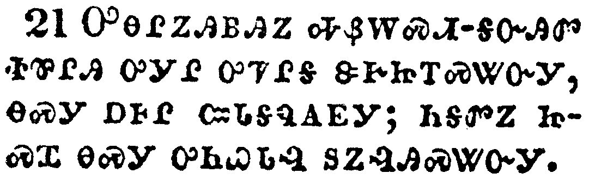</a></td>
</tr>
<tr class="even">
<td>And the remnant were slain with the sword of him that sat upon the horse, which sword proceeded out of his mouth: and all the fowls were filled with their flesh.</td>
</tr>
<tr class="odd">
<td>ᎤᎾᎵᏃᎯᏴᎯᏃ ᎭᏰᎳᏍᏗ-ᎦᏅᎯᏛ ᏐᏈᎵᎯ ᎤᎩᎵ ᎤᏤᎵᎦ ᏕᎨᏥᎢᏍᏔᏅᎩ, ᎾᏍᎩ ᎠᎰᎵ ᏨᏓᎦᏄᎪᎬᎩ; ᏂᎦᏛᏃ ᏥᏍᏆ ᎾᏍᎩ ᎤᏂᏇᏓᎸ ᏚᏃᎸᎯᏍᏔᏅᎩ.</td>
</tr>
<tr class="even">
<td>U-na-li-no-hi-yv-hi-no ha-ye-la-s-di--ga-nv-hi-dv so-qui-li-hi u-gi-li u-tse-li-ga de-ge-tsi-i-s-ta-nv-gi, na-s-gi a-ho-li tsv-da-ga-nu-go-gv-gi; ni-ga-dv-no tsi-s-qua na-s-gi u-ni-que-da-lv du-no-lv-hi-s-ta-nv-gi.</td>
</tr>
</tbody>
</table>

