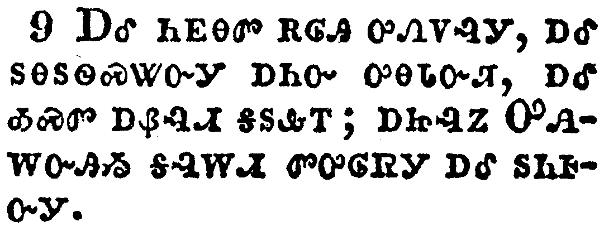

+++
draft=false
date = 2014-12-18T21:11:07Z
title = "Revelation - Chapter 20 - Cherokee New Testament"
weight = 1418955067

[taxonomies]

authors = ["Timothy Legg"]
categories = []
tags = []

[extra]
+++

<table>
<tbody>
<tr class="odd">
<td></td>
</tr>
<tr class="even">
<td>And I saw an angel come down from heaven, having the key of the bottomless pit and a great chain in his hand.</td>
</tr>
<tr class="odd">
<td>ᏗᎧᎿᎭᏩᏗᏙᎯᏃ ᎥᏥᎪᎥᎩ ᎦᎸᎳᏗ ᏓᏳᏠᎠᏒᎩ, ᎦᏁᎲᎩ ᎠᏍᏚᎢᏍᏗ ᏫᎾᏍᏛᎾ ᎠᏔᎴᏒᎢ, ᎠᎴ ᎤᏣᏘ ᎡᏆ ᏧᏓᏕᏒᏛ ᎤᏒᎦᎸᎩ.</td>
</tr>
<tr class="even">
<td>Di-ka-hna-wa-di-do-hi-no v-tsi-go-v-gi ga-lv-la-di da-yu-tlo-a-sv-gi, ga-ne-hv-gi a-s-du-i-s-di wi-na-s-dv-na a-ta-le-sv-i, a-le u-tsa-ti e-qua tsu-da-de-sv-dv u-sv-ga-lv-gi.</td>
</tr>
</tbody>
</table>

<table>
<tbody>
<tr class="odd">
<td></td>
</tr>
<tr class="even">
<td>And he laid hold on the dragon, that old serpent, which is the Devil, and Satan, and bound him a thousand years,</td>
</tr>
<tr class="odd">
<td>ᎤᏂᏴᎲᎩᏃ ᎢᎾᏛ, ᎾᏍᎩ ᎠᎦᏴᎵ ᎢᎾᏛ, ᎾᏍᎩ ᎠᏍᎩᎾ ᎠᎴ ᏎᏓᏂ ᏣᎪᏎᎰᎢ, ᏌᏉᏃ ᎢᏯᎦᏴᎵ ᎢᏧᏕᏘᏴᏛ ᎠᎦᎸᎸᎩ,</td>
</tr>
<tr class="even">
<td>U-ni-yv-hv-gi-no i-na-dv, na-s-gi a-ga-yv-li i-na-dv, na-s-gi A-s-gi-na a-le Se-da-ni tsa-go-se-ho-i, sa-quo-no i-ya-ga-yv-li i-tsu-de-ti-yv-dv a-ga-lv-lv-gi,</td>
</tr>
</tbody>
</table>

<table>
<tbody>
<tr class="odd">
<td></td>
</tr>
<tr class="even">
<td>And cast him into the bottomless pit, and shut him up, and set a seal upon him, that he should deceive the nations no more, till the thousand years should be fulfilled: and after that he must be loosed a little season.</td>
</tr>
<tr class="odd">
<td>ᎠᎴ ᏫᎾᏍᏛᎾ ᏗᏔᎴᏒ ᏩᎦᏓᎢᏅᏒᎩ, ᎠᎴ ᎠᏥᏍᏚᏅᎩ, ᎠᎴ ᎤᏰᎸᏔᏅᎩ ᎠᏍᏚᎲᎢ, ᎾᏍᎩ ᏗᎬᏩᎶᏄᎮᏗ ᎿᎭᏉ ᏂᎨᏒᎾ ᎢᏳᎵᏍᏙᏗᏱ ᏧᎾᏓᎴᏅᏛ ᏴᏫ ᏓᏁᏩᏗᏒᎢ, ᎬᏂ ᏌᏉ ᎢᏯᎦᏴᎵ ᎢᏧᏕᏘᏴᏛ ᏳᎶᏐᏅ; ᎣᏂᏃ ᎿᎭᏉ ᎠᏥᎪᏗ ᎢᎨᏎᏍᏗ ᏞᎦ.</td>
</tr>
<tr class="even">
<td>A-le wi-na-s-dv-na di-ta-le-sv wa-ga-da-i-nv-sv-gi, a-le a-tsi-s-du-nv-gi, a-le u-ye-lv-ta-nv-gi a-s-du-hv-i, na-s-gi di-gv-wa-lo-nu-he-di hna-quo ni-ge-sv-na i-yu-li-s-do-di-yi tsu-na-da-le-nv-dv yv-wi da-ne-wa-di-sv-i, gv-ni sa-quo i-ya-ga-yv-li i-tsu-de-ti-yv-dv yu-lo-so-nv; o-ni-no hna-quo a-tsi-go-di i-ge-se-s-di tle-ga.</td>
</tr>
</tbody>
</table>

<table>
<tbody>
<tr class="odd">
<td></td>
</tr>
<tr class="even">
<td>And I saw thrones, and they sat upon them, and judgment was given unto them: and I saw the souls of them that were beheaded for the witness of Jesus, and for the word of God, and which had not worshipped the beast, neither his image, neither had received his mark upon their foreheads, or in their hands; and they lived and reigned with Christ a thousand years.</td>
</tr>
<tr class="odd">
<td>ᎠᎴ ᏓᎩᎪᎲ ᏕᎦᏍᎩᎸᎢ, ᎾᎿᎭᏃ ᎤᎾᏅᏅᎩ ᎠᎴ ᏧᏄᎪᏙᏗᏱ ᎥᎨᎦᎵᏍᎪᎸᏓᏁᎸᎩ; ᎠᎴ ᏙᏥᎪᎥᎩ ᏧᎾᏓᏅᏙ ᏗᎨ ᏥᏍᎫᏕᏒᎯ ᎾᏍᎩ ᏥᏌ ᎠᏂᏃᎮᏍᎬ ᎤᏂᏍᏛᏛᎯ ᎠᎴ ᎧᏃᎮᏛ ᎤᏁᎳᏅᎯ ᎤᏤᎵ ᎠᏂᏃᎮᏍᎬᎢ, ᎠᎴ ᎾᏍᎩ ᎤᎾᏓᏙᎵᏍᏓᏁᎸᎯ ᏂᎨᏒᎾ ᏅᎩ-ᏗᎦᏅᏌᏗ, ᎠᎴ ᎾᏍᎩ ᏣᎦᏟᎶᏍᏔᏅᎯ, ᎠᎴ ᏗᎨᎪᏪᎳᏅᎯ ᏂᎨᏒᎾ ᏗᏂᎬᏓᎨᏂ, ᎠᎴ ᏧᏃᏰᏂ; ᎠᎴ ᎾᏍᎩ ᎦᎶᏁᏛ ᎢᏧᎳᎭ ᎠᏁᎲᎩ ᎠᎴ ᎤᏂᎬᏫᏳᎯ ᎥᎨᏒᎩ ᏌᏉ ᎢᏯᎦᏴᎵ ᎢᏧᏕᏘᏴᏛ.</td>
</tr>
<tr class="even">
<td>A-le da-gi-go-hv de-ga-s-gi-lv-i, na-hna-no u-na-nv-nv-gi a-le tsu-nu-go-do-di-yi v-ge-ga-li-s-go-lv-da-ne-lv-gi; a-le do-tsi-go-v-gi tsu-na-da-nv-do di-ge tsi-s-gu-de-sv-hi na-s-gi Tsi-sa a-ni-no-he-s-gv u-ni-s-dv-dv-hi a-le ka-no-he-dv U-ne-la-nv-hi u-tse-li a-ni-no-he-s-gv-i, a-le na-s-gi u-na-da-do-li-s-da-ne-lv-hi ni-ge-sv-na nv-gi--di-ga-nv-sa-di, a-le na-s-gi tsa-ga-tli-lo-s-ta-nv-hi, a-le di-ge-go-we-la-nv-hi ni-ge-sv-na di-ni-gv-da-ge-ni, a-le tsu-no-ye-ni; a-le na-s-gi Ga-lo-ne-dv i-tsu-la-ha a-ne-hv-gi a-le u-ni-gv-wi-yu-hi v-ge-sv-gi sa-quo i-ya-ga-yv-li i-tsu-de-ti-yv-dv.</td>
</tr>
</tbody>
</table>

<table>
<tbody>
<tr class="odd">
<td></td>
</tr>
<tr class="even">
<td>But the rest of the dead lived not again until the thousand years were finished. This is the first resurrection.</td>
</tr>
<tr class="odd">
<td>ᎠᏂᏐᎢᏍᎩᏂ ᏧᏂᏲᎱᏒᎯ ᎥᏝ ᏯᏁᎮ ᎬᏂ ᏌᏉ ᎢᏯᎦᏴᎵ ᎢᏧᏕᏘᏴᏛ ᏚᎶᏐᏅ. ᎯᎠ ᎾᏍᎩ ᎢᎬᏱᏱ ᏗᎴᎯᏐᏗ ᎨᏒᎢ.</td>
</tr>
<tr class="even">
<td>A-ni-so-i-s-gi-ni tsu-ni-yo-hu-sv-hi v-tla ya-ne-he gv-ni sa-quo i-ya-ga-yv-li i-tsu-de-ti-yv-dv du-lo-so-nv. Hi-a na-s-gi i-gv-yi-yi di-le-hi-so-di ge-sv-i.</td>
</tr>
</tbody>
</table>

<table>
<tbody>
<tr class="odd">
<td></td>
</tr>
<tr class="even">
<td>Blessed and holy is he that hath part in the first resurrection: on such the second death hath no power, but they shall be priests of God and of Christ, and shall reign with him a thousand years.</td>
</tr>
<tr class="odd">
<td>ᎣᏏᏳ ᎢᏳᎵᏍᏓᏁᏗ ᎠᎴ ᎾᏍᎦᏅᎾ ᎾᏍᎩ Ꮎ ᎤᏪᎳᏗᏍᏗᏍᎩ ᎢᎬᏱᏱ ᏗᎴᎯᏐᏗ ᎨᏒᎢ; ᎾᏍᎩ ᎥᏝ ᎪᎱᏍᏗ ᏴᎬᏩᏅᎦ ᏔᎵᏁ ᎠᏲᎱᎯᏍᏗ ᎨᏒᎢ, ᎠᏥᎸᏍᎩᏂ-ᏗᏁᎶᎯ ᎨᏎᏍᏗ ᎤᏁᎳᏅᎯ ᎠᎴ ᎦᎶᏁᏛ, ᎠᎴ [ᎦᎶᏁᏛ] ᎢᏧᎳᎭ ᎤᏂᎬᏫᏳᎯ ᎨᏎᏍᏗ ᏌᏉ ᎢᏯᎦᏴᎵ ᎢᏧᏕᏘᏴᏛ.</td>
</tr>
<tr class="even">
<td>O-si-yu i-yu-li-s-da-ne-di a-le na-s-ga-nv-na na-s-gi na u-we-la-di-s-di-s-gi i-gv-yi-yi di-le-hi-so-di ge-sv-i; na-s-gi v-tla go-hu-s-di yv-gv-wa-nv-ga ta-li-ne a-yo-hu-hi-s-di ge-sv-i, a-tsi-lv-s-gi-ni--di-ne-lo-hi ge-se-s-di U-ne-la-nv-hi a-le Ga-lo-ne-dv, a-le [Ga-lo-ne-dv] i-tsu-la-ha u-ni-gv-wi-yu-hi ge-se-s-di sa-quo i-ya-ga-yv-li i-tsu-de-ti-yv-dv.</td>
</tr>
</tbody>
</table>

<table>
<tbody>
<tr class="odd">
<td></td>
</tr>
<tr class="even">
<td>And when the thousand years are expired, Satan shall be loosed out of his prison,</td>
</tr>
<tr class="odd">
<td>ᏌᏉᏃ ᎢᏯᎦᏴᎵ ᎢᏧᏕᏘᏴᏛ ᎦᎶᏐᏅ, ᏎᏓᏂ ᏛᎠᏥᎧᏂ ᏛᎠᏥᏄᎪᏫᏏ ᎠᏥᏍᏚᎲᎢ;</td>
</tr>
<tr class="even">
<td>Sa-quo-no i-ya-ga-yv-li i-tsu-de-ti-yv-dv ga-lo-so-nv, Se-da-ni dv-a-tsi-ka-ni dv-a-tsi-nu-go-wi-si a-tsi-s-du-hv-i;</td>
</tr>
</tbody>
</table>

<table>
<tbody>
<tr class="odd">
<td></td>
</tr>
<tr class="even">
<td>And shall go out to deceive the nations which are in the four quarters of the earth, Gog and Magog, to gather them together to battle: the number of whom is as the sand of the sea.</td>
</tr>
<tr class="odd">
<td>ᎠᎴ ᏛᎡᏙᎵ ᏧᎶᏄᎮᏗᏱ ᏧᎾᏓᎴᏅᏛ ᏴᏫ ᎾᏍᎩ ᏅᎩ ᏂᏚᏓᎠᏗᏒ ᏓᏁᏩᏗᏒᎢ ᎡᎶᎯ ᏣᏁᎭ ᎾᏍᎩ ᎪᎦ ᎠᎴ ᎺᎪᎦ, ᎾᏍᎩ ᏧᏪᏟᏐᏗᏱ ᏧᎾᎵᏍᏗᏱ; ᎾᏂᎥᏃ ᏃᏳ ᎠᎺᏉᎯ ᎠᎲ ᎾᏂᎥ.</td>
</tr>
<tr class="even">
<td>A-le dv-e-do-li tsu-lo-nu-he-di-yi tsu-na-da-le-nv-dv yv-wi na-s-gi nv-gi ni-du-da-a-di-sv da-ne-wa-di-sv-i e-lo-hi tsa-ne-ha na-s-gi Go-ga a-le Me-go-ga, na-s-gi tsu-we-tli-so-di-yi tsu-na-li-s-di-yi; na-ni-v-no no-yu a-me-quo-hi a-hv na-ni-v.</td>
</tr>
</tbody>
</table>

<table>
<tbody>
<tr class="odd">
<td></td>
</tr>
<tr class="even">
<td>And they went up on the breadth of the earth, and compassed the camp of the saints about, and the beloved city: and fire came down from God out of heaven, and devoured them.</td>
</tr>
<tr class="odd">
<td>ᎠᎴ ᏂᎬᎾᏛ ᎡᎶᎯ ᎤᏁᏙᎸᎩ, ᎠᎴ ᏚᎾᏚᏫᏍᏔᏅᎩ ᎠᏂᏅ ᎤᎾᏓᏅᏘ, ᎠᎴ ᎣᏍᏛ ᎠᏰᎸᏗ ᎦᏚᎲᎢ; ᎠᏥᎸᏃ ᎤᎯᎳᏅᎯᏱ ᎦᎸᎳᏗ ᏛᎤᎶᏒᎩ ᎠᎴ ᏚᏂᎰᏅᎩ.</td>
</tr>
<tr class="even">
<td>A-le ni-gv-na-dv e-lo-hi u-ne-do-lv-gi, a-le du-na-du-wi-s-ta-nv-gi a-ni-nv u-na-da-nv-ti, a-le o-s-dv a-ye-lv-di ga-du-hv-i; a-tsi-lv-no U-hi-la-nv-hi-yi ga-lv-la-di dv-u-lo-sv-gi a-le du-ni-ho-nv-gi.</td>
</tr>
</tbody>
</table>

<table>
<tbody>
<tr class="odd">
<td></td>
</tr>
<tr class="even">
<td>And the devil that deceived them was cast into the lake of fire and brimstone, where the beast and the false prophet are, and shall be tormented day and night for ever and ever.</td>
</tr>
<tr class="odd">
<td>ᎠᏍᎩᎾᏃ ᎾᏍᎩ ᎤᏂᎶᏄᎮᎸᎯ ᎠᏥᎸ ᎠᎴ ᏌᎪᏂᎨ ᎠᏓᏪᎳᎩᏍᎩ ᎥᏓᎸ ᏩᎦᏓᎢᏅᏒᎩ, ᎾᎿᎭᎠᏁᎲ ᏅᎩ-ᏗᎦᏅᏌᏗ ᎠᎴ ᎤᏠᎾᏍᏗ ᎠᏙᎴᎰᏍᎩ, ᎠᎴ ᎨᏥᎩᎵᏲᎢᏍᏙᏗ ᎨᏎᏍᏗ ᏂᎪᎯᎸ ᎠᎴ ᏂᎪᎯᎸᎢ.</td>
</tr>
<tr class="even">
<td>A-s-gi-na-no na-s-gi u-ni-lo-nu-he-lv-hi a-tsi-lv a-le sa-go-ni-ge a-da-we-la-gi-s-gi v-da-lv wa-ga-da-i-nv-sv-gi, na-hna a-ne-hv nv-gi--di-ga-nv-sa-di a-le u-tlo-na-s-di a-do-le-ho-s-gi, a-le ge-tsi-gi-li-yo-i-s-do-di ge-se-s-di ni-go-hi-lv a-le ni-go-hi-lv-i.</td>
</tr>
</tbody>
</table>

<table>
<tbody>
<tr class="odd">
<td></td>
</tr>
<tr class="even">
<td>And I saw a great white throne, and him that sat on it, from whose face the earth and the heaven fled away; and there was found no place for them.</td>
</tr>
<tr class="odd">
<td>ᎠᎴ ᎠᎩᎪᎲᎩ ᎡᏆ ᎤᏁᎬ ᎦᏍᎩᎶ, ᎠᎴ ᎾᏍᎩ ᎾᎿᎭᎤᏬᎵ, ᎾᏍᎩ ᎤᎧᏛᎢ ᎡᎶᎯ ᎠᎴ ᎦᎸᎶᎢ ᎬᏩᎵᎡᎸᎩ, ᎥᏝ ᎠᎴ ᎢᎸᎯᏢ ᎬᏩᎵᎡᎸᎩ, ᎥᏝ ᎠᎴ ᎢᎸᎯᏢ ᎬᏩᏛᏗ ᏱᎨᏎ ᏭᏂᎶᎯᏍᏗᏱ.</td>
</tr>
<tr class="even">
<td>A-le a-gi-go-hv-gi e-qua u-ne-gv ga-s-gi-lo, a-le na-s-gi na-hna u-wo-li, na-s-gi u-ka-dv-i e-lo-hi a-le ga-lv-lo-i gv-wa-li-e-lv-gi, v-tla a-le i-lv-hi-tlv gv-wa-li-e-lv-gi, v-tla a-le i-lv-hi-tlv gv-wa-dv-di yi-ge-se wu-ni-lo-hi-s-di-yi.</td>
</tr>
</tbody>
</table>

<table>
<tbody>
<tr class="odd">
<td></td>
</tr>
<tr class="even">
<td>And I saw the dead, small and great, stand before God; and the books were opened: and another book was opened, which is the book of life: and the dead were judged out of those things which were written in the books, according to their works.</td>
</tr>
<tr class="odd">
<td>ᎠᎴ ᏧᏂᏲᎱᏒᎯ ᎥᎦᏥᎪᎥᎩ, ᏧᎾᏍᏗ ᎠᎴ ᏧᎾᏛᎾ, ᎤᏁᎳᏅᎯ ᎤᏬᎸ ᎢᎬᏱᏗᏢ ᏚᎾᎴᏅᎩ; ᎪᏪᎵᏃ ᏚᏂᏍᏚᎢᏒᎩ; ᎠᎴ ᏅᏩᏓᎴ ᎪᏪᎵ ᎤᏂᏍᏚᎢᏒᎩ, ᎾᏍᎩ ᎬᏂᏛ ᎠᏓᏁᎯ ᏥᎩ; ᏧᏂᏲᎱᏒᎯᏃ ᏙᎨᎫᎪᏓᏁᎸᎩ ᎾᏍᎩᏯ ᏂᎬᏅ ᎪᏪᎸ ᎪᏪᎵᎯ, ᎾᏍᎩᏯ ᏄᏍᏛ ᏚᏂᎸᏫᏍᏓᏁᎸᎢ.</td>
</tr>
<tr class="even">
<td>A-le tsu-ni-yo-hu-sv-hi v-ga-tsi-go-v-gi, tsu-na-s-di a-le tsu-na-dv-na, U-ne-la-nv-hi u-wo-lv i-gv-yi-di-tlv du-na-le-nv-gi; go-we-li-no du-ni-s-du-i-sv-gi; a-le nv-wa-da-le go-we-li u-ni-s-du-i-sv-gi, na-s-gi gv-ni-dv a-da-ne-hi tsi-gi; tsu-ni-yo-hu-sv-hi-no do-ge-gu-go-da-ne-lv-gi na-s-gi-ya ni-gv-nv go-we-lv go-we-li-hi, na-s-gi-ya nu-s-dv du-ni-lv-wi-s-da-ne-lv-i.</td>
</tr>
</tbody>
</table>

<table>
<tbody>
<tr class="odd">
<td></td>
</tr>
<tr class="even">
<td>And the sea gave up the dead which were in it; and death and hell delivered up the dead which were in them: and they were judged every man according to their works.</td>
</tr>
<tr class="odd">
<td>ᎠᎺᏉᎯᏃ ᏚᏲᏒᎩ ᏧᏂᏲᎱᏒᎯ ᎾᎿᎭᏄᎾᏛᏅᎢ; ᎠᏲᎱᎯᏍᏗᏃ ᎠᎴ ᏨᏍᎩᏃ ᏚᏂᏲᏒ ᏧᏂᏲᎱᏒᎯ ᎾᎿᎭᎠᏁᎲᎢ; ᎠᎴ ᏕᎨᎫᎪᏓᏁᎸᎩ ᏂᎦᏗᏳ ᎠᏂᏏᏴᏫᎭ ᎾᏍᎩᏯ ᏄᏍᏛ ᏚᏂᎸᏫᏍᏓᏁᎸᎢ.</td>
</tr>
<tr class="even">
<td>A-me-quo-hi-no du-yo-sv-gi tsu-ni-yo-hu-sv-hi na-hna nu-na-dv-nv-i; a-yo-hu-hi-s-di-no a-le tsv-s-gi-no du-ni-yo-sv tsu-ni-yo-hu-sv-hi na-hna a-ne-hv-i; a-le de-ge-gu-go-da-ne-lv-gi ni-ga-di-yu a-ni-si-yv-wi-ha na-s-gi-ya nu-s-dv du-ni-lv-wi-s-da-ne-lv-i.</td>
</tr>
</tbody>
</table>

<table>
<tbody>
<tr class="odd">
<td></td>
</tr>
<tr class="even">
<td>And death and hell were cast into the lake of fire. This is the second death.</td>
</tr>
<tr class="odd">
<td>ᎠᏲᎱᎯᏍᏗᏃ ᎨᏒ ᎠᎴ ᏨᏍᎩᏃ ᎠᏥᎸ ᏨᏓᎸ ᏫᏕᎨᎦᏓᎢᏅᏒᎩ. ᎯᎠ ᎾᏍᎩ ᏔᎵᏁ ᎠᏲᎱᎯᏍᏗ ᎨᏒᎢ.</td>
</tr>
<tr class="even">
<td>A-yo-hu-hi-s-di-no ge-sv a-le tsv-s-gi-no a-tsi-lv tsv-da-lv wi-de-ge-ga-da-i-nv-sv-gi. Hi-a na-s-gi ta-li-ne a-yo-hu-hi-s-di ge-sv-i.</td>
</tr>
</tbody>
</table>

<table>
<tbody>
<tr class="odd">
<td></td>
</tr>
<tr class="even">
<td>And whosoever was not found written in the book of life was cast into the lake of fire.</td>
</tr>
<tr class="odd">
<td>ᎾᏂᎥᏃ ᎩᎶ (ᏚᎾᏙᎥ) ᏂᏗᎪᏪᎸᎾ ᎨᏒ ᎯᎠ ᎾᏍᎩ ᎬᏂᏛ ᎠᏓᏁᎯ ᎪᏪᎵᎯ, ᏫᏕᎨᎦᏓᎢᎡᎬᎩ ᎠᏥᎸ ᏨᏓᎸᎢ.</td>
</tr>
<tr class="even">
<td>Na-ni-v-no gi-lo (du-na-do-v) ni-di-go-we-lv-na ge-sv hi-a na-s-gi gv-ni-dv a-da-ne-hi go-we-li-hi, wi-de-ge-ga-da-i-e-gv-gi a-tsi-lv tsv-da-lv-i.</td>
</tr>
</tbody>
</table>

