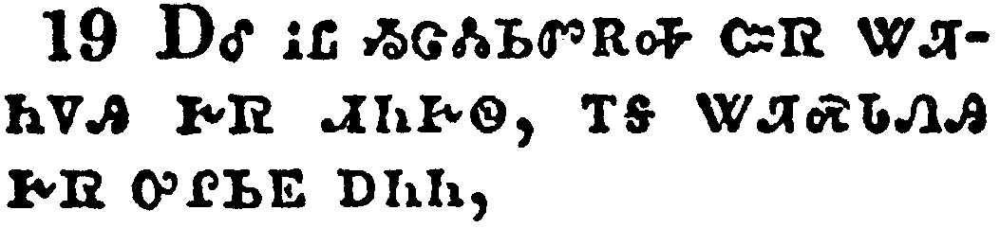

+++
draft=false
date = 2014-12-18T21:11:07Z
title = "Romans - Chapter 2 - Cherokee New Testament"
weight = 1418955067

[taxonomies]

authors = ["Timothy Legg"]
categories = []
tags = []

[extra]
+++

<table>
<tbody>
<tr class="odd">
<td></td>
</tr>
<tr class="even">
<td>Therefore thou art inexcusable, O man, whosoever thou art that judgest: for wherein thou judgest another, thou condemnest thyself; for thou that judgest doest the same things.</td>
</tr>
<tr class="odd">
<td>ᎾᏍᎩ ᎢᏳᏍᏗ ᎥᏝ ᏗᏣᏢᏫᏍᏙᏗ ᏱᏣᎭ, ᏂᎯ ᏴᏫ ᏂᏥᎥᏉ ᏗᏧᎪᏗᏍᎩ; ᎾᎿᎭᏰᏃ ᏅᏩᏓᎴ ᏕᎯᏳᎪᏓᏁᎲ ᏨᏒ ᏕᎭᏓᏚᎪᏓᏁᎭ; ᏂᎯᏰᏃ ᏚᎪᏗᏍᎩ ᎾᏍᎩᏯ ᏂᎭᏛᏁᎭ.</td>
</tr>
<tr class="even">
<td>Na-s-gi i-yu-s-di v-tla di-tsa-tlv-wi-s-do-di yi-tsa-ha, ni-hi yv-wi ni-tsi-v-quo di-tsu-go-di-s-gi; na-hna-ye-no nv-wa-da-le de-hi-yu-go-da-ne-hv tsv-sv de-ha-da-du-go-da-ne-ha; ni-hi-ye-no du-go-di-s-gi na-s-gi-ya ni-ha-dv-ne-ha.</td>
</tr>
</tbody>
</table>

<table>
<tbody>
<tr class="odd">
<td></td>
</tr>
<tr class="even">
<td>But we are sure that the judgment of God is according to truth against them which commit such things.</td>
</tr>
<tr class="odd">
<td>ᎠᏎᏃ ᎢᏗᎦᏔᎭ ᎾᏍᎩ ᎤᏁᎳᏅᎯ ᏕᎫᎪᏗᏍᎬ ᏚᏳᎪᏛ ᎨᏒᎢ, ᎾᏍᎩ ᏕᎫᎪᏓᏁᎲ ᎾᏍᎩ ᎢᏯᎾᏛᏁᎯ.</td>
</tr>
<tr class="even">
<td>A-se-no i-di-ga-ta-ha na-s-gi U-ne-la-nv-hi de-gu-go-di-s-gv du-yu-go-dv ge-sv-i, na-s-gi de-gu-go-da-ne-hv na-s-gi i-ya-na-dv-ne-hi.</td>
</tr>
</tbody>
</table>

<table>
<tbody>
<tr class="odd">
<td></td>
</tr>
<tr class="even">
<td>And thinkest thou this, O man, that judgest them which do such things, and doest the same, that thou shalt escape the judgment of God?</td>
</tr>
<tr class="odd">
<td>ᏥᎪᏃ ᎭᏓᏅᏖᏍᎬ ᏂᎯ ᏴᏫ, ᎾᏍᎩ ᏚᎪᏓᏁᎯ ᏥᎩ ᎾᏍᎩ ᎢᏯᎾᏛᏁᎯ, ᎠᎴ ᎾᏍᎩᏯ ᎢᎭᏛᏁᎯ ᏥᎩ, ᏔᏚᏓᎳᎡᎵ ᎤᏁᎳᏅᎯ ᏧᏭᎪᏙᏗ ᎨᏒᎢ?</td>
</tr>
<tr class="even">
<td>Tsi-go-no ha-da-nv-te-s-gv ni-hi yv-wi, na-s-gi du-go-da-ne-hi tsi-gi na-s-gi i-ya-na-dv-ne-hi, a-le na-s-gi-ya i-ha-dv-ne-hi tsi-gi, ta-du-da-la-e-li U-ne-la-nv-hi tsu-wu-go-do-di ge-sv-i?</td>
</tr>
</tbody>
</table>

<table>
<tbody>
<tr class="odd">
<td></td>
</tr>
<tr class="even">
<td>Or despisest thou the riches of his goodness and forbearance and longsuffering; not knowing that the goodness of God leadeth thee to repentance?</td>
</tr>
<tr class="odd">
<td>ᏥᎪᎨ ᏅᎵᏌᎵᏉ ᎯᏰᎸᏍᎦ ᏄᏧᏈᏍᏛ ᎤᏓᏅᏘᏳ ᎨᏒ ᎠᎴ ᎬᏂᏗᏳ ᎨᏒᎢ, ᎠᎴ ᎪᎯᏗᏳ ᎤᏁᎳᎩ ᏒᎵᏍᎬᎢ, ᏂᎦᏔᎲᎾᏉ ᎨᏒ ᎾᏍᎩ ᎤᏁᎳᏅᎯ ᎤᏓᏅᏘᏳ ᎨᏒ ᏣᏘᏁᎬ ᏣᏁᏟᏴᏍᏗ ᎨᏒ ᏣᏓᏅᏛᎢ?</td>
</tr>
<tr class="even">
<td>Tsi-go-ge nv-li-sa-li-quo hi-ye-lv-s-ga nu-tsu-qui-s-dv u-da-nv-ti-yu ge-sv a-le gv-ni-di-yu ge-sv-i, a-le go-hi-di-yu u-ne-la-gi sv-li-s-gv-i, ni-ga-ta-hv-na-quo ge-sv na-s-gi U-ne-la-nv-hi u-da-nv-ti-yu ge-sv tsa-ti-ne-gv tsa-ne-tli-yv-s-di ge-sv tsa-da-nv-dv-i?</td>
</tr>
</tbody>
</table>

<table>
<tbody>
<tr class="odd">
<td></td>
</tr>
<tr class="even">
<td>But after thy hardness and impenitent heart treasurest up unto thyself wrath against the day of wrath and revelation of the righteous judgment of God;</td>
</tr>
<tr class="odd">
<td>ᎾᏍᎩᏯᏍᎩᏂ ᎯᏍᏓᏱᏳ ᎨᏒ ᎠᎴ ᏣᏁᏟᏴᏛ ᏂᎨᏒᎾ ᏣᎾᏫ ᎯᏟᏏᎭ ᎤᏔᎳᏬᎯᏍᏗ ᎨᏒ ᏣᏤᎵ ᎢᏳᎵᏍᏙᏗ ᎾᎯᏳ ᎢᎦ ᎠᎵᏱᎶᎸᎭ ᎤᏓᎳᏬᎯᏍᏗ ᎨᏒ ᎠᎴ ᎤᏁᎳᏅᎯ ᏚᏳᎪᏛ ᏧᏭᎪᏙᏗ ᎨᏒ ᎦᎾᏄᎪᏫᏒᎭ;</td>
</tr>
<tr class="even">
<td>Na-s-gi-ya-s-gi-ni hi-s-da-yi-yu ge-sv a-le tsa-ne-tli-yv-dv ni-ge-sv-na tsa-na-wi hi-tli-si-ha u-ta-la-wo-hi-s-di ge-sv tsa-tse-li i-yu-li-s-do-di na-hi-yu i-ga a-li-yi-lo-lv-ha u-da-la-wo-hi-s-di ge-sv a-le U-ne-la-nv-hi du-yu-go-dv tsu-wu-go-do-di ge-sv ga-na-nu-go-wi-sv-ha;</td>
</tr>
</tbody>
</table>

<table>
<tbody>
<tr class="odd">
<td></td>
</tr>
<tr class="even">
<td>Who will render to every man according to his deeds:</td>
</tr>
<tr class="odd">
<td>ᎾᏍᎩ ᎾᏂᎥ ᏧᎫᏴᎡᏗ ᏥᎩ ᎾᏍᎩᏯ ᏄᏍᏛ ᏚᏂᎸᏫᏍᏓᏁᎸᎢ;</td>
</tr>
<tr class="even">
<td>Na-s-gi na-ni-v tsu-gu-yv-e-di tsi-gi na-s-gi-ya nu-s-dv du-ni-lv-wi-s-da-ne-lv-i;</td>
</tr>
</tbody>
</table>

<table>
<tbody>
<tr class="odd">
<td></td>
</tr>
<tr class="even">
<td>To them who by patient continuance in well doing seek for glory and honour and immortality, eternal life:</td>
</tr>
<tr class="odd">
<td>ᎾᏍᎩ ᎣᏍᏛ ᏚᏂᎸᏫᏍᏓᏁᎲ ᏗᏅᏂᏗᏳ ᎬᎾᎢᏒ ᏧᏂᏯᏍᏗᎭ ᏗᎬᏩᎸᏌᏛ ᎠᎴ ᎦᎸᏉᏗᏳ ᎨᏒ ᎠᎴ ᎠᏲᎱᎯᏍᏗ ᏂᎨᏒᎾ ᎨᏒᎢ, ᎠᎵᏍᏆᏗᏍᎩ ᏂᎨᏒᎾ ᎬᏂᏛ ᏧᎫᏴᏓᏁᏗ ᏥᎩ;</td>
</tr>
<tr class="even">
<td>Na-s-gi o-s-dv du-ni-lv-wi-s-da-ne-hv di-nv-ni-di-yu gv-na-i-sv tsu-ni-ya-s-di-ha di-gv-wa-lv-sa-dv a-le ga-lv-quo-di-yu ge-sv a-le a-yo-hu-hi-s-di ni-ge-sv-na ge-sv-i, a-li-s-qua-di-s-gi ni-ge-sv-na gv-ni-dv tsu-gu-yv-da-ne-di tsi-gi;</td>
</tr>
</tbody>
</table>

<table>
<tbody>
<tr class="odd">
<td></td>
</tr>
<tr class="even">
<td>But unto them that are contentious, and do not obey the truth, but obey unrighteousness, indignation and wrath,</td>
</tr>
<tr class="odd">
<td>Ꮎ-ᏍᎩᏂ [ᎤᏁᎳᏅᎯ] ᏗᏂᎦᏘᎴᎩ ᏥᎩ, ᎠᎴ ᎾᏃᎯᏳᎲᏍᎬᎾ ᏥᎩ ᏚᏳᎪᏛ ᎨᏒᎢ, ᏂᏚᏳᎪᏛᎾᏍᎩᏂ ᎨᏒ ᎠᏃᎯᏳᎲᏍᎩ ᏥᎩ; ᎤᏔᎳᏬᎯᏍᏗ ᎠᎴ ᎤᎿᎭᎸᎯ ᎨᏒ ᎤᏂᎷᏤᏗ ᎨᏎᏍᏗ.</td>
</tr>
<tr class="even">
<td>Na--s-gi-ni [U-ne-la-nv-hi] di-ni-ga-ti-le-gi tsi-gi, a-le na-no-hi-yu-hv-s-gv-na tsi-gi du-yu-go-dv ge-sv-i, ni-du-yu-go-dv-na-s-gi-ni ge-sv a-no-hi-yu-hv-s-gi tsi-gi; u-ta-la-wo-hi-s-di a-le u-hna-lv-hi ge-sv u-ni-lu-tse-di ge-se-s-di.</td>
</tr>
</tbody>
</table>

<table>
<tbody>
<tr class="odd">
<td></td>
</tr>
<tr class="even">
<td>Tribulation and anguish, upon every soul of man that doeth evil, of the Jew first, and also of the Gentile;</td>
</tr>
<tr class="odd">
<td>ᎤᏕᏯᏙᏗ ᎨᏒ ᎠᎴ ᎤᏪᎵᎯᏍᏗ ᎨᏒ ᎤᏂᎷᏤᏗ ᎨᏎᏍᏗ ᎾᏂᎥ ᎠᏂᏏᏴᏫᎭ ᎨᏒᎢ, ᎾᏍᎩ ᎤᏲ ᎢᏯᎾᏛᏁᎯ, ᎠᏂᏧᏏ ᎢᎬᏱ, ᎠᎴ ᎾᏍᏉ ᎠᏂᎪᎢ;</td>
</tr>
<tr class="even">
<td>U-de-ya-do-di ge-sv a-le u-we-li-hi-s-di ge-sv u-ni-lu-tse-di ge-se-s-di na-ni-v a-ni-si-yv-wi-ha ge-sv-i, na-s-gi u-yo i-ya-na-dv-ne-hi, A-ni-tsu-si i-gv-yi, a-le na-s-quo A-ni-go-i;</td>
</tr>
</tbody>
</table>

<table>
<tbody>
<tr class="odd">
<td></td>
</tr>
<tr class="even">
<td>But glory, honour, and peace, to every man that worketh good, to the Jew first, and also to the Gentile:</td>
</tr>
<tr class="odd">
<td>ᏗᎬᏩᎸᏌᏛᏍᎩᏂ ᎠᎴ ᎦᎸᏉᏗᏳ ᎨᏒ, ᎠᎴ ᏅᏩᏙᎯᏯᏛ ᎤᏂᎷᏤᏗ ᎨᏎᏍᏗ ᎾᏂᎥ ᎠᏂᏏᏴᏫᎭ ᎨᏒ ᎣᏍᏛ ᎢᏯᎾᏛᏁᎯ, ᎠᏂᏧᏏ ᎢᎬᏱ, ᎠᎴ ᎾᏍᏉ ᎠᏂᎪᎢ;</td>
</tr>
<tr class="even">
<td>Di-gv-wa-lv-sa-dv-s-gi-ni a-le ga-lv-quo-di-yu ge-sv, a-le nv-wa-do-hi-ya-dv u-ni-lu-tse-di ge-se-s-di na-ni-v a-ni-si-yv-wi-ha ge-sv o-s-dv i-ya-na-dv-ne-hi, A-ni-tsu-si i-gv-yi, a-le na-s-quo A-ni-go-i;</td>
</tr>
</tbody>
</table>

<table>
<tbody>
<tr class="odd">
<td></td>
</tr>
<tr class="even">
<td>For there is no respect of persons with God.</td>
</tr>
<tr class="odd">
<td>ᎤᏁᎳᏅᎯᏰᏃ ᎥᏝ ᎩᎶ ᏗᎦᎸᏉᏗᏍᎩ ᏱᎩ.</td>
</tr>
<tr class="even">
<td>U-ne-la-nv-hi-ye-no v-tla gi-lo di-ga-lv-quo-di-s-gi yi-gi.</td>
</tr>
</tbody>
</table>

<table>
<tbody>
<tr class="odd">
<td></td>
</tr>
<tr class="even">
<td>For as many as have sinned without law shall also perish without law: and as many as have sinned in the law shall be judged by the law;</td>
</tr>
<tr class="odd">
<td>ᎾᏂᎥᏰᏃ ᎩᎶ ᎤᏂᏍᎦᏅᏨᎯ ᏗᎧᎿᎭᏩᏛᏍᏗ ᏄᏂᎲᎾ ᎾᏍᏉ ᏗᎧᎿᎭᏩᏛᏍᏗ ᏂᎬᏔᏅᎾ ᎤᏂᎩᎵᏲᎢᏍᏗ; ᎠᎴ ᎾᏂᎥ ᎩᎶ ᎤᏂᏍᎦᏅᏨᎯ ᏗᎧᎿᎭᏩᏛᏍᏗ ᎤᏂᎯ, ᎾᏍᎩ ᏗᎧᎿᎭᏩᏛᏍᏗ ᎨᎬᏓᏁᏗ ᏗᎨᎫᎪᏓᏁᏗ ᎨᏎᏍᏗ,</td>
</tr>
<tr class="even">
<td>Na-ni-v-ye-no gi-lo u-ni-s-ga-nv-tsv-hi di-ka-hna-wa-dv-s-di nu-ni-hv-na na-s-quo di-ka-hna-wa-dv-s-di ni-gv-ta-nv-na u-ni-gi-li-yo-i-s-di; a-le na-ni-v gi-lo u-ni-s-ga-nv-tsv-hi di-ka-hna-wa-dv-s-di u-ni-hi, na-s-gi di-ka-hna-wa-dv-s-di ge-gv-da-ne-di di-ge-gu-go-da-ne-di ge-se-s-di,</td>
</tr>
</tbody>
</table>

<table>
<tbody>
<tr class="odd">
<td></td>
</tr>
<tr class="even">
<td>(For not the hearers of the law are just before God, but the doers of the law shall be justified.</td>
</tr>
<tr class="odd">
<td>ᎥᏝᏰᏃ ᏗᎧᎿᎭᏩᏛᏍᏗ ᎠᎾᏛᎩᏍᎩ ᎾᏂᏍᎦᏅᎾ ᏱᎩ ᎤᏁᎳᏅᎯ ᏓᎧᏅᎢ, ᏗᎧᎿᎭᏩᏛᏍᏗᏍᎩᏂ ᏂᎦᏪᏍᎬ ᎢᏯᎾᏛᏁᎯ ᎾᏍᎩ ᎤᎾᏚᏓᎴᏍᏗ ᎨᏎᏍᏗ.</td>
</tr>
<tr class="even">
<td>V-tla-ye-no di-ka-hna-wa-dv-s-di a-na-dv-gi-s-gi na-ni-s-ga-nv-na yi-gi U-ne-la-nv-hi da-ka-nv-i, di-ka-hna-wa-dv-s-di-s-gi-ni ni-ga-we-s-gv i-ya-na-dv-ne-hi na-s-gi u-na-du-da-le-s-di ge-se-s-di.</td>
</tr>
</tbody>
</table>

<table>
<tbody>
<tr class="odd">
<td></td>
</tr>
<tr class="even">
<td>For when the Gentiles, which have not the law, do by nature the things contained in the law, these, having not the law, are a law unto themselves:</td>
</tr>
<tr class="odd">
<td>ᏧᎾᏓᎴᏅᏛᏰᏃ ᏴᏫ ᏗᎧᎿᎭᏩᏛᏍᏗ ᏄᏂᎲᎾ ᏥᎩ, ᎤᏅᏒ ᎤᎾᏓᏅᏖᏛ ᏗᎧᎿᎭᏩᏛᏍᏗ ᏂᎦᏪᏍᎬ ᏱᎾᎾᏛᏁᎭ, ᎾᏍᎩ ᎯᎠ, ᏗᎧᎿᎭᏩᏛᏍᏗ ᏄᏂᎲᎾ ᏥᎩ, ᎤᏅᏒᏉ ᎨᏒ ᏗᎧᎿᎭᏩᏛᏍᏗ ᎾᎾᎵᏍᏗᎭ;</td>
</tr>
<tr class="even">
<td>Tsu-na-da-le-nv-dv-ye-no yv-wi di-ka-hna-wa-dv-s-di nu-ni-hv-na tsi-gi, u-nv-sv u-na-da-nv-te-dv di-ka-hna-wa-dv-s-di ni-ga-we-s-gv yi-na-na-dv-ne-ha, na-s-gi hi-a, di-ka-hna-wa-dv-s-di nu-ni-hv-na tsi-gi, u-nv-sv-quo ge-sv di-ka-hna-wa-dv-s-di na-na-li-s-di-ha;</td>
</tr>
</tbody>
</table>

<table>
<tbody>
<tr class="odd">
<td></td>
</tr>
<tr class="even">
<td>Which shew the work of the law written in their hearts, their conscience also bearing witness, and their thoughts the mean while accusing or else excusing one another;)</td>
</tr>
<tr class="odd">
<td>ᎾᏍᎩ ᎬᏂᎨᏒ ᎾᏅᏁᎭ ᏗᎧᎿᎭᏩᏛᏍᏗ ᏂᎦᏪᏍᎬ ᎢᏯᏛᏁᏗ ᎨᏒ ᏧᏂᎾᏫᏱ ᎪᏪᎸᎢ, ᏚᎾᏓᏅᏛ ᎾᏍᏉ ᎪᎯᏳᏙᏗᏍᎬᎢ, ᎠᎴ ᎠᎾᏓᏅᏖᏍᎬ ᏓᎾᏓᏚᎯᏍᏗᏍᎬ, ᎠᎴ ᏓᎾᏓᏚᏓᎴᏍᎬᎢ.</td>
</tr>
<tr class="even">
<td>Na-s-gi gv-ni-ge-sv na-nv-ne-ha di-ka-hna-wa-dv-s-di ni-ga-we-s-gv i-ya-dv-ne-di ge-sv tsu-ni-na-wi-yi go-we-lv-i, du-na-da-nv-dv na-s-quo go-hi-yu-do-di-s-gv-i, a-le a-na-da-nv-te-s-gv da-na-da-du-hi-s-di-s-gv, a-le da-na-da-du-da-le-s-gv-i.</td>
</tr>
</tbody>
</table>

<table>
<tbody>
<tr class="odd">
<td></td>
</tr>
<tr class="even">
<td>In the day when God shall judge the secrets of men by Jesus Christ according to my gospel.</td>
</tr>
<tr class="odd">
<td>ᎾᎯᏳ ᎢᎦ ᎤᏁᎳᏅᎯ ᎤᏕᎵᏛ ᎨᏒ ᏴᏫ ᎤᎾᏤᎵᎦ ᏕᎫᎪᏓᏁᎸᎭ, ᏥᏌ ᎦᎶᏁᏛ ᎠᎬᏗᏍᎬᎢ, ᎾᏍᎩᏯ ᏂᎦᏪᏍᎬ ᎠᏆᏤᎵ ᎣᏍᏛ ᎧᏃᎮᏛ.</td>
</tr>
<tr class="even">
<td>Na-hi-yu i-ga U-ne-la-nv-hi u-de-li-dv ge-sv yv-wi u-na-tse-li-ga de-gu-go-da-ne-lv-ha, Tsi-sa Ga-lo-ne-dv a-gv-di-s-gv-i, na-s-gi-ya ni-ga-we-s-gv a-qua-tse-li o-s-dv ka-no-he-dv.</td>
</tr>
</tbody>
</table>

<table>
<tbody>
<tr class="odd">
<td></td>
</tr>
<tr class="even">
<td>Behold, thou art called a Jew, and restest in the law, and makest thy boast of God,</td>
</tr>
<tr class="odd">
<td>ᎬᏂᏳᏉ, ᎠᏧᏏ ᏕᏣᏙᎥ, ᎠᎴ ᏗᎧᎿᎭᏩᏛᏍᏗ ᏣᎵᏍᎦᏍᏙᏗ, ᎠᎴ ᎯᏯᏢᏆᏍᏙᏗ ᎤᏁᎳᏅᎯ,</td>
</tr>
<tr class="even">
<td>Gv-ni-yu-quo, A-tsu-si de-tsa-do-v, a-le di-ka-hna-wa-dv-s-di tsa-li-s-ga-s-do-di, a-le hi-ya-tlv-qua-s-do-di U-ne-la-nv-hi,</td>
</tr>
</tbody>
</table>

<table>
<tbody>
<tr class="odd">
<td></td>
</tr>
<tr class="even">
<td>And knowest his will, and approvest the things that are more excellent, being instructed out of the law;</td>
</tr>
<tr class="odd">
<td>ᎠᎴ ᎯᎦᏔᎭ ᏄᏍᏛ ᎣᏏᏳ ᎤᏰᎸᏗ ᎨᏒᎢ, ᎠᎴ ᎯᎪᏩᏘᎭ ᏧᏓᎴᏅᏛ ᏧᏓᎴᎿᎭᎢ ᎨᏒᎢ, ᎡᏤᏲᏅᎯ ᏗᎧᎿᎭᏩᏛᏍᏗᏱ;</td>
</tr>
<tr class="even">
<td>A-le hi-ga-ta-ha nu-s-dv o-si-yu u-ye-lv-di ge-sv-i, a-le hi-go-wa-ti-ha tsu-da-le-nv-dv tsu-da-le-hna-i ge-sv-i, e-tse-yo-nv-hi di-ka-hna-wa-dv-s-di-yi;</td>
</tr>
</tbody>
</table>

<table>
<tbody>
<tr class="odd">
<td></td>
</tr>
<tr class="even">
<td>And art confident that thou thyself art a guide of the blind, a light of them which are in darkness,</td>
</tr>
<tr class="odd">
<td>ᎠᎴ ᎥᏝ ᏱᏣᏜᏓᏏᏛᎡᎭ ᏨᏒ ᏔᏘᏂᏙᎯ ᎨᏒ ᏗᏂᎨᏫ, ᎢᎦ ᏔᏘᏍᏓᏁᎯ ᎨᏒ ᎤᎵᏏᎬ ᎠᏂᏂ,</td>
</tr>
<tr class="even">
<td>A-le v-tla yi-tsa-dla-si-dv-e-ha tsv-sv ta-ti-ni-do-hi ge-sv di-ni-ge-wi, i-ga ta-ti-s-da-ne-hi ge-sv u-li-si-gv a-ni-ni,</td>
</tr>
</tbody>
</table>

<table>
<tbody>
<tr class="odd">
<td></td>
</tr>
<tr class="even">
<td>An instructor of the foolish, a teacher of babes, which hast the form of knowledge and of the truth in the law.</td>
</tr>
<tr class="odd">
<td>ᏖᏲᎲᏍᎩ ᎨᏒ ᏄᎾᏓᏅᏛᎾ, ᏗᏂᏲᎵ ᏖᏲᎲᏍᎩ, ᎾᏍᎩ ᏣᏍᏆᏂᎪᏗ ᎠᎦᏙᎥᎯᏍᏗ ᎨᏒ ᎠᎴ ᏚᏳᎪᏛ ᎨᏒ ᏗᏟᎶᏍᏔᏅᎯ ᏗᎧᎿᎭᏩᏛᏍᏗᏱ ᎪᏪᎸᎢ.</td>
</tr>
<tr class="even">
<td>Te-yo-hv-s-gi ge-sv nu-na-da-nv-dv-na, di-ni-yo-li te-yo-hv-s-gi, na-s-gi tsa-s-qua-ni-go-di a-ga-do-v-hi-s-di ge-sv a-le du-yu-go-dv ge-sv di-tli-lo-s-ta-nv-hi di-ka-hna-wa-dv-s-di-yi go-we-lv-i.</td>
</tr>
</tbody>
</table>

<table>
<tbody>
<tr class="odd">
<td></td>
</tr>
<tr class="even">
<td>Thou therefore which teachest another, teachest thou not thyself? thou that preachest a man should not steal, dost thou steal?</td>
</tr>
<tr class="odd">
<td>ᎾᏍᎩᏃ ᏂᎯ ᏅᏩᏓᎴ ᎯᏰᏲᎲᏍᎩ ᏥᎩ, ᏝᏍᎪ ᏨᏒ ᏯᏓᏕᏲᎲᏍᎦ? ᏂᎯ ᎭᎵᏥᏙᎲᏍᎬ ᏞᏍᏗ ᏣᏃᏍᎩᏒᎩ ᏣᏗᎭ, ᏥᎪ ᎢᎯᏃᏍᎩᎭ?</td>
</tr>
<tr class="even">
<td>Na-s-gi-no ni-hi nv-wa-da-le hi-ye-yo-hv-s-gi tsi-gi, tla-s-go tsv-sv ya-da-de-yo-hv-s-ga? Ni-hi ha-li-tsi-do-hv-s-gv tle-s-di tsa-no-s-gi-sv-gi tsa-di-ha, tsi-go i-hi-no-s-gi-ha?</td>
</tr>
</tbody>
</table>

<table>
<tbody>
<tr class="odd">
<td></td>
</tr>
<tr class="even">
<td>Thou that sayest a man should not commit adultery, dost thou commit adultery? thou that abhorrest idols, dost thou commit sacrilege?</td>
</tr>
<tr class="odd">
<td>ᏂᎯ, ᏞᏍᏗ ᏣᏓᏲᏁᎸᎩ ᏣᏗᎭ, ᏥᎪ ᎢᎭᏓᏲᏁᎭ? ᏂᎯ, ᎤᏁᎴᏅᎯ ᏗᏰᎸᎯ ᏥᏕᎯᏂᏆᏘᎭ, ᏥᎪ ᏂᎯ ᎪᎱᏍᏗ ᎦᎸᏉᏗ ᎯᏐᏢᏗᎭ?</td>
</tr>
<tr class="even">
<td>Ni-hi, tle-s-di tsa-da-yo-ne-lv-gi tsa-di-ha, tsi-go i-ha-da-yo-ne-ha? ni-hi, U-ne-le-nv-hi di-ye-lv-hi tsi-de-hi-ni-qua-ti-ha, tsi-go ni-hi go-hu-s-di ga-lv-quo-di hi-so-tlv-di-ha?</td>
</tr>
</tbody>
</table>

<table>
<tbody>
<tr class="odd">
<td></td>
</tr>
<tr class="even">
<td>Thou that makest thy boast of the law, through breaking the law dishonourest thou God?</td>
</tr>
<tr class="odd">
<td>ᏂᎯ ᏗᎧᎿᎭᏩᏛᏍᏗ ᏣᏢᏆᏙᏗᎭ, ᎯᏲᏍᏗᏍᎬᏍᎪ ᏗᎧᎿᎭᏩᏛᏍᏗ ᎠᏐᏢᎯ ᏂᏴᏁ ᎤᏁᎳᏅᎯ?</td>
</tr>
<tr class="even">
<td>Ni-hi di-ka-hna-wa-dv-s-di tsa-tlv-qua-do-di-ha, hi-yo-s-di-s-gv-s-go di-ka-hna-wa-dv-s-di a-so-tlv-hi ni-yv-ne U-ne-la-nv-hi?</td>
</tr>
</tbody>
</table>

<table>
<tbody>
<tr class="odd">
<td></td>
</tr>
<tr class="even">
<td>For the name of God is blasphemed among the Gentiles through you, as it is written.</td>
</tr>
<tr class="odd">
<td>ᎤᏁᎳᏅᎯᏰᏃ ᏚᏙᎥ ᎬᏩᏂᏐᏢᏗ ᏧᎾᏓᎴᏅᏛ ᏴᏫ ᎠᏁᎲᎢ ᏂᎯ ᎢᏨᏂᏌᏛ, ᎾᏍᎩᏯ ᏂᎬᏅ ᎪᏪᎸᎢ.</td>
</tr>
<tr class="even">
<td>U-ne-la-nv-hi-ye-no du-do-v gv-wa-ni-so-tlv-di tsu-na-da-le-nv-dv yv-wi a-ne-hv-i ni-hi i-tsv-ni-sa-dv, na-s-gi-ya ni-gv-nv go-we-lv-i.</td>
</tr>
</tbody>
</table>

<table>
<tbody>
<tr class="odd">
<td></td>
</tr>
<tr class="even">
<td>For circumcision verily profiteth, if thou keep the law: but if thou be a breaker of the law, thy circumcision is made uncircumcision.</td>
</tr>
<tr class="odd">
<td>ᎠᎱᏍᏕᏍᏗᏰᏃ ᎨᏒ ᎤᏙᎯᏳᎯ ᏣᏍᏕᎵᎭ ᎢᏳᏃ ᏗᎧᎿᎭᏩᏛᏍᏗ ᏂᎦᏪᏍᎬ ᏱᎿᎭᏛᏁᎭ; ᎢᏳᏍᎩᏂ ᎯᏲᏍᏗᏍᎩ ᏱᎩ ᏗᎧᎿᎭᏩᏛᏍᏗ, ᎡᏣᎱᏍᏕᏎᎸᎯ ᎨᏒ ᎡᏣᎱᏍᏕᏎᎸᎯᏉ ᏂᎨᏒᎾ ᏂᎦᎵᏍᏗᎭ.</td>
</tr>
<tr class="even">
<td>A-hu-s-de-s-di-ye-no ge-sv u-do-hi-yu-hi tsa-s-de-li-ha i-yu-no di-ka-hna-wa-dv-s-di ni-ga-we-s-gv yi-hna-dv-ne-ha; i-yu-s-gi-ni hi-yo-s-di-s-gi yi-gi di-ka-hna-wa-dv-s-di, e-tsa-hu-s-de-se-lv-hi ge-sv e-tsa-hu-s-de-se-lv-hi-quo ni-ge-sv-na ni-ga-li-s-di-ha.</td>
</tr>
</tbody>
</table>

<table>
<tbody>
<tr class="odd">
<td></td>
</tr>
<tr class="even">
<td>Therefore if the uncircumcision keep the righteousness of the law, shall not his uncircumcision be counted for circumcision?</td>
</tr>
<tr class="odd">
<td>ᎾᏍᎩ ᎢᏳᏍᏗ ᎢᏳᏃ ᎠᏥᎤᏍᏕᏎᎸᎯ ᏂᎨᏒᎾ ᏯᏍᏆᏂᎪᏗᎭ ᏗᎧᎿᎭᏩᏛᏍᏗ ᎾᏍᎩᏯ ᏂᎬᏅᎢ, ᏝᏍᎪ ᎾᏥᎤᏍᏕᏎᎸᎾ ᎨᏒ ᎠᏥᎤᏍᏕᏎᎸᎯ ᎨᏒ ᎠᏥᏰᎸᎾᏁᏗ ᏱᎦᎩ?</td>
</tr>
<tr class="even">
<td>Na-s-gi i-yu-s-di i-yu-no a-tsi-u-s-de-se-lv-hi ni-ge-sv-na ya-s-qua-ni-go-di-ha di-ka-hna-wa-dv-s-di na-s-gi-ya ni-gv-nv-i, tla-s-go na-tsi-u-s-de-se-lv-na ge-sv a-tsi-u-s-de-se-lv-hi ge-sv a-tsi-ye-lv-na-ne-di yi-ga-gi?</td>
</tr>
</tbody>
</table>

<table>
<tbody>
<tr class="odd">
<td></td>
</tr>
<tr class="even">
<td>And shall not uncircumcision which is by nature, if it fulfill the law, judge thee, who by the letter and circumcision dost transgress the law?</td>
</tr>
<tr class="odd">
<td>ᎠᎴ ᏝᏍᎪ ᎠᏥᎤᏍᏕᏎᎸᎯ ᏂᎨᏒᎾ, ᎾᏍᎩ ᎤᏕᏅᏉ ᏄᏍᏛ ᏗᎧᎿᎭᏩᏛᏍᏗ ᎠᏍᏆᏂᎪᏗᏍᎩ ᏱᏙᎨᏧᎪᏓᏏ ᏂᎯ, ᎪᏪᎵ ᎠᎴ ᎠᎱᏍᏕᏍᏗ ᎨᏒ ᏗᎬᏗ ᏗᎧᎿᎭᏩᏛᏍᏗ ᎯᏲᏍᏗᏍᎩ?</td>
</tr>
<tr class="even">
<td>A-le tla-s-go a-tsi-u-s-de-se-lv-hi ni-ge-sv-na, na-s-gi u-de-nv-quo nu-s-dv di-ka-hna-wa-dv-s-di a-s-qua-ni-go-di-s-gi yi-do-ge-tsu-go-da-si ni-hi, go-we-li a-le a-hu-s-de-s-di ge-sv di-gv-di di-ka-hna-wa-dv-s-di hi-yo-s-di-s-gi?</td>
</tr>
</tbody>
</table>

<table>
<tbody>
<tr class="odd">
<td></td>
</tr>
<tr class="even">
<td>For he is not a Jew, which is one outwardly; neither is that circumcision, which is outward in the flesh:</td>
</tr>
<tr class="odd">
<td>ᎥᏝᏰᏃ ᎾᏍᎩ Ꮎ ᎠᏧᏏ ᏱᎩ, ᎦᏚᏉ ᎢᏗᏢ ᎠᏧᏏ ᏱᎩ; ᎥᏝ ᎠᎴ ᎾᏍᎩ Ꮎ ᎠᎱᏍᏕᏍᏗ ᎨᏒ ᏱᎩ, ᎦᏚᏉ ᎢᏗᏢ ᎤᏇᏓᎸᏉ ᏱᎩ;</td>
</tr>
<tr class="even">
<td>V-tla-ye-no na-s-gi na A-tsu-si yi-gi, ga-du-quo i-di-tlv A-tsu-si yi-gi; v-tla a-le na-s-gi na a-hu-s-de-s-di ge-sv yi-gi, ga-du-quo i-di-tlv u-que-da-lv-quo yi-gi;</td>
</tr>
</tbody>
</table>

<table>
<tbody>
<tr class="odd">
<td></td>
</tr>
<tr class="even">
<td>But he is a Jew, which is one inwardly; and circumcision is that of the heart, in the spirit, and not in the letter; whose praise is not of men, but of God.</td>
</tr>
<tr class="odd">
<td>ᎾᏍᎩᏍᎩᏂ Ꮎ ᎠᏧᏏ, ᎾᏍᎩ ᎭᏫᏂᏗᏢ ᎠᏧᏏ ᏥᎩ, ᎠᎴ ᎾᏍᎩ Ꮎ ᎠᎱᏍᏕᏍᏗ ᎨᏒ ᎤᎾᏫᏱ ᎡᎯ ᏥᎩ, ᎤᏓᏅᏙᎩᎯ ᎡᎯ, ᎥᏝᏃ ᎪᏪᎵᏉ ᏂᎦᏪᏍᎬ ᏗᎧᎿᎭᏩᏕᎩ; ᎾᏍᎩ ᎥᏝ ᏴᏫᏉ ᎬᏩᎸᏉᏙᏗ ᏱᎩ, ᎤᏁᎳᏅᎯᏍᎩᏂ.</td>
</tr>
<tr class="even">
<td>Na-s-gi-s-gi-ni na A-tsu-si, na-s-gi ha-wi-ni-di-tlv A-tsu-si tsi-gi, a-le na-s-gi na a-hu-s-de-s-di ge-sv u-na-wi-yi e-hi tsi-gi, u-da-nv-do-gi-hi e-hi, v-tla-no go-we-li-quo ni-ga-we-s-gv di-ka-hna-wa-de-gi; na-s-gi v-tla yv-wi-quo gv-wa-lv-quo-do-di yi-gi, U-ne-la-nv-hi-s-gi-ni.</td>
</tr>
</tbody>
</table>

