+++
draft=false
date = 2014-12-18T21:11:07Z
title = "Romans - Chapter 11 - Cherokee New Testament"
weight = 1418955067

[taxonomies]

authors = ["Timothy Legg"]
categories = []
tags = []

[extra]
+++

<table>
<tbody>
<tr class="odd">
<td><a href="061101.png">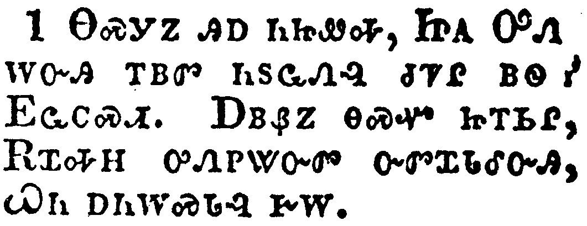</a></td>
</tr>
<tr class="even">
<td>I say then, Hath God cast away his people? God forbid. For I also am an Israelite, of the seed of Abraham, of the tribe of Benjamin.</td>
</tr>
<tr class="odd">
<td>ᎾᏍᎩᏃ ᎯᎠ ᏂᏥᏪᎭ, ᏥᎪ ᎤᏁᎳᏅᎯ ᎢᏴᏛ ᏂᏚᏩᏁᎸ ᏧᏤᎵ ᏴᏫ? ᎬᏩᏟᏍᏗ. ᎠᏴᏰᏃ ᎾᏍᏉ ᏥᎢᏏᎵ, ᎡᏆᎭᎻ ᎤᏁᏢᏔᏅᏛ ᏅᏛᏆᏓᎴᏅᎯ, ᏇᏂ ᎠᏂᎳᏍᏓᎸ ᎨᎳ.</td>
</tr>
<tr class="even">
<td>Na-s-gi-no hi-a ni-tsi-we-ha, Tsi-go U-ne-la-nv-hi i-yv-dv ni-du-wa-ne-lv tsu-tse-li yv-wi? Gv-wa-tli-s-di. A-yv-ye-no na-s-quo tsi-i-si-li, E-qua-ha-mi u-ne-tlv-ta-nv-dv nv-dv-qua-da-le-nv-hi, Que-ni a-ni-la-s-da-lv ge-la.</td>
</tr>
</tbody>
</table>

<table>
<tbody>
<tr class="odd">
<td><a href="061102.png">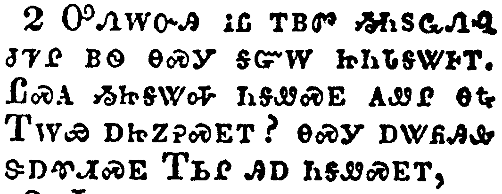</a></td>
</tr>
<tr class="even">
<td>God hath not cast away his people which he foreknew. Wot ye not what the scripture saith of Elias? how he maketh intercession to God against Israel, saying,</td>
</tr>
<tr class="odd">
<td>ᎤᏁᎳᏅᎯ ᎥᏝ ᎢᏴᏛ ᏱᏂᏚᏩᏁᎸ ᏧᏤᎵ ᏴᏫ ᎾᏍᎩ ᎦᏳᎳ ᏥᏂᏓᎦᏔᎰᎢ. ᏝᏍᎪ ᏱᏥᎦᏔᎭ ᏂᎦᏪᏍᎬ ᎪᏪᎵ ᎾᎿᎭᎢᎳᏯ ᎠᏥᏃᎮᏍᎬᎢ? ᎾᏍᎩ ᎠᏔᏲᎯᎲ ᏕᎠᏡᏗᏍᎬ ᎢᏏᎵ ᎯᎠ ᏂᎦᏪᏍᎬᎢ,</td>
</tr>
<tr class="even">
<td>U-ne-la-nv-hi v-tla i-yv-dv yi-ni-du-wa-ne-lv tsu-tse-li yv-wi na-s-gi ga-yu-la tsi-ni-da-ga-ta-ho-i. Tla-s-go yi-tsi-ga-ta-ha ni-ga-we-s-gv go-we-li na-hna I-la-ya a-tsi-no-he-s-gv-i? na-s-gi a-ta-yo-hi-hv de-a-tlu-di-s-gv I-si-li hi-a ni-ga-we-s-gv-i,</td>
</tr>
</tbody>
</table>

<table>
<tbody>
<tr class="odd">
<td><a href="061103.png">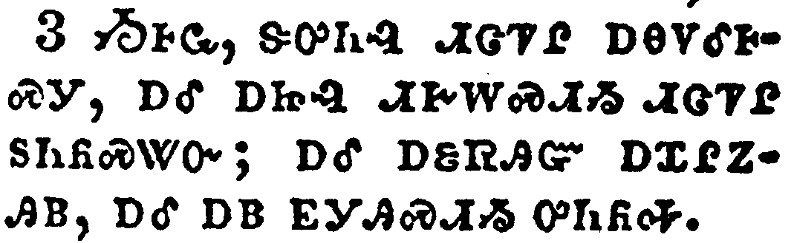</a></td>
</tr>
<tr class="even">
<td>Lord, they have killed thy prophets, and digged down thine altars; and I am left alone, and they seek my life.</td>
</tr>
<tr class="odd">
<td>ᏱᎰᏩ, ᏕᏅᏂᎸ ᏗᏣᏤᎵ ᎠᎾᏙᎴᎰᏍᎩ, ᎠᎴ ᎠᏥᎸ ᏗᎨᎳᏍᏗᏱ ᏗᏣᏤᎵ ᏚᏂᏲᏍᏔᏅ; ᎠᎴ ᎠᏋᏒᎯᏳ ᎠᏆᎵᏃᎯᏴ, ᎠᎴ ᎠᏴ ᎬᎩᎯᏍᏗᏱ ᎤᏂᏲᎭ.</td>
</tr>
<tr class="even">
<td>Yi-ho-wa, de-nv-ni-lv di-tsa-tse-li a-na-do-le-ho-s-gi, a-le a-tsi-lv di-ge-la-s-di-yi di-tsa-tse-li du-ni-yo-s-ta-nv; a-le a-quv-sv-hi-yu a-qua-li-no-hi-yv, a-le a-yv gv-gi-hi-s-di-yi u-ni-yo-ha.</td>
</tr>
</tbody>
</table>

<table>
<tbody>
<tr class="odd">
<td><a href="061104.png">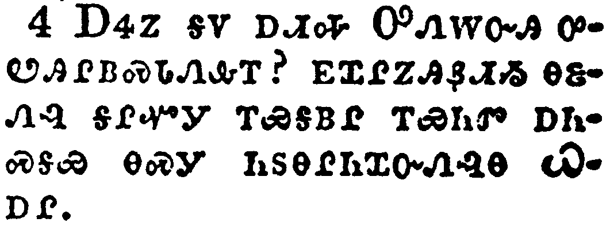</a></td>
</tr>
<tr class="even">
<td>But what saith the answer of God unto him? I have reserved to myself seven thousand men, who have not bowed the knee to the image of Baal.</td>
</tr>
<tr class="odd">
<td>ᎠᏎᏃ ᎦᏙ ᎠᏗᎭ ᎤᏁᎳᏅᎯ ᎤᏬᎯᎵᏴᏍᏓᏁᎲᎢ? ᎬᏆᎵᏃᎯᏰᏗᏱ ᎾᏋᏁᎸ ᎦᎵᏉᎩ ᎢᏯᎦᏴᎵ ᎢᏯᏂᏛ ᎠᏂᏍᎦᏯ ᎾᏍᎩ ᏂᏚᎾᎵᏂᏆᏅᏁᎸᎾ ᏇᎠᎵ.</td>
</tr>
<tr class="even">
<td>A-se-no ga-do a-di-ha U-ne-la-nv-hi u-wo-hi-li-yv-s-da-ne-hv-i? gv-qua-li-no-hi-ye-di-yi na-quv-ne-lv ga-li-quo-gi i-ya-ga-yv-li i-ya-ni-dv a-ni-s-ga-ya na-s-gi ni-du-na-li-ni-qua-nv-ne-lv-na Que-a-li.</td>
</tr>
</tbody>
</table>

<table>
<tbody>
<tr class="odd">
<td><a href="061105.png">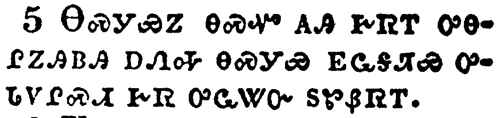</a></td>
</tr>
<tr class="even">
<td>Even so then at this present time also there is a remnant according to the election of grace.</td>
</tr>
<tr class="odd">
<td>ᎾᏍᎩᏯᏃ ᎾᏍᏉ ᎪᎯ ᎨᏒᎢ ᎤᎾᎵᏃᎯᏴᎯ ᎠᏁᎭ ᎾᏍᎩᏯ ᎬᏩᎦᏘᏯ ᎤᏓᏙᎵᏍᏗ ᎨᏒ ᎤᏩᏔᏅ ᏚᏑᏰᏒᎢ.</td>
</tr>
<tr class="even">
<td>Na-s-gi-ya-no na-s-quo go-hi ge-sv-i u-na-li-no-hi-yv-hi a-ne-ha na-s-gi-ya gv-wa-ga-ti-ya u-da-do-li-s-di ge-sv u-wa-ta-nv du-su-ye-sv-i.</td>
</tr>
</tbody>
</table>

<table>
<tbody>
<tr class="odd">
<td><a href="061106.png">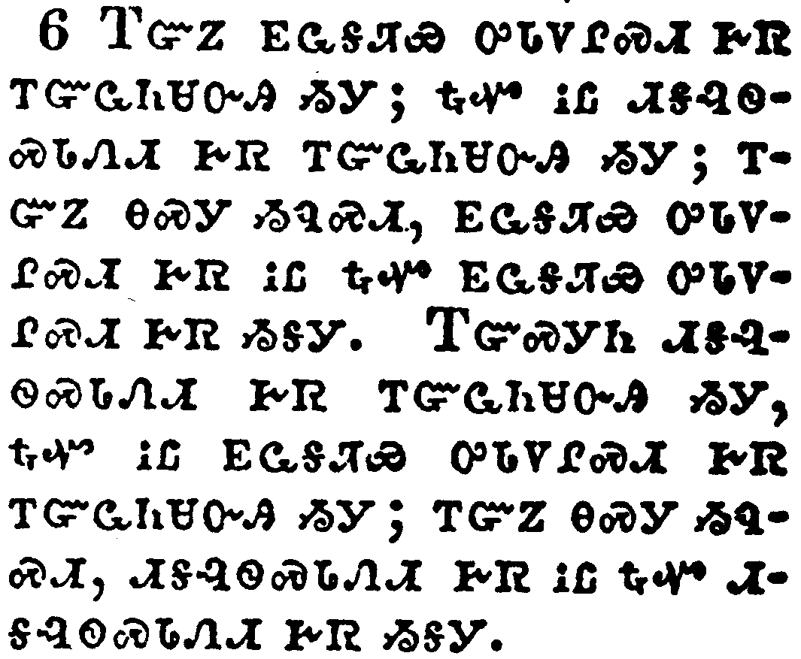</a></td>
</tr>
<tr class="even">
<td>And if by grace, then is it no more of works: otherwise grace is no more grace. But if it be of works, then is it no more grace: otherwise work is no more work.</td>
</tr>
<tr class="odd">
<td>ᎢᏳᏃ ᎬᏩᎦᏘᏯ ᎤᏓᏙᎵᏍᏗ ᎨᏒ ᎢᏳᏩᏂᏌᏅᎯ ᏱᎩ; ᎿᎭᏉ ᎥᏝ ᏗᎦᎸᏫᏍᏓᏁᏗ ᎨᏒ ᎢᏳᏩᏂᏌᏅᎯ ᏱᎩ; ᎢᏳᏃ ᎾᏍᎩ ᏱᏄᏍᏗ, ᎬᏩᎦᏘᏯ ᎤᏓᏙᎵᏍᏗ ᎨᏒ ᎥᏝ ᎿᎭᏉ ᎬᏩᎦᏘᏯ ᎤᏓᏙᎵᏍᏗ ᎨᏒ ᏱᎦᎩ. ᎢᏳᏍᎩᏂ ᏗᎦᎸᏫᏍᏓᏁᏗ ᎨᏒ ᎢᏳᏩᏂᏌᏅᎯ ᏱᎩ, ᎿᎭᏉ ᎥᏝ ᎬᏩᎦᏘᏯ ᎤᏓᏙᎵᏍᏗ ᎨᏒ ᎢᏳᏩᏂᏌᏅᎯ ᏱᎩ; ᎢᏳᏃ ᎾᏍᎩ ᏱᏄᏍᏗ, ᏗᎦᎸᏫᏍᏓᏁᏗ ᎨᏒ ᎥᏝ ᎿᎭᏉ ᏗᎦᎸᏫᏍᏓᏁᏗ ᎨᏒ ᏱᎦᎩ.</td>
</tr>
<tr class="even">
<td>I-yu-no gv-wa-ga-ti-ya u-da-do-li-s-di ge-sv i-yu-wa-ni-sa-nv-hi yi-gi; hna-quo v-tla di-ga-lv-wi-s-da-ne-di ge-sv i-yu-wa-ni-sa-nv-hi yi-gi; i-yu-no na-s-gi yi-nu-s-di, gv-wa-ga-ti-ya u-da-do-li-s-di ge-sv v-tla hna-quo gv-wa-ga-ti-ya u-da-do-li-s-di ge-sv yi-ga-gi. I-yu-s-gi-ni di-ga-lv-wi-s-da-ne-di ge-sv i-yu-wa-ni-sa-nv-hi yi-gi, hna-quo v-tla gv-wa-ga-ti-ya u-da-do-li-s-di ge-sv i-yu-wa-ni-sa-nv-hi yi-gi; i-yu-no na-s-gi yi-nu-s-di, di-ga-lv-wi-s-da-ne-di ge-sv v-tla hna-quo di-ga-lv-wi-s-da-ne-di ge-sv yi-ga-gi.</td>
</tr>
</tbody>
</table>

<table>
<tbody>
<tr class="odd">
<td><a href="061107.png">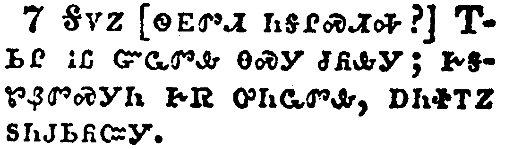</a></td>
</tr>
<tr class="even">
<td>What then? Israel hath not obtained that which he seeketh for; but the election hath obtained it, and the rest were blinded</td>
</tr>
<tr class="odd">
<td>ᎦᏙᏃ [ᏫᎬᏛᏗ ᏂᎦᎵᏍᏗᎭ?] ᎢᏏᎵ ᎥᏝ ᏳᏩᏛᎲ ᎾᏍᎩ ᏧᏲᎲᎩ; ᎨᎦᏑᏰᏛᏍᎩᏂ ᎨᏒ ᎤᏂᏩᏛᎲ, ᎠᏂᏐᎢᏃ ᏚᏂᎫᏏᏲᏨᎩ.</td>
</tr>
<tr class="even">
<td>Ga-do-no [wi-gv-dv-di ni-ga-li-s-di-ha?] I-si-li v-tla yu-wa-dv-hv na-s-gi tsu-yo-hv-gi; ge-ga-su-ye-dv-s-gi-ni ge-sv u-ni-wa-dv-hv, a-ni-so-i-no du-ni-gu-si-yo-tsv-gi.</td>
</tr>
</tbody>
</table>

<table>
<tbody>
<tr class="odd">
<td><a href="061108.png">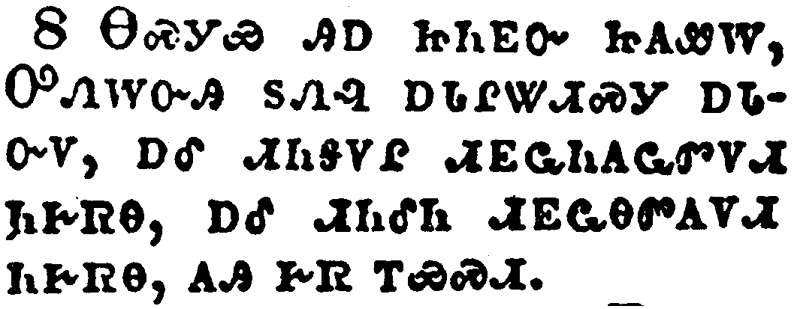</a></td>
</tr>
<tr class="even">
<td>(According as it is written, God hath given them the spirit of slumber, eyes that they should not see, and ears that they should not hear;) unto this day.</td>
</tr>
<tr class="odd">
<td>ᎾᏍᎩᏯ ᎯᎠ ᏥᏂᎬᏅ ᏥᎪᏪᎳ, ᎤᏁᎳᏅᎯ ᏚᏁᎸ ᎠᏓᎵᏔᏗᏍᎩ ᎠᏓᏅᏙ, ᎠᎴ ᏗᏂᎦᏙᎵ ᏗᎬᏩᏂᎪᏩᏛᏙᏗ ᏂᎨᏒᎾ, ᎠᎴ ᏗᏂᎴᏂ ᏗᎬᏩᎾᏛᎪᏙᏗ ᏂᎨᏒᎾ, ᎪᎯ ᎨᏒ ᎢᏯᏍᏗ.</td>
</tr>
<tr class="even">
<td>Na-s-gi-ya hi-a tsi-ni-gv-nv tsi-go-we-la, U-ne-la-nv-hi du-ne-lv a-da-li-ta-di-s-gi a-da-nv-do, a-le di-ni-ga-do-li di-gv-wa-ni-go-wa-dv-do-di ni-ge-sv-na, a-le di-ni-le-ni di-gv-wa-na-dv-go-do-di ni-ge-sv-na, go-hi ge-sv i-ya-s-di.</td>
</tr>
</tbody>
</table>

<table>
<tbody>
<tr class="odd">
<td><a href="061109.png">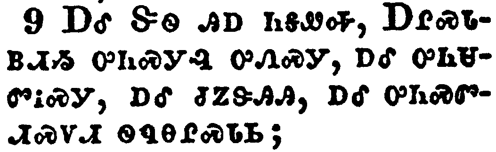</a></td>
</tr>
<tr class="even">
<td>And David saith, Let their table be made a snare, and a trap, and a stumbling block, and a recompence unto them:</td>
</tr>
<tr class="odd">
<td>ᎠᎴ ᏕᏫ ᎯᎠ ᏂᎦᏪᎭ, ᎠᎵᏍᏓᏴᏗᏱ ᎤᏂᏍᎩᎸ ᎤᏁᏍᎩ, ᎠᎴ ᎤᏂᏌᏛᎥᏍᎩ, ᎠᎴ ᏧᏃᏕᎯᎯ, ᎠᎴ ᎤᏂᏍᏛᏗᏍᏙᏗ ᏫᏄᎾᎵᏍᏓᏏ;</td>
</tr>
<tr class="even">
<td>A-le De-wi hi-a ni-ga-we-ha, A-li-s-da-yv-di-yi u-ni-s-gi-lv u-ne-s-gi, a-le u-ni-sa-dv-v-s-gi, a-le tsu-no-de-hi-hi, a-le u-ni-s-dv-di-s-do-di wi-nu-na-li-s-da-si;</td>
</tr>
</tbody>
</table>

<table>
<tbody>
<tr class="odd">
<td><a href="061110.png">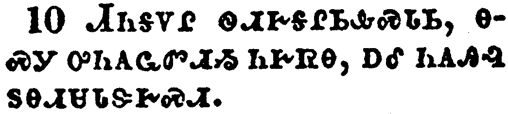</a></td>
</tr>
<tr class="even">
<td>Let their eyes be darkened, that they may not see, and bow down their back always.</td>
</tr>
<tr class="odd">
<td>ᏗᏂᎦᏙᎵ ᏫᏗᎨᎦᎵᏏᎲᏍᏓᏏ, ᎾᏍᎩ ᎤᏂᎪᏩᏛᏗᏱ ᏂᎨᏒᎾ, ᎠᎴ ᏂᎪᎯᎸ ᏚᎾᏗᏌᏓᏕᎨᏍᏗ.</td>
</tr>
<tr class="even">
<td>Di-ni-ga-do-li wi-di-ge-ga-li-si-hv-s-da-si, na-s-gi u-ni-go-wa-dv-di-yi ni-ge-sv-na, a-le ni-go-hi-lv du-na-di-sa-da-de-ge-s-di.</td>
</tr>
</tbody>
</table>

<table>
<tbody>
<tr class="odd">
<td><a href="061111.png">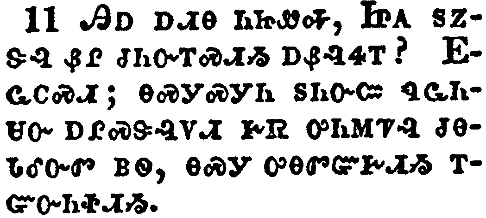</a></td>
</tr>
<tr class="even">
<td>I say then, Have they stumbled that they should fall? God forbid: but rather through their fall salvation is come unto the Gentiles, for to provoke them to jealousy.</td>
</tr>
<tr class="odd">
<td>ᎯᎠ ᎠᏗᎾ ᏂᏥᏪᎭ, ᏥᎪ ᏚᏃᏕᎸ ᏰᎵ ᏧᏂᏅᎢᏍᏗᏱ ᎠᏰᎸᏎᎢ? ᎬᏩᏟᏍᏗ; ᎾᏍᎩᏍᎩᏂ ᏚᏂᏅᏨ ᏄᏩᏂᏌᏅ ᎠᎵᏍᏕᎸᏙᏗ ᎨᏒ ᎤᏂᎷᏤᎸ ᏧᎾᏓᎴᏅᏛ ᏴᏫ, ᎾᏍᎩ ᎤᎾᏛᏳᎨᏗᏱ ᎢᏳᏅᏂᏐᏗᏱ.</td>
</tr>
<tr class="even">
<td>Hi-a a-di-na ni-tsi-we-ha, Tsi-go du-no-de-lv ye-li tsu-ni-nv-i-s-di-yi a-ye-lv-se-i? Gv-wa-tli-s-di; na-s-gi-s-gi-ni du-ni-nv-tsv nu-wa-ni-sa-nv a-li-s-de-lv-do-di ge-sv u-ni-lu-tse-lv tsu-na-da-le-nv-dv yv-wi, na-s-gi u-na-dv-yu-ge-di-yi i-yu-nv-ni-so-di-yi.</td>
</tr>
</tbody>
</table>

<table>
<tbody>
<tr class="odd">
<td><a href="061112.png">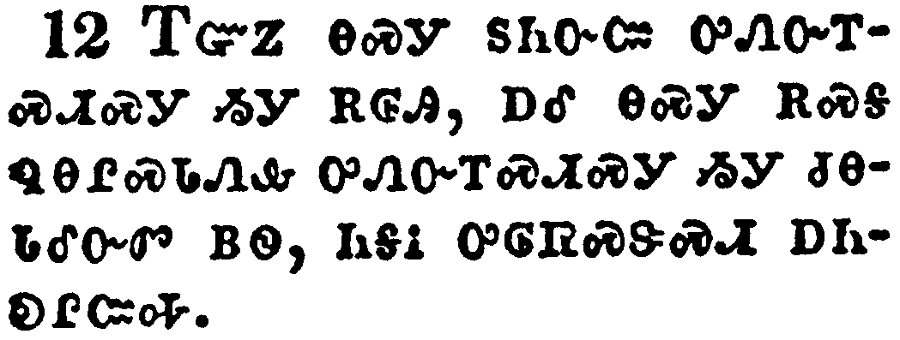</a></td>
</tr>
<tr class="even">
<td>Now if the fall of them be the riches of the world, and the diminishing of them the riches of the Gentiles; how much more their fullness?</td>
</tr>
<tr class="odd">
<td>ᎢᏳᏃ ᎾᏍᎩ ᏚᏂᏅᏨ ᎤᏁᏅᎢᏍᏗᏍᎩ ᏱᎩ ᎡᎶᎯ, ᎠᎴ ᎾᏍᎩ ᎡᏍᎦ ᏄᎾᎵᏍᏓᏁᎲ ᎤᏁᏅᎢᏍᏗᏍᎩ ᏱᎩ ᏧᎾᏓᎴᏅᏛ ᏴᏫ, ᏂᎦᎥ ᎤᎶᏒᏍᏕᏍᏗ ᎠᏂᎧᎵᏨᎭ.</td>
</tr>
<tr class="even">
<td>I-yu-no na-s-gi du-ni-nv-tsv u-ne-nv-i-s-di-s-gi yi-gi e-lo-hi, a-le na-s-gi e-s-ga nu-na-li-s-da-ne-hv u-ne-nv-i-s-di-s-gi yi-gi tsu-na-da-le-nv-dv yv-wi, ni-ga-v u-lo-sv-s-de-s-di a-ni-ka-li-tsv-ha.</td>
</tr>
</tbody>
</table>

<table>
<tbody>
<tr class="odd">
<td><a href="061113.png">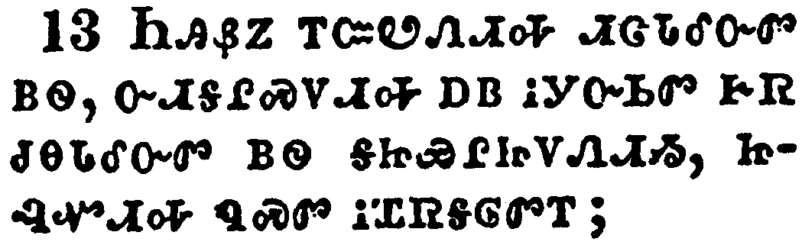</a></td>
</tr>
<tr class="even">
<td>For I speak to you Gentiles, inasmuch as I am the apostle of the Gentiles, I magnify mine office:</td>
</tr>
<tr class="odd">
<td>ᏂᎯᏰᏃ ᎢᏨᏬᏁᏗᎭ ᏗᏣᏓᎴᏅᏛ ᏴᏫ, ᏅᏗᎦᎵᏍᏙᏗᎭ ᎠᏴ ᎥᎩᏅᏏᏛ ᎨᏒ ᏧᎾᏓᎴᏅᏛ ᏴᏫ ᎦᏥᏯᎵᏥᏙᏁᏗᏱ, ᏥᎸᏉᏗᎭ ᏄᏍᏛ ᎥᏆᏒᎦᎶᏛᎢ;</td>
</tr>
<tr class="even">
<td>Ni-hi-ye-no i-tsv-wo-ne-di-ha di-tsa-da-le-nv-dv yv-wi, nv-di-ga-li-s-do-di-ha a-yv v-gi-nv-si-dv ge-sv tsu-na-da-le-nv-dv yv-wi ga-tsi-ya-li-tsi-do-ne-di-yi, tsi-lv-quo-di-ha nu-s-dv v-qua-sv-ga-lo-dv-i;</td>
</tr>
</tbody>
</table>

<table>
<tbody>
<tr class="odd">
<td><a href="061114.png">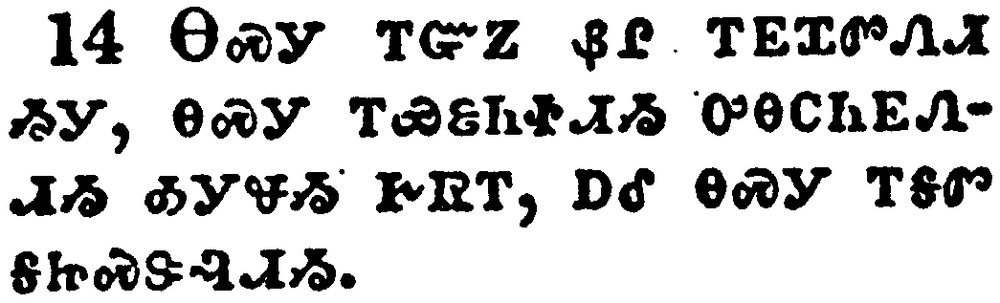</a></td>
</tr>
<tr class="even">
<td>If by any means I may provoke to emulation them which are my flesh, and might save some of them.</td>
</tr>
<tr class="odd">
<td>ᎾᏍᎩ ᎢᏳᏃ ᏰᎵ ᎢᎬᏆᏛᏁᏗ ᏱᎩ, ᎾᏍᎩ ᎢᏯᏋᏂᏐᏗᏱ ᎤᎾᏟᏂᎬᏁᏗᏱ ᎣᎩᏠᏱ ᎨᏒᎢ, ᎠᎴ ᎾᏍᎩ ᎢᎦᏛ ᎦᏥᏍᏕᎸᏗᏱ.</td>
</tr>
<tr class="even">
<td>Na-s-gi i-yu-no ye-li i-gv-qua-dv-ne-di yi-gi, na-s-gi i-ya-quv-ni-so-di-yi u-na-tli-ni-gv-ne-di-yi o-gi-tlo-yi ge-sv-i, a-le na-s-gi i-ga-dv ga-tsi-s-de-lv-di-yi.</td>
</tr>
</tbody>
</table>

<table>
<tbody>
<tr class="odd">
<td><a href="061115.png">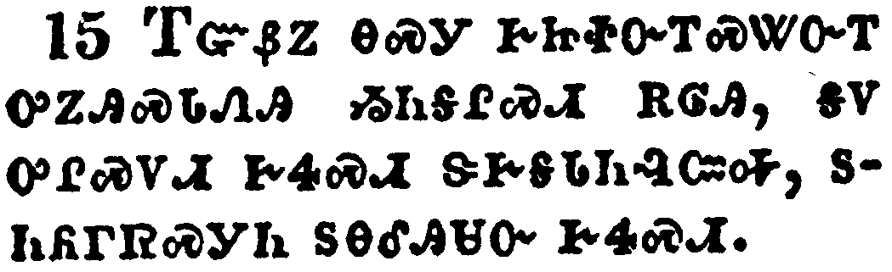</a></td>
</tr>
<tr class="even">
<td>For if the casting away of them be the reconciling of the world, what shall the receiving of them be, but life from the dead?</td>
</tr>
<tr class="odd">
<td>ᎢᏳᏰᏃ ᎾᏍᎩ ᎨᏥᏐᏅᎢᏍᏔᏅᎢ ᎤᏃᎯᏍᏓᏁᎯ ᏱᏂᎦᎵᏍᏗ ᎡᎶᎯ, ᎦᏙ ᎤᎵᏍᏙᏗ ᎨᏎᏍᏗ ᏕᎨᎦᏓᏂᎸᏨᎭ, ᏚᏂᏲᎱᏒᏍᎩᏂ ᏚᎾᎴᎯᏌᏅ ᎨᏎᏍᏗ.</td>
</tr>
<tr class="even">
<td>I-yu-ye-no na-s-gi ge-tsi-so-nv-i-s-ta-nv-i u-no-hi-s-da-ne-hi yi-ni-ga-li-s-di e-lo-hi, ga-do u-li-s-do-di ge-se-s-di de-ge-ga-da-ni-lv-tsv-ha, du-ni-yo-hu-sv-s-gi-ni du-na-le-hi-sa-nv ge-se-s-di.</td>
</tr>
</tbody>
</table>

<table>
<tbody>
<tr class="odd">
<td><a href="061116.png">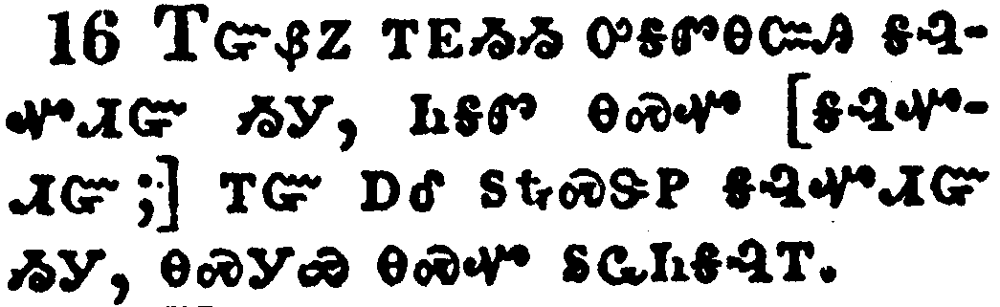</a></td>
</tr>
<tr class="even">
<td>For if the firstfruit be holy, the lump is also holy: and if the root be holy, so are the branches.</td>
</tr>
<tr class="odd">
<td>ᎢᏳᏰᏃ ᎢᎬᏱᏱ ᎤᎬᏛᎾᏨᎯ ᎦᎸᏉᏗᏳ ᏱᎩ, ᏂᎦᏛ ᎾᏍᏉ [ᎦᎸᏉᏗᏳ;] ᎢᏳ ᎠᎴ ᏚᎿᎭᏍᏕᏢ ᎦᎸᏉᏗᏳ ᏱᎩ, ᎾᏍᎩᏯ ᎾᏍᏉ ᏚᏩᏂᎦᎸᎢ.</td>
</tr>
<tr class="even">
<td>I-yu-ye-no i-gv-yi-yi u-gv-dv-na-tsv-hi ga-lv-quo-di-yu yi-gi, ni-ga-dv na-s-quo [ga-lv-quo-di-yu;] i-yu a-le du-hna-s-de-tlv ga-lv-quo-di-yu yi-gi, na-s-gi-ya na-s-quo du-wa-ni-ga-lv-i.</td>
</tr>
</tbody>
</table>

<table>
<tbody>
<tr class="odd">
<td><a href="061117.png">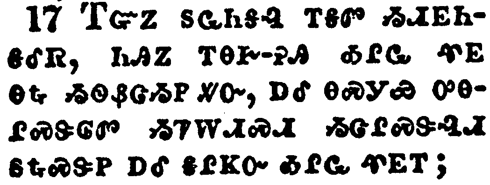</a></td>
</tr>
<tr class="even">
<td>And if some of the branches be broken off, and thou, being a wild olive tree, wert graffed in among them, and with them partakest of the root and fatness of the olive tree;</td>
</tr>
<tr class="odd">
<td>ᎢᏳᏃ ᏚᏩᏂᎦᎸ ᎢᎦᏛ ᏱᏗᎬᏂᎦᎴᏒ, ᏂᎯᏃ ᎢᎾᎨ-ᎮᎯ ᎣᎵᏩ ᏡᎬ ᎾᎿᎭᏱᏫᏰᏣᏱᏢᏔᏅ, ᎠᎴ ᎾᏍᎩᏯ ᎤᎾᎵᏍᏕᎶᏛ ᏱᏤᎳᏗᏍᏗ ᏱᏣᎵᏍᏕᎸᏗ ᏚᎿᎭᏍᏕᏢ ᎠᎴ ᎦᎵᏦᏅ ᎣᎵᏩ ᏡᎬᎢ;</td>
</tr>
<tr class="even">
<td>I-yu-no du-wa-ni-ga-lv i-ga-dv yi-di-gv-ni-ga-le-sv, ni-hi-no i-na-ge--he-hi o-li-wa tlu-gv na-hna yi-wi-ye-tsa-yi-tlv-ta-nv, a-le na-s-gi-ya u-na-li-s-de-lo-dv yi-tse-la-di-s-di yi-tsa-li-s-de-lv-di du-hna-s-de-tlv a-le ga-li-tso-nv o-li-wa tlu-gv-i;</td>
</tr>
</tbody>
</table>

<table>
<tbody>
<tr class="odd">
<td><a href="061118.png">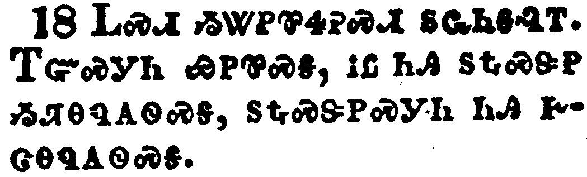</a></td>
</tr>
<tr class="even">
<td>Boast not against the branches. But if thou boast, thou bearest not the root, but the root thee.</td>
</tr>
<tr class="odd">
<td>ᏞᏍᏗ ᏱᏔᏢᏈᏎᎮᏍᏗ ᏚᏩᏂᎦᎸᎢ. ᎢᏳᏍᎩᏂ ᏯᏢᏈᏍᎦ, ᎥᏝ ᏂᎯ ᏚᎿᎭᏍᏕᏢ ᏱᏘᎾᏄᎪᏫᏍᎦ, ᏚᎿᎭᏍᏕᏢᏍᎩᏂ ᏂᎯ ᎨᏣᎾᏄᎪᏫᏍᎦ.</td>
</tr>
<tr class="even">
<td>Tle-s-di yi-ta-tlv-qui-se-he-s-di du-wa-ni-ga-lv-i. I-yu-s-gi-ni ya-tlv-qui-s-ga, v-tla ni-hi du-hna-s-de-tlv yi-ti-na-nu-go-wi-s-ga, du-hna-s-de-tlv-s-gi-ni ni-hi ge-tsa-na-nu-go-wi-s-ga.</td>
</tr>
</tbody>
</table>

<table>
<tbody>
<tr class="odd">
<td><a href="061119.png">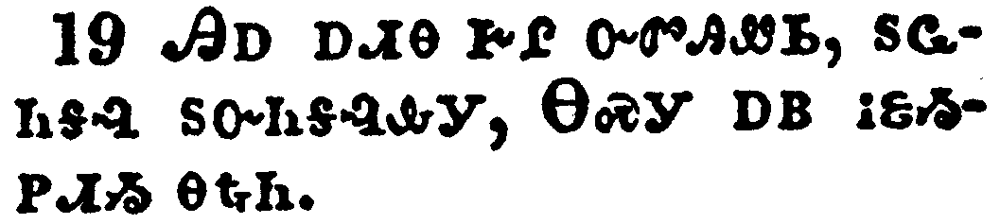</a></td>
</tr>
<tr class="even">
<td>Thou wilt say then, The branches were broken off, that I might be graffed in.</td>
</tr>
<tr class="odd">
<td>ᎯᎠ ᎠᏗᎾ ᎨᎵ ᏅᏛᎯᏪᏏ, ᏚᏩᏂᎦᎸ ᏚᏅᏂᎦᎸᎲᎩ, ᎾᏍᎩ ᎠᏴ ᎥᏋᏱᏢᏗᏱ ᎾᎿᎭᏂ.</td>
</tr>
<tr class="even">
<td>Hi-a a-di-na ge-li nv-dv-hi-we-si, du-wa-ni-ga-lv du-nv-ni-ga-lv-hv-gi, Na-s-gi a-yv v-quv-yi-tlv-di-yi na-hna-ni.</td>
</tr>
</tbody>
</table>

<table>
<tbody>
<tr class="odd">
<td><a href="061120.png">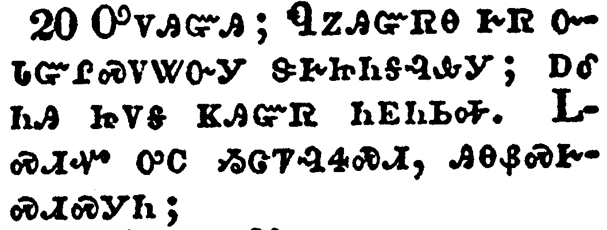</a></td>
</tr>
<tr class="even">
<td>Well; because of unbelief they were broken off, and thou standest by faith. Be not highminded, but fear:</td>
</tr>
<tr class="odd">
<td>ᎤᏙᎯᏳᎯ; ᏄᏃᎯᏳᏒᎾ ᎨᏒ ᏅᏓᏳᎵᏍᏙᏔᏅᎩ ᏕᎨᏥᏂᎦᎸᎲᎩ; ᎠᎴ ᏂᎯ ᏥᏙᎦ ᏦᎯᏳᏒ ᏂᎬᏂᏏᎭ. ᏞᏍᏗᏉ ᎤᏟ ᏱᏣᏤᎸᏎᏍᏗ, ᎯᎾᏰᏍᎨᏍᏗᏍᎩᏂ;</td>
</tr>
<tr class="even">
<td>U-do-hi-yu-hi; Nu-no-hi-yu-sv-na ge-sv nv-da-yu-li-s-do-ta-nv-gi de-ge-tsi-ni-ga-lv-hv-gi; a-le ni-hi tsi-do-ga tso-hi-yu-sv ni-gv-ni-si-ha. Tle-s-di-quo u-tli yi-tsa-tse-lv-se-s-di, hi-na-ye-s-ge-s-di-s-gi-ni;</td>
</tr>
</tbody>
</table>

<table>
<tbody>
<tr class="odd">
<td><a href="061121.png">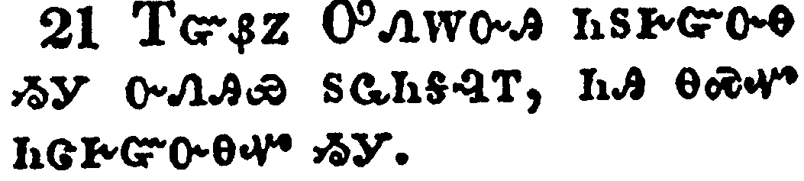</a></td>
</tr>
<tr class="even">
<td>For if God spared not the natural branches, take heed lest he also spare not thee.</td>
</tr>
<tr class="odd">
<td>ᎢᏳᏰᏃ ᎤᏁᎳᏅᎯ ᏂᏚᎨᏳᏅᎾ ᏱᎩ ᏅᏁᎯᏯ ᏚᏩᏂᎦᎸᎢ, ᏂᎯ ᎾᏍᏉ ᏂᏣᎨᏳᏅᎾᏉ ᏱᎩ.</td>
</tr>
<tr class="even">
<td>I-yu-ye-no U-ne-la-nv-hi ni-du-ge-yu-nv-na yi-gi nv-ne-hi-ya du-wa-ni-ga-lv-i, ni-hi na-s-quo ni-tsa-ge-yu-nv-na-quo yi-gi.</td>
</tr>
</tbody>
</table>

<table>
<tbody>
<tr class="odd">
<td><a href="061122.png">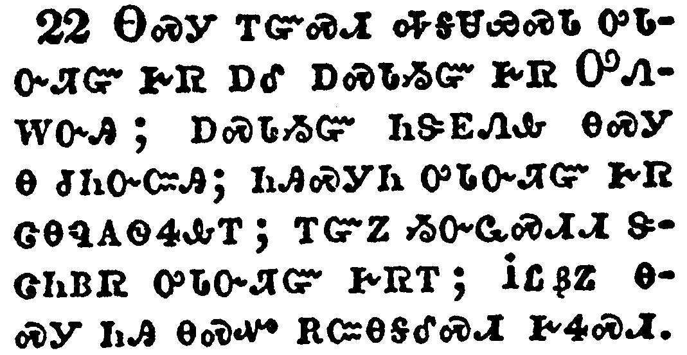</a></td>
</tr>
<tr class="even">
<td>Behold therefore the goodness and severity of God: on them which fell, severity; but toward thee, goodness, if thou continue in his goodness: otherwise thou also shalt be cut off.</td>
</tr>
<tr class="odd">
<td>ᎾᏍᎩ ᎢᏳᏍᏗ ᎭᎦᏌᏯᏍᏓ ᎤᏓᏅᏖᏳ ᎨᏒ ᎠᎴ ᎠᏍᏓᏱᏳ ᎨᏒ ᎤᏁᎳᏅᎯ; ᎠᏍᏓᏱᏳ ᏂᏕᎬᏁᎲ ᎾᏍᎩ Ꮎ ᏧᏂᏅᏨᎯ; ᏂᎯᏍᎩᏂ ᎤᏓᏅᏘᏳ ᎨᏒ ᏣᎾᏄᎪᏫᏎᎲᎢ; ᎢᏳᏃ ᏱᏅᏩᏍᏗᏗ ᏕᏣᏂᏴᏒ ᎤᏓᏅᏘᏳ ᎨᏒᎢ; ᎥᏝᏰᏃ ᎾᏍᎩ ᏂᎯ ᎾᏍᏉ ᎡᏨᎾᎦᎴᏍᏗ ᎨᏎᏍᏗ.</td>
</tr>
<tr class="even">
<td>Na-s-gi i-yu-s-di ha-ga-sa-ya-s-da u-da-nv-te-yu ge-sv a-le a-s-da-yi-yu ge-sv U-ne-la-nv-hi; a-s-da-yi-yu ni-de-gv-ne-hv na-s-gi na tsu-ni-nv-tsv-hi; ni-hi-s-gi-ni u-da-nv-ti-yu ge-sv tsa-na-nu-go-wi-se-hv-i; i-yu-no yi-nv-wa-s-di-di de-tsa-ni-yv-sv u-da-nv-ti-yu ge-sv-i; V-tla-ye-no na-s-gi ni-hi na-s-quo e-tsv-na-ga-le-s-di ge-se-s-di.</td>
</tr>
</tbody>
</table>

<table>
<tbody>
<tr class="odd">
<td><a href="061123.png">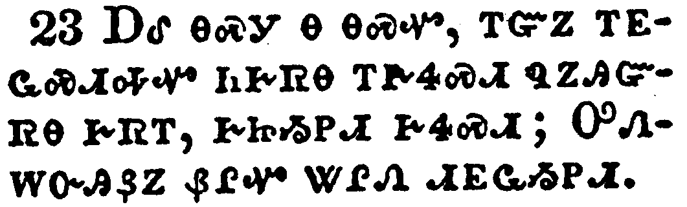</a></td>
</tr>
<tr class="even">
<td>And they also, if they abide not still in unbelief, shall be graffed in: for God is able to graff them in again.</td>
</tr>
<tr class="odd">
<td>ᎠᎴ ᎾᏍᎩ Ꮎ ᎾᏍᏉ, ᎢᏳᏃ ᎢᎬᏩᏍᏗᎭᏉ ᏂᎨᏒᎾ ᎢᎨᏎᏍᏗ ᏄᏃᎯᏳᏒᎾ ᎨᏒᎢ, ᎨᏥᏱᏢᏗ ᎨᏎᏍᏗ; ᎤᏁᎳᏅᎯᏰᏃ ᏰᎵᏉ ᏔᎵᏁ ᏗᎬᏩᏱᏢᏗ.</td>
</tr>
<tr class="even">
<td>A-le na-s-gi na na-s-quo, i-yu-no i-gv-wa-s-di-ha-quo ni-ge-sv-na i-ge-se-s-di nu-no-hi-yu-sv-na ge-sv-i, ge-tsi-yi-tlv-di ge-se-s-di; U-ne-la-nv-hi-ye-no ye-li-quo ta-li-ne di-gv-wa-yi-tlv-di.</td>
</tr>
</tbody>
</table>

<table>
<tbody>
<tr class="odd">
<td><a href="061124.png">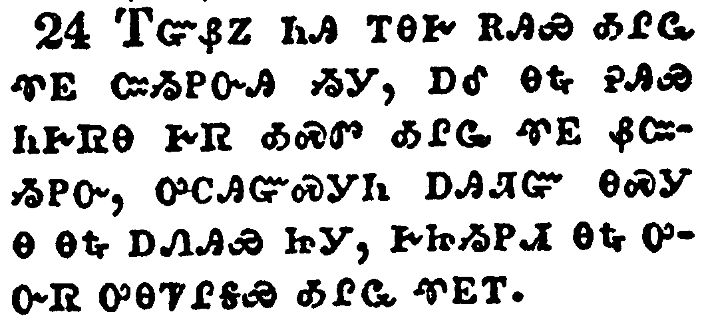</a></td>
</tr>
<tr class="even">
<td>For if thou wert cut out of the olive tree which is wild by nature, and wert graffed contrary to nature into a good olive tree: how much more shall these, which be the natural branches, be graffed into their own olive tree?</td>
</tr>
<tr class="odd">
<td>ᎢᏳᏰᏃ ᏂᎯ ᎢᎾᎨ ᎡᎯᏯ ᎣᎵᏩ ᏡᎬ ᏨᏱᏢᏅᎯ ᏱᎩ, ᎠᎴ ᎾᎿᎭᎮᎯᏯ ᏂᎨᏒᎾ ᎨᏒ ᎣᏍᏛ ᎣᎵᏩ ᏡᎬ ᏰᏨᏱᏢᏅ, ᎤᏟᎯᏳᏍᎩᏂ ᎠᎯᏘᏳ ᎾᏍᎩ Ꮎ ᎾᎿᎭᎠᏁᎯᏯ ᏥᎩ, ᎨᏥᏱᏢᏗ ᎾᎿᎭᎤᏅᏒ ᎤᎾᏤᎵᎦᏯ ᎣᎵᏩ ᏡᎬᎢ.</td>
</tr>
<tr class="even">
<td>I-yu-ye-no ni-hi i-na-ge e-hi-ya o-li-wa tlu-gv tsv-yi-tlv-nv-hi yi-gi, a-le na-hna he-hi-ya ni-ge-sv-na ge-sv o-s-dv o-li-wa tlu-gv ye-tsv-yi-tlv-nv, u-tli-hi-yu-s-gi-ni a-hi-ti-yu na-s-gi na na-hna a-ne-hi-ya tsi-gi, ge-tsi-yi-tlv-di na-hna u-nv-sv u-na-tse-li-ga-ya o-li-wa tlu-gv-i.</td>
</tr>
</tbody>
</table>

<table>
<tbody>
<tr class="odd">
<td><a href="061125.png">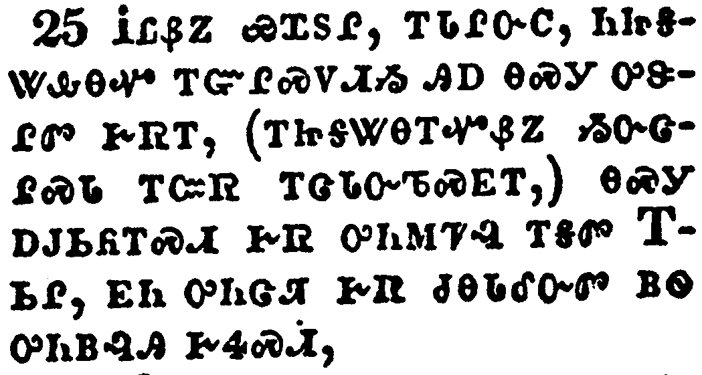</a></td>
</tr>
<tr class="even">
<td>For I would not, brethren, that ye should be ignorant of this mystery, lest ye should be wise in your own conceits; that blindness in part is happened to Israel, until the fullness of the Gentiles be come in.</td>
</tr>
<tr class="odd">
<td>ᎥᏝᏰᏃ ᏯᏆᏚᎵ, ᎢᏓᎵᏅᏟ, ᏂᏥᎦᏔᎲᎾᏉ ᎢᏳᎵᏍᏙᏗᏱ ᎯᎠ ᎾᏍᎩ ᎤᏕᎵᏛ ᎨᏒᎢ, (ᎢᏥᎦᏔᎾᎢᏉᏰᏃ ᏱᏅᏣᎵᏍᏓ ᎢᏨᏒ ᎢᏣᏓᏅᏖᏍᎬᎢ,) ᎾᏍᎩ ᎠᎫᏏᏲᎢᏍᏗ ᎨᏒ ᎤᏂᎷᏤᎸ ᎢᎦᏛ ᎢᏏᎵ, ᎬᏂ ᎤᏂᏣᏘ ᎨᏒ ᏧᎾᏓᎴᏅᏛ ᏴᏫ ᎤᏂᏴᎸᎯ ᎨᏎᏍᏗ,</td>
</tr>
<tr class="even">
<td>V-tla-ye-no ya-qua-du-li, i-da-li-nv-tli, ni-tsi-ga-ta-hv-na-quo i-yu-li-s-do-di-yi hi-a na-s-gi u-de-li-dv ge-sv-i, (i-tsi-ga-ta-na-i-quo-ye-no yi-nv-tsa-li-s-da i-tsv-sv i-tsa-da-nv-te-s-gv-i,) na-s-gi a-gu-si-yo-i-s-di ge-sv u-ni-lu-tse-lv i-ga-dv I-si-li, gv-ni u-ni-tsa-ti ge-sv tsu-na-da-le-nv-dv yv-wi u-ni-yv-lv-hi ge-se-s-di,</td>
</tr>
</tbody>
</table>

<table>
<tbody>
<tr class="odd">
<td><a href="061126.png">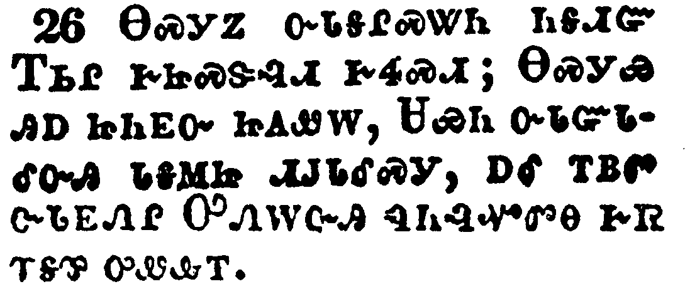</a></td>
</tr>
<tr class="even">
<td>And so all Israel shall be saved: as it is written, There shall come out of Sion the Deliverer, and shall turn away ungodliness from Jacob:</td>
</tr>
<tr class="odd">
<td>ᎾᏍᎩᏃ ᏅᏓᎦᎵᏍᏔᏂ ᏂᎦᏗᏳ ᎢᏏᎵ ᎨᏥᏍᏕᎸᏗ ᎨᏎᏍᏗ; ᎾᏍᎩᏯ ᎯᎠ ᏥᏂᎬᏅ ᏥᎪᏪᎳ, ᏌᏯᏂ ᏅᏓᏳᏓᎴᏅᎯ ᏓᎦᎷᏥ ᏗᎫᏓᎴᏍᎩ, ᎠᎴ ᎢᏴᏛ ᏅᏓᎬᏁᎵ ᎤᏁᎳᏅᎯ ᏄᏂᎸᏉᏛᎾ ᎨᏒ ᎢᎦᏈ ᎤᏪᎲᎢ.</td>
</tr>
<tr class="even">
<td>Na-s-gi-no nv-da-ga-li-s-ta-ni ni-ga-di-yu I-si-li ge-tsi-s-de-lv-di ge-se-s-di; Na-s-gi-ya hi-a tsi-ni-gv-nv tsi-go-we-la, Sa-ya-ni nv-da-yu-da-le-nv-hi da-ga-lu-tsi di-gu-da-le-s-gi, a-le i-yv-dv nv-da-gv-ne-li U-ne-la-nv-hi nu-ni-lv-quo-dv-na ge-sv i-ga-qui u-we-hv-i.</td>
</tr>
</tbody>
</table>

<table>
<tbody>
<tr class="odd">
<td><a href="061127.png">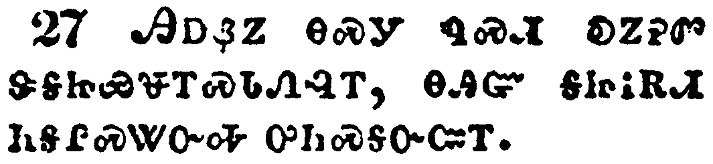</a></td>
</tr>
<tr class="even">
<td>For this is my covenant unto them, when I shall take away their sins.</td>
</tr>
<tr class="odd">
<td>ᎯᎠᏰᏃ ᎾᏍᎩ ᏄᏍᏗ ᎧᏃᎮᏛ ᏕᎦᏥᏯᏠᎢᏍᏓᏁᎸᎢ, ᎾᎯᏳ ᎦᏥᎥᎡᏗ ᏂᎦᎵᏍᏔᏅᎭ ᎤᏂᏍᎦᏅᏨᎢ.</td>
</tr>
<tr class="even">
<td>Hi-a-ye-no na-s-gi nu-s-di ka-no-he-dv de-ga-tsi-ya-tlo-i-s-da-ne-lv-i, na-hi-yu ga-tsi-v-e-di ni-ga-li-s-ta-nv-ha u-ni-s-ga-nv-tsv-i.</td>
</tr>
</tbody>
</table>

<table>
<tbody>
<tr class="odd">
<td><a href="061128.png">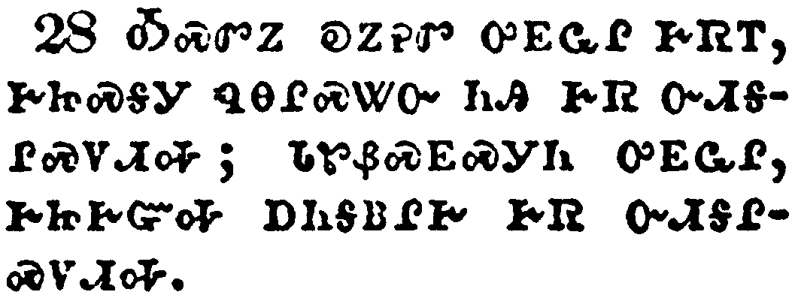</a></td>
</tr>
<tr class="even">
<td>As concerning the gospel, they are enemies for your sakes: but as touching the election, they are beloved for the fathers' sakes.</td>
</tr>
<tr class="odd">
<td>ᎣᏍᏛᏃ ᎧᏃᎮᏛ ᎤᎬᏩᎵ ᎨᏒᎢ, ᎨᏥᏍᎦᎩ ᏄᎾᎵᏍᏔᏅ ᏂᎯ ᎨᏒ ᏅᏗᎦᎵᏍᏙᏗᎭ; ᏓᏑᏰᏍᎬᏍᎩᏂ ᎤᎬᏩᎵ, ᎨᏥᎨᏳᎭ ᎠᏂᎦᏴᎵᎨ ᎨᏒ ᏅᏗᎦᎵᏍᏙᏗᎭ.</td>
</tr>
<tr class="even">
<td>O-s-dv-no ka-no-he-dv u-gv-wa-li ge-sv-i, ge-tsi-s-ga-gi nu-na-li-s-ta-nv ni-hi ge-sv nv-di-ga-li-s-do-di-ha; da-su-ye-s-gv-s-gi-ni u-gv-wa-li, ge-tsi-ge-yu-ha a-ni-ga-yv-li-ge ge-sv nv-di-ga-li-s-do-di-ha.</td>
</tr>
</tbody>
</table>

<table>
<tbody>
<tr class="odd">
<td><a href="061129.png">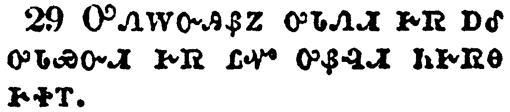</a></td>
</tr>
<tr class="even">
<td>For the gifts and calling of God are without repentance.</td>
</tr>
<tr class="odd">
<td>ᎤᏁᎳᏅᎯᏰᏃ ᎤᏓᏁᏗ ᎨᏒ ᎠᎴ ᎤᏓᏯᏅᏗ ᎨᏒ ᏝᏉ ᎤᏰᎸᏗ ᏂᎨᏒᎾ ᎨᏐᎢ.</td>
</tr>
<tr class="even">
<td>U-ne-la-nv-hi-ye-no u-da-ne-di ge-sv a-le u-da-ya-nv-di ge-sv tla-quo u-ye-lv-di ni-ge-sv-na ge-so-i.</td>
</tr>
</tbody>
</table>

<table>
<tbody>
<tr class="odd">
<td><a href="061130.png">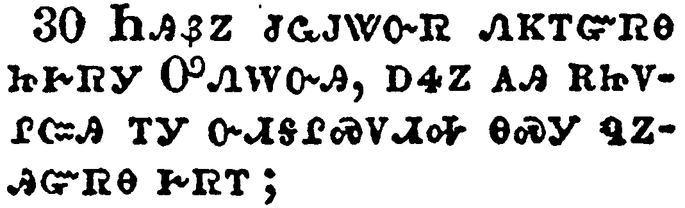</a></td>
</tr>
<tr class="even">
<td>For as ye in times past have not believed God, yet have now obtained mercy through their unbelief:</td>
</tr>
<tr class="odd">
<td>ᏂᎯᏰᏃ ᏧᏩᎫᏔᏅᏒ ᏁᏦᎢᏳᏒᎾ ᏥᎨᏒᎩ ᎤᏁᎳᏅᎯ, ᎠᏎᏃ ᎪᎯ ᎡᏥᏙᎵᏨᎯ ᎢᎩ ᏅᏗᎦᎵᏍᏙᏗᎭ ᎾᏍᎩ ᏄᏃᎯᏳᏒᎾ ᎨᏒᎢ;</td>
</tr>
<tr class="even">
<td>Ni-hi-ye-no tsu-wa-gu-ta-nv-sv ne-tso-i-yu-sv-na tsi-ge-sv-gi U-ne-la-nv-hi, a-se-no go-hi e-tsi-do-li-tsv-hi i-gi nv-di-ga-li-s-do-di-ha na-s-gi nu-no-hi-yu-sv-na ge-sv-i;</td>
</tr>
</tbody>
</table>

<table>
<tbody>
<tr class="odd">
<td><a href="061131.png">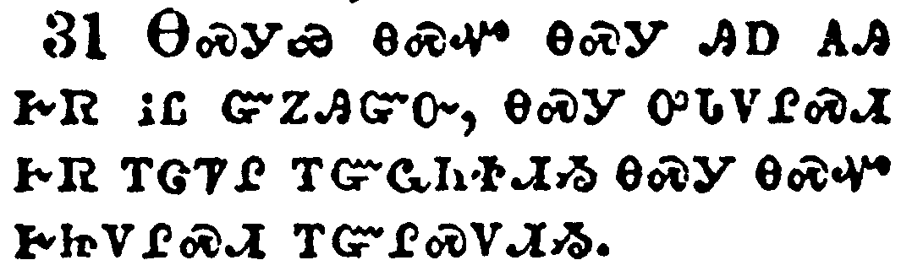</a></td>
</tr>
<tr class="even">
<td>Even so have these also now not believed, that through your mercy they also may obtain mercy.</td>
</tr>
<tr class="odd">
<td>ᎾᏍᎩᏯ ᎾᏍᏉ ᎾᏍᎩ ᎯᎠ ᎪᎯ ᎨᏒ ᎥᏝ ᏳᏃᎯᏳᏅ, ᎾᏍᎩ ᎤᏓᏙᎵᏍᏗ ᎨᏒ ᎢᏣᏤᎵ ᎢᏳᏩᏂᏐᏗᏱ ᎾᏍᎩ ᎾᏍᏉ ᎨᏥᏙᎵᏍᏗ ᎢᏳᎵᏍᏙᏗᏱ.</td>
</tr>
<tr class="even">
<td>Na-s-gi-ya na-s-quo na-s-gi hi-a go-hi ge-sv v-tla yu-no-hi-yu-nv, na-s-gi u-da-do-li-s-di ge-sv i-tsa-tse-li i-yu-wa-ni-so-di-yi na-s-gi na-s-quo ge-tsi-do-li-s-di i-yu-li-s-do-di-yi.</td>
</tr>
</tbody>
</table>

<table>
<tbody>
<tr class="odd">
<td><a href="061132.png">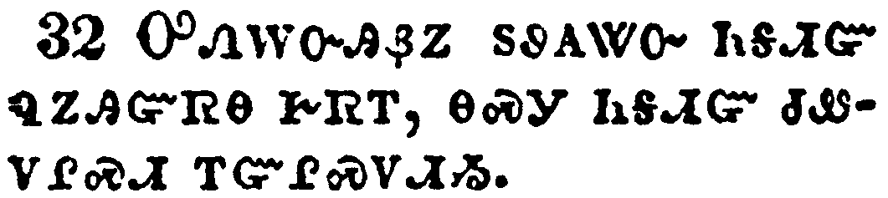</a></td>
</tr>
<tr class="even">
<td>For God hath concluded them all in unbelief, that he might have mercy upon all.</td>
</tr>
<tr class="odd">
<td>ᎤᏁᎳᏅᎯᏰᏃ ᏚᏭᎪᏔᏅ ᏂᎦᏗᏳ ᏄᏃᎯᏳᏒᎾ ᎨᏒᎢ, ᎾᏍᎩ ᏂᎦᏗᏳ ᏧᏪᏙᎵᏍᏗ ᎢᏳᎵᏍᏙᏗᏱ.</td>
</tr>
<tr class="even">
<td>U-ne-la-nv-hi-ye-no du-wu-go-ta-nv ni-ga-di-yu nu-no-hi-yu-sv-na ge-sv-i, na-s-gi ni-ga-di-yu tsu-we-do-li-s-di i-yu-li-s-do-di-yi.</td>
</tr>
</tbody>
</table>

<table>
<tbody>
<tr class="odd">
<td><a href="061133.png">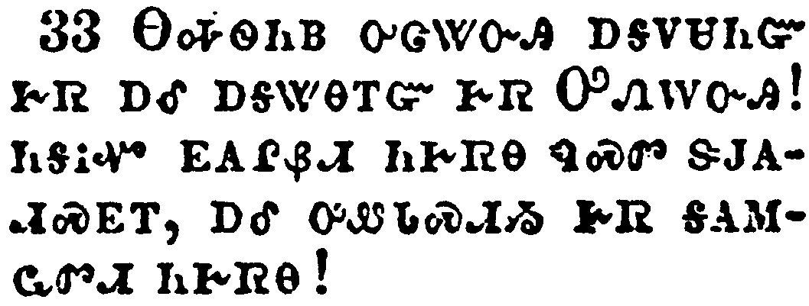</a></td>
</tr>
<tr class="even">
<td>O the depth of the riches both of the wisdom and knowledge of God! how unsearchable are his judgments, and his ways past finding out!</td>
</tr>
<tr class="odd">
<td>ᎾᏎᏫᏂᏴ ᎤᏣᏔᏅᎯ ᎠᎦᏙᏌᏂᏳ ᎨᏒ ᎠᎴ ᎠᎦᏔᎾᎢᏳ ᎨᏒ ᎤᏁᎳᏅᎯ! ᏂᎦᎥᏉ ᎬᎪᎵᏰᏗ ᏂᎨᏒᎾ ᏄᏍᏛ ᏕᎫᎪᏗᏍᎬᎢ, ᎠᎴ ᎤᏪᏓᏍᏗᏱ ᎨᏒ ᎦᎪᎷᏩᏛᏗ ᏂᎨᏒᎾ!</td>
</tr>
<tr class="even">
<td>Na-se-wi-ni-yv u-tsa-ta-nv-hi a-ga-do-sa-ni-yu ge-sv a-le a-ga-ta-na-i-yu ge-sv U-ne-la-nv-hi! ni-ga-v-quo gv-go-li-ye-di ni-ge-sv-na nu-s-dv de-gu-go-di-s-gv-i, a-le u-we-da-s-di-yi ge-sv ga-go-lu-wa-dv-di ni-ge-sv-na!</td>
</tr>
</tbody>
</table>

<table>
<tbody>
<tr class="odd">
<td><a href="061134.png">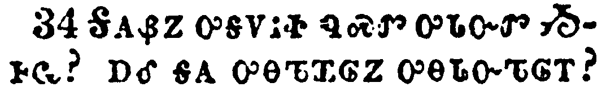</a></td>
</tr>
<tr class="even">
<td>For who hath known the mind of the Lord? or who hath been his counseller?</td>
</tr>
<tr class="odd">
<td>ᎦᎪᏰᏃ ᎤᎦᏙᎥᏐ ᏄᏍᏛ ᎤᏓᏅᏛ ᏱᎰᏩ? ᎠᎴ ᎦᎪ ᎤᎾᏖᏆᎶᏃ ᎤᎾᏓᏅᏖᎶᎢ?</td>
</tr>
<tr class="even">
<td>Ga-go-ye-no u-ga-do-v-so nu-s-dv u-da-nv-dv Yi-ho-wa? a-le ga-go u-na-te-qua-lo-no u-na-da-nv-te-lo-i?</td>
</tr>
</tbody>
</table>

<table>
<tbody>
<tr class="odd">
<td><a href="061135.png">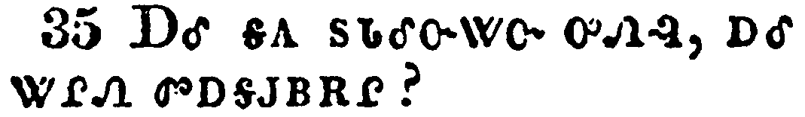</a></td>
</tr>
<tr class="even">
<td>Or who hath first given to him, and it shall be recompensed unto him again?</td>
</tr>
<tr class="odd">
<td>ᎠᎴ ᎦᎪ ᏚᏓᎴᏅᏔᏅ ᎤᏁᎸ, ᎠᎴ ᏔᎵᏁ ᏛᎠᎦᎫᏴᎡᎵ?</td>
</tr>
<tr class="even">
<td>A-le ga-go du-da-le-nv-ta-nv u-ne-lv, a-le ta-li-ne dv-a-ga-gu-yv-e-li?</td>
</tr>
</tbody>
</table>

<table>
<tbody>
<tr class="odd">
<td><a href="061136.png">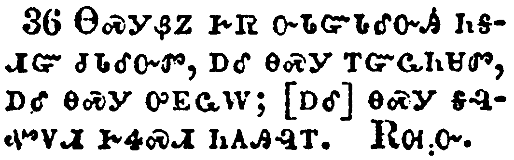</a></td>
</tr>
<tr class="even">
<td>For of him, and through him, and to him, are all things: to whom be glory for ever. Amen.</td>
</tr>
<tr class="odd">
<td>ᎾᏍᎩᏰᏃ ᎨᏒ ᏅᏓᏳᏓᎴᏅᎯ ᏂᎦᏗᏳ ᏧᏓᎴᏅᏛ, ᎠᎴ ᎾᏍᎩ ᎢᏳᏩᏂᏌᏛ, ᎠᎴ ᎾᏍᎩ ᎤᎬᏩᎳ; [ᎠᎴ] ᎾᏍᎩ ᎦᎸᏉᏙᏗ ᎨᏎᏍᏗ ᏂᎪᎯᎸᎢ. ᎡᎺᏅ.</td>
</tr>
<tr class="even">
<td>Na-s-gi-ye-no ge-sv nv-da-yu-da-le-nv-hi ni-ga-di-yu tsu-da-le-nv-dv, a-le na-s-gi i-yu-wa-ni-sa-dv, a-le na-s-gi u-gv-wa-la; [a-le] na-s-gi ga-lv-quo-do-di ge-se-s-di ni-go-hi-lv-i. E-me-nv.</td>
</tr>
</tbody>
</table>

