+++
draft=false
date = 2014-12-18T21:11:07Z
title = "Romans - Chapter 16 - Cherokee New Testament"
weight = 1418955067

[taxonomies]

authors = ["Timothy Legg"]
categories = []
tags = []

[extra]
+++

<table>
<tbody>
<tr class="odd">
<td><a href="061601.png">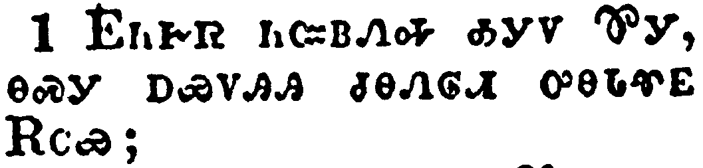</a></td>
</tr>
<tr class="even">
<td>I commend unto you Phebe our sister, which is a servant of the church which is at Cenchrea:</td>
</tr>
<tr class="odd">
<td>ᎬᏂᎨᏒ ᏂᏨᏴᏁᎭ ᎣᎩᏙ ᏈᎩ, ᎾᏍᎩ ᎠᏯᏙᎯᎯ ᏧᎾᏁᎶᏗ ᎤᎾᏓᏡᎬ ᎡᏟᏯ;</td>
</tr>
<tr class="even">
<td>Gv-ni-ge-sv ni-tsv-yv-ne-ha o-gi-do Qui-gi, na-s-gi a-ya-do-hi-hi tsu-na-ne-lo-di u-na-da-tlu-gv E-tli-ya;</td>
</tr>
</tbody>
</table>

<table>
<tbody>
<tr class="odd">
<td><a href="061602.png">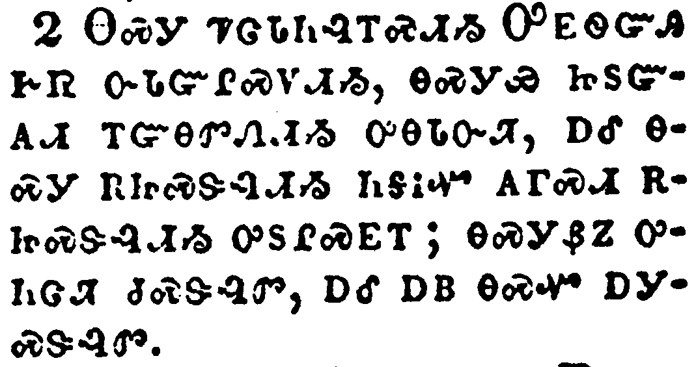</a></td>
</tr>
<tr class="even">
<td>That ye receive her in the Lord, as becometh saints, and that ye assist her in whatsoever business she hath need of you: for she hath been a succourer of many, and of myself also.</td>
</tr>
<tr class="odd">
<td>ᎾᏍᎩ ᏤᏣᏓᏂᎸᎢᏍᏗᏱ ᎤᎬᏫᏳᎯ ᎨᏒ ᏅᏓᏳᎵᏍᏙᏗᏱ, ᎾᏍᎩᏯ ᏥᏚᏳᎪᏗ ᎢᏳᎾᏛᏁᏗᏱ ᎤᎾᏓᏅᏘ, ᎠᎴ ᎾᏍᎩ ᎡᏥᏍᏕᎸᏗᏱ ᏂᎦᎥᏉ ᎪᎱᏍᏗ ᎡᏥᏍᏕᎸᏗᏱ ᎤᏚᎵᏍᎬᎢ; ᎾᏍᎩᏰᏃ ᎤᏂᏣᏘ ᏧᏍᏕᎸᏛ, ᎠᎴ ᎠᏴ ᎾᏍᏉ ᎠᎩᏍᏕᎸᏛ.</td>
</tr>
<tr class="even">
<td>Na-s-gi tse-tsa-da-ni-lv-i-s-di-yi U-gv-wi-yu-hi ge-sv nv-da-yu-li-s-do-di-yi, na-s-gi-ya tsi-du-yu-go-di i-yu-na-dv-ne-di-yi u-na-da-nv-ti, a-le na-s-gi e-tsi-s-de-lv-di-yi ni-ga-v-quo go-hu-s-di e-tsi-s-de-lv-di-yi u-du-li-s-gv-i; na-s-gi-ye-no u-ni-tsa-ti tsu-s-de-lv-dv, a-le a-yv na-s-quo a-gi-s-de-lv-dv.</td>
</tr>
</tbody>
</table>

<table>
<tbody>
<tr class="odd">
<td><a href="061603.png">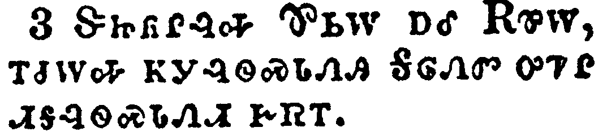</a></td>
</tr>
<tr class="even">
<td>Greet Priscilla and Aquila my helpers in Christ Jesus:</td>
</tr>
<tr class="odd">
<td>ᏕᏥᏲᎵᎸᎭ ᏈᏏᎳ ᎠᎴ ᎡᏈᎳ, ᎢᏧᎳᎭ ᏦᎩᎸᏫᏍᏓᏁᎯ ᎦᎶᏁᏛ ᎤᏤᎵ ᏗᎦᎸᏫᏍᏓᏁᏗ ᎨᏒᎢ.</td>
</tr>
<tr class="even">
<td>De-tsi-yo-li-lv-ha Qui-si-la a-le E-qui-la, i-tsu-la-ha tso-gi-lv-wi-s-da-ne-hi Ga-lo-ne-dv u-tse-li di-ga-lv-wi-s-da-ne-di ge-sv-i.</td>
</tr>
</tbody>
</table>

<table>
<tbody>
<tr class="odd">
<td><a href="061604.png">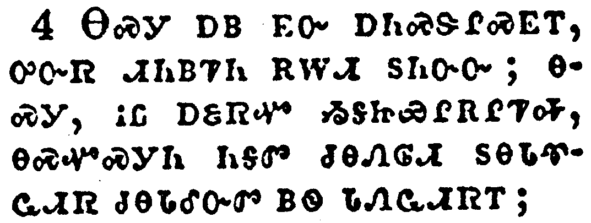</a></td>
</tr>
<tr class="even">
<td>Who have for my life laid down their own necks: unto whom not only I give thanks, but also all the churches of the Gentiles.</td>
</tr>
<tr class="odd">
<td>ᎾᏍᎩ ᎠᏴ ᎬᏅ ᎠᏂᏍᏕᎵᏍᎬᎢ, ᎤᏅᏒ ᏗᏂᏴᏤᏂ ᎡᎳᏗ ᏚᏂᏅᏅ; ᎾᏍᎩ, ᎥᏝ ᎠᏋᏒᏉ ᏱᎦᏥᏯᎵᎡᎵᏤᎭ, ᎾᏍᏉᏍᎩᏂ ᏂᎦᏛ ᏧᎾᏁᎶᏗ ᏚᎾᏓᏡᏩᏗᏒ ᏧᎾᏓᎴᏅᏛ ᏴᏫ ᏓᏁᏩᏗᏒᎢ;</td>
</tr>
<tr class="even">
<td>Na-s-gi a-yv gv-nv a-ni-s-de-li-s-gv-i, u-nv-sv di-ni-yv-tse-ni e-la-di du-ni-nv-nv; na-s-gi, v-tla a-quv-sv-quo yi-ga-tsi-ya-li-e-li-tse-ha, na-s-quo-s-gi-ni ni-ga-dv tsu-na-ne-lo-di du-na-da-tlu-wa-di-sv tsu-na-da-le-nv-dv yv-wi da-ne-wa-di-sv-i;</td>
</tr>
</tbody>
</table>

<table>
<tbody>
<tr class="odd">
<td><a href="061605.png">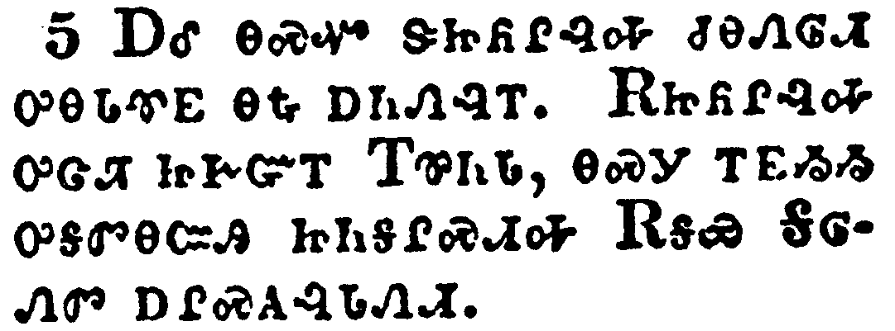</a></td>
</tr>
<tr class="even">
<td>Likewise greet the church that is in their house. Salute my wellbeloved Epaenetus, who is the firstfruits of Achaia unto Christ.</td>
</tr>
<tr class="odd">
<td>ᎠᎴ ᎾᏍᏉ ᏕᏥᏲᎵᎸᎭ ᏧᎾᏁᎶᏗ ᎤᎾᏓᏡᎬ ᎾᎿᎭᎠᏂᏁᎸᎢ. ᎡᏥᏲᎵᎸᎭ ᎤᏣᏘ ᏥᎨᏳᎢ ᎢᏈᏂᏓ, ᎾᏍᎩ ᎢᎬᏱᏱ ᎤᎦᏛᎾᏨᎯ ᏥᏂᎦᎵᏍᏗᎭ ᎡᎦᏯ ᎦᎶᏁᏛ ᎠᎵᏍᎪᎸᏓᏁᏗ.</td>
</tr>
<tr class="even">
<td>A-le na-s-quo de-tsi-yo-li-lv-ha tsu-na-ne-lo-di u-na-da-tlu-gv na-hna a-ni-ne-lv-i. E-tsi-yo-li-lv-ha u-tsa-ti tsi-ge-yu-i I-qui-ni-da, na-s-gi i-gv-yi-yi u-ga-dv-na-tsv-hi tsi-ni-ga-li-s-di-ha E-ga-ya Ga-lo-ne-dv a-li-s-go-lv-da-ne-di.</td>
</tr>
</tbody>
</table>

<table>
<tbody>
<tr class="odd">
<td></td>
</tr>
<tr class="even">
<td>Greet Mary, who bestowed much labour on us.</td>
</tr>
<tr class="odd">
<td>ᎺᎵ ᎡᏥᏲᎵᎸᎭ, ᎤᏣᏘ ᏧᎸᏫᏍᏓᏁᎸᎯ ᏥᎩ ᎠᏴ ᎣᎩᏍᏕᎵᏍᎬᎢ.</td>
</tr>
<tr class="even">
<td>Me-li e-tsi-yo-li-lv-ha, u-tsa-ti tsu-lv-wi-s-da-ne-lv-hi tsi-gi a-yv o-gi-s-de-li-s-gv-i.</td>
</tr>
</tbody>
</table>

<table>
<tbody>
<tr class="odd">
<td><a href="061607.png">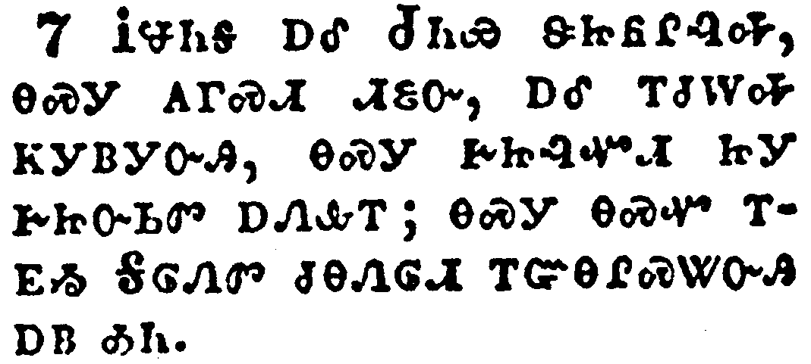</a></td>
</tr>
<tr class="even">
<td>Salute Andronicus and Junia, my kinsmen, and my fellowprisoners, who are of note among the apostles, who also were in Christ before me.</td>
</tr>
<tr class="odd">
<td>ᎥᏠᏂᎦ ᎠᎴ ᏧᏂᏯ ᏕᏥᏲᎵᎸᎭ, ᎾᏍᎩ ᎪᎱᏍᏗ ᏗᏋᏅ, ᎠᎴ ᎢᏧᎳᎭ ᏦᎩᏴᎩᏅᎯ, ᎾᏍᎩ ᎨᏥᎸᏉᏗ ᏥᎩ ᎨᏥᏅᏏᏛ ᎠᏁᎲᎢ; ᎾᏍᎩ ᎾᏍᏉ ᎢᎬᏱ ᎦᎶᏁᏛ ᏧᎾᏁᎶᏗ ᎢᏳᎾᎵᏍᏔᏅᎯ ᎠᏴ ᎣᏂ.</td>
</tr>
<tr class="even">
<td>V-tlo-ni-ga a-le Tsu-ni-ya de-tsi-yo-li-lv-ha, na-s-gi go-hu-s-di di-quv-nv, a-le i-tsu-la-ha tso-gi-yv-gi-nv-hi, na-s-gi ge-tsi-lv-quo-di tsi-gi ge-tsi-nv-si-dv a-ne-hv-i; na-s-gi na-s-quo i-gv-yi Ga-lo-ne-dv tsu-na-ne-lo-di i-yu-na-li-s-ta-nv-hi a-yv o-ni.</td>
</tr>
</tbody>
</table>

<table>
<tbody>
<tr class="odd">
<td><a href="061608.png">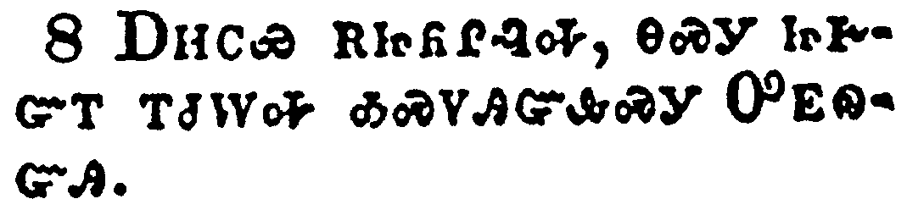</a></td>
</tr>
<tr class="even">
<td>Greet Amplias my beloved in the Lord.</td>
</tr>
<tr class="odd">
<td>ᎠᎻᏟᏯ ᎡᏥᏲᎵᎸᎭ, ᎾᏍᎩ ᏥᎨᏳᎢ ᎢᏧᎳᎭ ᎣᏍᏙᎯᏳᎲᏍᎩ ᎤᎬᏫᏳᎯ.</td>
</tr>
<tr class="even">
<td>A-mi-tli-ya e-tsi-yo-li-lv-ha, na-s-gi tsi-ge-yu-i i-tsu-la-ha o-s-do-hi-yu-hv-s-gi U-gv-wi-yu-hi.</td>
</tr>
</tbody>
</table>

<table>
<tbody>
<tr class="odd">
<td><a href="061609.png">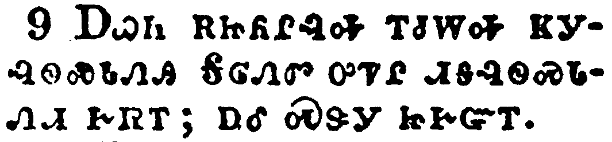</a></td>
</tr>
<tr class="even">
<td>Salute Urbane, our helper in Christ, and Stachys my beloved.</td>
</tr>
<tr class="odd">
<td>ᎠᏇᏂ ᎡᏥᏲᎵᎸᎭ ᎢᏧᎳᎭ ᏦᎩᎸᏫᏍᏓᏁᎯ ᎦᎶᏁᏛ ᎤᏤᎵ ᏗᎦᎸᏫᏍᏓᏁᏗ ᎨᏒᎢ; ᎠᎴ ᏍᏕᎩ ᏥᎨᏳᎢ.</td>
</tr>
<tr class="even">
<td>A-que-ni e-tsi-yo-li-lv-ha i-tsu-la-ha tso-gi-lv-wi-s-da-ne-hi Ga-lo-ne-dv u-tse-li di-ga-lv-wi-s-da-ne-di ge-sv-i; a-le S-de-gi tsi-ge-yu-i.</td>
</tr>
</tbody>
</table>

<table>
<tbody>
<tr class="odd">
<td><a href="061610.png">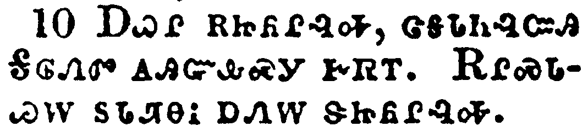</a></td>
</tr>
<tr class="even">
<td>Salute Apelles approved in Christ. Salute them which are of Aristobulus' household.</td>
</tr>
<tr class="odd">
<td>ᎠᏇᎵ ᎡᏥᏲᎵᎸᎭ, ᏣᎦᏓᏂᎸᏨᎯ ᎦᎶᏁᏛ ᎪᎯᏳᎲᏍᎩ ᎨᏒᎢ. ᎡᎵᏍᏓᏊᎳ ᏚᏓᏘᎾᎥ ᎠᏁᎳ ᏕᏥᏲᎵᎸᎭ.</td>
</tr>
<tr class="even">
<td>A-que-li e-tsi-yo-li-lv-ha, tsa-ga-da-ni-lv-tsv-hi Ga-lo-ne-dv go-hi-yu-hv-s-gi ge-sv-i. E-li-s-da-quu-la du-da-ti-na-v a-ne-la de-tsi-yo-li-lv-ha.</td>
</tr>
</tbody>
</table>

<table>
<tbody>
<tr class="odd">
<td><a href="061611.png">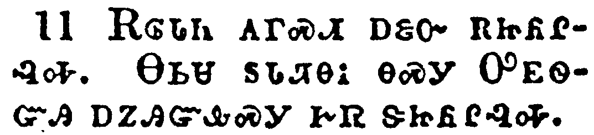</a></td>
</tr>
<tr class="even">
<td>Salute Herodion my kinsman. Greet them that be of the household of Narcissus, which are in the Lord.</td>
</tr>
<tr class="odd">
<td>ᎡᎶᏓᏂ ᎪᎱᏍᏗ ᎠᏋᏅ ᎡᏥᏲᎵᎸᎭ. ᎾᏏᏌ ᏚᏓᏘᎾᎥ ᎾᏍᎩ ᎤᎬᏫᏳᎯ ᎠᏃᎯᏳᎲᏍᎩ ᎨᏒ ᏕᏥᏲᎵᎸᎭ.</td>
</tr>
<tr class="even">
<td>E-lo-da-ni go-hu-s-di a-quv-nv e-tsi-yo-li-lv-ha. Na-si-sa du-da-ti-na-v na-s-gi U-gv-wi-yu-hi a-no-hi-yu-hv-s-gi ge-sv de-tsi-yo-li-lv-ha.</td>
</tr>
</tbody>
</table>

<table>
<tbody>
<tr class="odd">
<td><a href="061612.png">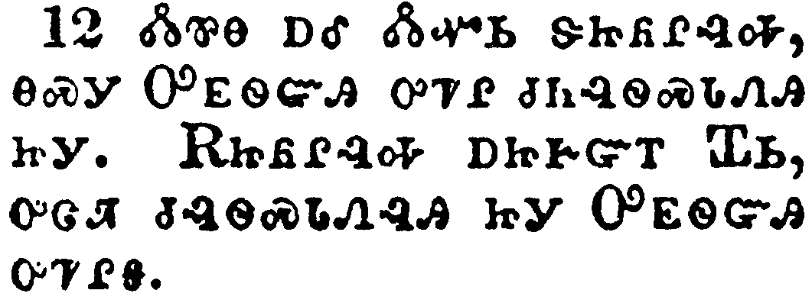</a></td>
</tr>
<tr class="even">
<td>Salute Tryphena and Tryphosa, who labour in the Lord. Salute the beloved Persis, which laboured much in the Lord.</td>
</tr>
<tr class="odd">
<td>ᏜᏓᏈᎾ ᎠᎴ ᏜᏓᏉᏏ ᏕᏥᏲᎵᎸᎭ, ᎾᏍᎩ ᎤᎬᏫᏳᎯ ᎤᏤᎵ ᏧᏂᎸᏫᏍᏓᏁᎯ ᏥᎩ. ᎡᏥᏲᎵᎸᎭ ᎠᏥᎨᏳᎢ ᏆᏏ, ᎤᏣᏘ ᏧᎸᏫᏍᏓᏁᎸᎯ ᏥᎩ ᎤᎬᏫᏳᎯ ᎤᏤᎵᎦ.</td>
</tr>
<tr class="even">
<td>Dla-qui-na a-le Dla-quo-si de-tsi-yo-li-lv-ha, na-s-gi U-gv-wi-yu-hi u-tse-li tsu-ni-lv-wi-s-da-ne-hi tsi-gi. E-tsi-yo-li-lv-ha a-tsi-ge-yu-i Qua-si, u-tsa-ti tsu-lv-wi-s-da-ne-lv-hi tsi-gi U-gv-wi-yu-hi u-tse-li-ga.</td>
</tr>
</tbody>
</table>

<table>
<tbody>
<tr class="odd">
<td><a href="061613.png">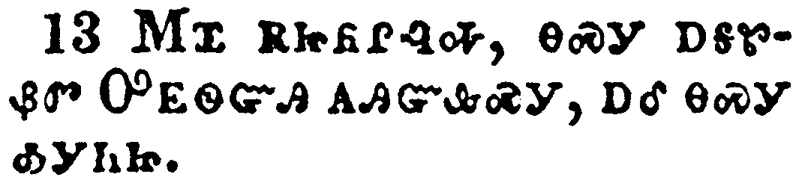</a></td>
</tr>
<tr class="even">
<td>Salute Rufus chosen in the Lord, and his mother and mine.</td>
</tr>
<tr class="odd">
<td>ᎷᏆ ᎡᏥᏲᎵᎸᎭ, ᎾᏍᎩ ᎠᎦᏑᏰᏛ ᎤᎬᏫᏳᎯ ᎪᎯᏳᎲᏍᎩ, ᎠᎴ ᎾᏍᎩ ᎣᎩᏂᏥ.</td>
</tr>
<tr class="even">
<td>Lu-qua e-tsi-yo-li-lv-ha, na-s-gi a-ga-su-ye-dv U-gv-wi-yu-hi go-hi-yu-hv-s-gi, a-le na-s-gi o-gi-ni-tsi.</td>
</tr>
</tbody>
</table>

<table>
<tbody>
<tr class="odd">
<td><a href="061614.png">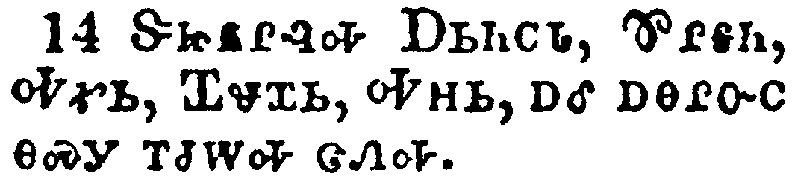</a></td>
</tr>
<tr class="even">
<td>Salute Asyncritus, Phlegon, Hermas, Patrobas, Hermes, and the brethren which are with them.</td>
</tr>
<tr class="odd">
<td>ᏕᏥᏲᎵᎸᎭ ᎠᏏᏂᏟᏓ, ᏈᎵᎦᏂ, ᎭᎹᏏ, ᏆᏠᏆᏏ, ᎭᎻᏏ, ᎠᎴ ᎠᎾᎵᏅᏟ ᎾᏍᎩ ᎢᏧᎳᎭ ᏣᏁᎭ.</td>
</tr>
<tr class="even">
<td>De-tsi-yo-li-lv-ha A-si-ni-tli-da, Qui-li-ga-ni, Ha-ma-si, Qua-tlo-qua-si, Ha-mi-si, a-le a-na-li-nv-tli na-s-gi i-tsu-la-ha tsa-ne-ha.</td>
</tr>
</tbody>
</table>

<table>
<tbody>
<tr class="odd">
<td><a href="061615.png">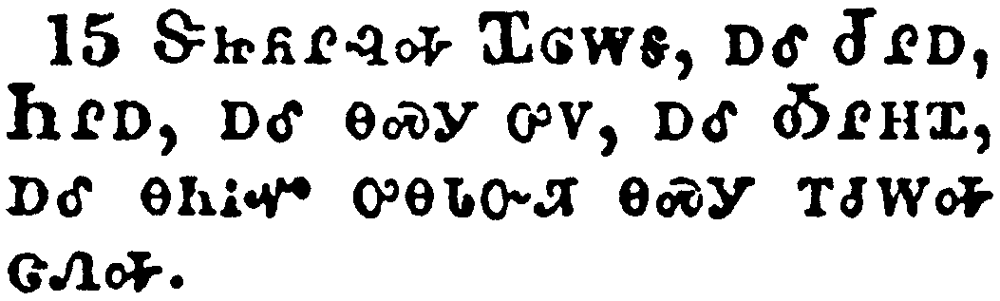</a></td>
</tr>
<tr class="even">
<td>Salute Philologus, and Julia, Nereus, and his sister, and Olympas, and all the saints which are with them.</td>
</tr>
<tr class="odd">
<td>ᏕᏥᏲᎵᎸᎭ ᏆᎶᎳᎦ, ᎠᎴ ᏧᎵᎠ, ᏂᎵᎠ, ᎠᎴ ᎾᏍᎩ ᎤᏙ, ᎠᎴ ᎣᎵᎻᏆ, ᎠᎴ ᎾᏂᎥᏉ ᎤᎾᏓᏅᏘ ᎾᏍᎩ ᎢᏧᎳᎭ ᏣᏁᎭ.</td>
</tr>
<tr class="even">
<td>De-tsi-yo-li-lv-ha Qua-lo-la-ga, a-le Tsu-li-a, Ni-li-a, a-le na-s-gi u-do, a-le O-li-mi-qua, a-le na-ni-v-quo u-na-da-nv-ti na-s-gi i-tsu-la-ha tsa-ne-ha.</td>
</tr>
</tbody>
</table>

<table>
<tbody>
<tr class="odd">
<td><a href="061616.png">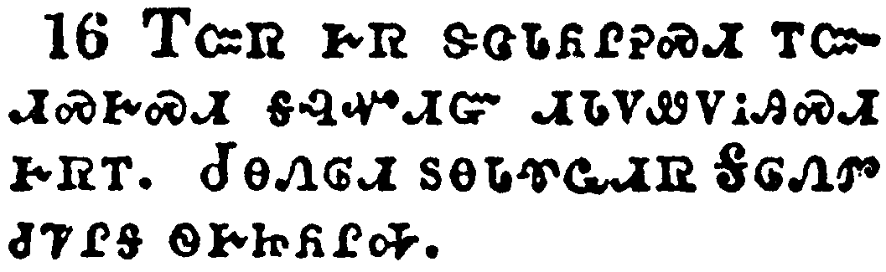</a></td>
</tr>
<tr class="even">
<td>Salute one another with an holy kiss. The churches of Christ salute you.</td>
</tr>
<tr class="odd">
<td>ᎢᏨᏒ ᎨᏒ ᏕᏣᏓᏲᎵᎮᏍᏗ ᎢᏨᏗᏍᎨᏍᏗ ᎦᎸᏉᏗᏳ ᏗᏓᏙᏪᏙᎥᎯᏍᏗ ᎨᏒᎢ. ᏧᎾᏁᎶᏗ ᏚᎾᏓᏡᏩᏗᏒ ᎦᎶᏁᏛ ᏧᏤᎵᎦ ᏫᎨᏥᏲᎵᎭ.</td>
</tr>
<tr class="even">
<td>I-tsv-sv ge-sv de-tsa-da-yo-li-he-s-di i-tsv-di-s-ge-s-di ga-lv-quo-di-yu di-da-do-we-do-v-hi-s-di ge-sv-i. Tsu-na-ne-lo-di du-na-da-tlu-wa-di-sv Ga-lo-ne-dv tsu-tse-li-ga wi-ge-tsi-yo-li-ha.</td>
</tr>
</tbody>
</table>

<table>
<tbody>
<tr class="odd">
<td><a href="061617.png">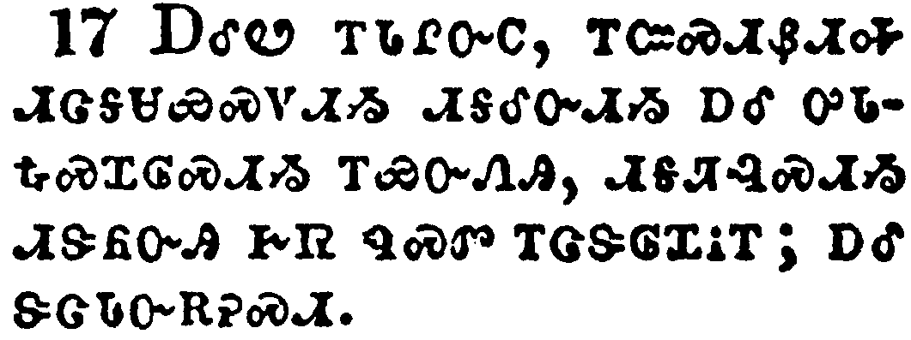</a></td>
</tr>
<tr class="even">
<td>Now I beseech you, brethren, mark them which cause divisions and offences contrary to the doctrine which ye have learned; and avoid them.</td>
</tr>
<tr class="odd">
<td>ᎠᎴᏬ ᎢᏓᎵᏅᏟ, ᎢᏨᏍᏗᏰᏗᎭ ᏗᏣᎦᏌᏯᏍᏙᏗᏱ ᏗᎦᎴᏅᏗᏱ ᎠᎴ ᎤᏓᎿᎭᏍᏆᎶᏍᏗᏱ ᎢᏯᏅᏁᎯ, ᏗᎦᏘᎸᏍᏗᏱ ᏗᏕᏲᏅᎯ ᎨᏒ ᏄᏍᏛ ᎢᏣᏕᎶᏆᎥᎢ; ᎠᎴ ᏕᏣᏓᏅᎡᎮᏍᏗ.</td>
</tr>
<tr class="even">
<td>A-le-wo i-da-li-nv-tli, i-tsv-s-di-ye-di-ha di-tsa-ga-sa-ya-s-do-di-yi di-ga-le-nv-di-yi a-le u-da-hna-s-qua-lo-s-di-yi i-ya-nv-ne-hi, di-ga-ti-lv-s-di-yi di-de-yo-nv-hi ge-sv nu-s-dv i-tsa-de-lo-qua-v-i; a-le de-tsa-da-nv-e-he-s-di.</td>
</tr>
</tbody>
</table>

<table>
<tbody>
<tr class="odd">
<td><a href="061618.png">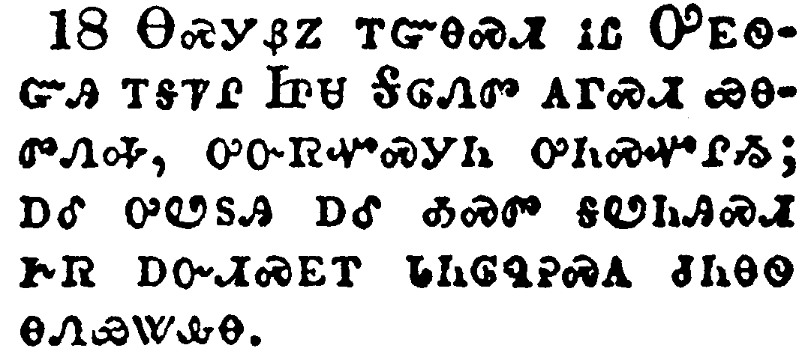</a></td>
</tr>
<tr class="even">
<td>For they that are such serve not our Lord Jesus Christ, but their own belly; and by good words and fair speeches deceive the hearts of the simple.</td>
</tr>
<tr class="odd">
<td>ᎾᏍᎩᏰᏃ ᎢᏳᎾᏍᏗ ᎥᏝ ᎤᎬᏫᏳᎯ ᎢᎦᏤᎵ ᏥᏌ ᎦᎶᏁᏛ ᎪᎱᏍᏗ ᏯᎾᏛᏁᎭ, ᎤᏅᏒᏉᏍᎩᏂ ᎤᏂᏍᏉᎵᏱ; ᎠᎴ ᎤᏬᏚᎯ ᎠᎴ ᎣᏍᏛ ᎦᏬᏂᎯᏍᏗ ᎨᏒ ᎠᏅᏗᏍᎬᎢ ᏓᏂᎶᏄᎮᏍᎪ ᏧᏂᎾᏫ ᎾᏁᏯᏔᎲᎾ.</td>
</tr>
<tr class="even">
<td>Na-s-gi-ye-no i-yu-na-s-di v-tla U-gv-wi-yu-hi i-ga-tse-li Tsi-sa Ga-lo-ne-dv go-hu-s-di ya-na-dv-ne-ha, u-nv-sv-quo-s-gi-ni u-ni-s-quo-li-yi; a-le u-wo-du-hi a-le o-s-dv ga-wo-ni-hi-s-di ge-sv a-nv-di-s-gv-i da-ni-lo-nu-he-s-go tsu-ni-na-wi na-ne-ya-ta-hv-na.</td>
</tr>
</tbody>
</table>

<table>
<tbody>
<tr class="odd">
<td><a href="061619.png">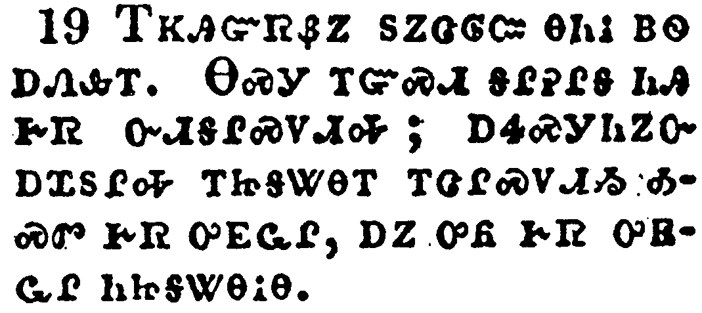</a></td>
</tr>
<tr class="even">
<td>For your obedience is come abroad unto all men. I am glad therefore on your behalf: but yet I would have you wise unto that which is good, and simple concerning evil.</td>
</tr>
<tr class="odd">
<td>ᎢᏦᎯᏳᏒᏰᏃ ᏚᏃᏣᎶᏨ ᎾᏂᎥ ᏴᏫ ᎠᏁᎲᎢ. ᎾᏍᎩ ᎢᏳᏍᏗ ᎦᎵᎮᎵᎦ ᏂᎯ ᎨᏒ ᏅᏗᎦᎵᏍᏙᏗᎭ; ᎠᏎᏍᎩᏂᏃᏅ ᎠᏆᏚᎵᎭ ᎢᏥᎦᏔᎾᎢ ᎢᏣᎵᏍᏙᏗᏱ ᎣᏍᏛ ᎨᏒ ᎤᎬᏩᎵ, ᎠᏃ ᎤᏲ ᎨᏒ ᎤᎬᏩᎵ ᏂᏥᎦᏔᎾᎥᎾ.</td>
</tr>
<tr class="even">
<td>I-tso-hi-yu-sv-ye-no du-no-tsa-lo-tsv na-ni-v yv-wi a-ne-hv-i. Na-s-gi i-yu-s-di ga-li-he-li-ga ni-hi ge-sv nv-di-ga-li-s-do-di-ha; a-se-s-gi-ni-no-nv a-qua-du-li-ha i-tsi-ga-ta-na-i i-tsa-li-s-do-di-yi o-s-dv ge-sv u-gv-wa-li, a-no u-yo ge-sv u-gv-wa-li ni-tsi-ga-ta-na-v-na.</td>
</tr>
</tbody>
</table>

<table>
<tbody>
<tr class="odd">
<td><a href="061620.png">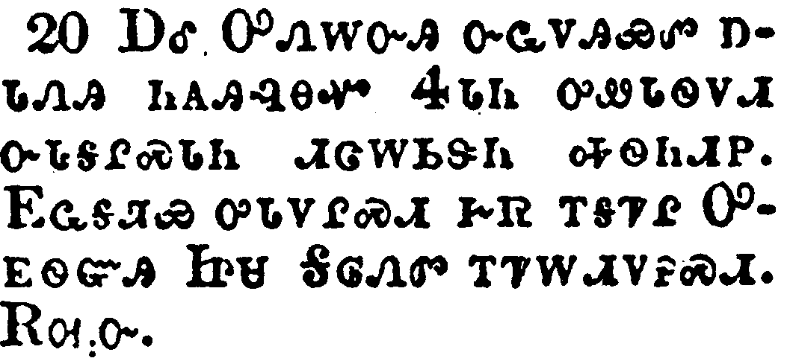</a></td>
</tr>
<tr class="even">
<td>And the God of peace shall bruise Satan under your feet shortly. The grace of our Lord Jesus Christ be with you. Amen.</td>
</tr>
<tr class="odd">
<td>ᎠᎴ ᎤᏁᎳᏅᎯ ᏅᏩᏙᎯᏯᏛ ᎠᏓᏁᎯ ᏂᎪᎯᎸᎾᏉ ᏎᏓᏂ ᎤᏪᏓᏫᏙᏗ ᏅᏓᎦᎵᏍᏓᏂ ᏗᏣᎳᏏᏕᏂ ᎭᏫᏂᏗᏢ. ᎬᏩᎦᏘᏯ ᎤᏓᏙᎵᏍᏗ ᎨᏒ ᎢᎦᏤᎵ ᎤᎬᏫᏳᎯ ᏥᏌ ᎦᎶᏁᏛ ᎢᏤᎳᏗᏙᎮᏍᏗ. ᎡᎺᏅ.</td>
</tr>
<tr class="even">
<td>A-le U-ne-la-nv-hi nv-wa-do-hi-ya-dv a-da-ne-hi ni-go-hi-lv-na-quo Se-da-ni u-we-da-wi-do-di nv-da-ga-li-s-da-ni di-tsa-la-si-de-ni ha-wi-ni-di-tlv. Gv-wa-ga-ti-ya u-da-do-li-s-di ge-sv i-ga-tse-li U-gv-wi-yu-hi Tsi-sa Ga-lo-ne-dv i-tse-la-di-do-he-s-di. E-me-nv.</td>
</tr>
</tbody>
</table>

<table>
<tbody>
<tr class="odd">
<td><a href="061621.png">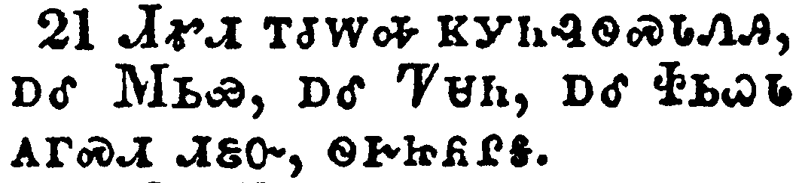</a></td>
</tr>
<tr class="even">
<td>Timotheus my workfellow, and Lucius, and Jason, and Sosipater, my kinsmen, salute you.</td>
</tr>
<tr class="odd">
<td>ᏗᎹᏗ ᎢᏧᎳᎭ ᏦᎩᏂᎸᏫᏍᏓᏁᎯ, ᎠᎴ ᎷᏏᏯ, ᎠᎴ ᏤᏌᏂ, ᎠᎴ ᏐᏏᏇᏓ ᎪᎱᏍᏗ ᏗᏋᏅ, ᏫᎨᏥᏲᎵᎦ.</td>
</tr>
<tr class="even">
<td>Di-ma-di i-tsu-la-ha tso-gi-ni-lv-wi-s-da-ne-hi, a-le Lu-si-ya, a-le Tse-sa-ni, a-le So-si-que-da go-hu-s-di di-quv-nv, wi-ge-tsi-yo-li-ga.</td>
</tr>
</tbody>
</table>

<table>
<tbody>
<tr class="odd">
<td><a href="061622.png">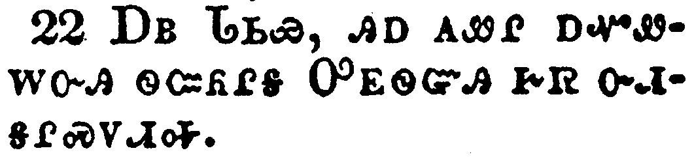</a></td>
</tr>
<tr class="even">
<td>I Tertius, who wrote this epistle, salute you in the Lord.</td>
</tr>
<tr class="odd">
<td>ᎠᏴ ᏓᏏᏯ, ᎯᎠ ᎪᏪᎵ ᎠᏆᏪᎳᏅᎯ ᏫᏨᏲᎵᎦ ᎤᎬᏫᏳᎯ ᎨᏒ ᏅᏗᎦᎵᏍᏙᏗᎭ.</td>
</tr>
<tr class="even">
<td>A-yv da-si-ya, hi-a go-we-li a-qua-we-la-nv-hi wi-tsv-yo-li-ga U-gv-wi-yu-hi ge-sv nv-di-ga-li-s-do-di-ha.</td>
</tr>
</tbody>
</table>

<table>
<tbody>
<tr class="odd">
<td></td>
</tr>
<tr class="even">
<td>Gaius mine host, and of the whole church, saluteth you. Erastus the chamberlain of the city saluteth you, and Quartus a brother.</td>
</tr>
<tr class="odd">
<td>ᎦᏯ ᎠᎩᏍᏆᏂᎪᏗᏍᎩ ᎠᎴ ᎾᏂᎥᏉ ᏧᎾᏁᎶᏗ ᎤᎾᏓᏡᎬ ᏗᏍᏆᏂᎪᏗᏍᎩ, ᏫᏥᏲᎵᎦ. ᎢᎳᏍᏓ, ᎠᏰᎵ ᎡᎯ ᎦᏚᎲ ᎠᎲ ᎠᎦᏘᏯ, ᏫᏥᏲᎵᎦ, ᎠᎴ ᏉᏓ, ᎢᏓᎵᏅᏟ.</td>
</tr>
<tr class="even">
<td>Ga-ya a-gi-s-qua-ni-go-di-s-gi a-le na-ni-v-quo tsu-na-ne-lo-di u-na-da-tlu-gv di-s-qua-ni-go-di-s-gi, wi-tsi-yo-li-ga. I-la-s-da, a-ye-li e-hi ga-du-hv a-hv a-ga-ti-ya, wi-tsi-yo-li-ga, a-le Quo-da, i-da-li-nv-tli.</td>
</tr>
</tbody>
</table>

<table>
<tbody>
<tr class="odd">
<td><a href="061624.png">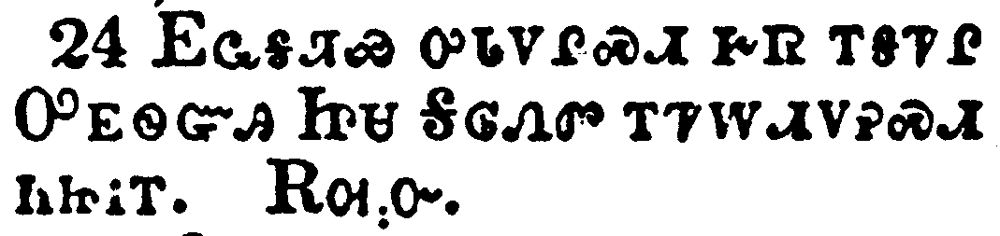</a></td>
</tr>
<tr class="even">
<td>The grace of our Lord Jesus Christ be with you all. Amen.</td>
</tr>
<tr class="odd">
<td>ᎬᏩᎦᏘᏯ ᎤᏓᏙᏍᏗ ᎨᏒ ᎢᎦᏤᎵ ᎤᎬᏫᏳᎯ ᏥᏌ ᎦᎶᏁᏛ ᎢᏤᎳᏗᏙᎮᏍᏗ ᏂᏥᎥᎢ. ᎡᎺᏅ.</td>
</tr>
<tr class="even">
<td>Gv-wa-ga-ti-ya u-da-do-s-di ge-sv i-ga-tse-li U-gv-wi-yu-hi Tsi-sa Ga-lo-ne-dv i-tse-la-di-do-he-s-di ni-tsi-v-i. E-me-nv.</td>
</tr>
</tbody>
</table>

<table>
<tbody>
<tr class="odd">
<td><a href="061625.png">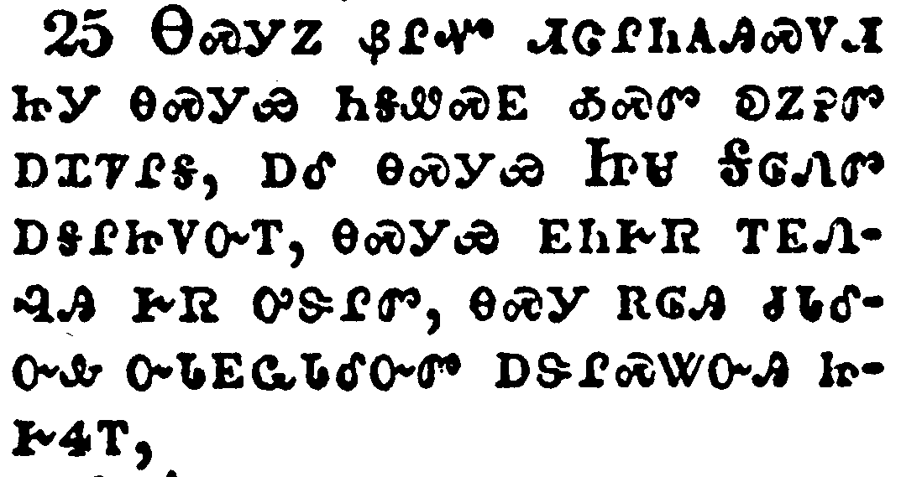</a></td>
</tr>
<tr class="even">
<td>Now to him that is of power to stablish you according to my gospel, and the preaching of Jesus Christ, according to the revelation of the mystery, which was kept secret since the world began,</td>
</tr>
<tr class="odd">
<td>ᎾᏍᎩᏃ ᏰᎵᏉ ᏗᏣᎵᏂᎪᎯᏍᏙᏗ ᏥᎩ ᎾᏍᎩᏯ ᏂᎦᏪᏍᎬ ᎣᏍᏛ ᎧᏃᎮᏛ ᎠᏆᏤᎵᎦ, ᎠᎴ ᎾᏍᎩᏯ ᏥᏌ ᎦᎶᏁᏛ ᎠᎦᎵᏥᏙᏅᎢ, ᎾᏍᎩᏯ ᎬᏂᎨᏒ ᎢᎬᏁᎸᎯ ᎨᏒ ᎤᏕᎵᏛ, ᎾᏍᎩ ᎡᎶᎯ ᏧᏓᎴᏅᎲ ᏅᏓᎬᏩᏓᎴᏅᏛ ᎠᏕᎵᏍᏔᏅᎯ ᏥᎨᏎᎢ,</td>
</tr>
<tr class="even">
<td>Na-s-gi-no ye-li-quo di-tsa-li-ni-go-hi-s-do-di tsi-gi na-s-gi-ya ni-ga-we-s-gv o-s-dv ka-no-he-dv a-qua-tse-li-ga, a-le na-s-gi-ya Tsi-sa Ga-lo-ne-dv a-ga-li-tsi-do-nv-i, na-s-gi-ya gv-ni-ge-sv i-gv-ne-lv-hi ge-sv u-de-li-dv, na-s-gi e-lo-hi tsu-da-le-nv-hv nv-da-gv-wa-da-le-nv-dv a-de-li-s-ta-nv-hi tsi-ge-se-i,</td>
</tr>
</tbody>
</table>

<table>
<tbody>
<tr class="odd">
<td><a href="061626.png">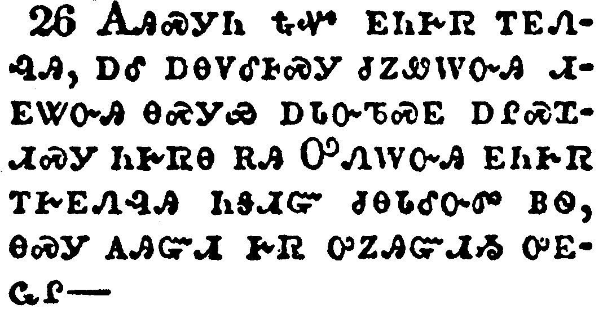</a></td>
</tr>
<tr class="even">
<td>But now is made manifest, and by the scriptures of the prophets, according to the commandment of the everlasting God, made known to all nations for the obedience of faith:</td>
</tr>
<tr class="odd">
<td>ᎪᎯᏍᎩᏂ ᎿᎭᏉ ᎬᏂᎨᏒ ᎢᎬᏁᎸᎯ, ᎠᎴ ᎠᎾᏙᎴᎰᏍᎩ ᏧᏃᏪᎳᏅᎯ ᏗᎬᏔᏅᎯ ᎾᏍᎩᏯ ᎠᏓᏅᏖᏍᎬ ᎠᎵᏍᏆᏗᏍᎩ ᏂᎨᏒᎾ ᎡᎯ ᎤᏁᎳᏅᎯ ᎬᏂᎨᏒ ᎢᎨᎬᎸᎯ ᏂᎦᏗᏳ ᏧᎾᏓᎴᏅᏛ ᏴᏫ, ᎾᏍᎩ ᎪᎯᏳᏗ ᎨᏒ ᎤᏃᎯᏳᏗᏱ ᎤᎬᏩᎵ^</td>
</tr>
<tr class="even">
<td>Go-hi-s-gi-ni hna-quo gv-ni-ge-sv i-gv-ne-lv-hi, a-le a-na-do-le-ho-s-gi tsu-no-we-la-nv-hi di-gv-ta-nv-hi na-s-gi-ya a-da-nv-te-s-gv a-li-s-qua-di-s-gi ni-ge-sv-na e-hi U-ne-la-nv-hi gv-ni-ge-sv i-ge-gv-lv-hi ni-ga-di-yu tsu-na-da-le-nv-dv yv-wi, na-s-gi go-hi-yu-di ge-sv u-no-hi-yu-di-yi u-gv-wa-li^</td>
</tr>
</tbody>
</table>

<table>
<tbody>
<tr class="odd">
<td><a href="061627.png">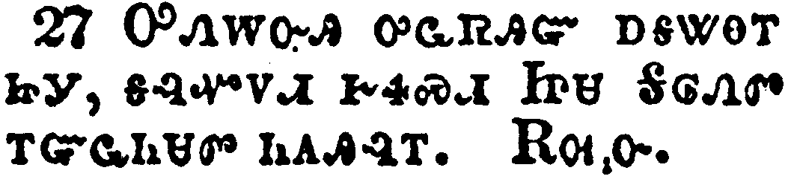</a></td>
</tr>
<tr class="even">
<td>To God only wise, be glory through Jesus Christ for ever. Amen.</td>
</tr>
<tr class="odd">
<td>ᎤᏁᎳᏅᎯ ᎤᏩᏒᎯᏳ ᎠᎦᏔᎾᎢ ᏥᎩ, ᎦᎸᏉᏙᏗ ᎨᏎᏍᏗ ᏥᏌ ᎦᎶᏁᏛ ᎢᏳᏩᏂᏌᏛ ᏂᎪᎯᎸᎢ. ᎡᎺᏅ.</td>
</tr>
<tr class="even">
<td>U-ne-la-nv-hi u-wa-sv-hi-yu a-ga-ta-na-i tsi-gi, ga-lv-quo-do-di ge-se-s-di Tsi-sa Ga-lo-ne-dv i-yu-wa-ni-sa-dv ni-go-hi-lv-i. E-me-nv.</td>
</tr>
</tbody>
</table>

