+++
draft=false
date = 2014-12-18T21:11:07Z
title = "The Acts - Chapter 10 - Cherokee New Testament"
weight = 1418955067

[taxonomies]

authors = ["Timothy Legg"]
categories = []
tags = []

[extra]
+++

<table>
<tbody>
<tr class="odd">
<td><a href="051001.png">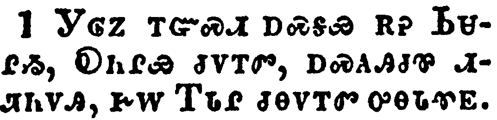</a></td>
</tr>
<tr class="even">
<td>There was a certain man in Caesarea called Cornelius, a centurion of the band called the Italian band,</td>
</tr>
<tr class="odd">
<td>ᎩᎶᏃ ᎢᏳᏍᏗ ᎠᏍᎦᏯ ᎡᎮ ᏏᏌᎵᏱ, ᎧᏂᎵᏯ ᏧᏙᎢᏛ, ᎠᏍᎪᎯᏧᏈ ᏗᏘᏂᏙᎯ, ᎨᎳ ᎢᏓᎵ ᏧᎾᏙᎢᏛ ᎤᎾᏓᏡᎬ.</td>
</tr>
<tr class="even">
<td>Gi-lo-no i-yu-s-di a-s-ga-ya e-he Si-sa-li-yi, Ka-ni-li-ya tsu-do-i-dv, a-s-go-hi-tsu-qui di-ti-ni-do-hi, ge-la I-da-li tsu-na-do-i-dv u-na-da-tlu-gv.</td>
</tr>
</tbody>
</table>

<table>
<tbody>
<tr class="odd">
<td><a href="051002.png">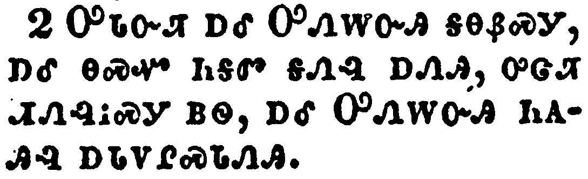</a></td>
</tr>
<tr class="even">
<td>A devout man, and one that feared God with all his house, which gave much alms to the people, and prayed to God always.</td>
</tr>
<tr class="odd">
<td>ᎤᏓᏅᏘ ᎠᎴ ᎤᏁᎳᏅᎯ ᎦᎾᏰᏍᎩ, ᎠᎴ ᎾᏍᏉ ᏂᎦᏛ ᎦᏁᎸ ᎠᏂᎮ, ᎤᏣᏘ ᏗᏁᎸᎥᏍᎩ ᏴᏫ, ᎠᎴ ᎤᏁᎳᏅᎯ ᏂᎪᎯᎸ ᎠᏓᏙᎵᏍᏓᏁᎯ.</td>
</tr>
<tr class="even">
<td>U-da-nv-ti a-le U-ne-la-nv-hi ga-na-ye-s-gi, a-le na-s-quo ni-ga-dv ga-ne-lv a-ni-he, u-tsa-ti di-ne-lv-v-s-gi yv-wi, a-le U-ne-la-nv-hi ni-go-hi-lv a-da-do-li-s-da-ne-hi.</td>
</tr>
</tbody>
</table>

<table>
<tbody>
<tr class="odd">
<td><a href="051003.png">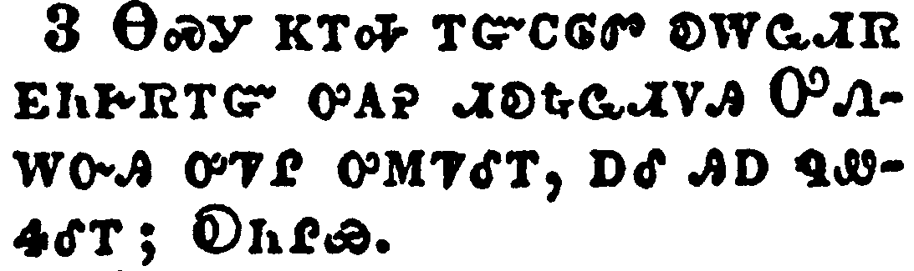</a></td>
</tr>
<tr class="even">
<td>He saw in a vision evidently about the ninth hour of the day an angel of God coming in to him, and saying unto him, Cornelius.</td>
</tr>
<tr class="odd">
<td>ᎾᏍᎩ ᏦᎢᎭ ᎢᏳᏟᎶᏛ ᎧᎳᏩᏗᏒ ᎬᏂᎨᏒᎢᏳ ᎤᎪᎮ ᏗᎧᎿᎭᏩᏗᏙᎯ ᎤᏁᎳᏅᎯ ᎤᏤᎵ ᎤᎷᏤᎴᎢ, ᎠᎴ ᎯᎠ ᏄᏪᏎᎴᎢ; ᎧᏂᎵᏯ.</td>
</tr>
<tr class="even">
<td>Na-s-gi tso-i-ha i-yu-tli-lo-dv ka-la-wa-di-sv gv-ni-ge-sv-i-yu u-go-he di-ka-hna-wa-di-do-hi U-ne-la-nv-hi u-tse-li u-lu-tse-le-i, a-le hi-a nu-we-se-le-i; Ka-ni-li-ya.</td>
</tr>
</tbody>
</table>

<table>
<tbody>
<tr class="odd">
<td><a href="051004.png">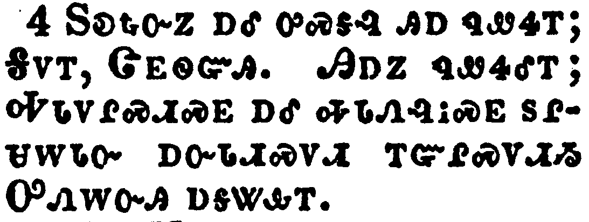</a></td>
</tr>
<tr class="even">
<td>And when he looked on him, he was afraid, and said, What is it, Lord? And he said unto him, Thy prayers and thine alms are come up for a memorial before God.</td>
</tr>
<tr class="odd">
<td>ᏚᎧᎿᎭᏅᏃ ᎠᎴ ᎤᏍᎦᎸ ᎯᎠ ᏄᏪᏎᎢ; ᎦᏙᎢ, ᏣᎬᏫᏳᎯ. ᎯᎠᏃ ᏄᏪᏎᎴᎢ; ᎭᏓᏙᎵᏍᏗᏍᎬ ᎠᎴ ᎭᏓᏁᎸᎥᏍᎬ ᏚᎵᏌᎳᏓᏅ ᎠᏅᏓᏗᏍᏙᏗ ᎢᏳᎵᏍᏙᏗᏱ ᎤᏁᎳᏅᎯ ᎠᎦᏔᎲᎢ.</td>
</tr>
<tr class="even">
<td>Du-ka-hna-nv-no a-le u-s-ga-lv hi-a nu-we-se-i; Ga-do-i, Tsa-gv-wi-yu-hi. Hi-a-no nu-we-se-le-i; Ha-da-do-li-s-di-s-gv a-le ha-da-ne-lv-v-s-gv du-li-sa-la-da-nv a-nv-da-di-s-do-di i-yu-li-s-do-di-yi U-ne-la-nv-hi a-ga-ta-hv-i.</td>
</tr>
</tbody>
</table>

<table>
<tbody>
<tr class="odd">
<td><a href="051005.png">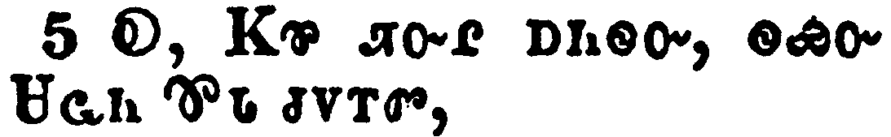</a></td>
</tr>
<tr class="even">
<td>And now send men to Joppa, and call for one Simon, whose surname is Peter:</td>
</tr>
<tr class="odd">
<td>Ꭷ, ᏦᏈ ᏘᏅᎵ ᎠᏂᏫᏅ, ᏫᏯᏅ ᏌᏩᏂ ᏈᏓ ᏧᏙᎢᏛ,</td>
</tr>
<tr class="even">
<td>Ka, Tso-qui ti-nv-li a-ni-wi-nv, wi-ya-nv Sa-wa-ni Qui-da tsu-do-i-dv,</td>
</tr>
</tbody>
</table>

<table>
<tbody>
<tr class="odd">
<td><a href="051006.png">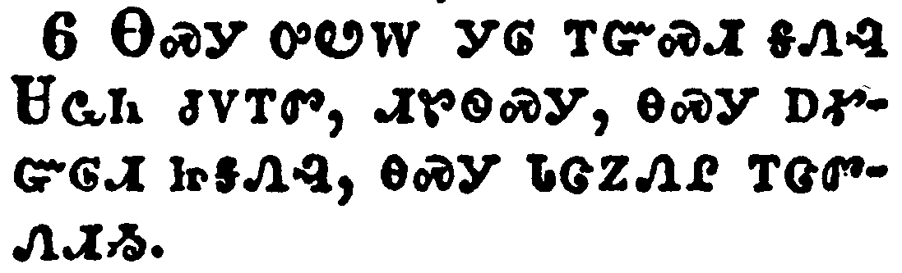</a></td>
</tr>
<tr class="even">
<td>He lodgeth with one Simon a tanner, whose house is by the sea side: he shall tell thee what thou oughtest to do.</td>
</tr>
<tr class="odd">
<td>ᎾᏍᎩ ᎤᏬᎳ ᎩᎶ ᎢᏳᏍᏗ ᎦᏁᎸ ᏌᏩᏂ ᏧᏙᎢᏛ, ᏗᏑᏫᏍᎩ, ᎾᏍᎩ ᎠᎹᏳᎶᏗ ᏥᎦᏁᎸ, ᎾᏍᎩ ᏓᏣᏃᏁᎵ ᎢᏣᏛᏁᏗᏱ.</td>
</tr>
<tr class="even">
<td>Na-s-gi u-wo-la gi-lo i-yu-s-di ga-ne-lv Sa-wa-ni tsu-do-i-dv, di-su-wi-s-gi, na-s-gi a-ma-yu-lo-di tsi-ga-ne-lv, na-s-gi da-tsa-no-ne-li i-tsa-dv-ne-di-yi.</td>
</tr>
</tbody>
</table>

<table>
<tbody>
<tr class="odd">
<td><a href="051007.png">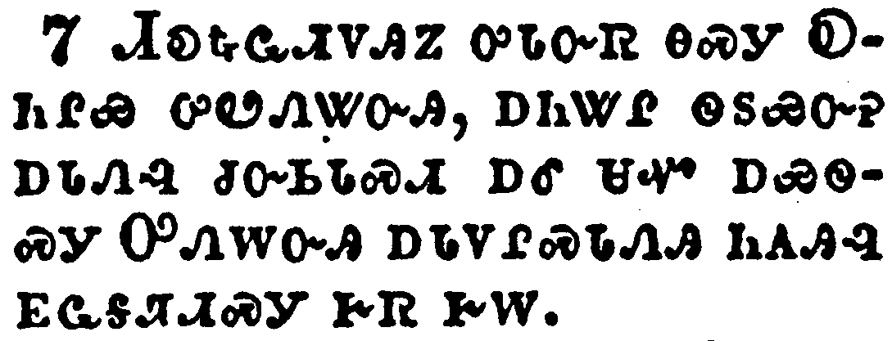</a></td>
</tr>
<tr class="even">
<td>And when the angel which spake unto Cornelius was departed, he called two of his household servants, and a devout soldier of them that waited on him continually;</td>
</tr>
<tr class="odd">
<td>ᏗᎧᎿᎭᏩᏗᏙᎯᏃ ᎤᏓᏅᏒ ᎾᏍᎩ ᎧᏂᎵᏯ ᎤᏬᏁᏔᏅᎯ, ᎠᏂᏔᎵ ᏫᏚᏯᏅᎮ ᎠᏓᏁᎸ ᏧᏅᏏᏓᏍᏗ ᎠᎴ ᏌᏉ ᎠᏯᏫᏍᎩ ᎤᏁᎳᏅᎯ ᎠᏓᏙᎵᏍᏓᏁᎯ ᏂᎪᎯᎸ ᎬᏩᎦᏘᏗᏍᎩ ᎨᏒ ᎨᎳ.</td>
</tr>
<tr class="even">
<td>Di-ka-hna-wa-di-do-hi-no u-da-nv-sv na-s-gi Ka-ni-li-ya u-wo-ne-ta-nv-hi, a-ni-ta-li wi-du-ya-nv-he a-da-ne-lv tsu-nv-si-da-s-di a-le sa-quo a-ya-wi-s-gi U-ne-la-nv-hi a-da-do-li-s-da-ne-hi ni-go-hi-lv gv-wa-ga-ti-di-s-gi ge-sv ge-la.</td>
</tr>
</tbody>
</table>

<table>
<tbody>
<tr class="odd">
<td><a href="051008.png">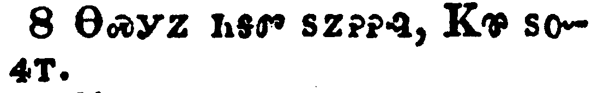</a></td>
</tr>
<tr class="even">
<td>And when he had declared all these things unto them, he sent them to Joppa.</td>
</tr>
<tr class="odd">
<td>ᎾᏍᎩᏃ ᏂᎦᏛ ᏚᏃᎮᎮᎸ, ᏦᏈ ᏚᏅᏎᎢ.</td>
</tr>
<tr class="even">
<td>Na-s-gi-no ni-ga-dv du-no-he-he-lv, Tso-qui du-nv-se-i.</td>
</tr>
</tbody>
</table>

<table>
<tbody>
<tr class="odd">
<td><a href="051009.png">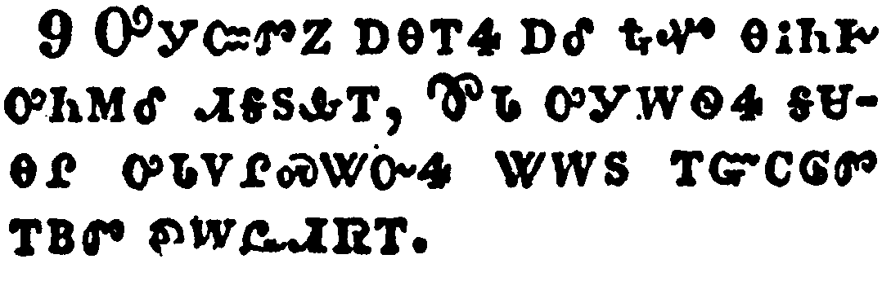</a></td>
</tr>
<tr class="even">
<td>On the morrow, as they went on their journey, and drew nigh unto the city, Peter went up upon the housetop to pray about the sixth hour:</td>
</tr>
<tr class="odd">
<td>ᎤᎩᏨᏛᏃ ᎠᎾᎢᏎ ᎠᎴ ᎿᎭᏉ ᎾᎥᏂᎨ ᎤᏂᎷᎴ ᏗᎦᏚᎲᎢ, ᏈᏓ ᎤᎩᎳᏫᏎ ᎦᏌᎾᎵ ᎤᏓᏙᎵᏍᏔᏅᏎ ᏔᎳᏚ ᎢᏳᏟᎶᏛ ᎢᏴᏛ ᎧᎳᏩᏗᏒᎢ.</td>
</tr>
<tr class="even">
<td>U-gi-tsv-dv-no a-na-i-se a-le hna-quo na-v-ni-ge u-ni-lu-le di-ga-du-hv-i, Qui-da u-gi-la-wi-se ga-sa-na-li u-da-do-li-s-ta-nv-se ta-la-du i-yu-tli-lo-dv i-yv-dv ka-la-wa-di-sv-i.</td>
</tr>
</tbody>
</table>

<table>
<tbody>
<tr class="odd">
<td><a href="051010.png">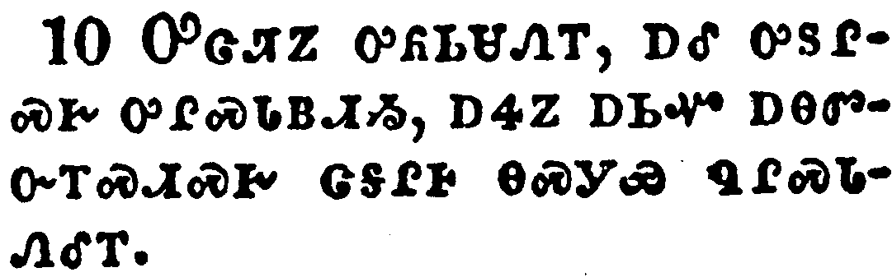</a></td>
</tr>
<tr class="even">
<td>And he became very hungry, and would have eaten: but while they made ready, he fell into a trance,</td>
</tr>
<tr class="odd">
<td>ᎤᏣᏘᏃ ᎤᏲᏏᏌᏁᎢ, ᎠᎴ ᎤᏚᎵᏍᎨ ᎤᎵᏍᏓᏴᏗᏱ, ᎠᏎᏃ ᎠᏏᏉ ᎠᎾᏛᏅᎢᏍᏗᏍᎨ ᏣᎦᎵᎰ ᎾᏍᎩᏯ ᏄᎵᏍᏓᏁᎴᎢ.</td>
</tr>
<tr class="even">
<td>U-tsa-ti-no u-yo-si-sa-ne-i, a-le u-du-li-s-ge u-li-s-da-yv-di-yi, a-se-no a-si-quo a-na-dv-nv-i-s-di-s-ge tsa-ga-li-ho na-s-gi-ya nu-li-s-da-ne-le-i.</td>
</tr>
</tbody>
</table>

<table>
<tbody>
<tr class="odd">
<td><a href="051011.png">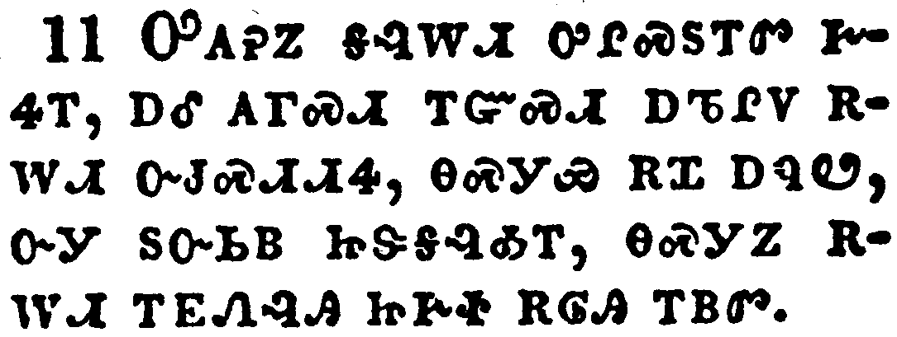</a></td>
</tr>
<tr class="even">
<td>And saw heaven opened, and a certain vessel descending unto him, as it had been a great sheet knit at the four corners, and let down to the earth:</td>
</tr>
<tr class="odd">
<td>ᎤᎪᎮᏃ ᎦᎸᎳᏗ ᎤᎵᏍᏚᎢᏛ ᎨᏎᎢ, ᎠᎴ ᎪᎱᏍᏗ ᎢᏳᏍᏗ ᎠᏖᎵᏙ ᎡᎳᏗ ᏅᏧᏍᏗᏗᏎ, ᎾᏍᎩᏯ ᎡᏆ ᎠᏄᏬ, ᏅᎩ ᏚᏅᏏᏴ ᏥᏕᎦᎸᎣᎢ, ᎾᏍᎩᏃ ᎡᎳᏗ ᎢᎬᏁᎸᎯ ᏥᎨᏐ ᎡᎶᎯ ᎢᏴᏛ.</td>
</tr>
<tr class="even">
<td>U-go-he-no ga-lv-la-di u-li-s-du-i-dv ge-se-i, a-le go-hu-s-di i-yu-s-di a-te-li-do e-la-di nv-tsu-s-di-di-se, na-s-gi-ya e-qua a-nu-wo, nv-gi du-nv-si-yv tsi-de-ga-lv-o-i, na-s-gi-no e-la-di i-gv-ne-lv-hi tsi-ge-so e-lo-hi i-yv-dv.</td>
</tr>
</tbody>
</table>

<table>
<tbody>
<tr class="odd">
<td><a href="051012.png">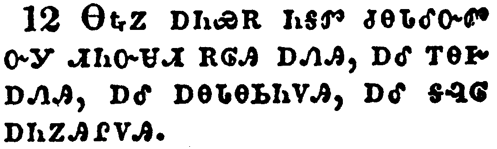</a></td>
</tr>
<tr class="even">
<td>Wherein were all manner of fourfooted beasts of the earth, and wild beasts, and creeping things, and fowls of the air.</td>
</tr>
<tr class="odd">
<td>ᎾᎿᎭᏃ ᎠᏂᏯᎡ ᏂᎦᏛ ᏧᎾᏓᎴᏅᏛ ᏅᎩ ᏗᏂᏅᏌᏗ ᎡᎶᎯ ᎠᏁᎯ, ᎠᎴ ᎢᎾᎨ ᎠᏁᎯ, ᎠᎴ ᎠᎾᏓᎾᏏᏂᏙᎯ, ᎠᎴ ᎦᎸᎶ ᎠᏂᏃᎯᎵᏙᎯ.</td>
</tr>
<tr class="even">
<td>Na-hna-no a-ni-ya-e ni-ga-dv tsu-na-da-le-nv-dv nv-gi di-ni-nv-sa-di e-lo-hi a-ne-hi, a-le i-na-ge a-ne-hi, a-le a-na-da-na-si-ni-do-hi, a-le ga-lv-lo a-ni-no-hi-li-do-hi.</td>
</tr>
</tbody>
</table>

<table>
<tbody>
<tr class="odd">
<td><a href="051013.png">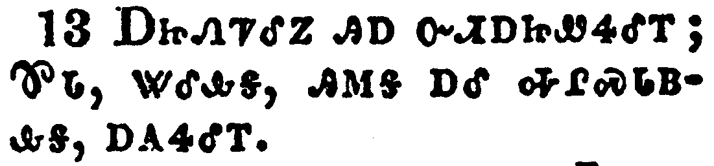</a></td>
</tr>
<tr class="even">
<td>And there came a voice to him, Rise, Peter; kill, and eat.</td>
</tr>
<tr class="odd">
<td>ᎠᏥᏁᏤᎴᏃ ᎯᎠ ᏅᏗᎠᏥᏪᏎᎴᎢ; ᏈᏓ, ᏔᎴᎲᎦ, ᎯᎷᎦ ᎠᎴ ᎭᎵᏍᏓᏴᎲᎦ, ᎠᎪᏎᎴᎢ.</td>
</tr>
<tr class="even">
<td>A-tsi-ne-tse-le-no hi-a nv-di-a-tsi-we-se-le-i; Qui-da, ta-le-hv-ga, hi-lu-ga a-le ha-li-s-da-yv-hv-ga, a-go-se-le-i.</td>
</tr>
</tbody>
</table>

<table>
<tbody>
<tr class="odd">
<td><a href="051014.png">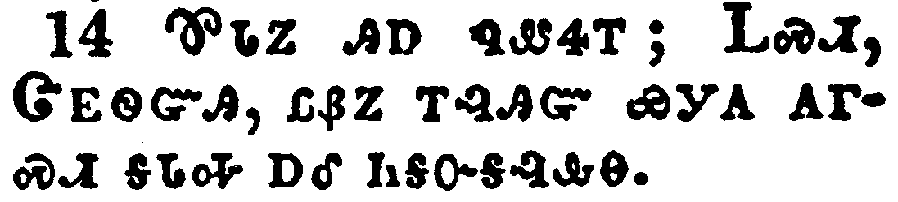</a></td>
</tr>
<tr class="even">
<td>But Peter said, Not so, Lord; for I have never eaten any thing that is common or unclean.</td>
</tr>
<tr class="odd">
<td>ᏈᏓᏃ ᎯᎠ ᏄᏪᏎᎢ; ᏞᏍᏗ, ᏣᎬᏫᏳᎯ, ᏞᏰᏃ ᎢᎸᎯᏳ ᏯᎩᎪ ᎪᎱᏍᏗ ᎦᏓᎭ ᎠᎴ ᏂᎦᏅᎦᎸᎲᎾ.</td>
</tr>
<tr class="even">
<td>Qui-da-no hi-a nu-we-se-i; Tle-s-di, Tsa-gv-wi-yu-hi, tle-ye-no i-lv-hi-yu ya-gi-go go-hu-s-di ga-da-ha a-le ni-ga-nv-ga-lv-hv-na.</td>
</tr>
</tbody>
</table>

<table>
<tbody>
<tr class="odd">
<td><a href="051015.png">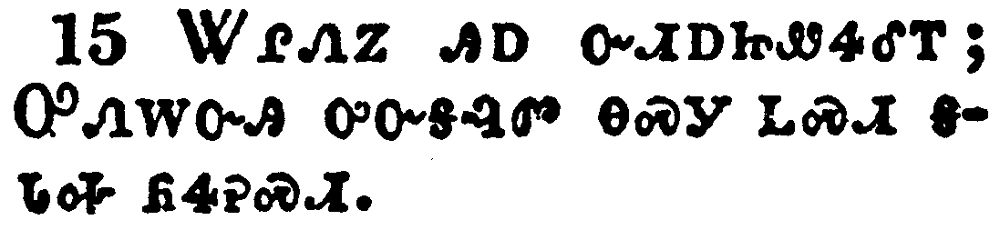</a></td>
</tr>
<tr class="even">
<td>And the voice spake unto him again the second time, What God hath cleansed, that call not thou common.</td>
</tr>
<tr class="odd">
<td>ᏔᎵᏁᏃ ᎯᎠ ᏅᏗᎠᏥᏪᏎᎵᎢ; ᎤᏁᎳᏅᎯ ᎤᏅᎦᎸᏛ ᎾᏍᎩ ᏞᏍᏗ ᎦᏓᎭ ᏲᏎᎮᏍᏗ.</td>
</tr>
<tr class="even">
<td>Ta-li-ne-no hi-a nv-di-a-tsi-we-se-li-i; U-ne-la-nv-hi u-nv-ga-lv-dv na-s-gi tle-s-di ga-da-ha yo-se-he-s-di.</td>
</tr>
</tbody>
</table>

<table>
<tbody>
<tr class="odd">
<td><a href="051016.png">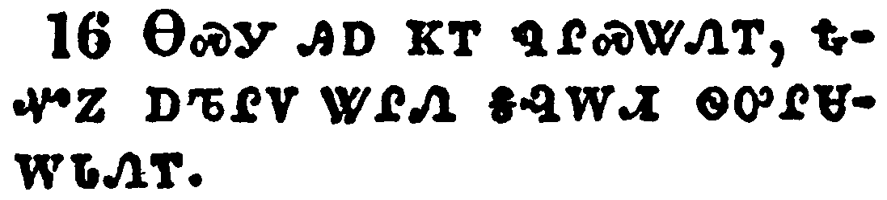</a></td>
</tr>
<tr class="even">
<td>This was done thrice: and the vessel was received up again into heaven.</td>
</tr>
<tr class="odd">
<td>ᎾᏍᎩ ᎯᎠ ᏦᎢ ᏄᎵᏍᏔᏁᎢ, ᎿᎭᏉᏃ ᎠᏖᎵᏙ ᏔᎵᏁ ᎦᎸᎳᏗ ᏫᎤᎵᏌᎳᏓᏁᎢ.</td>
</tr>
<tr class="even">
<td>Na-s-gi hi-a tso-i nu-li-s-ta-ne-i, hna-quo-no a-te-li-do ta-li-ne ga-lv-la-di wi-u-li-sa-la-da-ne-i.</td>
</tr>
</tbody>
</table>

<table>
<tbody>
<tr class="odd">
<td><a href="051017.png">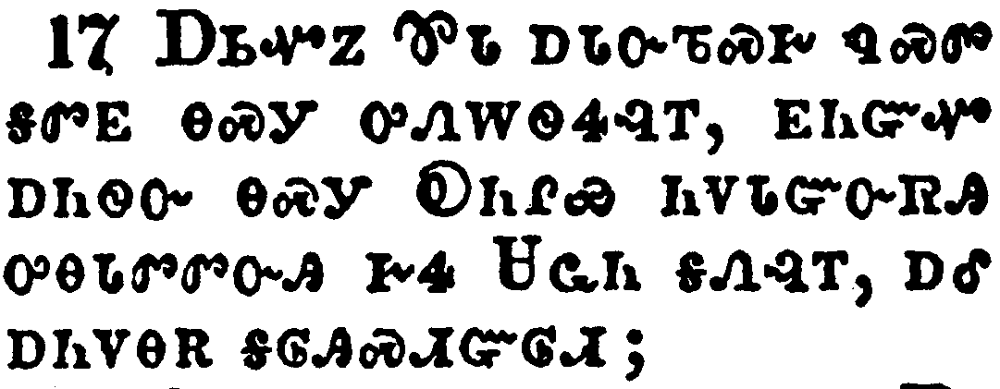</a></td>
</tr>
<tr class="even">
<td>Now while Peter doubted in himself what this vision which he had seen should mean, behold, the men which were sent from Cornelius had made inquiry for Simon's house, and stood before the gate,</td>
</tr>
<tr class="odd">
<td>ᎠᏏᏉᏃ ᏈᏓ ᎠᏓᏅᏖᏍᎨ ᏄᏍᏛ ᎦᏛᎬ ᎾᏍᎩ ᎤᏁᎳᏫᏎᎸᎢ, ᎬᏂᏳᏉ ᎠᏂᏫᏅ ᎾᏍᎩ ᎧᏂᎵᏯ ᏂᏙᏓᏳᏅᏒᎯ ᎤᎾᏓᏛᏛᏅᎯ ᎨᏎ ᏌᏩᏂ ᎦᏁᎸᎢ, ᎠᎴ ᎠᏂᏙᎾᎡ ᎦᎶᎯᏍᏗᏳᎶᏗ;</td>
</tr>
<tr class="even">
<td>A-si-quo-no Qui-da a-da-nv-te-s-ge nu-s-dv ga-dv-gv na-s-gi u-ne-la-wi-se-lv-i, gv-ni-yu-quo a-ni-wi-nv na-s-gi Ka-ni-li-ya ni-do-da-yu-nv-sv-hi u-na-da-dv-dv-nv-hi ge-se Sa-wa-ni ga-ne-lv-i, a-le a-ni-do-na-e ga-lo-hi-s-di-yu-lo-di;</td>
</tr>
</tbody>
</table>

<table>
<tbody>
<tr class="odd">
<td><a href="051018.png">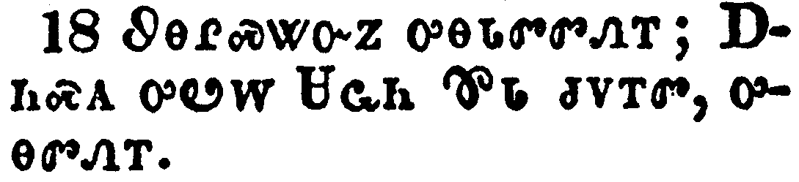</a></td>
</tr>
<tr class="even">
<td>And called, and asked whether Simon, which was surnamed Peter, were lodged there.</td>
</tr>
<tr class="odd">
<td>ᏭᎾᎵᏍᏔᏅᏃ ᎤᎾᏓᏛᏛᏁᎢ; ᎠᏂᏍᎪ ᎤᏬᎳ ᏌᏩᏂ ᏈᏓ ᏧᏙᎢᏛ, ᎤᎾᏛᏁᎢ.</td>
</tr>
<tr class="even">
<td>Wu-na-li-s-ta-nv-no u-na-da-dv-dv-ne-i; A-ni-s-go u-wo-la Sa-wa-ni Qui-da tsu-do-i-dv, u-na-dv-ne-i.</td>
</tr>
</tbody>
</table>

<table>
<tbody>
<tr class="odd">
<td><a href="051019.png">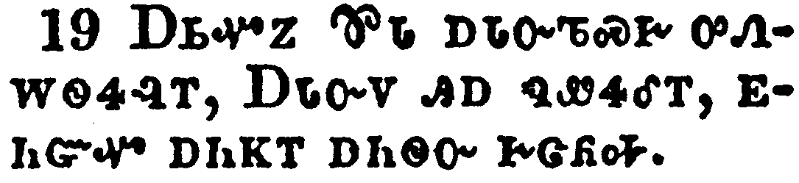</a></td>
</tr>
<tr class="even">
<td>While Peter thought on the vision, the Spirit said unto him, Behold, three men seek thee.</td>
</tr>
<tr class="odd">
<td>ᎠᏏᏉᏃ ᏈᏓ ᎠᏓᏅᏖᏍᎨ ᎤᏁᎳᏫᏎᎸᎢ, ᎠᏓᏅᏙ ᎯᎠ ᏄᏪᏎᎴᎢ, ᎬᏂᏳᏉ ᎠᏂᏦᎢ ᎠᏂᏫᏅ ᎨᏣᏲᎭ.</td>
</tr>
<tr class="even">
<td>A-si-quo-no Qui-da a-da-nv-te-s-ge u-ne-la-wi-se-lv-i, A-da-nv-do hi-a nu-we-se-le-i, gv-ni-yu-quo a-ni-tso-i a-ni-wi-nv ge-tsa-yo-ha.</td>
</tr>
</tbody>
</table>

<table>
<tbody>
<tr class="odd">
<td><a href="051020.png">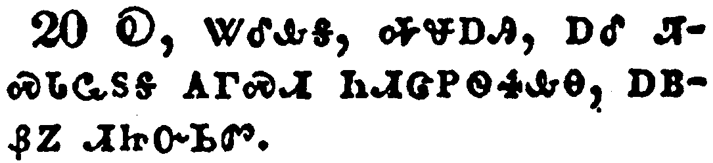</a></td>
</tr>
<tr class="even">
<td>Arise therefore, and get thee down, and go with them, doubting nothing: for I have sent them.</td>
</tr>
<tr class="odd">
<td>Ꭷ, ᏔᎴᎲᎦ, ᎭᏠᎠᎯ, ᎠᎴ ᏘᏍᏓᏩᏚᎦ ᎪᎱᏍᏗ ᏂᏗᏣᏢᏫᏎᎲᎾ, ᎠᏴᏰᏃ ᏗᏥᏅᏏᏛ.</td>
</tr>
<tr class="even">
<td>Ka, ta-le-hv-ga, ha-tlo-a-hi, a-le ti-s-da-wa-du-ga go-hu-s-di ni-di-tsa-tlv-wi-se-hv-na, a-yv-ye-no di-tsi-nv-si-dv.</td>
</tr>
</tbody>
</table>

<table>
<tbody>
<tr class="odd">
<td><a href="051021.png">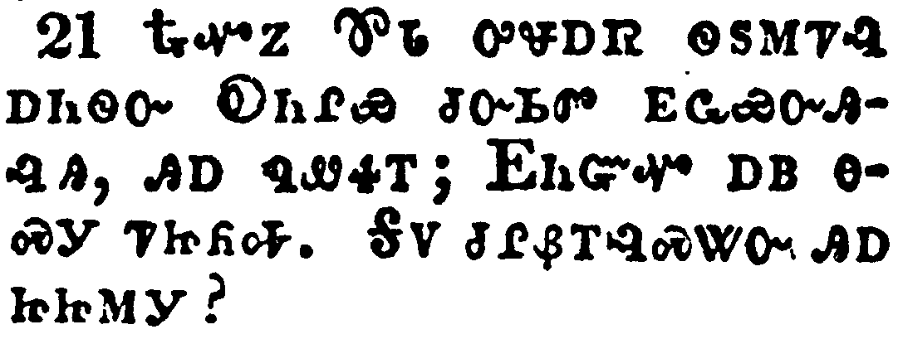</a></td>
</tr>
<tr class="even">
<td>Then Peter went down to the men which were sent unto him from Cornelius; and said, Behold, I am he whom ye seek: what is the cause wherefore ye are come?</td>
</tr>
<tr class="odd">
<td>ᎿᎭᏉᏃ ᏈᏓ ᎤᏠᎠᏒ ᏫᏚᎷᏤᎸ ᎠᏂᏫᏅ ᎧᏂᎵᏯ ᏧᏅᏏᏛ ᎬᏩᏯᏅᎯᎸᎯ, ᎯᎠ ᏄᏪᏎᎢ; ᎬᏂᏳᏉ ᎠᏴ ᎾᏍᎩ ᏤᏥᏲᎭ. ᎦᏙ ᏧᎵᏰᎢᎸᏍᏔᏅ ᎯᎠ ᏥᏥᎷᎩ?</td>
</tr>
<tr class="even">
<td>Hna-quo-no Qui-da u-tlo-a-sv wi-du-lu-tse-lv a-ni-wi-nv Ka-ni-li-ya tsu-nv-si-dv gv-wa-ya-nv-hi-lv-hi, hi-a nu-we-se-i; Gv-ni-yu-quo a-yv na-s-gi tse-tsi-yo-ha. Ga-do tsu-li-ye-i-lv-s-ta-nv hi-a tsi-tsi-lu-gi?</td>
</tr>
</tbody>
</table>

<table>
<tbody>
<tr class="odd">
<td><a href="051022.png">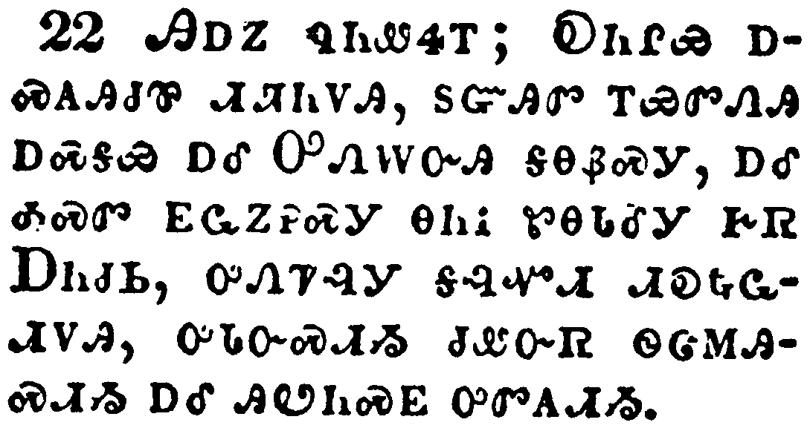</a></td>
</tr>
<tr class="even">
<td>And they said, Cornelius the centurion, a just man, and one that feareth God, and of good report among all the nation of the Jews, was warned from God by an holy angel to send for thee into his house, and to hear words of thee.</td>
</tr>
<tr class="odd">
<td>ᎯᎠᏃ ᏄᏂᏪᏎᎢ; ᎧᏂᎵᏯ ᎠᏍᎪᎯᏧᏈ ᏗᏘᏂᏙᎯ, ᏚᏳᎯᏛ ᎢᏯᏛᏁᎯ ᎠᏍᎦᏯ ᎠᎴ ᎤᏁᎳᏅᎯ ᎦᎾᏰᏍᎩ, ᎠᎴ ᎣᏍᏛ ᎬᏩᏃᎮᏍᎩ ᎾᏂᎥ ᏑᎾᏓᎴᎩ ᎨᏒ ᎠᏂᏧᏏ, ᎤᏁᏤᎸᎩ ᎦᎸᏉᏗ ᏗᎧᎿᎭᏩᏗᏙᎯ, ᎤᏓᏅᏍᏗᏱ ᏧᏪᏅᏒ ᏫᏣᎷᎯᏍᏗᏱ ᎠᎴ ᎯᏬᏂᏍᎬ ᎤᏛᎪᏗᏱ.</td>
</tr>
<tr class="even">
<td>Hi-a-no nu-ni-we-se-i; Ka-ni-li-ya a-s-go-hi-tsu-qui di-ti-ni-do-hi, du-yu-hi-dv i-ya-dv-ne-hi a-s-ga-ya a-le U-ne-la-nv-hi ga-na-ye-s-gi, a-le o-s-dv gv-wa-no-he-s-gi na-ni-v su-na-da-le-gi ge-sv A-ni-tsu-si, u-ne-tse-lv-gi ga-lv-quo-di di-ka-hna-wa-di-do-hi, u-da-nv-s-di-yi tsu-we-nv-sv wi-tsa-lu-hi-s-di-yi a-le hi-wo-ni-s-gv u-dv-go-di-yi.</td>
</tr>
</tbody>
</table>

<table>
<tbody>
<tr class="odd">
<td><a href="051023.png">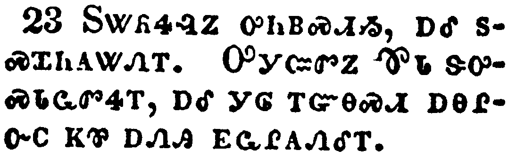</a></td>
</tr>
<tr class="even">
<td>Then called he them in, and lodged them. And on the morrow Peter went away with them, and certain brethren from Joppa accompanied him.</td>
</tr>
<tr class="odd">
<td>ᏚᏔᏲᏎᎸᏃ ᎤᏂᏴᏍᏗᏱ, ᎠᎴ ᏚᏍᏆᏂᎪᏔᏁᎢ. ᎤᎩᏨᏛᏃ ᏈᏓ ᏕᎤᏍᏓᏩᏛᏎᎢ, ᎠᎴ ᎩᎶ ᎢᏳᎾᏍᏗ ᎠᎾᎵᏅᏟ ᏦᏈ ᎠᏁᎯ ᎬᏩᎵᎪᏁᎴᎢ.</td>
</tr>
<tr class="even">
<td>Du-ta-yo-se-lv-no u-ni-yv-s-di-yi, a-le du-s-qua-ni-go-ta-ne-i. U-gi-tsv-dv-no Qui-da de-u-s-da-wa-dv-se-i, a-le gi-lo i-yu-na-s-di a-na-li-nv-tli tso-qui a-ne-hi gv-wa-li-go-ne-le-i.</td>
</tr>
</tbody>
</table>

<table>
<tbody>
<tr class="odd">
<td></td>
</tr>
<tr class="even">
<td>And the morrow after they entered into Caesarea. And Cornelius waited for them, and had called together his kinsmen and near friends.</td>
</tr>
<tr class="odd">
<td>ᏫᎤᎩᏨᏅᏃ ᏏᏌᎵᏱ ᏭᏂᏴᎴᎢ. ᎧᏂᎵᏯᏃ ᎤᏂᎦᏘᏰᎢ, ᎠᎴ ᏧᏪᏟᏌᏅᎯ ᎨᏎ ᎪᎱᏍᏗ ᏧᏩᏂ ᎠᎴ ᏧᎵᎢ.</td>
</tr>
<tr class="even">
<td>Wi-u-gi-tsv-nv-no Si-sa-li-yi wu-ni-yv-le-i. Ka-ni-li-ya-no u-ni-ga-ti-ye-i, a-le tsu-we-tli-sa-nv-hi ge-se go-hu-s-di tsu-wa-ni a-le tsu-li-i.</td>
</tr>
</tbody>
</table>

<table>
<tbody>
<tr class="odd">
<td><a href="051025.png">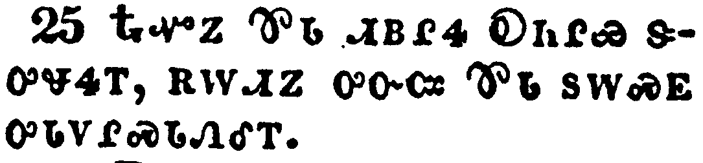</a></td>
</tr>
<tr class="even">
<td>And as Peter was coming in, Cornelius met him, and fell down at his feet, and worshipped him.</td>
</tr>
<tr class="odd">
<td>ᎿᎭᏉᏃ ᏈᏓ ᏗᏴᎵᏎ ᎧᏂᎵᏯ ᏕᎤᏠᏎᎢ, ᎡᎳᏗᏃ ᎤᏅᏨ ᏈᏓ ᏚᎳᏍᎬ ᎤᏓᏙᎵᏍᏓᏁᎴᎢ.</td>
</tr>
<tr class="even">
<td>Hna-quo-no Qui-da di-yv-li-se Ka-ni-li-ya de-u-tlo-se-i, e-la-di-no u-nv-tsv Qui-da du-la-s-gv u-da-do-li-s-da-ne-le-i.</td>
</tr>
</tbody>
</table>

<table>
<tbody>
<tr class="odd">
<td><a href="051026.png">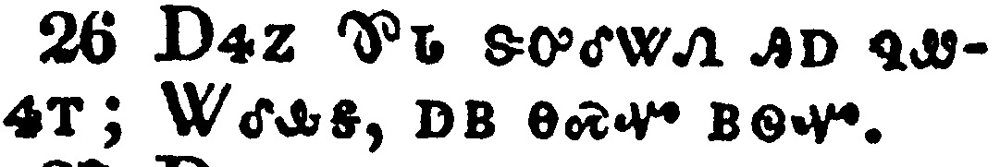</a></td>
</tr>
<tr class="even">
<td>But Peter took him up, saying, Stand up; I myself also am a man.</td>
</tr>
<tr class="odd">
<td>ᎠᏎᏃ ᏈᏓ ᏕᎤᎴᏔᏁ ᎯᎠ ᏄᏪᏎᎢ; ᏔᎴᎲᎦ, ᎠᏴ ᎾᏍᏉ ᏴᏫᏉ.</td>
</tr>
<tr class="even">
<td>A-se-no Qui-da de-u-le-ta-ne hi-a nu-we-se-i; Ta-le-hv-ga, a-yv na-s-quo yv-wi-quo.</td>
</tr>
</tbody>
</table>

<table>
<tbody>
<tr class="odd">
<td><a href="051027.png">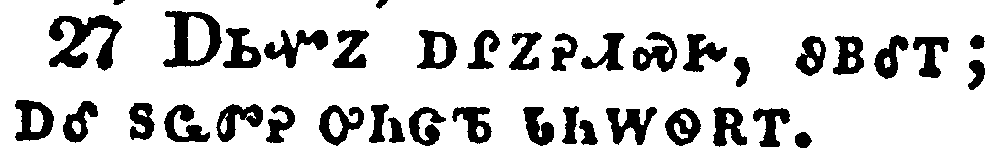</a></td>
</tr>
<tr class="even">
<td>And as he talked with him, he went in, and found many that were come together.</td>
</tr>
<tr class="odd">
<td>ᎠᏎᏉᏃ ᎠᎵᏃᎮᏗᏍᎨ, ᏭᏴᎴᎢ; ᎠᎴ ᏚᏩᏛᎮ ᎤᏂᏣᏖ ᏓᏂᎳᏫᎡᎢ.</td>
</tr>
<tr class="even">
<td>A-se-quo-no a-li-no-he-di-s-ge, wu-yv-le-i; a-le du-wa-dv-he u-ni-tsa-te da-ni-la-wi-e-i.</td>
</tr>
</tbody>
</table>

<table>
<tbody>
<tr class="odd">
<td><a href="051028.png">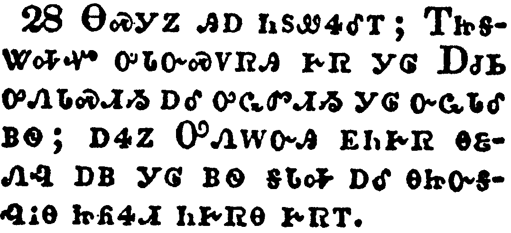</a></td>
</tr>
<tr class="even">
<td>And he said unto them, Ye know how that it is an unlawful thing for a man that is a Jew to keep company, or come unto one of another nation; but God hath shewed me that I should not call any man common or unclean.</td>
</tr>
<tr class="odd">
<td>ᎾᏍᎩᏃ ᎯᎠ ᏂᏚᏪᏎᎴᎢ; ᎢᏥᎦᏔᎭᏉ ᎤᏓᏅᏍᏙᏒᎯ ᎨᏒ ᎩᎶ ᎠᏧᏏ ᎤᏁᏓᏍᏗᏱ ᎠᎴ ᎤᏩᏛᏗᏱ ᎩᎶ ᏅᏩᏓᎴ ᏴᏫ; ᎠᏎᏃ ᎤᏁᎳᏅᎯ ᎬᏂᎨᏒ ᎾᏋᏁᎸ ᎠᏴ ᎩᎶ ᏴᏫ ᎦᏓᎭ ᎠᎴ ᎾᏥᏅᎦᎸᎥᎾ ᏥᏲᏎᏗ ᏂᎨᏒᎾ ᎨᏒᎢ.</td>
</tr>
<tr class="even">
<td>Na-s-gi-no hi-a ni-du-we-se-le-i; I-tsi-ga-ta-ha-quo u-da-nv-s-do-sv-hi ge-sv gi-lo A-tsu-si u-ne-da-s-di-yi a-le u-wa-dv-di-yi gi-lo nv-wa-da-le yv-wi; a-se-no U-ne-la-nv-hi gv-ni-ge-sv na-quv-ne-lv a-yv gi-lo yv-wi ga-da-ha a-le na-tsi-nv-ga-lv-v-na tsi-yo-se-di ni-ge-sv-na ge-sv-i.</td>
</tr>
</tbody>
</table>

<table>
<tbody>
<tr class="odd">
<td><a href="051029.png">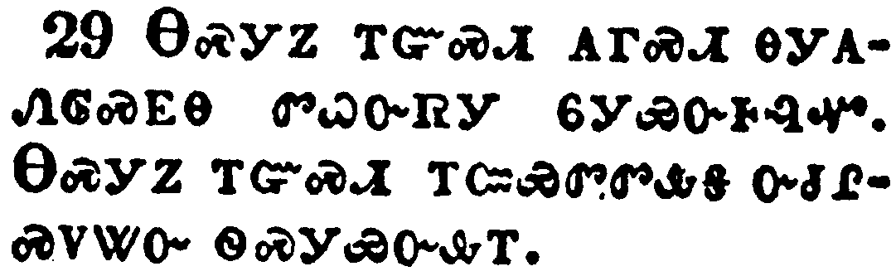</a></td>
</tr>
<tr class="even">
<td>Therefore came I unto you without gainsaying, as soon as I was sent for: I ask therefore for what intent ye have sent for me?</td>
</tr>
<tr class="odd">
<td>ᎾᏍᎩᏃ ᎢᏳᏍᏗ ᎪᎱᏍᏗ ᎾᏍᎪᏁᎶᏍᎬᎾ ᏛᏇᏅᏒᎩ ᏮᎩᏯᏅᎰᎸᏉ. ᎾᏍᎩᏃ ᎢᏳᏍᏗ ᎢᏨᏯᏛᏛᎲᎦ ᏅᏧᎵᏍᏙᏔᏅ ᏫᏍᎩᏯᏅᎲᎢ.</td>
</tr>
<tr class="even">
<td>Na-s-gi-no i-yu-s-di go-hu-s-di na-s-go-ne-lo-s-gv-na dv-que-nv-sv-gi wv-gi-ya-nv-ho-lv-quo. Na-s-gi-no i-yu-s-di i-tsv-ya-dv-dv-hv-ga nv-tsu-li-s-do-ta-nv wi-s-gi-ya-nv-hv-i.</td>
</tr>
</tbody>
</table>

<table>
<tbody>
<tr class="odd">
<td><a href="051030.png">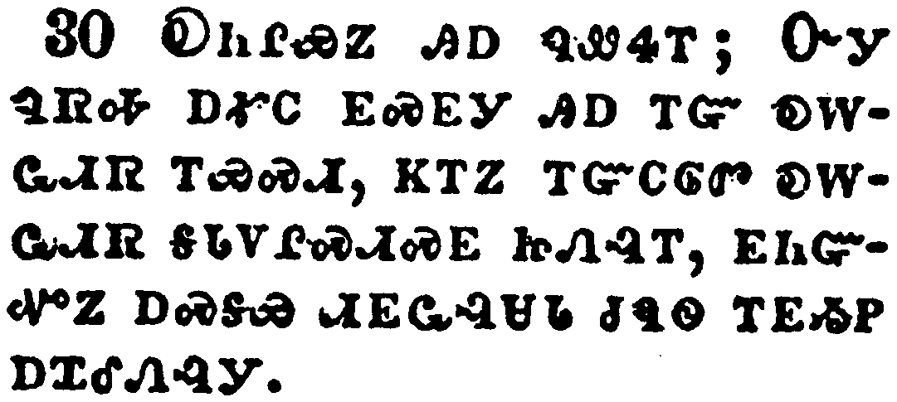</a></td>
</tr>
<tr class="even">
<td>And Cornelius said, Four days ago I was fasting until this hour; and at the ninth hour I prayed in my house, and, behold, a man stood before me in bright clothing,</td>
</tr>
<tr class="odd">
<td>ᎧᏂᎵᏯᏃ ᎯᎠ ᏄᏪᏎᎢ; ᏅᎩ ᏄᏒᎭ ᎠᎹᏟ ᎬᏍᎬᎩ ᎯᎠ ᎢᏳ ᎧᎳᏩᏗᏒ ᎢᏯᏍᏗ, ᏦᎢᏃ ᎢᏳᏟᎶᏛ ᎧᎳᏩᏗᏒ ᎦᏓᏙᎵᏍᏗᏍᎬ ᏥᏁᎸᎢ, ᎬᏂᏳᏉᏃ ᎠᏍᎦᏯ ᏗᎬᏩᎸᏌᏓ ᏧᏄᏫ ᎢᎬᏱᏢ ᎠᏆᎴᏁᎸᎩ.</td>
</tr>
<tr class="even">
<td>Ka-ni-li-ya-no hi-a nu-we-se-i; Nv-gi nu-sv-ha a-ma-tli gv-s-gv-gi hi-a i-yu ka-la-wa-di-sv i-ya-s-di, tso-i-no i-yu-tli-lo-dv ka-la-wa-di-sv ga-da-do-li-s-di-s-gv tsi-ne-lv-i, gv-ni-yu-quo-no a-s-ga-ya di-gv-wa-lv-sa-da tsu-nu-wi i-gv-yi-tlv a-qua-le-ne-lv-gi.</td>
</tr>
</tbody>
</table>

<table>
<tbody>
<tr class="odd">
<td><a href="051031.png">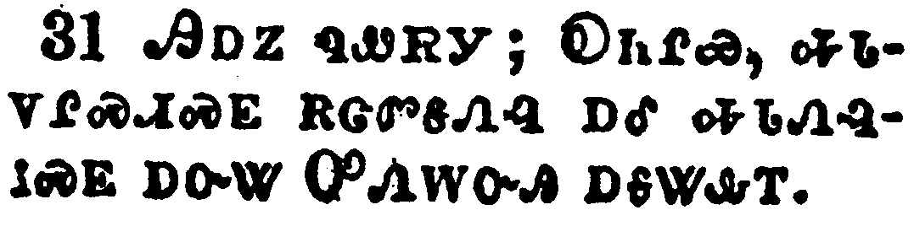</a></td>
</tr>
<tr class="even">
<td>And said, Cornelius, thy prayer is heard, and thine alms are had in remembrance in the sight of God.</td>
</tr>
<tr class="odd">
<td>ᎯᎠᏃ ᏄᏪᏒᎩ; ᎧᏂᎵᏯ, ᎭᏓᏙᎵᏍᏗᏍᎬ ᎡᏣᏛᎦᏁᎸ ᎠᎴ ᎭᏓᏁᎸᎢᏍᎬ ᎠᏅᏔ ᎤᏁᎳᏅᎯ ᎠᎦᏔᎲᎢ.</td>
</tr>
<tr class="even">
<td>Hi-a-no nu-we-sv-gi; Ka-ni-li-ya, ha-da-do-li-s-di-s-gv e-tsa-dv-ga-ne-lv a-le ha-da-ne-lv-i-s-gv a-nv-ta U-ne-la-nv-hi a-ga-ta-hv-i.</td>
</tr>
</tbody>
</table>

<table>
<tbody>
<tr class="odd">
<td><a href="051032.png">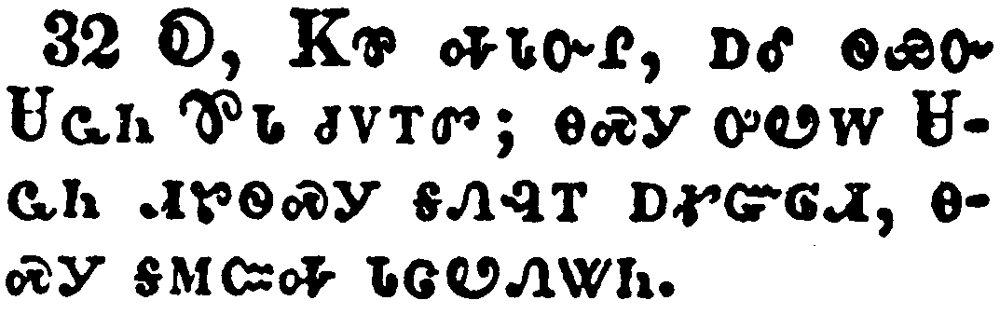</a></td>
</tr>
<tr class="even">
<td>Send therefore to Joppa, and call hither Simon, whose surname is Peter; he is lodged in the house of one Simon a tanner by the sea side: who, when he cometh, shall speak unto thee.</td>
</tr>
<tr class="odd">
<td>Ꭷ, ᏦᏈ ᎭᏓᏅᎵ, ᎠᎴ ᏫᏯᏅ ᏌᏩᏂ ᏈᏓ ᏧᏙᎢᏛ; ᎾᏍᎩ ᎤᏬᎳ ᏌᏩᏂ ᏗᏑᏫᏍᎩ ᎦᏁᎸᎢ ᎠᎹᏳᎶᏗ, ᎾᏍᎩ ᎦᎷᏨᎭ ᏓᏣᏬᏁᏔᏂ.</td>
</tr>
<tr class="even">
<td>Ka, Tso-qui ha-da-nv-li, a-le wi-ya-nv Sa-wa-ni Qui-da tsu-do-i-dv; na-s-gi u-wo-la Sa-wa-ni di-su-wi-s-gi ga-ne-lv-i a-ma-yu-lo-di, na-s-gi ga-lu-tsv-ha da-tsa-wo-ne-ta-ni.</td>
</tr>
</tbody>
</table>

<table>
<tbody>
<tr class="odd">
<td><a href="051033.png">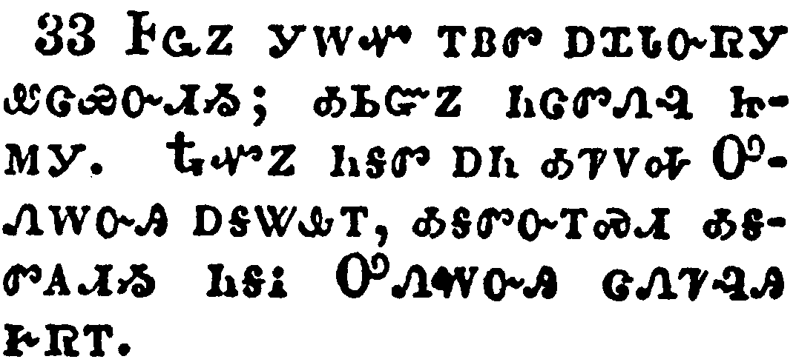</a></td>
</tr>
<tr class="even">
<td>Immediately therefore I sent to thee; and thou hast well done that thou art come. Now therefore are we all here present before God, to hear all things that are commanded thee of God.</td>
</tr>
<tr class="odd">
<td>ᎰᏩᏃ ᎩᎳᏉ ᎢᏴᏛ ᎠᏆᏓᏅᏒᎩ ᏪᏣᏯᏅᏗᏱ; ᎣᏏᏳᏃ ᏂᏣᏛᏁᎸ ᏥᎷᎩ. ᎿᎭᏉᏃ ᏂᎦᏛ ᎠᏂ ᎣᏤᏙᎭ ᎤᏁᎳᏅᎯ ᎠᎦᏔᎲᎢ, ᎣᎦᏛᏅᎢᏍᏗ ᎣᎦᏛᎪᏗᏱ ᏂᎦᎥ ᎤᏁᎳᏅᎯ ᏣᏁᏤᎸᎯ ᎨᏒᎢ.</td>
</tr>
<tr class="even">
<td>Ho-wa-no gi-la-quo i-yv-dv a-qua-da-nv-sv-gi we-tsa-ya-nv-di-yi; o-si-yu-no ni-tsa-dv-ne-lv tsi-lu-gi. Hna-quo-no ni-ga-dv a-ni o-tse-do-ha U-ne-la-nv-hi a-ga-ta-hv-i, o-ga-dv-nv-i-s-di o-ga-dv-go-di-yi ni-ga-v U-ne-la-nv-hi tsa-ne-tse-lv-hi ge-sv-i.</td>
</tr>
</tbody>
</table>

<table>
<tbody>
<tr class="odd">
<td><a href="051034.png">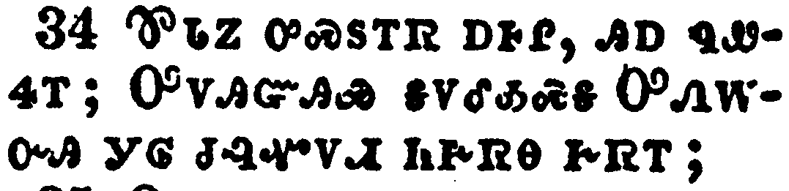</a></td>
</tr>
<tr class="even">
<td>Then Peter opened his mouth, and said, Of a truth I perceive that God is no respecter of persons:</td>
</tr>
<tr class="odd">
<td>ᏈᏓᏃ ᎤᏍᏚᎢᏒ ᎠᎰᎵ, ᎯᎠ ᏄᏪᏎᎢ; ᎤᏙᎯᏳᎯᏯ ᎦᏙᎴᎣᏍᎦ ᎤᏁᎳᏅᎯ ᎩᎶ ᏧᎸᏉᏙᏗ ᏂᎨᏒᎾ ᎨᏒᎢ;</td>
</tr>
<tr class="even">
<td>Qui-da-no u-s-du-i-sv a-ho-li, hi-a nu-we-se-i; U-do-hi-yu-hi-ya ga-do-le-o-s-ga U-ne-la-nv-hi gi-lo tsu-lv-quo-do-di ni-ge-sv-na ge-sv-i;</td>
</tr>
</tbody>
</table>

<table>
<tbody>
<tr class="odd">
<td></td>
</tr>
<tr class="even">
<td>But in every nation he that feareth him, and worketh righteousness, is accepted with him.</td>
</tr>
<tr class="odd">
<td>ᎾᏂᎥᏉᏍᎩᏂ ᏧᎾᏓᎴᏅᏛ ᏴᏫ ᎠᏁᎲᎢ ᎩᎶ ᎾᏍᎩ ᏳᎾᏰᏍᎦ ᎠᎴ ᏚᏳᎪᏛ ᏱᏚᎸᏫᏍᏓᏁᎭ ᎾᏍᎩ ᏓᎦᏓᏂᎸᎪᎢ.</td>
</tr>
<tr class="even">
<td>Na-ni-v-quo-s-gi-ni tsu-na-da-le-nv-dv yv-wi a-ne-hv-i gi-lo na-s-gi yu-na-ye-s-ga a-le du-yu-go-dv yi-du-lv-wi-s-da-ne-ha na-s-gi da-ga-da-ni-lv-go-i.</td>
</tr>
</tbody>
</table>

<table>
<tbody>
<tr class="odd">
<td><a href="051036.png">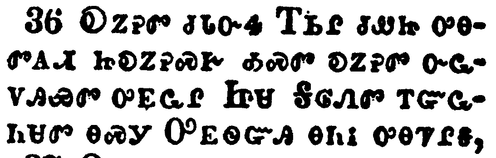</a></td>
</tr>
<tr class="even">
<td>The word which God sent unto the children of Israel, preaching peace by Jesus Christ: (he is Lord of all:)</td>
</tr>
<tr class="odd">
<td>ᎧᏃᎮᏛ ᏧᏓᏅᏎ ᎢᏏᎵ ᏧᏪᏥ ᎤᎾᏛᎪᏗ ᏥᎧᏃᎮᏍᎨ ᎣᏍᏛ ᎧᏃᎮᏛ ᏅᏩᏙᎯᏯᏛ ᎤᎬᏩᎵ ᏥᏌ ᎦᎶᏁᏛ ᎢᏳᏩᏂᏌᏛ ᎾᏍᎩ ᎤᎬᏫᏳᎯ ᎾᏂᎥ ᎤᎾᏤᎵᎦ,</td>
</tr>
<tr class="even">
<td>Ka-no-he-dv tsu-da-nv-se I-si-li tsu-we-tsi u-na-dv-go-di tsi-ka-no-he-s-ge o-s-dv ka-no-he-dv nv-wa-do-hi-ya-dv u-gv-wa-li Tsi-sa Ga-lo-ne-dv i-yu-wa-ni-sa-dv na-s-gi U-gv-wi-yu-hi na-ni-v u-na-tse-li-ga,</td>
</tr>
</tbody>
</table>

<table>
<tbody>
<tr class="odd">
<td><a href="051037.png">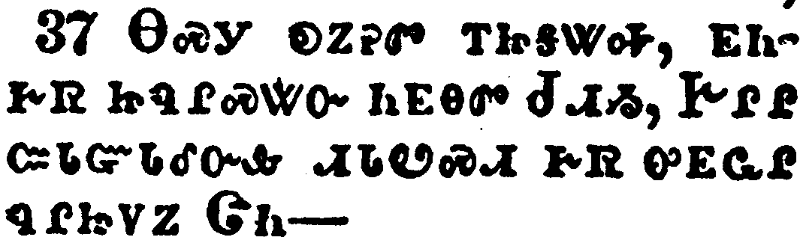</a></td>
</tr>
<tr class="even">
<td>That word, I say, ye know, which was published throughout all Judaea, and began from Galilee, after the baptism which John preached;</td>
</tr>
<tr class="odd">
<td>ᎾᏍᎩ ᎧᏃᎮᏛ ᎢᏥᎦᏔᎭ, ᎬᏂᎨᏒ ᏥᏄᎵᏍᏔᏅ ᏂᎬᎾᏛ ᏧᏗᏱ, ᎨᎵᎵ ᏨᏓᏳᏓᎴᏅᎲ ᏗᏓᏬᏍᏗ ᎨᏒ ᎤᎬᏩᎵ ᏄᎵᏥᏙᏃ ᏣᏂ^</td>
</tr>
<tr class="even">
<td>Na-s-gi ka-no-he-dv i-tsi-ga-ta-ha, gv-ni-ge-sv tsi-nu-li-s-ta-nv ni-gv-na-dv Tsu-di-yi, Ge-li-li tsv-da-yu-da-le-nv-hv di-da-wo-s-di ge-sv u-gv-wa-li nu-li-tsi-do-no Tsa-ni^</td>
</tr>
</tbody>
</table>

<table>
<tbody>
<tr class="odd">
<td><a href="051038.png">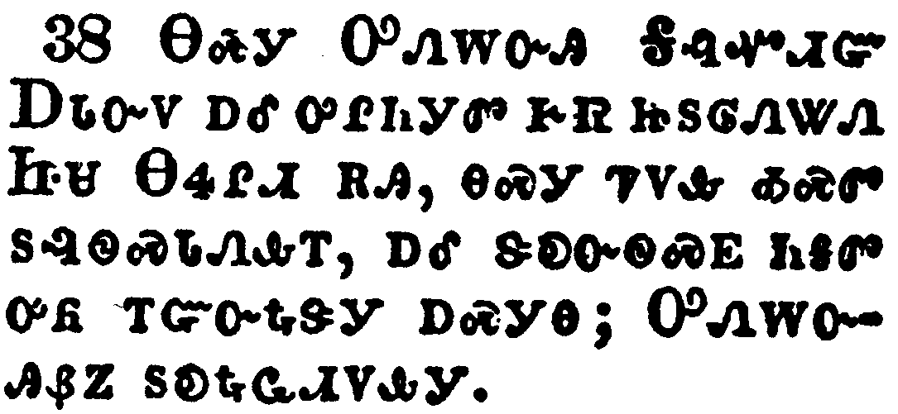</a></td>
</tr>
<tr class="even">
<td>How God anointed Jesus of Nazareth with the Holy Ghost and with power: who went about doing good, and healing all that were oppressed of the devil; for God was with him.</td>
</tr>
<tr class="odd">
<td>ᎾᏍᎩ ᎤᏁᎳᏅᎯ ᎦᎸᏉᏗᏳ ᎠᏓᏅᏙ ᎠᎴ ᎤᎵᏂᎩᏛ ᎨᏒ ᏥᏚᎶᏁᏔᏁ ᏥᏌ ᎾᏎᎵᏗ ᎡᎯ, ᎾᏍᎩ ᏤᏙᎲ ᎣᏍᏛ ᏚᎸᏫᏍᏓᏁᎲᎢ, ᎠᎴ ᏕᎧᏅᏫᏍᎬ ᏂᎦᏛ ᎤᏲ ᎢᏳᏅᎿᎭᏕᎩ ᎠᏍᎩᎾ; ᎤᏁᎳᏅᎯᏰᏃ ᏚᎧᎿᎭᏩᏗᏙᎲᎩ.</td>
</tr>
<tr class="even">
<td>Na-s-gi U-ne-la-nv-hi Ga-lv-quo-di-yu A-da-nv-do a-le u-li-ni-gi-dv ge-sv tsi-du-lo-ne-ta-ne Tsi-sa Na-se-li-di e-hi, na-s-gi tse-do-hv o-s-dv du-lv-wi-s-da-ne-hv-i, a-le de-ka-nv-wi-s-gv ni-ga-dv u-yo i-yu-nv-hna-de-gi a-s-gi-na; U-ne-la-nv-hi-ye-no du-ka-hna-wa-di-do-hv-gi.</td>
</tr>
</tbody>
</table>

<table>
<tbody>
<tr class="odd">
<td><a href="051039.png">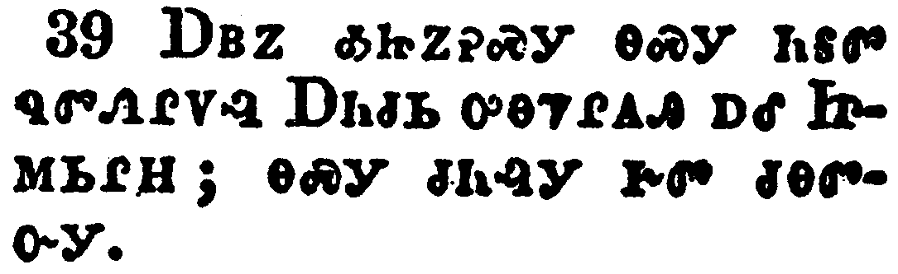</a></td>
</tr>
<tr class="even">
<td>And we are witnesses of all things which he did both in the land of the Jews, and in Jerusalem; whom they slew and hanged on a tree:</td>
</tr>
<tr class="odd">
<td>ᎠᏴᏃ ᎣᏥᏃᎮᏍᎩ ᎾᏍᎩ ᏂᎦᏛ ᏄᏛᏁᎵᏙᎸ ᎠᏂᏧᏏ ᎤᎾᏤᎵᎪᎯ ᎠᎴ ᏥᎷᏏᎵᎻ; ᎾᏍᎩ ᏧᏂᎸᎩ ᎨᏛ ᏧᎾᏛᏅᎩ.</td>
</tr>
<tr class="even">
<td>A-yv-no o-tsi-no-he-s-gi na-s-gi ni-ga-dv nu-dv-ne-li-do-lv A-ni-tsu-si u-na-tse-li-go-hi a-le Tsi-lu-si-li-mi; na-s-gi tsu-ni-lv-gi ge-dv tsu-na-dv-nv-gi.</td>
</tr>
</tbody>
</table>

<table>
<tbody>
<tr class="odd">
<td><a href="051040.png">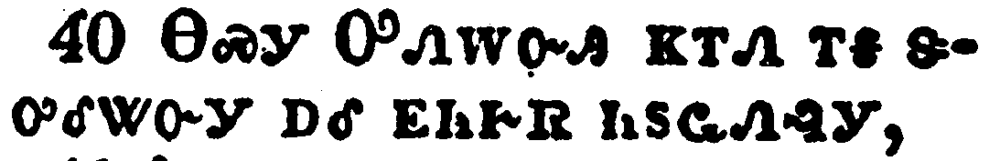</a></td>
</tr>
<tr class="even">
<td>Him God raised up the third day, and shewed him openly;</td>
</tr>
<tr class="odd">
<td>ᎾᏍᎩ ᎤᏁᎳᏅᎯ ᏦᎢᏁ ᎢᎦ ᏕᎤᎴᏔᏅᎩ ᎠᎴ ᎬᏂᎨᏒ ᏂᏚᏩᏁᎸᎩ,</td>
</tr>
<tr class="even">
<td>Na-s-gi U-ne-la-nv-hi tso-i-ne i-ga de-u-le-ta-nv-gi a-le gv-ni-ge-sv ni-du-wa-ne-lv-gi,</td>
</tr>
</tbody>
</table>

<table>
<tbody>
<tr class="odd">
<td><a href="051041.png">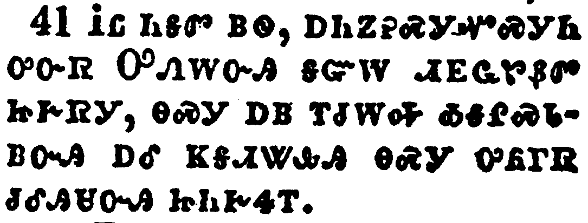</a></td>
</tr>
<tr class="even">
<td>Not to all the people, but unto witnesses chosen before of God, even to us, who did eat and drink with him after he rose from the dead.</td>
</tr>
<tr class="odd">
<td>ᎥᏝ ᏂᎦᏛ ᏴᏫ, ᎠᏂᏃᎮᏍᎩᏉᏍᎩᏂ ᎤᏅᏒ ᎤᏁᎳᏅᎯ ᎦᏳᎳ ᏗᎬᏩᏑᏰᏛ ᏥᎨᏒᎩ, ᎾᏍᎩ ᎠᏴ ᎢᏧᎳᎭ ᎣᎦᎵᏍᏓᏴᏅᎯ ᎠᎴ ᏦᎦᏗᏔᎲᎯ ᎾᏍᎩ ᎤᏲᎱᏒ ᏧᎴᎯᏌᏅᎯ ᏥᏂᎨᏎᎢ.</td>
</tr>
<tr class="even">
<td>V-tla ni-ga-dv yv-wi, a-ni-no-he-s-gi-quo-s-gi-ni u-nv-sv U-ne-la-nv-hi ga-yu-la di-gv-wa-su-ye-dv tsi-ge-sv-gi, na-s-gi a-yv i-tsu-la-ha o-ga-li-s-da-yv-nv-hi a-le tso-ga-di-ta-hv-hi na-s-gi u-yo-hu-sv tsu-le-hi-sa-nv-hi tsi-ni-ge-se-i.</td>
</tr>
</tbody>
</table>

<table>
<tbody>
<tr class="odd">
<td><a href="051042.png">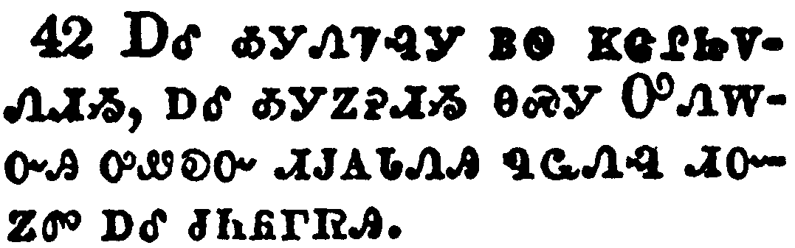</a></td>
</tr>
<tr class="even">
<td>And he commanded us to preach unto the people, and to testify that it is he which was ordained of God to be the Judge of quick and dead.</td>
</tr>
<tr class="odd">
<td>ᎠᎴ ᎣᎩᏁᏤᎸᎩ ᏴᏫ ᏦᏣᎵᏥᏙᏁᏗᏱ, ᎠᎴ ᎣᎩᏃᎮᏗᏱ ᎾᏍᎩ ᎤᏁᎳᏅᎯ ᎤᏪᎧᏅ ᏗᎫᎪᏓᏁᎯ ᏄᏩᏁᎸ ᏗᏅᏃᏛ ᎠᎴ ᏧᏂᏲᎱᏒᎯ.</td>
</tr>
<tr class="even">
<td>A-le o-gi-ne-tse-lv-gi yv-wi tso-tsa-li-tsi-do-ne-di-yi, a-le o-gi-no-he-di-yi na-s-gi U-ne-la-nv-hi u-we-ka-nv di-gu-go-da-ne-hi nu-wa-ne-lv di-nv-no-dv a-le tsu-ni-yo-hu-sv-hi.</td>
</tr>
</tbody>
</table>

<table>
<tbody>
<tr class="odd">
<td><a href="051043.png">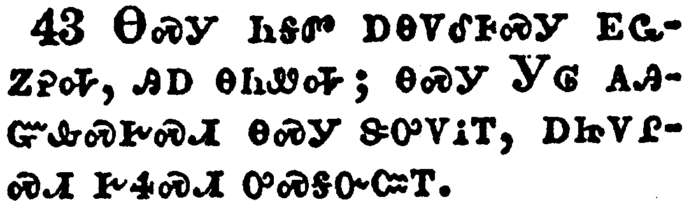</a></td>
</tr>
<tr class="even">
<td>To him give all the prophets witness, that through his name whosoever believeth in him shall receive remission of sins.</td>
</tr>
<tr class="odd">
<td>ᎾᏍᎩ ᏂᎦᏛ ᎠᎾᏙᎴᎰᏍᎩ ᎬᏩᏃᎮᎭ, ᎯᎠ ᎾᏂᏪᎭ; ᎾᏍᎩ ᎩᎶ ᎪᎯᏳᎲᏍᎨᏍᏗ ᎾᏍᎩ ᏕᎤᏙᎥᎢ, ᎠᏥᏙᎵᏍᏗ ᎨᏎᏍᏗ ᎤᏍᎦᏅᏨᎢ.</td>
</tr>
<tr class="even">
<td>Na-s-gi ni-ga-dv a-na-do-le-ho-s-gi gv-wa-no-he-ha, hi-a na-ni-we-ha; na-s-gi Gi-lo go-hi-yu-hv-s-ge-s-di na-s-gi de-u-do-v-i, a-tsi-do-li-s-di ge-se-s-di u-s-ga-nv-tsv-i.</td>
</tr>
</tbody>
</table>

<table>
<tbody>
<tr class="odd">
<td><a href="051044.png">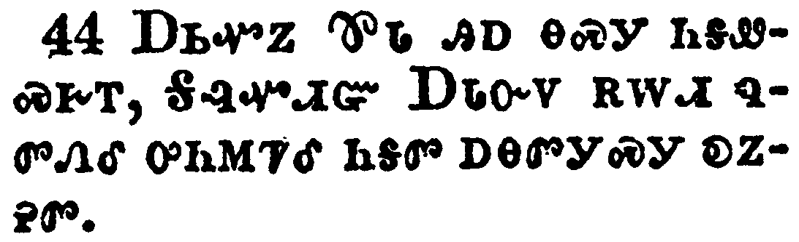</a></td>
</tr>
<tr class="even">
<td>While Peter yet spake these words, the Holy Ghost fell on all them which heard the word.</td>
</tr>
<tr class="odd">
<td>ᎠᏏᏉᏃ ᏈᏓ ᎯᎠ ᎾᏍᎩ ᏂᎦᏪᏍᎨᎢ, ᎦᎸᏉᏗᏳ ᎠᏓᏅᏙ ᎡᎳᏗ ᏄᏛᏁᎴ ᎤᏂᎷᏤᎴ ᏂᎦᏛ ᎠᎾᏛᎩᏍᎩ ᎧᏃᎮᏛ.</td>
</tr>
<tr class="even">
<td>A-si-quo-no Qui-da hi-a na-s-gi ni-ga-we-s-ge-i, Ga-lv-quo-di-yu A-da-nv-do e-la-di nu-dv-ne-le u-ni-lu-tse-le ni-ga-dv a-na-dv-gi-s-gi ka-no-he-dv.</td>
</tr>
</tbody>
</table>

<table>
<tbody>
<tr class="odd">
<td><a href="051045.png">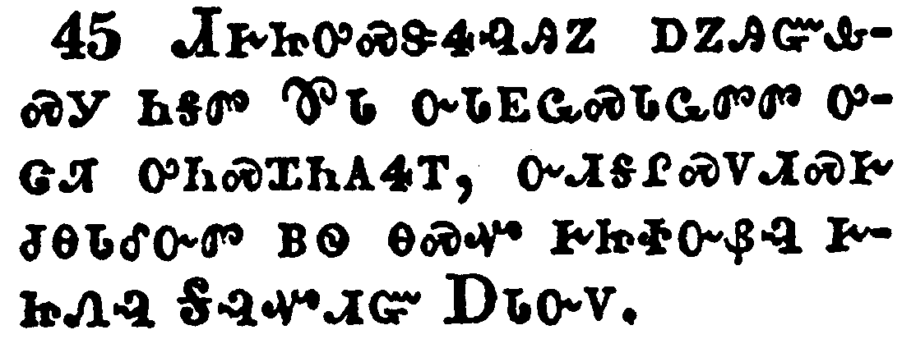</a></td>
</tr>
<tr class="even">
<td>And they of the circumcision which believed were astonished, as many as came with Peter, because that on the Gentiles also was poured out the gift of the Holy Ghost.</td>
</tr>
<tr class="odd">
<td>ᏗᎨᏥᎤᏍᏕᏎᎸᎯᏃ ᎠᏃᎯᏳᎲᏍᎩ ᏂᎦᏛ ᏈᏓ ᏅᏓᎬᏩᏍᏓᏩᏛᏛ ᎤᏣᏘ ᎤᏂᏍᏆᏂᎪᏎᎢ, ᏅᏗᎦᎵᏍᏙᏗᏍᎨ ᏧᎾᏓᎴᏅᏛ ᏴᏫ ᎾᏍᏉ ᎨᏥᏐᏅᏰᎸ ᎨᏥᏁᎸ ᎦᎸᏉᏗᏳ ᎠᏓᏅᏙ.</td>
</tr>
<tr class="even">
<td>Di-ge-tsi-u-s-de-se-lv-hi-no a-no-hi-yu-hv-s-gi ni-ga-dv Qui-da nv-da-gv-wa-s-da-wa-dv-dv u-tsa-ti u-ni-s-qua-ni-go-se-i, nv-di-ga-li-s-do-di-s-ge tsu-na-da-le-nv-dv yv-wi na-s-quo ge-tsi-so-nv-ye-lv ge-tsi-ne-lv Ga-lv-quo-di-yu A-da-nv-do.</td>
</tr>
</tbody>
</table>

<table>
<tbody>
<tr class="odd">
<td><a href="051046.png">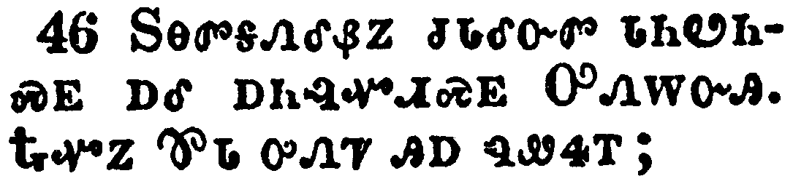</a></td>
</tr>
<tr class="even">
<td>For they heard them speak with tongues, and magnify God. Then answered Peter,</td>
</tr>
<tr class="odd">
<td>ᏚᎾᏛᎦᏁᎴᏰᏃ ᏧᏓᎴᏅᏛ ᏓᏂᏬᏂᏍᎬ ᎠᎴ ᎠᏂᎸᏉᏗᏍᎬ ᎤᏁᎳᏅᎯ. ᎿᎭᏉᏃ ᏈᏓ ᎤᏁᏤ ᎯᎠ ᏄᏪᏎᎢ;</td>
</tr>
<tr class="even">
<td>Du-na-dv-ga-ne-le-ye-no tsu-da-le-nv-dv da-ni-wo-ni-s-gv a-le a-ni-lv-quo-di-s-gv U-ne-la-nv-hi. Hna-quo-no Qui-da u-ne-tse hi-a nu-we-se-i;</td>
</tr>
</tbody>
</table>

<table>
<tbody>
<tr class="odd">
<td><a href="051047.png">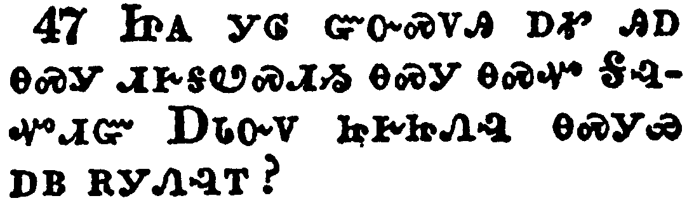</a></td>
</tr>
<tr class="even">
<td>Can any man forbid water, that these should not be baptized, which have received the Holy Ghost as well as we?</td>
</tr>
<tr class="odd">
<td>ᏥᎪ ᎩᎶ ᏳᏅᏍᏙᎯ ᎠᎹ ᎯᎠ ᎾᏍᎩ ᏗᎨᎦᏬᏍᏗᏱ ᎾᏍᎩ ᎾᏍᏉ ᎦᎸᏉᏗᏳ ᎠᏓᏅᏙ ᏥᎨᏥᏁᎸ ᎾᏍᎩᏯ ᎠᏴ ᎡᎩᏁᎸᎢ?</td>
</tr>
<tr class="even">
<td>Tsi-go gi-lo yu-nv-s-do-hi a-ma hi-a na-s-gi di-ge-ga-wo-s-di-yi na-s-gi na-s-quo Ga-lv-quo-di-yu A-da-nv-do tsi-ge-tsi-ne-lv na-s-gi-ya a-yv e-gi-ne-lv-i?</td>
</tr>
</tbody>
</table>

<table>
<tbody>
<tr class="odd">
<td><a href="051048.png">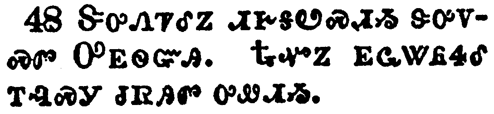</a></td>
</tr>
<tr class="even">
<td>And he commanded them to be baptized in the name of the Lord. Then prayed they him to tarry certain days.</td>
</tr>
<tr class="odd">
<td>ᏕᎤᏁᏤᎴᏃ ᏗᎨᎦᏬᏍᏗᏱ ᏕᎤᏙᏍᏛ ᎤᎬᏫᏳᎯ. ᎿᎭᏉᏃ ᎬᏩᏔᏲᏎᎴ ᎢᎸᏍᎩ ᏧᏒᎯᏛ ᎤᏪᏗᏱ.</td>
</tr>
<tr class="even">
<td>De-u-ne-tse-le-no di-ge-ga-wo-s-di-yi de-u-do-s-dv U-gv-wi-yu-hi. Hna-quo-no gv-wa-ta-yo-se-le i-lv-s-gi tsu-sv-hi-dv u-we-di-yi.</td>
</tr>
</tbody>
</table>

