+++
draft=false
date = 2014-12-18T21:11:07Z
title = "The Acts - Chapter 11 - Cherokee New Testament"
weight = 1418955067

[taxonomies]

authors = ["Timothy Legg"]
categories = []
tags = []

[extra]
+++

<table>
<tbody>
<tr class="odd">
<td><a href="051101.png">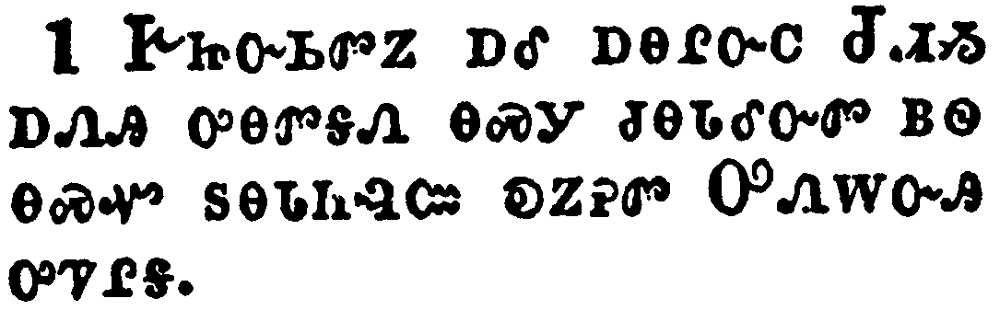</a></td>
</tr>
<tr class="even">
<td>And the apostles and brethren that were in Judaea heard that the Gentiles had also received the word of God.</td>
</tr>
<tr class="odd">
<td>ᎨᏥᏅᏏᏛᏃ ᎠᎴ ᎠᎾᎵᏅᏟ ᏧᏗᏱ ᎠᏁᎯ ᎤᎾᏛᎦᏁ ᎾᏍᎩ ᏧᎾᏓᎴᏅᏛ ᏴᏫ ᎾᏍᏉ ᏚᎾᏓᏂᎸᏨ ᎧᏃᎮᏛ ᎤᏁᎳᏅᎯ ᎤᏤᎵᎦ.</td>
</tr>
<tr class="even">
<td>Ge-tsi-nv-si-dv-no a-le a-na-li-nv-tli Tsu-di-yi a-ne-hi u-na-dv-ga-ne na-s-gi tsu-na-da-le-nv-dv yv-wi na-s-quo du-na-da-ni-lv-tsv ka-no-he-dv U-ne-la-nv-hi u-tse-li-ga.</td>
</tr>
</tbody>
</table>

<table>
<tbody>
<tr class="odd">
<td><a href="051102.png">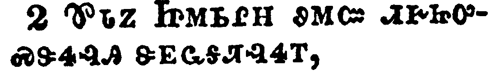</a></td>
</tr>
<tr class="even">
<td>And when Peter was come up to Jerusalem, they that were of the circumcision contended with him,</td>
</tr>
<tr class="odd">
<td>ᏈᏓᏃ ᏥᎷᏏᎵᎻ ᏭᎷᏨ ᏗᎨᏥᎤᏍᏕᏎᎸᎯ ᏕᎬᏩᎦᏘᎸᏎᎢ,</td>
</tr>
<tr class="even">
<td>Qui-da-no Tsi-lu-si-li-mi wu-lu-tsv di-ge-tsi-u-s-de-se-lv-hi de-gv-wa-ga-ti-lv-se-i,</td>
</tr>
</tbody>
</table>

<table>
<tbody>
<tr class="odd">
<td><a href="051103.png">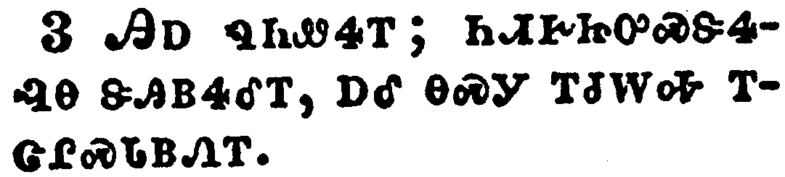</a></td>
</tr>
<tr class="even">
<td>Saying, Thou wentest in to men uncircumcised, and didst eat with them.</td>
</tr>
<tr class="odd">
<td>ᎯᎠ ᏄᏂᏪᎡᎢ; ᏂᏗᎨᏥᎤᏍᏕᏎᎸᎾ ᏕᎯᏴᏎᎴᎢ, ᎠᎴ ᎾᏍᎩ ᎢᏧᎳᎭ ᎢᏣᎵᏍᏓᏴᏁᎢ.</td>
</tr>
<tr class="even">
<td>Hi-a nu-ni-we-e-i; ni-di-ge-tsi-u-s-de-se-lv-na de-hi-yv-se-le-i, a-le na-s-gi i-tsu-la-ha i-tsa-li-s-da-yv-ne-i.</td>
</tr>
</tbody>
</table>

<table>
<tbody>
<tr class="odd">
<td><a href="051104.png">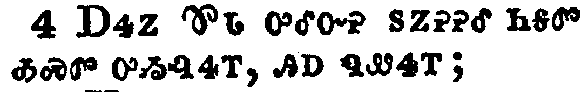</a></td>
</tr>
<tr class="even">
<td>But Peter rehearsed the matter from the beginning, and expounded it by order unto them, saying,</td>
</tr>
<tr class="odd">
<td>ᎠᏎᏃ ᏈᏓ ᎤᎴᏅᎮ ᏚᏃᎮᎮᎴ ᏂᎦᏛ ᎣᏍᏛ ᎤᏱᎸᏎᎢ, ᎯᎠ ᏄᏪᏎᎢ;</td>
</tr>
<tr class="even">
<td>A-se-no Qui-da u-le-nv-he du-no-he-he-le ni-ga-dv o-s-dv u-yi-lv-se-i, hi-a nu-we-se-i;</td>
</tr>
</tbody>
</table>

<table>
<tbody>
<tr class="odd">
<td><a href="051105.png">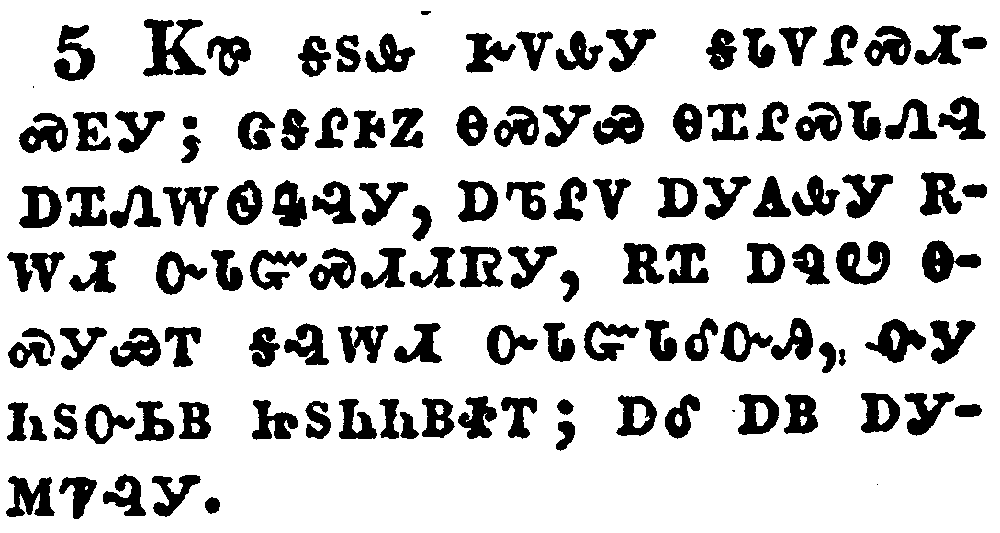</a></td>
</tr>
<tr class="even">
<td>I was in the city of Joppa praying: and in a trance I saw a vision, A certain vessel descend, as it had been a great sheet, let down from heaven by four corners; and it came even to me:</td>
</tr>
<tr class="odd">
<td>ᏦᏈ ᎦᏚᎲ ᎨᏙᎲᎩ ᎦᏓᏙᎵᏍᏗᏍᎬᎩ; ᏣᎦᎵᎰᏃ ᎾᏍᎩᏯ ᎾᏆᎵᏍᏓᏁᎸ ᎠᏆᏁᎳᏫᏎᎸᎩ, ᎠᏖᎵᏙ ᎠᎩᎪᎲᎩ ᎡᎳᏗ ᏅᏓᏳᏍᏗᏗᏒᎩ, ᎡᏆ ᎠᏄᏬ ᎾᏍᎩᏯᎢ ᎦᎸᎳᏗ ᏅᏓᏳᏓᎴᏅᎯ, ᏅᎩ ᏂᏚᏅᏏᏴ ᏥᏚᏂᏂᏴᏐᎢ; ᎠᎴ ᎠᏴ ᎠᎩᎷᏤᎸᎩ.</td>
</tr>
<tr class="even">
<td>Tso-qui ga-du-hv ge-do-hv-gi ga-da-do-li-s-di-s-gv-gi; tsa-ga-li-ho-no na-s-gi-ya na-qua-li-s-da-ne-lv a-qua-ne-la-wi-se-lv-gi, a-te-li-do a-gi-go-hv-gi e-la-di nv-da-yu-s-di-di-sv-gi, e-qua a-nu-wo na-s-gi-ya-i ga-lv-la-di nv-da-yu-da-le-nv-hi, nv-gi ni-du-nv-si-yv tsi-du-ni-ni-yv-so-i; a-le a-yv a-gi-lu-tse-lv-gi.</td>
</tr>
</tbody>
</table>

<table>
<tbody>
<tr class="odd">
<td><a href="051106.png">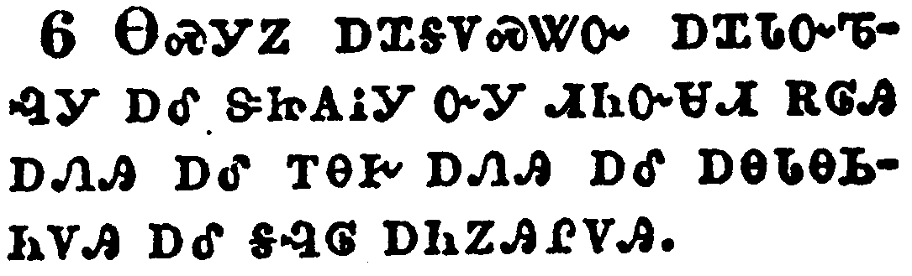</a></td>
</tr>
<tr class="even">
<td>Upon the which when I had fastened mine eyes, I considered, and saw fourfooted beasts of the earth, and wild beasts, and creeping things, and fowls of the air.</td>
</tr>
<tr class="odd">
<td>ᎾᏍᎩᏃ ᎠᏆᎦᏙᏍᏔᏅ ᎠᏆᏓᏅᏖᎸᎩ ᎠᎴ ᏕᏥᎪᎥᎩ ᏅᎩ ᏗᏂᏅᏌᏗ ᎡᎶᎯ ᎠᏁᎯ ᎠᎴ ᎢᎾᎨ ᎠᏁᎯ ᎠᎴ ᎠᎾᏓᎾᏏᏂᏙᎯ ᎠᎴ ᎦᎸᎶ ᎠᏂᏃᎯᎵᏙᎯ.</td>
</tr>
<tr class="even">
<td>Na-s-gi-no a-qua-ga-do-s-ta-nv a-qua-da-nv-te-lv-gi a-le de-tsi-go-v-gi nv-gi di-ni-nv-sa-di e-lo-hi a-ne-hi a-le i-na-ge a-ne-hi a-le a-na-da-na-si-ni-do-hi a-le ga-lv-lo a-ni-no-hi-li-do-hi.</td>
</tr>
</tbody>
</table>

<table>
<tbody>
<tr class="odd">
<td><a href="051107.png">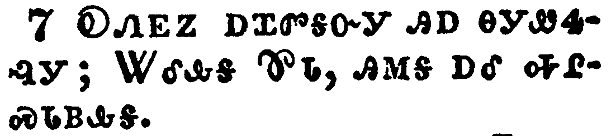</a></td>
</tr>
<tr class="even">
<td>And I heard a voice saying unto me, Arise, Peter; slay and eat.</td>
</tr>
<tr class="odd">
<td>ᎧᏁᎬᏃ ᎠᏆᏛᎦᏅᎩ ᎯᎠ ᎾᎩᏪᏎᎸᎩ; ᏔᎴᎲᎦ ᏈᏓ, ᎯᎷᎦ ᎠᎴ ᎭᎵᏍᏓᏴᎲᎦ.</td>
</tr>
<tr class="even">
<td>Ka-ne-gv-no a-qua-dv-ga-nv-gi hi-a na-gi-we-se-lv-gi; Ta-le-hv-ga Qui-da, hi-lu-ga a-le ha-li-s-da-yv-hv-ga.</td>
</tr>
</tbody>
</table>

<table>
<tbody>
<tr class="odd">
<td><a href="051108.png">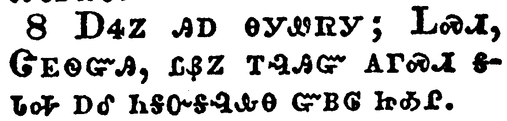</a></td>
</tr>
<tr class="even">
<td>But I said, Not so, Lord: for nothing common or unclean hath at any time entered into my mouth.</td>
</tr>
<tr class="odd">
<td>ᎠᏎᏃ ᎯᎠ ᎾᎩᏪᏒᎩ; ᏞᏍᏗ, ᏣᎬᏫᏳᎯ, ᏝᏰᏃ ᎢᎸᎯᏳ ᎪᎱᏍᏗ ᎦᏓᎭ ᎠᎴ ᏂᎦᏅᎦᎸᎲᎾ ᏳᏴᎶ ᏥᎣᎵ.</td>
</tr>
<tr class="even">
<td>A-se-no hi-a na-gi-we-sv-gi; Tle-s-di, Tsa-gv-wi-yu-hi, tla-ye-no i-lv-hi-yu go-hu-s-di ga-da-ha a-le ni-ga-nv-ga-lv-hv-na yu-yv-lo tsi-o-li.</td>
</tr>
</tbody>
</table>

<table>
<tbody>
<tr class="odd">
<td><a href="051109.png">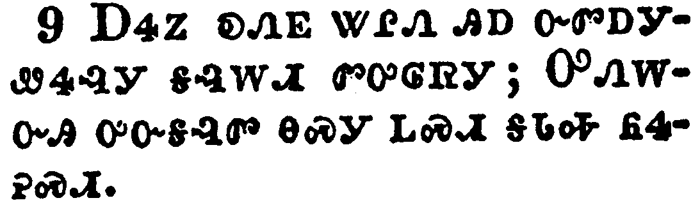</a></td>
</tr>
<tr class="even">
<td>But the voice answered me again from heaven, What God hath cleansed, that call not thou common.</td>
</tr>
<tr class="odd">
<td>ᎠᏎᏃ ᎧᏁᎬ ᏔᎵᏁ ᎯᎠ ᏅᏛᎠᎩᏪᏎᎸᎩ ᎦᎸᎳᏗ ᏛᎤᎶᏒᎩ; ᎤᏁᎳᏅᎯ ᎤᏅᎦᎸᏛ ᎾᏍᎩ ᏞᏍᏗ ᎦᏓᎭ ᏲᏎᎮᏍᏗ.</td>
</tr>
<tr class="even">
<td>A-se-no ka-ne-gv ta-li-ne hi-a nv-dv-a-gi-we-se-lv-gi ga-lv-la-di dv-u-lo-sv-gi; U-ne-la-nv-hi u-nv-ga-lv-dv na-s-gi tle-s-di ga-da-ha yo-se-he-s-di.</td>
</tr>
</tbody>
</table>

<table>
<tbody>
<tr class="odd">
<td><a href="051110.png">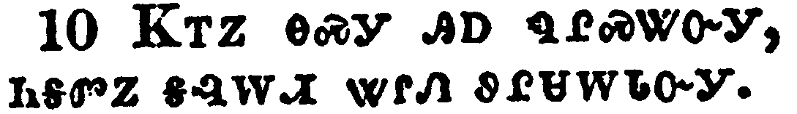</a></td>
</tr>
<tr class="even">
<td>And this was done three times: and all were drawn up again into heaven.</td>
</tr>
<tr class="odd">
<td>ᏦᎢᏃ ᎾᏍᎩ ᎯᎠ ᏄᎵᏍᏔᏅᎩ, ᏂᎦᏛᏃ ᎦᎸᎳᏗ ᏔᎵᏁ ᏭᎵᏌᎳᏓᏅᎩ.</td>
</tr>
<tr class="even">
<td>Tso-i-no na-s-gi hi-a nu-li-s-ta-nv-gi, ni-ga-dv-no ga-lv-la-di ta-li-ne wu-li-sa-la-da-nv-gi.</td>
</tr>
</tbody>
</table>

<table>
<tbody>
<tr class="odd">
<td><a href="051111.png">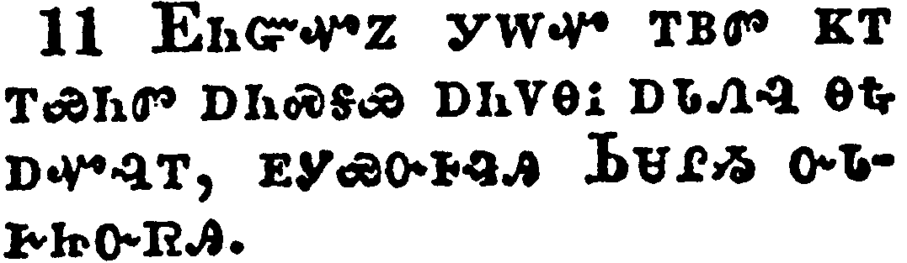</a></td>
</tr>
<tr class="even">
<td>And, behold, immediately there were three men already come unto the house where I was, sent from Caesarea unto me.</td>
</tr>
<tr class="odd">
<td>ᎬᏂᏳᏉᏃ ᎩᎳᏉ ᎢᏴᏛ ᏦᎢ ᎢᏯᏂᏛ ᎠᏂᏍᎦᏯ ᎠᏂᏙᎾᎥ ᎠᏓᏁᎸ ᎾᎿᎭᎠᏉᎸᎢ, ᎬᎩᏯᏅᎰᎸᎯ ᏏᏌᎵᏱ ᏅᏓᎨᏥᏅᏒᎯ.</td>
</tr>
<tr class="even">
<td>Gv-ni-yu-quo-no gi-la-quo i-yv-dv tso-i i-ya-ni-dv a-ni-s-ga-ya a-ni-do-na-v a-da-ne-lv na-hna a-quo-lv-i, gv-gi-ya-nv-ho-lv-hi Si-sa-li-yi nv-da-ge-tsi-nv-sv-hi.</td>
</tr>
</tbody>
</table>

<table>
<tbody>
<tr class="odd">
<td><a href="051112.png">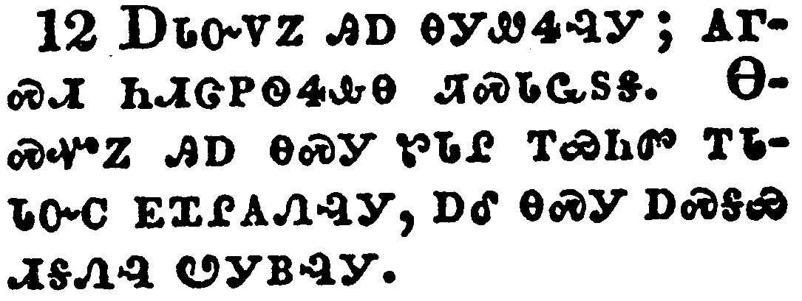</a></td>
</tr>
<tr class="even">
<td>And the spirit bade me go with them, nothing doubting. Moreover these six brethren accompanied me, and we entered into the man's house:</td>
</tr>
<tr class="odd">
<td>ᎠᏓᏅᏙᏃ ᎯᎠ ᎾᎩᏪᏎᎸᎩ; ᎪᎱᏍᏗ ᏂᏗᏣᏢᏫᏎᎲᎾ ᏘᏍᏓᏩᏚᎦ. ᎾᏍᏉᏃ ᎯᎠ ᎾᏍᎩ ᏑᏓᎵ ᎢᏯᏂᏛ ᎢᏓᏓᏅᏟ ᎬᏆᎵᎪᏁᎸᎩ, ᎠᎴ ᎾᏍᎩ ᎠᏍᎦᏯ ᏗᎦᏁᎸ ᏬᎩᏴᎸᎩ.</td>
</tr>
<tr class="even">
<td>A-da-nv-do-no hi-a na-gi-we-se-lv-gi; go-hu-s-di ni-di-tsa-tlv-wi-se-hv-na ti-s-da-wa-du-ga. Na-s-quo-no hi-a na-s-gi su-da-li i-ya-ni-dv i-da-da-nv-tli gv-qua-li-go-ne-lv-gi, a-le na-s-gi a-s-ga-ya di-ga-ne-lv wo-gi-yv-lv-gi.</td>
</tr>
</tbody>
</table>

<table>
<tbody>
<tr class="odd">
<td><a href="051113.png">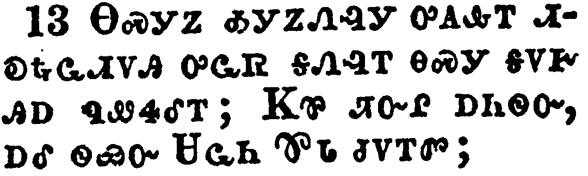</a></td>
</tr>
<tr class="even">
<td>And he shewed us how he had seen an angel in his house, which stood and said unto him, Send men to Joppa, and call for Simon, whose surname is Peter;</td>
</tr>
<tr class="odd">
<td>ᎾᏍᎩᏃ ᎣᎩᏃᏁᎸᎩ ᎤᎪᎲᎢ ᏗᎧᎿᎭᏩᏗᏙᎯ ᎤᏩᏒ ᎦᏁᎸᎢ ᎾᏍᎩ ᎦᏙᎨ ᎯᎠ ᏄᏪᏎᎴᎢ; ᏦᏈ ᏘᏅᎵ ᎠᏂᏫᏅ, ᎠᎴ ᏫᏯᏅ ᏌᏩᏂ ᏈᏓ ᏧᏙᎢᏛ;</td>
</tr>
<tr class="even">
<td>Na-s-gi-no o-gi-no-ne-lv-gi u-go-hv-i di-ka-hna-wa-di-do-hi u-wa-sv ga-ne-lv-i na-s-gi ga-do-ge hi-a nu-we-se-le-i; Tso-qui ti-nv-li a-ni-wi-nv, a-le wi-ya-nv Sa-wa-ni Qui-da tsu-do-i-dv;</td>
</tr>
</tbody>
</table>

<table>
<tbody>
<tr class="odd">
<td><a href="051114.png">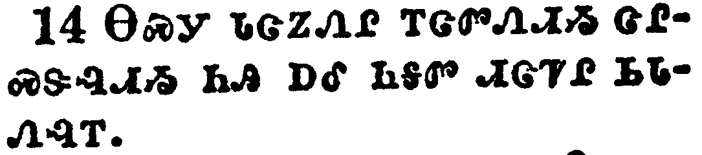</a></td>
</tr>
<tr class="even">
<td>Who shall tell thee words, whereby thou and all thy house shall be saved.</td>
</tr>
<tr class="odd">
<td>ᎾᏍᎩ ᏓᏣᏃᏁᎵ ᎢᏣᏛᏁᏗᏱ ᏣᎵᏍᏕᎸᏗᏱ ᏂᎯ ᎠᎴ ᏂᎦᏛ ᏗᏣᏤᎵ ᏏᏓᏁᎸᎢ.</td>
</tr>
<tr class="even">
<td>Na-s-gi da-tsa-no-ne-li i-tsa-dv-ne-di-yi tsa-li-s-de-lv-di-yi ni-hi a-le ni-ga-dv di-tsa-tse-li si-da-ne-lv-i.</td>
</tr>
</tbody>
</table>

<table>
<tbody>
<tr class="odd">
<td><a href="051115.png">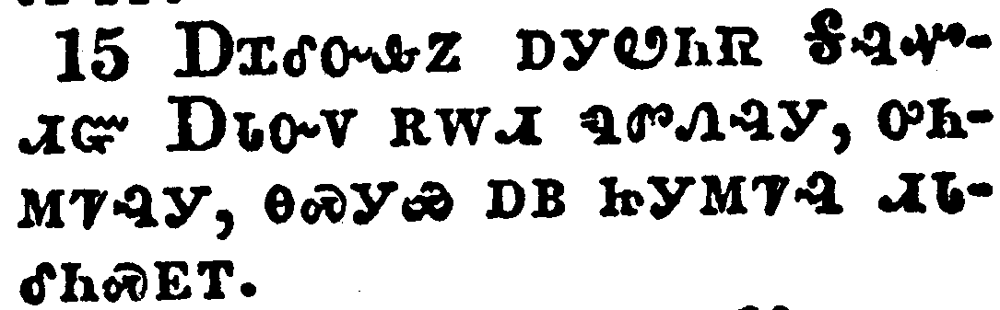</a></td>
</tr>
<tr class="even">
<td>And as I began to speak, the Holy Ghost fell on them, as on us at the beginning.</td>
</tr>
<tr class="odd">
<td>ᎠᏆᎴᏅᎲᏃ ᎠᎩᏬᏂᏒ ᎦᎸᏉᏗᏳ ᎠᏓᏅᏙ ᎡᎳᏗ ᏄᏛᏁᎸᎩ, ᎤᏂᎷᏤᎩ, ᎾᏍᎩᏯ ᎠᏴ ᏥᎩᎷᏤᎸ ᏗᏓᎴᏂᏍᎬᎢ.</td>
</tr>
<tr class="even">
<td>A-qua-le-nv-hv-no a-gi-wo-ni-sv Ga-lv-quo-di-yu A-da-nv-do e-la-di nu-dv-ne-lv-gi, u-ni-lu-tse-gi, na-s-gi-ya a-yv tsi-gi-lu-tse-lv di-da-le-ni-s-gv-i.</td>
</tr>
</tbody>
</table>

<table>
<tbody>
<tr class="odd">
<td><a href="051116.png">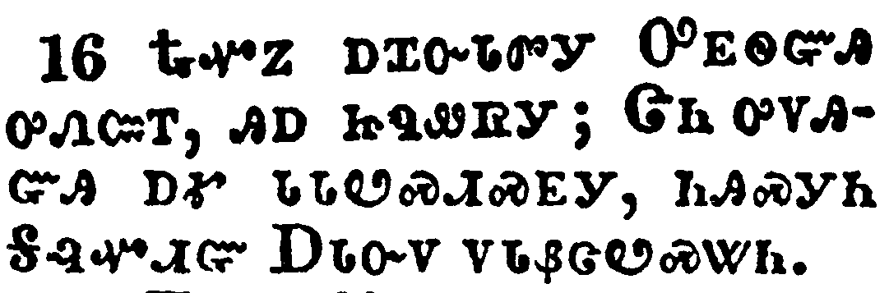</a></td>
</tr>
<tr class="even">
<td>Then remembered I the word of the Lord, how that he said, John indeed baptized with water; but ye shall be baptized with the Holy Ghost.</td>
</tr>
<tr class="odd">
<td>ᎿᎭᏉᏃ ᎠᏆᏅᏓᏛᎩ ᎤᎬᏫᏳᎯ ᎤᏁᏨᎢ, ᎯᎠ ᏥᏄᏪᏒᎩ; ᏣᏂ ᎤᏙᎯᏳᎯ ᎠᎹ ᏓᏓᏬᏍᏗᏍᎬᎩ, ᏂᎯᏍᎩᏂ ᎦᎸᏉᏗᏳ ᎠᏓᏅᏙ ᏙᏓᏰᏣᏬᏍᏔᏂ.</td>
</tr>
<tr class="even">
<td>Hna-quo-no a-qua-nv-da-dv-gi U-gv-wi-yu-hi u-ne-tsv-i, hi-a tsi-nu-we-sv-gi; Tsa-ni u-do-hi-yu-hi a-ma da-da-wo-s-di-s-gv-gi, ni-hi-s-gi-ni Ga-lv-quo-di-yu A-da-nv-do do-da-ye-tsa-wo-s-ta-ni.</td>
</tr>
</tbody>
</table>

<table>
<tbody>
<tr class="odd">
<td><a href="051117.png">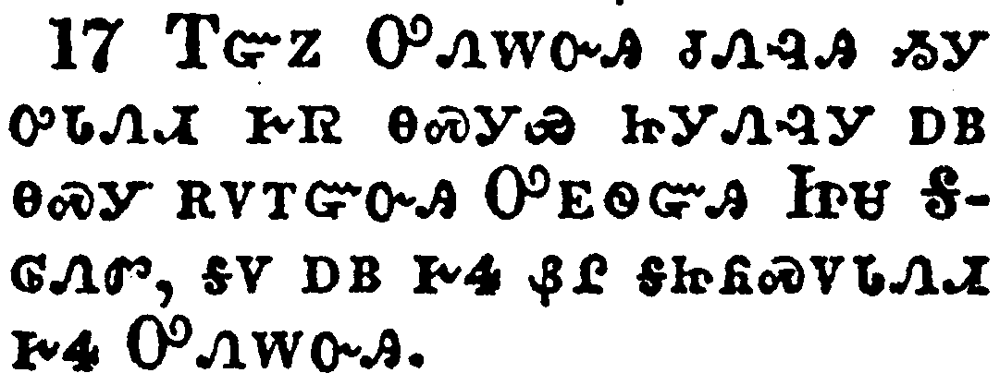</a></td>
</tr>
<tr class="even">
<td>Forasmuch then as God gave them the like gift as he did unto us, who believed on the Lord Jesus Christ; what was I, that I could withstand God?</td>
</tr>
<tr class="odd">
<td>ᎢᏳᏃ ᎤᏁᎳᏅᎯ ᏧᏁᎸᎯ ᏱᎩ ᎤᏓᏁᏗ ᎨᏒ ᎾᏍᎩᏯ ᏥᎩᏁᎸᎩ ᎠᏴ ᎾᏍᎩ ᎡᏙᎢᏳᏅᎯ ᎤᎬᏫᏳᎯ ᏥᏌ ᎦᎶᏁᏛ, ᎦᏙ ᎠᏴ ᎨᏎ ᏰᎵ ᎦᏥᏲᏍᏙᏓᏁᏗ ᎨᏎ ᎤᏁᎳᏅᎯ.</td>
</tr>
<tr class="even">
<td>I-yu-no U-ne-la-nv-hi tsu-ne-lv-hi yi-gi u-da-ne-di ge-sv na-s-gi-ya tsi-gi-ne-lv-gi a-yv na-s-gi e-do-i-yu-nv-hi U-gv-wi-yu-hi Tsi-sa Ga-lo-ne-dv, ga-do a-yv ge-se ye-li ga-tsi-yo-s-do-da-ne-di ge-se U-ne-la-nv-hi.</td>
</tr>
</tbody>
</table>

<table>
<tbody>
<tr class="odd">
<td><a href="051118.png">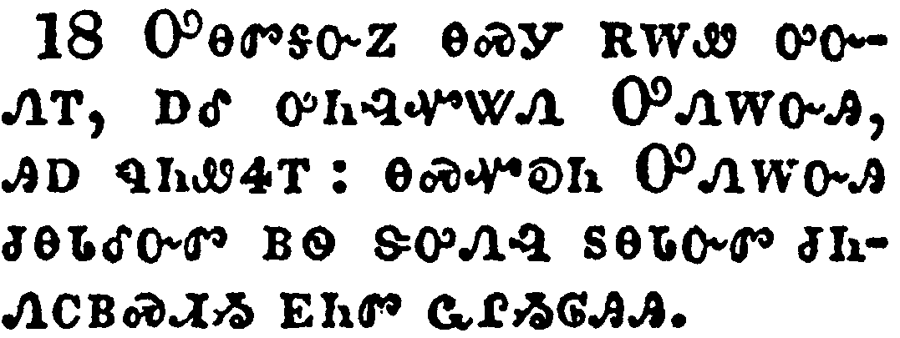</a></td>
</tr>
<tr class="even">
<td>When they heard these things, they held their peace, and glorified God, saying, Then hath God also to the Gentiles granted repentance unto life.</td>
</tr>
<tr class="odd">
<td>ᎤᎾᏛᎦᏅᏃ ᎾᏍᎩ ᎡᎳᏪ ᎤᏅᏁᎢ, ᎠᎴ ᎤᏂᎸᏉᏔᏁ ᎤᏁᎳᏅᎯ, ᎯᎠ ᏄᏂᏪᏎᎢ: ᎾᏍᏉᎧᏂ ᎤᏁᎳᏅᎯ ᏧᎾᏓᎴᏅᏛ ᏴᏫ ᏕᎤᏁᎸ ᏚᎾᏓᏅᏛ ᏧᏂᏁᏟᏴᏍᏗᏱ ᎬᏂᏛ ᏩᎵᏱᎶᎯᎯ.</td>
</tr>
<tr class="even">
<td>U-na-dv-ga-nv-no na-s-gi e-la-we u-nv-ne-i, a-le u-ni-lv-quo-ta-ne U-ne-la-nv-hi, hi-a nu-ni-we-se-i: na-s-quo-ka-ni U-ne-la-nv-hi tsu-na-da-le-nv-dv yv-wi de-u-ne-lv du-na-da-nv-dv tsu-ni-ne-tli-yv-s-di-yi gv-ni-dv wa-li-yi-lo-hi-hi.</td>
</tr>
</tbody>
</table>

<table>
<tbody>
<tr class="odd">
<td><a href="051119.png">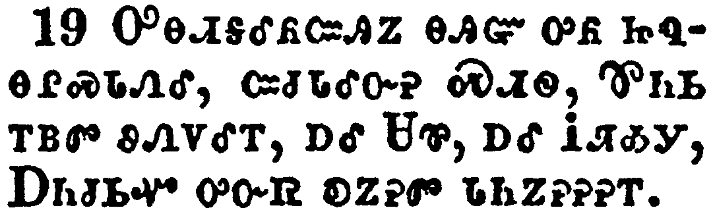</a></td>
</tr>
<tr class="even">
<td>Now they which were scattered abroad upon the persecution that arose about Stephen travelled as far as Phenice, and Cyprus, and Antioch, preaching the word to none but unto the Jews only.</td>
</tr>
<tr class="odd">
<td>ᎤᎾᏗᎦᎴᏲᏨᎯᏃ ᎾᎯᏳ ᎤᏲ ᏥᏄᎾᎵᏍᏓᏁᎴ, ᏨᏧᏓᎴᏅᎮ ᏍᏗᏫ, ᏈᏂᏏ ᎢᏴᏛ ᏭᏁᏙᎴᎢ, ᎠᎴ ᏌᏈ, ᎠᎴ ᎥᏘᎣᎩ, ᎠᏂᏧᏏᏉ ᎤᏅᏒ ᎧᏃᎮᏛ ᏓᏂᏃᎮᎮᎮᎢ.</td>
</tr>
<tr class="even">
<td>U-na-di-ga-le-yo-tsv-hi-no na-hi-yu u-yo tsi-nu-na-li-s-da-ne-le, tsv-tsu-da-le-nv-he S-di-wi, Qui-ni-si i-yv-dv wu-ne-do-le-i, a-le Sa-qui, a-le V-ti-o-gi, A-ni-tsu-si-quo u-nv-sv ka-no-he-dv da-ni-no-he-he-he-i.</td>
</tr>
</tbody>
</table>

<table>
<tbody>
<tr class="odd">
<td><a href="051120.png">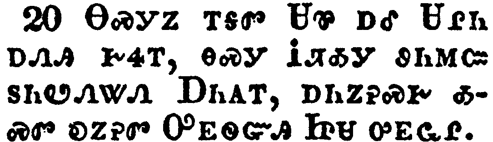</a></td>
</tr>
<tr class="even">
<td>And some of them were men of Cyprus and Cyrene, which, when they were come to Antioch, spake unto the Grecians, preaching the Lord Jesus.</td>
</tr>
<tr class="odd">
<td>ᎾᏍᎩᏃ ᎢᎦᏛ ᏌᏈ ᎠᎴ ᏌᎵᏂ ᎠᏁᎯ ᎨᏎᎢ, ᎾᏍᎩ ᎥᏘᎣᎩ ᏭᏂᎷᏨ ᏚᏂᏬᏁᏔᏁ ᎠᏂᎪᎢ, ᎠᏂᏃᎮᏍᎨ ᎣᏍᏛ ᎧᏃᎮᏛ ᎤᎬᏫᏳᎯ ᏥᏌ ᎤᎬᏩᎵ.</td>
</tr>
<tr class="even">
<td>Na-s-gi-no i-ga-dv Sa-qui a-le Sa-li-ni a-ne-hi ge-se-i, na-s-gi V-ti-o-gi wu-ni-lu-tsv du-ni-wo-ne-ta-ne A-ni-go-i, a-ni-no-he-s-ge o-s-dv ka-no-he-dv U-gv-wi-yu-hi Tsi-sa u-gv-wa-li.</td>
</tr>
</tbody>
</table>

<table>
<tbody>
<tr class="odd">
<td><a href="051121.png">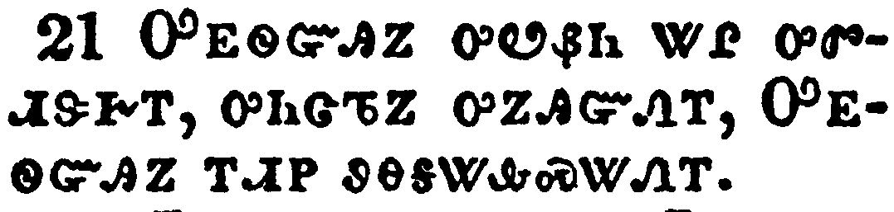</a></td>
</tr>
<tr class="even">
<td>And the hand of the Lord was with them: and a great number believed, and turned unto the Lord.</td>
</tr>
<tr class="odd">
<td>ᎤᎬᏫᏳᎯᏃ ᎤᏬᏰᏂ ᏔᎵ ᎤᏛᏗᏕᎨᎢ, ᎤᏂᏤᏖᏃ ᎤᏃᎯᏳᏁᎢ, ᎤᎬᏫᏳᎯᏃ ᎢᏗᏢ ᏭᎾᎦᏔᎲᏍᏔᏁᎢ.</td>
</tr>
<tr class="even">
<td>U-gv-wi-yu-hi-no u-wo-ye-ni ta-li u-dv-di-de-ge-i, u-ni-tse-te-no u-no-hi-yu-ne-i, U-gv-wi-yu-hi-no i-di-tlv wu-na-ga-ta-hv-s-ta-ne-i.</td>
</tr>
</tbody>
</table>

<table>
<tbody>
<tr class="odd">
<td><a href="051122.png">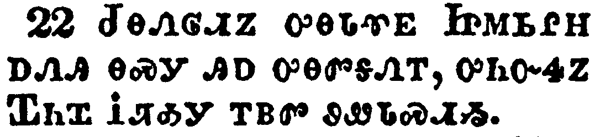</a></td>
</tr>
<tr class="even">
<td>Then tidings of these things came unto the ears of the church which was in Jerusalem: and they sent forth Barnabas, that he should go as far as Antioch.</td>
</tr>
<tr class="odd">
<td>ᏧᎾᏁᎶᏗᏃ ᎤᎾᏓᏡᎬ ᏥᎷᏏᎵᎻ ᎠᏁᎯ ᎾᏍᎩ ᎯᎠ ᎤᎾᏛᎦᏁᎢ, ᎤᏂᏅᏎᏃ ᏆᏂᏆ ᎥᏖᎣᎩ ᎢᏴᏛ ᏭᏪᏓᏍᏗᏱ.</td>
</tr>
<tr class="even">
<td>Tsu-na-ne-lo-di-no u-na-da-tlu-gv Tsi-lu-si-li-mi a-ne-hi na-s-gi hi-a u-na-dv-ga-ne-i, u-ni-nv-se-no Qua-ni-qua V-te-o-gi i-yv-dv wu-we-da-s-di-yi.</td>
</tr>
</tbody>
</table>

<table>
<tbody>
<tr class="odd">
<td><a href="051123.png">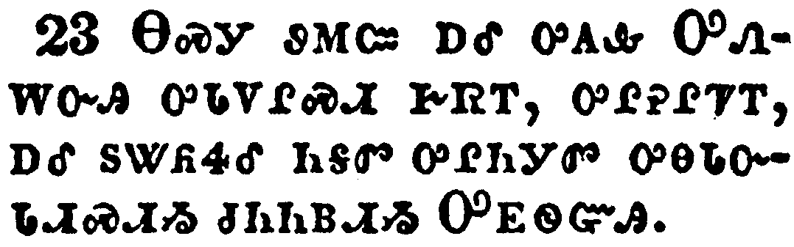</a></td>
</tr>
<tr class="even">
<td>Who, when he came, and had seen the grace of God, was glad, and exhorted them all, that with purpose of heart they would cleave unto the Lord.</td>
</tr>
<tr class="odd">
<td>ᎾᏍᎩ ᏭᎷᏨ ᎠᎴ ᎤᎪᎲ ᎤᏁᎳᏅᎯ ᎤᏓᏙᎵᏍᏗ ᎨᏒᎢ, ᎤᎵᎮᎵᏤᎢ, ᎠᎴ ᏚᏔᏲᏎᎴ ᏂᎦᏛ ᎤᎵᏂᎩᏛ ᎤᎾᏓᏅᏓᏗᏍᏗᏱ ᏧᏂᏂᏴᏗᏱ ᎤᎬᏫᏳᎯ.</td>
</tr>
<tr class="even">
<td>Na-s-gi wu-lu-tsv a-le u-go-hv U-ne-la-nv-hi u-da-do-li-s-di ge-sv-i, u-li-he-li-tse-i, a-le du-ta-yo-se-le ni-ga-dv u-li-ni-gi-dv u-na-da-nv-da-di-s-di-yi tsu-ni-ni-yv-di-yi U-gv-wi-yu-hi.</td>
</tr>
</tbody>
</table>

<table>
<tbody>
<tr class="odd">
<td><a href="051124.png">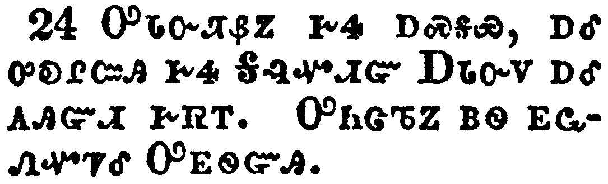</a></td>
</tr>
<tr class="even">
<td>For he was a good man, and full of the Holy Ghost and of faith: and much people was added unto the Lord.</td>
</tr>
<tr class="odd">
<td>ᎤᏓᏅᏘᏰᏃ ᎨᏎ ᎠᏍᎦᏯ, ᎠᎴ ᎤᎧᎵᏨᎯ ᎨᏎ ᎦᎸᏉᏗᏳ ᎠᏓᏅᏙ ᎠᎴ ᎪᎯᏳᏗ ᎨᏒᎢ. ᎤᏂᏣᏖᏃ ᏴᏫ ᎬᏩᏁᏉᏤᎴ ᎤᎬᏫᏳᎯ.</td>
</tr>
<tr class="even">
<td>U-da-nv-ti-ye-no ge-se a-s-ga-ya, a-le u-ka-li-tsv-hi ge-se Ga-lv-quo-di-yu A-da-nv-do a-le go-hi-yu-di ge-sv-i. U-ni-tsa-te-no yv-wi gv-wa-ne-quo-tse-le U-gv-wi-yu-hi.</td>
</tr>
</tbody>
</table>

<table>
<tbody>
<tr class="odd">
<td><a href="051125.png">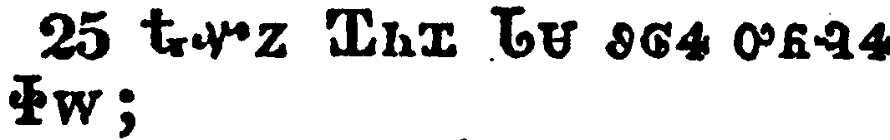</a></td>
</tr>
<tr class="even">
<td>Then departed Barnabas to Tarsus, for to seek Saul:</td>
</tr>
<tr class="odd">
<td>ᎿᎭᏉᏃ ᏆᏂᏆ ᏓᏌ ᏭᎶᏎ ᎤᏲᎸᏎ ᏐᎳ;</td>
</tr>
<tr class="even">
<td>Hna-quo-no Qua-ni-qua Da-sa wu-lo-se u-yo-lv-se So-la;</td>
</tr>
</tbody>
</table>

<table>
<tbody>
<tr class="odd">
<td><a href="051126.png">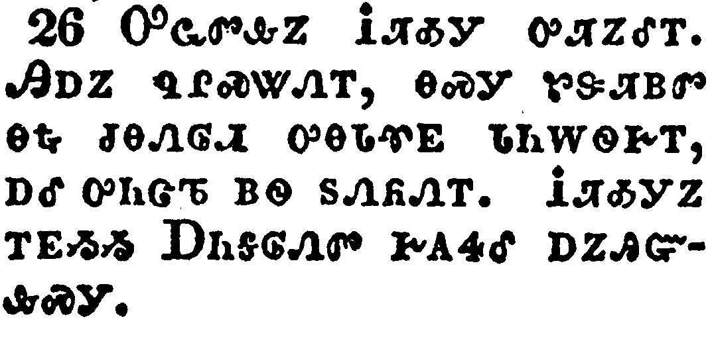</a></td>
</tr>
<tr class="even">
<td>And when he had found him, he brought him unto Antioch. And it came to pass, that a whole year they assembled themselves with the church, and taught much people. And the disciples were called Christians first in Antioch.</td>
</tr>
<tr class="odd">
<td>ᎤᏩᏛᎲᏃ ᎥᏖᎣᎩ ᎤᏘᏃᎴᎢ. ᎯᎠᏃ ᏄᎵᏍᏔᏁᎢ, ᎾᏍᎩ ᏑᏕᏘᏴᏛ ᎾᎿᎭᏧᎾᏁᎶᏗ ᎤᎾᏓᏡᎬ ᏓᏂᎳᏫᎨᎢ, ᎠᎴ ᎤᏂᏣᏖ ᏴᏫ ᏚᏁᏲᏁᎢ. ᎥᏖᎣᎩᏃ ᎢᎬᏱᏱ ᎠᏂᎦᎶᏁᏛ ᎨᎪᏎᎴ ᎠᏃᎯᏳᎲᏍᎩ.</td>
</tr>
<tr class="even">
<td>U-wa-dv-hv-no V-te-o-gi u-ti-no-le-i. Hi-a-no nu-li-s-ta-ne-i, na-s-gi su-de-ti-yv-dv na-hna tsu-na-ne-lo-di u-na-da-tlu-gv da-ni-la-wi-ge-i, a-le u-ni-tsa-te yv-wi du-ne-yo-ne-i. V-te-o-gi-no i-gv-yi-yi A-ni-ga-lo-ne-dv ge-go-se-le a-no-hi-yu-hv-s-gi.</td>
</tr>
</tbody>
</table>

<table>
<tbody>
<tr class="odd">
<td><a href="051127.png">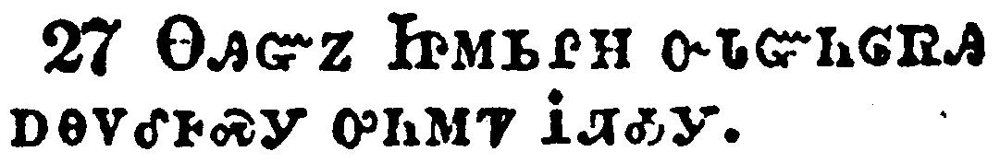</a></td>
</tr>
<tr class="even">
<td>And in these days came prophets from Jerusalem unto Antioch.</td>
</tr>
<tr class="odd">
<td>ᎾᎯᏳᏃ ᏥᎷᏏᎵᎻ ᏅᏓᏳᏂᎶᏒᎯ ᎠᎾᏙᎴᎰᏍᎩ ᎤᏂᎷᏤ ᎥᏖᎣᎩ.</td>
</tr>
<tr class="even">
<td>Na-hi-yu-no Tsi-lu-si-li-mi nv-da-yu-ni-lo-sv-hi a-na-do-le-ho-s-gi u-ni-lu-tse V-te-o-gi.</td>
</tr>
</tbody>
</table>

<table>
<tbody>
<tr class="odd">
<td><a href="051128.png">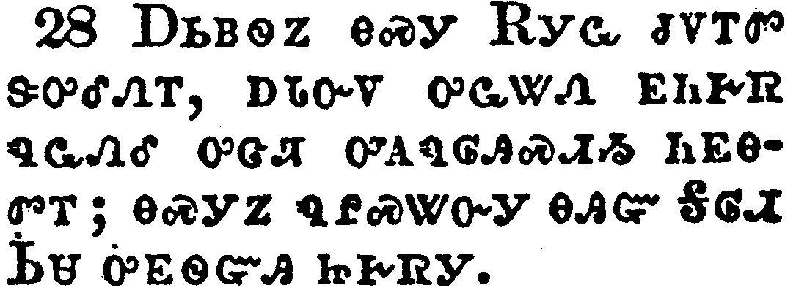</a></td>
</tr>
<tr class="even">
<td>And there stood up one of them named Agabus, and signified by the spirit that there should be great dearth throughout all the world: which came to pass in the days of Claudius Caesar.</td>
</tr>
<tr class="odd">
<td>ᎠᏏᏴᏫᏃ ᎾᏍᎩ ᎡᎩᏩ ᏧᏙᎢᏛ ᏕᎤᎴᏁᎢ, ᎠᏓᏅᏙ ᎤᏩᏔᏁ ᎬᏂᎨᏒ ᏄᏩᏁᎴ ᎤᏣᏘ ᎤᎪᏄᎶᎯᏍᏗᏱ ᏂᎬᎾᏛᎢ; ᎾᏍᎩᏃ ᏄᎵᏍᏔᏅᎩ ᎾᎯᏳ ᎦᎶᏗ ᏏᏌ ᎤᎬᏫᏳᎯ ᏥᎨᏒᎩ.</td>
</tr>
<tr class="even">
<td>A-si-yv-wi-no na-s-gi E-gi-wa tsu-do-i-dv de-u-le-ne-i, a-da-nv-do u-wa-ta-ne gv-ni-ge-sv nu-wa-ne-le u-tsa-ti u-go-nu-lo-hi-s-di-yi ni-gv-na-dv-i; na-s-gi-no nu-li-s-ta-nv-gi na-hi-yu Ga-lo-di Si-sa u-gv-wi-yu-hi tsi-ge-sv-gi.</td>
</tr>
</tbody>
</table>

<table>
<tbody>
<tr class="odd">
<td></td>
</tr>
<tr class="even">
<td>Then the disciples, every man according to his ability, determined to send relief unto the brethren which dwelt in Judaea:</td>
</tr>
<tr class="odd">
<td>ᎠᏃᎯᏳᎲᏍᎩᏃ ᎠᏂᏏᏴᏫᎭ ᏰᎵ ᎢᎬᏩᎾᏛᏁᏗ ᎨᏒ ᏚᏄᎪᏔᏁ ᎤᎾᏓᏅᏍᏗᏱ ᎤᎾᎵᏍᏕᎸᏙᏗ ᎠᎾᎵᏅᏟ ᏧᏗᏱ ᎠᏁᎯ.</td>
</tr>
<tr class="even">
<td>A-no-hi-yu-hv-s-gi-no a-ni-si-yv-wi-ha ye-li i-gv-wa-na-dv-ne-di ge-sv du-nu-go-ta-ne u-na-da-nv-s-di-yi u-na-li-s-de-lv-do-di a-na-li-nv-tli Tsu-di-yi a-ne-hi.</td>
</tr>
</tbody>
</table>

<table>
<tbody>
<tr class="odd">
<td></td>
</tr>
<tr class="even">
<td>Which also they did, and sent it to the elders by the hands of Barnabas and Saul.</td>
</tr>
<tr class="odd">
<td>ᎾᏍᎩᏃ ᏄᎾᏛᏁᎴᎢ, ᏫᏚᏂᏁᎴ ᏗᎨᎦᏁᎶᏗ ᏆᏂᏆ ᎠᎴ ᏐᎳ ᏚᎾᎨᏅᏕᎢ.</td>
</tr>
<tr class="even">
<td>Na-s-gi-no nu-na-dv-ne-le-i, wi-du-ni-ne-le di-ge-ga-ne-lo-di Qua-ni-qua a-le So-la du-na-ge-nv-de-i.</td>
</tr>
</tbody>
</table>

