+++
draft=false
date = 2014-12-18T21:11:07Z
title = "The Acts - Chapter 12 - Cherokee New Testament"
weight = 1418955067

[taxonomies]

authors = ["Timothy Legg"]
categories = []
tags = []

[extra]
+++

<table>
<tbody>
<tr class="odd">
<td><a href="051201.png">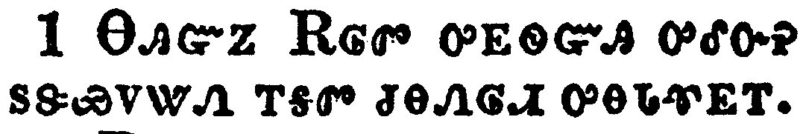</a></td>
</tr>
<tr class="even">
<td>Now about that time Herod the king stretched forth his hands to vex certain of the church.</td>
</tr>
<tr class="odd">
<td>ᎾᎯᏳᏃ ᎡᎶᏛ ᎤᎬᏫᏳᎯ ᎤᎴᏅᎮ ᏚᏕᏯᏙᏔᏁ ᎢᎦᏛ ᏧᎾᏁᎶᏗ ᎤᎾᏓᏡᎬᎢ.</td>
</tr>
<tr class="even">
<td>Na-hi-yu-no E-lo-dv u-gv-wi-yu-hi u-le-nv-he du-de-ya-do-ta-ne i-ga-dv tsu-na-ne-lo-di u-na-da-tlu-gv-i.</td>
</tr>
</tbody>
</table>

<table>
<tbody>
<tr class="odd">
<td><a href="051202.png">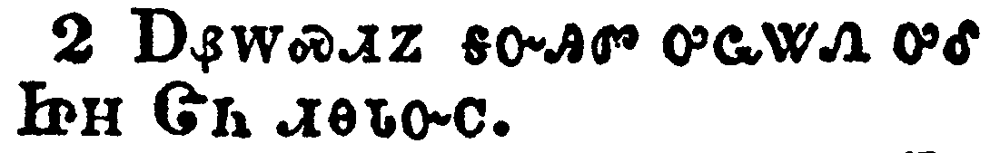</a></td>
</tr>
<tr class="even">
<td>And he killed James the brother of John with the sword.</td>
</tr>
<tr class="odd">
<td>ᎠᏰᎳᏍᏗᏃ ᎦᏅᎯᏛ ᎤᏩᏔᏁ ᎤᎴ ᏥᎻ ᏣᏂ ᏗᎾᏓᏅᏟ.</td>
</tr>
<tr class="even">
<td>A-ye-la-s-di-no ga-nv-hi-dv u-wa-ta-ne u-le Tsi-mi Tsa-ni di-na-da-nv-tli.</td>
</tr>
</tbody>
</table>

<table>
<tbody>
<tr class="odd">
<td><a href="051203.png">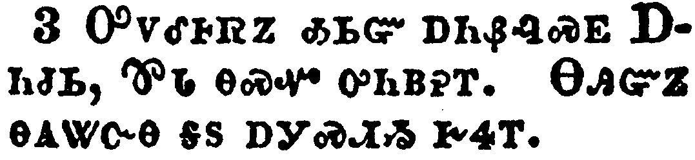</a></td>
</tr>
<tr class="even">
<td>And because he saw it pleased the Jews, he proceeded further to take Peter also. (Then were the days of unleavened bread.)</td>
</tr>
<tr class="odd">
<td>ᎤᏙᎴᎰᏒᏃ ᎣᏏᏳ ᎠᏂᏰᎸᏍᎬ ᎠᏂᏧᏏ, ᏈᏓ ᎾᏍᏉ ᎤᏂᏴᎮᎢ. ᎾᎯᏳᏃ ᎾᎪᏔᏅᎾ ᎦᏚ ᎠᎩᏍᏗᏱ ᎨᏎᎢ.</td>
</tr>
<tr class="even">
<td>U-do-le-ho-sv-no o-si-yu a-ni-ye-lv-s-gv A-ni-tsu-si, Qui-da na-s-quo u-ni-yv-he-i. Na-hi-yu-no na-go-ta-nv-na ga-du a-gi-s-di-yi ge-se-i.</td>
</tr>
</tbody>
</table>

<table>
<tbody>
<tr class="odd">
<td><a href="051204.png">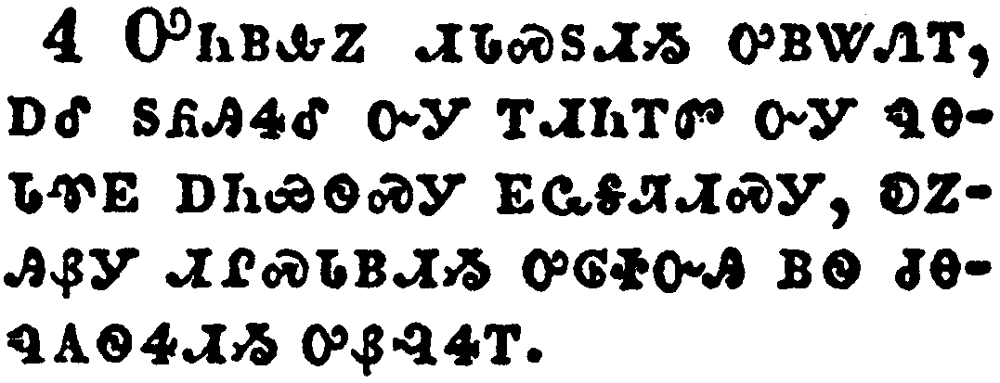</a></td>
</tr>
<tr class="even">
<td>And when he had apprehended him, he put him in prison, and delivered him to four quaternions of soldiers to keep him; intending after Easter to bring him forth to the people.</td>
</tr>
<tr class="odd">
<td>ᎤᏂᏴᎲᏃ ᏗᏓᏍᏚᏗᏱ ᎤᏴᏔᏁᎢ, ᎠᎴ ᏚᏲᎯᏎᎴ ᏅᎩ ᎢᏗᏂᎢᏛ ᏅᎩ ᏄᎾᏓᏡᎬ ᎠᏂᏯᏫᏍᎩ ᎬᏩᎦᏘᏗᏍᎩ, ᎧᏃᎯᏰᎩ ᏗᎵᏍᏓᏴᏗᏱ ᎤᎶᏐᏅᎯ ᏴᏫ ᏧᎾᏄᎪᏫᏎᏗᏱ ᎤᏰᎸᏎᎢ.</td>
</tr>
<tr class="even">
<td>U-ni-yv-hv-no di-da-s-du-di-yi u-yv-ta-ne-i, a-le du-yo-hi-se-le nv-gi i-di-ni-i-dv nv-gi nu-na-da-tlu-gv a-ni-ya-wi-s-gi gv-wa-ga-ti-di-s-gi, ka-no-hi-ye-gi di-li-s-da-yv-di-yi u-lo-so-nv-hi yv-wi tsu-na-nu-go-wi-se-di-yi u-ye-lv-se-i.</td>
</tr>
</tbody>
</table>

<table>
<tbody>
<tr class="odd">
<td><a href="051205.png">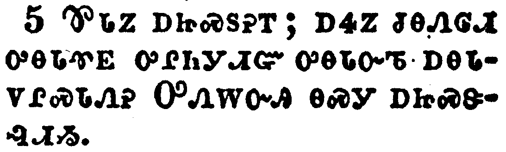</a></td>
</tr>
<tr class="even">
<td>Peter therefore was kept in prison: but prayer was made without ceasing of the church unto God for him.</td>
</tr>
<tr class="odd">
<td>ᏈᏓᏃ ᎠᏥᏍᏚᎮᎢ; ᎠᏎᏃ ᏧᎾᏁᎶᏗ ᎤᎾᏓᏡᎬ ᎤᎵᏂᎩᏗᏳ ᎤᎾᏓᏅᏖ ᎠᎾᏓᏙᎵᏍᏓᏁᎮ ᎤᏁᎳᏅᎯ ᎾᏍᎩ ᎠᏥᏍᏕᎸᏗᏱ.</td>
</tr>
<tr class="even">
<td>Qui-da-no a-tsi-s-du-he-i; a-se-no tsu-na-ne-lo-di u-na-da-tlu-gv u-li-ni-gi-di-yu u-na-da-nv-te a-na-da-do-li-s-da-ne-he U-ne-la-nv-hi na-s-gi a-tsi-s-de-lv-di-yi.</td>
</tr>
</tbody>
</table>

<table>
<tbody>
<tr class="odd">
<td><a href="051206.png">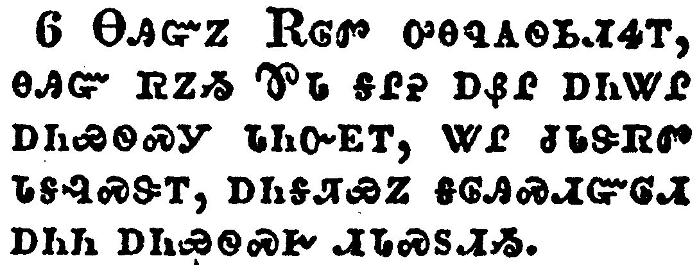</a></td>
</tr>
<tr class="even">
<td>And when Herod would have brought him forth, the same night Peter was sleeping between two soldiers, bound with two chains: and the keepers before the door kept the prison.</td>
</tr>
<tr class="odd">
<td>ᎾᎯᏳᏃ ᎡᎶᏛ ᎤᎾᏄᎪᏫᏏᏗᏎᎢ, ᎾᎯᏳ ᏒᏃᏱ ᏈᏓ ᎦᎵᎮ ᎠᏰᎵ ᎠᏂᏔᎵ ᎠᏂᏯᏫᏍᎩ ᏓᏂᏅᎬᎢ, ᏔᎵ ᏧᏓᏕᏒᏛ ᏓᎦᎸᏍᏕᎢ, ᎠᏂᎦᏘᏯᏃ ᎦᎶᎯᏍᏗᏳᎶᏗ ᎠᏂᏂ ᎠᏂᏯᏫᏍᎨ ᏗᏓᏍᏚᏗᏱ.</td>
</tr>
<tr class="even">
<td>Na-hi-yu-no E-lo-dv u-na-nu-go-wi-si-di-se-i, na-hi-yu sv-no-yi Qui-da ga-li-he a-ye-li a-ni-ta-li a-ni-ya-wi-s-gi da-ni-nv-gv-i, ta-li tsu-da-de-sv-dv da-ga-lv-s-de-i, a-ni-ga-ti-ya-no ga-lo-hi-s-di-yu-lo-di a-ni-ni a-ni-ya-wi-s-ge di-da-s-du-di-yi.</td>
</tr>
</tbody>
</table>

<table>
<tbody>
<tr class="odd">
<td><a href="051207.png">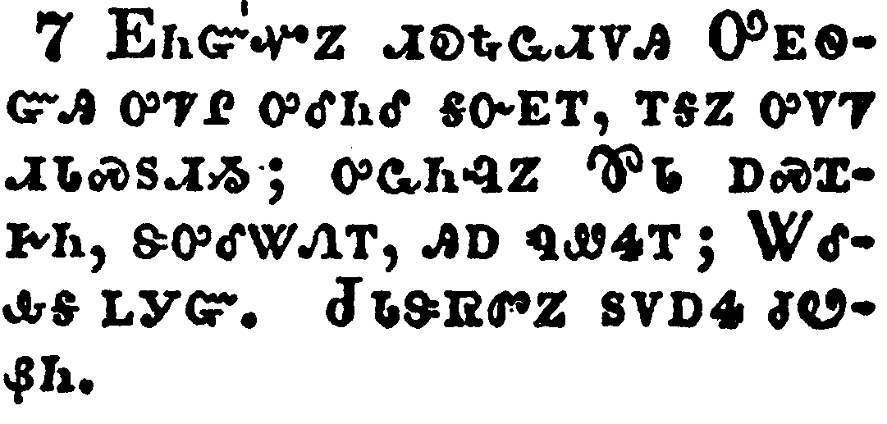</a></td>
</tr>
<tr class="even">
<td>And, behold, the angel of the Lord came upon him, and a light shined in the prison: and he smote Peter on the side, and raised him up, saying, Arise up quickly. And his chains fell off from his hands.</td>
</tr>
<tr class="odd">
<td>ᎬᏂᏳᏉᏃ ᏗᎧᎿᎭᏩᏗᏙᎯ ᎤᎬᏫᏳᎯ ᎤᏤᎵ ᎤᎴᏂᎴ ᎦᏅᎬᎢ, ᎢᎦᏃ ᎤᏙᏤ ᏗᏓᏍᏚᏗᏱ; ᎤᏩᏂᎸᏃ ᏈᏓ ᎠᏍᏆᎨᏂ, ᏕᎤᎴᏔᏁᎢ, ᎯᎠ ᏄᏪᏎᎢ; ᏔᎴᎲᎦ ᏞᎩᏳ. ᏧᏓᏕᏒᏛᏃ ᏚᏙᎠᏎ ᏧᏬᏰᏂ.</td>
</tr>
<tr class="even">
<td>Gv-ni-yu-quo-no di-ka-hna-wa-di-do-hi U-gv-wi-yu-hi u-tse-li u-le-ni-le ga-nv-gv-i, i-ga-no u-do-tse di-da-s-du-di-yi; u-wa-ni-lv-no Qui-da a-s-qua-ge-ni, de-u-le-ta-ne-i, hi-a nu-we-se-i; Ta-le-hv-ga tle-gi-yu. Tsu-da-de-sv-dv-no du-do-a-se tsu-wo-ye-ni.</td>
</tr>
</tbody>
</table>

<table>
<tbody>
<tr class="odd">
<td></td>
</tr>
<tr class="even">
<td>And the angel said unto him, Gird thyself, and bind on thy sandals. And so he did. And he saith unto him, Cast thy garment about thee, and follow me.</td>
</tr>
<tr class="odd">
<td>ᏗᎧᎿᎭᏩᏗᏙᎯᏃ ᎯᎠ ᏄᏪᏎᎴᎢ; ᎭᏓᏠᎦ, ᎠᎴ ᏔᎳᏑᎸᎦ. ᎾᏍᎩᏃ ᏄᏛᏁᎴᎢ. ᎯᎠᏃ ᏄᏪᏎᎴᎢ; ᎭᏄᏬᏣ ᎠᎴ ᏍᎩᏍᏓᏩᏚᎦ.</td>
</tr>
<tr class="even">
<td>Di-ka-hna-wa-di-do-hi-no hi-a nu-we-se-le-i; Ha-da-tlo-ga, a-le ta-la-su-lv-ga. Na-s-gi-no nu-dv-ne-le-i. Hi-a-no nu-we-se-le-i; Ha-nu-wo-tsa a-le s-gi-s-da-wa-du-ga.</td>
</tr>
</tbody>
</table>

<table>
<tbody>
<tr class="odd">
<td><a href="051209.png">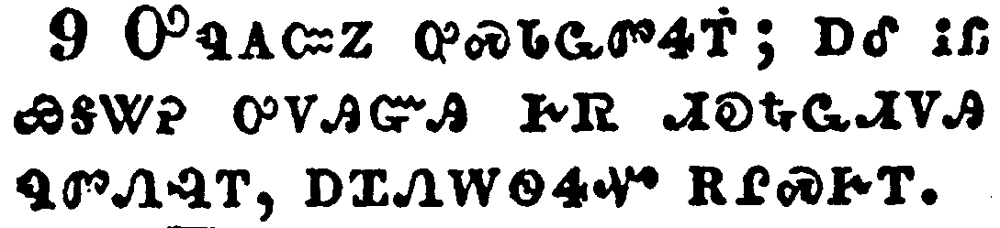</a></td>
</tr>
<tr class="even">
<td>And he went out, and followed him; and wist not that it was true which was done by the angel; but thought he saw a vision.</td>
</tr>
<tr class="odd">
<td>ᎤᏄᎪᏨᏃ ᎤᏍᏓᏩᏛᏎᎢ; ᎠᎴ ᎥᏝ ᏯᎦᏔᎮ ᎤᏙᎯᏳᎯ ᎨᏒ ᏗᎧᎿᎭᏩᏗᏙᎯ ᏄᏛᏁᎸᎢ, ᎠᏆᏁᎳᏫᏎᏉ ᎡᎵᏍᎨᎢ.</td>
</tr>
<tr class="even">
<td>U-nu-go-tsv-no u-s-da-wa-dv-se-i; a-le v-tla ya-ga-ta-he u-do-hi-yu-hi ge-sv di-ka-hna-wa-di-do-hi nu-dv-ne-lv-i, a-qua-ne-la-wi-se-quo e-li-s-ge-i.</td>
</tr>
</tbody>
</table>

<table>
<tbody>
<tr class="odd">
<td><a href="051210.png">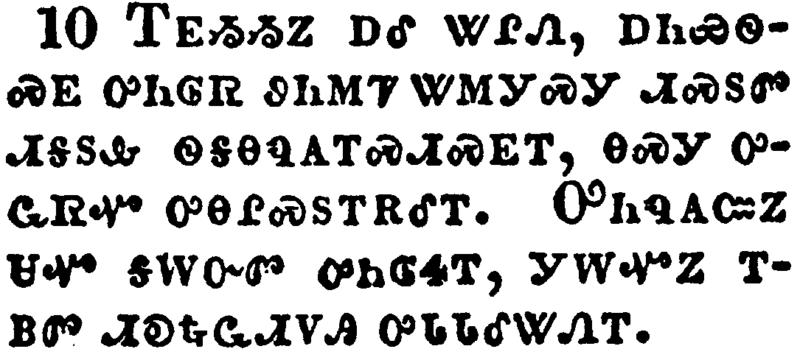</a></td>
</tr>
<tr class="even">
<td>When they were past the first and the second ward, they came unto the iron gate that leadeth unto the city; which opened to them of his own accord: and they went out, and passed on through one street; and forthwith the angel departed from him.</td>
</tr>
<tr class="odd">
<td>ᎢᎬᏱᏱᏃ ᎠᎴ ᏔᎵᏁ, ᎠᏂᏯᏫᏍᎬ ᎤᏂᎶᏒ ᏭᏂᎷᏤ ᏔᎷᎩᏍᎩ ᏗᏍᏚᏛ ᏗᎦᏚᎲ ᏫᎦᎾᏄᎪᎢᏍᏗᏍᎬᎢ, ᎾᏍᎩ ᎤᏩᏒᏉ ᎤᎾᎵᏍᏚᎢᎡᎴᎢ. ᎤᏂᏄᎪᏨᏃ ᏌᏉ ᎦᎳᏅᏛ ᎤᏂᎶᏎᎢ, ᎩᎳᏉᏃ ᎢᏴᏛ ᏗᎧᎿᎭᏩᏗᏙᎯ ᎤᏓᏓᎴᏔᏁᎢ.</td>
</tr>
<tr class="even">
<td>I-gv-yi-yi-no a-le ta-li-ne, a-ni-ya-wi-s-gv u-ni-lo-sv wu-ni-lu-tse ta-lu-gi-s-gi di-s-du-dv di-ga-du-hv wi-ga-na-nu-go-i-s-di-s-gv-i, na-s-gi u-wa-sv-quo u-na-li-s-du-i-e-le-i. U-ni-nu-go-tsv-no sa-quo ga-la-nv-dv u-ni-lo-se-i, gi-la-quo-no i-yv-dv di-ka-hna-wa-di-do-hi u-da-da-le-ta-ne-i.</td>
</tr>
</tbody>
</table>

<table>
<tbody>
<tr class="odd">
<td><a href="051211.png">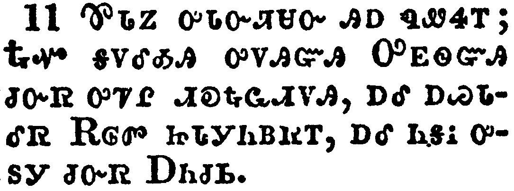</a></td>
</tr>
<tr class="even">
<td>And when Peter was come to himself, he said, Now I know of a surety, that the Lord hath sent his angel, and hath delivered me out of the hand of Herod, and from all the expectation of the people of the Jews.</td>
</tr>
<tr class="odd">
<td>ᏈᏓᏃ ᎤᏓᏅᏘᏌᏅ ᎯᎠ ᏄᏪᏎᎢ; ᎿᎭᏉ ᎦᏙᎴᎣᎯ ᎤᏙᎯᏳᎯ ᎤᎬᏫᏳᎯ ᏧᏅᏒ ᎤᏤᎵ ᏗᎧᎿᎭᏩᏗᏙᎯ, ᎠᎴ ᎠᏇᏓᎴᏒ ᎡᎶᏛ ᏥᏓᎩᏂᏴᏒᎢ, ᎠᎴ ᏂᎦᎥ ᎤᏚᎩ ᏧᏅᏒ ᎠᏂᏧᏏ.</td>
</tr>
<tr class="even">
<td>Qui-da-no u-da-nv-ti-sa-nv hi-a nu-we-se-i; Hna-quo ga-do-le-o-hi u-do-hi-yu-hi U-gv-wi-yu-hi tsu-nv-sv u-tse-li di-ka-hna-wa-di-do-hi, a-le a-que-da-le-sv E-lo-dv tsi-da-gi-ni-yv-sv-i, a-le ni-ga-v u-du-gi tsu-nv-sv A-ni-tsu-si.</td>
</tr>
</tbody>
</table>

<table>
<tbody>
<tr class="odd">
<td><a href="051212.png">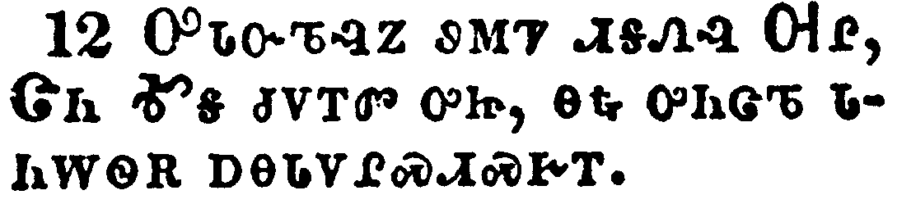</a></td>
</tr>
<tr class="even">
<td>And when he had considered the thing, he came to the house of Mary the mother of John, whose surname was Mark; where many were gathered together praying.</td>
</tr>
<tr class="odd">
<td>ᎤᏓᏅᏖᎸᏃ ᏭᎷᏤ ᏗᎦᏁᎸ ᎺᎵ, ᏣᏂ ᎹᎦ ᏧᏙᎢᏛ ᎤᏥ, ᎾᎿᎭᎤᏂᏣᏖ ᏓᏂᎳᏫᎡ ᎠᎾᏓᏙᎵᏍᏗᏍᎨᎢ.</td>
</tr>
<tr class="even">
<td>U-da-nv-te-lv-no wu-lu-tse di-ga-ne-lv Me-li, Tsa-ni Ma-ga tsu-do-i-dv u-tsi, na-hna u-ni-tsa-te da-ni-la-wi-e a-na-da-do-li-s-di-s-ge-i.</td>
</tr>
</tbody>
</table>

<table>
<tbody>
<tr class="odd">
<td><a href="051213.png">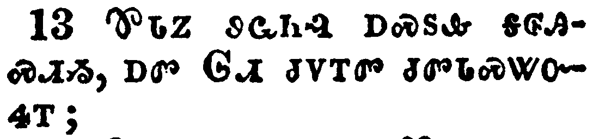</a></td>
</tr>
<tr class="even">
<td>And as Peter knocked at the door of the gate, a damsel came to hearken, named Rhoda.</td>
</tr>
<tr class="odd">
<td>ᏈᏗᏃ ᏭᏩᏂᎸ ᎠᏍᏚᎲ ᎦᎶᎯᏍᏗᏱ, ᎠᏛ ᎶᏗ ᏧᏙᎢᏛ ᏧᏛᏓᏍᏔᏅᏎᎢ;</td>
</tr>
<tr class="even">
<td>Qui-di-no wu-wa-ni-lv a-s-du-hv ga-lo-hi-s-di-yi, a-dv Lo-di tsu-do-i-dv tsu-dv-da-s-ta-nv-se-i;</td>
</tr>
</tbody>
</table>

<table>
<tbody>
<tr class="odd">
<td><a href="051214.png">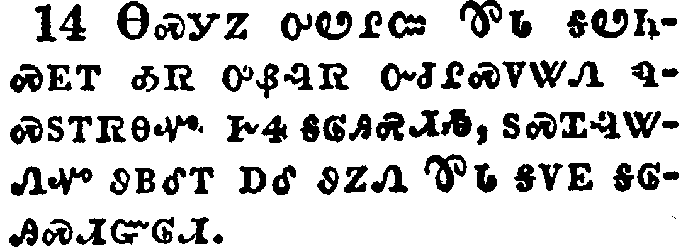</a></td>
</tr>
<tr class="even">
<td>And when she knew Peter's voice, she opened not the gate for gladness, but ran in, and told how Peter stood before the gate.</td>
</tr>
<tr class="odd">
<td>ᎾᏍᎩᏃ ᎤᏬᎵᏨ ᏈᏓ ᎦᏬᏂᏍᎬᎢ ᎣᏒ ᎤᏰᎸᏒ ᏅᏓᎵᏍᏙᏔᏁ ᏄᏍᏚᎢᏒᎾᏉ ᎨᏎ ᎦᎶᎯᏍᏗᏱ, ᏚᏍᏆᎸᏔᏁᏉ ᏭᏴᎴᎢ ᎠᎴ ᏭᏃᏁ ᏈᏓ ᎦᏙᎬ ᎦᎶᎯᏍᏗᏳᎶᏗ.</td>
</tr>
<tr class="even">
<td>Na-s-gi-no u-wo-li-tsv Qui-da ga-wo-ni-s-gv-i o-sv u-ye-lv-sv nv-da-li-s-do-ta-ne nu-s-du-i-sv-na-quo ge-se ga-lo-hi-s-di-yi, du-s-qua-lv-ta-ne-quo wu-yv-le-i a-le wu-no-ne Qui-da ga-do-gv ga-lo-hi-s-di-yu-lo-di.</td>
</tr>
</tbody>
</table>

<table>
<tbody>
<tr class="odd">
<td><a href="051215.png">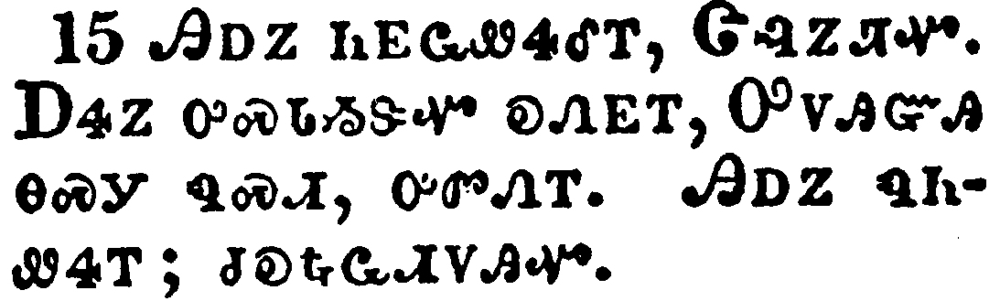</a></td>
</tr>
<tr class="even">
<td>And they said unto her, Thou art mad. But she constantly affirmed that it was even so. Then said they, It is his angel.</td>
</tr>
<tr class="odd">
<td>ᎯᎠᏃ ᏂᎬᏩᏪᏎᎴᎢ, ᏣᎸᏃᏘᏉ. ᎠᏎᏃ ᎤᏍᏓᏱᏕᏉ ᎧᏁᎬᎢ, ᎤᏙᎯᏳᎯ ᎾᏍᎩ ᏄᏍᏗ, ᎤᏛᏁᎢ. ᎯᎠᏃ ᏄᏂᏪᏎᎢ; ᏓᎧᎿᎭᏩᏗᏙᎯᏉ.</td>
</tr>
<tr class="even">
<td>Hi-a-no ni-gv-wa-we-se-le-i, Tsa-lv-no-ti-quo. A-se-no u-s-da-yi-de-quo ka-ne-gv-i, U-do-hi-yu-hi na-s-gi nu-s-di, u-dv-ne-i. Hi-a-no nu-ni-we-se-i; da-ka-hna-wa-di-do-hi-quo.</td>
</tr>
</tbody>
</table>

<table>
<tbody>
<tr class="odd">
<td><a href="051216.png">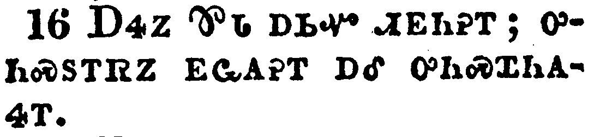</a></td>
</tr>
<tr class="even">
<td>But Peter continued knocking: and when they had opened the door, and saw him, they were astonished.</td>
</tr>
<tr class="odd">
<td>ᎠᏎᏃ ᏈᏓ ᎠᏏᏉ ᏗᎬᏂᎮᎢ; ᎤᏂᏍᏚᎢᏒᏃ ᎬᏩᎪᎮᎢ ᎠᎴ ᎤᏂᏍᏆᏂᎪᏎᎢ.</td>
</tr>
<tr class="even">
<td>A-se-no Qui-da a-si-quo di-gv-ni-he-i; u-ni-s-du-i-sv-no gv-wa-go-he-i a-le u-ni-s-qua-ni-go-se-i.</td>
</tr>
</tbody>
</table>

<table>
<tbody>
<tr class="odd">
<td></td>
</tr>
<tr class="even">
<td>But he, beckoning unto them with the hand to hold their peace, declared unto them how the Lord had brought him out of the prison. And he said, Go shew these things unto James, and to the brethren. And he departed, and went into another place.</td>
</tr>
<tr class="odd">
<td>ᎠᏎᏃ ᎤᏬᏰᏂ ᎤᏖᎸᏅ ᎡᎳᏪ ᎤᏅᏗᏱ, ᏚᏃᏁᎴ ᏄᎵᏍᏔᏅ ᎤᎬᏫᏳᎯ ᎤᏄᎪᏫᏒ ᏗᏓᏍᏚᏗᏱ. ᎠᎴ ᎯᎠ ᏄᏪᏎᎢ; ᎯᎠ ᎾᏍᎩ ᏫᏗᏥᏃᎲᏏ ᏥᎻ ᎠᎴ ᏦᏣᏓᏅᏟ. ᎤᏄᎪᏤᏃ ᎢᎸᎯᏢ ᏭᎶᏎᎢ.</td>
</tr>
<tr class="even">
<td>A-se-no u-wo-ye-ni u-te-lv-nv e-la-we u-nv-di-yi, du-no-ne-le nu-li-s-ta-nv U-gv-wi-yu-hi u-nu-go-wi-sv di-da-s-du-di-yi. A-le hi-a nu-we-se-i; Hi-a na-s-gi wi-di-tsi-no-hv-si Tsi-mi a-le tso-tsa-da-nv-tli. U-nu-go-tse-no i-lv-hi-tlv wu-lo-se-i.</td>
</tr>
</tbody>
</table>

<table>
<tbody>
<tr class="odd">
<td><a href="051218.png">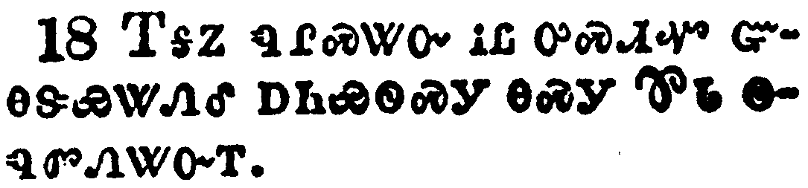</a></td>
</tr>
<tr class="even">
<td>Now as soon as it was day, there was no small stir among the soldiers, what was become of Peter.</td>
</tr>
<tr class="odd">
<td>ᎢᎦᏃ ᏄᎵᏍᏔᏅ ᎥᏝ ᎤᏍᏗᏉ ᏳᎾᏕᏯᏔᏁᎴ ᎠᏂᏯᏫᏍᎩ ᎾᏍᎩ ᏈᏓ ᏫᏄᏛᏁᏔᏅᎢ.</td>
</tr>
<tr class="even">
<td>I-ga-no nu-li-s-ta-nv v-tla u-s-di-quo yu-na-de-ya-ta-ne-le a-ni-ya-wi-s-gi na-s-gi Qui-da wi-nu-dv-ne-ta-nv-i.</td>
</tr>
</tbody>
</table>

<table>
<tbody>
<tr class="odd">
<td><a href="051219.png">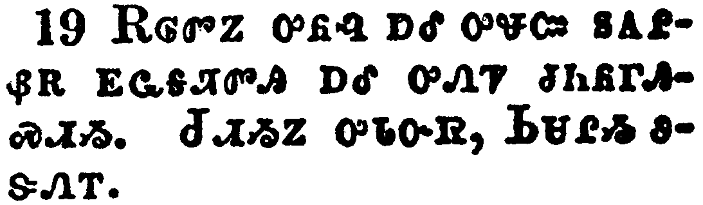</a></td>
</tr>
<tr class="even">
<td>And when Herod had sought for him, and found him not, he examined the keepers, and commanded that they should be put to death. And he went down from Judaea to Caesarea, and there abode.</td>
</tr>
<tr class="odd">
<td>ᎡᎶᏛᏃ ᎤᏲᎸ ᎠᎴ ᎤᏠᏨ ᏚᎪᎵᏰᎡ ᎬᏩᎦᏘᏛᎯ ᎠᎴ ᎤᏁᏤ ᏧᏂᏲᎱᎯᏍᏗᏱ. ᏧᏗᏱᏃ ᎤᏓᏅᏒ, ᏏᏌᎵᏱ ᏭᏕᏁᎢ.</td>
</tr>
<tr class="even">
<td>E-lo-dv-no u-yo-lv a-le u-tlo-tsv du-go-li-ye-e gv-wa-ga-ti-dv-hi a-le u-ne-tse tsu-ni-yo-hu-hi-s-di-yi. Tsu-di-yi-no u-da-nv-sv, Si-sa-li-yi wu-de-ne-i.</td>
</tr>
</tbody>
</table>

<table>
<tbody>
<tr class="odd">
<td><a href="051220.png">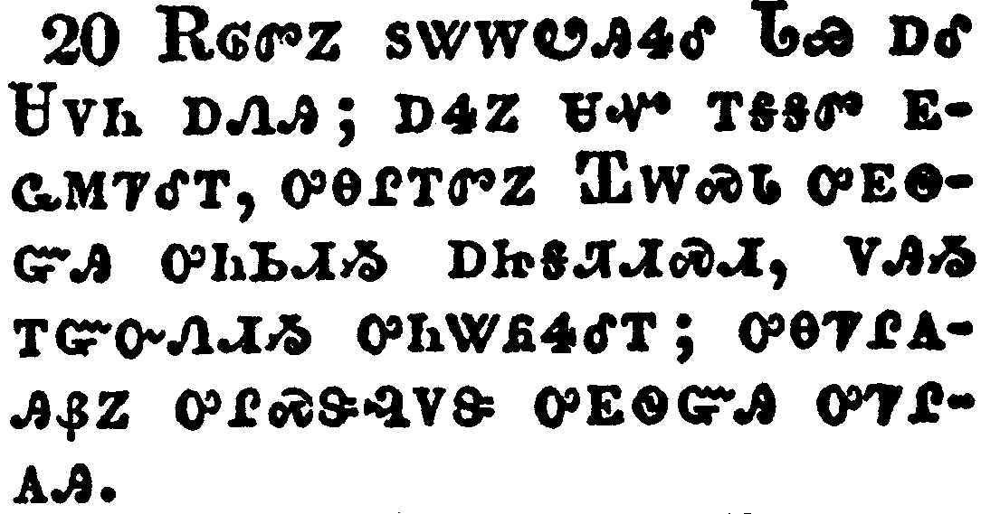</a></td>
</tr>
<tr class="even">
<td>And Herod was highly displeased with them of Tyre and Sidon: but they came with one accord to him, and, having made Blastus the king's chamberlain their friend, desired peace; because their country was nourished by the king's country.</td>
</tr>
<tr class="odd">
<td>ᎡᎶᏛᏃ ᏚᏔᎳᏬᎯᏎᎴ ᏓᏯ ᎠᎴ ᏌᏙᏂ ᎠᏁᎯ; ᎠᏎᏃ ᏌᏉ ᎢᎦᎦᏛ ᎬᏩᎷᏤᎴᎢ, ᎤᎾᎵᎢᏛᏃ ᏆᎳᏍᏓ ᎤᎬᏫᏳᎯ ᎤᏂᏏᏗᏱ ᎠᏥᎦᏘᏗᏍᏗ, ᏙᎯᏱ ᎢᏳᏅᏁᏗᏱ ᎤᏂᏔᏲᏎᎴᎢ; ᎤᎾᏤᎵᎪᎯᏰᏃ ᎤᎵᏍᏕᎸᏙᏕ ᎤᎬᏫᏳᎯ ᎤᏤᎵᎪᎯ.</td>
</tr>
<tr class="even">
<td>E-lo-dv-no du-ta-la-wo-hi-se-le Da-ya a-le Sa-do-ni a-ne-hi; a-se-no sa-quo i-ga-ga-dv gv-wa-lu-tse-le-i, u-na-li-i-dv-no Qua-la-s-da u-gv-wi-yu-hi u-ni-si-di-yi a-tsi-ga-ti-di-s-di, do-hi-yi i-yu-nv-ne-di-yi u-ni-ta-yo-se-le-i; u-na-tse-li-go-hi-ye-no u-li-s-de-lv-do-de u-gv-wi-yu-hi u-tse-li-go-hi.</td>
</tr>
</tbody>
</table>

<table>
<tbody>
<tr class="odd">
<td><a href="051221.png">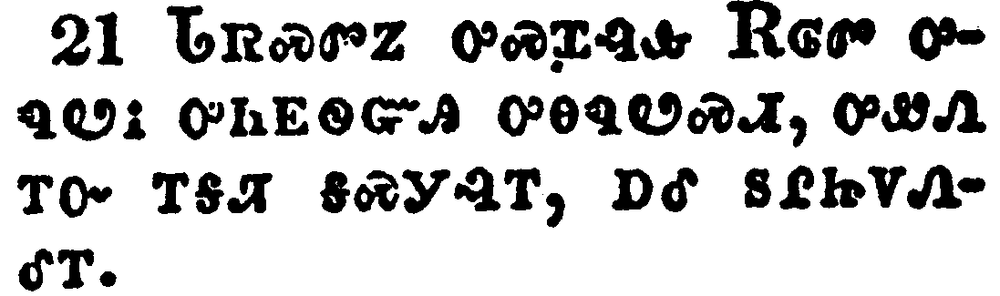</a></td>
</tr>
<tr class="even">
<td>And upon a set day Herod, arrayed in royal apparel, sat upon his throne, and made an oration unto them.</td>
</tr>
<tr class="odd">
<td>ᏓᏒᏍᏛᏃ ᎤᏍᏆᎸᎲ ᎡᎶᏛ ᎤᏄᏬᎥ ᎤᏂᎬᏫᏳᎯ ᎤᎾᏄᏬᏍᏗ, ᎤᏪᏁ ᎢᏅ ᎢᎦᏘ ᎦᏍᎩᎸᎢ, ᎠᎴ ᏚᎵᏥᏙᏁᎴᎢ.</td>
</tr>
<tr class="even">
<td>Da-sv-s-dv-no u-s-qua-lv-hv E-lo-dv u-nu-wo-v u-ni-gv-wi-yu-hi u-na-nu-wo-s-di, u-we-ne i-nv i-ga-ti ga-s-gi-lv-i, a-le du-li-tsi-do-ne-le-i.</td>
</tr>
</tbody>
</table>

<table>
<tbody>
<tr class="odd">
<td></td>
</tr>
<tr class="even">
<td>And the people gave a shout, saying, It is the voice of a god, and not of a man.</td>
</tr>
<tr class="odd">
<td>ᏴᏫᏃ ᎤᏁᎳᏁᎢ, ᎯᎠ ᏄᏂᏪᏎᎢ; ᎦᎸᎳᏗ ᎡᎯ ᎧᏁᎦ, ᎥᏝᏃ ᏴᏫ.</td>
</tr>
<tr class="even">
<td>Yv-wi-no u-ne-la-ne-i, hi-a nu-ni-we-se-i; Ga-lv-la-di e-hi ka-ne-ga, v-tla-no yv-wi.</td>
</tr>
</tbody>
</table>

<table>
<tbody>
<tr class="odd">
<td><a href="051223.png">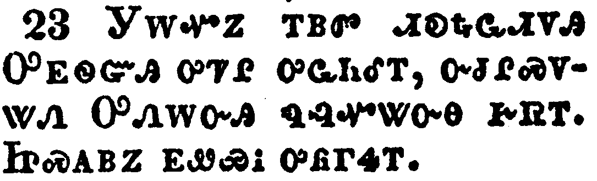</a></td>
</tr>
<tr class="even">
<td>And immediately the angel of the Lord smote him, because he gave not God the glory: and he was eaten of worms, and gave up the ghost.</td>
</tr>
<tr class="odd">
<td>ᎩᎳᏉᏃ ᎢᏴᏛ ᏗᎧᎿᎭᏩᏗᏙᎯ ᎤᎬᏫᏳᎯ ᎤᏤᎵ ᎤᏩᏂᎴᎢ, ᏅᏧᎵᏍᏙᏔᏁ ᎤᏁᎳᏅᎯ ᏄᎸᏉᏔᏅᎾ ᎨᏒᎢ. ᏥᏍᎪᏴᏃ ᎬᏩᏯᎥ ᎤᏲᎱᏎᎢ.</td>
</tr>
<tr class="even">
<td>Gi-la-quo-no i-yv-dv di-ka-hna-wa-di-do-hi U-gv-wi-yu-hi u-tse-li u-wa-ni-le-i, nv-tsu-li-s-do-ta-ne U-ne-la-nv-hi nu-lv-quo-ta-nv-na ge-sv-i. Tsi-s-go-yv-no gv-wa-ya-v u-yo-hu-se-i.</td>
</tr>
</tbody>
</table>

<table>
<tbody>
<tr class="odd">
<td><a href="051224.png">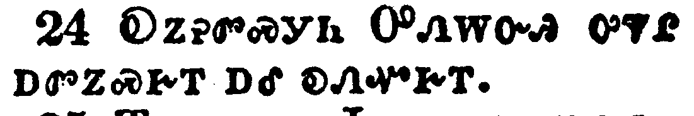</a></td>
</tr>
<tr class="even">
<td>But the word of God grew and multiplied.</td>
</tr>
<tr class="odd">
<td>ᎧᏃᎮᏛᏍᎩᏂ ᎤᏁᎳᏅᎯ ᎤᏤᎵ ᎠᏛᏃᏍᎨᎢ ᎠᎴ ᎧᏁᏉᎨᎢ.</td>
</tr>
<tr class="even">
<td>Ka-no-he-dv-s-gi-ni U-ne-la-nv-hi u-tse-li a-dv-no-s-ge-i a-le ka-ne-quo-ge-i.</td>
</tr>
</tbody>
</table>

<table>
<tbody>
<tr class="odd">
<td><a href="051225.png">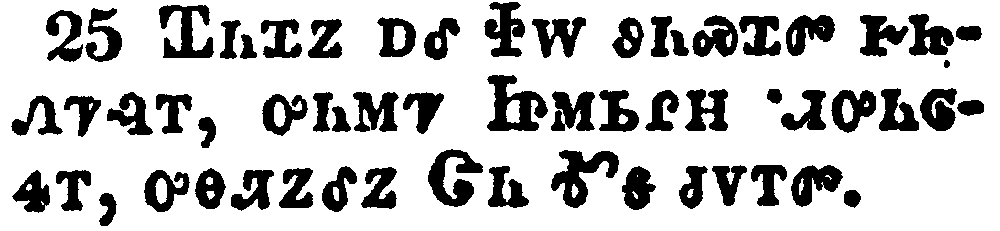</a></td>
</tr>
<tr class="even">
<td>And Barnabas and Saul returned from Jerusalem, when they had fulfilled their ministry, and took with them John, whose surname was Mark.</td>
</tr>
<tr class="odd">
<td>ᏆᏂᏉᏃ ᎠᎴ ᏐᎳ ᏭᏂᏍᏆᏛ ᎨᏥᏁᏤᎸᎢ, ᎤᏂᎷᏤ ᏥᎷᏏᎵᎻ ᏗᎤᏂᎶᏎᎢ, ᎤᎾᏘᏃᎴᏃ ᏣᏂ ᎹᎦ ᏧᏙᎢᏛ.</td>
</tr>
<tr class="even">
<td>qua-ni-quo-no a-le so-la wu-ni-s-qua-dv ge-tsi-ne-tse-lv-i, u-ni-lu-tse tsi-lu-si-li-mi di-u-ni-lo-se-i, u-na-ti-no-le-no tsa-ni ma-ga tsu-do-i-dv.</td>
</tr>
</tbody>
</table>

