+++
draft=false
date = 2014-12-18T21:11:07Z
title = "The Acts - Chapter 13 - Cherokee New Testament"
weight = 1418955067

[taxonomies]

authors = ["Timothy Legg"]
categories = []
tags = []

[extra]
+++

<table>
<tbody>
<tr class="odd">
<td></td>
</tr>
<tr class="even">
<td>Now there were in the church that was at Antioch certain prophets and teachers; as Barnabas, and Simeon that was called Niger, and Lucius of Cyrene, and Manaen, which had been brought up with Herod the tetrarch, and Saul.</td>
</tr>
<tr class="odd">
<td>ᏧᎾᏁᎶᏗᏃ ᎥᏘᎣᎩ ᏧᎾᏓᏡᎬ ᎠᏁᎲᎩ ᎩᎶ ᎢᏳᎾᏍᏗ ᎠᎾᏙᎴᎰᏍᎩ ᎠᎴ ᏗᎾᏕᏲᎲᏍᎩ, ᎾᏍᎩ ᏆᏂᏆ, ᎠᎴ ᏏᎻᏂ ᎾᎦ ᏧᏙᎢᏛ, ᎠᎴ ᎷᏏᏯ ᏌᎵᏂ ᎡᎯ, ᎠᎴ ᎹᏁᏂ ᎾᏍᎩ ᎢᏧᎳᎭ ᏧᎾᏛᏒᎯ ᎡᎶᏛ ᏅᎩ ᎢᎦᏚᎩ ᎨᏒ ᏍᎦᏚᎩ ᎠᏥᎦᏘᏗᏍᏗ, ᎠᎴ ᏐᎳ.</td>
</tr>
<tr class="even">
<td>Tsu-na-ne-lo-di-no V-ti-o-gi tsu-na-da-tlu-gv a-ne-hv-gi gi-lo i-yu-na-s-di a-na-do-le-ho-s-gi a-le di-na-de-yo-hv-s-gi, na-s-gi Qua-ni-qua, a-le Si-mi-ni Na-ga tsu-do-i-dv, a-le Lu-si-ya Sa-li-ni e-hi, a-le Ma-ne-ni na-s-gi i-tsu-la-ha tsu-na-dv-sv-hi E-lo-dv nv-gi i-ga-du-gi ge-sv s-ga-du-gi a-tsi-ga-ti-di-s-di, a-le So-la.</td>
</tr>
</tbody>
</table>

<table>
<tbody>
<tr class="odd">
<td><a href="051302.png">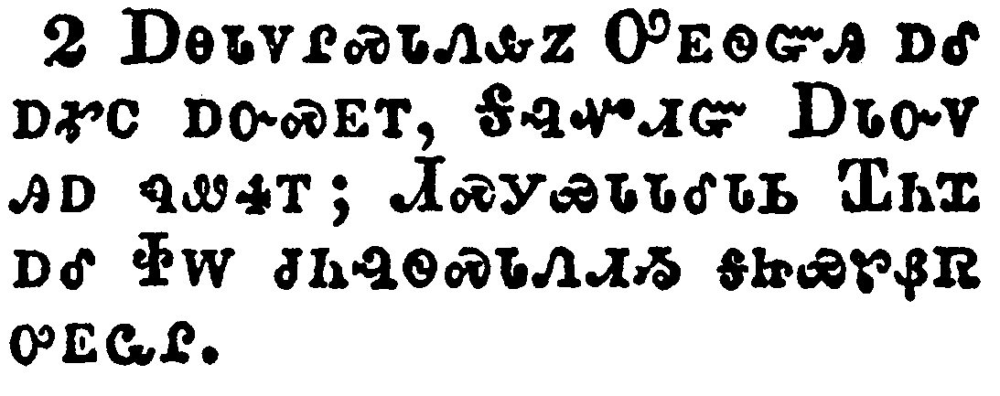</a></td>
</tr>
<tr class="even">
<td>As they ministered to the Lord, and fasted, the Holy Ghost said, Separate me Barnabas and Saul for the work whereunto I have called them.</td>
</tr>
<tr class="odd">
<td>ᎠᎾᏓᏙᎵᏍᏓᏁᎲᏃ ᎤᎬᏫᏳᎯ ᎠᎴ ᎠᎹᏟ ᎠᏅᏍᎬᎢ, ᎦᎸᏉᏗᏳ ᎠᏓᏅᏙ ᎯᎠ ᏄᏪᏎᎢ; ᏗᏍᎩᏯᏓᏓᎴᏓᏏ ᏆᏂᏆ ᎠᎴ ᏐᎳ ᏧᏂᎸᏫᏍᏓᏁᏗᏱ ᎦᏥᏯᏑᏰᏒ ᎤᎬᏩᎵ.</td>
</tr>
<tr class="even">
<td>A-na-da-do-li-s-da-ne-hv-no U-gv-wi-yu-hi a-le a-ma-tli a-nv-s-gv-i, Ga-lv-quo-di-yu A-da-nv-do hi-a nu-we-se-i; Di-s-gi-ya-da-da-le-da-si Qua-ni-qua a-le So-la tsu-ni-lv-wi-s-da-ne-di-yi ga-tsi-ya-su-ye-sv u-gv-wa-li.</td>
</tr>
</tbody>
</table>

<table>
<tbody>
<tr class="odd">
<td><a href="051303.png">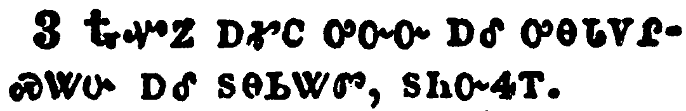</a></td>
</tr>
<tr class="even">
<td>And when they had fasted and prayed, and laid their hands on them, they sent them away.</td>
</tr>
<tr class="odd">
<td>ᎿᎭᏉᏃ ᎠᎹᏟ ᎤᏅᏅ ᎠᎴ ᎤᎾᏓᏙᎵᏍᏔᏅ ᎠᎴ ᏚᎾᏏᏔᏛ, ᏚᏂᏅᏎᎢ.</td>
</tr>
<tr class="even">
<td>Hna-quo-no a-ma-tli u-nv-nv a-le u-na-da-do-li-s-ta-nv a-le du-na-si-ta-dv, du-ni-nv-se-i.</td>
</tr>
</tbody>
</table>

<table>
<tbody>
<tr class="odd">
<td><a href="051304.png">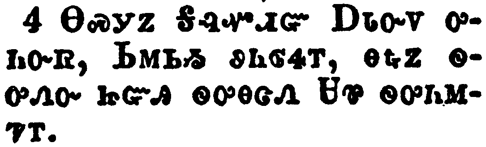</a></td>
</tr>
<tr class="even">
<td>So they, being sent forth by the Holy Ghost, departed unto Seleucia; and from thence they sailed to Cyprus.</td>
</tr>
<tr class="odd">
<td>ᎾᏍᎩᏃ ᎦᎸᏉᏗᏳ ᎠᏓᏅᏙ ᎤᏂᏅᏒ, ᏏᎷᏏᏱ ᏭᏂᎶᏎᎢ, ᎾᎿᎭᏃ ᏫᎤᏁᏅ ᏥᏳᎯ ᏫᎤᎾᏣᏁ ᏌᏈ ᏫᎤᏂᎷᏤᎢ.</td>
</tr>
<tr class="even">
<td>Na-s-gi-no Ga-lv-quo-di-yu A-da-nv-do u-ni-nv-sv, Si-lu-si-yi wu-ni-lo-se-i, na-hna-no wi-u-ne-nv tsi-yu-hi wi-u-na-tsa-ne Sa-qui wi-u-ni-lu-tse-i.</td>
</tr>
</tbody>
</table>

<table>
<tbody>
<tr class="odd">
<td><a href="051305.png">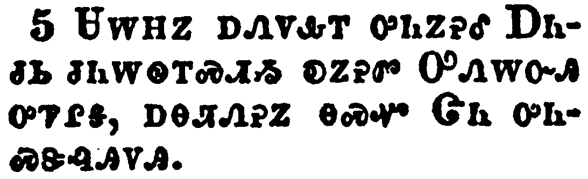</a></td>
</tr>
<tr class="even">
<td>And when they were at Salamis, they preached the word of God in the synagogues of the Jews: and they had also John to their minister.</td>
</tr>
<tr class="odd">
<td>ᏌᎳᎻᏃ ᎠᏁᏙᎲᎢ ᎤᏂᏃᎮᎴ ᎠᏂᏧᏏ ᏧᏂᎳᏫᎢᏍᏗᏱ ᎧᏃᎮᏛ ᎤᏁᎳᏅᎯ ᎤᏤᎵᎦ, ᎠᎾᏘᏁᎮᏃ ᎾᏍᏉ ᏣᏂ ᎤᏂᏍᏕᎸᎯᏙᎯ.</td>
</tr>
<tr class="even">
<td>Sa-la-mi-no a-ne-do-hv-i u-ni-no-he-le A-ni-tsu-si tsu-ni-la-wi-i-s-di-yi ka-no-he-dv U-ne-la-nv-hi u-tse-li-ga, a-na-ti-ne-he-no na-s-quo Tsa-ni u-ni-s-de-lv-hi-do-hi.</td>
</tr>
</tbody>
</table>

<table>
<tbody>
<tr class="odd">
<td></td>
</tr>
<tr class="even">
<td>And when they had gone through the isle unto Paphos, they found a certain sorcerer, a false prophet, a Jew, whose name was Bar-jesus:</td>
</tr>
<tr class="odd">
<td>ᎤᏂᎶᏐᏅᏃ ᏂᎬᎾᏛ ᎠᎹᏰᎵ ᎨᏒᎢ ᎨᏆ ᎢᏴᏛ, ᎾᎿᎭᎤᏂᏩᏛᎮ ᎩᎶ ᎢᏳᏍᏗ ᎠᏧᏏ ᏆᏥᏌ ᏧᏙᎢᏛ, ᎠᏙᏂᏍᎩ, ᎤᏠᎾᏍᏗ ᎠᏙᎴᎰᏍᎩ,</td>
</tr>
<tr class="even">
<td>U-ni-lo-so-nv-no ni-gv-na-dv a-ma-ye-li ge-sv-i Ge-qua i-yv-dv, na-hna u-ni-wa-dv-he gi-lo i-yu-s-di A-tsu-si Qua-tsi-sa tsu-do-i-dv, a-do-ni-s-gi, u-tlo-na-s-di a-do-le-ho-s-gi,</td>
</tr>
</tbody>
</table>

<table>
<tbody>
<tr class="odd">
<td><a href="051307.png">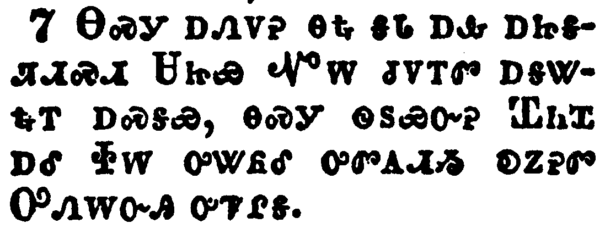</a></td>
</tr>
<tr class="even">
<td>Which was with the deputy of the country, Sergius Paulus, a prudent man; who called for Barnabas and Saul, and desired to hear the word of God.</td>
</tr>
<tr class="odd">
<td>ᎾᏍᎩ ᎠᏁᏙᎮ ᎾᎿᎭᎦᏓ ᎠᎲ ᎠᏥᎦᏘᏗᏍᏗ ᏌᏥᏯ ᏉᎳ ᏧᏙᎢᏛ ᎠᎦᏔᎿᎭᎢ ᎠᏍᎦᏯ, ᎾᏍᎩ ᏫᏚᏯᏅᎮ ᏆᏂᏆ ᎠᎴ ᏐᎳ ᎤᏔᏲᎴ ᎤᏛᎪᏗᏱ ᎧᏃᎮᏛ ᎤᏁᎳᏅᎯ ᎤᏤᎵᎦ.</td>
</tr>
<tr class="even">
<td>Na-s-gi a-ne-do-he na-hna ga-da a-hv a-tsi-ga-ti-di-s-di Sa-tsi-ya Quo-la tsu-do-i-dv a-ga-ta-hna-i a-s-ga-ya, na-s-gi wi-du-ya-nv-he Qua-ni-qua a-le So-la u-ta-yo-le u-dv-go-di-yi ka-no-he-dv U-ne-la-nv-hi u-tse-li-ga.</td>
</tr>
</tbody>
</table>

<table>
<tbody>
<tr class="odd">
<td><a href="051308.png">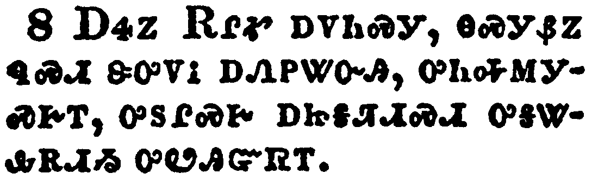</a></td>
</tr>
<tr class="even">
<td>But Elymas the sorcerer (for so is his name by interpretation) withstood them, seeking to turn away the deputy from the faith.</td>
</tr>
<tr class="odd">
<td>ᎠᏎᏃ ᎡᎵᏑ ᎠᏙᏂᏍᎩ, ᎾᏍᎩᏰᏃ ᏄᏍᏗ ᏕᎤᏙᎥ ᎠᏁᏢᏔᏅᎯ, ᎤᏂᎭᎷᎩᏍᎨᎢ, ᎤᏚᎵᏍᎨ ᎠᏥᎦᏘᏗᏍᏗ ᎤᎦᏔᎲᎡᏗᏱ ᎤᏬᎯᏳᏒᎢ.</td>
</tr>
<tr class="even">
<td>A-se-no E-li-su a-do-ni-s-gi, na-s-gi-ye-no nu-s-di de-u-do-v a-ne-tlv-ta-nv-hi, u-ni-ha-lu-gi-s-ge-i, u-du-li-s-ge a-tsi-ga-ti-di-s-di u-ga-ta-hv-e-di-yi u-wo-hi-yu-sv-i.</td>
</tr>
</tbody>
</table>

<table>
<tbody>
<tr class="odd">
<td><a href="051309.png">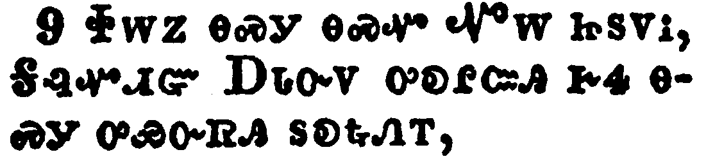</a></td>
</tr>
<tr class="even">
<td>Then Saul, (who also is called Paul,) filled with the Holy Ghost, set his eyes on him,</td>
</tr>
<tr class="odd">
<td>ᏐᎳᏃ ᎾᏍᎩ ᎾᏍᏉ ᏉᎳ ᏥᏚᏙᎥ, ᎦᎸᏉᏗᏳ ᎠᏓᏅᏙ ᎤᎧᎵᏨᎯ ᎨᏎ ᎾᏍᎩ ᎤᏯᏅᏒᎯ ᏚᎧᎿᎭᏁᎢ,</td>
</tr>
<tr class="even">
<td>So-la-no na-s-gi na-s-quo Quo-la tsi-du-do-v, Ga-lv-quo-di-yu A-da-nv-do u-ka-li-tsv-hi ge-se na-s-gi u-ya-nv-sv-hi du-ka-hna-ne-i,</td>
</tr>
</tbody>
</table>

<table>
<tbody>
<tr class="odd">
<td><a href="051310.png">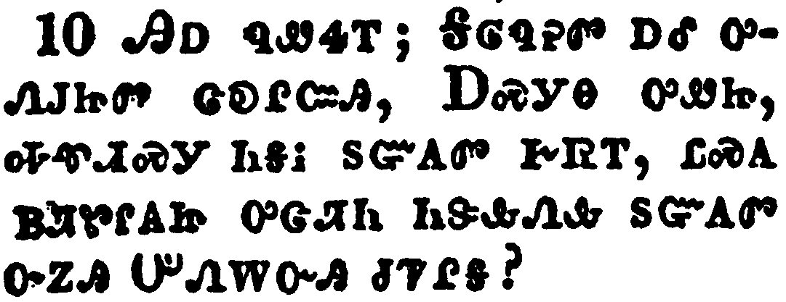</a></td>
</tr>
<tr class="even">
<td>And said, O full of all subtilty and all mischief, thou child of the devil, thou enemy of all righteousness, wilt thou not cease to pervert the right ways of the Lord?</td>
</tr>
<tr class="odd">
<td>ᎯᎠ ᏄᏪᏎᎢ; ᎦᎶᏄᎮᏛ ᎠᎴ ᎤᏁᎫᏥᏛ ᏣᎧᎵᏨᎯ, ᎠᏍᎩᎾ ᎤᏪᏥ, ᎭᏡᏗᏍᎩ ᏂᎦᎥ ᏚᏳᎪᏛ ᎨᏒᎢ, ᏝᏍᎪ ᏴᏘᏑᎵᎪᏥ ᎤᏣᏘᏂ ᏂᏕᎲᏁᎲ ᏚᏳᎪᏛ ᏅᏃᎯ ᎤᏁᎳᏅᎯ ᏧᏤᎵᎦ?</td>
</tr>
<tr class="even">
<td>Hi-a nu-we-se-i; Ga-lo-nu-he-dv a-le u-ne-gu-tsi-dv tsa-ka-li-tsv-hi, A-s-gi-na u-we-tsi, ha-tlu-di-s-gi ni-ga-v du-yu-go-dv ge-sv-i, tla-s-go yv-ti-su-li-go-tsi u-tsa-ti-ni ni-de-hv-ne-hv du-yu-go-dv nv-no-hi U-ne-la-nv-hi tsu-tse-li-ga?</td>
</tr>
</tbody>
</table>

<table>
<tbody>
<tr class="odd">
<td></td>
</tr>
<tr class="even">
<td>And now, behold, the hand of the Lord is upon thee, and thou shalt be blind, not seeing the sun for a season. And immediately there fell on him a mist and a darkness; and he went about seeking some to lead him by the hand.</td>
</tr>
<tr class="odd">
<td>Ꭷ ᎬᏂᏳᏉ ᎤᎬᏫᏳᎯ ᏣᏏᏔᏓ, ᎠᎴ ᏙᏘᎨᏩᏥ ᎥᏝ ᏱᎪᏩᏘᏍᎨᏍᏗ ᏅᏙ ᎢᎸᏍᎩ ᎢᎪᎯᏛ. ᎩᎳᏉᏃ ᎢᏴᏛ ᎤᎵᏏᎩ ᎤᏭᏢᏁᎢ, ᎠᎴ ᎡᏙᎮ ᏚᏲᎮ ᎩᎶ ᎬᏬᏱᏂᏙᎯ.</td>
</tr>
<tr class="even">
<td>Ka gv-ni-yu-quo U-gv-wi-yu-hi tsa-si-ta-da, a-le do-ti-ge-wa-tsi v-tla yi-go-wa-ti-s-ge-s-di nv-do i-lv-s-gi i-go-hi-dv. Gi-la-quo-no i-yv-dv u-li-si-gi u-wu-tlv-ne-i, a-le e-do-he du-yo-he gi-lo gv-wo-yi-ni-do-hi.</td>
</tr>
</tbody>
</table>

<table>
<tbody>
<tr class="odd">
<td><a href="051312.png">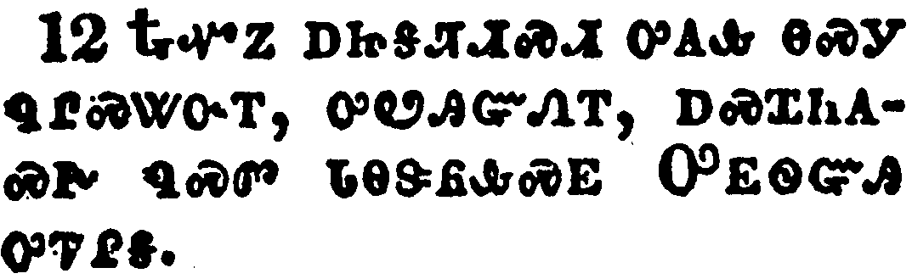</a></td>
</tr>
<tr class="even">
<td>Then the deputy, when he saw what was done, believed, being astonished at the doctrine of the Lord.</td>
</tr>
<tr class="odd">
<td>ᎿᎭᏉᏃ ᎠᏥᎦᏘᏗᏍᏗ ᎤᎪᎲ ᎾᏍᎩ ᏄᎵᏍᏔᏅᎢ, ᎤᏬᎯᏳᏁᎢ, ᎠᏍᏆᏂᎪᏍᎨ ᏄᏍᏛ ᏓᎾᏕᏲᎲᏍᎬ ᎤᎬᏫᏳᎯ ᎤᏤᎵᎦ.</td>
</tr>
<tr class="even">
<td>Hna-quo-no a-tsi-ga-ti-di-s-di u-go-hv na-s-gi nu-li-s-ta-nv-i, u-wo-hi-yu-ne-i, a-s-qua-ni-go-s-ge nu-s-dv da-na-de-yo-hv-s-gv U-gv-wi-yu-hi u-tse-li-ga.</td>
</tr>
</tbody>
</table>

<table>
<tbody>
<tr class="odd">
<td><a href="051313.png">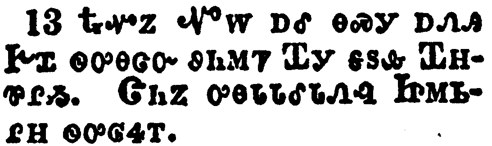</a></td>
</tr>
<tr class="even">
<td>Now when Paul and his company loosed from Paphos, they came to Perga in Pamphylia: and John departing from them returned to Jerusalem.</td>
</tr>
<tr class="odd">
<td>ᎿᎭᏉᏃ ᏉᎳ ᎠᎴ ᎾᏍᎩ ᎠᏁᎯ ᎨᏆ ᏫᎤᎾᏣᏅ ᏭᏂᎷᏤ ᏆᎩ ᎦᏚᎲ ᏆᎻᏈᎵᏱ. ᏣᏂᏃ ᎤᎾᏓᏓᎴᏓᏁᎸ ᏥᎷᏏᎵᎻ ᏫᎤᎶᏎᎢ.</td>
</tr>
<tr class="even">
<td>Hna-quo-no Quo-la a-le na-s-gi a-ne-hi Ge-qua wi-u-na-tsa-nv wu-ni-lu-tse Qua-gi ga-du-hv Qua-mi-qui-li-yi. Tsa-ni-no u-na-da-da-le-da-ne-lv Tsi-lu-si-li-mi wi-u-lo-se-i.</td>
</tr>
</tbody>
</table>

<table>
<tbody>
<tr class="odd">
<td><a href="051314.png">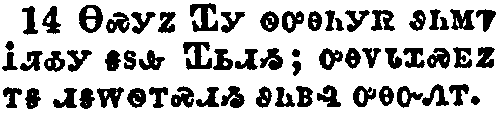</a></td>
</tr>
<tr class="even">
<td>But when they departed from Perga, they came to Antioch in Pisidia, and went into the synagogue on the sabbath day, and sat down.</td>
</tr>
<tr class="odd">
<td>ᎾᏍᎩᏃ ᏆᎩ ᏫᎤᎾᏂᎩᏒ ᏭᏂᎷᏤ ᎥᏘᎣᎩ ᎦᏚᎲ ᏆᏏᏗᏱ; ᎤᎾᏙᏓᏆᏍᎬᏃ ᎢᎦ ᏗᎦᎳᏫᎢᏍᏗᏱ ᏭᏂᏴᎸ ᎤᎾᏅᏁᎢ.</td>
</tr>
<tr class="even">
<td>Na-s-gi-no Qua-gi wi-u-na-ni-gi-sv wu-ni-lu-tse V-ti-o-gi ga-du-hv Qua-si-di-yi; u-na-do-da-qua-s-gv-no i-ga di-ga-la-wi-i-s-di-yi wu-ni-yv-lv u-na-nv-ne-i.</td>
</tr>
</tbody>
</table>

<table>
<tbody>
<tr class="odd">
<td><a href="051315.png">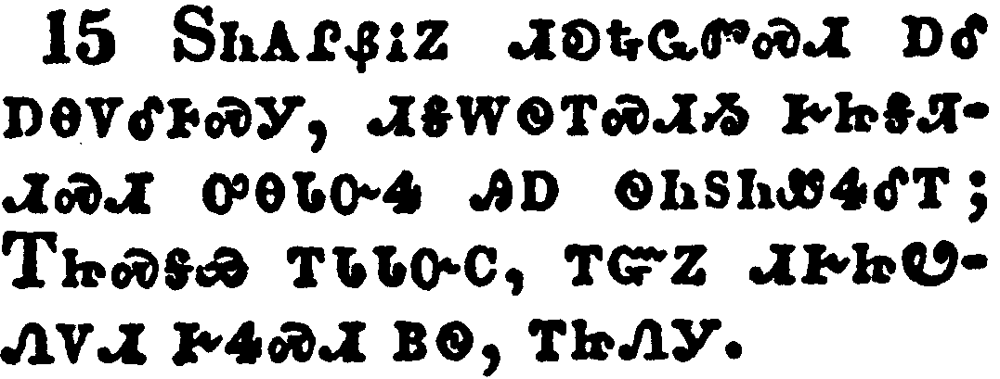</a></td>
</tr>
<tr class="even">
<td>And after the reading of the law and the prophets the rulers of the synagogue sent unto them, saying, Ye men and brethren, if ye have any word of exhortation for the people, say on.</td>
</tr>
<tr class="odd">
<td>ᏚᏂᎪᎵᏰᎥᏃ ᏗᎧᎿᎭᏩᏛᏍᏗ ᎠᎴ ᎠᎾᏙᎴᎰᏍᎩ, ᏗᎦᎳᏫᎢᏍᏗᏱ ᎨᏥᎦᏘᏗᏍᏗ ᎤᎾᏓᏅᏎ ᎯᎠ ᏫᏂᏚᏂᏪᏎᎴᎢ; ᎢᏥᏍᎦᏯ ᎢᏓᏓᏅᏟ, ᎢᏳᏃ ᏗᎨᏥᏬᏁᏙᏗ ᎨᏎᏍᏗ ᏴᏫ, ᎢᏥᏁᎩ.</td>
</tr>
<tr class="even">
<td>Du-ni-go-li-ye-v-no di-ka-hna-wa-dv-s-di a-le a-na-do-le-ho-s-gi, di-ga-la-wi-i-s-di-yi ge-tsi-ga-ti-di-s-di u-na-da-nv-se hi-a wi-ni-du-ni-we-se-le-i; I-tsi-s-ga-ya i-da-da-nv-tli, i-yu-no di-ge-tsi-wo-ne-do-di ge-se-s-di yv-wi, i-tsi-ne-gi.</td>
</tr>
</tbody>
</table>

<table>
<tbody>
<tr class="odd">
<td><a href="051316.png">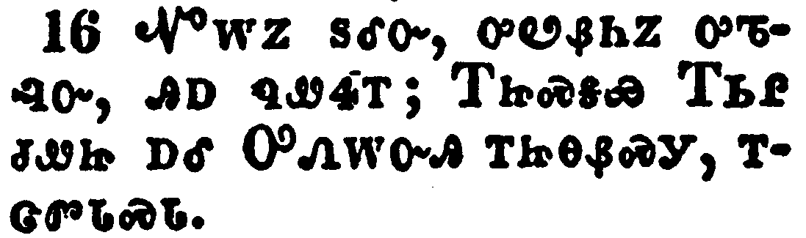</a></td>
</tr>
<tr class="even">
<td>Then Paul stood up, and beckoning with his hand said, Men of Israel, and ye that fear God, give audience.</td>
</tr>
<tr class="odd">
<td>ᏉᎳᏃ ᏚᎴᏅ, ᎤᏬᏰᏂᏃ ᎤᏖᎸᏅ, ᎯᎠ ᏄᏪᏎᎢ; ᎢᏥᏍᎦᏯ ᎢᏏᎵ ᏧᏪᏥ ᎠᎴ ᎤᏁᎳᏅᎯ ᎢᏥᎾᏰᏍᎩ, ᎢᏣᏛᏓᏍᏓ.</td>
</tr>
<tr class="even">
<td>Quo-la-no du-le-nv, u-wo-ye-ni-no u-te-lv-nv, hi-a nu-we-se-i; I-tsi-s-ga-ya I-si-li tsu-we-tsi a-le U-ne-la-nv-hi i-tsi-na-ye-s-gi, i-tsa-dv-da-s-da.</td>
</tr>
</tbody>
</table>

<table>
<tbody>
<tr class="odd">
<td><a href="051317.png">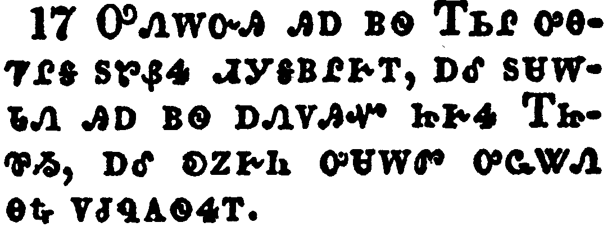</a></td>
</tr>
<tr class="even">
<td>The God of this people of Israel chose our fathers, and exalted the people when they dwelt as strangers in the land of Egypt, and with an high arm brought he them out of it.</td>
</tr>
<tr class="odd">
<td>ᎤᏁᎳᏅᎯ ᎯᎠ ᏴᏫ ᎢᏏᎵ ᎤᎾᏤᎵᎦ ᏚᏑᏰᏎ ᏗᎩᎦᏴᎵᎨᎢ, ᎠᎴ ᏚᏌᎳᏓᏁ ᎯᎠ ᏴᏫ ᎠᏁᏙᎯᏉ ᏥᎨᏎ ᎢᏥᏈᏱ, ᎠᎴ ᎧᏃᎨᏂ ᎤᏌᎳᏛ ᎤᏩᏔᏁ ᎾᎿᎭᏙᏧᏄᎪᏫᏎᎢ.</td>
</tr>
<tr class="even">
<td>U-ne-la-nv-hi hi-a yv-wi I-si-li u-na-tse-li-ga du-su-ye-se di-gi-ga-yv-li-ge-i, a-le du-sa-la-da-ne hi-a yv-wi a-ne-do-hi-quo tsi-ge-se I-tsi-qui-yi, a-le ka-no-ge-ni u-sa-la-dv u-wa-ta-ne na-hna do-tsu-nu-go-wi-se-i.</td>
</tr>
</tbody>
</table>

<table>
<tbody>
<tr class="odd">
<td><a href="051318.png">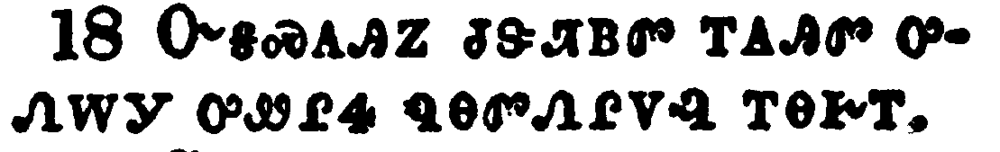</a></td>
</tr>
<tr class="even">
<td>And about the time of forty years suffered he their manners in the wilderness.</td>
</tr>
<tr class="odd">
<td>ᏅᎦᏍᎪᎯᏃ ᏧᏕᏘᏴᏛ ᎢᎪᎯᏛ ᎤᏁᎳᎩ ᎤᏪᎵᏎ ᏄᎾᏛᏁᎵᏙᎸ ᎢᎾᎨᎢ.</td>
</tr>
<tr class="even">
<td>Nv-ga-s-go-hi-no tsu-de-ti-yv-dv i-go-hi-dv u-ne-la-gi u-we-li-se nu-na-dv-ne-li-do-lv i-na-ge-i.</td>
</tr>
</tbody>
</table>

<table>
<tbody>
<tr class="odd">
<td><a href="051319.png">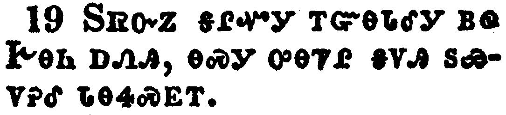</a></td>
</tr>
<tr class="even">
<td>And when he had destroyed seven nations in the land of Chanaan, he divided their land to them by lot.</td>
</tr>
<tr class="odd">
<td>ᏚᏒᏅᏃ ᎦᎵᏉᎩ ᎢᏳᎾᏓᎴᎩ ᏴᏫ ᎨᎾᏂ ᎠᏁᎯ, ᎾᏍᎩ ᎤᎾᏤᎵ ᎦᏙᎯ ᏚᏯᏙᎮᎴ ᏓᎾᏎᏍᎬᎢ.</td>
</tr>
<tr class="even">
<td>Du-sv-nv-no ga-li-quo-gi i-yu-na-da-le-gi yv-wi Ge-na-ni a-ne-hi, na-s-gi u-na-tse-li ga-do-hi du-ya-do-he-le da-na-se-s-gv-i.</td>
</tr>
</tbody>
</table>

<table>
<tbody>
<tr class="odd">
<td><a href="051320.png">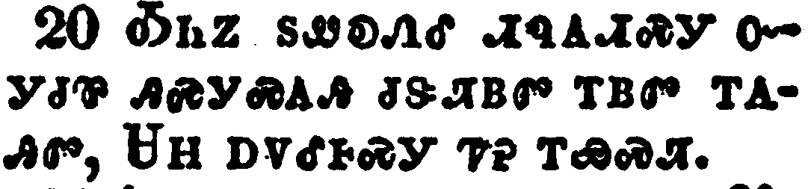</a></td>
</tr>
<tr class="even">
<td>And after that he gave unto them judges about the space of four hundred and fifty years, until Samuel the prophet.</td>
</tr>
<tr class="odd">
<td>ᎣᏂᏃ ᏚᏪᎧᏁᎴ ᏗᏄᎪᏗᏍᎩ ᏅᎩᏧᏈ ᎯᏍᎩᏍᎪᎯ ᏧᏕᏘᏴᏛ ᎢᏴᏛ ᎢᎪᎯᏛ, ᏌᎻ ᎠᏙᎴᎰᏍᎩ ᏤᎮ ᎢᏯᏍᏘ.</td>
</tr>
<tr class="even">
<td>O-ni-no du-we-ka-ne-le di-nu-go-di-s-gi nv-gi-tsu-qui hi-s-gi-s-go-hi tsu-de-ti-yv-dv i-yv-dv i-go-hi-dv, Sa-mi a-do-le-ho-s-gi tse-he i-ya-s-ti.</td>
</tr>
</tbody>
</table>

<table>
<tbody>
<tr class="odd">
<td><a href="051321.png">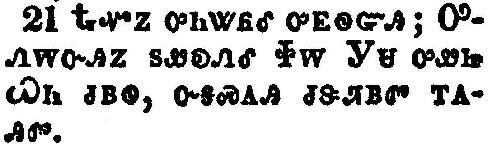</a></td>
</tr>
<tr class="even">
<td>And afterward they desired a king: and God gave unto them Saul the son of Cis, a man of the tribe of Benjamin, by the space of forty years.</td>
</tr>
<tr class="odd">
<td>ᎿᎭᏉᏃ ᎤᏂᏔᏲᎴ ᎤᎬᏫᏳᎯ; ᎤᏁᎳᏅᎯᏃ ᏚᏪᎧᏁᎴ ᏐᎳ ᎩᏌ ᎤᏪᏥ ᏇᏂ ᏧᏴᏫ, ᏅᎦᏍᎪᎯ ᏧᏕᏘᏴᏛ ᎢᎪᎯᏛ.</td>
</tr>
<tr class="even">
<td>Hna-quo-no u-ni-ta-yo-le u-gv-wi-yu-hi; U-ne-la-nv-hi-no du-we-ka-ne-le So-la Gi-sa u-we-tsi Que-ni tsu-yv-wi, nv-ga-s-go-hi tsu-de-ti-yv-dv i-go-hi-dv.</td>
</tr>
</tbody>
</table>

<table>
<tbody>
<tr class="odd">
<td><a href="051322.png">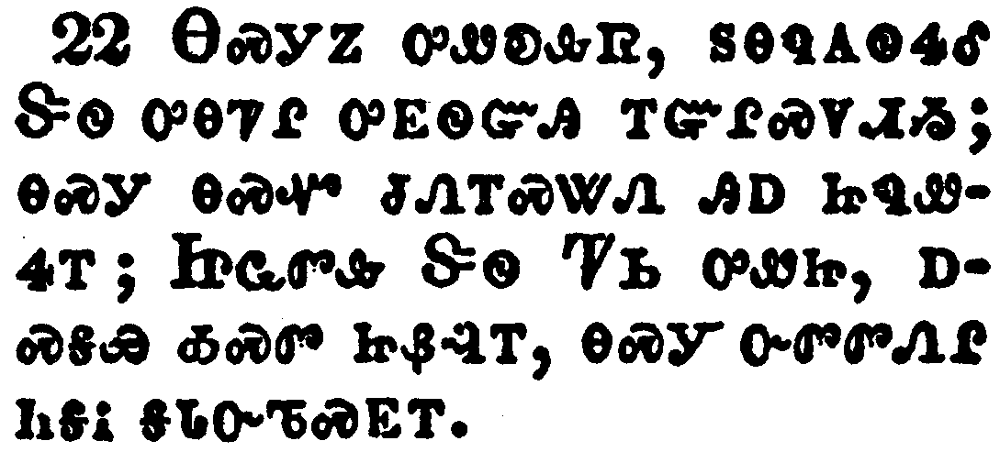</a></td>
</tr>
<tr class="even">
<td>And when he had removed him, he raised up unto them David to be their king; to whom also he gave testimony, and said, I have found David the son of Jesse, a man after mine own heart, which shall fulfill all my will.</td>
</tr>
<tr class="odd">
<td>ᎾᏍᎩᏃ ᎤᏪᎧᎲᏒ, ᏚᎾᏄᎪᏫᏎᎴ ᏕᏫ ᎤᎾᏤᎵ ᎤᎬᏫᏳᎯ ᎢᏳᎵᏍᏙᏗᏱ; ᎾᏍᎩ ᎾᏍᏉ ᏧᏁᎢᏍᏔᏁ ᎯᎠ ᏥᏄᏪᏎᎢ; ᏥᏩᏛᎲ ᏕᏫ ᏤᏏ ᎤᏪᏥ, ᎠᏍᎦᏯ ᎣᏍᏛ ᏥᏰᎸᎢ, ᎾᏍᎩ ᏅᏛᏛᏁᎵ ᏂᎦᎥ ᎦᏓᏅᏖᏍᎬᎢ.</td>
</tr>
<tr class="even">
<td>Na-s-gi-no u-we-ka-hv-sv, du-na-nu-go-wi-se-le De-wi u-na-tse-li u-gv-wi-yu-hi i-yu-li-s-do-di-yi; na-s-gi na-s-quo tsu-ne-i-s-ta-ne hi-a tsi-nu-we-se-i; Tsi-wa-dv-hv De-wi Tse-si u-we-tsi, a-s-ga-ya o-s-dv tsi-ye-lv-i, na-s-gi nv-dv-dv-ne-li ni-ga-v ga-da-nv-te-s-gv-i.</td>
</tr>
</tbody>
</table>

<table>
<tbody>
<tr class="odd">
<td><a href="051323.png">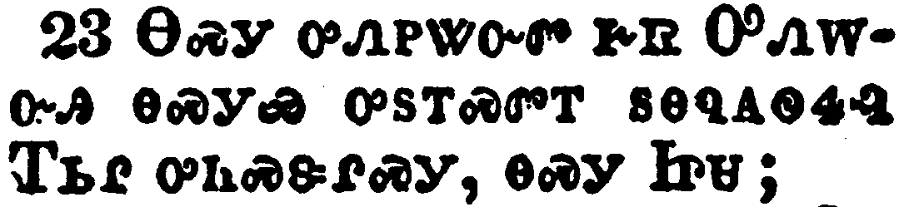</a></td>
</tr>
<tr class="even">
<td>Of this man's seed hath God according to his promise raised unto Israel a Saviour, Jesus:</td>
</tr>
<tr class="odd">
<td>ᎾᏍᎩ ᎤᏁᏢᏔᏅᏛ ᎨᏒ ᎤᏁᎳᏅᎯ ᎾᏍᎩᏯ ᎤᏚᎢᏍᏛᎢ ᏚᎾᏄᎪᏫᏎᎸ ᎢᏏᎵ ᎤᏂᏍᏕᎵᏍᎩ, ᎾᏍᎩ ᏥᏌ;</td>
</tr>
<tr class="even">
<td>Na-s-gi u-ne-tlv-ta-nv-dv ge-sv U-ne-la-nv-hi na-s-gi-ya u-du-i-s-dv-i du-na-nu-go-wi-se-lv I-si-li u-ni-s-de-li-s-gi, na-s-gi Tsi-sa;</td>
</tr>
</tbody>
</table>

<table>
<tbody>
<tr class="odd">
<td><a href="051324.png">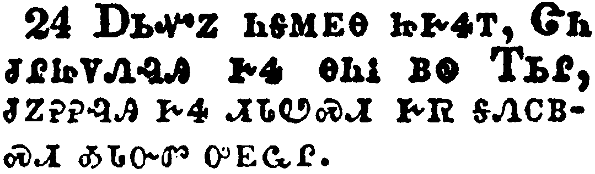</a></td>
</tr>
<tr class="even">
<td>When John had first preached before his coming the baptism of repentance to all the people of Israel.</td>
</tr>
<tr class="odd">
<td>ᎠᏏᏉᏃ ᏂᎦᎷᎬᎾ ᏥᎨᏎᎢ, ᏣᏂ ᏧᎵᏥᏙᏁᎸᎯ ᎨᏎ ᎾᏂᎥ ᏴᏫ ᎢᏏᎵ, ᏧᏃᎮᎮᎸᎯ ᎨᏎ ᏗᏓᏬᏍᏗ ᎨᏒ ᎦᏁᏟᏴᏍᏗ ᎣᏓᏅᏛ ᎤᎬᏩᎵ.</td>
</tr>
<tr class="even">
<td>A-si-quo-no ni-ga-lu-gv-na tsi-ge-se-i, Tsa-ni tsu-li-tsi-do-ne-lv-hi ge-se na-ni-v yv-wi I-si-li, tsu-no-he-he-lv-hi ge-se di-da-wo-s-di ge-sv ga-ne-tli-yv-s-di o-da-nv-dv u-gv-wa-li.</td>
</tr>
</tbody>
</table>

<table>
<tbody>
<tr class="odd">
<td><a href="051325.png">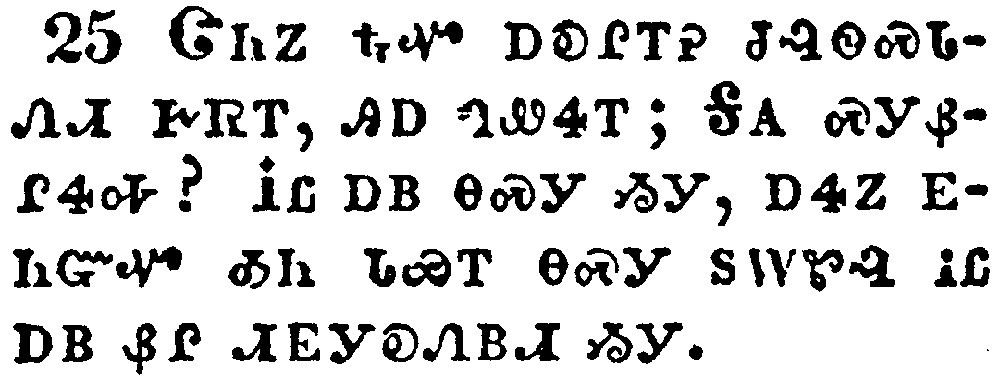</a></td>
</tr>
<tr class="even">
<td>And as John fulfilled his course, he said, Whom think ye that I am? I am not he. But, behold, there cometh one after me, whose shoes of his feet I am not worthy to loose.</td>
</tr>
<tr class="odd">
<td>ᏣᏂᏃ ᎿᎭᏉ ᎠᎧᎵᎢᎮ ᏧᎸᏫᏍᏓᏁᏗ ᎨᏒᎢ, ᎯᎠ ᏄᏪᏎᎢ; ᎦᎪ ᏍᎩᏰᎵᏎᎭ? ᎥᏝ ᎠᏴ ᎾᏍᎩ ᏱᎩ, ᎠᏎᏃ ᎬᏂᏳᏉ ᎣᏂ ᏓᏯᎢ ᎾᏍᎩ ᏚᎳᏑᎸ ᎥᏝ ᎠᏴ ᏰᎵ ᏗᎬᎩᎧᏁᏴᏗ ᏱᎩ.</td>
</tr>
<tr class="even">
<td>Tsa-ni-no hna-quo a-ka-li-i-he tsu-lv-wi-s-da-ne-di ge-sv-i, hi-a nu-we-se-i; Ga-go s-gi-ye-li-se-ha? V-tla a-yv na-s-gi yi-gi, a-se-no gv-ni-yu-quo o-ni da-ya-i na-s-gi du-la-su-lv v-tla a-yv ye-li di-gv-gi-ka-ne-yv-di yi-gi.</td>
</tr>
</tbody>
</table>

<table>
<tbody>
<tr class="odd">
<td><a href="051326.png">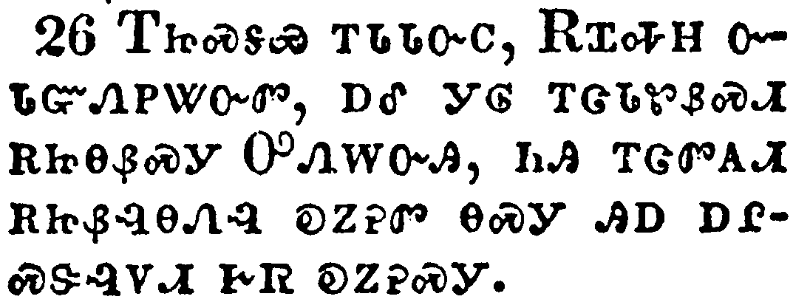</a></td>
</tr>
<tr class="even">
<td>Men and brethren, children of the stock of Abraham, and whosoever among you feareth God, to you is the word of this salvation sent.</td>
</tr>
<tr class="odd">
<td>ᎢᏥᏍᎦᏯ ᎢᏓᏓᏅᏟ, ᎡᏆᎭᎻ ᏅᏓᏳᏁᏢᏔᏅᏛ, ᎠᎴ ᎩᎶ ᎢᏣᏓᏑᏰᏍᏗ ᎡᏥᎾᏰᏍᎩ ᎤᏁᎳᏅᎯ, ᏂᎯ ᎢᏣᏛᎪᏗ ᎡᏥᏰᎸᎾᏁᎸ ᎧᏃᎮᏛ ᎾᏍᎩ ᎯᎠ ᎠᎵᏍᏕᎸᏙᏗ ᎨᏒ ᎧᏃᎮᏍᎩ.</td>
</tr>
<tr class="even">
<td>I-tsi-s-ga-ya i-da-da-nv-tli, E-qua-ha-mi nv-da-yu-ne-tlv-ta-nv-dv, a-le gi-lo i-tsa-da-su-ye-s-di e-tsi-na-ye-s-gi U-ne-la-nv-hi, ni-hi i-tsa-dv-go-di e-tsi-ye-lv-na-ne-lv ka-no-he-dv na-s-gi hi-a a-li-s-de-lv-do-di ge-sv ka-no-he-s-gi.</td>
</tr>
</tbody>
</table>

<table>
<tbody>
<tr class="odd">
<td><a href="051327.png">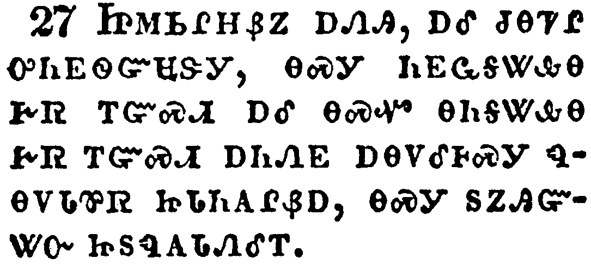</a></td>
</tr>
<tr class="even">
<td>For they that dwell at Jerusalem, and their rulers, because they knew him not, nor yet the voices of the prophets which are read every sabbath day, they have fulfilled them in condemning him.</td>
</tr>
<tr class="odd">
<td>ᏥᎷᏏᎵᎻᏰᏃ ᎠᏁᎯ, ᎠᎴ ᏧᎾᏤᎵ ᎤᏂᎬᏫᏳᏌᏕᎩ, ᎾᏍᎩ ᏂᎬᏩᎦᏔᎲᎾ ᎨᏒ ᎢᏳᏍᏗ ᎠᎴ ᎾᏍᏉ ᎾᏂᎦᏔᎲᎾ ᎨᏒ ᎢᏳᏍᏗ ᎠᏂᏁᎬ ᎠᎾᏙᎴᎰᏍᎩ ᏄᎾᏙᏓᏈᏒ ᏥᏓᏂᎪᎵᏰᎠ, ᎾᏍᎩ ᏚᏃᎯᏳᏔᏅ ᏥᏚᏄᎪᏓᏁᎴᎢ.</td>
</tr>
<tr class="even">
<td>Tsi-lu-si-li-mi-ye-no a-ne-hi, a-le tsu-na-tse-li u-ni-gv-wi-yu-sa-de-gi, na-s-gi ni-gv-wa-ga-ta-hv-na ge-sv i-yu-s-di a-le na-s-quo na-ni-ga-ta-hv-na ge-sv i-yu-s-di a-ni-ne-gv a-na-do-le-ho-s-gi nu-na-do-da-qui-sv tsi-da-ni-go-li-ye-a, na-s-gi du-no-hi-yu-ta-nv tsi-du-nu-go-da-ne-le-i.</td>
</tr>
</tbody>
</table>

<table>
<tbody>
<tr class="odd">
<td><a href="051328.png">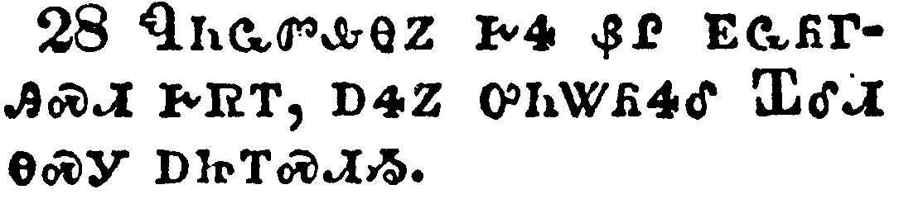</a></td>
</tr>
<tr class="even">
<td>And though they found no cause of death in him, yet desired they Pilate that he should be slain.</td>
</tr>
<tr class="odd">
<td>ᏄᏂᏩᏛᎲᎾᏃ ᎨᏎ ᏰᎵ ᎬᏩᏲᎱᎯᏍᏗ ᎨᏒᎢ, ᎠᏎᏃ ᎤᏂᏔᏲᏎᎴ ᏆᎴᏗ ᎾᏍᎩ ᎠᏥᎢᏍᏗᏱ.</td>
</tr>
<tr class="even">
<td>Nu-ni-wa-dv-hv-na-no ge-se ye-li gv-wa-yo-hu-hi-s-di ge-sv-i, a-se-no u-ni-ta-yo-se-le Qua-le-di na-s-gi a-tsi-i-s-di-yi.</td>
</tr>
</tbody>
</table>

<table>
<tbody>
<tr class="odd">
<td><a href="051329.png">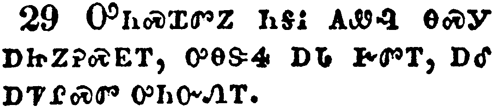</a></td>
</tr>
<tr class="even">
<td>And when they had fulfilled all that was written of him, they took him down from the tree, and laid him in a sepulchre.</td>
</tr>
<tr class="odd">
<td>ᎤᏂᏍᏆᏛᏃ ᏂᎦᎥ ᎪᏪᎸ ᎾᏍᎩ ᎠᏥᏃᎮᏍᎬᎢ, ᎤᎾᏕᏎ ᎠᏓ ᎨᏛᎢ, ᎠᎴ ᎠᏤᎵᏍᏛ ᎤᏂᏅᏁᎢ.</td>
</tr>
<tr class="even">
<td>U-ni-s-qua-dv-no ni-ga-v go-we-lv na-s-gi a-tsi-no-he-s-gv-i, u-na-de-se a-da ge-dv-i, a-le a-tse-li-s-dv u-ni-nv-ne-i.</td>
</tr>
</tbody>
</table>

<table>
<tbody>
<tr class="odd">
<td><a href="051330.png">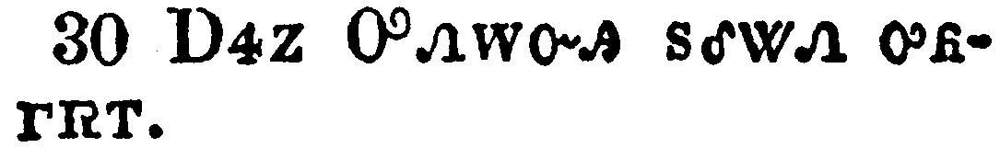</a></td>
</tr>
<tr class="even">
<td>But God raised him from the dead:</td>
</tr>
<tr class="odd">
<td>ᎠᏎᏃ ᎤᏁᎳᏅᎯ ᏚᎴᏔᏁ ᎤᏲᎱᏒᎢ.</td>
</tr>
<tr class="even">
<td>A-se-no U-ne-la-nv-hi du-le-ta-ne u-yo-hu-sv-i.</td>
</tr>
</tbody>
</table>

<table>
<tbody>
<tr class="odd">
<td><a href="051331.png">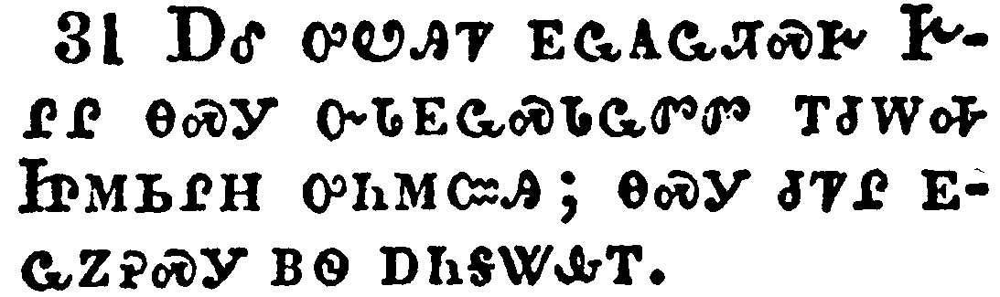</a></td>
</tr>
<tr class="even">
<td>And he was seen many days of them which came up with him from Galilee to Jerusalem, who are his witnesses unto the people.</td>
</tr>
<tr class="odd">
<td>ᎠᎴ ᎤᏬᎯᏤ ᎬᏩᎪᏩᏘᏍᎨ ᎨᎵᎵ ᎾᏍᎩ ᏅᏓᎬᏩᏍᏓᏩᏛᏛ ᎢᏧᎳᎭ ᏥᎷᏏᎵᎻ ᎤᏂᎷᏨᎯ; ᎾᏍᎩ ᏧᏤᎵ ᎬᏩᏃᎮᏍᎩ ᏴᏫ ᎠᏂᎦᏔᎲᎢ.</td>
</tr>
<tr class="even">
<td>A-le u-wo-hi-tse gv-wa-go-wa-ti-s-ge Ge-li-li na-s-gi nv-da-gv-wa-s-da-wa-dv-dv i-tsu-la-ha Tsi-lu-si-li-mi u-ni-lu-tsv-hi; na-s-gi tsu-tse-li gv-wa-no-he-s-gi yv-wi a-ni-ga-ta-hv-i.</td>
</tr>
</tbody>
</table>

<table>
<tbody>
<tr class="odd">
<td><a href="051332.png">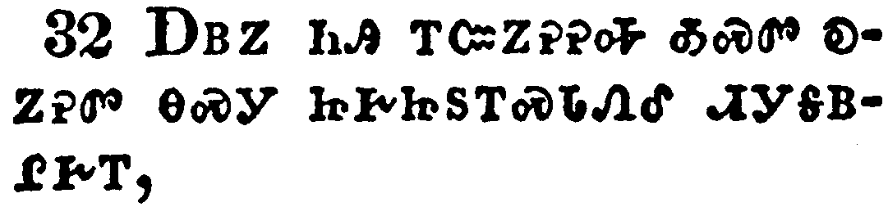</a></td>
</tr>
<tr class="even">
<td>And we declare unto you glad tidings, how that the promise which was made unto the fathers,</td>
</tr>
<tr class="odd">
<td>ᎠᏎᏃ ᏂᎯ ᎢᏨᏃᎮᎮᎭ ᎣᏍᏛ ᎧᏃᎮᏛ ᎾᏍᎩ ᏥᎨᏥᏚᎢᏍᏓᏁᎴ ᏗᎩᎦᏴᎵᎨᎢ,</td>
</tr>
<tr class="even">
<td>A-se-no ni-hi i-tsv-no-he-he-ha o-s-dv ka-no-he-dv na-s-gi tsi-ge-tsi-du-i-s-da-ne-le di-gi-ga-yv-li-ge-i,</td>
</tr>
</tbody>
</table>

<table>
<tbody>
<tr class="odd">
<td><a href="051333.png">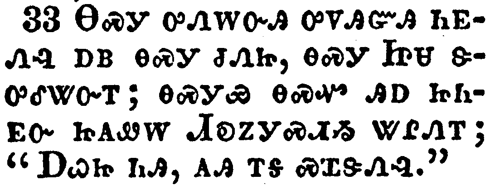</a></td>
</tr>
<tr class="even">
<td>God hath fulfilled the same unto us their children, in that he hath raised up Jesus again; as it is also written in the second psalm, Thou art my Son, this day have I begotten thee.</td>
</tr>
<tr class="odd">
<td>ᎾᏍᎩ ᎤᏁᎳᏅᎯ ᎤᏙᎯᏳᎯ ᏂᎬᏁᎸ ᎠᏴ ᎾᏍᎩ ᏧᏁᏥ, ᎾᏍᎩ ᏥᏌ ᏕᎤᎴᏔᏅᎢ; ᎾᏍᎩᏯ ᎾᏍᏉ ᎯᎠ ᏥᏂᎬᏅ ᏥᎪᏪᎳ ᏗᎧᏃᎩᏍᏗᏱ ᏔᎵᏁᎢ; "ᎠᏇᏥ ᏂᎯ, ᎪᎯ ᎢᎦ ᏍᏆᏕᏁᎸ."</td>
</tr>
<tr class="even">
<td>Na-s-gi u-ne-la-nv-hi u-do-hi-yu-hi ni-gv-ne-lv a-yv na-s-gi tsu-ne-tsi, na-s-gi Tsi-sa de-u-le-ta-nv-i; na-s-gi-ya na-s-quo hi-a tsi-ni-gv-nv tsi-go-we-la Di-ka-no-gi-s-di-yi ta-li-ne-i; "A-que-tsi ni-hi, go-hi i-ga s-qua-de-ne-lv."</td>
</tr>
</tbody>
</table>

<table>
<tbody>
<tr class="odd">
<td><a href="051334.png">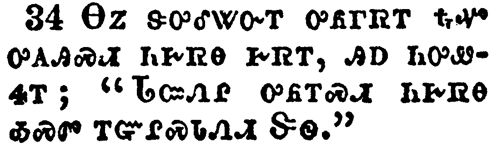</a></td>
</tr>
<tr class="even">
<td>And as concerning that he raised him up from the dead, now no more to return to corruption, he said on this wise, I will give you the sure mercies of David.</td>
</tr>
<tr class="odd">
<td>ᎾᏃ ᏕᎤᎴᏔᏅᎢ ᎤᏲᎱᏒᎢ ᎿᎭᏉ ᎤᎪᎯᏍᏗ ᏂᎨᏒᎾ ᎨᏒᎢ, ᎯᎠ ᏂᎤᏪᏎᎢ; "ᏓᏨᏁᎵ ᎤᏲᎢᏍᏗ ᏂᎨᏒᎾ ᎣᏍᏛ ᎢᏳᎵᏍᏓᏁᏗ ᏕᏫ."</td>
</tr>
<tr class="even">
<td>Na-no de-u-le-ta-nv-i u-yo-hu-sv-i hna-quo u-go-hi-s-di ni-ge-sv-na ge-sv-i, hi-a ni-u-we-se-i; "Da-tsv-ne-li u-yo-i-s-di ni-ge-sv-na o-s-dv i-yu-li-s-da-ne-di De-wi."</td>
</tr>
</tbody>
</table>

<table>
<tbody>
<tr class="odd">
<td><a href="051335.png">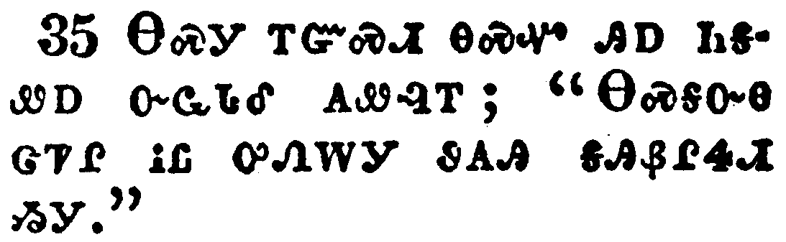</a></td>
</tr>
<tr class="even">
<td>Wherefore he saith also in another psalm, Thou shalt not suffer thine Holy One to see corruption.</td>
</tr>
<tr class="odd">
<td>ᎾᏍᎩ ᎢᏳᏍᏗ ᎾᏍᏉ ᎯᎠ ᏂᎦᏪᎠ ᏅᏩᏓᎴ ᎪᏪᎸᎢ; "ᎾᏍᎦᏅᎾ ᏣᏤᎵ ᎥᏝ ᎤᏁᎳᎩ ᏭᎪᎯ ᎦᎯᏰᎵᏎᏗ ᏱᎩ."</td>
</tr>
<tr class="even">
<td>Na-s-gi i-yu-s-di na-s-quo hi-a ni-ga-we-a nv-wa-da-le go-we-lv-i; "Na-s-ga-nv-na tsa-tse-li v-tla u-ne-la-gi wu-go-hi ga-hi-ye-li-se-di yi-gi."</td>
</tr>
</tbody>
</table>

<table>
<tbody>
<tr class="odd">
<td><a href="051336.png">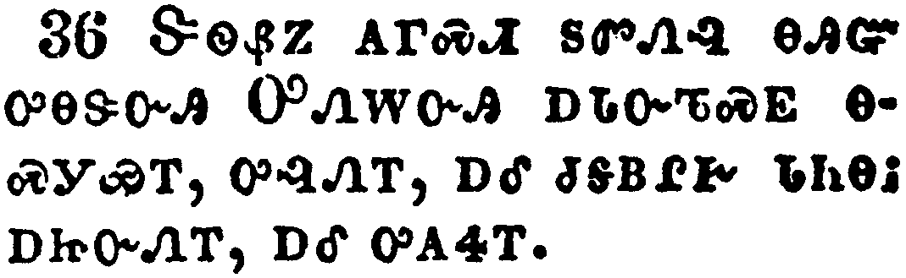</a></td>
</tr>
<tr class="even">
<td>For David, after he had served his own generation by the will of God, fell on sleep, and was laid unto his fathers, and saw corruption:</td>
</tr>
<tr class="odd">
<td>ᏕᏫᏰᏃ ᎪᎱᏍᏗ ᏚᏛᏁᎸ ᎾᎯᏳ ᎤᎾᏕᏅᎯ ᎤᏁᎳᏅᎯ ᎠᏓᏅᏖᏍᎬ ᎾᏍᎩᏯᎢ, ᎤᎸᏁᎢ, ᎠᎴ ᏧᎦᏴᎵᎨ ᏓᏂᎾᎥ ᎠᏥᏅᏁᎢ, ᎠᎴ ᎤᎪᏎᎢ.</td>
</tr>
<tr class="even">
<td>De-wi-ye-no go-hu-s-di du-dv-ne-lv na-hi-yu u-na-de-nv-hi U-ne-la-nv-hi a-da-nv-te-s-gv na-s-gi-ya-i, u-lv-ne-i, a-le tsu-ga-yv-li-ge da-ni-na-v a-tsi-nv-ne-i, a-le u-go-se-i.</td>
</tr>
</tbody>
</table>

<table>
<tbody>
<tr class="odd">
<td><a href="051337.png">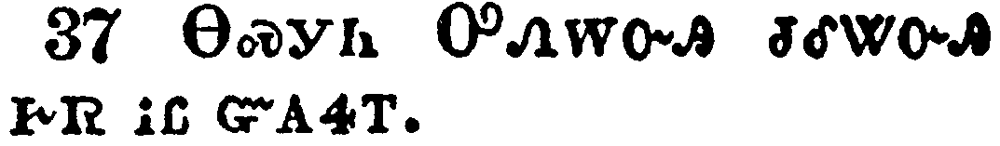</a></td>
</tr>
<tr class="even">
<td>But he, whom God raised again, saw no corruption.</td>
</tr>
<tr class="odd">
<td>ᎾᏍᎩᏂ ᎤᏁᎳᏅᎯ ᏧᎴᏔᏅᎯ ᎨᏒ ᎥᏝ ᏳᎪᏎᎢ.</td>
</tr>
<tr class="even">
<td>Na-s-gi-ni U-ne-la-nv-hi tsu-le-ta-nv-hi ge-sv v-tla yu-go-se-i.</td>
</tr>
</tbody>
</table>

<table>
<tbody>
<tr class="odd">
<td><a href="051338.png">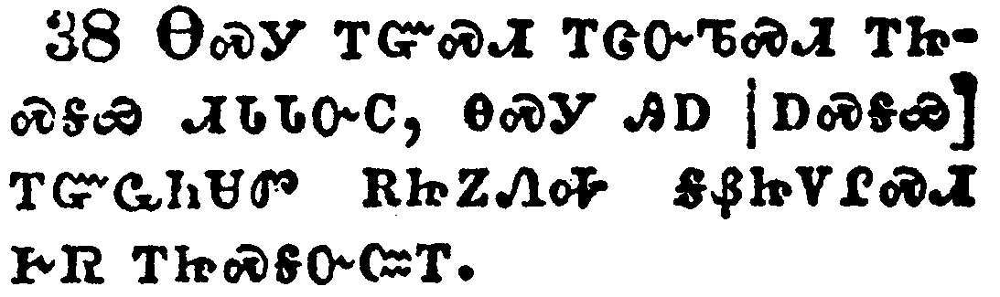</a></td>
</tr>
<tr class="even">
<td>Be it known unto you therefore, men and brethren, that through this man is preached unto you the forgiveness of sins:</td>
</tr>
<tr class="odd">
<td>ᎾᏍᎩ ᎢᏳᏍᏗ ᎢᏣᏅᏖᏍᏗ ᎢᏥᏍᎦᏯ ᏗᏓᏓᏅᏟ, ᎾᏍᎩ ᎯᎠ [ᎠᏍᎦᏯ] ᎢᏳᏩᏂᏌᏛ ᎡᏥᏃᏁᎭ ᎦᏰᏥᏙᎵᏍᏗ ᎨᏒ ᎢᏥᏍᎦᏅᏨᎢ.</td>
</tr>
<tr class="even">
<td>Na-s-gi i-yu-s-di i-tsa-nv-te-s-di i-tsi-s-ga-ya di-da-da-nv-tli, na-s-gi hi-a [a-s-ga-ya] i-yu-wa-ni-sa-dv e-tsi-no-ne-ha ga-ye-tsi-do-li-s-di ge-sv i-tsi-s-ga-nv-tsv-i.</td>
</tr>
</tbody>
</table>

<table>
<tbody>
<tr class="odd">
<td><a href="051339.png">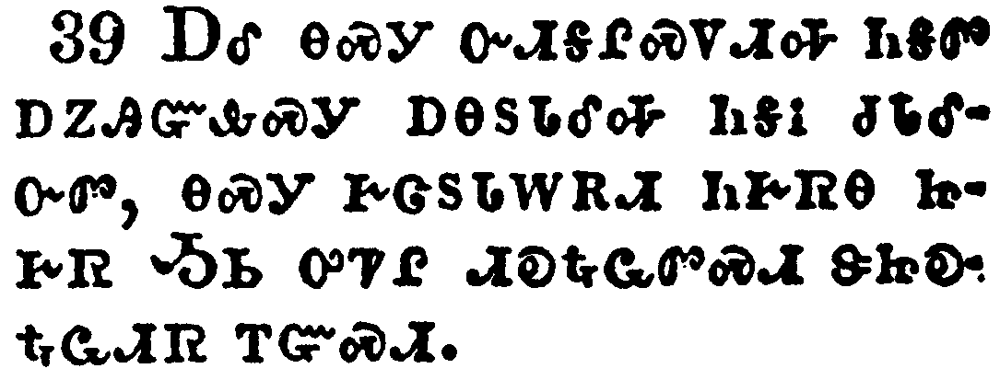</a></td>
</tr>
<tr class="even">
<td>And by him all that believe are justified from all things, from which ye could not be justified by the law of Moses.</td>
</tr>
<tr class="odd">
<td>ᎠᎴ ᎾᏍᎩ ᏅᏗᎦᎵᏍᏙᏗᎭ ᏂᎦᏛ ᎠᏃᎯᏳᎲᏍᎩ ᎠᎾᏚᏓᎴᎭ ᏂᎦᎥ ᏧᏓᎴᏅᏛ, ᎾᏍᎩ ᎨᏣᏚᏓᎳᎡᏗ ᏂᎨᏒᎾ ᏥᎨᏒ ᎼᏏ ᎤᏤᎵ ᏗᎧᎿᎭᏩᏛᏍᏗ ᏕᏥᎧᎿᎭᏩᏗᏒ ᎢᏳᏍᏗ.</td>
</tr>
<tr class="even">
<td>A-le na-s-gi nv-di-ga-li-s-do-di-ha ni-ga-dv a-no-hi-yu-hv-s-gi a-na-du-da-le-ha ni-ga-v tsu-da-le-nv-dv, na-s-gi ge-tsa-du-da-la-e-di ni-ge-sv-na tsi-ge-sv Mo-si u-tse-li di-ka-hna-wa-dv-s-di de-tsi-ka-hna-wa-di-sv i-yu-s-di.</td>
</tr>
</tbody>
</table>

<table>
<tbody>
<tr class="odd">
<td><a href="051340.png">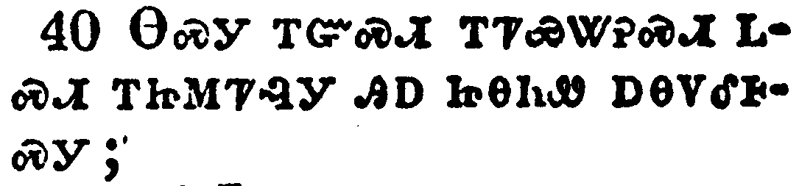</a></td>
</tr>
<tr class="even">
<td>Beware therefore, lest that come upon you, which is spoken of in the prophets;</td>
</tr>
<tr class="odd">
<td>ᎾᏍᎩ ᎢᏳᏍᏗ ᎢᏤᏯᏔᎮᏍᏗ ᏞᏍᏗ ᎢᏥᎷᏤᎸᎩ ᎯᎠ ᏥᎾᏂᏪ ᎠᎾᏙᎴᎰᏍᎩ;</td>
</tr>
<tr class="even">
<td>Na-s-gi i-yu-s-di i-tse-ya-ta-he-s-di tle-s-di i-tsi-lu-tse-lv-gi hi-a tsi-na-ni-we a-na-do-le-ho-s-gi;</td>
</tr>
</tbody>
</table>

<table>
<tbody>
<tr class="odd">
<td><a href="051341.png">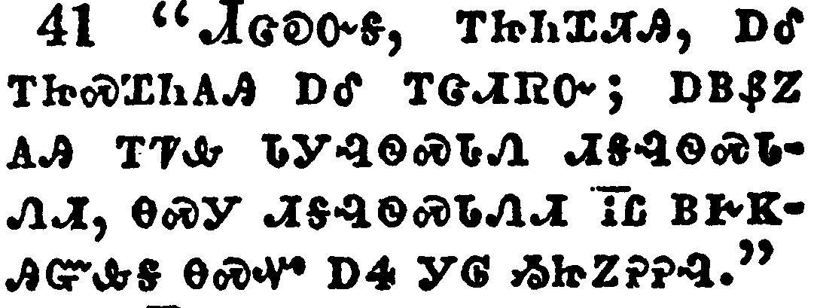</a></td>
</tr>
<tr class="even">
<td>Behold, ye despisers, and wonder, and perish: for I work a work in your days, a work which ye shall in no wise believe, though a man declare it unto you.</td>
</tr>
<tr class="odd">
<td>"ᏗᏣᎧᏅᎦ, ᎢᏥᏂᏆᏘᎯ, ᎠᎴ ᎢᏥᏍᏆᏂᎪᎯ ᎠᎴ ᎢᏣᏗᏒᏅ; ᎠᏴᏰᏃ ᎪᎯ ᎢᏤᎲ ᏓᎩᎸᏫᏍᏓᏁ ᏗᎦᎸᏫᏍᏓᏁᏗ, ᎾᏍᎩ ᏗᎦᎸᏫᏍᏓᏁᏗ ᎥᏝ ᏴᎨᏦᎯᏳᎲᎦ ᎾᏍᏉ ᎠᏎ ᎩᎶ ᏱᏥᏁᎮᎮᎸ."</td>
</tr>
<tr class="even">
<td>"Di-tsa-ka-nv-ga, i-tsi-ni-qua-ti-hi, a-le i-tsi-s-qua-ni-go-hi a-le i-tsa-di-sv-nv; a-yv-ye-no go-hi i-tse-hv da-gi-lv-wi-s-da-ne di-ga-lv-wi-s-da-ne-di, na-s-gi di-ga-lv-wi-s-da-ne-di v-tla yv-ge-tso-hi-yu-hv-ga na-s-quo a-se gi-lo yi-tsi-ne-he-he-lv."</td>
</tr>
</tbody>
</table>

<table>
<tbody>
<tr class="odd">
<td><a href="051342.png">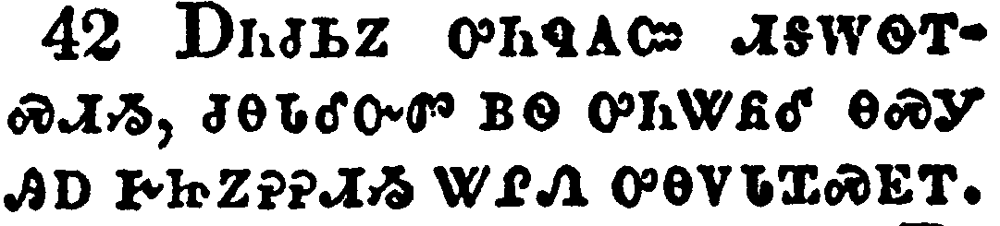</a></td>
</tr>
<tr class="even">
<td>And when the Jews were gone out of the synagogue, the Gentiles besought that these words might be preached to them the next sabbath.</td>
</tr>
<tr class="odd">
<td>ᎠᏂᏧᏏᏃ ᎤᏂᏄᎪᏨ ᏗᎦᎳᏫᎢᏍᏗᏱ, ᏧᎾᏓᎴᏅᏛ ᏴᏫ ᎤᏂᏔᏲᎴ ᎾᏍᎩ ᎯᎠ ᎨᏥᏃᎮᎮᏗᏱ ᏔᎵᏁ ᎤᎾᏙᏓᏆᏍᎬᎢ.</td>
</tr>
<tr class="even">
<td>A-ni-tsu-si-no u-ni-nu-go-tsv di-ga-la-wi-i-s-di-yi, tsu-na-da-le-nv-dv yv-wi u-ni-ta-yo-le na-s-gi hi-a ge-tsi-no-he-he-di-yi ta-li-ne u-na-do-da-qua-s-gv-i.</td>
</tr>
</tbody>
</table>

<table>
<tbody>
<tr class="odd">
<td><a href="051343.png">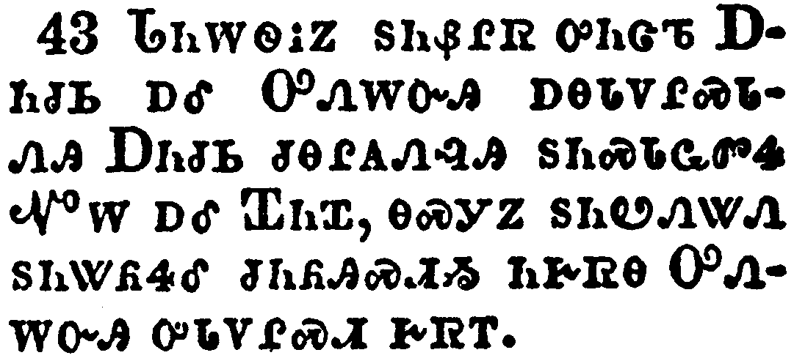</a></td>
</tr>
<tr class="even">
<td>Now when the congregation was broken up, many of the Jews and religious proselytes followed Paul and Barnabas: who, speaking to them, persuaded them to continue in the grace of God.</td>
</tr>
<tr class="odd">
<td>ᏓᏂᎳᏫᎥᏃ ᏚᏂᏰᎵᏒ ᎤᏂᏣᏖ ᎠᏂᏧᏏ ᎠᎴ ᎤᏁᎳᏅᎯ ᎠᎾᏓᏙᎵᏍᏓᏁᎯ ᎠᏂᏧᏏ ᏧᎾᎵᎪᏁᎸᎯ ᏚᏂᏍᏓᏩᏛᏎ ᏉᎳ ᎠᎴ ᏆᏂᏆ, ᎾᏍᎩᏃ ᏚᏂᏬᏁᏔᏁ ᏚᏂᏔᏲᏎᎴ ᏧᏂᏲᎯᏍᏗᏱ ᏂᎨᏒᎾ ᎤᏁᎳᏅᎯ ᎤᏓᏙᎵᏍᏗ ᎨᏒᎢ.</td>
</tr>
<tr class="even">
<td>Da-ni-la-wi-v-no du-ni-ye-li-sv u-ni-tsa-te A-ni-tsu-si a-le U-ne-la-nv-hi a-na-da-do-li-s-da-ne-hi A-ni-tsu-si tsu-na-li-go-ne-lv-hi du-ni-s-da-wa-dv-se Quo-la a-le Qua-ni-qua, na-s-gi-no du-ni-wo-ne-ta-ne du-ni-ta-yo-se-le tsu-ni-yo-hi-s-di-yi ni-ge-sv-na U-ne-la-nv-hi u-da-do-li-s-di ge-sv-i.</td>
</tr>
</tbody>
</table>

<table>
<tbody>
<tr class="odd">
<td><a href="051344.png">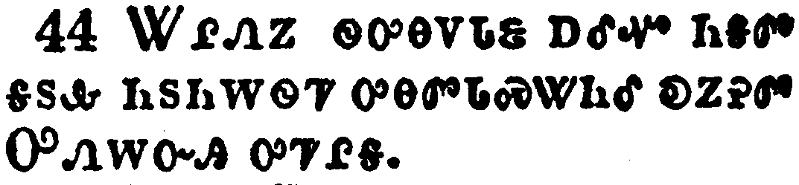</a></td>
</tr>
<tr class="even">
<td>And the next sabbath day came almost the whole city together to hear the word of God.</td>
</tr>
<tr class="odd">
<td>ᏔᎵᏁᏃ ᏫᎤᎾᏙᏓᏋ ᎠᎴᏉ ᏂᎦᏛ ᎦᏚᎲ ᏂᏚᏂᏔᏫᏤ ᎤᎾᏛᏓᏍᏔᏂᎴ ᎧᏃᎮᏛ ᎤᏁᎳᏅᎯ ᎤᏤᎵᎦ.</td>
</tr>
<tr class="even">
<td>Ta-li-ne-no wi-u-na-do-da-quv a-le-quo ni-ga-dv ga-du-hv ni-du-ni-ta-wi-tse u-na-dv-da-s-ta-ni-le ka-no-he-dv U-ne-la-nv-hi u-tse-li-ga.</td>
</tr>
</tbody>
</table>

<table>
<tbody>
<tr class="odd">
<td><a href="051345.png">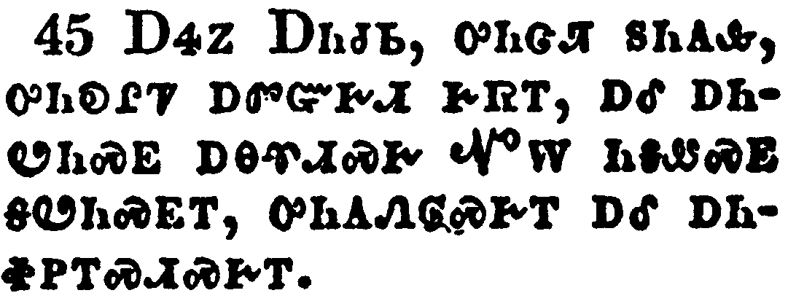</a></td>
</tr>
<tr class="even">
<td>But when the Jews saw the multitudes, they were filled with envy, and spake against those things which were spoken by Paul, contradicting and blaspheming.</td>
</tr>
<tr class="odd">
<td>ᎠᏎᏃ ᎠᏂᏧᏏ, ᎤᏂᏣᏘ ᏚᏂᎪᎲ, ᎤᏂᎧᎵᏤ ᎠᏛᏳᎨᏗ ᎨᏒᎢ, ᎠᎴ ᎠᏂᏬᏂᏍᎬ ᎠᎾᏡᏗᏍᎨ ᏉᎳ ᏂᎦᏪᏍᎬ ᎦᏬᏂᏍᎬᎢ, ᎤᏂᎪᏁᎶᏍᎨᎢ ᎠᎴ ᎠᏂᏐᏢᎢᏍᏗᏍᎨᎢ.</td>
</tr>
<tr class="even">
<td>A-se-no A-ni-tsu-si, u-ni-tsa-ti du-ni-go-hv, u-ni-ka-li-tse a-dv-yu-ge-di ge-sv-i, a-le a-ni-wo-ni-s-gv a-na-tlu-di-s-ge Quo-la ni-ga-we-s-gv ga-wo-ni-s-gv-i, u-ni-go-ne-lo-s-ge-i a-le a-ni-so-tlv-i-s-di-s-ge-i.</td>
</tr>
</tbody>
</table>

<table>
<tbody>
<tr class="odd">
<td><a href="051346.png">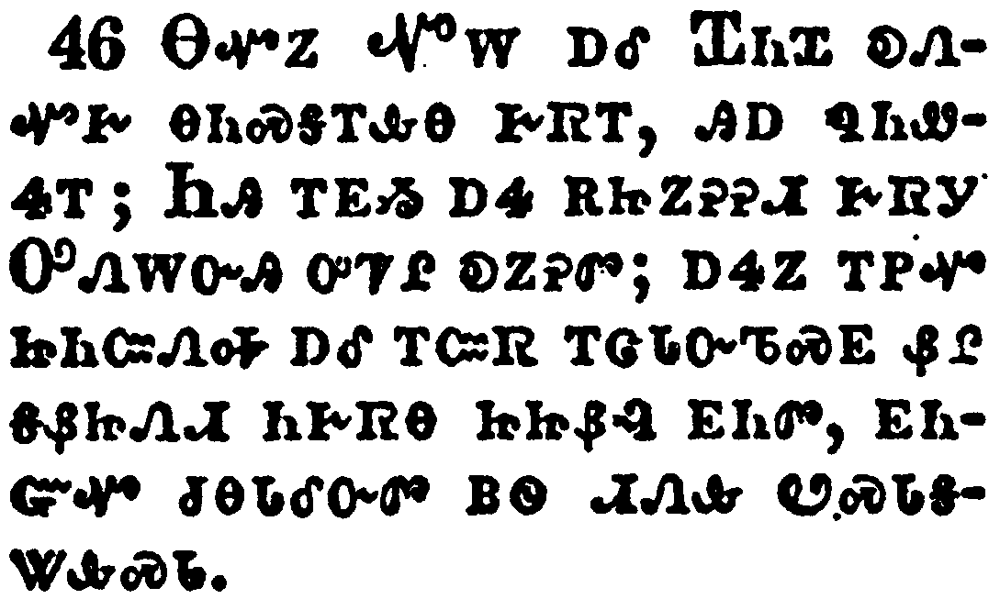</a></td>
</tr>
<tr class="even">
<td>Then Paul and Barnabas waxed bold, and said, It was necessary that the word of God should first have been spoken to you: but seeing ye put it from you, and judge yourselves unworthy of everlasting life, lo, we turn to the Gentiles.</td>
</tr>
<tr class="odd">
<td>ᎾᏉᏃ ᏉᎳ ᎠᎴ ᏆᏂᏆ ᎧᏁᏉᎨ ᎾᏂᏍᎦᎢᎲᎾ ᎨᏒᎢ, ᎯᎠ ᏄᏂᏪᏎᎢ; ᏂᎯ ᎢᎬᏱ ᎠᏎ ᎡᏥᏃᎮᎮᏗ ᎨᏒᎩ ᎤᏁᎳᏅᎯ ᎤᏤᎵ ᎧᏃᎮᏛ; ᎠᏎᏃ ᎢᏢᏉ ᏥᏂᏨᏁᎭ ᎠᎴ ᎢᏨᏒ ᎢᏣᏓᏅᏖᏍᎬ ᏰᎵ ᎦᏰᏥᏁᏗ ᏂᎨᏒᎾ ᏥᏥᏰᎸ ᎬᏂᏛ, ᎬᏂᏳᏉ ᏧᎾᏓᎴᏅᏛ ᏴᏫ ᏗᏁᎲ ᏬᏍᏓᎦᏔᎲᏍᏓ.</td>
</tr>
<tr class="even">
<td>Na-quo-no Quo-la a-le Qua-ni-qua ka-ne-quo-ge na-ni-s-ga-i-hv-na ge-sv-i, hi-a nu-ni-we-se-i; Ni-hi i-gv-yi a-se e-tsi-no-he-he-di ge-sv-gi U-ne-la-nv-hi u-tse-li ka-no-he-dv; a-se-no i-tlv-quo tsi-ni-tsv-ne-ha a-le i-tsv-sv i-tsa-da-nv-te-s-gv ye-li ga-ye-tsi-ne-di ni-ge-sv-na tsi-tsi-ye-lv gv-ni-dv, gv-ni-yu-quo tsu-na-da-le-nv-dv yv-wi di-ne-hv wo-s-da-ga-ta-hv-s-da.</td>
</tr>
</tbody>
</table>

<table>
<tbody>
<tr class="odd">
<td><a href="051347.png">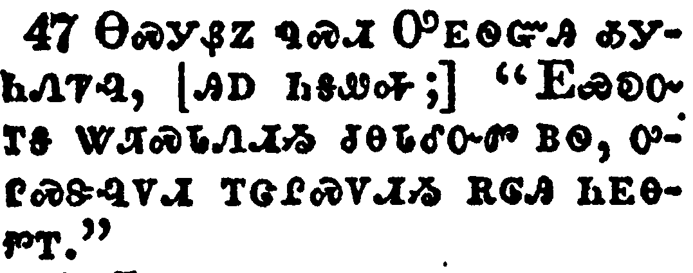</a></td>
</tr>
<tr class="even">
<td>For so hath the Lord commanded us, saying, I have set thee to be a light of the Gentiles, that thou shouldest be for salvation unto the ends of the earth.</td>
</tr>
<tr class="odd">
<td>ᎾᏍᎩᏰᏃ ᏄᏍᏗ ᎤᎬᏫᏳᎯ ᎣᎩᏂᏁᏤᎸ, [ᎯᎠ ᏂᎦᏪᎭ;] "ᎬᏯᎧᏅ ᎢᎦ ᏔᏘᏍᏓᏁᏗᏱ ᏧᎾᏓᎴᏅᏛ ᏴᏫ, ᎤᎵᏍᏕᎸᏙᏗ ᎢᏣᎵᏍᏙᏗᏱ ᎡᎶᎯ ᏂᎬᎾᏛᎢ."</td>
</tr>
<tr class="even">
<td>Na-s-gi-ye-no nu-s-di U-gv-wi-yu-hi o-gi-ni-ne-tse-lv, [hi-a ni-ga-we-ha;] "Gv-ya-ka-nv i-ga ta-ti-s-da-ne-di-yi tsu-na-da-le-nv-dv yv-wi, u-li-s-de-lv-do-di i-tsa-li-s-do-di-yi e-lo-hi ni-gv-na-dv-i."</td>
</tr>
</tbody>
</table>

<table>
<tbody>
<tr class="odd">
<td><a href="051348.png">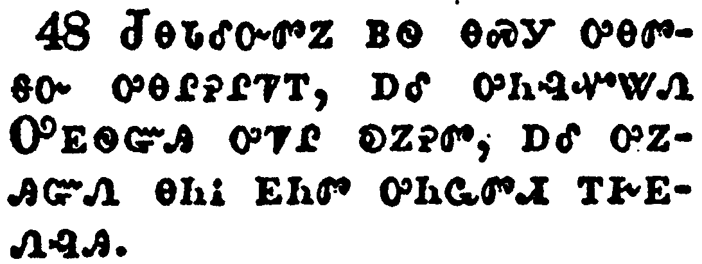</a></td>
</tr>
<tr class="even">
<td>And when the Gentiles heard this, they were glad, and glorified the word of the Lord: and as many as were ordained to eternal life believed.</td>
</tr>
<tr class="odd">
<td>ᏧᎾᏓᎴᏅᏛᏃ ᏴᏫ ᎾᏍᎩ ᎤᎾᏛᎦᏅ ᎤᎾᎵᎮᎵᏤᎢ, ᎠᎴ ᎤᏂᎸᏉᏔᏁ ᎤᎬᏫᏳᎯ ᎤᏤᎵ ᎧᏃᎮᏛ, ᎠᎴ ᎤᏃᎯᏳᏁ ᎾᏂᎥ ᎬᏂᏛ ᎤᏂᏩᏛᏗ ᎢᎨᎬᏁᎸᎯ.</td>
</tr>
<tr class="even">
<td>Tsu-na-da-le-nv-dv-no yv-wi na-s-gi u-na-dv-ga-nv u-na-li-he-li-tse-i, a-le u-ni-lv-quo-ta-ne U-gv-wi-yu-hi u-tse-li ka-no-he-dv, a-le u-no-hi-yu-ne na-ni-v gv-ni-dv u-ni-wa-dv-di i-ge-gv-ne-lv-hi.</td>
</tr>
</tbody>
</table>

<table>
<tbody>
<tr class="odd">
<td><a href="051349.png">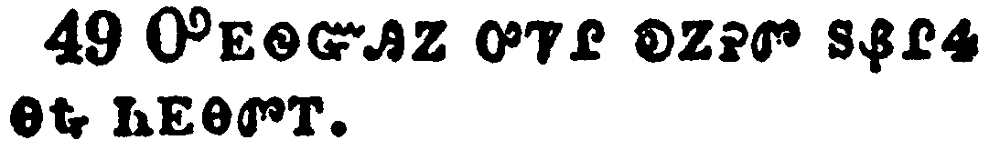</a></td>
</tr>
<tr class="even">
<td>And the word of the Lord was published throughout all the region.</td>
</tr>
<tr class="odd">
<td>ᎤᎬᏫᏳᎯᏃ ᎤᏤᎵ ᎧᏃᎮᏛ ᏚᏰᎵᏎ ᎾᎿᎭᏂᎬᎾᏛᎢ.</td>
</tr>
<tr class="even">
<td>U-gv-wi-yu-hi-no u-tse-li ka-no-he-dv du-ye-li-se na-hna ni-gv-na-dv-i.</td>
</tr>
</tbody>
</table>

<table>
<tbody>
<tr class="odd">
<td><a href="051350.png">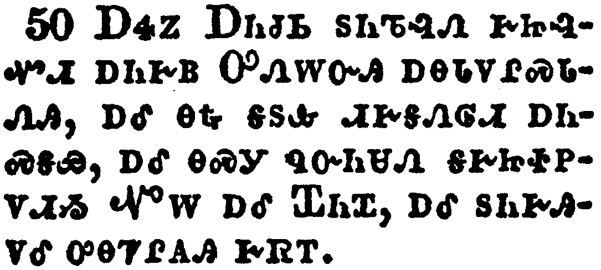</a></td>
</tr>
<tr class="even">
<td>But the Jews stirred up the devout and honourable women, and the chief men of the city, and raised persecution against Paul and Barnabas, and expelled them out of their coasts.</td>
</tr>
<tr class="odd">
<td>ᎠᏎᏃ ᎠᏂᏧᏏ ᏚᏂᏖᎸᏁ ᎨᏥᎸᏉᏗ ᎠᏂᎨᏴ ᎤᏁᎳᏅᎯ ᎠᎾᏓᏙᎵᏍᏓᏁᎯ, ᎠᎴ ᎾᎿᎭᎦᏚᎲ ᏗᎨᎦᏁᎶᏗ ᎠᏂᏍᎦᏯ, ᎠᎴ ᎾᏍᎩ ᏄᏅᏂᏌᏁ ᎦᎨᏥᏐᏢᏙᏗᏱ ᏉᎳ ᎠᎴ ᏆᏂᏆ, ᎠᎴ ᏚᏂᎨᎯᏙᎴ ᎤᎾᏤᎵᎪᎯ ᎨᏒᎢ.</td>
</tr>
<tr class="even">
<td>A-se-no A-ni-tsu-si du-ni-te-lv-ne ge-tsi-lv-quo-di a-ni-ge-yv U-ne-la-nv-hi a-na-da-do-li-s-da-ne-hi, a-le na-hna ga-du-hv di-ge-ga-ne-lo-di a-ni-s-ga-ya, a-le na-s-gi nu-nv-ni-sa-ne ga-ge-tsi-so-tlv-do-di-yi Quo-la a-le Qua-ni-qua, a-le du-ni-ge-hi-do-le u-na-tse-li-go-hi ge-sv-i.</td>
</tr>
</tbody>
</table>

<table>
<tbody>
<tr class="odd">
<td><a href="051351.png">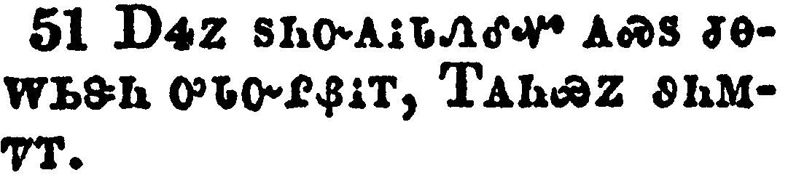</a></td>
</tr>
<tr class="even">
<td>But they shook off the dust of their feet against them, and came unto Iconium.</td>
</tr>
<tr class="odd">
<td>ᎠᏎᏃ ᏚᏂᏅᎪᎥᏓᏁᎴᏉ ᎪᏍᏚ ᏧᎾᎳᏏᏕᏂ ᎤᏓᏅᎵᏰᎥᎢ, ᎢᎪᏂᏯᏃ ᏭᏂᎷᏤᎢ.</td>
</tr>
<tr class="even">
<td>A-se-no du-ni-nv-go-v-da-ne-le-quo go-s-du tsu-na-la-si-de-ni u-da-nv-li-ye-v-i, I-go-ni-ya-no wu-ni-lu-tse-i.</td>
</tr>
</tbody>
</table>

<table>
<tbody>
<tr class="odd">
<td><a href="051352.png">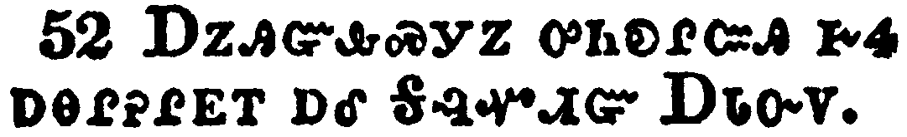</a></td>
</tr>
<tr class="even">
<td>And the disciples were filled with joy, and with the Holy Ghost.</td>
</tr>
<tr class="odd">
<td>ᎠᏃᎯᏳᎲᏍᎩᏃ ᎤᏂᎧᎵᏨᎯ ᎨᏎ ᎠᎾᎵᎮᎵᎬᎢ ᎠᎴ ᎦᎸᏉᏗᏳ ᎠᏓᏅᏙ.</td>
</tr>
<tr class="even">
<td>A-no-hi-yu-hv-s-gi-no u-ni-ka-li-tsv-hi ge-se a-na-li-he-li-gv-i a-le Ga-lv-quo-di-yu A-da-nv-do.</td>
</tr>
</tbody>
</table>

