+++
draft=false
date = 2014-12-18T21:11:07Z
title = "The Acts - Chapter 15 - Cherokee New Testament"
weight = 1418955067

[taxonomies]

authors = ["Timothy Legg"]
categories = []
tags = []

[extra]
+++

<table>
<tbody>
<tr class="odd">
<td></td>
</tr>
<tr class="even">
<td>And certain men which came down from Judaea taught the brethren, and said, Except ye be circumcised after the manner of Moses, ye cannot be saved.</td>
</tr>
<tr class="odd">
<td>ᎩᎶᏃ ᎢᏳᎾᏍᏗ ᏧᏗᏱ ᏅᏓᏳᏂᎶᏒᎯ ᏚᏁᏲᏁ ᎠᎾᏓᏅᏟ ᎯᎠ ᏄᏂᏪᏎᎢ; ᎢᏳᏃ ᏤᏥᎤᏍᏕᏎᎸᎯ ᏂᎨᏒᎾ ᎢᎨᏎᏍᏗ, ᎾᏍᎩ ᎼᏏ ᏂᎦᏪᏍᎬᎢ, ᎥᏝ ᏴᎦᏰᏥᏍᏕᎸ.</td>
</tr>
<tr class="even">
<td>Gi-lo-no i-yu-na-s-di Tsu-di-yi nv-da-yu-ni-lo-sv-hi du-ne-yo-ne a-na-da-nv-tli hi-a nu-ni-we-se-i; I-yu-no tse-tsi-u-s-de-se-lv-hi ni-ge-sv-na i-ge-se-s-di, na-s-gi Mo-si ni-ga-we-s-gv-i, v-tla yv-ga-ye-tsi-s-de-lv.</td>
</tr>
</tbody>
</table>

<table>
<tbody>
<tr class="odd">
<td><a href="051502.png">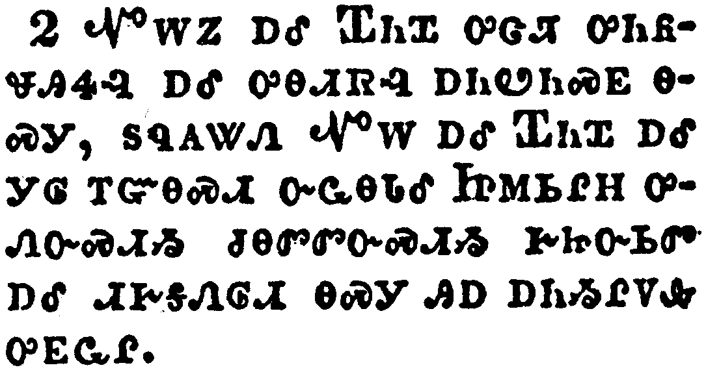</a></td>
</tr>
<tr class="even">
<td>When therefore Paul and Barnabas had no small dissension and disputation with them, they determined that Paul and Barnabas, and certain other of them, should go up to Jerusalem unto the apostles and elders about this question.</td>
</tr>
<tr class="odd">
<td>ᏉᎳᏃ ᎠᎴ ᏆᏂᏆ ᎤᏣᏘ ᎤᏂᏲᏠᎯᏎᎸ ᎠᎴ ᎤᎾᏗᏒᎸ ᎠᏂᏬᏂᏍᎬ ᎾᏍᎩ, ᏚᏄᎪᏔᏁ ᏉᎳ ᎠᎴ ᏆᏂᏆ ᎠᎴ ᎩᎶ ᎢᏳᎾᏍᏗ ᏅᏩᎾᏓᎴ ᏥᎷᏏᎵᎻ ᎤᏁᏅᏍᏗᏱ ᏧᎾᏛᏛᏅᏍᏗᏱ ᎨᏥᏅᏏᏛ ᎠᎴ ᏗᎨᎦᏁᎶᏗ ᎾᏍᎩ ᎯᎠ ᎠᏂᏱᎵᏙᎲ ᎤᎬᏩᎵ.</td>
</tr>
<tr class="even">
<td>Quo-la-no a-le Qua-ni-qua u-tsa-ti u-ni-yo-tlo-hi-se-lv a-le u-na-di-sv-lv a-ni-wo-ni-s-gv na-s-gi, du-nu-go-ta-ne Quo-la a-le Qua-ni-qua a-le gi-lo i-yu-na-s-di nv-wa-na-da-le Tsi-lu-si-li-mi u-ne-nv-s-di-yi tsu-na-dv-dv-nv-s-di-yi ge-tsi-nv-si-dv a-le di-ge-ga-ne-lo-di na-s-gi hi-a a-ni-yi-li-do-hv u-gv-wa-li.</td>
</tr>
</tbody>
</table>

<table>
<tbody>
<tr class="odd">
<td><a href="051503.png">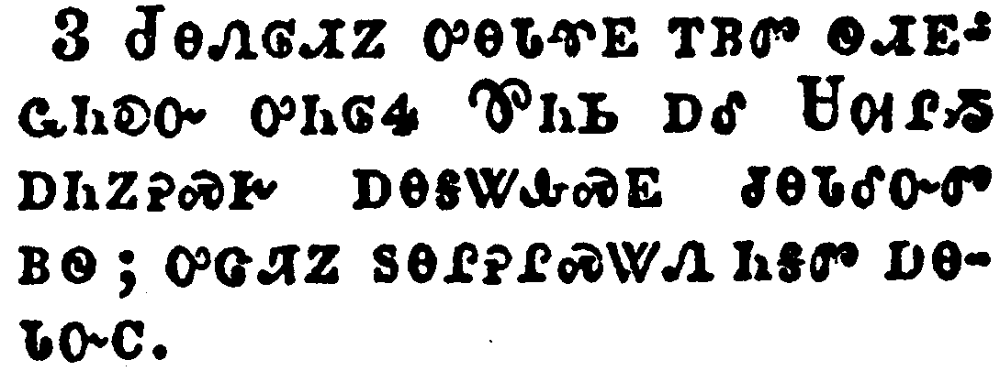</a></td>
</tr>
<tr class="even">
<td>And being brought on their way by the church, they passed through Phenice and Samaria, declaring the conversion of the Gentiles: and they caused great joy unto all the brethren.</td>
</tr>
<tr class="odd">
<td>ᏧᎾᏁᎶᏗᏃ ᎤᎾᏓᏡᎬ ᎢᏴᏛ ᏫᏗᎬᏩᏂᎧᏅ ᎤᏂᎶᏎ ᏈᏂᏏ ᎠᎴ ᏌᎺᎵᏱ ᎠᏂᏃᎮᏍᎨ ᎠᎾᎦᏔᎲᏍᎬ ᏧᎾᏓᎴᏅᏛ ᏴᏫ; ᎤᏩᏘᏃ ᏚᎾᎵᎨᎵᏍᏔᏁ ᏂᎦᏛ ᎠᎾᏓᏅᏟ.</td>
</tr>
<tr class="even">
<td>Tsu-na-ne-lo-di-no u-na-da-tlu-gv i-yv-dv wi-di-gv-wa-ni-ka-nv u-ni-lo-se Qui-ni-si a-le Sa-me-li-yi a-ni-no-he-s-ge a-na-ga-ta-hv-s-gv tsu-na-da-le-nv-dv yv-wi; u-wa-ti-no du-na-li-ge-li-s-ta-ne ni-ga-dv a-na-da-nv-tli.</td>
</tr>
</tbody>
</table>

<table>
<tbody>
<tr class="odd">
<td><a href="051504.png">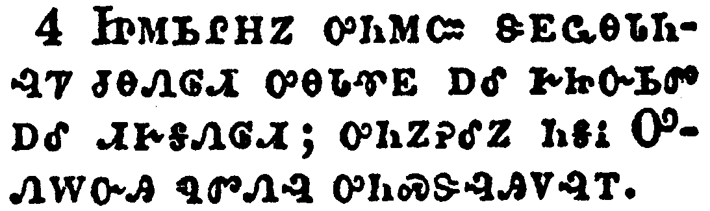</a></td>
</tr>
<tr class="even">
<td>And when they were come to Jerusalem, they were received of the church, and of the apostles and elders, and they declared all things that God had done with them.</td>
</tr>
<tr class="odd">
<td>ᏥᎷᏏᎵᎻᏃ ᎤᏂᎷᏨ ᎦᎬᏩᎾᏓᏂᎸᏤ ᏧᎾᏁᎶᏗ ᎤᎾᏓᏡᎬ ᎠᎴ ᎨᏥᏅᏏᏛ ᎠᎴ ᏗᎨᎦᏁᎶᏗ; ᎤᏂᏃᎮᎴᏃ ᏂᎦᎥ ᎤᏁᎳᏅᎯ ᏄᏛᏁᎸ ᎤᏂᏍᏕᎸᎯᏙᎸᎢ.</td>
</tr>
<tr class="even">
<td>Tsi-lu-si-li-mi-no u-ni-lu-tsv ga-gv-wa-na-da-ni-lv-tse tsu-na-ne-lo-di u-na-da-tlu-gv a-le ge-tsi-nv-si-dv a-le di-ge-ga-ne-lo-di; u-ni-no-he-le-no ni-ga-v U-ne-la-nv-hi nu-dv-ne-lv u-ni-s-de-lv-hi-do-lv-i.</td>
</tr>
</tbody>
</table>

<table>
<tbody>
<tr class="odd">
<td><a href="051505.png">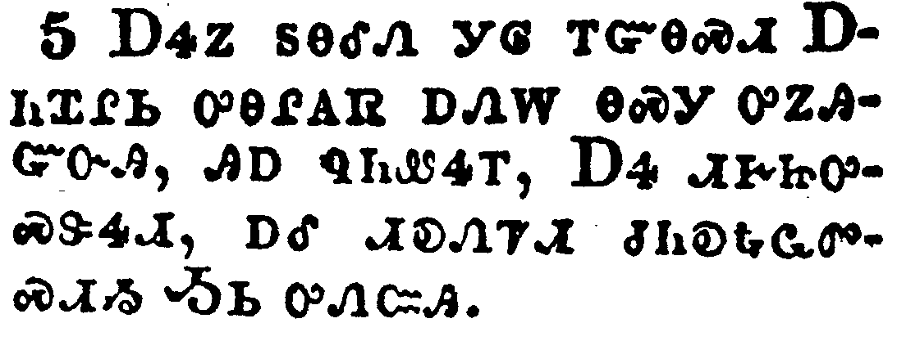</a></td>
</tr>
<tr class="even">
<td>But there rose up certain of the sect of the Pharisees which believed, saying, That it was needful to circumcise them, and to command them to keep the law of Moses.</td>
</tr>
<tr class="odd">
<td>ᎠᏎᏃ ᏚᎾᎴᏁ ᎩᎶ ᎢᏳᎾᏍᏗ ᎠᏂᏆᎵᏏ ᎤᎾᎵᎪᏒ ᎠᏁᎳ ᎾᏍᎩ ᎤᏃᎯᏳᏅᎯ, ᎯᎠ ᏄᏂᏪᏎᎢ, ᎠᏎ ᏗᎨᏥᎤᏍᏕᏎᏗ, ᎠᎴ ᏗᎧᏁᏤᏗ ᏧᏂᎧᎿᎭᏩᏛᏍᏗᏱ ᎼᏏ ᎤᏁᏨᎯ.</td>
</tr>
<tr class="even">
<td>A-se-no du-na-le-ne gi-lo i-yu-na-s-di A-ni-qua-li-si u-na-li-go-sv a-ne-la na-s-gi u-no-hi-yu-nv-hi, hi-a nu-ni-we-se-i, A-se di-ge-tsi-u-s-de-se-di, a-le di-ka-ne-tse-di tsu-ni-ka-hna-wa-dv-s-di-yi Mo-si u-ne-tsv-hi.</td>
</tr>
</tbody>
</table>

<table>
<tbody>
<tr class="odd">
<td><a href="051506.png">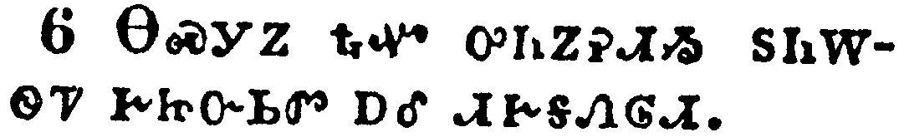</a></td>
</tr>
<tr class="even">
<td>And the apostles and elders came together for to consider of this matter.</td>
</tr>
<tr class="odd">
<td>ᎾᏍᎩᏃ ᎿᎭᏉ ᎤᏂᏃᎮᏗᏱ ᏚᏂᎳᏫᏤ ᎨᏥᏅᏏᏛ ᎠᎴ ᏗᎨᎦᏁᎶᏗ.</td>
</tr>
<tr class="even">
<td>Na-s-gi-no hna-quo u-ni-no-he-di-yi du-ni-la-wi-tse ge-tsi-nv-si-dv a-le di-ge-ga-ne-lo-di.</td>
</tr>
</tbody>
</table>

<table>
<tbody>
<tr class="odd">
<td><a href="051507.png">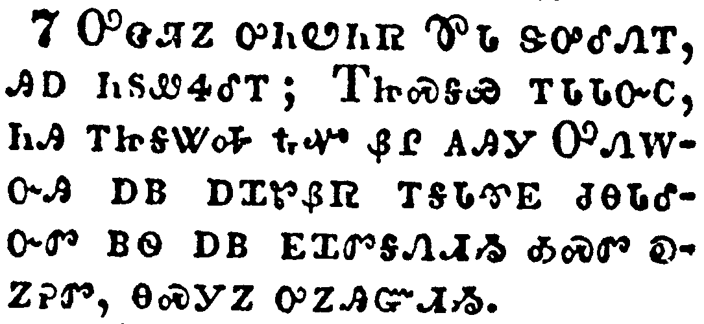</a></td>
</tr>
<tr class="even">
<td>And when there had been much disputing, Peter rose up, and said unto them, Men and brethren, ye know how that a good while ago God made choice among us, that the Gentiles by my mouth should hear the word of the gospel, and believe.</td>
</tr>
<tr class="odd">
<td>ᎤᏣᏘᏃ ᎤᏂᏬᏂᏒ ᏈᏓ ᏕᎤᎴᏁᎢ, ᎯᎠ ᏂᏚᏪᏎᎴᎢ; ᎢᏥᏍᎦᏯ ᎢᏓᏓᏅᏟ, ᏂᎯ ᎢᏥᎦᏔᎭ ᎿᎭᏉ ᏰᎵ ᎪᎯᎩ ᎤᏁᎳᏅᎯ ᎠᏴ ᎠᏆᏑᏰᏒ ᎢᎦᏓᏡᎬ ᏧᎾᏓᎴᏅᏛ ᏴᏫ ᎠᏴ ᎬᏆᏛᎦᏁᏗᏱ ᎣᏍᏛ ᎧᏃᎮᏛ, ᎾᏍᎩᏃ ᎤᏃᎯᏳᏗᏱ.</td>
</tr>
<tr class="even">
<td>U-tsa-ti-no u-ni-wo-ni-sv Qui-da de-u-le-ne-i, hi-a ni-du-we-se-le-i; I-tsi-s-ga-ya i-da-da-nv-tli, ni-hi i-tsi-ga-ta-ha hna-quo ye-li go-hi-gi U-ne-la-nv-hi a-yv a-qua-su-ye-sv i-ga-da-tlu-gv tsu-na-da-le-nv-dv yv-wi a-yv gv-qua-dv-ga-ne-di-yi o-s-dv ka-no-he-dv, na-s-gi-no u-no-hi-yu-di-yi.</td>
</tr>
</tbody>
</table>

<table>
<tbody>
<tr class="odd">
<td><a href="051508.png">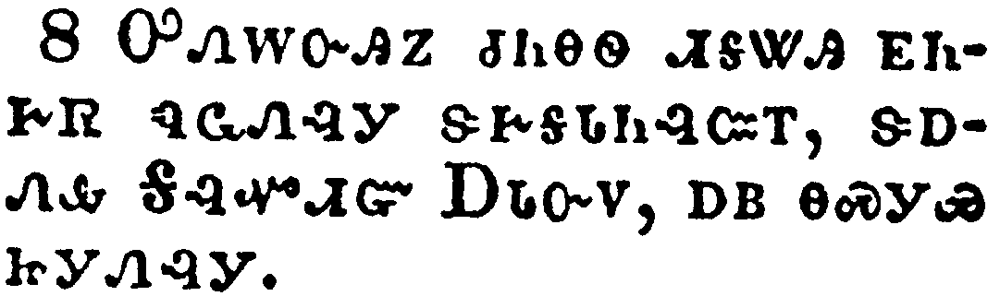</a></td>
</tr>
<tr class="even">
<td>And God, which knoweth the hearts, bare them witness, giving them the Holy Ghost, even as he did unto us;</td>
</tr>
<tr class="odd">
<td>ᎤᏁᎳᏅᎯᏃ ᏧᏂᎾᏫ ᏗᎦᏔᎯ ᎬᏂᎨᏒ ᏄᏩᏁᎸᎩ ᏕᎨᎦᏓᏂᎸᏨᎢ, ᏕᎠᏁᎲ ᎦᎸᏉᏗᏳ ᎠᏓᏅᏙ, ᎠᏴ ᎾᏍᎩᏯ ᏥᎩᏁᎸᎩ.</td>
</tr>
<tr class="even">
<td>U-ne-la-nv-hi-no tsu-ni-na-wi di-ga-ta-hi gv-ni-ge-sv nu-wa-ne-lv-gi de-ge-ga-da-ni-lv-tsv-i, de-a-ne-hv Ga-lv-quo-di-yu A-da-nv-do, a-yv na-s-gi-ya tsi-gi-ne-lv-gi.</td>
</tr>
</tbody>
</table>

<table>
<tbody>
<tr class="odd">
<td><a href="051509.png">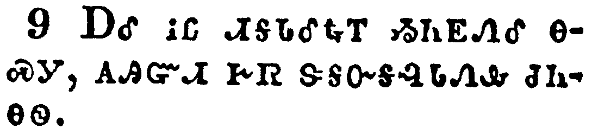</a></td>
</tr>
<tr class="even">
<td>And put no difference between us and them, purifying their hearts by faith.</td>
</tr>
<tr class="odd">
<td>ᎠᎴ ᎥᏝ ᏗᎦᏓᎴᎿᎭᎢ ᏱᏂᎬᏁᎴ ᎾᏍᎩ, ᎪᎯᏳᏗ ᎨᏒ ᏕᎦᏅᎦᎸᏓᏁᎲ ᏧᏂᎾᏫ.</td>
</tr>
<tr class="even">
<td>A-le v-tla di-ga-da-le-hna-i yi-ni-gv-ne-le na-s-gi, go-hi-yu-di ge-sv de-ga-nv-ga-lv-da-ne-hv tsu-ni-na-wi.</td>
</tr>
</tbody>
</table>

<table>
<tbody>
<tr class="odd">
<td><a href="051510.png">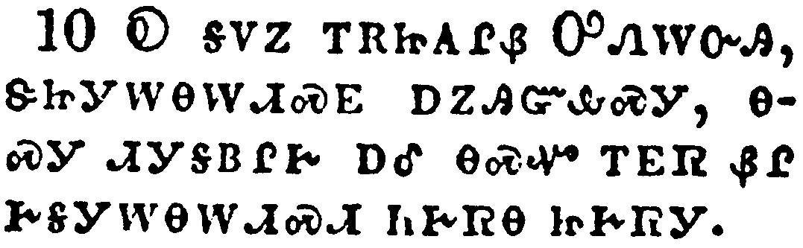</a></td>
</tr>
<tr class="even">
<td>Now therefore why tempt ye God, to put a yoke upon the neck of the disciples, which neither our fathers nor we were able to bear?</td>
</tr>
<tr class="odd">
<td>Ꭷ ᎦᏙᏃ ᎢᎡᏥᎪᎵᏰ ᎤᏁᎳᏅᎯ, ᏕᏥᎩᎳᎾᎳᏗᏍᎬ ᎠᏃᎯᏳᎲᏍᎩ, ᎾᏍᎩ ᏗᎩᎦᏴᎵᎨ ᎠᎴ ᎾᏍᏉ ᎢᎬᏒ ᏰᎵ ᎨᎦᎩᎳᎾᎳᏗᏍᏗ ᏂᎨᏒᎾ ᏥᎨᏒᎩ.</td>
</tr>
<tr class="even">
<td>Ka ga-do-no i-e-tsi-go-li-ye U-ne-la-nv-hi, de-tsi-gi-la-na-la-di-s-gv a-no-hi-yu-hv-s-gi, na-s-gi di-gi-ga-yv-li-ge a-le na-s-quo i-gv-sv ye-li ge-ga-gi-la-na-la-di-s-di ni-ge-sv-na tsi-ge-sv-gi.</td>
</tr>
</tbody>
</table>

<table>
<tbody>
<tr class="odd">
<td><a href="051511.png">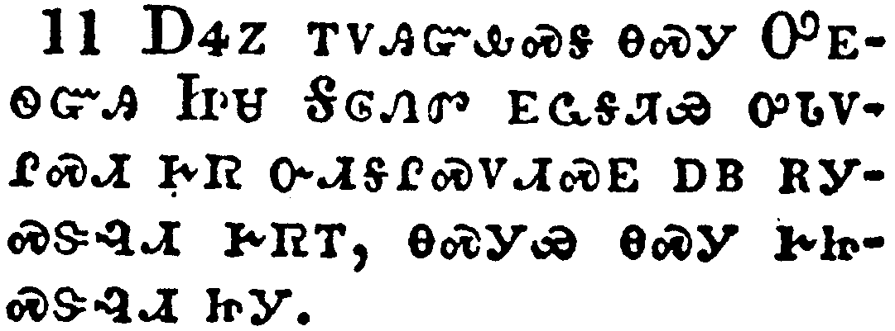</a></td>
</tr>
<tr class="even">
<td>But we believe that through the grace of the Lord Jesus Christ we shall be saved, even as they.</td>
</tr>
<tr class="odd">
<td>ᎠᏎᏃ ᎢᏙᎯᏳᎲᏍᎦ ᎾᏍᎩ ᎤᎬᏫᏳᎯ ᏥᏌ ᎦᎶᏁᏛ ᎬᏩᎦᏘᏯ ᎤᏓᏙᎵᏍᏗ ᎨᏒ ᏅᏗᎦᎵᏍᏙᏗᏍᎬ ᎠᏴ ᎡᎩᏍᏕᎸᏗ ᎨᏒᎢ, ᎾᏍᎩᏯ ᎾᏍᎩ ᎨᏥᏍᏕᎸᏗ ᏥᎩ.</td>
</tr>
<tr class="even">
<td>A-se-no i-do-hi-yu-hv-s-ga na-s-gi U-gv-wi-yu-hi Tsi-sa Ga-lo-ne-dv gv-wa-ga-ti-ya u-da-do-li-s-di ge-sv nv-di-ga-li-s-do-di-s-gv a-yv e-gi-s-de-lv-di ge-sv-i, na-s-gi-ya na-s-gi ge-tsi-s-de-lv-di tsi-gi.</td>
</tr>
</tbody>
</table>

<table>
<tbody>
<tr class="odd">
<td><a href="051512.png">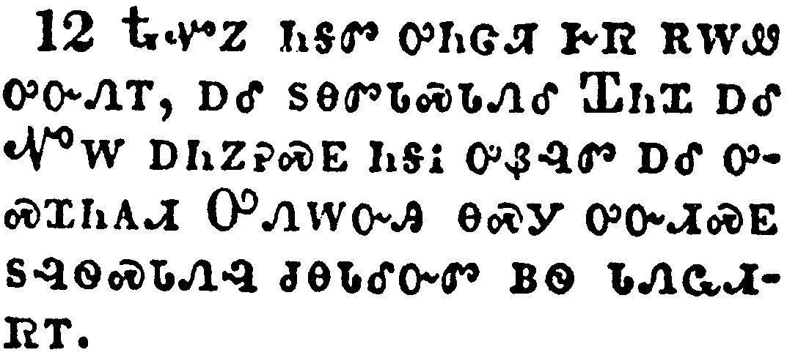</a></td>
</tr>
<tr class="even">
<td>Then all the multitude kept silence, and gave audience to Barnabas and Paul, declaring what miracles and wonders God had wrought among the Gentiles by them.</td>
</tr>
<tr class="odd">
<td>ᎿᎭᏉᏃ ᏂᎦᏛ ᎤᏂᏣᏘ ᎨᏒ ᎡᎳᏪ ᎤᏅᏁᎢ, ᎠᎴ ᏚᎾᏛᏓᏍᏓᏁᎴ ᏆᏂᏆ ᎠᎴ ᏉᎳ ᎠᏂᏃᎮᏍᎬ ᏂᎦᎥ ᎤᏰᎸᏛ ᎠᎴ ᎤᏍᏆᏂᎪᏗ ᎤᏁᎳᏅᎯ ᎾᏍᎩ ᎤᏅᏗᏍᎬ ᏚᎸᏫᏍᏓᏁᎸ ᏧᎾᏓᎴᏅᏛ ᏴᏫ ᏓᏁᏩᏗᏒᎢ.</td>
</tr>
<tr class="even">
<td>Hna-quo-no ni-ga-dv u-ni-tsa-ti ge-sv e-la-we u-nv-ne-i, a-le du-na-dv-da-s-da-ne-le Qua-ni-qua a-le Quo-la a-ni-no-he-s-gv ni-ga-v u-ye-lv-dv a-le u-s-qua-ni-go-di U-ne-la-nv-hi na-s-gi u-nv-di-s-gv du-lv-wi-s-da-ne-lv tsu-na-da-le-nv-dv yv-wi da-ne-wa-di-sv-i.</td>
</tr>
</tbody>
</table>

<table>
<tbody>
<tr class="odd">
<td><a href="051513.png">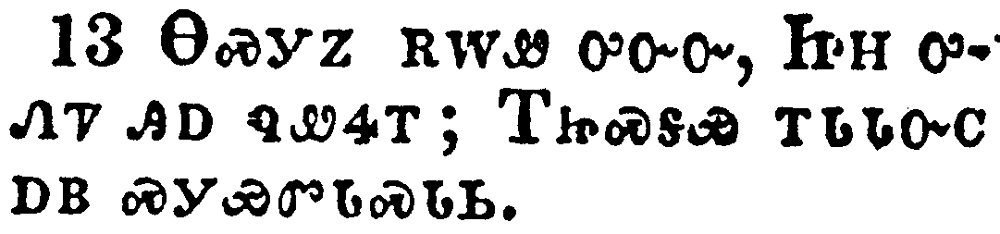</a></td>
</tr>
<tr class="even">
<td>And after they had held their peace, James answered, saying, Men and brethren, hearken unto me:</td>
</tr>
<tr class="odd">
<td>ᎾᏍᎩᏃ ᎡᎳᏪ ᎤᏅᏅ, ᏥᎻ ᎤᏁᏤ ᎯᎠ ᏄᏪᏎᎢ; ᎢᏥᏍᎦᏯ ᎢᏓᏓᏅᏟ ᎠᏴ ᏍᎩᏯᏛᏓᏍᏓᏏ.</td>
</tr>
<tr class="even">
<td>Na-s-gi-no e-la-we u-nv-nv, Tsi-mi u-ne-tse hi-a nu-we-se-i; I-tsi-s-ga-ya i-da-da-nv-tli a-yv s-gi-ya-dv-da-s-da-si.</td>
</tr>
</tbody>
</table>

<table>
<tbody>
<tr class="odd">
<td><a href="051514.png">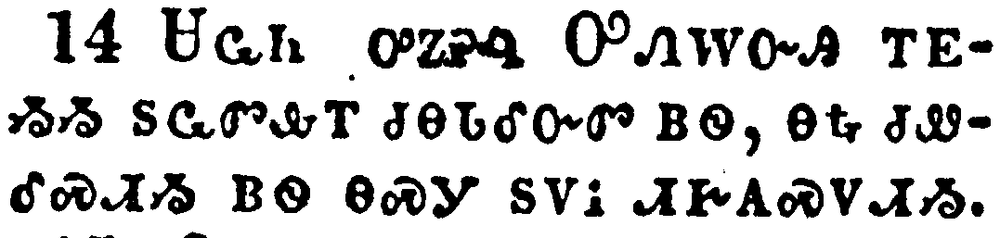</a></td>
</tr>
<tr class="even">
<td>Simeon hath declared how God at the first did visit the Gentiles, to take out of them a people for his name.</td>
</tr>
<tr class="odd">
<td>ᏌᏩᏂ ᎤᏃᎮᎸ ᎤᏁᎳᏅᎯ ᎢᎬᏱᏱ ᏚᏩᏛᎲᎢ ᏧᎾᏓᎴᏅᏛ ᏴᏫ, ᎾᎿᎭᏧᏪᎴᏍᏗᏱ ᏴᏫ ᎾᏍᎩ ᏚᏙᎥ ᏗᎨᎪᏍᏙᏗᏱ.</td>
</tr>
<tr class="even">
<td>Sa-wa-ni u-no-he-lv U-ne-la-nv-hi i-gv-yi-yi du-wa-dv-hv-i tsu-na-da-le-nv-dv yv-wi, na-hna tsu-we-le-s-di-yi yv-wi na-s-gi du-do-v di-ge-go-s-do-di-yi.</td>
</tr>
</tbody>
</table>

<table>
<tbody>
<tr class="odd">
<td><a href="051515.png">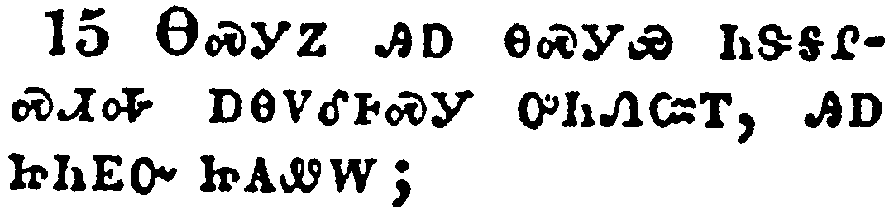</a></td>
</tr>
<tr class="even">
<td>And to this agree the words of the prophets; as it is written,</td>
</tr>
<tr class="odd">
<td>ᎾᏍᎩᏃ ᎯᎠ ᎾᏍᎩᏯ ᏂᏕᎦᎵᏍᏗᎭ ᎠᎾᏙᎴᎰᏍᎩ ᎤᏂᏁᏨᎢ, ᎯᎠ ᏥᏂᎬᏅ ᏥᎪᏪᎳ;</td>
</tr>
<tr class="even">
<td>Na-s-gi-no hi-a na-s-gi-ya ni-de-ga-li-s-di-ha a-na-do-le-ho-s-gi u-ni-ne-tsv-i, hi-a tsi-ni-gv-nv tsi-go-we-la;</td>
</tr>
</tbody>
</table>

<table>
<tbody>
<tr class="odd">
<td><a href="051516.png">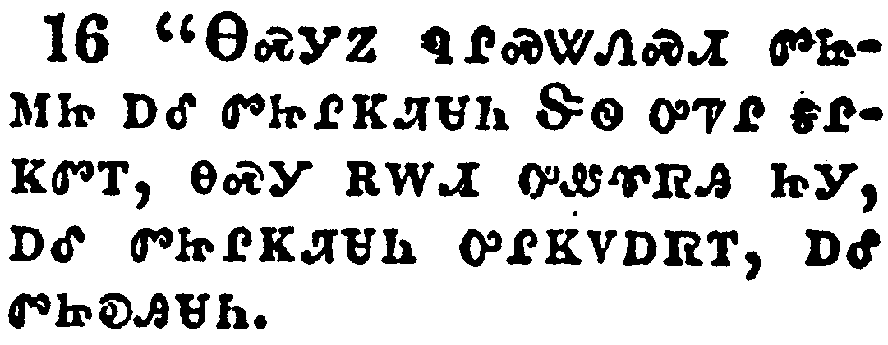</a></td>
</tr>
<tr class="even">
<td>After this I will return, and will build again the tabernacle of David, which is fallen down; and I will build again the ruins thereof, and I will set it up:</td>
</tr>
<tr class="odd">
<td>"ᎾᏍᎩᏃ ᏄᎵᏍᏔᏁᏍᏗ ᏛᏥᎷᏥ ᎠᎴ ᏛᏥᎵᏦᏘᏌᏂ ᏕᏫ ᎤᏤᎵ ᎦᎵᏦᏛᎢ, ᎾᏍᎩ ᎡᎳᏗ ᎤᏪᏡᏒᎯ ᏥᎩ, ᎠᎴ ᏛᏥᎵᏦᏘᏌᏂ ᎤᎵᏦᏙᎠᏒᎢ, ᎠᎴ ᏛᏥᎧᎯᏌᏂ.</td>
</tr>
<tr class="even">
<td>"Na-s-gi-no nu-li-s-ta-ne-s-di dv-tsi-lu-tsi a-le dv-tsi-li-tso-ti-sa-ni De-wi u-tse-li ga-li-tso-dv-i, na-s-gi e-la-di u-we-tlu-sv-hi tsi-gi, a-le dv-tsi-li-tso-ti-sa-ni u-li-tso-do-a-sv-i, a-le dv-tsi-ka-hi-sa-ni.</td>
</tr>
</tbody>
</table>

<table>
<tbody>
<tr class="odd">
<td><a href="051517.png">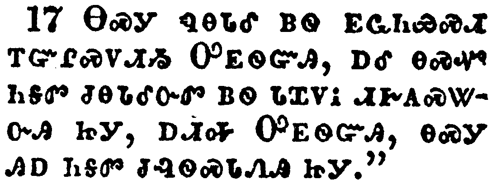</a></td>
</tr>
<tr class="even">
<td>That the residue of men might seek after the Lord, and all the Gentiles, upon whom my name is called, saith the Lord, who doeth all these things.</td>
</tr>
<tr class="odd">
<td>ᎾᏍᎩ ᏄᎾᏓᎴ ᏴᏫ ᎬᏩᏂᏯᏍᏗ ᎢᏳᎵᏍᏙᏗᏱ ᎤᎬᏫᏳᎯ, ᎠᎴ ᎾᏍᏉ ᏂᎦᏛ ᏧᎾᏓᎴᏅᏛ ᏴᏫ ᏓᏆᏙᎥ ᏗᎨᎪᏍᏔᏅᎯ ᏥᎩ, ᎠᏗᎭ ᎤᎬᏫᏳᎯ, ᎾᏍᎩ ᎯᎠ ᏂᎦᏛ ᏧᎸᏫᏍᏓᏁᎯ ᏥᎩ."</td>
</tr>
<tr class="even">
<td>Na-s-gi nu-na-da-le yv-wi gv-wa-ni-ya-s-di i-yu-li-s-do-di-yi U-gv-wi-yu-hi, a-le na-s-quo ni-ga-dv tsu-na-da-le-nv-dv yv-wi da-qua-do-v di-ge-go-s-ta-nv-hi tsi-gi, a-di-ha U-gv-wi-yu-hi, na-s-gi hi-a ni-ga-dv tsu-lv-wi-s-da-ne-hi tsi-gi."</td>
</tr>
</tbody>
</table>

<table>
<tbody>
<tr class="odd">
<td><a href="051518.png">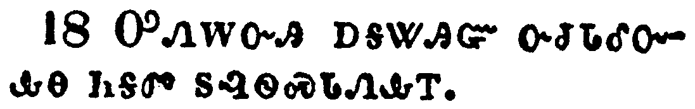</a></td>
</tr>
<tr class="even">
<td>Known unto God are all his works from the beginning of the world.</td>
</tr>
<tr class="odd">
<td>ᎤᏁᎳᏅᎯ ᎠᎦᏔᎯᏳ ᏅᏧᏓᎴᏅᎲᎾ ᏂᎦᏛ ᏚᎸᏫᏍᏓᏁᎲᎢ.</td>
</tr>
<tr class="even">
<td>U-ne-la-nv-hi a-ga-ta-hi-yu nv-tsu-da-le-nv-hv-na ni-ga-dv du-lv-wi-s-da-ne-hv-i.</td>
</tr>
</tbody>
</table>

<table>
<tbody>
<tr class="odd">
<td><a href="051519.png">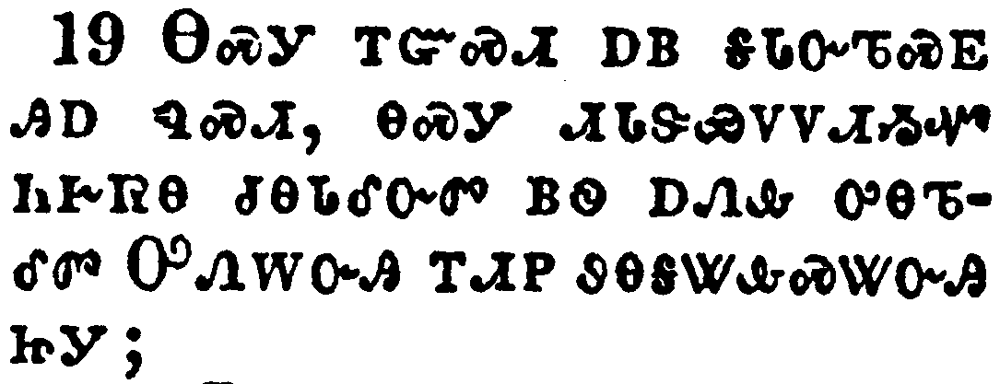</a></td>
</tr>
<tr class="even">
<td>Wherefore my sentence is, that we trouble not them, which from among the Gentiles are turned to God:</td>
</tr>
<tr class="odd">
<td>ᎾᏍᎩ ᎢᏳᏍᏗ ᎠᏴ ᎦᏓᏅᏖᏍᎬ ᎯᎠ ᏄᏍᏗ, ᎾᏍᎩ ᏗᏓᏕᏯᏙᏙᏗᏱᏉ ᏂᎨᏒᎾ ᏧᎾᏓᎴᏅᏛ ᏴᏫ ᎠᏁᎲ ᎤᎾᏖᎴᏛ ᎤᏁᎳᏅᎯ ᎢᏗᏢ ᏭᎾᎦᏔᎲᏍᏔᏅᎯ ᏥᎩ;</td>
</tr>
<tr class="even">
<td>Na-s-gi i-yu-s-di a-yv ga-da-nv-te-s-gv hi-a nu-s-di, na-s-gi di-da-de-ya-do-do-di-yi-quo ni-ge-sv-na tsu-na-da-le-nv-dv yv-wi a-ne-hv u-na-te-le-dv U-ne-la-nv-hi i-di-tlv wu-na-ga-ta-hv-s-ta-nv-hi tsi-gi;</td>
</tr>
</tbody>
</table>

<table>
<tbody>
<tr class="odd">
<td><a href="051520.png">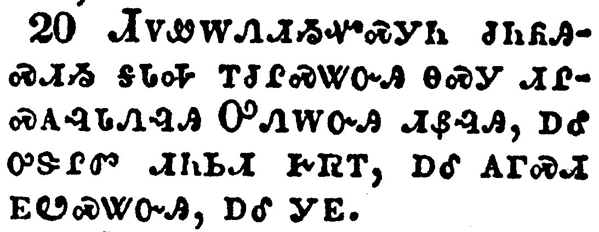</a></td>
</tr>
<tr class="even">
<td>But that we write unto them, that they abstain from pollutions of idols, and from fornication, and from things strangled, and from blood.</td>
</tr>
<tr class="odd">
<td>ᏗᏙᏪᎳᏁᏗᏱᏉᏍᎩᏂ ᏧᏂᏲᎯᏍᏗᏱ ᎦᏓᎭ ᎢᏧᎵᏍᏔᏅᎯ ᎾᏍᎩ ᏗᎵᏍᎪᎸᏓᏁᎸᎯ ᎤᏁᎳᏅᎯ ᏗᏰᎸᎯ, ᎠᎴ ᎤᏕᎵᏛ ᏗᏂᏏᏗ ᎨᏒᎢ, ᎠᎴ ᎪᎱᏍᏗ ᎬᏬᏍᏔᏅᎯ, ᎠᎴ ᎩᎬ.</td>
</tr>
<tr class="even">
<td>Di-do-we-la-ne-di-yi-quo-s-gi-ni tsu-ni-yo-hi-s-di-yi ga-da-ha i-tsu-li-s-ta-nv-hi na-s-gi di-li-s-go-lv-da-ne-lv-hi U-ne-la-nv-hi di-ye-lv-hi, a-le u-de-li-dv di-ni-si-di ge-sv-i, a-le go-hu-s-di gv-wo-s-ta-nv-hi, a-le gi-gv.</td>
</tr>
</tbody>
</table>

<table>
<tbody>
<tr class="odd">
<td><a href="051521.png">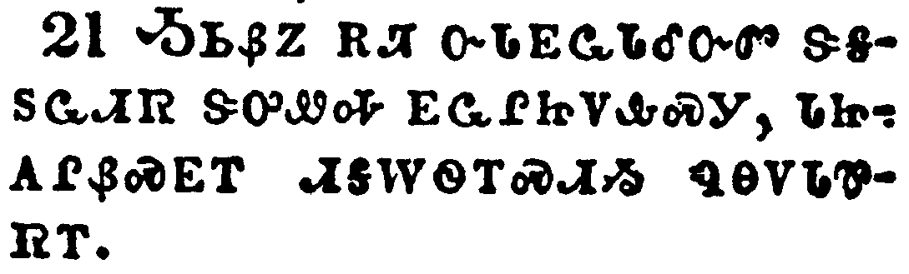</a></td>
</tr>
<tr class="even">
<td>For Moses of old time hath in every city them that preach him, being read in the synagogues every sabbath day.</td>
</tr>
<tr class="odd">
<td>ᎼᏏᏰᏃ ᎡᏘ ᏅᏓᎬᏩᏓᎴᏅᏛ ᏕᎦᏚᏩᏗᏒ ᏕᎤᏪᎭ ᎬᏩᎵᏥᏙᎲᏍᎩ, ᏓᏥᎪᎵᏰᏍᎬᎢ ᏗᎦᎳᏫᎢᏍᏗᏱ ᏄᎾᏙᏓᏈᏒᎢ.</td>
</tr>
<tr class="even">
<td>Mo-si-ye-no e-ti nv-da-gv-wa-da-le-nv-dv de-ga-du-wa-di-sv de-u-we-ha gv-wa-li-tsi-do-hv-s-gi, da-tsi-go-li-ye-s-gv-i di-ga-la-wi-i-s-di-yi nu-na-do-da-qui-sv-i.</td>
</tr>
</tbody>
</table>

<table>
<tbody>
<tr class="odd">
<td><a href="051522.png">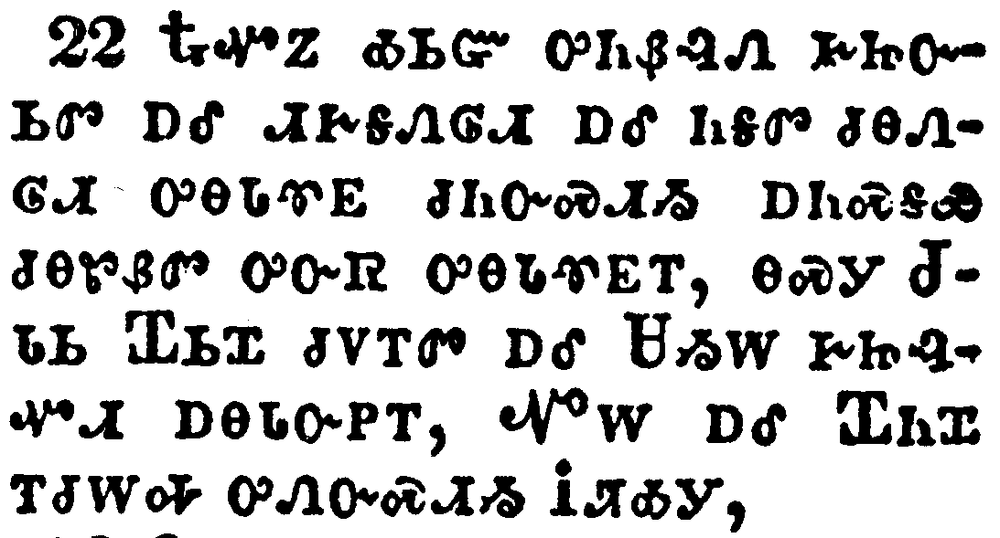</a></td>
</tr>
<tr class="even">
<td>Then pleased it the apostles and elders, with the whole church, to send chosen men of their own company to Antioch with Paul and Barnabas; namely, Judas surnamed Barsabas, and Silas, chief men among the brethren:</td>
</tr>
<tr class="odd">
<td>ᎿᎭᏉᏃ ᎣᏏᏳ ᎤᏂᏰᎸᏁ ᎨᏥᏅᏏᏛ ᎠᎴ ᏗᎨᎦᏁᎶᏗ ᎠᎴ ᏂᎦᏛ ᏧᎾᏁᎶᏗ ᎤᎾᏓᏡᎬ ᏧᏂᏅᏍᏗᏱ ᎠᏂᏍᎦᏯ ᏧᎾᏑᏰᏛ ᎤᏅᏒ ᎤᎾᏓᏡᎬᎢ, ᎾᏍᎩ ᏧᏓᏏ ᏆᏏᏆ ᏧᏙᎢᏛ ᎠᎴ ᏌᏱᎳ ᎨᏥᎸᏉᏗ ᎠᎾᏓᏅᏢᎢ, ᏉᎳ ᎠᎴ ᏆᏂᏆ ᎢᏧᎳᎭ ᎤᏁᏅᏍᏗᏱ ᎥᏘᏍᎩ,</td>
</tr>
<tr class="even">
<td>Hna-quo-no o-si-yu u-ni-ye-lv-ne ge-tsi-nv-si-dv a-le di-ge-ga-ne-lo-di a-le ni-ga-dv tsu-na-ne-lo-di u-na-da-tlu-gv tsu-ni-nv-s-di-yi a-ni-s-ga-ya tsu-na-su-ye-dv u-nv-sv u-na-da-tlu-gv-i, na-s-gi Tsu-da-si Qua-si-qua tsu-do-i-dv a-le Sa-yi-la ge-tsi-lv-quo-di a-na-da-nv-tlv-i, Quo-la a-le Qua-ni-qua i-tsu-la-ha u-ne-nv-s-di-yi V-ti-s-gi,</td>
</tr>
</tbody>
</table>

<table>
<tbody>
<tr class="odd">
<td><a href="051523.png">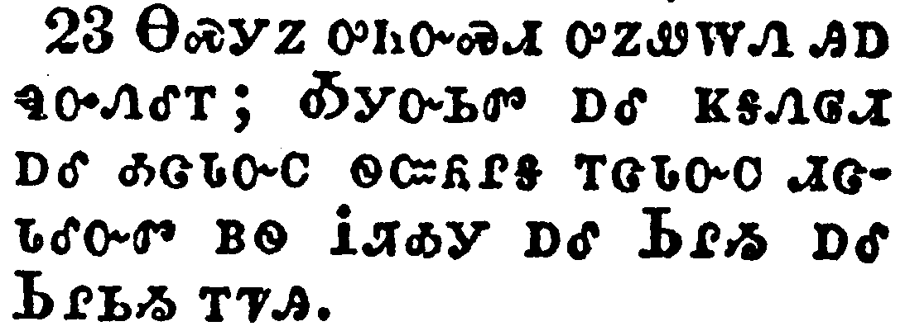</a></td>
</tr>
<tr class="even">
<td>And they wrote letters by them after this manner; The apostles and elders and brethren send greeting unto the brethren which are of the Gentiles in Antioch and Syria and Cilicia:</td>
</tr>
<tr class="odd">
<td>ᎾᏍᎩᏃ ᎤᏂᏅᏍᏗ ᎤᏃᏪᎳᏁ ᎯᎠ ᏄᏅᏁᎴᎢ; ᎣᎩᏅᏏᏛ ᎠᎴ ᏦᎦᏁᎶᏗ ᎠᎴ ᎣᏣᏓᏅᏟ ᏫᏨᏲᎵᎦ ᎢᏣᏓᏅᏟ ᏗᏣᏓᎴᏅᏛ ᏴᏫ ᎥᏘᏍᎩ ᎠᎴ ᏏᎵᏱ ᎠᎴ ᏏᎵᏏᏱ ᎢᏤᎯ.</td>
</tr>
<tr class="even">
<td>Na-s-gi-no u-ni-nv-s-di u-no-we-la-ne hi-a nu-nv-ne-le-i; O-gi-nv-si-dv a-le tso-ga-ne-lo-di a-le o-tsa-da-nv-tli wi-tsv-yo-li-ga i-tsa-da-nv-tli di-tsa-da-le-nv-dv yv-wi V-ti-s-gi a-le Si-li-yi a-le Si-li-si-yi i-tse-hi.</td>
</tr>
</tbody>
</table>

<table>
<tbody>
<tr class="odd">
<td><a href="051524.png">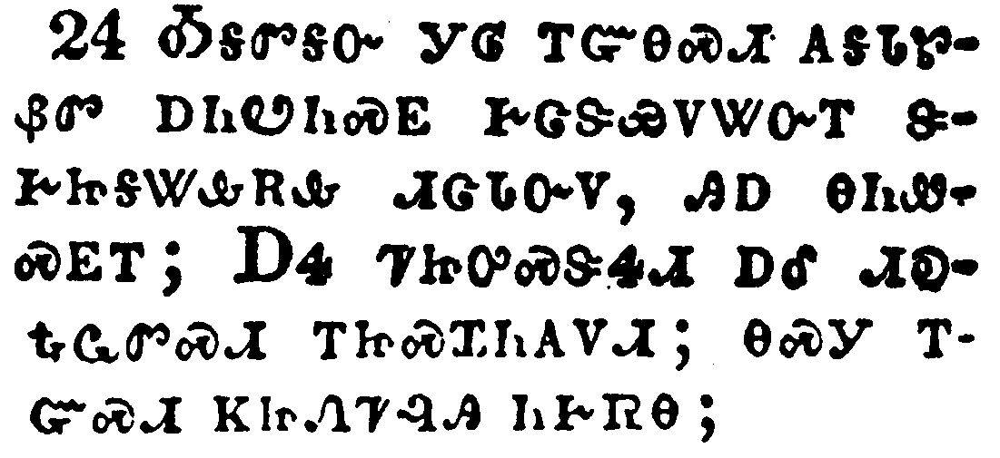</a></td>
</tr>
<tr class="even">
<td>Forasmuch as we have heard, that certain which went out from us have troubled you with words, subverting your souls, saying, Ye must be circumcised, and keep the law: to whom we gave no such commandment:</td>
</tr>
<tr class="odd">
<td>ᎣᎬᏛᎦᏅ ᎩᎶ ᎢᏳᎾᏍᏗ ᎪᎦᏓᏑᏰᏛ ᎠᏂᏬᏂᏍᎬ ᎨᏣᏕᏯᏙᏔᏅᎢ ᏕᎨᏥᎦᏔᎲᎡᎲ ᏗᏣᏓᏅᏙ, ᎯᎠ ᎾᏂᏪᏍᎬᎢ; ᎠᏎ ᏤᏥᎤᏍᏕᏎᏗ ᎠᎴ ᏗᎧᎿᎭᏩᏛᏍᏗ ᎢᏥᏍᏆᏂᎪᏙᏗ; ᎾᏍᎩ ᎢᏳᏍᏗ ᏦᏥᏁᏤᎸᎯ ᏂᎨᏒᎾ;</td>
</tr>
<tr class="even">
<td>O-gv-dv-ga-nv gi-lo i-yu-na-s-di go-ga-da-su-ye-dv a-ni-wo-ni-s-gv ge-tsa-de-ya-do-ta-nv-i de-ge-tsi-ga-ta-hv-e-hv di-tsa-da-nv-do, hi-a na-ni-we-s-gv-i; A-se tse-tsi-u-s-de-se-di a-le di-ka-hna-wa-dv-s-di i-tsi-s-qua-ni-go-do-di; na-s-gi i-yu-s-di tso-tsi-ne-tse-lv-hi ni-ge-sv-na;</td>
</tr>
</tbody>
</table>

<table>
<tbody>
<tr class="odd">
<td><a href="051525.png">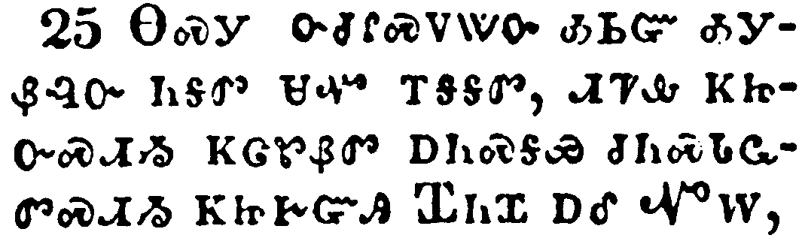</a></td>
</tr>
<tr class="even">
<td>It seemed good unto us, being assembled with one accord, to send chosen men unto you with our beloved Barnabas and Paul,</td>
</tr>
<tr class="odd">
<td>ᎾᏍᎩ ᏅᏧᎵᏍᏙᏔᏅ ᎣᏏᏳ ᎣᎩᏰᎸᏅ ᏂᎦᏛ ᏌᏉ ᎢᎦᎦᏛ, ᏗᏤᎲ ᏦᏥᏅᏍᏗᏱ ᏦᏣᏑᏰᏛ ᎠᏂᏍᎦᏯ ᏧᏂᏍᏓᏩᏛᏍᏗᏱ ᏦᏥᎨᏳᎯ ᏆᏂᏆ ᎠᎴ ᏉᎳ,</td>
</tr>
<tr class="even">
<td>Na-s-gi nv-tsu-li-s-do-ta-nv o-si-yu o-gi-ye-lv-nv ni-ga-dv sa-quo i-ga-ga-dv, di-tse-hv tso-tsi-nv-s-di-yi tso-tsa-su-ye-dv a-ni-s-ga-ya tsu-ni-s-da-wa-dv-s-di-yi tso-tsi-ge-yu-hi Qua-ni-qua a-le Quo-la,</td>
</tr>
</tbody>
</table>

<table>
<tbody>
<tr class="odd">
<td><a href="051526.png">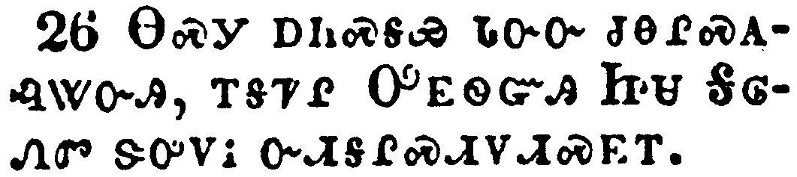</a></td>
</tr>
<tr class="even">
<td>Men that have hazarded their lives for the name of our Lord Jesus Christ.</td>
</tr>
<tr class="odd">
<td>ᎾᏍᎩ ᎠᏂᏍᎦᏯ ᏓᏅᏅ ᏧᎾᎵᏍᎪᎸᏔᏅᎯ, ᎢᎦᏤᎵ ᎤᎬᏫᏳᎯ ᏥᏌ ᎦᎶᏁᏛ ᏕᎤᏙᎥ ᏅᏗᎦᎵᏍᏗᏙᏗᏍᎬᎢ.</td>
</tr>
<tr class="even">
<td>Na-s-gi a-ni-s-ga-ya da-nv-nv tsu-na-li-s-go-lv-ta-nv-hi, i-ga-tse-li U-gv-wi-yu-hi Tsi-sa Ga-lo-ne-dv de-u-do-v nv-di-ga-li-s-di-do-di-s-gv-i.</td>
</tr>
</tbody>
</table>

<table>
<tbody>
<tr class="odd">
<td><a href="051527.png">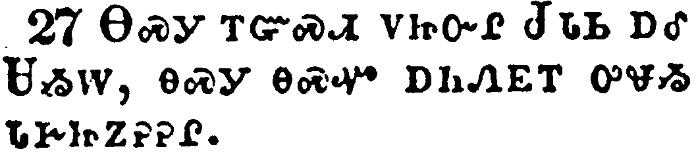</a></td>
</tr>
<tr class="even">
<td>We have sent therefore Judas and Silas, who shall also tell you the same things by mouth.</td>
</tr>
<tr class="odd">
<td>ᎾᏍᎩ ᎢᏳᏍᏗ ᏙᏥᏅᎵ ᏧᏓᏏ ᎠᎴ ᏌᏱᎳ, ᎾᏍᎩ ᎾᏍᏉ ᎠᏂᏁᎬᎢ ᎤᏠᏱ ᏓᎨᏥᏃᎮᎮᎵ.</td>
</tr>
<tr class="even">
<td>Na-s-gi i-yu-s-di do-tsi-nv-li Tsu-da-si a-le Sa-yi-la, na-s-gi na-s-quo a-ni-ne-gv-i u-tlo-yi da-ge-tsi-no-he-he-li.</td>
</tr>
</tbody>
</table>

<table>
<tbody>
<tr class="odd">
<td><a href="051528.png">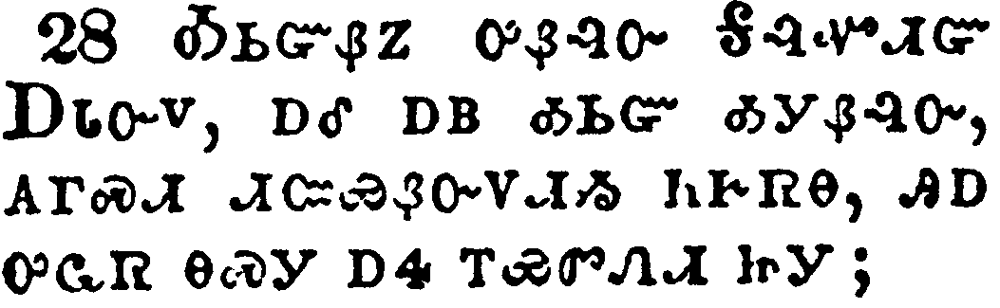</a></td>
</tr>
<tr class="even">
<td>For it seemed good to the Holy Ghost, and to us, to lay upon you no greater burden than these necessary things;</td>
</tr>
<tr class="odd">
<td>ᎣᏏᏳᏰᏃ ᎤᏰᎸᏅ ᎦᎸᏉᏗᏳ ᎠᏓᏅᏙ, ᎠᎴ ᎠᏴ ᎣᏏᏳ ᏍᎩᏰᎸᏅ, ᎪᎱᏍᏗ ᏗᏨᏯᏰᏅᏙᏗᏱ ᏂᎨᏒᎾ, ᎯᎠ ᎤᏩᏒ ᎾᏍᎩ ᎠᏎ ᎢᏯᏛᏁᏗ ᏥᎩ;</td>
</tr>
<tr class="even">
<td>O-si-yu-ye-no u-ye-lv-nv Ga-lv-quo-di-yu A-da-nv-do, a-le a-yv o-si-yu s-gi-ye-lv-nv, go-hu-s-di di-tsv-ya-ye-nv-do-di-yi ni-ge-sv-na, hi-a u-wa-sv na-s-gi a-se i-ya-dv-ne-di tsi-gi;</td>
</tr>
</tbody>
</table>

<table>
<tbody>
<tr class="odd">
<td><a href="051529.png">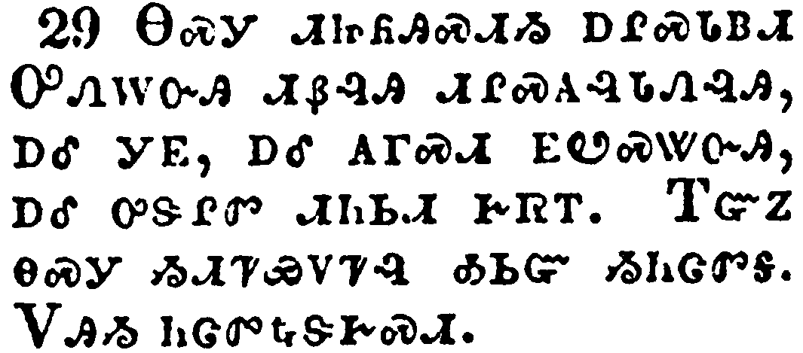</a></td>
</tr>
<tr class="even">
<td>That ye abstain from meats offered to idols, and from blood, and from things strangled, and from fornication: from which if ye keep yourselves, ye shall do well. Fare ye well.</td>
</tr>
<tr class="odd">
<td>ᎾᏍᎩ ᏗᏥᏲᎯᏍᏗᏱ ᎠᎵᏍᏓᏴᏗ ᎤᏁᎳᏅᎯ ᏗᏰᎸᎯ ᏗᎵᏍᎪᎸᏓᏁᎸᎯ, ᎠᎴ ᎩᎬ, ᎠᎴ ᎪᎱᏍᏗ ᎬᏬᏍᏔᏅᎯ, ᎠᎴ ᎤᏕᎵᏛ ᏗᏂᏏᏗ ᎨᏒᎢ. ᎢᏳᏃ ᎾᏍᎩ ᏱᏗᏤᏯᏙᏤᎸ ᎣᏏᏳ ᏱᏂᏣᏛᎦ. ᏙᎯᏱ ᏂᏣᏛᎿᎭᏕᎨᏍᏗ.</td>
</tr>
<tr class="even">
<td>Na-s-gi di-tsi-yo-hi-s-di-yi a-li-s-da-yv-di U-ne-la-nv-hi di-ye-lv-hi di-li-s-go-lv-da-ne-lv-hi, a-le gi-gv, a-le go-hu-s-di gv-wo-s-ta-nv-hi, a-le u-de-li-dv di-ni-si-di ge-sv-i. I-yu-no na-s-gi yi-di-tse-ya-do-tse-lv o-si-yu yi-ni-tsa-dv-ga. Do-hi-yi ni-tsa-dv-hna-de-ge-s-di.</td>
</tr>
</tbody>
</table>

<table>
<tbody>
<tr class="odd">
<td><a href="051530.png">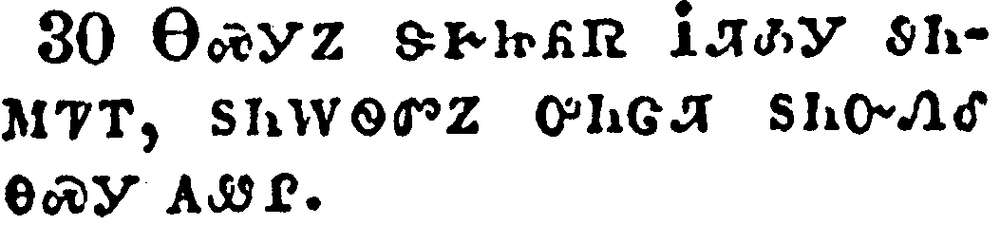</a></td>
</tr>
<tr class="even">
<td>So when they were dismissed, they came to Antioch: and when they had gathered the multitude together, they delivered the epistle:</td>
</tr>
<tr class="odd">
<td>ᎾᏍᎩᏃ ᏕᎨᏥᏲᏒ ᎥᏘᎣᎩ ᏭᏂᎷᏤᎢ, ᏚᏂᎳᏫᏛᏃ ᎤᏂᏣᏘ ᏚᏂᏅᏁᎴ ᎾᏍᎩ ᎪᏪᎵ.</td>
</tr>
<tr class="even">
<td>Na-s-gi-no de-ge-tsi-yo-sv V-ti-o-gi wu-ni-lu-tse-i, du-ni-la-wi-dv-no u-ni-tsa-ti du-ni-nv-ne-le na-s-gi go-we-li.</td>
</tr>
</tbody>
</table>

<table>
<tbody>
<tr class="odd">
<td><a href="051531.png">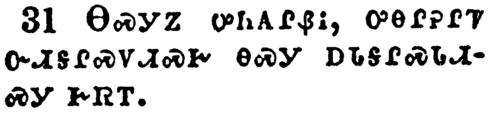</a></td>
</tr>
<tr class="even">
<td>Which when they had read, they rejoiced for the consolation.</td>
</tr>
<tr class="odd">
<td>ᎾᏍᎩᏃ ᎤᏂᎪᎵᏰᎥ, ᎤᎾᎵᎮᎵᏤ ᏅᏗᎦᎵᏍᏙᏗᏍᎨ ᎾᏍᎩ ᎠᏓᎦᎵᏍᏓᏗᏍᎩ ᎨᏒᎢ</td>
</tr>
<tr class="even">
<td>Na-s-gi-no u-ni-go-li-ye-v, u-na-li-he-li-tse nv-di-ga-li-s-do-di-s-ge na-s-gi a-da-ga-li-s-da-di-s-gi ge-sv-i</td>
</tr>
</tbody>
</table>

<table>
<tbody>
<tr class="odd">
<td><a href="051532.png">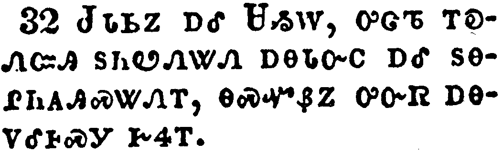</a></td>
</tr>
<tr class="even">
<td>And Judas and Silas, being prophets also themselves, exhorted the brethren with many words, and confirmed them.</td>
</tr>
<tr class="odd">
<td>ᏧᏓᏏᏃ ᎠᎴ ᏌᏱᎳ, ᎤᏣᏖ ᎢᎧᏁᏨᎯ ᏚᏂᏬᏁᏔᏁ ᎠᎾᏓᏅᏟ ᎠᎴ ᏚᎾᎵᏂᎪᎯᏍᏔᏁᎢ, ᎾᏍᏉᏰᏃ ᎤᏅᏒ ᎠᎾᏙᎴᎰᏍᎩ ᎨᏎᎢ.</td>
</tr>
<tr class="even">
<td>Tsu-da-si-no a-le Sa-yi-la, u-tsa-te i-ka-ne-tsv-hi du-ni-wo-ne-ta-ne a-na-da-nv-tli a-le du-na-li-ni-go-hi-s-ta-ne-i, na-s-quo-ye-no u-nv-sv a-na-do-le-ho-s-gi ge-se-i.</td>
</tr>
</tbody>
</table>

<table>
<tbody>
<tr class="odd">
<td><a href="051533.png">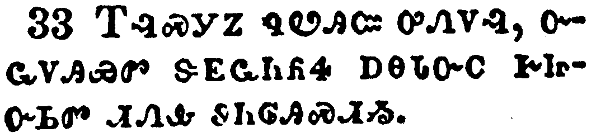</a></td>
</tr>
<tr class="even">
<td>And after they had tarried there a space, they were let go in peace from the brethren unto the apostles.</td>
</tr>
<tr class="odd">
<td>ᎢᎸᏍᎩᏃ ᏄᏬᎯᏨ ᎤᏁᏙᎸ, ᏅᏩᏙᎯᏯᏛ ᏕᎬᏩᏂᏲᏎ ᎠᎾᏓᏅᏟ ᎨᏥᏅᏏᏛ ᏗᏁᎲ ᏭᏂᎶᎯᏍᏗᏱ.</td>
</tr>
<tr class="even">
<td>I-lv-s-gi-no nu-wo-hi-tsv u-ne-do-lv, nv-wa-do-hi-ya-dv de-gv-wa-ni-yo-se a-na-da-nv-tli ge-tsi-nv-si-dv di-ne-hv wu-ni-lo-hi-s-di-yi.</td>
</tr>
</tbody>
</table>

<table>
<tbody>
<tr class="odd">
<td><a href="051534.png">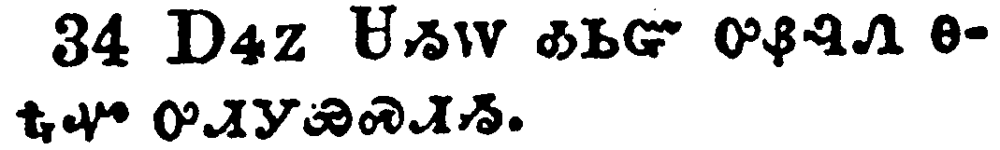</a></td>
</tr>
<tr class="even">
<td>Notwithstanding it pleased Silas to abide there still.</td>
</tr>
<tr class="odd">
<td>ᎠᏎᏃ ᏌᏱᎳ ᎣᏏᏳ ᎤᏰᎸᏁ ᎾᎿᎭᏉ ᎤᏗᎩᏯᏍᏗᏱ.</td>
</tr>
<tr class="even">
<td>A-se-no Sa-yi-la o-si-yu u-ye-lv-ne na-hna-quo u-di-gi-ya-s-di-yi.</td>
</tr>
</tbody>
</table>

<table>
<tbody>
<tr class="odd">
<td><a href="051535.png">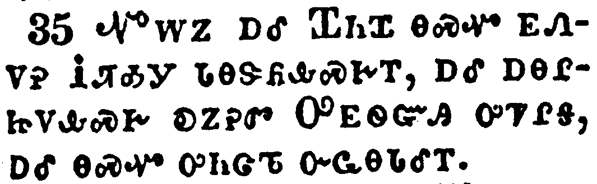</a></td>
</tr>
<tr class="even">
<td>Paul also and Barnabas continued in Antioch, teaching and preaching the word of the Lord, with many others also.</td>
</tr>
<tr class="odd">
<td>ᏉᎳᏃ ᎠᎴ ᏆᏂᏆ ᎾᏍᏉ ᎬᏁᏙᎮ ᎥᏘᎣᎩ ᏓᎾᏕᏲᎲᏍᎨᎢ, ᎠᎴ ᎠᎾᎵᏥᏙᎲᏍᎨ ᎧᏃᎮᏛ ᎤᎬᏫᏳᎯ ᎤᏤᎵᎦ, ᎠᎴ ᎾᏍᏉ ᎤᏂᏣᏖ ᏅᏩᎾᏓᎴᎢ.</td>
</tr>
<tr class="even">
<td>Quo-la-no a-le Qua-ni-qua na-s-quo gv-ne-do-he V-ti-o-gi da-na-de-yo-hv-s-ge-i, a-le a-na-li-tsi-do-hv-s-ge ka-no-he-dv U-gv-wi-yu-hi u-tse-li-ga, a-le na-s-quo u-ni-tsa-te nv-wa-na-da-le-i.</td>
</tr>
</tbody>
</table>

<table>
<tbody>
<tr class="odd">
<td><a href="051536.png">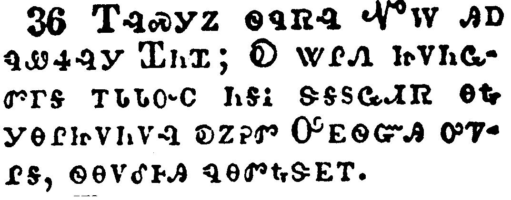</a></td>
</tr>
<tr class="even">
<td>And some days after Paul said unto Barnabas, Let us go again and visit our brethren in every city where we have preached the word of the Lord, and see how they do.</td>
</tr>
<tr class="odd">
<td>ᎢᎸᏍᎩᏃ ᏫᏄᏒᎸ ᏉᎳ ᎯᎠ ᏄᏪᏎᎸᎩ ᏆᏂᏆ; Ꭷ ᏔᎵᏁ ᏥᏙᏂᏩᏛᎱᎦ ᎢᏓᏓᏅᏟ ᏂᎦᎥ ᏕᎦᏚᏩᏗᏒ ᎾᎿᎭᎩᎾᎵᏥᏙᏂᏙᎸ ᎧᏃᎮᏛ ᎤᎬᏫᏳᎯ ᎤᏤᎵᎦ, ᏫᎾᏙᎴᎰᎯ ᏄᎾᏛᎿᎭᏕᎬᎢ.</td>
</tr>
<tr class="even">
<td>I-lv-s-gi-no wi-nu-sv-lv Quo-la hi-a nu-we-se-lv-gi Qua-ni-qua; Ka ta-li-ne tsi-do-ni-wa-dv-hu-ga i-da-da-nv-tli ni-ga-v de-ga-du-wa-di-sv na-hna gi-na-li-tsi-do-ni-do-lv ka-no-he-dv U-gv-wi-yu-hi u-tse-li-ga, wi-na-do-le-ho-hi nu-na-dv-hna-de-gv-i.</td>
</tr>
</tbody>
</table>

<table>
<tbody>
<tr class="odd">
<td><a href="051537.png">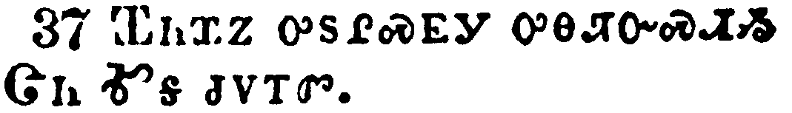</a></td>
</tr>
<tr class="even">
<td>And Barnabas determined to take with them John, whose surname was Mark.</td>
</tr>
<tr class="odd">
<td>ᏆᏂᏆᏃ ᎤᏚᎵᏍᎬᎩ ᎤᎾᏘᏅᏍᏗᏱ ᏣᏂ ᎹᎦ ᏧᏙᎢᏛ.</td>
</tr>
<tr class="even">
<td>Qua-ni-qua-no u-du-li-s-gv-gi u-na-ti-nv-s-di-yi Tsa-ni Ma-ga tsu-do-i-dv.</td>
</tr>
</tbody>
</table>

<table>
<tbody>
<tr class="odd">
<td><a href="051538.png">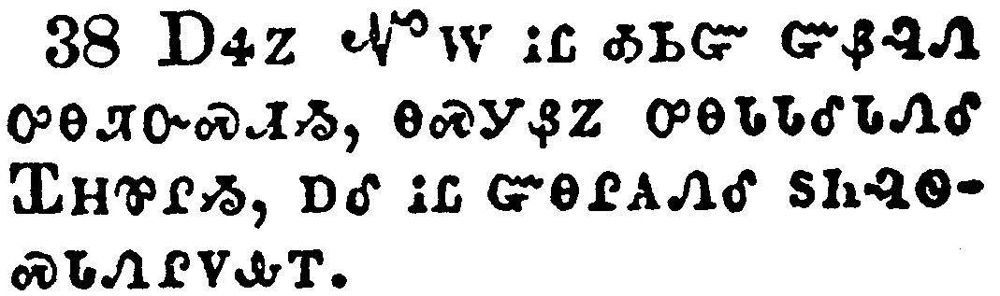</a></td>
</tr>
<tr class="even">
<td>But Paul thought not good to take him with them, who departed from them from Pamphylia, and went not with them to the work.</td>
</tr>
<tr class="odd">
<td>ᎠᏎᏃ ᏉᎳ ᎥᏝ ᎣᏏᏳ ᏳᏰᎸᏁ ᎤᎾᏘᏅᏍᏗᏱ, ᎾᏍᎩᏰᏃ ᎤᎾᏓᏓᎴᏓᏁᎴ ᏆᎻᏈᎵᏱ, ᎠᎴ ᎥᏝ ᏳᎾᎵᎪᏁᎴ ᏚᏂᎸᏫᏍᏓᏁᎵᏙᎲᎢ.</td>
</tr>
<tr class="even">
<td>A-se-no Quo-la v-tla o-si-yu yu-ye-lv-ne u-na-ti-nv-s-di-yi, na-s-gi-ye-no u-na-da-da-le-da-ne-le Qua-mi-qui-li-yi, a-le v-tla yu-na-li-go-ne-le du-ni-lv-wi-s-da-ne-li-do-hv-i.</td>
</tr>
</tbody>
</table>

<table>
<tbody>
<tr class="odd">
<td></td>
</tr>
<tr class="even">
<td>And the contention was so sharp between them, that they departed asunder one from the other: and so Barnabas took Mark, and sailed unto Cyprus;</td>
</tr>
<tr class="odd">
<td>ᎠᎴ ᎤᏣᏘ ᎤᏂᏲᏠᎯᏎᎸᎩ, ᎾᏍᎩ ᎢᏳᏍᏗ ᏫᏕᎬᏩᎾᎦᎴᏅᎲᎩ; ᏆᏂᏆᏃ ᎤᏘᏅᏒᎩ ᎹᎦ, ᎠᎴ ᏥᏳᎯ ᏭᏣᏅ ᏌᏈ ᏭᎶᏒᎩ.</td>
</tr>
<tr class="even">
<td>A-le u-tsa-ti u-ni-yo-tlo-hi-se-lv-gi, na-s-gi i-yu-s-di wi-de-gv-wa-na-ga-le-nv-hv-gi; Qua-ni-qua-no u-ti-nv-sv-gi Ma-ga, a-le tsi-yu-hi wu-tsa-nv Sa-qui wu-lo-sv-gi.</td>
</tr>
</tbody>
</table>

<table>
<tbody>
<tr class="odd">
<td><a href="051540.png">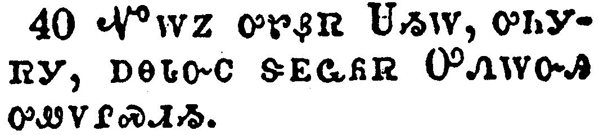</a></td>
</tr>
<tr class="even">
<td>And Paul chose Silas, and departed, being recommended by the brethren unto the grace of God.</td>
</tr>
<tr class="odd">
<td>ᏉᎳᏃ ᎤᏑᏰᏒ ᏌᏱᎳ, ᎤᏂᎩᏒᎩ, ᎠᎾᏓᏅᏟ ᏕᎬᏩᏲᏒ ᎤᏁᎳᏅᎯ ᎤᏪᏙᎵᏍᏗᏱ.</td>
</tr>
<tr class="even">
<td>Quo-la-no u-su-ye-sv Sa-yi-la, u-ni-gi-sv-gi, a-na-da-nv-tli de-gv-wa-yo-sv U-ne-la-nv-hi u-we-do-li-s-di-yi.</td>
</tr>
</tbody>
</table>

<table>
<tbody>
<tr class="odd">
<td><a href="051541.png">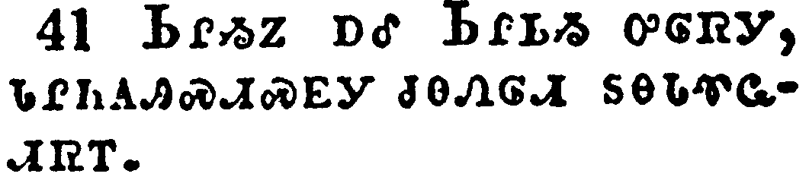</a></td>
</tr>
<tr class="even">
<td>And he went through Syria and Cilicia, confirming the churches.</td>
</tr>
<tr class="odd">
<td>ᏏᎵᏱᏃ ᎠᎴ ᏏᎵᏏᏱ ᎤᎶᏒᎩ, ᏓᎵᏂᎪᎯᏍᏗᏍᎬᎩ ᏧᎾᏁᎶᏗ ᏚᎾᏓᏡᏩᏗᏒᎢ.</td>
</tr>
<tr class="even">
<td>Si-li-yi-no a-le Si-li-si-yi u-lo-sv-gi, da-li-ni-go-hi-s-di-s-gv-gi tsu-na-ne-lo-di du-na-da-tlu-wa-di-sv-i.</td>
</tr>
</tbody>
</table>

