+++
draft=false
date = 2014-12-18T21:11:07Z
title = "The Acts - Chapter 19 - Cherokee New Testament"
weight = 1418955067

[taxonomies]

authors = ["Timothy Legg"]
categories = []
tags = []

[extra]
+++

<table>
<tbody>
<tr class="odd">
<td><a href="051901.png">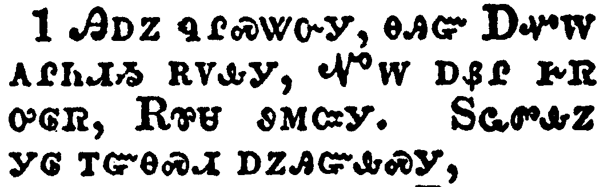</a></td>
</tr>
<tr class="even">
<td>And it came to pass, that, while Apollos was at Corinth, Paul having passed through the upper coasts came to Ephesus: and finding certain disciples,</td>
</tr>
<tr class="odd">
<td>ᎯᎠᏃ ᏄᎵᏍᏔᏅᎩ, ᎾᎯᏳ ᎠᏉᎳ ᎪᎵᏂᏗᏱ ᎡᏙᎲᎩ, ᏉᎳ ᎠᏰᎵ ᎨᏒ ᎤᎶᏒ, ᎡᏈᏌ ᏭᎷᏨᎩ. ᏚᏩᏛᎲᏃ ᎩᎶ ᎢᏳᎾᏍᏗ ᎠᏃᎯᏳᎲᏍᎩ,</td>
</tr>
<tr class="even">
<td>Hi-a-no nu-li-s-ta-nv-gi, na-hi-yu A-quo-la go-li-ni-di-yi e-do-hv-gi, Quo-la a-ye-li ge-sv u-lo-sv, E-qui-sa wu-lu-tsv-gi. Du-wa-dv-hv-no gi-lo i-yu-na-s-di a-no-hi-yu-hv-s-gi,</td>
</tr>
</tbody>
</table>

<table>
<tbody>
<tr class="odd">
<td><a href="051902.png">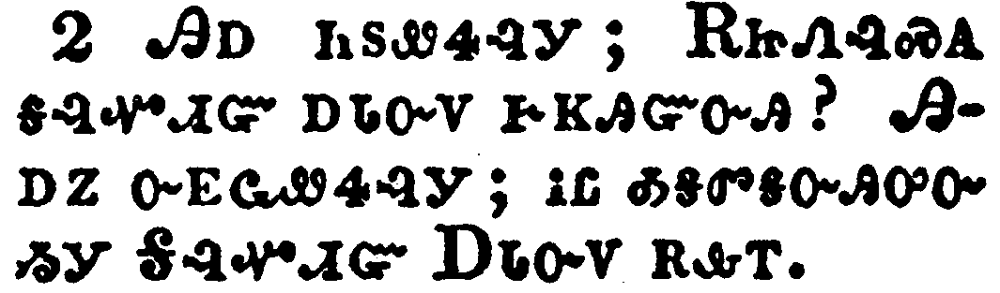</a></td>
</tr>
<tr class="even">
<td>He said unto them, Have ye received the Holy Ghost since ye believed? And they said unto him, We have not so much as heard whether there be any Holy Ghost.</td>
</tr>
<tr class="odd">
<td>ᎯᎠ ᏂᏚᏪᏎᎸᎩ; ᎡᏥᏁᎸᏍᎪ ᎦᎸᏉᏗᏳ ᎠᏓᏅᏙ ᎨᏦᎯᏳᏅᎯ? ᎯᎠᏃ ᏅᎬᏩᏪᏎᎸᎩ; ᎥᏝ ᎣᎦᏛᎦᏅᎯᎤᏅ ᏱᎩ ᎦᎸᏉᏗᏳ ᎠᏓᏅᏙ ᎡᎲᎢ.</td>
</tr>
<tr class="even">
<td>Hi-a ni-du-we-se-lv-gi; E-tsi-ne-lv-s-go ga-lv-quo-di-yu a-da-nv-do ge-tso-hi-yu-nv-hi? Hi-a-no nv-gv-wa-we-se-lv-gi; v-tla o-ga-dv-ga-nv-hi-u-nv yi-gi Ga-lv-quo-di-yu A-da-nv-do e-hv-i.</td>
</tr>
</tbody>
</table>

<table>
<tbody>
<tr class="odd">
<td><a href="051903.png">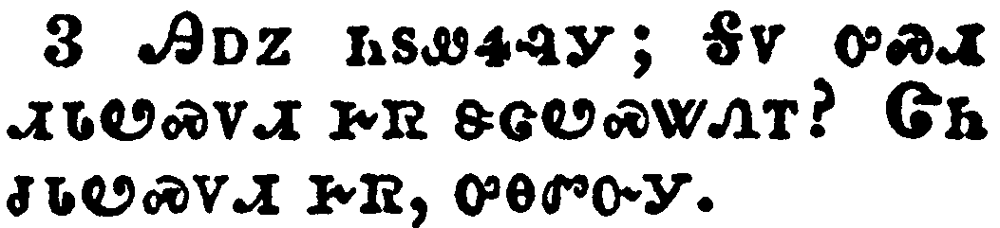</a></td>
</tr>
<tr class="even">
<td>And he said unto them, Unto what then were ye baptized? And they said, Unto John's baptism.</td>
</tr>
<tr class="odd">
<td>ᎯᎠᏃ ᏂᏚᏪᏎᎸᎩ; ᎦᏙ ᎤᏍᏗ ᏗᏓᏬᏍᏙᏗ ᎨᏒ ᏕᏣᏬᏍᏔᏁᎢ? ᏣᏂ ᏧᏓᏬᏍᏙᏗ ᎨᏒ, ᎤᎾᏛᏅᎩ.</td>
</tr>
<tr class="even">
<td>Hi-a-no ni-du-we-se-lv-gi; Ga-do u-s-di di-da-wo-s-do-di ge-sv de-tsa-wo-s-ta-ne-i? Tsa-ni tsu-da-wo-s-do-di ge-sv, u-na-dv-nv-gi.</td>
</tr>
</tbody>
</table>

<table>
<tbody>
<tr class="odd">
<td><a href="051904.png">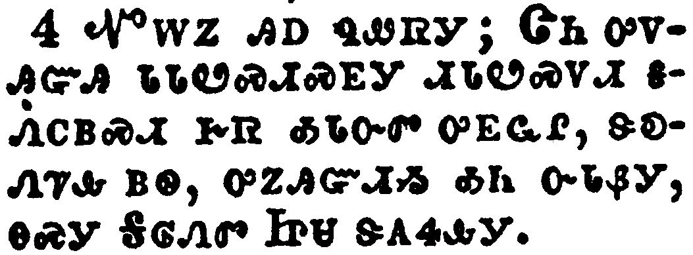</a></td>
</tr>
<tr class="even">
<td>Then said Paul, John verily baptized with the baptism of repentance, saying unto the people, that they should believe on him which should come after him, that is, on Christ Jesus.</td>
</tr>
<tr class="odd">
<td>ᏉᎳᏃ ᎯᎠ ᏄᏪᏒᎩ; ᏣᏂ ᎤᏙᎯᏳᎯ ᏓᏓᏬᏍᏗᏍᎬᎩ ᏗᏓᏬᏍᏙᏗ ᎦᏁᏟᏴᏍᏗ ᎨᏒ ᎣᏓᏅᏛ ᎤᎬᏩᎵ, ᏕᎧᏁᏤᎲ ᏴᏫ, ᎤᏃᎯᏳᏗᏱ ᎣᏂ ᏅᏓᏰᎩ, ᎾᏍᎩ ᎦᎶᏁᏛ ᏥᏌ ᏕᎪᏎᎲᎩ.</td>
</tr>
<tr class="even">
<td>Quo-la-no hi-a nu-we-sv-gi; Tsa-ni u-do-hi-yu-hi da-da-wo-s-di-s-gv-gi di-da-wo-s-do-di ga-ne-tli-yv-s-di ge-sv o-da-nv-dv u-gv-wa-li, de-ka-ne-tse-hv yv-wi, u-no-hi-yu-di-yi o-ni nv-da-ye-gi, na-s-gi Ga-lo-ne-dv Tsi-sa de-go-se-hv-gi.</td>
</tr>
</tbody>
</table>

<table>
<tbody>
<tr class="odd">
<td><a href="051905.png">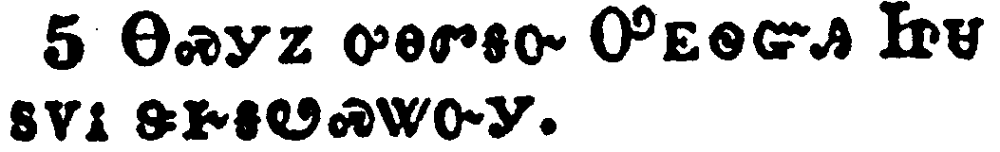</a></td>
</tr>
<tr class="even">
<td>When they heard this, they were baptized in the name of the Lord Jesus.</td>
</tr>
<tr class="odd">
<td>ᎾᏍᎩᏃ ᎤᎾᏛᎦᏅ ᎤᎬᏫᏳᎯ ᏥᏌ ᏚᏙᎥ ᏕᎨᎦᏬᏍᏔᏅᎩ.</td>
</tr>
<tr class="even">
<td>Na-s-gi-no u-na-dv-ga-nv U-gv-wi-yu-hi Tsi-sa du-do-v de-ge-ga-wo-s-ta-nv-gi.</td>
</tr>
</tbody>
</table>

<table>
<tbody>
<tr class="odd">
<td><a href="051906.png">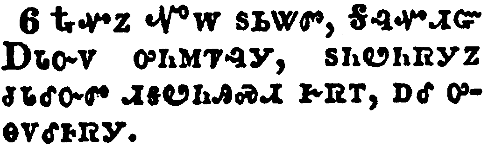</a></td>
</tr>
<tr class="even">
<td>And when Paul had laid his hands upon them, the Holy Ghost came on them; and they spake with tongues, and prophesied.</td>
</tr>
<tr class="odd">
<td>ᎿᎭᏉᏃ ᏉᎳ ᏚᏏᏔᏛ, ᎦᎸᏉᏗᏳ ᎠᏓᏅᏙ ᎤᏂᎷᏤᎸᎩ, ᏚᏂᏬᏂᏒᎩᏃ ᏧᏓᎴᏅᏛ ᏗᎦᏬᏂᎯᏍᏗ ᎨᏒᎢ, ᎠᎴ ᎤᎾᏙᎴᎰᏒᎩ.</td>
</tr>
<tr class="even">
<td>Hna-quo-no Quo-la du-si-ta-dv, Ga-lv-quo-di-yu A-da-nv-do u-ni-lu-tse-lv-gi, du-ni-wo-ni-sv-gi-no tsu-da-le-nv-dv di-ga-wo-ni-hi-s-di ge-sv-i, a-le u-na-do-le-ho-sv-gi.</td>
</tr>
</tbody>
</table>

<table>
<tbody>
<tr class="odd">
<td></td>
</tr>
<tr class="even">
<td>And all the men were about twelve.</td>
</tr>
<tr class="odd">
<td>ᎾᏍᎩᏃ ᎠᏂᏍᎦᏯ ᏂᎦᏛ ᏔᎳᏚ ᎢᏴᏛ ᎾᏂᎥᎩ.</td>
</tr>
<tr class="even">
<td>Na-s-gi-no a-ni-s-ga-ya ni-ga-dv ta-la-du i-yv-dv na-ni-v-gi.</td>
</tr>
</tbody>
</table>

<table>
<tbody>
<tr class="odd">
<td><a href="051908.png">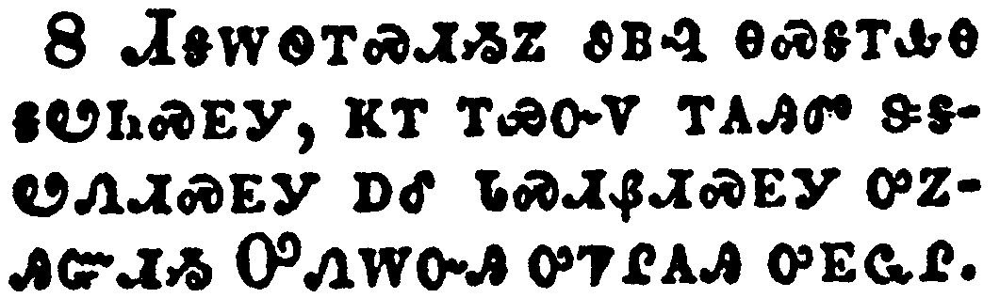</a></td>
</tr>
<tr class="even">
<td>And he went into the synagogue, and spake boldly for the space of three months, disputing and persuading the things concerning the kingdom of God.</td>
</tr>
<tr class="odd">
<td>ᏗᎦᎳᏫᎢᏍᏗᏱᏃ ᏭᏴᎸ ᎾᏍᎦᎢᎲᎾ ᎦᏬᏂᏍᎬᎩ, ᏦᎢ ᎢᏯᏅᏙ ᎢᎦᎯᏛ ᏕᎦᏬᏁᏗᏍᎬᎩ ᎠᎴ ᏓᏍᏗᏰᏗᏍᎬᎩ ᎤᏃᎯᏳᏗᏱ ᎤᏁᎳᏅᎯ ᎤᏤᎵᎪᎯ ᎤᎬᏩᎵ.</td>
</tr>
<tr class="even">
<td>Di-ga-la-wi-i-s-di-yi-no wu-yv-lv na-s-ga-i-hv-na ga-wo-ni-s-gv-gi, tso-i i-ya-nv-do i-ga-hi-dv de-ga-wo-ne-di-s-gv-gi a-le da-s-di-ye-di-s-gv-gi u-no-hi-yu-di-yi U-ne-la-nv-hi u-tse-li-go-hi u-gv-wa-li.</td>
</tr>
</tbody>
</table>

<table>
<tbody>
<tr class="odd">
<td><a href="051909.png">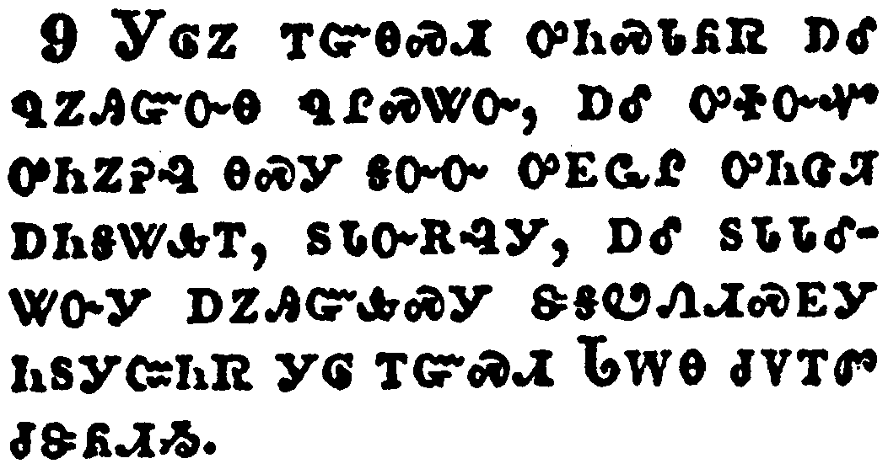</a></td>
</tr>
<tr class="even">
<td>But when divers were hardened, and believed not, but spake evil of that way before the multitude, he departed from them, and separated the disciples, disputing daily in the school of one Tyrannus.</td>
</tr>
<tr class="odd">
<td>ᎩᎶᏃ ᎢᏳᎾᏍᏗ ᎤᏂᏍᏓᏲᏒ ᎠᎴ ᏄᏃᎯᏳᏅᎾ ᏄᎵᏍᏔᏅ, ᎠᎴ ᎣᏐᏅᏉ ᎤᏂᏃᎮᎸ ᎾᏍᎩ ᎦᏅᏅ ᎤᎬᏩᎵ ᎤᏂᏣᏘ ᎠᏂᎦᏔᎲᎢ, ᏚᏓᏅᎡᎸᎩ, ᎠᎴ ᏚᏓᏓᎴᏔᏅᎩ ᎠᏃᎯᏳᎲᏍᎩ ᏕᎦᏬᏁᏗᏍᎬᎩ ᏂᏚᎩᏨᏂᏒ ᎩᎶ ᎢᏳᏍᏗ ᏓᎳᎾ ᏧᏙᎢᏛ ᏧᏕᏲᏗᏱ.</td>
</tr>
<tr class="even">
<td>Gi-lo-no i-yu-na-s-di u-ni-s-da-yo-sv a-le nu-no-hi-yu-nv-na nu-li-s-ta-nv, a-le o-so-nv-quo u-ni-no-he-lv na-s-gi ga-nv-nv u-gv-wa-li u-ni-tsa-ti a-ni-ga-ta-hv-i, du-da-nv-e-lv-gi, a-le du-da-da-le-ta-nv-gi a-no-hi-yu-hv-s-gi de-ga-wo-ne-di-s-gv-gi ni-du-gi-tsv-ni-sv gi-lo i-yu-s-di Da-la-na tsu-do-i-dv tsu-de-yo-di-yi.</td>
</tr>
</tbody>
</table>

<table>
<tbody>
<tr class="odd">
<td><a href="051910.png">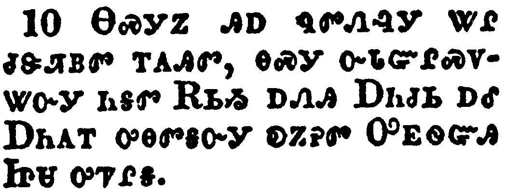</a></td>
</tr>
<tr class="even">
<td>And this continued by the space of two years; so that all they which dwelt in Asia heard the word of the Lord Jesus, both Jews and Greeks.</td>
</tr>
<tr class="odd">
<td>ᎾᏍᎩᏃ ᎯᎠ ᏄᏛᏁᎸᎩ ᏔᎵ ᏧᏕᏘᏴᏛ ᎢᎪᎯᏛ, ᎾᏍᎩ ᏅᏓᏳᎵᏍᏙᏔᏅᎩ ᏂᎦᏛ ᎡᏏᏱ ᎠᏁᎯ ᎠᏂᏧᏏ ᎠᎴ ᎠᏂᎪᎢ ᎤᎾᏛᎦᏅᎩ ᎧᏃᎮᏛ ᎤᎬᏫᏳᎯ ᏥᏌ ᎤᏤᎵᎦ.</td>
</tr>
<tr class="even">
<td>Na-s-gi-no hi-a nu-dv-ne-lv-gi ta-li tsu-de-ti-yv-dv i-go-hi-dv, na-s-gi nv-da-yu-li-s-do-ta-nv-gi ni-ga-dv E-si-yi a-ne-hi A-ni-tsu-si a-le A-ni-go-i u-na-dv-ga-nv-gi ka-no-he-dv U-gv-wi-yu-hi Tsi-sa u-tse-li-ga.</td>
</tr>
</tbody>
</table>

<table>
<tbody>
<tr class="odd">
<td><a href="051911.png">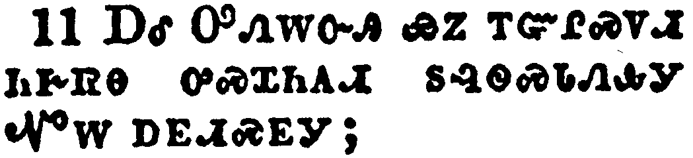</a></td>
</tr>
<tr class="even">
<td>And God wrought special miracles by the hands of Paul:</td>
</tr>
<tr class="odd">
<td>ᎠᎴ ᎤᏁᎳᏅᎯ ᏯᏃ ᎢᏳᎵᏍᏙᏗ ᏂᎨᏒᎾ ᎤᏍᏆᏂᎪᏗ ᏚᎸᏫᏍᏓᏁᎲᎩ ᏉᎳ ᎠᎬᏗᏍᎬᎩ;</td>
</tr>
<tr class="even">
<td>A-le U-ne-la-nv-hi ya-no i-yu-li-s-do-di ni-ge-sv-na u-s-qua-ni-go-di du-lv-wi-s-da-ne-hv-gi Quo-la a-gv-di-s-gv-gi;</td>
</tr>
</tbody>
</table>

<table>
<tbody>
<tr class="odd">
<td><a href="051912.png">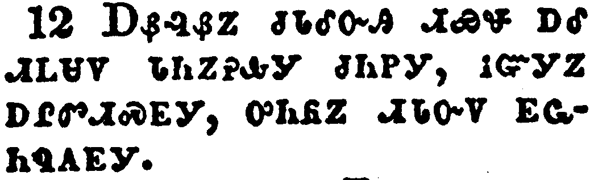</a></td>
</tr>
<tr class="even">
<td>So that from his body were brought unto the sick handkerchiefs or aprons, and the diseases departed from them, and the evil spirits went out of them.</td>
</tr>
<tr class="odd">
<td>ᎠᏰᎸᏰᏃ ᏧᏓᎴᏅᎯ ᏗᏯᏠ ᎠᎴ ᏗᏞᏌᏙ ᏓᏂᏃᎮᎲᎩ ᏧᏂᏢᎩ, ᎥᏳᎩᏃ ᎠᎵᏛᏗᏍᎬᎩ, ᎤᏂᏲᏃ ᏗᏓᏅᏙ ᎬᏩᏂᏄᎪᎬᎩ.</td>
</tr>
<tr class="even">
<td>A-ye-lv-ye-no tsu-da-le-nv-hi di-ya-tlo a-le di-tle-sa-do da-ni-no-he-hv-gi tsu-ni-tlv-gi, v-yu-gi-no a-li-dv-di-s-gv-gi, u-ni-yo-no di-da-nv-do gv-wa-ni-nu-go-gv-gi.</td>
</tr>
</tbody>
</table>

<table>
<tbody>
<tr class="odd">
<td><a href="051913.png">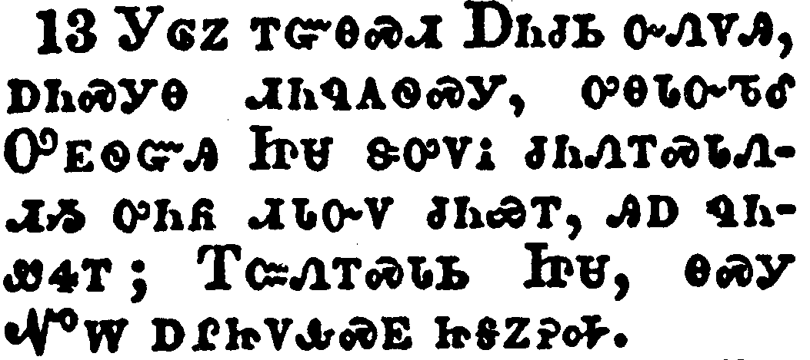</a></td>
</tr>
<tr class="even">
<td>Then certain of the vagabond Jews, exorcists, took upon them to call over them which had evil spirits the name of the Lord Jesus, saying, We adjure you by Jesus whom Paul preacheth.</td>
</tr>
<tr class="odd">
<td>ᎩᎶᏃ ᎢᏳᎾᏍᏗ ᎠᏂᏧᏏ ᏅᏁᏙᎯ, ᎠᏂᏍᎩᎾ ᏗᏂᏄᎪᏫᏍᎩ, ᎤᎾᏓᏅᏖᎴ ᎤᎬᏫᏳᎯ ᏥᏌ ᏕᎤᏙᎥ ᏧᏂᏁᎢᏍᏓᏁᏗᏱ ᎤᏂᏲ ᏗᏓᏅᏙ ᏧᏂᏯᎢ, ᎯᎠ ᏄᏂᏪᏎᎢ; ᎢᏨᏁᎢᏍᏓᏏ ᏥᏌ, ᎾᏍᎩ ᏉᎳ ᎠᎵᏥᏙᎲᏍᎬ ᏥᎦᏃᎮᎭ.</td>
</tr>
<tr class="even">
<td>Gi-lo-no i-yu-na-s-di A-ni-tsu-si nv-ne-do-hi, a-ni-s-gi-na di-ni-nu-go-wi-s-gi, u-na-da-nv-te-le U-gv-wi-yu-hi Tsi-sa de-u-do-v tsu-ni-ne-i-s-da-ne-di-yi u-ni-yo di-da-nv-do tsu-ni-ya-i, hi-a nu-ni-we-se-i; I-tsv-ne-i-s-da-si Tsi-sa, na-s-gi Quo-la a-li-tsi-do-hv-s-gv tsi-ga-no-he-ha.</td>
</tr>
</tbody>
</table>

<table>
<tbody>
<tr class="odd">
<td><a href="051914.png">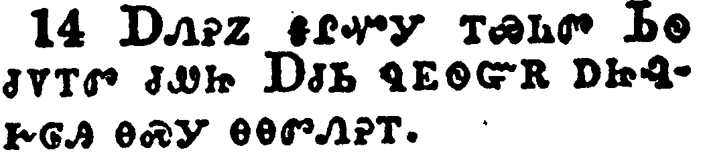</a></td>
</tr>
<tr class="even">
<td>And there were seven sons of one Sceva, a Jew, and chief of the priests, which did so.</td>
</tr>
<tr class="odd">
<td>ᎠᏁᎮᏃ ᎦᎵᏉᎩ ᎢᏯᏂᏛ ᏏᏫ ᏧᏙᎢᏛ ᏧᏪᏥ ᎠᏧᏏ ᏄᎬᏫᏳᎡ ᎠᏥᎸᎨᎶᎯ ᎾᏍᎩ ᎾᎾᏛᏁᎮᎢ.</td>
</tr>
<tr class="even">
<td>A-ne-he-no ga-li-quo-gi i-ya-ni-dv Si-wi tsu-do-i-dv tsu-we-tsi A-tsu-si nu-gv-wi-yu-e a-tsi-lv-ge-lo-hi na-s-gi na-na-dv-ne-he-i.</td>
</tr>
</tbody>
</table>

<table>
<tbody>
<tr class="odd">
<td><a href="051915.png">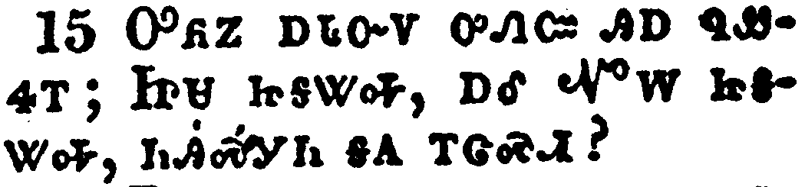</a></td>
</tr>
<tr class="even">
<td>And the evil spirit answered and said, Jesus I know, and Paul I know; but who are ye?</td>
</tr>
<tr class="odd">
<td>ᎤᏲᏃ ᎠᏓᏅᏙ ᎤᏁᏨ ᎯᎠ ᏄᏪᏎᎢ; ᏥᏌ ᏥᎦᏔᎭ, ᎠᎴ ᏉᎳ ᏥᎦᏔᎭ, ᏂᎯᏍᎩᏂ ᎦᎪ ᎢᏣᏍᏗ?</td>
</tr>
<tr class="even">
<td>U-yo-no a-da-nv-do u-ne-tsv hi-a nu-we-se-i; Tsi-sa tsi-ga-ta-ha, a-le Quo-la tsi-ga-ta-ha, ni-hi-s-gi-ni ga-go i-tsa-s-di?</td>
</tr>
</tbody>
</table>

<table>
<tbody>
<tr class="odd">
<td><a href="051916.png">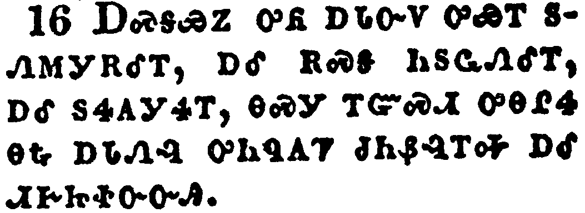</a></td>
</tr>
<tr class="even">
<td>And the man in whom the evil spirit was leaped on them, and overcame them, and prevailed against them, so that they fled out of that house naked and wounded.</td>
</tr>
<tr class="odd">
<td>ᎠᏍᎦᏯᏃ ᎤᏲ ᎠᏓᏅᏙ ᎤᏯᎢ ᏚᏁᎷᎩᎡᎴᎢ, ᎠᎴ ᎡᏍᎦ ᏂᏚᏩᏁᎴᎢ, ᎠᎴ ᏚᏎᎪᎩᏎᎢ, ᎾᏍᎩ ᎢᏳᏍᏗ ᎤᎾᎵᏎ ᎾᎿᎭᎠᏓᏁᎸ ᎤᏂᏄᎪᏤ ᏧᏂᏰᎸᎢᎭ ᎠᎴ ᏗᎨᏥᏐᏅᏅᎯ.</td>
</tr>
<tr class="even">
<td>A-s-ga-ya-no u-yo a-da-nv-do u-ya-i du-ne-lu-gi-e-le-i, a-le e-s-ga ni-du-wa-ne-le-i, a-le du-se-go-gi-se-i, na-s-gi i-yu-s-di u-na-li-se na-hna a-da-ne-lv u-ni-nu-go-tse tsu-ni-ye-lv-i-ha a-le di-ge-tsi-so-nv-nv-hi.</td>
</tr>
</tbody>
</table>

<table>
<tbody>
<tr class="odd">
<td><a href="051917.png">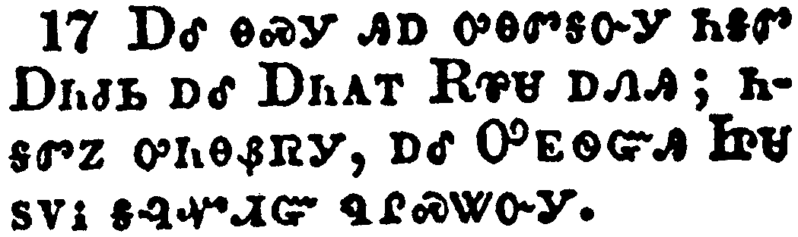</a></td>
</tr>
<tr class="even">
<td>And this was known to all the Jews and Greeks also dwelling at Ephesus; and fear fell on them all, and the name of the Lord Jesus was magnified.</td>
</tr>
<tr class="odd">
<td>ᎠᎴ ᎾᏍᎩ ᎯᎠ ᎤᎾᏛᎦᏅᎩ ᏂᎦᏛ ᎠᏂᏧᏏ ᎠᎴ ᎠᏂᎪᎢ ᎡᏈᏌ ᎠᏁᎯ; ᏂᎦᏛᏃ ᎤᏂᎾᏰᏒᎩ, ᎠᎴ ᎤᎬᏫᏳᎯ ᏥᏌ ᏚᏙᎥ ᎦᎸᏉᏗᏳ ᏄᎵᏍᏔᏅᎩ.</td>
</tr>
<tr class="even">
<td>A-le na-s-gi hi-a u-na-dv-ga-nv-gi ni-ga-dv A-ni-tsu-si a-le A-ni-go-i E-qui-sa a-ne-hi; ni-ga-dv-no u-ni-na-ye-sv-gi, a-le U-gv-wi-yu-hi Tsi-sa du-do-v ga-lv-quo-di-yu nu-li-s-ta-nv-gi.</td>
</tr>
</tbody>
</table>

<table>
<tbody>
<tr class="odd">
<td><a href="051918.png">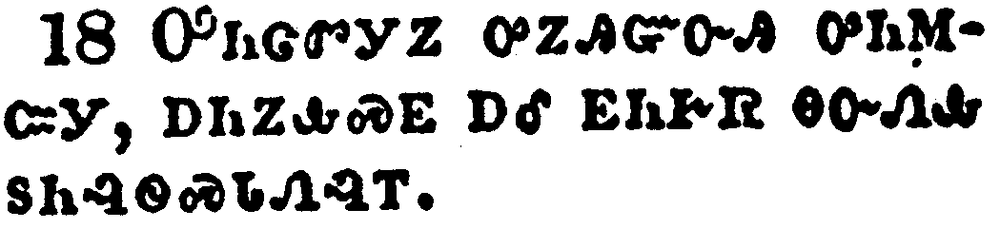</a></td>
</tr>
<tr class="even">
<td>And many that believed came, and confessed, and shewed their deeds.</td>
</tr>
<tr class="odd">
<td>ᎤᏂᏣᏛᎩᏃ ᎤᏃᎯᏳᏅᎯ ᎤᏂᎷᏨᎩ, ᎠᏂᏃᎲᏍᎬ ᎠᎴ ᎬᏂᎨᏒ ᎾᏅᏁᎲᏚᏂᎸᏫᏍᏓᏁᎸᎢ.</td>
</tr>
<tr class="even">
<td>U-ni-tsa-dv-gi-no u-no-hi-yu-nv-hi u-ni-lu-tsv-gi, a-ni-no-hv-s-gv a-le gv-ni-ge-sv na-nv-ne-hv-du-ni-lv-wi-s-da-ne-lv-i.</td>
</tr>
</tbody>
</table>

<table>
<tbody>
<tr class="odd">
<td><a href="051919.png">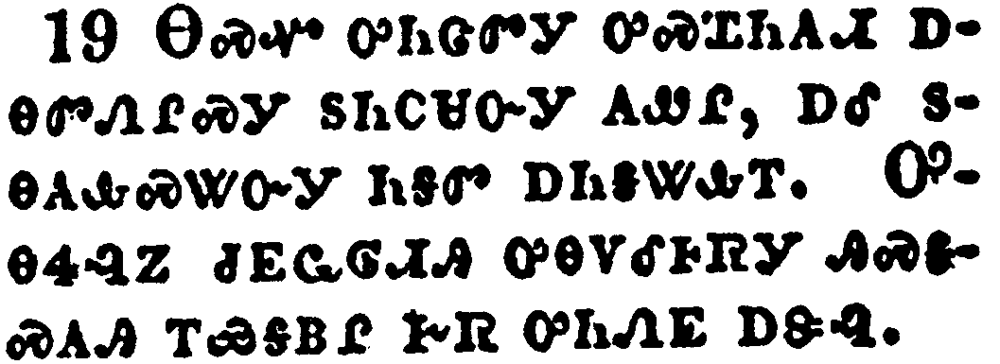</a></td>
</tr>
<tr class="even">
<td>Many of them also which used curious arts brought their books together, and burned them before all men: and they counted the price of them, and found it fifty thousand pieces of silver.</td>
</tr>
<tr class="odd">
<td>ᎾᏍᏉ ᎤᏂᏣᏛᎩ ᎤᏍᏆᏂᎪᏗ ᎠᎾᏛᏁᎵᏍᎩ ᏚᏂᏟᏌᏅᎩ ᎪᏪᎵ, ᎠᎴ ᏚᎾᎪᎲᏍᏔᏅᎩ ᏂᎦᏛ ᎠᏂᎦᏔᎲᎢ. ᎤᎾᏎᎸᏃ ᏧᎬᏩᎶᏗᎯ ᎤᎾᏙᎴᎰᏒᎩ ᎯᏍᎦᏍᎪᎯ ᎢᏯᎦᏴᎵ ᎨᏒ ᎤᏂᏁᎬ ᎠᏕᎸ.</td>
</tr>
<tr class="even">
<td>Na-s-quo u-ni-tsa-dv-gi u-s-qua-ni-go-di a-na-dv-ne-li-s-gi du-ni-tli-sa-nv-gi go-we-li, a-le du-na-go-hv-s-ta-nv-gi ni-ga-dv a-ni-ga-ta-hv-i. U-na-se-lv-no tsu-gv-wa-lo-di-hi u-na-do-le-ho-sv-gi hi-s-ga-s-go-hi i-ya-ga-yv-li ge-sv u-ni-ne-gv a-de-lv.</td>
</tr>
</tbody>
</table>

<table>
<tbody>
<tr class="odd">
<td><a href="051920.png">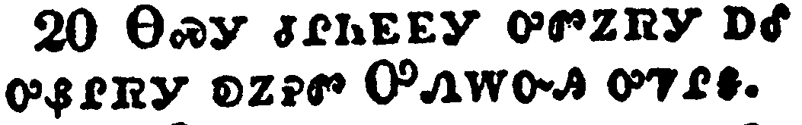</a></td>
</tr>
<tr class="even">
<td>So mightily grew the word of God and prevailed.</td>
</tr>
<tr class="odd">
<td>ᎾᏍᎩ ᏧᎵᏂᎬᎬᎩ ᎤᏛᏃᏒᎩ ᎠᎴ ᎤᏰᎵᏒᎩ ᎧᏃᎮᏛ ᎤᏁᎳᏅᎯ ᎤᏤᎵᎦ.</td>
</tr>
<tr class="even">
<td>Na-s-gi tsu-li-ni-gv-gv-gi u-dv-no-sv-gi a-le u-ye-li-sv-gi ka-no-he-dv U-ne-la-nv-hi u-tse-li-ga.</td>
</tr>
</tbody>
</table>

<table>
<tbody>
<tr class="odd">
<td><a href="051921.png">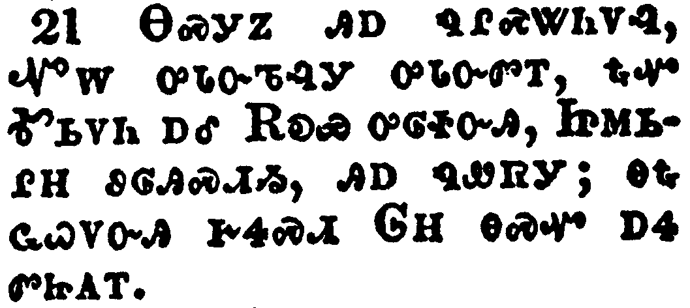</a></td>
</tr>
<tr class="even">
<td>After these things were ended, Paul purposed in the spirit, when he had passed through Macedonia and Achaia, to go to Jerusalem, saying, After I have been there, I must also see Rome.</td>
</tr>
<tr class="odd">
<td>ᎾᏍᎩᏃ ᎯᎠ ᏄᎵᏍᏔᏂᏙᎸ, ᏉᎳ ᎤᏓᏅᏖᎸᎩ ᎤᏓᏅᏛᎢ, ᎿᎭᏉ ᎹᏏᏙᏂ ᎠᎴ ᎡᎧᏯ ᎤᎶᏐᏅᎯ, ᏥᎷᏏᎵᎻ ᏭᎶᎯᏍᏗᏱ, ᎯᎠ ᏄᏪᏒᎩ; ᎾᎿᎭᎬᏇᏙᏅᎯ ᎨᏎᏍᏗ ᎶᎻ ᎾᏍᏉ ᎠᏎ ᏛᏥᎪᎢ.</td>
</tr>
<tr class="even">
<td>Na-s-gi-no hi-a nu-li-s-ta-ni-do-lv, Quo-la u-da-nv-te-lv-gi u-da-nv-dv-i, hna-quo Ma-si-do-ni a-le E-ka-ya u-lo-so-nv-hi, Tsi-lu-si-li-mi wu-lo-hi-s-di-yi, hi-a nu-we-sv-gi; na-hna gv-que-do-nv-hi ge-se-s-di Lo-mi na-s-quo a-se dv-tsi-go-i.</td>
</tr>
</tbody>
</table>

<table>
<tbody>
<tr class="odd">
<td><a href="051922.png">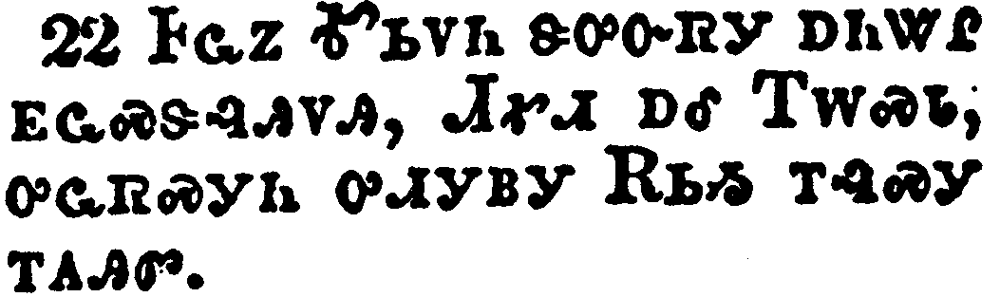</a></td>
</tr>
<tr class="even">
<td>So he sent into Macedonia two of them that ministered unto him, Timotheus and Erastus; but he himself stayed in Asia for a season.</td>
</tr>
<tr class="odd">
<td>ᎰᏩᏃ ᎹᏏᏙᏂ ᏕᎤᏅᏒᎩ ᎠᏂᏔᎵ ᎬᏩᏍᏕᎸᎯᏙᎯ, ᏗᎹᏗ ᎠᎴ ᎢᎳᏍᏓ, ᎤᏩᏒᏍᎩᏂ ᎤᏗᎩᏴᎩ ᎡᏏᏱ ᎢᎸᏍᎩ ᎢᎪᎯᏛ.</td>
</tr>
<tr class="even">
<td>Ho-wa-no Ma-si-do-ni de-u-nv-sv-gi a-ni-ta-li gv-wa-s-de-lv-hi-do-hi, Di-ma-di a-le I-la-s-da, u-wa-sv-s-gi-ni u-di-gi-yv-gi E-si-yi i-lv-s-gi i-go-hi-dv.</td>
</tr>
</tbody>
</table>

<table>
<tbody>
<tr class="odd">
<td><a href="051923.png">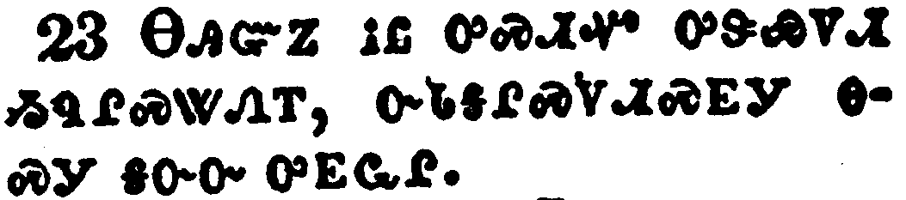</a></td>
</tr>
<tr class="even">
<td>And the same time there arose no small stir about that way.</td>
</tr>
<tr class="odd">
<td>ᎾᎯᏳᏃ ᎥᏝ ᎤᏍᏗᏉ ᎤᏕᏯᏙᏗ ᏱᏄᎵᏍᏔᏁᎢ, ᏅᏓᎦᎵᏍᏙᏗᏍᎬᎩ ᎾᏍᎩ ᎦᏅᏅ ᎤᎬᏩᎵ.</td>
</tr>
<tr class="even">
<td>Na-hi-yu-no v-tla u-s-di-quo u-de-ya-do-di yi-nu-li-s-ta-ne-i, nv-da-ga-li-s-do-di-s-gv-gi na-s-gi ga-nv-nv u-gv-wa-li.</td>
</tr>
</tbody>
</table>

<table>
<tbody>
<tr class="odd">
<td><a href="051924.png">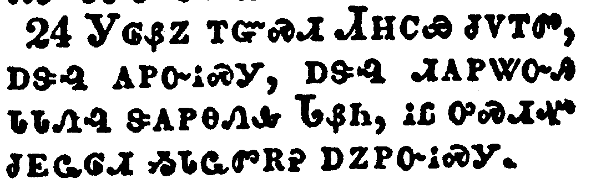</a></td>
</tr>
<tr class="even">
<td>For a certain man named Demetrius, a silversmith, which made silver shrines for Diana, brought no small gain unto the craftsmen;</td>
</tr>
<tr class="odd">
<td>ᎩᎶᏰᏃ ᎢᏳᏍᏗ ᏗᎻᏟᏯ ᏧᏙᎢᏛ, ᎠᏕᎸ ᎠᏢᏅᎥᏍᎩ, ᎠᏕᎸ ᏗᎪᏢᏔᏅᎯ ᏓᏓᏁᎸ ᏕᎪᏢᎾᏁᎲ ᏓᏰᏂ, ᎥᏝ ᎤᏍᏗᏉ ᏧᎬᏩᎶᏗ ᏱᏓᏩᏛᎡᎮ ᎠᏃᏢᏅᎥᏍᎩ.</td>
</tr>
<tr class="even">
<td>Gi-lo-ye-no i-yu-s-di Di-mi-tli-ya tsu-do-i-dv, a-de-lv a-tlv-nv-v-s-gi, a-de-lv di-go-tlv-ta-nv-hi da-da-ne-lv de-go-tlv-na-ne-hv Da-ye-ni, v-tla u-s-di-quo tsu-gv-wa-lo-di yi-da-wa-dv-e-he a-no-tlv-nv-v-s-gi.</td>
</tr>
</tbody>
</table>

<table>
<tbody>
<tr class="odd">
<td><a href="051925.png">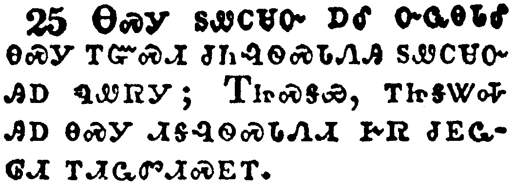</a></td>
</tr>
<tr class="even">
<td>Whom he called together with the workmen of like occupation, and said, Sirs, ye know that by this craft we have our wealth.</td>
</tr>
<tr class="odd">
<td>ᎾᏍᎩ ᏚᏪᏟᏌᏅ ᎠᎴ ᏅᏩᎾᏓᎴ ᎾᏍᎩ ᎢᏳᏍᏗ ᏧᏂᎸᏫᏍᏓᏁᎯ ᏚᏪᏟᏌᏅ ᎯᎠ ᏄᏪᏒᎩ; ᎢᏥᏍᎦᏯ, ᎢᏥᎦᏔᎭ ᎯᎠ ᎾᏍᎩ ᏗᎦᎸᏫᏍᏓᏁᏗ ᎨᏒ ᏧᎬᏩᎶᏗ ᎢᏗᏩᏛᏗᏍᎬᎢ.</td>
</tr>
<tr class="even">
<td>Na-s-gi du-we-tli-sa-nv a-le nv-wa-na-da-le na-s-gi i-yu-s-di tsu-ni-lv-wi-s-da-ne-hi du-we-tli-sa-nv hi-a nu-we-sv-gi; I-tsi-s-ga-ya, i-tsi-ga-ta-ha hi-a na-s-gi di-ga-lv-wi-s-da-ne-di ge-sv tsu-gv-wa-lo-di i-di-wa-dv-di-s-gv-i.</td>
</tr>
</tbody>
</table>

<table>
<tbody>
<tr class="odd">
<td><a href="051926.png">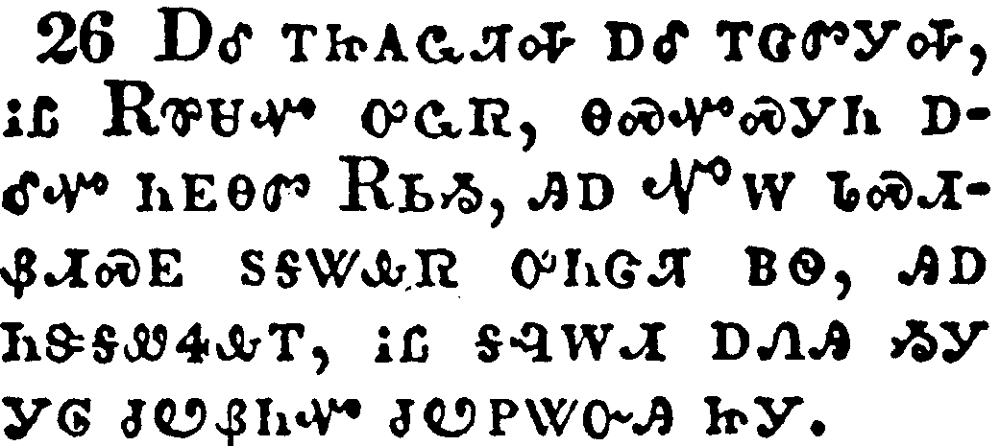</a></td>
</tr>
<tr class="even">
<td>Moreover ye see and hear, that not alone at Ephesus, but almost throughout all Asia, this Paul hath persuaded and turned away much people, saying that they be no gods, which are made with hands:</td>
</tr>
<tr class="odd">
<td>ᎠᎴ ᎢᏥᎪᏩᏘᎭ ᎠᎴ ᎢᏣᏛᎩᎭ, ᎥᏝ ᎡᏈᏌᏉ ᎤᏩᏒ, ᎾᏍᏉᏍᎩᏂ ᎠᎴᏉ ᏂᎬᎾᏛ ᎡᏏᏱ, ᎯᎠ ᏉᎳ ᏓᏍᏗᏰᏗᏍᎬ ᏚᎦᏔᎲᏒ ᎤᏂᏣᏘ ᏴᏫ, ᎯᎠ ᏂᏕᎦᏪᏎᎲᎢ, ᎥᏝ ᎦᎸᎳᏗ ᎠᏁᎯ ᏱᎩ ᎩᎶ ᏧᏬᏰᏂᏉ ᏧᏬᏢᏔᏅᎯ ᏥᎩ.</td>
</tr>
<tr class="even">
<td>A-le i-tsi-go-wa-ti-ha a-le i-tsa-dv-gi-ha, v-tla E-qui-sa-quo u-wa-sv, na-s-quo-s-gi-ni a-le-quo ni-gv-na-dv E-si-yi, hi-a Quo-la da-s-di-ye-di-s-gv du-ga-ta-hv-sv u-ni-tsa-ti yv-wi, hi-a ni-de-ga-we-se-hv-i, v-tla ga-lv-la-di a-ne-hi yi-gi gi-lo tsu-wo-ye-ni-quo tsu-wo-tlv-ta-nv-hi tsi-gi.</td>
</tr>
</tbody>
</table>

<table>
<tbody>
<tr class="odd">
<td><a href="051927.png">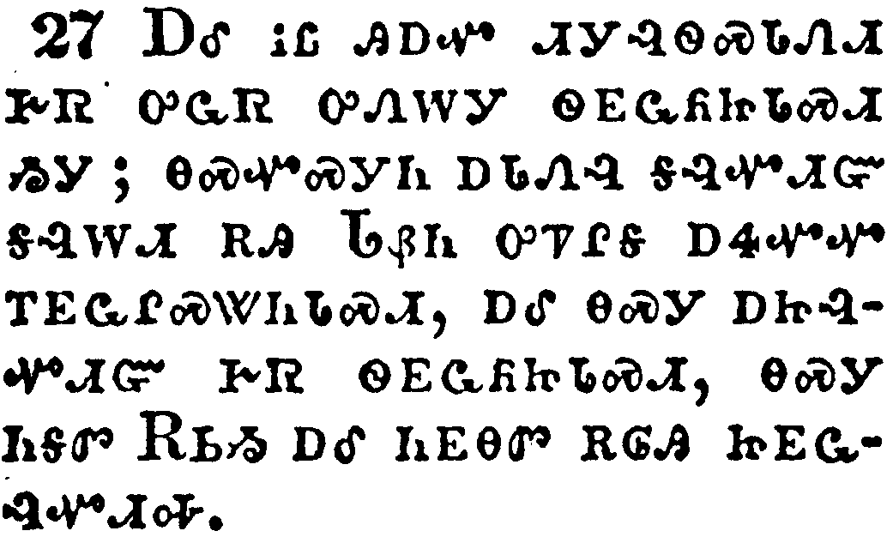</a></td>
</tr>
<tr class="even">
<td>So that not only this our craft is in danger to be set at nought; but also that the temple of the great goddess Diana should be despised, and her magnificence should be destroyed, whom all Asia and the world worshippeth.</td>
</tr>
<tr class="odd">
<td>ᎠᎴ ᎥᏝ ᎯᎠᏉ ᏗᎩᎸᏫᏍᏓᏁᏗ ᎨᏒ ᎤᏩᏒ ᎤᏁᎳᎩ ᏫᎬᏩᏲᏥᏓᏍᏗ ᏱᎩ; ᎾᏍᏉᏍᎩᏂ ᎠᏓᏁᎸ ᎦᎸᏉᏗᏳ ᎦᎸᎳᏗ ᎡᎯ ᏓᏰᏂ ᎤᏤᎵᎦ ᎠᏎᏉᏉ ᎢᎬᏩᎵᏍᏔᏂᏓᏍᏗ, ᎠᎴ ᎾᏍᎩ ᎠᏥᎸᏉᏗᏳ ᎨᏒ ᏫᎬᏩᏲᏥᏓᏍᏗ, ᎾᏍᎩ ᏂᎦᏛ ᎡᏏᏱ ᎠᎴ ᏂᎬᎾᏛ ᎡᎶᎯ ᏥᎬᏩᎸᏉᏗᎭ.</td>
</tr>
<tr class="even">
<td>A-le v-tla hi-a-quo di-gi-lv-wi-s-da-ne-di ge-sv u-wa-sv u-ne-la-gi wi-gv-wa-yo-tsi-da-s-di yi-gi; na-s-quo-s-gi-ni a-da-ne-lv ga-lv-quo-di-yu ga-lv-la-di e-hi Da-ye-ni u-tse-li-ga a-se-quo-quo i-gv-wa-li-s-ta-ni-da-s-di, a-le na-s-gi a-tsi-lv-quo-di-yu ge-sv wi-gv-wa-yo-tsi-da-s-di, na-s-gi ni-ga-dv E-si-yi a-le ni-gv-na-dv e-lo-hi tsi-gv-wa-lv-quo-di-ha.</td>
</tr>
</tbody>
</table>

<table>
<tbody>
<tr class="odd">
<td><a href="051928.png">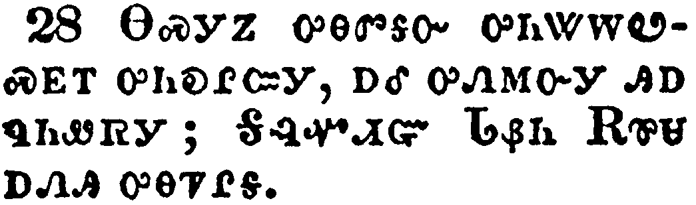</a></td>
</tr>
<tr class="even">
<td>And when they heard these sayings, they were full of wrath, and cried out, saying, Great is Diana of the Ephesians.</td>
</tr>
<tr class="odd">
<td>ᎾᏍᎩᏃ ᎤᎾᏛᎦᏅ ᎤᏂᏔᎳᏬᏍᎬᎢ ᎤᏂᎧᎵᏨᎩ, ᎠᎴ ᎤᏁᎷᏅᎩ ᎯᎠ ᏄᏂᏪᏒᎩ; ᎦᎸᏉᏗᏳ ᏓᏰᏂ ᎡᏈᏌ ᎠᏁᎯ ᎤᎾᏤᎵᎦ.</td>
</tr>
<tr class="even">
<td>Na-s-gi-no u-na-dv-ga-nv u-ni-ta-la-wo-s-gv-i u-ni-ka-li-tsv-gi, a-le u-ne-lu-nv-gi hi-a nu-ni-we-sv-gi; Ga-lv-quo-di-yu Da-ye-ni E-qui-sa a-ne-hi u-na-tse-li-ga.</td>
</tr>
</tbody>
</table>

<table>
<tbody>
<tr class="odd">
<td><a href="051929.png">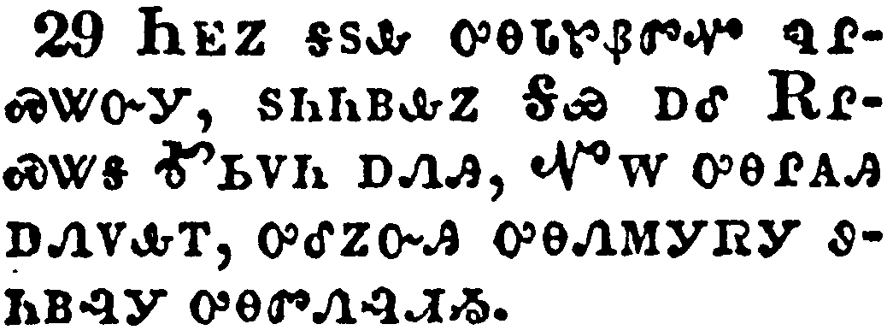</a></td>
</tr>
<tr class="even">
<td>And the whole city was filled with confusion: and having caught Gaius and Aristarchus, men of Macedonia, Paul's companions in travel, they rushed with one accord into the theatre.</td>
</tr>
<tr class="odd">
<td>ᏂᎬᏃ ᎦᏚᎲ ᎤᎾᏓᏑᏰᏛᏉ ᏄᎵᏍᏔᏅᎩ, ᏚᏂᏂᏴᎲᏃ ᎦᏯ ᎠᎴ ᎡᎵᏍᏔᎦ ᎹᏏᏙᏂ ᎠᏁᎯ, ᏉᎳ ᎤᎾᎵᎪᎯ ᎠᏁᏙᎲᎢ, ᎤᎴᏃᏅᎯ ᎤᎾᏁᎷᎩᏒᎩ ᏭᏂᏴᎸᎩ ᎤᎾᏛᏁᎸᏗᏱ.</td>
</tr>
<tr class="even">
<td>Ni-gv-no ga-du-hv u-na-da-su-ye-dv-quo nu-li-s-ta-nv-gi, du-ni-ni-yv-hv-no Ga-ya a-le E-li-s-ta-ga Ma-si-do-ni a-ne-hi, Quo-la u-na-li-go-hi a-ne-do-hv-i, u-le-no-nv-hi u-na-ne-lu-gi-sv-gi wu-ni-yv-lv-gi u-na-dv-ne-lv-di-yi.</td>
</tr>
</tbody>
</table>

<table>
<tbody>
<tr class="odd">
<td><a href="051930.png">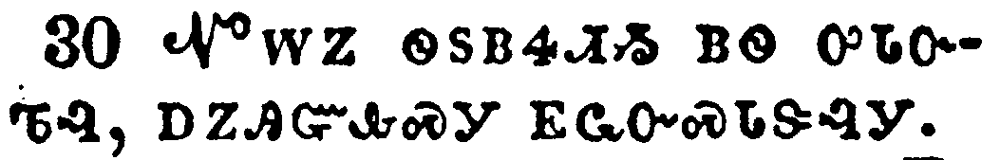</a></td>
</tr>
<tr class="even">
<td>And when Paul would have entered in unto the people, the disciples suffered him not.</td>
</tr>
<tr class="odd">
<td>ᏉᎳᏃ ᏫᏚᏴᏎᏗᏱ ᏴᏫ ᎤᏓᏅᏖᎸ, ᎠᏃᎯᏳᎲᏍᎩ ᎬᏩᏅᏍᏓᏕᎸᎩ.</td>
</tr>
<tr class="even">
<td>Quo-la-no wi-du-yv-se-di-yi yv-wi u-da-nv-te-lv, a-no-hi-yu-hv-s-gi gv-wa-nv-s-da-de-lv-gi.</td>
</tr>
</tbody>
</table>

<table>
<tbody>
<tr class="odd">
<td><a href="051931.png">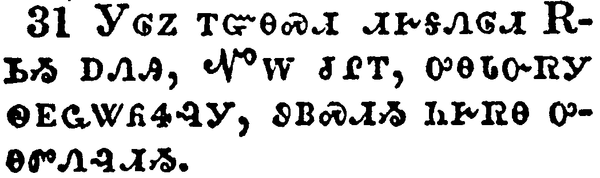</a></td>
</tr>
<tr class="even">
<td>And certain of the chief of Asia, which were his friends, sent unto him, desiring him that he would not adventure himself into the theatre.</td>
</tr>
<tr class="odd">
<td>ᎩᎶᏃ ᎢᏳᎾᏍᏗ ᏗᎨᎦᏁᎶᏗ ᎡᏏᏱ ᎠᏁᎯ, ᏉᎳ ᏧᎵᎢ, ᎤᎾᏓᏅᏒᎩ ᏫᎬᏩᏔᏲᏎᎸᎩ, ᏭᏴᏍᏗᏱ ᏂᎨᏒᎾ ᎤᎾᏛᏁᎸᏗᏱ.</td>
</tr>
<tr class="even">
<td>Gi-lo-no i-yu-na-s-di di-ge-ga-ne-lo-di E-si-yi a-ne-hi, Quo-la tsu-li-i, u-na-da-nv-sv-gi wi-gv-wa-ta-yo-se-lv-gi, wu-yv-s-di-yi ni-ge-sv-na u-na-dv-ne-lv-di-yi.</td>
</tr>
</tbody>
</table>

<table>
<tbody>
<tr class="odd">
<td><a href="051932.png">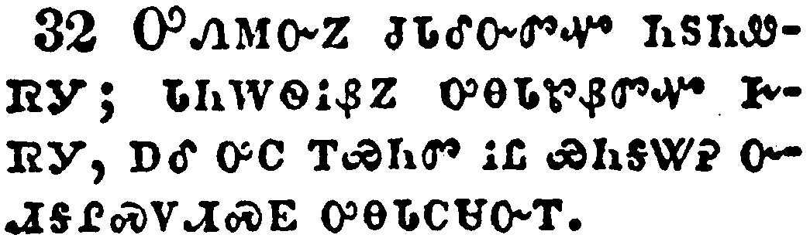</a></td>
</tr>
<tr class="even">
<td>Some therefore cried one thing, and some another: for the assembly was confused; and the more part knew not wherefore they were come together.</td>
</tr>
<tr class="odd">
<td>ᎤᏁᎷᏅᎯ ᏧᏓᎴᏅᏛᏉ ᏂᏚᏂᏪᏒᎩ; ᏓᏂᎳᏫᎥᏰᏃ ᎤᎾᏓᏑᏰᏛᏉ ᎨᏒᎩ, ᎠᎴ ᎤᏟ ᎢᏯᏂᏛ ᎥᏝ ᏯᏂᎦᏔᎮ ᏅᏗᎦᎵᏍᏙᏗᏍᎬ ᎤᎾᏓᏟᏌᏅᎢ.</td>
</tr>
<tr class="even">
<td>U-ne-lu-nv-hi tsu-da-le-nv-dv-quo ni-du-ni-we-sv-gi; da-ni-la-wi-v-ye-no u-na-da-su-ye-dv-quo ge-sv-gi, a-le u-tli i-ya-ni-dv v-tla ya-ni-ga-ta-he nv-di-ga-li-s-do-di-s-gv u-na-da-tli-sa-nv-i.</td>
</tr>
</tbody>
</table>

<table>
<tbody>
<tr class="odd">
<td><a href="051933.png">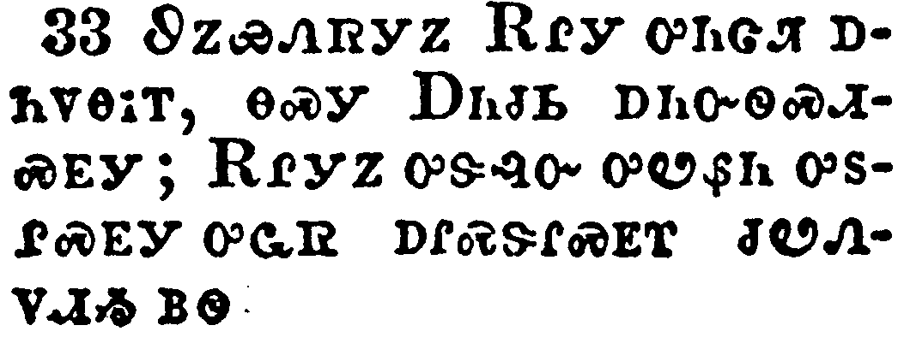</a></td>
</tr>
<tr class="even">
<td>And they drew Alexander out of the multitude, the Jews putting him forward. And Alexander beckoned with the hand, and would have made his defence unto the people.</td>
</tr>
<tr class="odd">
<td>ᏭᏃᏯᏁᏒᎩᏃ ᎡᎵᎩ ᎤᏂᏣᏘ ᎠᏂᏙᎾᎥᎢ, ᎾᏍᎩ ᎠᏂᏧᏏ ᎠᏂᏅᏫᏍᏗᏍᎬᎩ; ᎡᎵᎩᏃ ᎤᏕᎸᏅ ᎤᏬᏰᏂ ᎤᏚᎵᏍᎬᎩ ᎤᏩᏒ ᎠᎵᏍᏕᎵᏍᎬᎢ ᏧᏬᏁᏙᏗᏱ ᏴᏫ.</td>
</tr>
<tr class="even">
<td>Wu-no-ya-ne-sv-gi-no E-li-gi u-ni-tsa-ti a-ni-do-na-v-i, na-s-gi A-ni-tsu-si a-ni-nv-wi-s-di-s-gv-gi; E-li-gi-no u-de-lv-nv u-wo-ye-ni u-du-li-s-gv-gi u-wa-sv a-li-s-de-li-s-gv-i tsu-wo-ne-do-di-yi yv-wi.</td>
</tr>
</tbody>
</table>

<table>
<tbody>
<tr class="odd">
<td><a href="051934.png">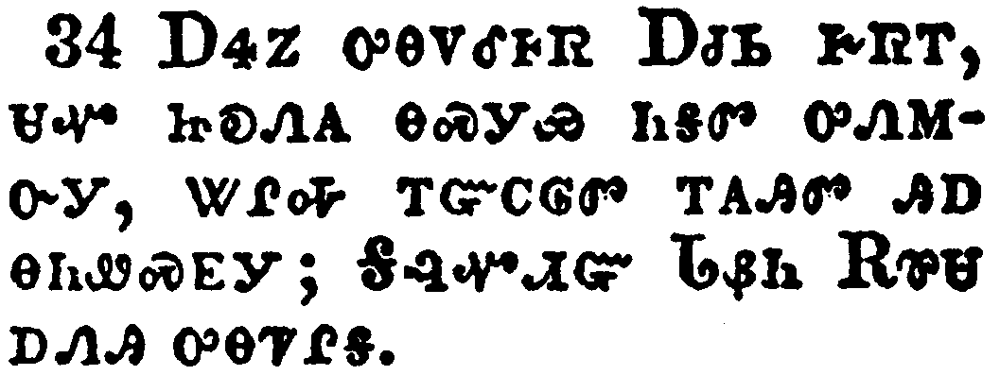</a></td>
</tr>
<tr class="even">
<td>But when they knew that he was a Jew, all with one voice about the space of two hours cried out, Great is Diana of the Ephesians.</td>
</tr>
<tr class="odd">
<td>ᎠᏎᏃ ᎤᎾᏙᎴᎰᏒ ᎠᏧᏏ ᎨᏒᎢ, ᏌᏉ ᏥᎧᏁᎪ ᎾᏍᎩᏯ ᏂᎦᏛ ᎤᏁᎷᏅᎩ, ᏔᎵᎭ ᎢᏳᏟᎶᏛ ᎢᎪᎯᏛ ᎯᎠ ᎾᏂᏪᏍᎬᎩ; ᎦᎸᏉᏗᏳ ᏓᏰᏂ ᎡᏈᏌ ᎠᏁᎯ ᎤᎾᏤᎵᎦ.</td>
</tr>
<tr class="even">
<td>A-se-no u-na-do-le-ho-sv A-tsu-si ge-sv-i, sa-quo tsi-ka-ne-go na-s-gi-ya ni-ga-dv u-ne-lu-nv-gi, ta-li-ha i-yu-tli-lo-dv i-go-hi-dv hi-a na-ni-we-s-gv-gi; Ga-lv-quo-di-yu Da-ye-ni E-qui-sa a-ne-hi u-na-tse-li-ga.</td>
</tr>
</tbody>
</table>

<table>
<tbody>
<tr class="odd">
<td><a href="051935.png">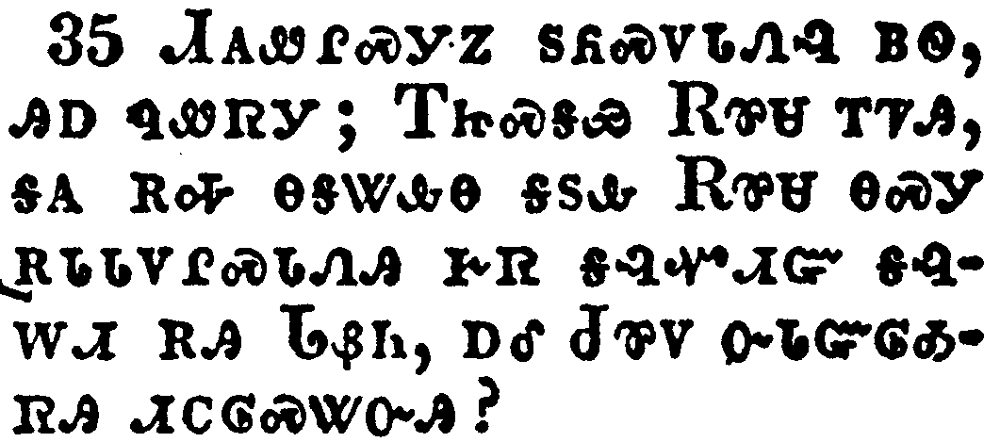</a></td>
</tr>
<tr class="even">
<td>And when the townclerk had appeased the people, he said, Ye men of Ephesus, what man is there that knoweth not how that the city of the Ephesians is a worshipper of the great goddess Diana, and of the image which fell down from Jupiter?</td>
</tr>
<tr class="odd">
<td>ᏗᎪᏪᎵᏍᎩᏃ ᏚᏲᏍᏙᏓᏁᎸ ᏴᏫ, ᎯᎠ ᏄᏪᏒᎩ; ᎢᏥᏍᎦᏯ ᎡᏈᏌ ᎢᏤᎯ, ᎦᎪ ᎡᎭ ᎾᎦᏔᎲᎾ ᎦᏚᎲ ᎡᏈᏌ ᎾᏍᎩ ᎡᏓᏓᏙᎵᏍᏓᏁᎯ ᎨᏒ ᎦᎸᏉᏗᏳ ᎦᎸᎳᏗ ᎡᎯ ᏓᏰᏂ, ᎠᎴ ᏧᏉᏙ ᏅᏓᏳᎶᎣᏒᎯ ᏗᏟᎶᏍᏔᏅᎯ?</td>
</tr>
<tr class="even">
<td>Di-go-we-li-s-gi-no du-yo-s-do-da-ne-lv yv-wi, hi-a nu-we-sv-gi; I-tsi-s-ga-ya E-qui-sa i-tse-hi, ga-go e-ha na-ga-ta-hv-na ga-du-hv E-qui-sa na-s-gi e-da-da-do-li-s-da-ne-hi ge-sv ga-lv-quo-di-yu ga-lv-la-di e-hi Da-ye-ni, a-le Tsu-quo-do nv-da-yu-lo-o-sv-hi di-tli-lo-s-ta-nv-hi?</td>
</tr>
</tbody>
</table>

<table>
<tbody>
<tr class="odd">
<td><a href="051936.png">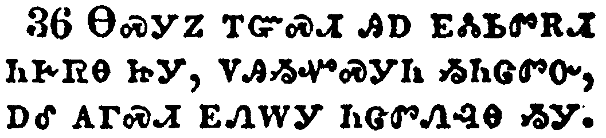</a></td>
</tr>
<tr class="even">
<td>Seeing then that these things cannot be spoken against, ye ought to be quiet, and to do nothing rashly.</td>
</tr>
<tr class="odd">
<td>ᎾᏍᎩᏃ ᎢᏳᏍᏗ ᎯᎠ ᏄᏜᏓᏏᏛᎡᏗ ᏂᎨᏒᎾ ᏥᎩ, ᏙᎯᏱᏉᏍᎩᏂ ᏱᏂᏣᏛᏅ, ᎠᎴ ᎪᎱᏍᏗ ᎬᏁᎳᎩ ᏂᏣᏛᏁᎸᎾ ᏱᎩ.</td>
</tr>
<tr class="even">
<td>Na-s-gi-no i-yu-s-di hi-a nu-dla-si-dv-e-di ni-ge-sv-na tsi-gi, do-hi-yi-quo-s-gi-ni yi-ni-tsa-dv-nv, a-le go-hu-s-di gv-ne-la-gi ni-tsa-dv-ne-lv-na yi-gi.</td>
</tr>
</tbody>
</table>

<table>
<tbody>
<tr class="odd">
<td></td>
</tr>
<tr class="even">
<td>For ye have brought hither these men, which are neither robbers of churches, nor yet blasphemers of your goddess.</td>
</tr>
<tr class="odd">
<td>ᏕᏣᏘᏃᎦᏰᏃ ᎯᎠ Ꮎ ᎠᏂᏍᎦᏯ, ᎾᏍᎩ ᎦᎸᏉᏗ ᏕᎨᏒ ᎠᏂᏃᏍᎩᏍᎩ ᏂᎨᏒᎾ, ᎠᎴ ᎢᏣᏤᎵ ᎦᎸᎳᏗ ᎡᎯ ᎠᏂᏐᏢᎢᏍᏗᏍᎩ ᏂᎨᏒᎾ.</td>
</tr>
<tr class="even">
<td>De-tsa-ti-no-ga-ye-no hi-a na a-ni-s-ga-ya, na-s-gi ga-lv-quo-di de-ge-sv a-ni-no-s-gi-s-gi ni-ge-sv-na, a-le i-tsa-tse-li ga-lv-la-di e-hi a-ni-so-tlv-i-s-di-s-gi ni-ge-sv-na.</td>
</tr>
</tbody>
</table>

<table>
<tbody>
<tr class="odd">
<td><a href="051938.png">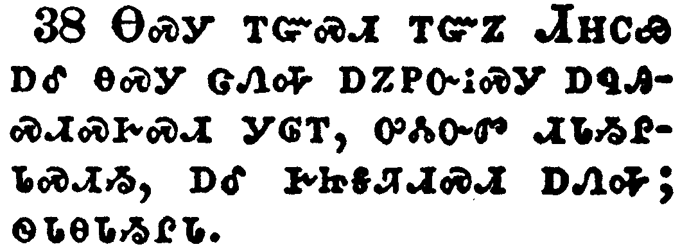</a></td>
</tr>
<tr class="even">
<td>Wherefore if Demetrius, and the craftsmen which are with him, have a matter against any man, the law is open, and there are deputies: let them implead one another.</td>
</tr>
<tr class="odd">
<td>ᎾᏍᎩ ᎢᏳᏍᏗ ᎢᏳᏃ ᏗᎻᏟᏯ ᎠᎴ ᎾᏍᎩ ᏣᏁᎭ ᎠᏃᏢᏅᎥᏍᎩ ᎠᏄᎯᏍᏗᏍᎨᏍᏗ ᎩᎶᎢ, ᎤᏜᏓᏅᏛ ᏗᏓᏱᎵᏓᏍᏗᏱ, ᎠᎴ ᎨᏥᎦᏘᏗᏍᏗ ᎠᏁᎭ; ᏫᏓᎾᏓᏱᎵᏓ.</td>
</tr>
<tr class="even">
<td>Na-s-gi i-yu-s-di i-yu-no Di-mi-tli-ya a-le na-s-gi tsa-ne-ha a-no-tlv-nv-v-s-gi a-nu-hi-s-di-s-ge-s-di gi-lo-i, u-dla-nv-dv di-da-yi-li-da-s-di-yi, a-le ge-tsi-ga-ti-di-s-di a-ne-ha; wi-da-na-da-yi-li-da.</td>
</tr>
</tbody>
</table>

<table>
<tbody>
<tr class="odd">
<td><a href="051939.png">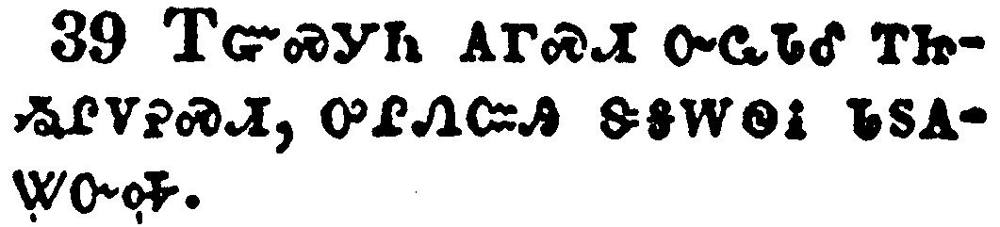</a></td>
</tr>
<tr class="even">
<td>But if ye inquire any thing concerning other matters, it shall be determined in a lawful assembly.</td>
</tr>
<tr class="odd">
<td>ᎢᏳᏍᎩᏂ ᎪᎱᏍᏗ ᏅᏩᏓᎴ ᎢᏥᏱᎵᏙᎮᏍᏗ, ᎤᎵᏁᏨᎯ ᏕᎦᎳᏫᎥ ᏓᏚᎪᏔᏅᎭ.</td>
</tr>
<tr class="even">
<td>I-yu-s-gi-ni go-hu-s-di nv-wa-da-le i-tsi-yi-li-do-he-s-di, u-li-ne-tsv-hi de-ga-la-wi-v da-du-go-ta-nv-ha.</td>
</tr>
</tbody>
</table>

<table>
<tbody>
<tr class="odd">
<td><a href="051940.png">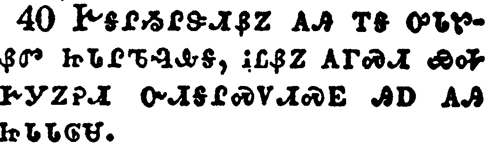</a></td>
</tr>
<tr class="even">
<td>For we are in danger to be called in question for this day's uproar, there being no cause whereby we may give an account of this concourse.</td>
</tr>
<tr class="odd">
<td>ᎨᎦᎵᏱᎵᏕᏗᏰᏃ ᎪᎯ ᎢᎦ ᎤᏓᏑᏰᏛ ᏥᏓᎵᏖᎸᎲᎦ, ᎥᏝᏰᏃ ᎪᎱᏍᏗ ᏯᎭ ᎨᎩᏃᎮᏗ ᏅᏗᎦᎵᏍᏙᏗᏍᎬ ᎯᎠ ᎪᎯ ᏥᏓᏓᎶᏌ.</td>
</tr>
<tr class="even">
<td>Ge-ga-li-yi-li-de-di-ye-no go-hi i-ga u-da-su-ye-dv tsi-da-li-te-lv-hv-ga, v-tla-ye-no go-hu-s-di ya-ha ge-gi-no-he-di nv-di-ga-li-s-do-di-s-gv hi-a go-hi tsi-da-da-lo-sa.</td>
</tr>
</tbody>
</table>

<table>
<tbody>
<tr class="odd">
<td><a href="051941.png">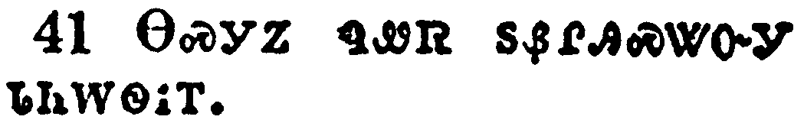</a></td>
</tr>
<tr class="even">
<td>And when he had thus spoken, he dismissed the assembly.</td>
</tr>
<tr class="odd">
<td>ᎾᏍᎩᏃ ᏄᏪᏒ ᏚᏰᎵᎯᏍᏔᏅᎩ ᏓᏂᎳᏫᎥᎢ.</td>
</tr>
<tr class="even">
<td>Na-s-gi-no nu-we-sv du-ye-li-hi-s-ta-nv-gi da-ni-la-wi-v-i.</td>
</tr>
</tbody>
</table>

