+++
draft=false
date = 2014-12-18T21:11:07Z
title = "The Acts - Chapter 20 - Cherokee New Testament"
weight = 1418955067

[taxonomies]

authors = ["Timothy Legg"]
categories = []
tags = []

[extra]
+++

<table>
<tbody>
<tr class="odd">
<td><a href="052001.png">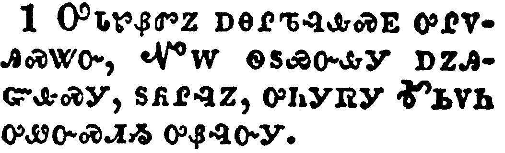</a></td>
</tr>
<tr class="even">
<td>And after the uproar was ceased, Paul called unto him the disciples, and embraced them, and departed for to go into Macedonia.</td>
</tr>
<tr class="odd">
<td>ᎤᏓᏑᏰᏛᏃ ᎠᎾᎵᏖᎸᎲᏍᎬ ᎤᎵᏙᎯᏍᏔᏅ, ᏉᎳ ᏫᏚᏯᏅᎲᎩ ᎠᏃᎯᏳᎲᏍᎩ, ᏚᏲᎵᎸᏃ, ᎤᏂᎩᏒᎩ ᏑᏏᏙᏂ ᎤᏪᏅᏍᏗᏱ ᎤᏰᎸᏅᎩ.</td>
</tr>
<tr class="even">
<td>U-da-su-ye-dv-no a-na-li-te-lv-hv-s-gv u-li-do-hi-s-ta-nv, Quo-la wi-du-ya-nv-hv-gi a-no-hi-yu-hv-s-gi, du-yo-li-lv-no, u-ni-gi-sv-gi Su-si-do-ni u-we-nv-s-di-yi u-ye-lv-nv-gi.</td>
</tr>
</tbody>
</table>

<table>
<tbody>
<tr class="odd">
<td><a href="052002.png">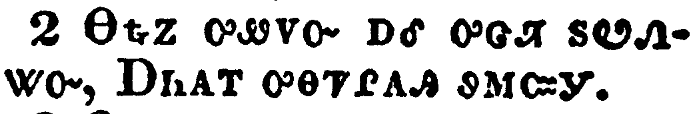</a></td>
</tr>
<tr class="even">
<td>And when he had gone over those parts, and had given them much exhortation, he came into Greece,</td>
</tr>
<tr class="odd">
<td>ᎾᎿᎭᏃ ᎤᏪᏙᏅ ᎠᎴ ᎤᏣᏘ ᏚᏪᏁᏔᏅ, ᎠᏂᎪᎢ ᎤᎾᏤᎵᎪᎯ ᏭᎷᏨᎩ.</td>
</tr>
<tr class="even">
<td>Na-hna-no u-we-do-nv a-le u-tsa-ti du-we-ne-ta-nv, A-ni-go-i u-na-tse-li-go-hi wu-lu-tsv-gi.</td>
</tr>
</tbody>
</table>

<table>
<tbody>
<tr class="odd">
<td><a href="052003.png">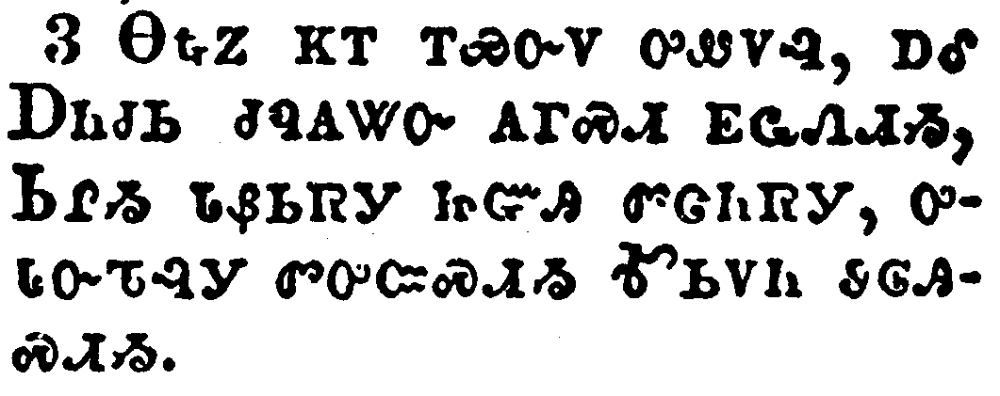</a></td>
</tr>
<tr class="even">
<td>And there abode three months. And when the Jews laid wait for him, as he was about to sail into Syria, he purposed to return through Macedonia.</td>
</tr>
<tr class="odd">
<td>ᎾᎿᎭᏃ ᏦᎢ ᎢᏯᏅᏙ ᎤᏪᏙᎸ, ᎠᎴ ᎠᏂᏧᏏ ᏧᏄᎪᏔᏅ ᎪᎱᏍᏗ ᎬᏩᏁᏗᏱ, ᏏᎵᏱ ᏓᏰᏏᏒᎩ ᏥᏳᎯ ᏛᏣᏂᏒᎩ, ᎤᏓᏅᏖᎸᎩ ᏛᎤᏨᏍᏗᏱ ᎼᏏᏙᏂ ᏭᎶᎯᏍᏗᏱ.</td>
</tr>
<tr class="even">
<td>Na-hna-no tso-i i-ya-nv-do u-we-do-lv, a-le A-ni-tsu-si tsu-nu-go-ta-nv go-hu-s-di gv-wa-ne-di-yi, Si-li-yi da-ye-si-sv-gi tsi-yu-hi dv-tsa-ni-sv-gi, u-da-nv-te-lv-gi dv-u-tsv-s-di-yi Mo-si-do-ni wu-lo-hi-s-di-yi.</td>
</tr>
</tbody>
</table>

<table>
<tbody>
<tr class="odd">
<td><a href="052004.png">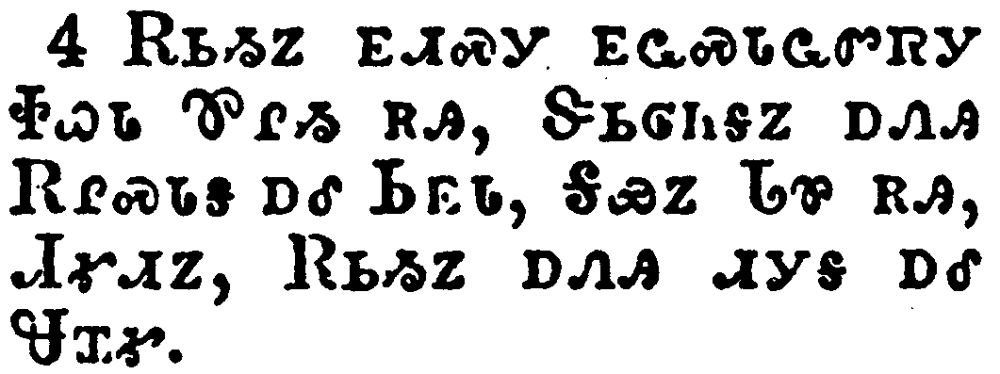</a></td>
</tr>
<tr class="even">
<td>And there accompanied him into Asia Sopater of Berea; and of the Thessalonians, Aristarchus and Secundus; and Gaius of Derbe, and Timotheus; and of Asia, Tychicus and Trophimus.</td>
</tr>
<tr class="odd">
<td>ᎡᏏᏱᏃ ᎬᏗᏍᎩ ᎬᏩᏍᏓᏩᏛᏒᎩ ᏐᏇᏓ ᏈᎵᏱ ᎡᎯ, ᏕᏏᎶᏂᎦᏃ ᎠᏁᎯ ᎡᎵᏍᏓᎦ ᎠᎴ ᏏᎬᏓ, ᎦᏯᏃ ᏓᏈ ᎡᎯ, ᏗᎹᏗᏃ, ᎡᏏᏱᏃ ᎠᏁᎯ ᏗᎩᎦ ᎠᎴ ᏠᏆᎹ.</td>
</tr>
<tr class="even">
<td>E-si-yi-no gv-di-s-gi gv-wa-s-da-wa-dv-sv-gi So-que-da Qui-li-yi e-hi, De-si-lo-ni-ga-no a-ne-hi E-li-s-da-ga a-le Si-gv-da, Ga-ya-no Da-qui e-hi, Di-ma-di-no, E-si-yi-no a-ne-hi di-gi-ga a-le Tlo-qua-ma.</td>
</tr>
</tbody>
</table>

<table>
<tbody>
<tr class="odd">
<td></td>
</tr>
<tr class="even">
<td>These going before tarried for us at Troas.</td>
</tr>
<tr class="odd">
<td>ᎾᏍᎩ ᎯᎠ ᎢᎬᏱ ᏄᏁᏅᏒᎩ ᏠᎠᏏ ᏓᎪᎩᏚᏘᏴᎩ.</td>
</tr>
<tr class="even">
<td>Na-s-gi hi-a i-gv-yi nu-ne-nv-sv-gi Tlo-a-si da-go-gi-du-ti-yv-gi.</td>
</tr>
</tbody>
</table>

<table>
<tbody>
<tr class="odd">
<td><a href="052006.png">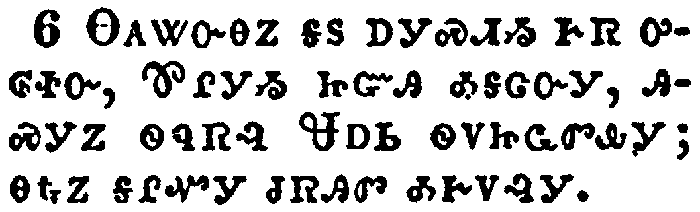</a></td>
</tr>
<tr class="even">
<td>And we sailed away from Philippi after the days of unleavened bread, and came unto them to Troas in five days; where we abode seven days.</td>
</tr>
<tr class="odd">
<td>ᎾᎪᏔᏅᎾᏃ ᎦᏚ ᎠᎩᏍᏗᏱ ᎨᏒ ᎤᎶᏐᏅ, ᏈᎵᎩᏱ ᏥᏳᎯ ᎣᎦᏣᏅᎩ, ᎯᏍᎩᏃ ᏫᏄᏒᎸ ᏠᎠᏏ ᏫᏙᏥᏩᏛᎲᎩ; ᎾᎿᎭᏃ ᎦᎵᏉᎩ ᏧᏒᎯᏛ ᎣᎨᏙᎸᎩ.</td>
</tr>
<tr class="even">
<td>Na-go-ta-nv-na-no ga-du a-gi-s-di-yi ge-sv u-lo-so-nv, Qui-li-gi-yi tsi-yu-hi o-ga-tsa-nv-gi, hi-s-gi-no wi-nu-sv-lv Tlo-a-si wi-do-tsi-wa-dv-hv-gi; na-hna-no ga-li-quo-gi tsu-sv-hi-dv o-ge-do-lv-gi.</td>
</tr>
</tbody>
</table>

<table>
<tbody>
<tr class="odd">
<td><a href="052007.png">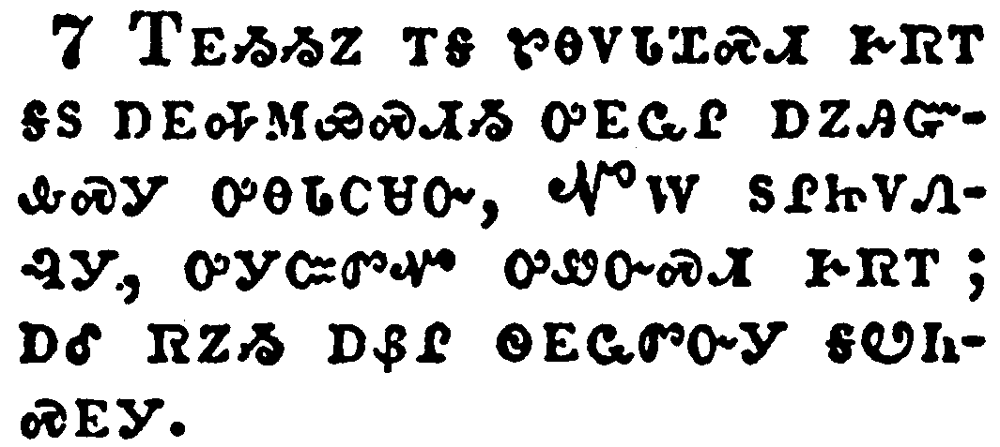</a></td>
</tr>
<tr class="even">
<td>And upon the first day of the week, when the disciples came together to break bread, Paul preached unto them, ready to depart on the morrow; and continued his speech until midnight.</td>
</tr>
<tr class="odd">
<td>ᎢᎬᏱᏱᏃ ᎢᎦ ᏑᎾᏙᏓᏆᏍᏗ ᎨᏒᎢ ᎦᏚ ᎠᎬᎭᎷᏯᏍᏗᏱ ᎤᎬᏩᎵ ᎠᏃᎯᏳᎲᏍᎩ ᎤᎾᏓᏟᏌᏅ, ᏉᎳ ᏚᎵᏥᏙᏁᎸᎩ, ᎤᎩᏨᏛᏉ ᎤᏪᏅᏍᏗ ᎨᏒᎢ; ᎠᎴ ᎡᏃᏱ ᎠᏰᎵ ᏫᎬᏩᏛᏅᎩ ᎦᏬᏂᏍᎬᎩ.</td>
</tr>
<tr class="even">
<td>I-gv-yi-yi-no i-ga su-na-do-da-qua-s-di ge-sv-i ga-du a-gv-ha-lu-ya-s-di-yi u-gv-wa-li a-no-hi-yu-hv-s-gi u-na-da-tli-sa-nv, Quo-la du-li-tsi-do-ne-lv-gi, u-gi-tsv-dv-quo u-we-nv-s-di ge-sv-i; a-le e-no-yi a-ye-li wi-gv-wa-dv-nv-gi ga-wo-ni-s-gv-gi.</td>
</tr>
</tbody>
</table>

<table>
<tbody>
<tr class="odd">
<td></td>
</tr>
<tr class="even">
<td>And there were many lights in the upper chamber, where they were gathered together.</td>
</tr>
<tr class="odd">
<td>ᎠᎴ ᎤᏣᏛᎩ ᏓᏨᏍᏛᎩ ᎦᎸᎳᏗ ᎾᎿᎭᏓᏂᎳᏫᎥᎢ.</td>
</tr>
<tr class="even">
<td>A-le u-tsa-dv-gi da-tsv-s-dv-gi ga-lv-la-di na-hna da-ni-la-wi-v-i.</td>
</tr>
</tbody>
</table>

<table>
<tbody>
<tr class="odd">
<td><a href="052009.png">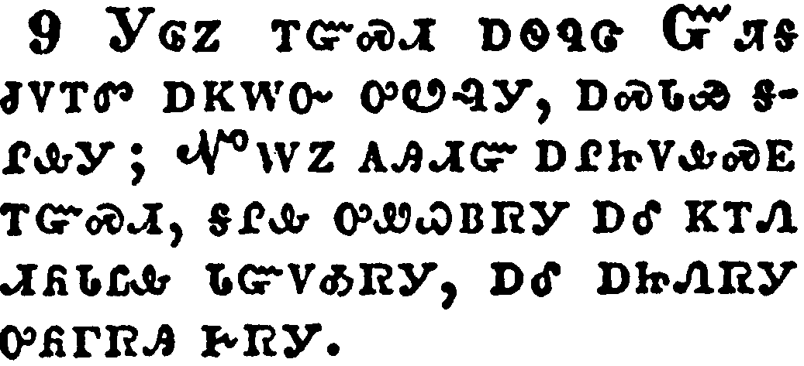</a></td>
</tr>
<tr class="even">
<td>And there sat in a window a certain young man named Eutychus, being fallen into a deep sleep: and as Paul was long preaching, he sunk down with sleep, and fell down from the third loft, and was taken up dead.</td>
</tr>
<tr class="odd">
<td>ᎩᎶᏃ ᎢᏳᏍᏗ ᎠᏫᏄᏣ ᏳᏘᎦ ᏧᏙᎢᏛ ᎠᏦᎳᏅ ᎤᏬᎸᎩ, ᎠᏍᏓᏯ ᎦᎵᎲᎩ; ᏉᎳᏃ ᎪᎯᏗᏳ ᎠᎵᏥᏙᎲᏍᎬ ᎢᏳᏍᏗ, ᎦᎵᎲ ᎤᏪᏇᏴᏒᎩ ᎠᎴ ᏦᎢᏁ ᏗᏲᏓᏝᎲ ᏓᏳᏙᎣᏒᎩ, ᎠᎴ ᎠᏥᏁᏒᎩ ᎤᏲᎱᏒᎯ ᎨᏒᎩ.</td>
</tr>
<tr class="even">
<td>Gi-lo-no i-yu-s-di a-wi-nu-tsa Yu-ti-ga tsu-do-i-dv a-tso-la-nv u-wo-lv-gi, a-s-da-ya ga-li-hv-gi; Quo-la-no go-hi-di-yu a-li-tsi-do-hv-s-gv i-yu-s-di, ga-li-hv u-we-que-yv-sv-gi a-le tso-i-ne di-yo-da-tla-hv da-yu-do-o-sv-gi, a-le a-tsi-ne-sv-gi u-yo-hu-sv-hi ge-sv-gi.</td>
</tr>
</tbody>
</table>

<table>
<tbody>
<tr class="odd">
<td><a href="052010.png">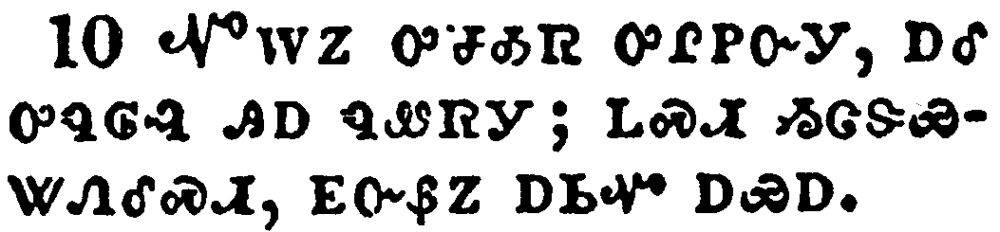</a></td>
</tr>
<tr class="even">
<td>And Paul went down, and fell on him, and embracing him said, Trouble not yourselves; for his life is in him.</td>
</tr>
<tr class="odd">
<td>ᏉᎳᏃ ᎤᏠᎣᏒ ᎤᎵᏢᏅᎩ, ᎠᎴ ᎤᏄᎶᎸ ᎯᎠ ᏄᏪᏒᎩ; ᏞᏍᏗ ᏱᏣᏕᏯᏔᏁᎴᏍᏗ, ᎬᏅᏰᏃ ᎠᏏᏉ ᎠᏯᎠ.</td>
</tr>
<tr class="even">
<td>Quo-la-no u-tlo-o-sv u-li-tlv-nv-gi, a-le u-nu-lo-lv hi-a nu-we-sv-gi; tle-s-di yi-tsa-de-ya-ta-ne-le-s-di, gv-nv-ye-no a-si-quo a-ya-a.</td>
</tr>
</tbody>
</table>

<table>
<tbody>
<tr class="odd">
<td><a href="052011.png">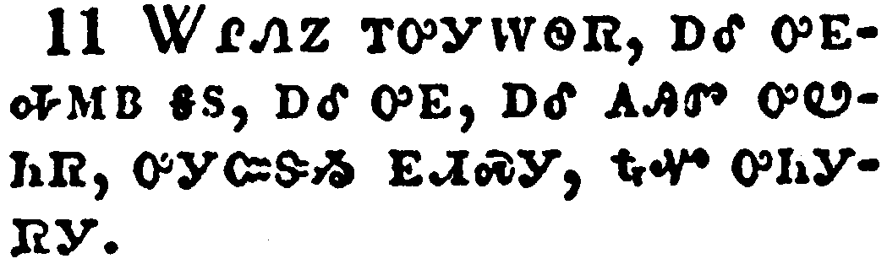</a></td>
</tr>
<tr class="even">
<td>When he therefore was come up again, and had broken bread, and eaten, and talked a long while, even till break of day, so he departed.</td>
</tr>
<tr class="odd">
<td>ᏔᎵᏁᏃ ᎢᎤᎩᎳᏫᏒ, ᎠᎴ ᎤᎬᎭᎷᏴ ᎦᏚ, ᎠᎴ ᎤᎬ, ᎠᎴ ᎪᎯᏛ ᎤᏬᏂᏒ, ᎤᎩᏨᏕᏱ ᎬᏗᏍᎩ, ᎿᎭᏉ ᎤᏂᎩᏒᎩ.</td>
</tr>
<tr class="even">
<td>Ta-li-ne-no i-u-gi-la-wi-sv, a-le u-gv-ha-lu-yv ga-du, a-le u-gv, a-le go-hi-dv u-wo-ni-sv, u-gi-tsv-de-yi gv-di-s-gi, hna-quo u-ni-gi-sv-gi.</td>
</tr>
</tbody>
</table>

<table>
<tbody>
<tr class="odd">
<td><a href="052012.png">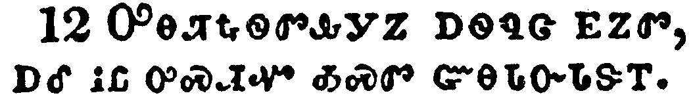</a></td>
</tr>
<tr class="even">
<td>And they brought the young man alive, and were not a little comforted.</td>
</tr>
<tr class="odd">
<td>ᎤᎾᏘᎿᎭᏫᏛᎲᎩᏃ ᎠᏫᏄᏣ ᎬᏃᏛ, ᎠᎴ ᎥᏝ ᎤᏍᏗᏉ ᎣᏍᏛ ᏳᎾᏓᏅᏓᏕᎢ.</td>
</tr>
<tr class="even">
<td>U-na-ti-hna-wi-dv-hv-gi-no a-wi-nu-tsa gv-no-dv, a-le v-tla u-s-di-quo o-s-dv yu-na-da-nv-da-de-i.</td>
</tr>
</tbody>
</table>

<table>
<tbody>
<tr class="odd">
<td><a href="052013.png">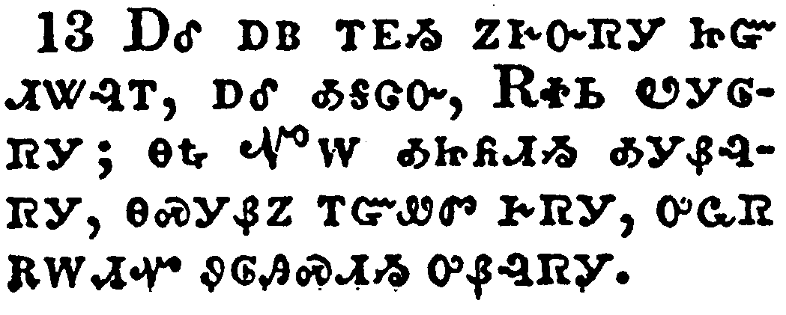</a></td>
</tr>
<tr class="even">
<td>And we went before to ship, and sailed unto Assos, there intending to take in Paul: for so had he appointed, minding himself to go afoot.</td>
</tr>
<tr class="odd">
<td>ᎠᎴ ᎠᏴ ᎢᎬᏱ ᏃᎨᏅᏒᎩ ᏥᏳ ᏗᏔᎸᎢ, ᎠᎴ ᎣᎦᏣᏅ, ᎡᏐᏏ ᏬᎩᎶᏒᎩ; ᎾᎿᎭᏉᎳ ᎣᏥᏲᏗᏱ ᎣᎩᏰᎸᏒᎩ, ᎾᏍᎩᏰᏃ ᎢᏳᏪᏛ ᎨᏒᎩ, ᎤᏩᏒ ᎡᎳᏗᏉ ᏭᎶᎯᏍᏗᏱ ᎤᏰᎸᏒᎩ.</td>
</tr>
<tr class="even">
<td>A-le a-yv i-gv-yi no-ge-nv-sv-gi tsi-yu di-ta-lv-i, a-le o-ga-tsa-nv, E-so-si wo-gi-lo-sv-gi; na-hna Quo-la o-tsi-yo-di-yi o-gi-ye-lv-sv-gi, na-s-gi-ye-no i-yu-we-dv ge-sv-gi, u-wa-sv e-la-di-quo wu-lo-hi-s-di-yi u-ye-lv-sv-gi.</td>
</tr>
</tbody>
</table>

<table>
<tbody>
<tr class="odd">
<td><a href="052014.png">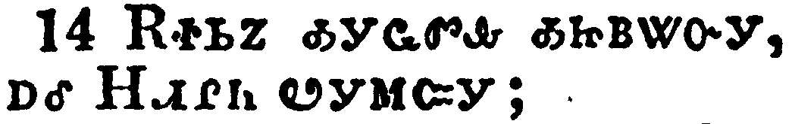</a></td>
</tr>
<tr class="even">
<td>And when he met with us at Assos, we took him in, and came to Mitylene.</td>
</tr>
<tr class="odd">
<td>ᎡᏐᏏᏃ ᎣᎩᏩᏛᎲ ᎣᏥᏴᏔᏅᎩ, ᎠᎴ ᎻᏗᎵᏂ ᏬᎩᎷᏨᎩ;</td>
</tr>
<tr class="even">
<td>E-so-si-no o-gi-wa-dv-hv o-tsi-yv-ta-nv-gi, a-le Mi-di-li-ni wo-gi-lu-tsv-gi;</td>
</tr>
</tbody>
</table>

<table>
<tbody>
<tr class="odd">
<td><a href="052015.png">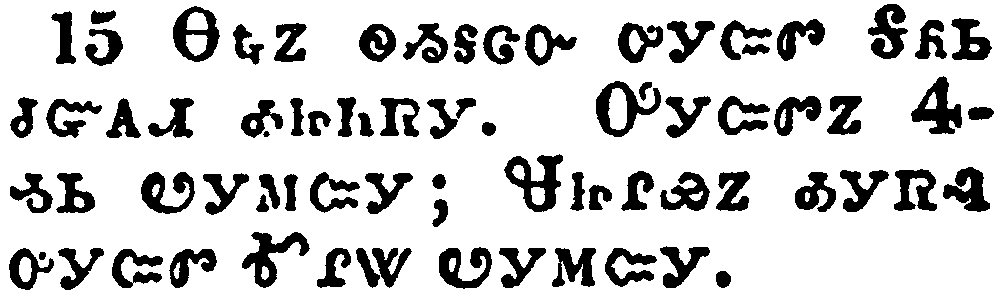</a></td>
</tr>
<tr class="even">
<td>And we sailed thence, and came the next day over against Chios; and the next day we arrived at Samos, and tarried at Trogyllium; and the next day we came to Miletus.</td>
</tr>
<tr class="odd">
<td>ᎾᎿᎭᏃ ᏫᏱᎦᏣᏅ ᎤᎩᏨᏛ ᎦᏲᏏ ᏧᏳᎪᏗ ᎣᏥᏂᏒᎩ. ᎤᎩᏨᏛᏃ ᏎᎼᏏ ᏬᎩᎷᏨᎩ; ᏠᏥᎵᏯᏃ ᎣᎩᏒᎸ ᎤᎩᏨᏛ ᎹᎵᏔ ᏬᎩᎷᏨᎩ.</td>
</tr>
<tr class="even">
<td>Na-hna-no wi-yi-ga-tsa-nv u-gi-tsv-dv Ga-yo-si tsu-yu-go-di o-tsi-ni-sv-gi. U-gi-tsv-dv-no Se-mo-si wo-gi-lu-tsv-gi; Tlo-tsi-li-ya-no o-gi-sv-lv u-gi-tsv-dv Ma-li-ta wo-gi-lu-tsv-gi.</td>
</tr>
</tbody>
</table>

<table>
<tbody>
<tr class="odd">
<td><a href="052016.png">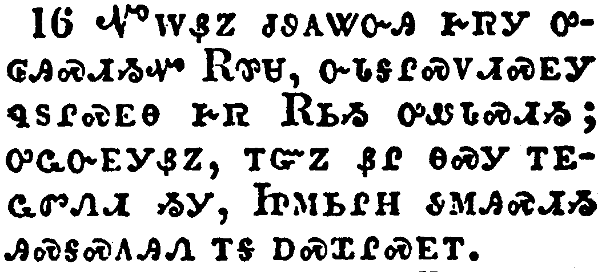</a></td>
</tr>
<tr class="even">
<td>For Paul had determined to sail by Ephesus, because he would not spend the time in Asia: for he hasted, if it were possible for him, to be at Jerusalem the day of Pentecost.</td>
</tr>
<tr class="odd">
<td>ᏉᎳᏰᏃ ᏧᏭᎪᏔᏅᎯ ᎨᏒᎩ ᎤᎶᎯᏍᏗᏱᏉ ᎡᏈᏌ, ᏅᏓᎦᎵᏍᏙᏗᏍᎬᎩ ᏄᏚᎵᏍᎬᎾ ᎨᏒ ᎡᏏᏱ ᎤᏪᏓᏍᏗᏱ; ᎤᏩᏅᎬᎩᏰᏃ, ᎢᏳᏃ ᏰᎵ ᎾᏍᎩ ᎢᎬᏩᏛᏁᏗ ᏱᎩ, ᏥᎷᏏᎵᎻ ᏭᎷᎯᏍᏗᏱ ᎯᏍᎦᏍᎪᎯᏁ ᎢᎦ ᎠᏍᏆᎵᏍᎬᎢ.</td>
</tr>
<tr class="even">
<td>Quo-la-ye-no tsu-wu-go-ta-nv-hi ge-sv-gi u-lo-hi-s-di-yi-quo E-qui-sa, nv-da-ga-li-s-do-di-s-gv-gi nu-du-li-s-gv-na ge-sv E-si-yi u-we-da-s-di-yi; u-wa-nv-gv-gi-ye-no, i-yu-no ye-li na-s-gi i-gv-wa-dv-ne-di yi-gi, Tsi-lu-si-li-mi wu-lu-hi-s-di-yi hi-s-ga-s-go-hi-ne i-ga a-s-qua-li-s-gv-i.</td>
</tr>
</tbody>
</table>

<table>
<tbody>
<tr class="odd">
<td><a href="052017.png">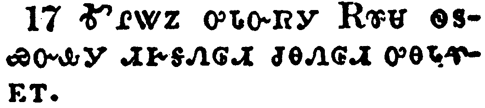</a></td>
</tr>
<tr class="even">
<td>And from Miletus he sent to Ephesus, and called the elders of the church.</td>
</tr>
<tr class="odd">
<td>ᎹᎵᏔᏃ ᎤᏓᏅᏒᎩ ᎡᏈᏌ ᏫᏚᏯᏅᎲᎩ ᏗᎨᎦᏁᎶᏗ ᏧᎾᏁᎶᏗ ᎤᎾᏓᏡᎬᎢ.</td>
</tr>
<tr class="even">
<td>Ma-li-ta-no u-da-nv-sv-gi E-qui-sa wi-du-ya-nv-hv-gi di-ge-ga-ne-lo-di tsu-na-ne-lo-di u-na-da-tlu-gv-i.</td>
</tr>
</tbody>
</table>

<table>
<tbody>
<tr class="odd">
<td><a href="052018.png">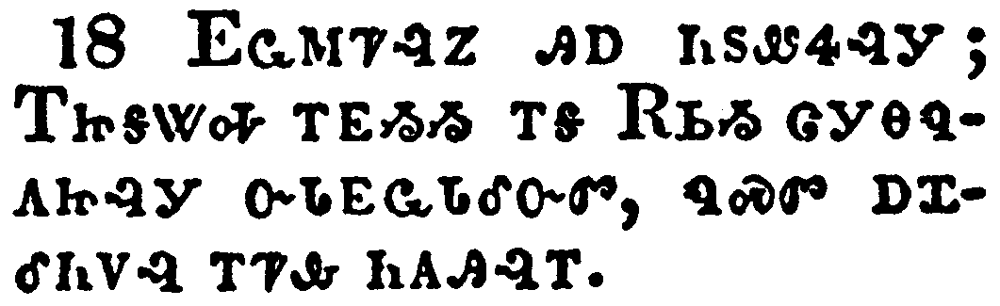</a></td>
</tr>
<tr class="even">
<td>And when they were come to him, he said unto them, Ye know, from the first day that I came into Asia, after what manner I have been with you at all seasons,</td>
</tr>
<tr class="odd">
<td>ᎬᏩᎷᏤᎸᏃ ᎯᎠ ᏂᏚᏪᏎᎸᎩ; ᎢᏥᎦᏔᎭ ᎢᎬᏱᏱ ᎢᎦ ᎡᏏᏱ ᏣᎩᎾᏄᎪᏥᎸᎩ ᏅᏓᎬᏩᏓᎴᏅᏛ, ᏄᏍᏛ ᎠᏆᎵᏂᏙᎸ ᎢᏤᎲ ᏂᎪᎯᎸᎢ.</td>
</tr>
<tr class="even">
<td>Gv-wa-lu-tse-lv-no hi-a ni-du-we-se-lv-gi; I-tsi-ga-ta-ha i-gv-yi-yi i-ga E-si-yi tsa-gi-na-nu-go-tsi-lv-gi nv-da-gv-wa-da-le-nv-dv, nu-s-dv a-qua-li-ni-do-lv i-tse-hv ni-go-hi-lv-i.</td>
</tr>
</tbody>
</table>

<table>
<tbody>
<tr class="odd">
<td><a href="052019.png">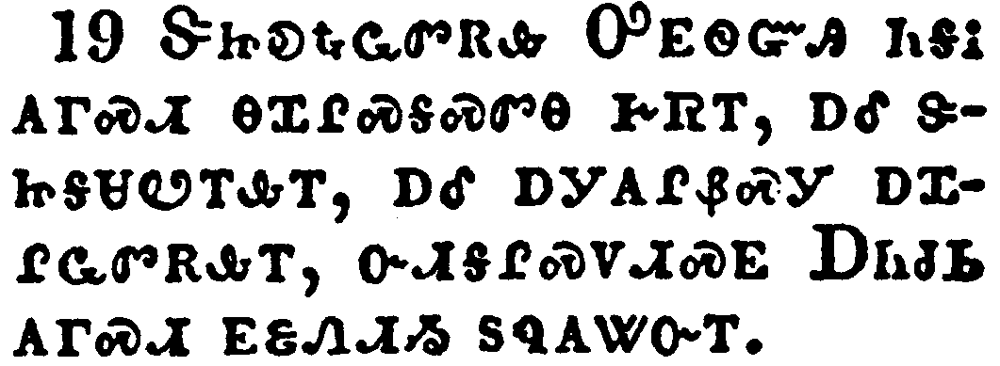</a></td>
</tr>
<tr class="even">
<td>Serving the Lord with all humility of mind, and with many tears, and temptations, which befell me by the lying in wait of the Jews:</td>
</tr>
<tr class="odd">
<td>ᏕᏥᎧᎿᎭᏩᏛᎡᎲ ᎤᎬᏫᏳᎯ ᏂᎦᎥ ᎪᎱᏍᏗ ᎾᏆᎵᏍᎦᏍᏛᎾ ᎨᏒᎢ, ᎠᎴ ᏕᏥᎦᏌᏬᎢᎲᎢ, ᎠᎴ ᎠᎩᎪᎵᏰᏍᎩ ᎠᏆᎵᏩᏛᎡᎲᎢ, ᏅᏗᎦᎵᏍᏙᏗᏍᎬ ᎠᏂᏧᏏ ᎪᎱᏍᏗ ᎬᏋᏁᏗᏱ ᏚᏄᎪᏔᏅᎢ.</td>
</tr>
<tr class="even">
<td>De-tsi-ka-hna-wa-dv-e-hv U-gv-wi-yu-hi ni-ga-v go-hu-s-di na-qua-li-s-ga-s-dv-na ge-sv-i, a-le de-tsi-ga-sa-wo-i-hv-i, a-le a-gi-go-li-ye-s-gi a-qua-li-wa-dv-e-hv-i, nv-di-ga-li-s-do-di-s-gv A-ni-tsu-si go-hu-s-di gv-quv-ne-di-yi du-nu-go-ta-nv-i.</td>
</tr>
</tbody>
</table>

<table>
<tbody>
<tr class="odd">
<td><a href="052020.png">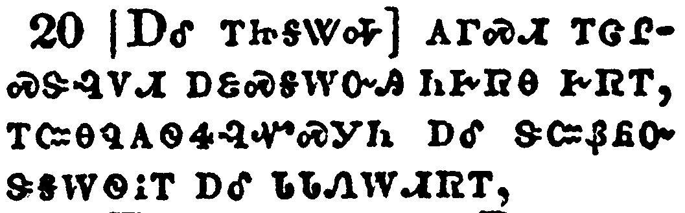</a></td>
</tr>
<tr class="even">
<td>And how I kept back nothing that was profitable unto you, but have shewed you, and have taught you publickly, and from house to house,</td>
</tr>
<tr class="odd">
<td>[ᎠᎴ ᎢᏥᎦᏔᎭ] ᎪᎱᏍᏗ ᎢᏣᎵᏍᏕᎸᏙᏗ ᎠᏋᏍᎦᎳᏅᎯ ᏂᎨᏒᎾ ᎨᏒᎢ, ᎢᏨᎾᏄᎪᏫᏎᎸᏉᏍᎩᏂ ᎠᎴ ᏕᏨᏰᏲᏅ ᏕᎦᎳᏫᎥᎢ ᎠᎴ ᏓᏓᏁᎳᏗᏒᎢ,</td>
</tr>
<tr class="even">
<td>[A-le i-tsi-ga-ta-ha] go-hu-s-di i-tsa-li-s-de-lv-do-di a-quv-s-ga-la-nv-hi ni-ge-sv-na ge-sv-i, i-tsv-na-nu-go-wi-se-lv-quo-s-gi-ni a-le de-tsv-ye-yo-nv de-ga-la-wi-v-i a-le da-da-ne-la-di-sv-i,</td>
</tr>
</tbody>
</table>

<table>
<tbody>
<tr class="odd">
<td><a href="052021.png">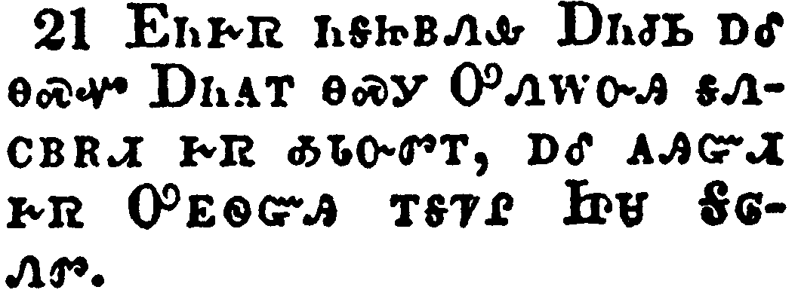</a></td>
</tr>
<tr class="even">
<td>Testifying both to the Jews, and also to the Greeks, repentance toward God, and faith toward our Lord Jesus Christ.</td>
</tr>
<tr class="odd">
<td>ᎬᏂᎨᏒ ᏂᎦᏥᏴᏁᎲ ᎠᏂᏧᏏ ᎠᎴ ᎾᏍᏉ ᎠᏂᎪᎢ ᎾᏍᎩ ᎤᏁᎳᏅᎯ ᎦᏁᏟᏴᎡᏗ ᎨᏒ ᎣᏓᏅᏛᎢ, ᎠᎴ ᎪᎯᏳᏗ ᎨᏒ ᎤᎬᏫᏳᎯ ᎢᎦᏤᎵ ᏥᏌ ᎦᎶᏁᏛ.</td>
</tr>
<tr class="even">
<td>Gv-ni-ge-sv ni-ga-tsi-yv-ne-hv A-ni-tsu-si a-le na-s-quo A-ni-go-i na-s-gi U-ne-la-nv-hi ga-ne-tli-yv-e-di ge-sv o-da-nv-dv-i, a-le go-hi-yu-di ge-sv U-gv-wi-yu-hi i-ga-tse-li Tsi-sa Ga-lo-ne-dv.</td>
</tr>
</tbody>
</table>

<table>
<tbody>
<tr class="odd">
<td><a href="052022.png">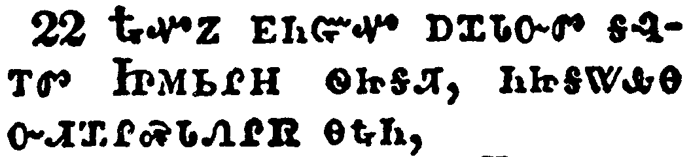</a></td>
</tr>
<tr class="even">
<td>And now, behold, I go bound in the spirit unto Jerusalem, not knowing the things that shall befall me there:</td>
</tr>
<tr class="odd">
<td>ᎿᎭᏉᏃ ᎬᏂᏳᏉ ᎠᏆᏓᏅᏛ ᎦᎸᎢᏛ ᏥᎷᏏᎵᎻ ᏫᏥᎦᏘ, ᏂᏥᎦᏔᎲᎾ ᏅᏗᏆᎵᏍᏓᏁᎵᏒ ᎾᎿᎭᏂ,</td>
</tr>
<tr class="even">
<td>Hna-quo-no gv-ni-yu-quo a-qua-da-nv-dv ga-lv-i-dv Tsi-lu-si-li-mi wi-tsi-ga-ti, ni-tsi-ga-ta-hv-na nv-di-qua-li-s-da-ne-li-sv na-hna-ni,</td>
</tr>
</tbody>
</table>

<table>
<tbody>
<tr class="odd">
<td><a href="052023.png">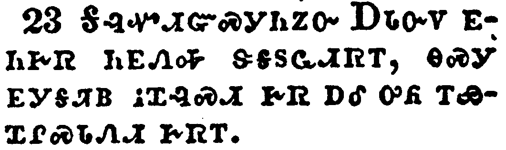</a></td>
</tr>
<tr class="even">
<td>Save that the Holy Ghost witnesseth in every city, saying that bonds and afflictions abide me.</td>
</tr>
<tr class="odd">
<td>ᎦᎸᏉᏗᏳᏍᎩᏂᏃᏅ ᎠᏓᏅᏙ ᎬᏂᎨᏒ ᏂᎬᏁᎭ ᏕᎦᏚᏩᏗᏒᎢ, ᎾᏍᎩ ᎬᎩᎦᏘᏴ ᎥᏆᎸᏍᏗ ᎨᏒ ᎠᎴ ᎤᏲ ᎢᏯᏆᎵᏍᏓᏁᏗ ᎨᏒᎢ.</td>
</tr>
<tr class="even">
<td>Ga-lv-quo-di-yu-s-gi-ni-no-nv A-da-nv-do gv-ni-ge-sv ni-gv-ne-ha de-ga-du-wa-di-sv-i, na-s-gi gv-gi-ga-ti-yv v-qua-lv-s-di ge-sv a-le u-yo i-ya-qua-li-s-da-ne-di ge-sv-i.</td>
</tr>
</tbody>
</table>

<table>
<tbody>
<tr class="odd">
<td><a href="052024.png">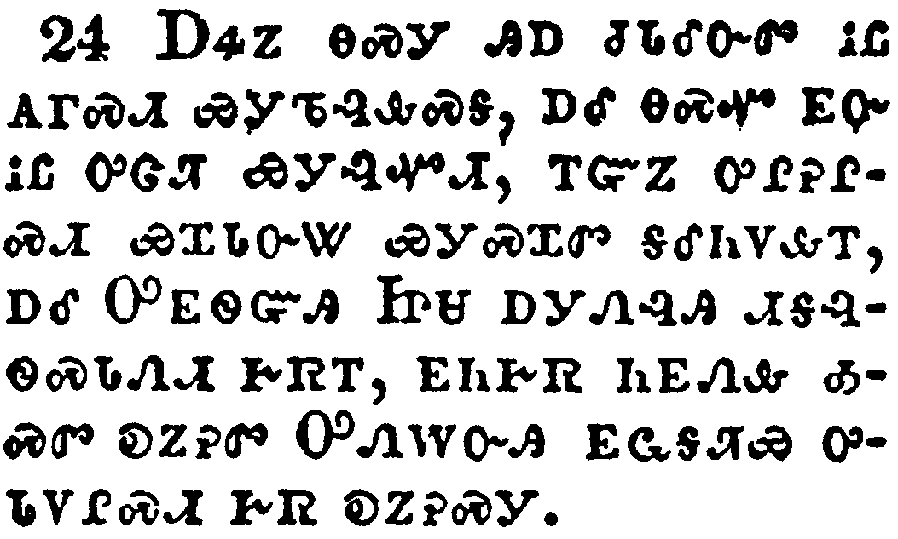</a></td>
</tr>
<tr class="even">
<td>But none of these things move me, neither count I my life dear unto myself, so that I might finish my course with joy, and the ministry, which I have received of the Lord Jesus, to testify the gospel of the grace of God.</td>
</tr>
<tr class="odd">
<td>ᎠᏎᏃ ᎾᏍᎩ ᎯᎠ ᏧᏓᎴᏅᏛ ᎥᏝ ᎪᎱᏍᏗ ᏯᎩᏖᎸᎲᏍᎦ, ᎠᎴ ᎾᏍᏉ ᎬᏅ ᎥᏝ ᎤᏣᏘ ᏯᎩᎸᏉᏗ, ᎢᏳᏃ ᎤᎵᎮᎵᏍᏗ ᏯᏆᏓᏅᏔ ᏯᎩᏍᏆᏛ ᎦᎴᏂᏙᎲᎢ, ᎠᎴ ᎤᎬᏫᏳᎯ ᏥᏌ ᎠᎩᏁᎸᎯ ᏗᎦᎸᏫᏍᏓᏁᏗ ᎨᏒᎢ, ᎬᏂᎨᏒ ᏂᎬᏁᎲ ᎣᏍᏛ ᎧᏃᎮᏛ ᎤᏁᎳᏅᎯ ᎬᏩᎦᏘᏯ ᎤᏓᏙᎵᏍᏗ ᎨᏒ ᎧᏃᎮᏍᎩ.</td>
</tr>
<tr class="even">
<td>A-se-no na-s-gi hi-a tsu-da-le-nv-dv v-tla go-hu-s-di ya-gi-te-lv-hv-s-ga, a-le na-s-quo gv-nv v-tla u-tsa-ti ya-gi-lv-quo-di, i-yu-no u-li-he-li-s-di ya-qua-da-nv-ta ya-gi-s-qua-dv ga-le-ni-do-hv-i, a-le U-gv-wi-yu-hi Tsi-sa a-gi-ne-lv-hi di-ga-lv-wi-s-da-ne-di ge-sv-i, gv-ni-ge-sv ni-gv-ne-hv o-s-dv ka-no-he-dv U-ne-la-nv-hi gv-wa-ga-ti-ya u-da-do-li-s-di ge-sv ka-no-he-s-gi.</td>
</tr>
</tbody>
</table>

<table>
<tbody>
<tr class="odd">
<td><a href="052025.png">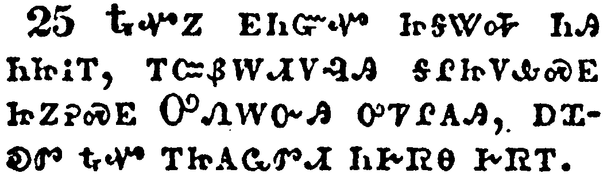</a></td>
</tr>
<tr class="even">
<td>And now, behold, I know that ye all, among whom I have gone preaching the kingdom of God, shall see my face no more.</td>
</tr>
<tr class="odd">
<td>ᎿᎭᏉᏃ ᎬᏂᏳᏉ ᏥᎦᏔᎭ ᏂᎯ ᏂᏥᎥᎢ, ᎢᏨᏰᎳᏗᏙᎸᎯ ᎦᎵᏥᏙᎲᏍᎬ ᏥᏃᎮᏍᎬ ᎤᏁᎳᏅᎯ ᎤᏤᎵᎪᎯ, ᎠᏆᎧᏛ ᎿᎭᏉ ᎢᏥᎪᏩᏛᏗ ᏂᎨᏒᎾ ᎨᏒᎢ.</td>
</tr>
<tr class="even">
<td>Hna-quo-no gv-ni-yu-quo tsi-ga-ta-ha ni-hi ni-tsi-v-i, i-tsv-ye-la-di-do-lv-hi ga-li-tsi-do-hv-s-gv tsi-no-he-s-gv U-ne-la-nv-hi u-tse-li-go-hi, a-qua-ka-dv hna-quo i-tsi-go-wa-dv-di ni-ge-sv-na ge-sv-i.</td>
</tr>
</tbody>
</table>

<table>
<tbody>
<tr class="odd">
<td><a href="052026.png">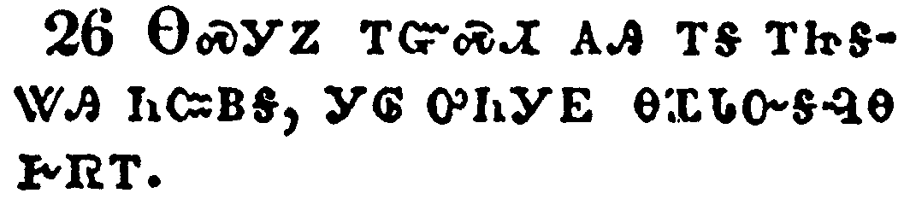</a></td>
</tr>
<tr class="even">
<td>Wherefore I take you to record this day, that I am pure from the blood of all men.</td>
</tr>
<tr class="odd">
<td>ᎾᏍᎩᏃ ᎢᏳᏍᏗ ᎪᎯ ᎢᎦ ᎢᏥᎦᏔᎯ ᏂᏨᏴᎦ, ᎩᎶ ᎤᏂᎩᎬ ᎾᏆᏓᏅᎦᎸᎾ ᎨᏒᎢ.</td>
</tr>
<tr class="even">
<td>Na-s-gi-no i-yu-s-di go-hi i-ga i-tsi-ga-ta-hi ni-tsv-yv-ga, gi-lo u-ni-gi-gv na-qua-da-nv-ga-lv-na ge-sv-i.</td>
</tr>
</tbody>
</table>

<table>
<tbody>
<tr class="odd">
<td><a href="052027.png">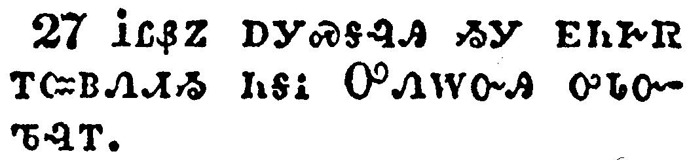</a></td>
</tr>
<tr class="even">
<td>For I have not shunned to declare unto you all the counsel of God.</td>
</tr>
<tr class="odd">
<td>ᎥᏝᏰᏃ ᎠᎩᏍᎦᎸᎯ ᏱᎩ ᎬᏂᎨᏒ ᎢᏨᏴᏁᏗᏱ ᏂᎦᎥ ᎤᏁᎳᏅᎯ ᎤᏓᏅᏖᎸᎢ.</td>
</tr>
<tr class="even">
<td>V-tla-ye-no a-gi-s-ga-lv-hi yi-gi gv-ni-ge-sv i-tsv-yv-ne-di-yi ni-ga-v U-ne-la-nv-hi u-da-nv-te-lv-i.</td>
</tr>
</tbody>
</table>

<table>
<tbody>
<tr class="odd">
<td><a href="052028.png">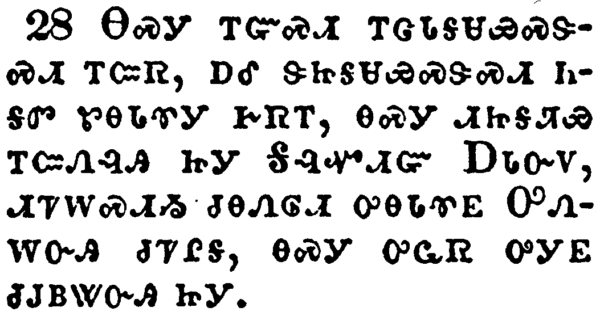</a></td>
</tr>
<tr class="even">
<td>Take heed therefore unto yourselves, and to all the flock, over the which the Holy Ghost hath made you overseers, to feed the church of God, which he hath purchased with his own blood.</td>
</tr>
<tr class="odd">
<td>ᎾᏍᎩ ᎢᏳᏍᏗ ᎢᏣᏓᎦᏌᏯᏍᏕᏍᏗ ᎢᏨᏒ, ᎠᎴ ᏕᏥᎦᏌᏯᏍᏕᏍᏗ ᏂᎦᏛ ᏑᎾᏓᏡᎩ ᎨᏒᎢ, ᎾᏍᎩ ᏗᏥᎦᏘᏯ ᎢᏨᏁᎸᎯ ᏥᎩ ᎦᎸᏉᏗᏳ ᎠᏓᏅᏙ, ᏗᏤᎳᏍᏗᏱ ᏧᎾᏁᎶᏗ ᎤᎾᏓᏡᎬ ᎤᏁᎳᏅᎯ ᏧᏤᎵᎦ, ᎾᏍᎩ ᎤᏩᏒ ᎤᎩᎬ ᏧᎫᏴᏔᏅᎯ ᏥᎩ.</td>
</tr>
<tr class="even">
<td>Na-s-gi i-yu-s-di i-tsa-da-ga-sa-ya-s-de-s-di i-tsv-sv, a-le de-tsi-ga-sa-ya-s-de-s-di ni-ga-dv su-na-da-tlu-gi ge-sv-i, na-s-gi di-tsi-ga-ti-ya i-tsv-ne-lv-hi tsi-gi Ga-lv-quo-di-yu A-da-nv-do, di-tse-la-s-di-yi tsu-na-ne-lo-di u-na-da-tlu-gv U-ne-la-nv-hi tsu-tse-li-ga, na-s-gi u-wa-sv u-gi-gv tsu-gu-yv-ta-nv-hi tsi-gi.</td>
</tr>
</tbody>
</table>

<table>
<tbody>
<tr class="odd">
<td><a href="052029.png">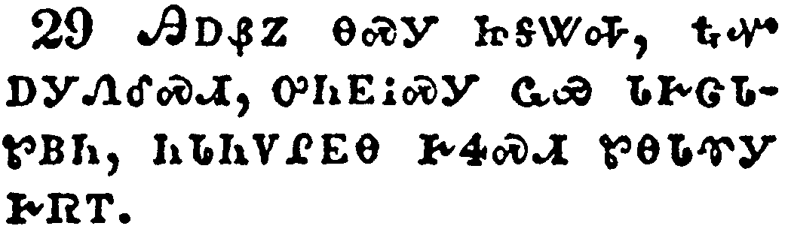</a></td>
</tr>
<tr class="even">
<td>For I know this, that after my departing shall grievous wolves enter in among you, not sparing the flock.</td>
</tr>
<tr class="odd">
<td>ᎯᎠᏰᏃ ᎾᏍᎩ ᏥᎦᏔᎭ, ᎿᎭᏉ ᎠᎩᏁᎴᏍᏗ, ᎤᏂᎬᎥᏍᎩ ᏩᏯ ᏓᎨᏣᏓᏑᏴᏂ, ᏂᏓᏂᏙᎵᎬᎾ ᎨᏎᏍᏗ ᏑᎾᏓᏡᎩ ᎨᏒᎢ.</td>
</tr>
<tr class="even">
<td>Hi-a-ye-no na-s-gi tsi-ga-ta-ha, hna-quo a-gi-ne-le-s-di, u-ni-gv-v-s-gi wa-ya da-ge-tsa-da-su-yv-ni, ni-da-ni-do-li-gv-na ge-se-s-di su-na-da-tlu-gi ge-sv-i.</td>
</tr>
</tbody>
</table>

<table>
<tbody>
<tr class="odd">
<td><a href="052030.png">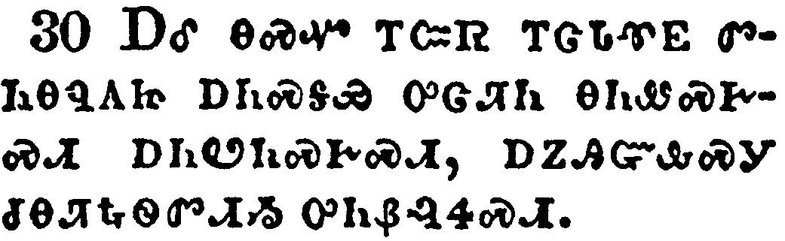</a></td>
</tr>
<tr class="even">
<td>Also of your own selves shall men arise, speaking perverse things, to draw away disciples after them.</td>
</tr>
<tr class="odd">
<td>ᎠᎴ ᎾᏍᏉ ᎢᏨᏒ ᎢᏣᏓᏡᎬ ᏛᏂᎾᏄᎪᏥ ᎠᏂᏍᎦᏯ ᎤᏣᏘᏂ ᎾᏂᏪᏍᎨᏍᏗ ᎠᏂᏬᏂᏍᎨᏍᏗ, ᎠᏃᎯᏳᎲᏍᎩ ᏧᎾᏘᎿᎭᏫᏛᏗᏱ ᎤᏂᏰᎸᏎᏍᏗ.</td>
</tr>
<tr class="even">
<td>A-le na-s-quo i-tsv-sv i-tsa-da-tlu-gv dv-ni-na-nu-go-tsi a-ni-s-ga-ya u-tsa-ti-ni na-ni-we-s-ge-s-di a-ni-wo-ni-s-ge-s-di, a-no-hi-yu-hv-s-gi tsu-na-ti-hna-wi-dv-di-yi u-ni-ye-lv-se-s-di.</td>
</tr>
</tbody>
</table>

<table>
<tbody>
<tr class="odd">
<td><a href="052031.png">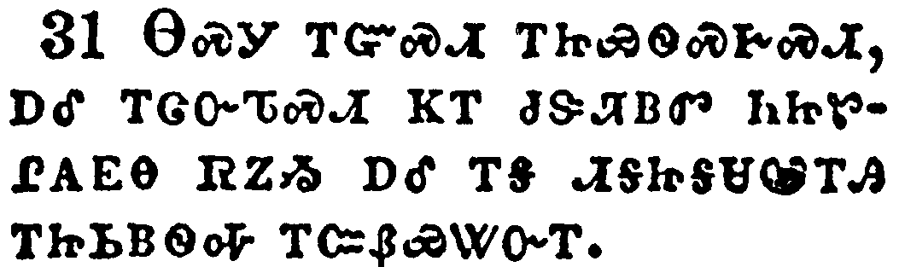</a></td>
</tr>
<tr class="even">
<td>Therefore watch, and remember, that by the space of three years I ceased not to warn every one night and day with tears.</td>
</tr>
<tr class="odd">
<td>ᎾᏍᎩ ᎢᏳᏍᏗ ᎢᏥᏯᏫᏍᎨᏍᏗ, ᎠᎴ ᎢᏣᏅᏖᏍᏗ ᏦᎢ ᏧᏕᏘᏴᏛ ᏂᏥᏑᎵᎪᎬᎾ ᏒᏃᏱ ᎠᎴ ᎢᎦ ᏗᎦᏥᎦᏌᏬᎢᎯ ᎢᏥᏏᏴᏫᎭ ᎢᏨᏰᏯᏔᏅᎢ.</td>
</tr>
<tr class="even">
<td>Na-s-gi i-yu-s-di i-tsi-ya-wi-s-ge-s-di, a-le i-tsa-nv-te-s-di tso-i tsu-de-ti-yv-dv ni-tsi-su-li-go-gv-na sv-no-yi a-le i-ga di-ga-tsi-ga-sa-wo-i-hi i-tsi-si-yv-wi-ha i-tsv-ye-ya-ta-nv-i.</td>
</tr>
</tbody>
</table>

<table>
<tbody>
<tr class="odd">
<td><a href="052032.png">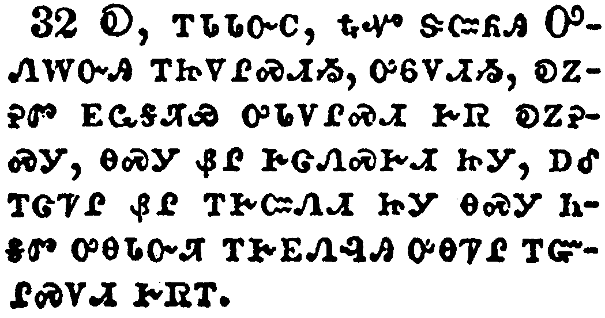</a></td>
</tr>
<tr class="even">
<td>And now, brethren, I commend you to God, and to the word of his grace, which is able to build you up, and to give you an inheritance among all them which are sanctified.</td>
</tr>
<tr class="odd">
<td>Ꭷ, ᎢᏓᏓᏅᏟ, ᎿᎭᏉ ᏕᏨᏲᎯ ᎤᏁᎳᏅᎯ ᎢᏥᏙᎵᏍᏗᏱ, ᎤᏮᏙᏗᏱ, ᎧᏃᎮᏛ ᎬᏩᎦᏘᏯ ᎤᏓᏙᎵᏍᏗ ᎨᏒ ᎧᏃᎮᏍᎩ, ᎾᏍᎩ ᏰᎵ ᎨᏣᏁᏍᎨᏗ ᏥᎩ, ᎠᎴ ᎢᏣᏤᎵ ᏰᎵ ᎢᎨᏨᏁᏗ ᏥᎩ ᎾᏍᎩ ᏂᎦᏛ ᎤᎾᏓᏅᏘ ᎢᎨᎬᏁᎸᎯ ᎤᎾᏤᎵ ᎢᏳᎵᏍᏙᏗ ᎨᏒᎢ.</td>
</tr>
<tr class="even">
<td>Ka, i-da-da-nv-tli, hna-quo de-tsv-yo-hi U-ne-la-nv-hi i-tsi-do-li-s-di-yi, u-wv-do-di-yi, ka-no-he-dv gv-wa-ga-ti-ya u-da-do-li-s-di ge-sv ka-no-he-s-gi, na-s-gi ye-li ge-tsa-ne-s-ge-di tsi-gi, a-le i-tsa-tse-li ye-li i-ge-tsv-ne-di tsi-gi na-s-gi ni-ga-dv u-na-da-nv-ti i-ge-gv-ne-lv-hi u-na-tse-li i-yu-li-s-do-di ge-sv-i.</td>
</tr>
</tbody>
</table>

<table>
<tbody>
<tr class="odd">
<td><a href="052033.png">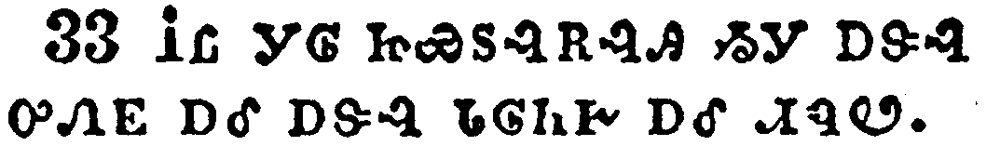</a></td>
</tr>
<tr class="even">
<td>I have coveted no man's silver, or gold, or apparel.</td>
</tr>
<tr class="odd">
<td>ᎥᏝ ᎩᎶ ᏥᏯᏚᎸᎡᎸᎯ ᏱᎩ ᎠᏕᎸ ᎤᏁᎬ ᎠᎴ ᎠᏕᎸ ᏓᎶᏂᎨ ᎠᎴ ᏗᏄᏬ.</td>
</tr>
<tr class="even">
<td>V-tla gi-lo tsi-ya-du-lv-e-lv-hi yi-gi a-de-lv u-ne-gv a-le a-de-lv da-lo-ni-ge a-le di-nu-wo.</td>
</tr>
</tbody>
</table>

<table>
<tbody>
<tr class="odd">
<td><a href="052034.png">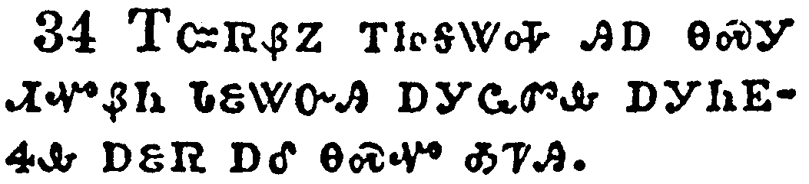</a></td>
</tr>
<tr class="even">
<td>Yea, ye yourselves know, that these hands have ministered unto my necessities, and to them that were with me.</td>
</tr>
<tr class="odd">
<td>ᎢᏨᏒᏰᏃ ᎢᏥᎦᏔᎭ ᎯᎠ ᎾᏍᎩ ᏗᏉᏰᏂ ᏓᏋᏔᏅᎯ ᎠᎩᏩᏛᎲ ᎠᎩᏂᎬᏎᎲ ᎠᏋᏒ ᎠᎴ ᎾᏍᏉ ᎣᏤᎯ.</td>
</tr>
<tr class="even">
<td>I-tsv-sv-ye-no i-tsi-ga-ta-ha hi-a na-s-gi di-quo-ye-ni da-quv-ta-nv-hi a-gi-wa-dv-hv a-gi-ni-gv-se-hv a-quv-sv a-le na-s-quo o-tse-hi.</td>
</tr>
</tbody>
</table>

<table>
<tbody>
<tr class="odd">
<td><a href="052035.png">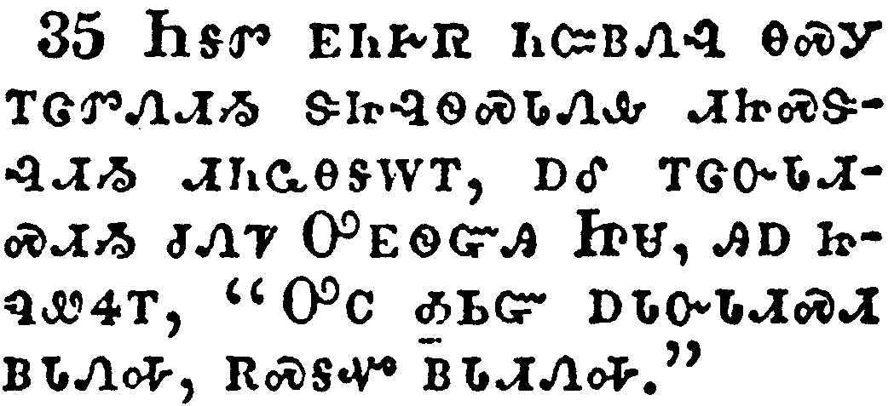</a></td>
</tr>
<tr class="even">
<td>I have shewed you all things, how that so labouring ye ought to support the weak, and to remember the words of the Lord Jesus, how he said, It is more blessed to give than to receive.</td>
</tr>
<tr class="odd">
<td>ᏂᎦᏛ ᎬᏂᎨᏒ ᏂᏨᏴᏁᎸ ᎾᏍᎩ ᎢᏣᏛᏁᏗᏱ ᏕᏥᎸᏫᏍᏓᏁᎲ ᏗᏥᏍᏕᎸᏗᏱ ᏗᏂᏩᎾᎦᎳᎢ, ᎠᎴ ᎢᏣᏅᏓᏗᏍᏗᏱ ᏧᏁᏤ ᎤᎬᏫᏳᎯ ᏥᏌ, ᎯᎠ ᏥᏄᏪᏎᎢ, "ᎤᏟ ᎣᏏᏳ ᎠᏓᏅᏓᏗᏍᏗ ᏴᏓᏁᎭ, ᎡᏍᎦᏉ ᏴᏓᏗᏁᎭ."</td>
</tr>
<tr class="even">
<td>Ni-ga-dv gv-ni-ge-sv ni-tsv-yv-ne-lv na-s-gi i-tsa-dv-ne-di-yi de-tsi-lv-wi-s-da-ne-hv di-tsi-s-de-lv-di-yi di-ni-wa-na-ga-la-i, a-le i-tsa-nv-da-di-s-di-yi tsu-ne-tse U-gv-wi-yu-hi Tsi-sa, hi-a tsi-nu-we-se-i, "U-tli o-si-yu a-da-nv-da-di-s-di yv-da-ne-ha, e-s-ga-quo yv-da-di-ne-ha."</td>
</tr>
</tbody>
</table>

<table>
<tbody>
<tr class="odd">
<td></td>
</tr>
<tr class="even">
<td>And when he had thus spoken, he kneeled down, and prayed with them all.</td>
</tr>
<tr class="odd">
<td>ᎾᏍᎩᏃ ᎯᎠ ᏄᏪᏒ, ᏚᎵᏂᏆᏅᏅᎩ ᎠᎴ ᏂᎦᏛ ᎠᏂᎦᏔᎲ ᎤᏓᏙᎵᏍᏔᏅᎩ.</td>
</tr>
<tr class="even">
<td>Na-s-gi-no hi-a nu-we-sv, du-li-ni-qua-nv-nv-gi a-le ni-ga-dv a-ni-ga-ta-hv u-da-do-li-s-ta-nv-gi.</td>
</tr>
</tbody>
</table>

<table>
<tbody>
<tr class="odd">
<td><a href="052037.png">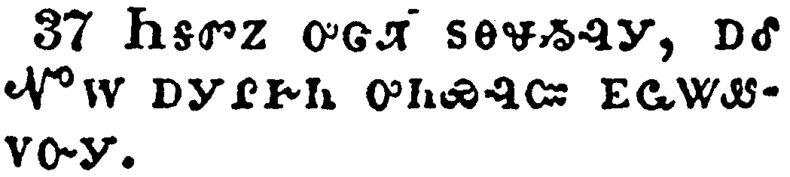</a></td>
</tr>
<tr class="even">
<td>And they all wept sore, and fell on Paul's neck, and kissed him,</td>
</tr>
<tr class="odd">
<td>ᎾᎦᏛᏃ ᎤᏣᏘ ᏚᎾᏠᏱᎸᎩ, ᎠᎴ ᏉᎳ ᎠᎩᎵᎨᏂ ᎤᏂᏯᎸᏨ ᎬᏩᏔᏪᏙᏅᎩ.</td>
</tr>
<tr class="even">
<td>Na-ga-dv-no u-tsa-ti du-na-tlo-yi-lv-gi, a-le Quo-la a-gi-li-ge-ni u-ni-ya-lv-tsv gv-wa-ta-we-do-nv-gi.</td>
</tr>
</tbody>
</table>

<table>
<tbody>
<tr class="odd">
<td><a href="052038.png">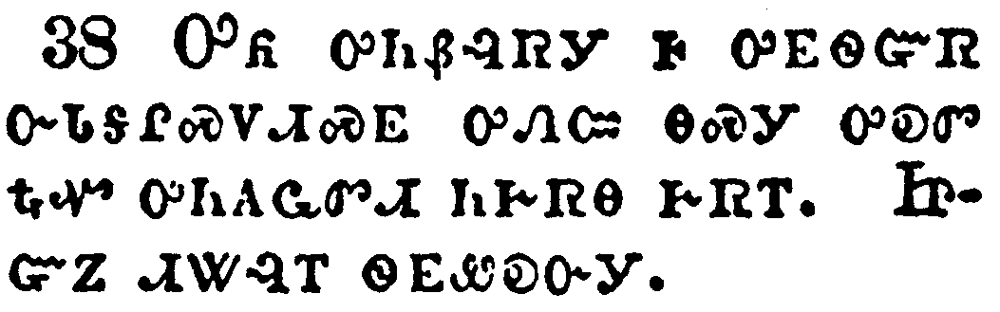</a></td>
</tr>
<tr class="even">
<td>Sorrowing most of all for the words which he spake, that they should see his face no more. And they accompanied him unto the ship.</td>
</tr>
<tr class="odd">
<td>ᎤᏲ ᎤᏂᏰᎸᏒᎩ Ꮀ ᎤᎬᏫᏳᏒ ᏅᏓᎦᎵᏍᏙᏗᏍᎬ ᎤᏁᏨ ᎾᏍᎩ ᎤᎧᏛ ᎿᎭᏉ ᎤᏂᎪᏩᏛᏗ ᏂᎨᏒᎾ ᎨᏒᎢ. ᏥᏳᏃ ᏗᏔᎸᎢ ᏫᎬᏪᎧᏅᎩ.</td>
</tr>
<tr class="even">
<td>U-yo u-ni-ye-lv-sv-gi ho u-gv-wi-yu-sv nv-da-ga-li-s-do-di-s-gv u-ne-tsv na-s-gi u-ka-dv hna-quo u-ni-go-wa-dv-di ni-ge-sv-na ge-sv-i. Tsi-yu-no di-ta-lv-i wi-gv-we-ka-nv-gi.</td>
</tr>
</tbody>
</table>

