+++
draft=false
date = 2014-12-18T21:11:07Z
title = "The Acts - Chapter 23 - Cherokee New Testament"
weight = 1418955067

[taxonomies]

authors = ["Timothy Legg"]
categories = []
tags = []

[extra]
+++

<table>
<tbody>
<tr class="odd">
<td><a href="052301.png">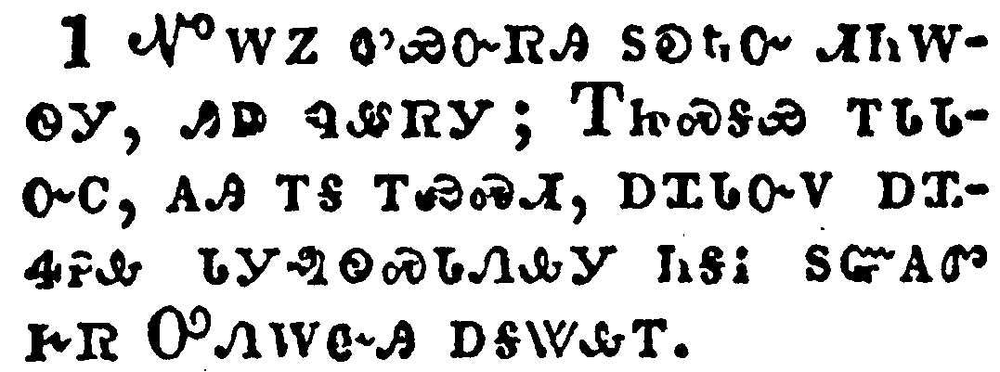</a></td>
</tr>
<tr class="even">
<td>And Paul, earnestly beholding the council, said, Men and brethren, I have lived in all good conscience before God until this day.</td>
</tr>
<tr class="odd">
<td>ᏉᎳᏃ ᎤᏯᏅᏒᎯ ᏚᎧᎿᎭᏅ ᏗᏂᎳᏫᎩ, ᎯᎠ ᏄᏪᏒᎩ; ᎢᏥᏍᎦᏯ ᎢᏓᏓᏅᏟ, ᎪᎯ ᎢᎦ ᎢᏯᏍᏗ, ᎠᏆᏓᏅᏙ ᎠᏆᏎᎮᎲ ᏓᎩᎸᏫᏍᏓᏁᎲᎩ ᏂᎦᎥ ᏚᏳᎪᏛ ᎨᏒ ᎤᏁᎳᏅᎯ ᎠᎦᏔᎲᎢ.</td>
</tr>
<tr class="even">
<td>Quo-la-no u-ya-nv-sv-hi du-ka-hna-nv di-ni-la-wi-gi, hi-a nu-we-sv-gi; I-tsi-s-ga-ya i-da-da-nv-tli, go-hi i-ga i-ya-s-di, a-qua-da-nv-do a-qua-se-he-hv da-gi-lv-wi-s-da-ne-hv-gi ni-ga-v du-yu-go-dv ge-sv U-ne-la-nv-hi a-ga-ta-hv-i.</td>
</tr>
</tbody>
</table>

<table>
<tbody>
<tr class="odd">
<td><a href="052302.png">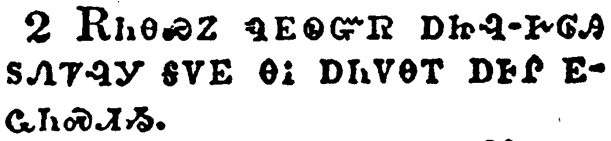</a></td>
</tr>
<tr class="even">
<td>And the high priest Ananias commanded them that stood by him to smite him on the mouth.</td>
</tr>
<tr class="odd">
<td>ᎡᏂᎾᏯᏃ ᏄᎬᏫᏳᏒ ᎠᏥᎸ-ᎨᎶᎯ ᏚᏂᏤᎸᎩ ᎦᏙᎬ ᎾᎥ ᎠᏂᏙᎾᎢ ᎠᎰᎵ ᎬᏩᏂᏍᏗᏱ.</td>
</tr>
<tr class="even">
<td>E-ni-na-ya-no nu-gv-wi-yu-sv a-tsi-lv--ge-lo-hi du-ni-tse-lv-gi ga-do-gv na-v a-ni-do-na-i a-ho-li gv-wa-ni-s-di-yi.</td>
</tr>
</tbody>
</table>

<table>
<tbody>
<tr class="odd">
<td><a href="052303.png">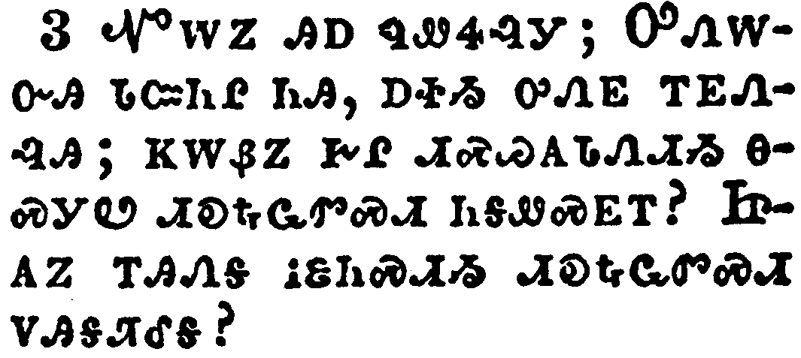</a></td>
</tr>
<tr class="even">
<td>Then said Paul unto him, God shall smite thee, thou whited wall: for sittest thou to judge me after the law, and commandest me to be smitten contrary to the law?</td>
</tr>
<tr class="odd">
<td>ᏉᎳᏃ ᎯᎠ ᏄᏪᏎᎸᎩ; ᎤᏁᎳᏅᎯ ᏓᏨᏂᎵ ᏂᎯ, ᎠᏐᏱ ᎤᏁᎬ ᎢᎬᏁᎸᎯ; ᏦᎳᏰᏃ ᎨᎵ ᏗᏍᏇᎪᏓᏁᏗᏱ ᎾᏍᎩᏬ ᏗᎧᎿᎭᏩᏛᏍᏗ ᏂᎦᏪᏍᎬᎢ? ᏥᎪᏃ ᎢᎯᏁᎦ ᎥᏋᏂᏍᏗᏱ ᏗᎧᎿᎭᏩᏛᏍᏗ ᏙᎯᎦᏘᎴᎦ?</td>
</tr>
<tr class="even">
<td>Quo-la-no hi-a nu-we-se-lv-gi; U-ne-la-nv-hi da-tsv-ni-li ni-hi, a-so-yi u-ne-gv i-gv-ne-lv-hi; tso-la-ye-no ge-li di-s-que-go-da-ne-di-yi na-s-gi-wo di-ka-hna-wa-dv-s-di ni-ga-we-s-gv-i? Tsi-go-no i-hi-ne-ga v-quv-ni-s-di-yi di-ka-hna-wa-dv-s-di do-hi-ga-ti-le-ga?</td>
</tr>
</tbody>
</table>

<table>
<tbody>
<tr class="odd">
<td><a href="052304.png">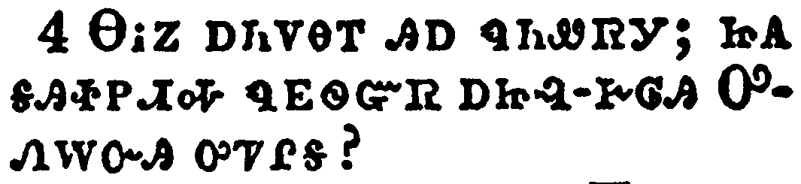</a></td>
</tr>
<tr class="even">
<td>And they that stood by said, Revilest thou God's high priest?</td>
</tr>
<tr class="odd">
<td>ᎾᎥᏃ ᎠᏂᏙᎾᎢ ᎯᎠ ᏄᏂᏪᏒᎩ; ᏥᎪ ᎦᎯᏐᏢᏗᎭ ᏄᎬᏫᏳᏒ ᎠᏥᎸ-ᎨᎶᎯ ᎤᏁᎳᏅᎯ ᎤᏤᎵᎦ?</td>
</tr>
<tr class="even">
<td>Na-v-no a-ni-do-na-i hi-a nu-ni-we-sv-gi; tsi-go ga-hi-so-tlv-di-ha nu-gv-wi-yu-sv a-tsi-lv--ge-lo-hi U-ne-la-nv-hi u-tse-li-ga?</td>
</tr>
</tbody>
</table>

<table>
<tbody>
<tr class="odd">
<td><a href="052305.png">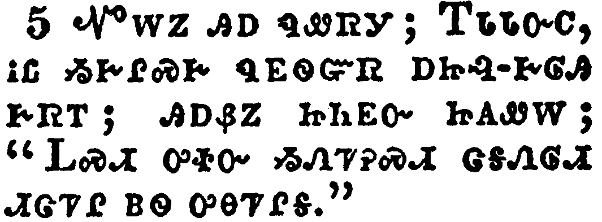</a></td>
</tr>
<tr class="even">
<td>Then said Paul, I wist not, brethren, that he was the high priest: for it is written, Thou shalt not speak evil of the ruler of thy people.</td>
</tr>
<tr class="odd">
<td>ᏉᎳᏃ ᎯᎠ ᏄᏪᏒᎩ; ᎢᏓᏓᏅᏟ, ᎥᏝ ᏱᎨᎵᏍᎨ ᏄᎬᏫᏳᏒ ᎠᏥᎸ-ᎨᎶᎯ ᎨᏒᎢ; ᎯᎠᏰᏃ ᏥᏂᎬᏅ ᏥᎪᏪᎳ; "ᏞᏍᏗ ᎤᏐᏅ ᏱᏁᏤᎮᏍᏗ ᏣᎦᏁᎶᏗ ᏗᏣᏤᎵ ᏴᏫ ᎤᎾᏤᎵᎦ."</td>
</tr>
<tr class="even">
<td>Quo-la-no hi-a nu-we-sv-gi; I-da-da-nv-tli, v-tla yi-ge-li-s-ge nu-gv-wi-yu-sv a-tsi-lv--ge-lo-hi ge-sv-i; hi-a-ye-no tsi-ni-gv-nv tsi-go-we-la; "Tle-s-di u-so-nv yi-ne-tse-he-s-di tsa-ga-ne-lo-di di-tsa-tse-li yv-wi u-na-tse-li-ga."</td>
</tr>
</tbody>
</table>

<table>
<tbody>
<tr class="odd">
<td><a href="052306.png">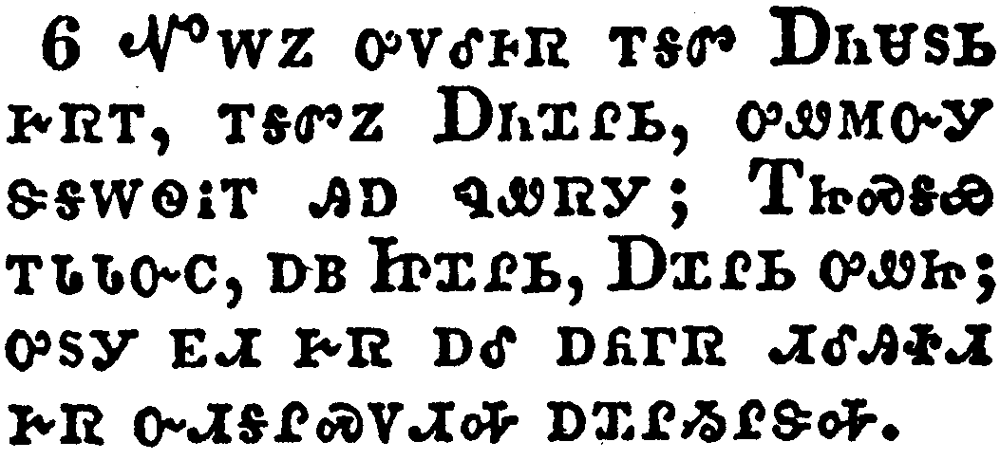</a></td>
</tr>
<tr class="even">
<td>But when Paul perceived that the one part were Sadducees, and the other Pharisees, he cried out in the council, Men and brethren, I am a Pharisee, the son of a Pharisee: of the hope and resurrection of the dead I am called in question.</td>
</tr>
<tr class="odd">
<td>ᏉᎳᏃ ᎤᏙᎴᎰᏒ ᎢᎦᏛ ᎠᏂᏌᏚᏏ ᎨᏒᎢ, ᎢᎦᏛᏃ ᎠᏂᏆᎵᏏ, ᎤᏪᎷᏅᎩ ᏕᎦᎳᏫᎥᎢ ᎯᎠ ᏄᏪᏒᎩ; ᎢᏥᏍᎦᏯ ᎢᏓᏓᏅᏟ, ᎠᏴ ᏥᏆᎵᏏ, ᎠᏆᎵᏏ ᎤᏪᏥ; ᎤᏚᎩ ᎬᏗ ᎨᏒ ᎠᎴ ᎠᏲᎱᏒ ᏗᎴᎯᏐᏗ ᎨᏒ ᏅᏗᎦᎵᏍᏙᏗᎭ ᎠᏆᎵᏱᎵᏕᎭ.</td>
</tr>
<tr class="even">
<td>Quo-la-no u-do-le-ho-sv i-ga-dv A-ni-sa-du-si ge-sv-i, i-ga-dv-no A-ni-qua-li-si, u-we-lu-nv-gi de-ga-la-wi-v-i hi-a nu-we-sv-gi; I-tsi-s-ga-ya i-da-da-nv-tli, a-yv Tsi-qua-li-si, A-qua-li-si u-we-tsi; u-du-gi gv-di ge-sv a-le a-yo-hu-sv di-le-hi-so-di ge-sv nv-di-ga-li-s-do-di-ha a-qua-li-yi-li-de-ha.</td>
</tr>
</tbody>
</table>

<table>
<tbody>
<tr class="odd">
<td><a href="052307.png">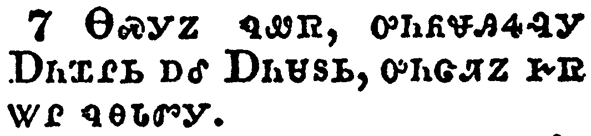</a></td>
</tr>
<tr class="even">
<td>And when he had so said, there arose a dissension between the Pharisees and the Sadducees: and the multitude was divided.</td>
</tr>
<tr class="odd">
<td>ᎾᏍᎩᏃ ᏄᏪᏒ, ᎤᏂᏲᏠᎯᏎᎸᎩ ᎠᏂᏆᎵᏏ ᎠᎴ ᎠᏂᏌᏚᏏ, ᎤᏂᏣᏘᏃ ᎨᏒ ᏔᎵ ᏄᎾᏓᏛᎩ.</td>
</tr>
<tr class="even">
<td>Na-s-gi-no nu-we-sv, u-ni-yo-tlo-hi-se-lv-gi A-ni-qua-li-si a-le A-ni-sa-du-si, u-ni-tsa-ti-no ge-sv ta-li nu-na-da-dv-gi.</td>
</tr>
</tbody>
</table>

<table>
<tbody>
<tr class="odd">
<td><a href="052308.png">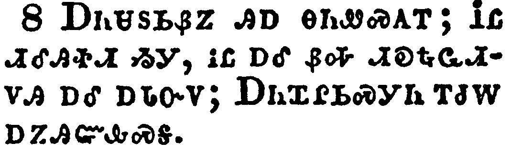</a></td>
</tr>
<tr class="even">
<td>For the Sadducees say that there is no resurrection, neither angel, nor spirit: but the Pharisees confess both.</td>
</tr>
<tr class="odd">
<td>ᎠᏂᏌᏚᏏᏰᏃ ᎯᎠ ᎾᏂᏪᏎᎪᎢ; ᎥᏝ ᏗᎴᎯᏐᏗ ᏱᎩ, ᎥᏝ ᎠᎴ ᏰᎭ ᏗᎧᎿᎭᏩᏗᏙᎯ ᎠᎴ ᎠᏓᏅᏙ; ᎠᏂᏆᎵᏏᏍᎩᏂ ᎢᏧᎳ ᎠᏃᎯᏳᎲᏍᎦ.</td>
</tr>
<tr class="even">
<td>A-ni-sa-du-si-ye-no hi-a na-ni-we-se-go-i; V-tla di-le-hi-so-di yi-gi, v-tla a-le ye-ha di-ka-hna-wa-di-do-hi a-le a-da-nv-do; A-ni-qua-li-si-s-gi-ni i-tsu-la a-no-hi-yu-hv-s-ga.</td>
</tr>
</tbody>
</table>

<table>
<tbody>
<tr class="odd">
<td><a href="052309.png">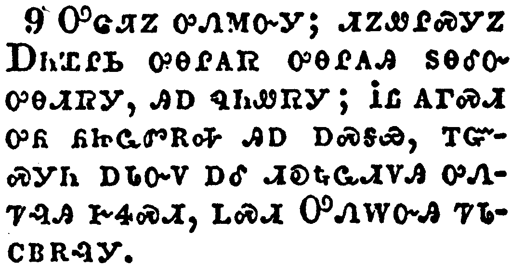</a></td>
</tr>
<tr class="even">
<td>And there arose a great cry: and the scribes that were of the Pharisees' part arose, and strove, saying, We find no evil in this man: but if a spirit or an angel hath spoken to him, let us not fight against God.</td>
</tr>
<tr class="odd">
<td>ᎤᏣᏘᏃ ᎤᏁᎷᏅᎩ; ᏗᏃᏪᎵᏍᎩᏃ ᎠᏂᏆᎵᏏ ᎤᎾᎵᎪᏒ ᎤᎾᎵᎪᎯ ᏚᎾᎴᏅ ᎤᎾᏗᏒᎩ, ᎯᎠ ᏄᏂᏪᏒᎩ; ᎥᏝ ᎪᎱᏍᏗ ᎤᏲ ᏲᏥᏩᏛᎡᎭ ᎯᎠ ᎠᏍᎦᏯ, ᎢᏳᏍᎩᏂ ᎠᏓᏅᏙ ᎠᎴ ᏗᎧᎿᎭᏩᏗᏙᎯ ᎤᏁᏤᎸᎯ ᎨᏎᏍᏗ, ᏞᏍᏗ ᎤᏁᎳᏅᎯ ᏤᏓᏟᏴᎡᎸᎩ.</td>
</tr>
<tr class="even">
<td>U-tsa-ti-no u-ne-lu-nv-gi; di-no-we-li-s-gi-no A-ni-qua-li-si u-na-li-go-sv u-na-li-go-hi du-na-le-nv u-na-di-sv-gi, hi-a nu-ni-we-sv-gi; V-tla go-hu-s-di u-yo yo-tsi-wa-dv-e-ha hi-a a-s-ga-ya, i-yu-s-gi-ni a-da-nv-do a-le di-ka-hna-wa-di-do-hi u-ne-tse-lv-hi ge-se-s-di, tle-s-di U-ne-la-nv-hi tse-da-tli-yv-e-lv-gi.</td>
</tr>
</tbody>
</table>

<table>
<tbody>
<tr class="odd">
<td><a href="052310.png">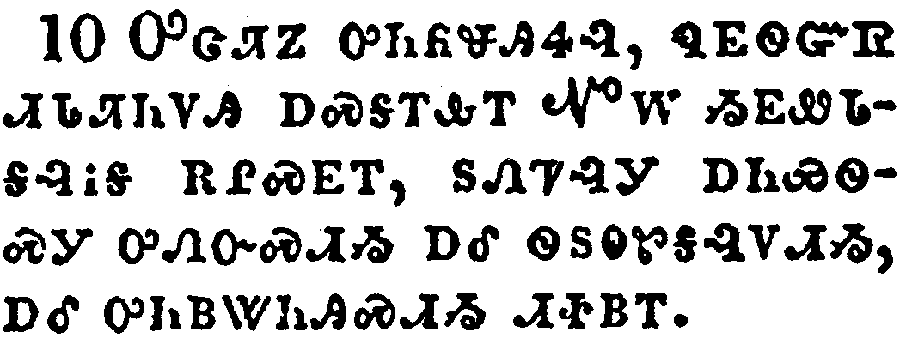</a></td>
</tr>
<tr class="even">
<td>And when there arose a great dissension, the chief captain, fearing lest Paul should have been pulled in pieces of them, commanded the soldiers to go down, and to take him by force from among them, and to bring him into the castle.</td>
</tr>
<tr class="odd">
<td>ᎤᏣᏘᏃ ᎤᏂᏲᏠᎯᏎᎸ, ᏄᎬᏫᏳᏒ ᏗᏓᏘᏂᏙᎯ ᎠᏍᎦᎢᎲᎢ ᏉᎳ ᏱᎬᏪᏓᎦᎸᎥᎦ ᎡᎵᏍᎬᎢ, ᏚᏁᏤᎸᎩ ᎠᏂᏯᏫᏍᎩ ᎤᏁᏅᏍᏗᏱ ᎠᎴ ᏫᏚᎾᏑᎦᎸᏙᏗᏱ, ᎠᎴ ᎤᏂᏴᏔᏂᎯᏍᏗᏱ ᏗᏐᏴᎢ.</td>
</tr>
<tr class="even">
<td>U-tsa-ti-no u-ni-yo-tlo-hi-se-lv, nu-gv-wi-yu-sv di-da-ti-ni-do-hi a-s-ga-i-hv-i Quo-la yi-gv-we-da-ga-lv-v-ga e-li-s-gv-i, du-ne-tse-lv-gi a-ni-ya-wi-s-gi u-ne-nv-s-di-yi a-le wi-du-na-su-ga-lv-do-di-yi, a-le u-ni-yv-ta-ni-hi-s-di-yi di-so-yv-i.</td>
</tr>
</tbody>
</table>

<table>
<tbody>
<tr class="odd">
<td><a href="052311.png">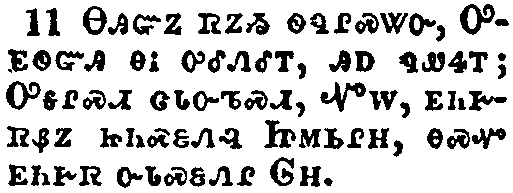</a></td>
</tr>
<tr class="even">
<td>And the night following the Lord stood by him, and said, Be of good cheer, Paul: for as thou hast testified of me in Jerusalem, so must thou bear witness also at Rome.</td>
</tr>
<tr class="odd">
<td>ᎾᎯᏳᏃ ᏒᏃᏱ ᏫᏄᎵᏍᏔᏅ, ᎤᎬᏫᏳᎯ ᎾᎥ ᎤᎴᏁᎴᎢ, ᎯᎠ ᏄᏪᏎᎢ; ᎤᎦᎵᏍᏗ ᏣᏓᏅᏖᏍᏗ, ᏉᎳ, ᎬᏂᎨᏒᏰᏃ ᏥᏂᏍᏋᏁᎸ ᏥᎷᏏᎵᎻ, ᎾᏍᏉ ᎬᏂᎨᏒ ᏅᏓᏍᏋᏁᎵ ᏣᏂ.</td>
</tr>
<tr class="even">
<td>Na-hi-yu-no sv-no-yi wi-nu-li-s-ta-nv, U-gv-wi-yu-hi na-v u-le-ne-le-i, hi-a nu-we-se-i; U-ga-li-s-di tsa-da-nv-te-s-di, Quo-la, gv-ni-ge-sv-ye-no tsi-ni-s-quv-ne-lv Tsi-lu-si-li-mi, na-s-quo gv-ni-ge-sv nv-da-s-quv-ne-li Tsa-ni.</td>
</tr>
</tbody>
</table>

<table>
<tbody>
<tr class="odd">
<td><a href="052312.png">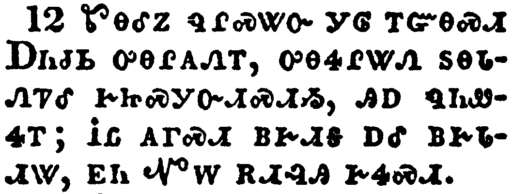</a></td>
</tr>
<tr class="even">
<td>And when it was day, certain of the Jews banded together, and bound themselves under a curse, saying that they would neither eat nor drink till they had killed Paul.</td>
</tr>
<tr class="odd">
<td>ᏑᎾᎴᏃ ᏄᎵᏍᏔᏅ ᎩᎶ ᎢᏳᎾᏍᏗ ᎠᏂᏧᏏ ᎤᎾᎵᎪᏁᎢ, ᎤᎾᏎᎵᏔᏁ ᏚᎾᏓᏁᏤᎴ ᎨᏥᏍᎩᏅᏗᏍᏗᏱ, ᎯᎠ ᏄᏂᏪᏎᎢ; ᎥᏝ ᎪᎱᏍᏗ ᏴᎨᏗᎦ ᎠᎴ ᏴᎨᏓᏗᏔ, ᎬᏂ ᏉᎳ ᎡᏗᎸᎯ ᎨᏎᏍᏗ.</td>
</tr>
<tr class="even">
<td>Su-na-le-no nu-li-s-ta-nv gi-lo i-yu-na-s-di A-ni-tsu-si u-na-li-go-ne-i, u-na-se-li-ta-ne du-na-da-ne-tse-le ge-tsi-s-gi-nv-di-s-di-yi, hi-a nu-ni-we-se-i; V-tla go-hu-s-di yv-ge-di-ga a-le yv-ge-da-di-ta, gv-ni Quo-la e-di-lv-hi ge-se-s-di.</td>
</tr>
</tbody>
</table>

<table>
<tbody>
<tr class="odd">
<td><a href="052313.png">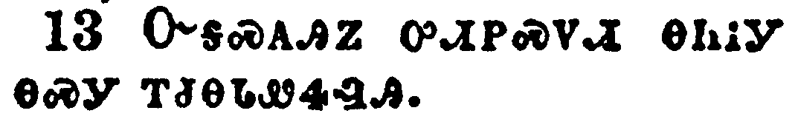</a></td>
</tr>
<tr class="even">
<td>And they were more than forty which had made this conspiracy.</td>
</tr>
<tr class="odd">
<td>ᏅᎦᏍᎪᎯᏃ ᎤᏗᏢᏍᏙᏗ ᎾᏂᎥᎩ ᎾᏍᎩ ᎢᏧᎾᏓᏪᏎᎸᎯ.</td>
</tr>
<tr class="even">
<td>Nv-ga-s-go-hi-no u-di-tlv-s-do-di na-ni-v-gi na-s-gi i-tsu-na-da-we-se-lv-hi.</td>
</tr>
</tbody>
</table>

<table>
<tbody>
<tr class="odd">
<td><a href="052314.png">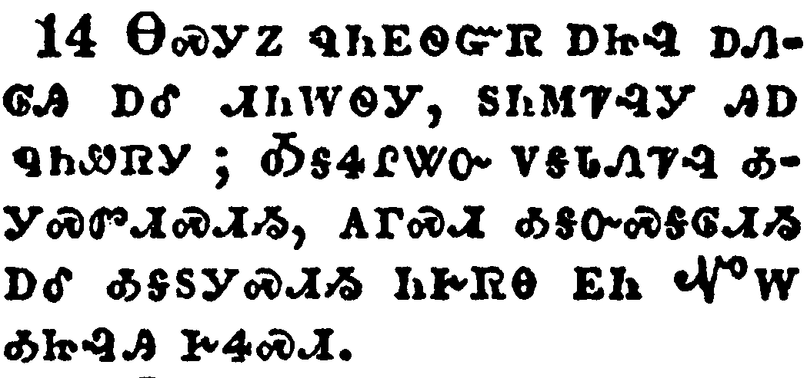</a></td>
</tr>
<tr class="even">
<td>And they came to the chief priests and elders, and said, We have bound ourselves under a great curse, that we will eat nothing until we have slain Paul.</td>
</tr>
<tr class="odd">
<td>ᎾᏍᎩᏃ ᏄᏂᎬᏫᏳᏒ ᎠᏥᎸ ᎠᏁᎶᎯ ᎠᎴ ᏗᏂᎳᏫᎩ, ᏚᏂᎷᏤᎸᎩ ᎯᎠ ᏄᏂᏪᏒᎩ; ᎣᎦᏎᎵᏔᏅ ᏙᎦᏓᏁᏤᎸ ᎣᎩᏍᏛᏗᏍᏗᏱ, ᎪᎱᏍᏗ ᎣᎦᏅᏍᎦᎶᏗᏱ ᎠᎴ ᎣᎦᏚᎩᏍᏗᏱ ᏂᎨᏒᎾ ᎬᏂ ᏉᎳ ᎣᏥᎸᎯ ᎨᏎᏍᏗ.</td>
</tr>
<tr class="even">
<td>Na-s-gi-no nu-ni-gv-wi-yu-sv a-tsi-lv a-ne-lo-hi a-le di-ni-la-wi-gi, du-ni-lu-tse-lv-gi hi-a nu-ni-we-sv-gi; O-ga-se-li-ta-nv do-ga-da-ne-tse-lv o-gi-s-dv-di-s-di-yi, go-hu-s-di o-ga-nv-s-ga-lo-di-yi a-le o-ga-du-gi-s-di-yi ni-ge-sv-na gv-ni Quo-la o-tsi-lv-hi ge-se-s-di.</td>
</tr>
</tbody>
</table>

<table>
<tbody>
<tr class="odd">
<td><a href="052315.png">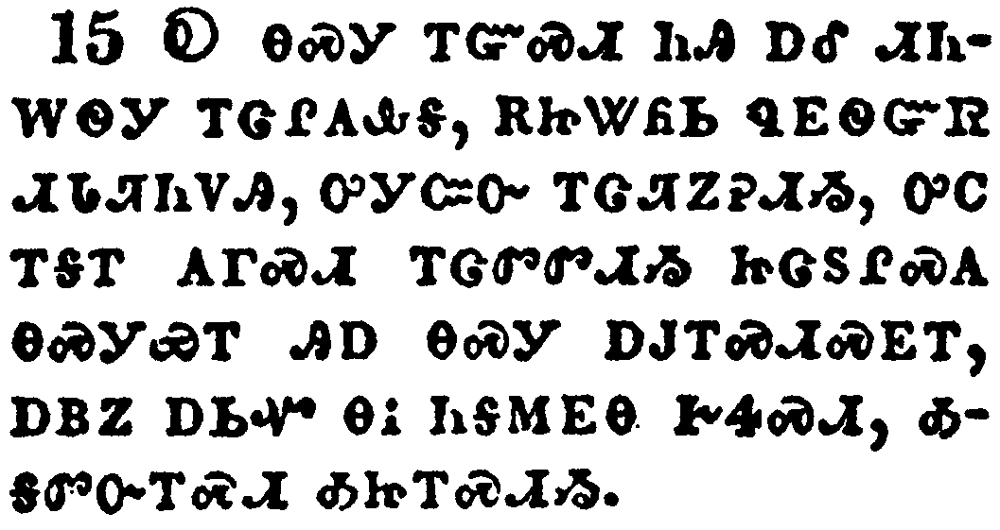</a></td>
</tr>
<tr class="even">
<td>Now therefore ye with the council signify to the chief captain that he bring him down unto you to morrow, as though ye would inquire something more perfectly concerning him: and we, or ever he come near, are ready to kill him.</td>
</tr>
<tr class="odd">
<td>Ꭷ ᎾᏍᎩ ᎢᏳᏍᏗ ᏂᎯ ᎠᎴ ᏗᏂᎳᏫᎩ ᎢᏣᎵᎪᎲᎦ, ᎡᏥᏔᏂᏲᏏ ᏄᎬᏫᏳᏒ ᏗᏓᏘᏂᏙᎯ, ᎤᎩᏨᏅ ᎢᏣᏘᏃᎮᏗᏱ, ᎤᏟ ᎢᎦᎢ ᎪᎱᏍᏗ ᎢᏣᏛᏛᏗᏱ ᏥᏣᏚᎵᏍᎪ ᎾᏍᎩᏯᎢ ᎯᎠ ᎾᏍᎩ ᎠᎫᎢᏍᏗᏍᎬᎢ, ᎠᏴᏃ ᎠᏏᏉ ᎾᎥ ᏂᎦᎷᎬᎾ ᎨᏎᏍᏗ, ᎣᎦᏛᏅᎢᏍᏗ ᎣᏥᎢᏍᏗᏱ.</td>
</tr>
<tr class="even">
<td>Ka na-s-gi i-yu-s-di ni-hi a-le di-ni-la-wi-gi i-tsa-li-go-hv-ga, e-tsi-ta-ni-yo-si nu-gv-wi-yu-sv di-da-ti-ni-do-hi, u-gi-tsv-nv i-tsa-ti-no-he-di-yi, u-tli i-ga-i go-hu-s-di i-tsa-dv-dv-di-yi tsi-tsa-du-li-s-go na-s-gi-ya-i hi-a na-s-gi a-gu-i-s-di-s-gv-i, a-yv-no a-si-quo na-v ni-ga-lu-gv-na ge-se-s-di, o-ga-dv-nv-i-s-di o-tsi-i-s-di-yi.</td>
</tr>
</tbody>
</table>

<table>
<tbody>
<tr class="odd">
<td><a href="052316.png">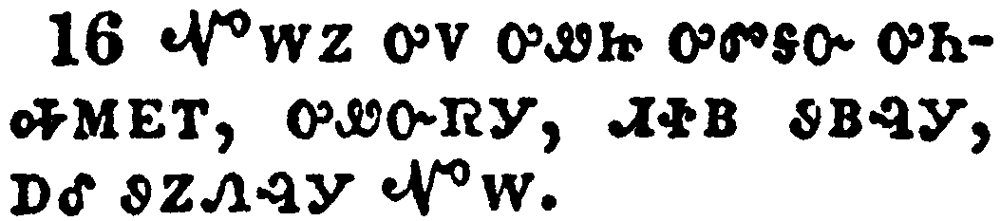</a></td>
</tr>
<tr class="even">
<td>And when Paul's sister's son heard of their lying in wait, he went and entered into the castle, and told Paul.</td>
</tr>
<tr class="odd">
<td>ᏉᎳᏃ ᎤᏙ ᎤᏪᏥ ᎤᏛᎦᏅ ᎤᏂᎭᎷᎬᎢ, ᎤᏬᏅᏒᎩ, ᏗᏐᏴ ᏭᏴᎸᎩ, ᎠᎴ ᏭᏃᏁᎸᎩ ᏉᎳ.</td>
</tr>
<tr class="even">
<td>Quo-la-no u-do u-we-tsi u-dv-ga-nv u-ni-ha-lu-gv-i, u-wo-nv-sv-gi, di-so-yv wu-yv-lv-gi, a-le wu-no-ne-lv-gi Quo-la.</td>
</tr>
</tbody>
</table>

<table>
<tbody>
<tr class="odd">
<td><a href="052317.png">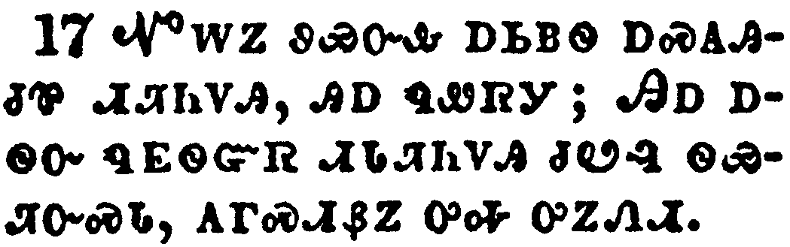</a></td>
</tr>
<tr class="even">
<td>Then Paul called one of the centurions unto him, and said, Bring this young man unto the chief captain: for he hath a certain thing to tell him.</td>
</tr>
<tr class="odd">
<td>ᏉᎳᏃ ᏭᏯᏅᎲ ᎠᏏᏴᏫ ᎠᏍᎪᎯᏧᏈ ᏗᏘᏂᏙᎯ, ᎯᎠ ᏄᏪᏒᎩ; ᎯᎠ ᎠᏫᏅ ᏄᎬᏫᏳᏒ ᏗᏓᏘᏂᏙᎯ ᏄᏬᎸ ᏫᏯᏘᏅᏍᏓ, ᎪᎱᏍᏗᏰᏃ ᎤᎭ ᎤᏃᏁᏗ.</td>
</tr>
<tr class="even">
<td>Quo-la-no wu-ya-nv-hv a-si-yv-wi a-s-go-hi-tsu-qui di-ti-ni-do-hi, hi-a nu-we-sv-gi; Hi-a a-wi-nv nu-gv-wi-yu-sv di-da-ti-ni-do-hi nu-wo-lv wi-ya-ti-nv-s-da, go-hu-s-di-ye-no u-ha u-no-ne-di.</td>
</tr>
</tbody>
</table>

<table>
<tbody>
<tr class="odd">
<td><a href="052318.png">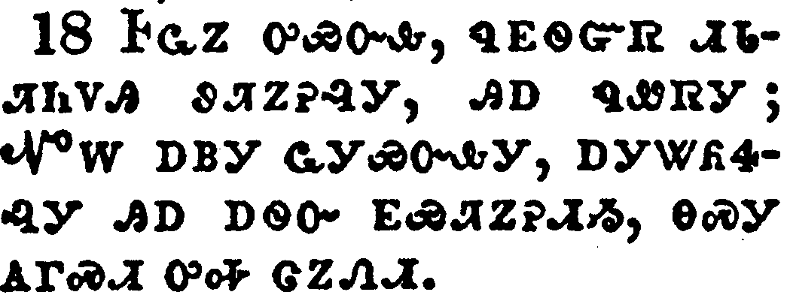</a></td>
</tr>
<tr class="even">
<td>So he took him, and brought him to the chief captain, and said, Paul the prisoner called me unto him, and prayed me to bring this young man unto thee, who hath something to say unto thee.</td>
</tr>
<tr class="odd">
<td>ᎰᏩᏃ ᎤᏯᏅᎲ, ᏄᎬᏫᏳᏒ ᏗᏓᏘᏂᏙᎯ ᏭᏘᏃᎮᎸᎩ, ᎯᎠ ᏄᏪᏒᎩ; ᏉᎳ ᎠᏴᎩ ᏩᎩᏯᏅᎲᎩ, ᎠᎩᏔᏲᏎᎸᎩ ᎯᎠ ᎠᏫᏅ ᎬᏯᏘᏃᎮᏗᏱ, ᎾᏍᎩ ᎪᎱᏍᏗ ᎤᎭ ᏣᏃᏁᏗ.</td>
</tr>
<tr class="even">
<td>Ho-wa-no u-ya-nv-hv, nu-gv-wi-yu-sv di-da-ti-ni-do-hi wu-ti-no-he-lv-gi, hi-a nu-we-sv-gi; Quo-la a-yv-gi wa-gi-ya-nv-hv-gi, a-gi-ta-yo-se-lv-gi hi-a a-wi-nv gv-ya-ti-no-he-di-yi, na-s-gi go-hu-s-di u-ha tsa-no-ne-di.</td>
</tr>
</tbody>
</table>

<table>
<tbody>
<tr class="odd">
<td><a href="052319.png">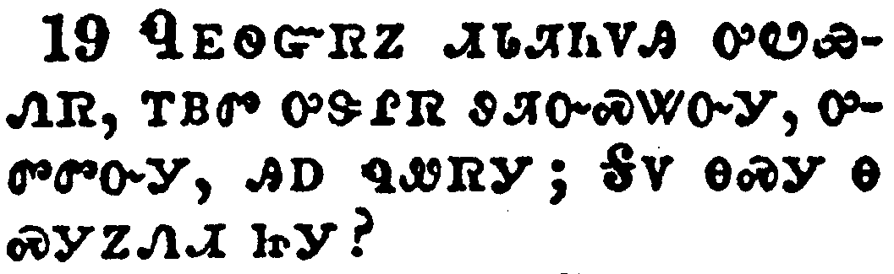</a></td>
</tr>
<tr class="even">
<td>Then the chief captain took him by the hand, and went with him aside privately, and asked him, What is that thou hast to tell me?</td>
</tr>
<tr class="odd">
<td>ᏄᎬᏫᏳᏒᏃ ᏗᏓᏘᏂᏙᎯ ᎤᏬᏯᏁᏒ, ᎢᏴᏛ ᎤᏕᎵᏒ ᏭᏘᏅᏍᏔᏅᎩ, ᎤᏛᏛᏅᎩ, ᎯᎠ ᏄᏪᏒᎩ; ᎦᏙ ᎾᏍᎩ Ꮎ ᏍᎩᏃᏁᏗ ᏥᎩ?</td>
</tr>
<tr class="even">
<td>Nu-gv-wi-yu-sv-no di-da-ti-ni-do-hi u-wo-ya-ne-sv, i-yv-dv u-de-li-sv wu-ti-nv-s-ta-nv-gi, u-dv-dv-nv-gi, hi-a nu-we-sv-gi; Ga-do na-s-gi na s-gi-no-ne-di tsi-gi?</td>
</tr>
</tbody>
</table>

<table>
<tbody>
<tr class="odd">
<td><a href="052320.png">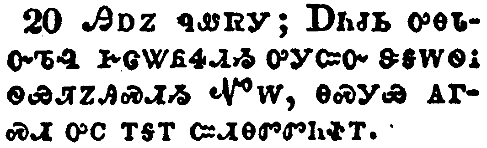</a></td>
</tr>
<tr class="even">
<td>And he said, The Jews have agreed to desire thee that thou wouldest bring down Paul to morrow into the council, as though they would inquire somewhat of him more perfectly.</td>
</tr>
<tr class="odd">
<td>ᎯᎠᏃ ᏄᏪᏒᎩ; ᎠᏂᏧᏏ ᎤᎾᏓᏅᏖᎸ ᎨᏣᏔᏲᏎᏗᏱ ᎤᎩᏨᏅ ᏕᎦᎳᏫᎥ ᏫᏯᏘᏃᎯᏍᏗᏱ ᏉᎳ, ᎾᏍᎩᏯ ᎪᎱᏍᏗ ᎤᏟ ᎢᎦᎢ ᏨᏗᎾᏛᏛᏂᏐᎢ.</td>
</tr>
<tr class="even">
<td>Hi-a-no nu-we-sv-gi; A-ni-tsu-si u-na-da-nv-te-lv ge-tsa-ta-yo-se-di-yi u-gi-tsv-nv de-ga-la-wi-v wi-ya-ti-no-hi-s-di-yi Quo-la, na-s-gi-ya go-hu-s-di u-tli i-ga-i tsv-di-na-dv-dv-ni-so-i.</td>
</tr>
</tbody>
</table>

<table>
<tbody>
<tr class="odd">
<td><a href="052321.png">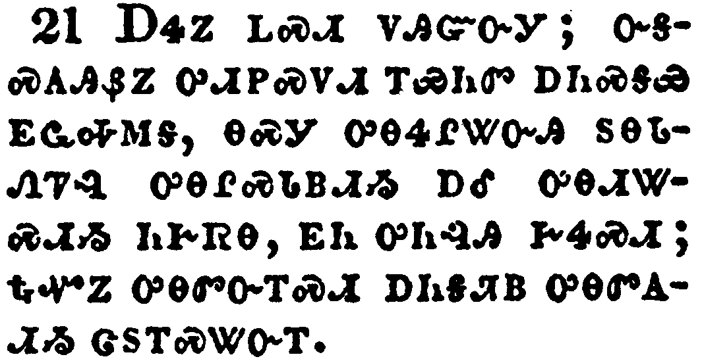</a></td>
</tr>
<tr class="even">
<td>But do not thou yield unto them: for there lie in wait for him of them more than forty men, which have bound themselves with an oath, that they will neither eat nor drink till they have killed him: and now are they ready, looking for a promise from thee.</td>
</tr>
<tr class="odd">
<td>ᎠᏎᏃ ᏞᏍᏗ ᏙᎯᏳᏅᎩ; ᏅᎦᏍᎪᎯᏰᏃ ᎤᏗᏢᏍᏙᏗ ᎢᏯᏂᏛ ᎠᏂᏍᎦᏯ ᎬᏩᎭᎷᎦ, ᎾᏍᎩ ᎤᎾᏎᎵᏔᏅᎯ ᏚᎾᏓᏁᏤᎸ ᎤᎾᎵᏍᏓᏴᏗᏱ ᎠᎴ ᎤᎾᏗᏔᏍᏗᏱ ᏂᎨᏒᎾ, ᎬᏂ ᎤᏂᎸᎯ ᎨᏎᏍᏗ; ᎿᎭᏉᏃ ᎤᎾᏛᏅᎢᏍᏗ ᎠᏂᎦᏘᏴ ᎤᎾᏛᎪᏗᏱ ᏣᏚᎢᏍᏔᏅᎢ.</td>
</tr>
<tr class="even">
<td>A-se-no tle-s-di do-hi-yu-nv-gi; nv-ga-s-go-hi-ye-no u-di-tlv-s-do-di i-ya-ni-dv a-ni-s-ga-ya gv-wa-ha-lu-ga, na-s-gi u-na-se-li-ta-nv-hi du-na-da-ne-tse-lv u-na-li-s-da-yv-di-yi a-le u-na-di-ta-s-di-yi ni-ge-sv-na, gv-ni u-ni-lv-hi ge-se-s-di; hna-quo-no u-na-dv-nv-i-s-di a-ni-ga-ti-yv u-na-dv-go-di-yi tsa-du-i-s-ta-nv-i.</td>
</tr>
</tbody>
</table>

<table>
<tbody>
<tr class="odd">
<td><a href="052322.png">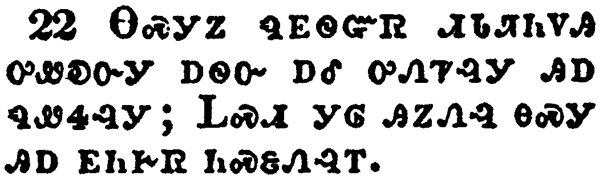</a></td>
</tr>
<tr class="even">
<td>So the chief captain then let the young man depart, and charged him, See thou tell no man that thou hast shewed these things to me.</td>
</tr>
<tr class="odd">
<td>ᎾᏍᎩᏃ ᏄᎬᏫᏳᏒ ᏗᏓᏘᏂᏙᎯ ᎤᏪᎧᏅᎩ ᎠᏫᏅ ᎠᎴ ᎠᏁᏤᎸᎩ ᎯᎠ ᏄᏪᏎᎸᎩ; ᏞᏍᏗ ᎩᎶ ᎯᏃᏁᎸ ᎾᏍᎩ ᎯᎠ ᎬᏂᎨᏒ ᏂᏍᏋᏁᎸᎢ.</td>
</tr>
<tr class="even">
<td>Na-s-gi-no nu-gv-wi-yu-sv di-da-ti-ni-do-hi u-we-ka-nv-gi a-wi-nv a-le a-ne-tse-lv-gi hi-a nu-we-se-lv-gi; Tle-s-di gi-lo hi-no-ne-lv na-s-gi hi-a gv-ni-ge-sv ni-s-quv-ne-lv-i.</td>
</tr>
</tbody>
</table>

<table>
<tbody>
<tr class="odd">
<td><a href="052323.png">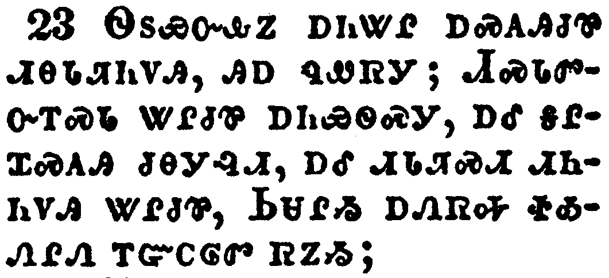</a></td>
</tr>
<tr class="even">
<td>And he called unto him two centurions, saying, Make ready two hundred soldiers to go to Caesarea, and horsemen threescore and ten, and spearmen two hundred, at the third hour of the night;</td>
</tr>
<tr class="odd">
<td>ᏫᏚᏯᏅᎲᏃ ᎠᏂᏔᎵ ᎠᏍᎪᎯᏧᏈ ᏗᎾᏓᏘᏂᏙᎯ, ᎯᎠ ᏄᏪᏒᎩ; ᏗᏍᏓᏛᏅᎢᏍᏓ ᏔᎵᏧᏈ ᎠᏂᏯᏫᏍᎩ, ᎠᎴ ᎦᎵᏆᏍᎪᎯ ᏧᎾᎩᎸᏗ, ᎠᎴ ᏗᏓᏘᏍᏗ ᏗᏂᏂᏙᎯ ᏔᎵᏧᏈ, ᏏᏌᎵᏱ ᎠᏁᏒᎭ ᏐᎣᏁᎵᏁ ᎢᏳᏟᎶᏛ ᏒᏃᏱ;</td>
</tr>
<tr class="even">
<td>Wi-du-ya-nv-hv-no a-ni-ta-li a-s-go-hi-tsu-qui di-na-da-ti-ni-do-hi, hi-a nu-we-sv-gi; Di-s-da-dv-nv-i-s-da ta-li-tsu-qui a-ni-ya-wi-s-gi, a-le ga-li-qua-s-go-hi tsu-na-gi-lv-di, a-le di-da-ti-s-di di-ni-ni-do-hi ta-li-tsu-qui, Si-sa-li-yi a-ne-sv-ha so-o-ne-li-ne i-yu-tli-lo-dv sv-no-yi;</td>
</tr>
</tbody>
</table>

<table>
<tbody>
<tr class="odd">
<td><a href="052324.png">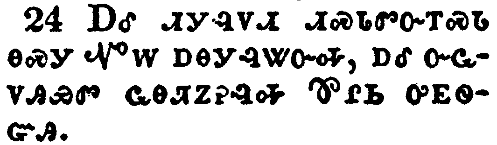</a></td>
</tr>
<tr class="even">
<td>And provide them beasts, that they may set Paul on, and bring him safe unto Felix the governor.</td>
</tr>
<tr class="odd">
<td>ᎠᎴ ᏗᎩᎸᏙᏗ ᏗᏍᏓᏛᏅᎢᏍᏓ ᎾᏍᎩ ᏉᎳ ᎠᎾᎩᎸᏔᏅᎭ, ᎠᎴ ᏅᏩᏙᎯᏯᏛ ᏩᎾᏘᏃᎮᎸᎭ ᏈᎵᏏ ᎤᎬᏫᏳᎯ.</td>
</tr>
<tr class="even">
<td>A-le di-gi-lv-do-di di-s-da-dv-nv-i-s-da na-s-gi Quo-la a-na-gi-lv-ta-nv-ha, a-le nv-wa-do-hi-ya-dv wa-na-ti-no-he-lv-ha Qui-li-si u-gv-wi-yu-hi.</td>
</tr>
</tbody>
</table>

<table>
<tbody>
<tr class="odd">
<td><a href="052325.png">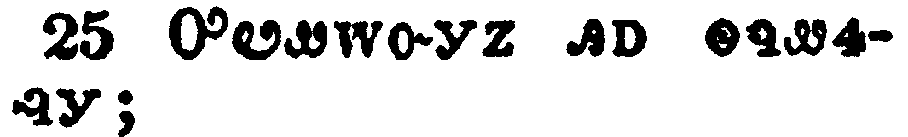</a></td>
</tr>
<tr class="even">
<td>And he wrote a letter after this manner:</td>
</tr>
<tr class="odd">
<td>ᎤᏬᏪᎳᏅᎩᏃ ᎯᎠ ᏫᏄᏪᏎᎸᎩ;</td>
</tr>
<tr class="even">
<td>U-wo-we-la-nv-gi-no hi-a wi-nu-we-se-lv-gi;</td>
</tr>
</tbody>
</table>

<table>
<tbody>
<tr class="odd">
<td><a href="052326.png">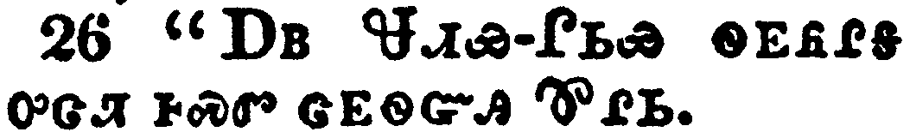</a></td>
</tr>
<tr class="even">
<td>Claudius Lysias unto the most excellent governor Felix sendeth greeting.</td>
</tr>
<tr class="odd">
<td>"ᎠᏴ ᏠᏗᏯ-ᎵᏏᏯ ᏫᎬᏲᎵᎦ ᎤᏣᏘ ᎰᏍᏛ ᏣᎬᏫᏳᎯ ᏈᎵᏏ.</td>
</tr>
<tr class="even">
<td>"A-yv Tlo-di-ya--Li-si-ya wi-gv-yo-li-ga u-tsa-ti ho-s-dv tsa-gv-wi-yu-hi Qui-li-si.</td>
</tr>
</tbody>
</table>

<table>
<tbody>
<tr class="odd">
<td><a href="052327.png">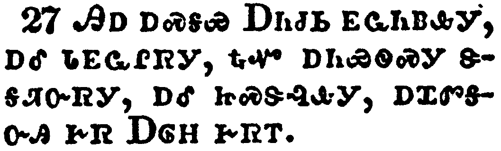</a></td>
</tr>
<tr class="even">
<td>This man was taken of the Jews, and should have been killed of them: then came I with an army, and rescued him, having understood that he was a Roman.</td>
</tr>
<tr class="odd">
<td>ᎯᎠ ᎠᏍᎦᏯ ᎠᏂᏧᏏ ᎬᏩᏂᏴᎲᎩ, ᎠᎴ ᏓᎬᏩᎵᏒᎩ, ᎿᎭᏉ ᎠᏂᏯᏫᏍᎩ ᏕᎦᏘᏅᏒᎩ, ᎠᎴ ᏥᏍᏕᎸᎲᎩ, ᎠᏆᏛᎦᏅᎯ ᎨᏒ ᎠᎶᎻ ᎨᏒᎢ.</td>
</tr>
<tr class="even">
<td>Hi-a a-s-ga-ya A-ni-tsu-si gv-wa-ni-yv-hv-gi, a-le da-gv-wa-li-sv-gi, hna-quo a-ni-ya-wi-s-gi de-ga-ti-nv-sv-gi, a-le tsi-s-de-lv-hv-gi, a-qua-dv-ga-nv-hi ge-sv A-lo-mi ge-sv-i.</td>
</tr>
</tbody>
</table>

<table>
<tbody>
<tr class="odd">
<td><a href="052328.png">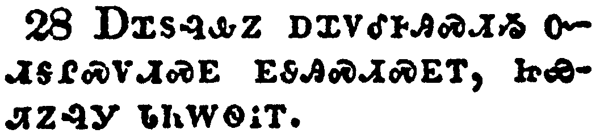</a></td>
</tr>
<tr class="even">
<td>And when I would have known the cause wherefore they accused him, I brought him forth into their council:</td>
</tr>
<tr class="odd">
<td>ᎠᏆᏚᎸᎲᏃ ᎠᏆᏙᎴᎰᎯᏍᏗᏱ ᏅᏗᎦᎵᏍᏙᏗᏍᎬ ᎬᏬᎯᏍᏗᏍᎬᎢ, ᏥᏯᏘᏃᎸᎩ ᏓᏂᎳᏫᎥᎢ.</td>
</tr>
<tr class="even">
<td>A-qua-du-lv-hv-no a-qua-do-le-ho-hi-s-di-yi nv-di-ga-li-s-do-di-s-gv gv-wo-hi-s-di-s-gv-i, tsi-ya-ti-no-lv-gi da-ni-la-wi-v-i.</td>
</tr>
</tbody>
</table>

<table>
<tbody>
<tr class="odd">
<td><a href="052329.png">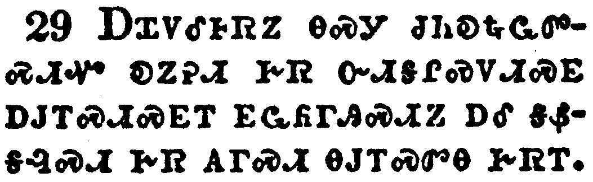</a></td>
</tr>
<tr class="even">
<td>Whom I perceived to be accused of questions of their law, but to have nothing laid to his charge worthy of death or of bonds.</td>
</tr>
<tr class="odd">
<td>ᎠᏆᏙᎴᎰᏒᏃ ᎾᏍᎩ ᏧᏂᎧᎿᎭᏩᏛᏍᏗᏉ ᎧᏃᎮᏗ ᎨᏒ ᏅᏗᎦᎵᏍᏙᏗᏍᎬ ᎠᎫᎢᏍᏗᏍᎬᎢ ᎬᏩᏲᎱᎯᏍᏗᏃ ᎠᎴ ᎦᏰᎦᎸᏍᏗ ᎨᏒ ᎪᎱᏍᏗ ᎾᎫᎢᏍᏛᎾ ᎨᏒᎢ.</td>
</tr>
<tr class="even">
<td>A-qua-do-le-ho-sv-no na-s-gi tsu-ni-ka-hna-wa-dv-s-di-quo ka-no-he-di ge-sv nv-di-ga-li-s-do-di-s-gv a-gu-i-s-di-s-gv-i gv-wa-yo-hu-hi-s-di-no a-le ga-ye-ga-lv-s-di ge-sv go-hu-s-di na-gu-i-s-dv-na ge-sv-i.</td>
</tr>
</tbody>
</table>

<table>
<tbody>
<tr class="odd">
<td><a href="052330.png">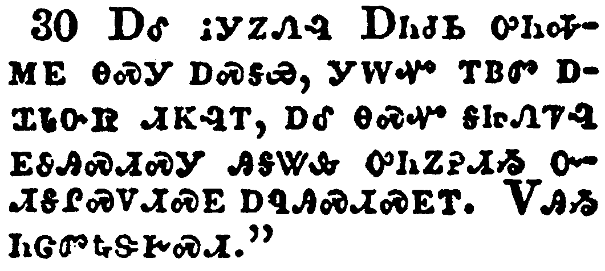</a></td>
</tr>
<tr class="even">
<td>And when it was told me how that the Jews laid wait for the man, I sent straightway to thee, and gave commandment to his accusers also to say before thee what they had against him. Farewell.</td>
</tr>
<tr class="odd">
<td>ᎠᎴ ᎥᎩᏃᏁᎸ ᎠᏂᏧᏏ ᎤᏂᎭᎷᎬ ᎾᏍᎩ ᎠᏍᎦᏯ, ᎩᎳᏉ ᎢᏴᏛ ᎠᏆᏓᏅᏒ ᏗᏦᎸᎢ, ᎠᎴ ᎾᏍᏉ ᎦᏥᏁᏤᎸ ᎬᏭᎯᏍᏗᏍᎩ ᎯᎦᏔᎲ ᎤᏂᏃᎮᏗᏱ ᏅᏗᎦᎵᏍᏙᏗᏍᎬ ᎠᏄᎯᏍᏗᏍᎬᎢ. ᏙᎯᏱ ᏂᏣᏛᎿᎭᏕᎨᏍᏗ."</td>
</tr>
<tr class="even">
<td>A-le v-gi-no-ne-lv a-ni-tsu-si u-ni-ha-lu-gv na-s-gi a-s-ga-ya, gi-la-quo i-yv-dv a-qua-da-nv-sv di-tso-lv-i, a-le na-s-quo ga-tsi-ne-tse-lv gv-wu-hi-s-di-s-gi hi-ga-ta-hv u-ni-no-he-di-yi nv-di-ga-li-s-do-di-s-gv a-nu-hi-s-di-s-gv-i. Do-hi-yi ni-tsa-dv-hna-de-ge-s-di."</td>
</tr>
</tbody>
</table>

<table>
<tbody>
<tr class="odd">
<td><a href="052331.png">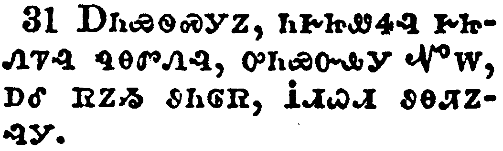</a></td>
</tr>
<tr class="even">
<td>Then the soldiers, as it was commanded them, took Paul, and brought him by night to Antipatris.</td>
</tr>
<tr class="odd">
<td>ᎠᏂᏯᏫᏍᎩᏃ, ᏂᎨᏥᏪᏎᎸ ᎨᏥᏁᏤᎸ ᏄᎾᏛᏁᎸ, ᎤᏂᏯᏅᎲᎩ ᏉᎳ, ᎠᎴ ᏒᏃᏱ ᏭᏂᎶᏒ, ᎥᏗᏇᏗ ᏭᎾᏘᏃᎸᎩ.</td>
</tr>
<tr class="even">
<td>A-ni-ya-wi-s-gi-no, ni-ge-tsi-we-se-lv ge-tsi-ne-tse-lv nu-na-dv-ne-lv, u-ni-ya-nv-hv-gi Quo-la, a-le sv-no-yi wu-ni-lo-sv, V-di-que-di wu-na-ti-no-lv-gi.</td>
</tr>
</tbody>
</table>

<table>
<tbody>
<tr class="odd">
<td><a href="052332.png">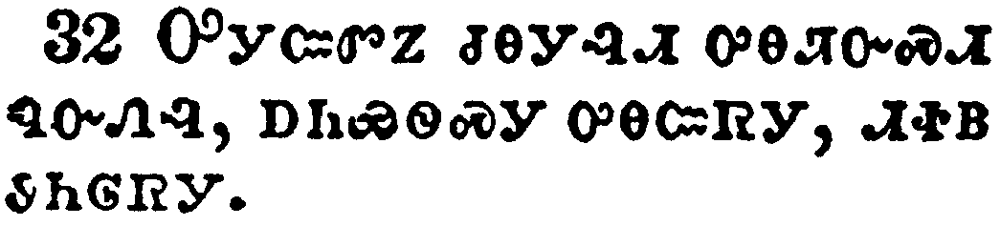</a></td>
</tr>
<tr class="even">
<td>On the morrow they left the horsemen to go with him, and returned to the castle:</td>
</tr>
<tr class="odd">
<td>ᎤᎩᏨᏛᏃ ᏧᎾᎩᎸᏗ ᎤᎾᏘᏅᏍᏗ ᏄᏅᏁᎸ, ᎠᏂᏯᏫᏍᎩ ᎤᎾᏨᏒᎩ, ᏗᏐᏴ ᏭᏂᎶᏒᎩ.</td>
</tr>
<tr class="even">
<td>U-gi-tsv-dv-no tsu-na-gi-lv-di u-na-ti-nv-s-di nu-nv-ne-lv, a-ni-ya-wi-s-gi u-na-tsv-sv-gi, di-so-yv wu-ni-lo-sv-gi.</td>
</tr>
</tbody>
</table>

<table>
<tbody>
<tr class="odd">
<td><a href="052333.png">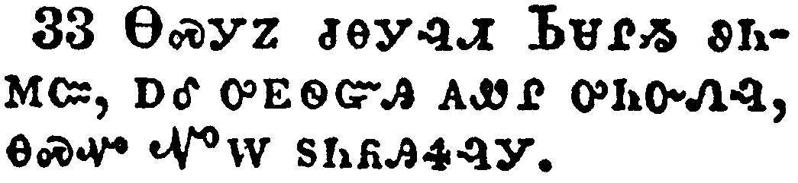</a></td>
</tr>
<tr class="even">
<td>Who, when they came to Caesarea, and delivered the epistle to the governor, presented Paul also before him.</td>
</tr>
<tr class="odd">
<td>ᎾᏍᎩᏃ ᏧᎾᎩᎸᏗ ᏏᏌᎵᏱ ᏭᏂᎷᏨ, ᎠᎴ ᎤᎬᏫᏳᎯ ᎪᏪᎵ ᎤᏂᏅᏁᎸ, ᎾᏍᏉ ᏉᎳ ᏚᏂᏲᎯᏎᎸᎩ.</td>
</tr>
<tr class="even">
<td>Na-s-gi-no tsu-na-gi-lv-di Si-sa-li-yi wu-ni-lu-tsv, a-le u-gv-wi-yu-hi go-we-li u-ni-nv-ne-lv, na-s-quo Quo-la du-ni-yo-hi-se-lv-gi.</td>
</tr>
</tbody>
</table>

<table>
<tbody>
<tr class="odd">
<td><a href="052334.png">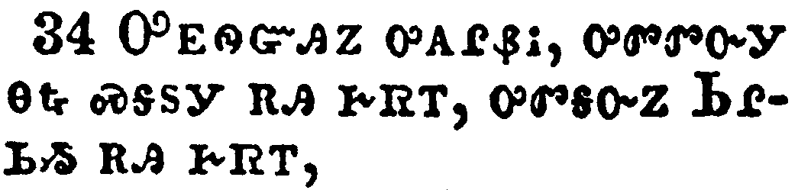</a></td>
</tr>
<tr class="even">
<td>And when the governor had read the letter, he asked of what province he was. And when he understood that he was of Cilicia;</td>
</tr>
<tr class="odd">
<td>ᎤᎬᏫᏳᎯᏃ ᎤᎪᎵᏰᎥ, ᎤᏛᏛᏅᎩ ᎾᎿᎭᏍᎦᏚᎩ ᎡᎯ ᎨᏒᎢ, ᎤᏛᎦᏅᏃ ᏏᎵᏏᏱ ᎡᎯ ᎨᏒᎢ,</td>
</tr>
<tr class="even">
<td>U-gv-wi-yu-hi-no u-go-li-ye-v, u-dv-dv-nv-gi na-hna s-ga-du-gi e-hi ge-sv-i, u-dv-ga-nv-no Si-li-si-yi e-hi ge-sv-i,</td>
</tr>
</tbody>
</table>

<table>
<tbody>
<tr class="odd">
<td><a href="052335.png">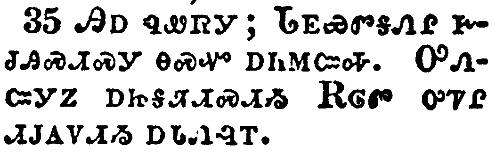</a></td>
</tr>
<tr class="even">
<td>I will hear thee, said he, when thine accusers are also come. And he commanded him to be kept in Herod's judgment hall.</td>
</tr>
<tr class="odd">
<td>ᎯᎠ ᏄᏪᏒᎩ; ᏓᎬᏯᏛᎦᏁᎵ ᎨᏧᎯᏍᏗᏍᎩ ᎾᏍᏉ ᎠᏂᎷᏨᎭ. ᎤᏁᏨᎩᏃ ᎠᏥᎦᏘᏗᏍᏗᏱ ᎡᎶᏛ ᎤᏤᎵ ᏗᎫᎪᏙᏗᏱ ᎠᏓᏁᎸᎢ.</td>
</tr>
<tr class="even">
<td>Hi-a nu-we-sv-gi; Da-gv-ya-dv-ga-ne-li ge-tsu-hi-s-di-s-gi na-s-quo a-ni-lu-tsv-ha. U-ne-tsv-gi-no a-tsi-ga-ti-di-s-di-yi E-lo-dv u-tse-li di-gu-go-do-di-yi a-da-ne-lv-i.</td>
</tr>
</tbody>
</table>

