+++
draft=false
date = 2014-12-18T21:11:07Z
title = "The Acts - Chapter 24 - Cherokee New Testament"
weight = 1418955067

[taxonomies]

authors = ["Timothy Legg"]
categories = []
tags = []

[extra]
+++

<table>
<tbody>
<tr class="odd">
<td><a href="052401.png">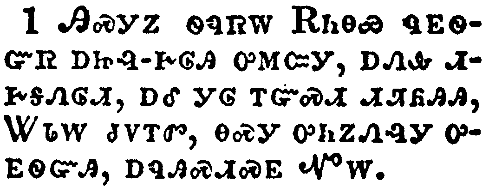</a></td>
</tr>
<tr class="even">
<td>And after five days Ananias the high priest descended with the elders, and with a certain orator named Tertullus, who informed the governor against Paul.</td>
</tr>
<tr class="odd">
<td>ᎯᏍᎩᏃ ᏫᏄᏒᎳ ᎡᏂᎾᏯ ᏄᎬᏫᏳᏒ ᎠᏥᎸ-ᎨᎶᎯ ᎤᎷᏨᎩ, ᎠᏁᎲ ᏗᎨᎦᏁᎶᏗ, ᎠᎴ ᎩᎶ ᎢᏳᏍᏗ ᏗᏘᏲᎯᎯ, ᏔᏓᎳ ᏧᏙᎢᏛ, ᎾᏍᎩ ᎤᏂᏃᏁᎸᎩ ᎤᎬᏫᏳᎯ, ᎠᏄᎯᏍᏗᏍᎬ ᏉᎳ.</td>
</tr>
<tr class="even">
<td>Hi-s-gi-no wi-nu-sv-la E-ni-na-ya nu-gv-wi-yu-sv a-tsi-lv--ge-lo-hi u-lu-tsv-gi, a-ne-hv di-ge-ga-ne-lo-di, a-le gi-lo i-yu-s-di di-ti-yo-hi-hi, Ta-da-la tsu-do-i-dv, na-s-gi u-ni-no-ne-lv-gi u-gv-wi-yu-hi, a-nu-hi-s-di-s-gv Quo-la.</td>
</tr>
</tbody>
</table>

<table>
<tbody>
<tr class="odd">
<td><a href="052402.png">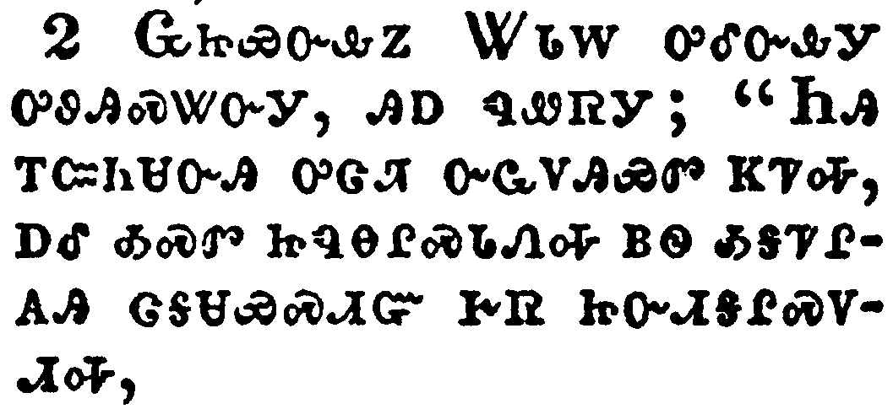</a></td>
</tr>
<tr class="even">
<td>And when he was called forth, Tertullus began to accuse him, saying, Seeing that by thee we enjoy great quietness, and that very worthy deeds are done unto this nation by thy providence,</td>
</tr>
<tr class="odd">
<td>ᏩᏥᏯᏅᎲᏃ ᏔᏓᎳ ᎤᎴᏅᎲᎩ ᎤᏬᎯᏍᏔᏅᎩ, ᎯᎠ ᏄᏪᏒᎩ; "ᏂᎯ ᎢᏣᏂᏌᏅᎯ ᎤᏣᏘ ᏅᏩᏙᎯᏯᏛ ᏦᏤᎭ, ᎠᎴ ᎣᏍᏛ ᏥᏄᎾᎵᏍᏓᏁᎭ ᏴᏫ ᎣᎦᏤᎵᎪᎯ ᏣᎦᏌᏯᏍᏗᏳ ᎨᏒ ᏥᏅᏗᎦᎵᏍᏙᏗᎭ,</td>
</tr>
<tr class="even">
<td>Wa-tsi-ya-nv-hv-no Ta-da-la u-le-nv-hv-gi u-wo-hi-s-ta-nv-gi, hi-a nu-we-sv-gi; "Ni-hi i-tsa-ni-sa-nv-hi u-tsa-ti nv-wa-do-hi-ya-dv tso-tse-ha, a-le o-s-dv tsi-nu-na-li-s-da-ne-ha yv-wi o-ga-tse-li-go-hi tsa-ga-sa-ya-s-di-yu ge-sv tsi-nv-di-ga-li-s-do-di-ha,</td>
</tr>
</tbody>
</table>

<table>
<tbody>
<tr class="odd">
<td><a href="052403.png">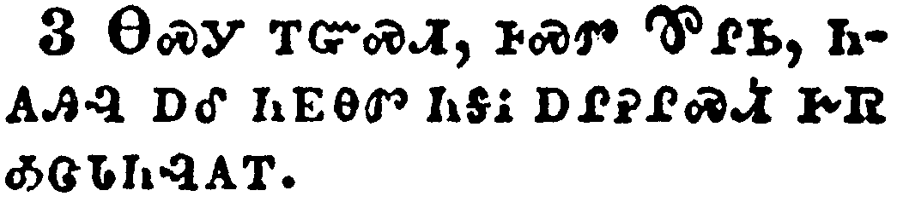</a></td>
</tr>
<tr class="even">
<td>We accept it always, and in all places, most noble Felix, with all thankfulness.</td>
</tr>
<tr class="odd">
<td>ᎾᏍᎩ ᎢᏳᏍᏗ, ᎰᏍᏛ ᏈᎵᏏ, ᏂᎪᎯᎸ ᎠᎴ ᏂᎬᎾᏛ ᏂᎦᎥ ᎠᎵᎮᎵᏍᏗ ᎨᏒ ᎣᏣᏓᏂᎸᎪᎢ.</td>
</tr>
<tr class="even">
<td>na-s-gi i-yu-s-di, ho-s-dv qui-li-si, ni-go-hi-lv a-le ni-gv-na-dv ni-ga-v a-li-he-li-s-di ge-sv o-tsa-da-ni-lv-go-i.</td>
</tr>
</tbody>
</table>

<table>
<tbody>
<tr class="odd">
<td><a href="052404.png">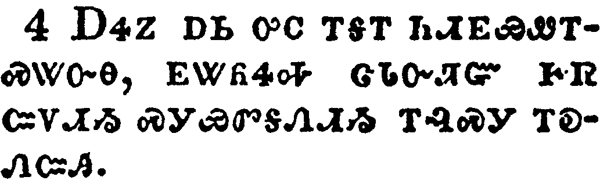</a></td>
</tr>
<tr class="even">
<td>Notwithstanding, that I be not further tedious unto thee, I pray thee that thou wouldest hear us of thy clemency a few words.</td>
</tr>
<tr class="odd">
<td>ᎠᏎᏃ ᎠᏏ ᎤᏟ ᎢᎦᎢ ᏂᏗᎬᏯᏪᎢᏍᏔᏅᎾ, ᎬᏔᏲᏎᎭ ᏣᏓᏅᏘᏳ ᎨᏒ ᏨᏙᏗᏱ ᏍᎩᏯᏛᎦᏁᏗᏱ ᎢᎸᏍᎩ ᎢᎧᏁᏨᎯ.</td>
</tr>
<tr class="even">
<td>A-se-no a-si u-tli i-ga-i ni-di-gv-ya-we-i-s-ta-nv-na, gv-ta-yo-se-ha tsa-da-nv-ti-yu ge-sv tsv-do-di-yi s-gi-ya-dv-ga-ne-di-yi i-lv-s-gi i-ka-ne-tsv-hi.</td>
</tr>
</tbody>
</table>

<table>
<tbody>
<tr class="odd">
<td><a href="052405.png">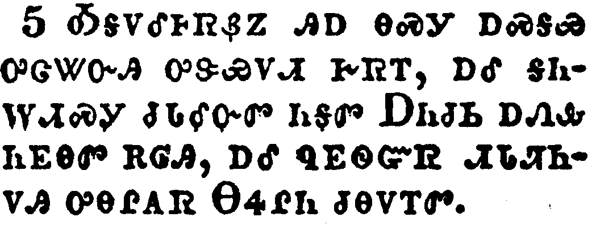</a></td>
</tr>
<tr class="even">
<td>For we have found this man a pestilent fellow, and a mover of sedition among all the Jews throughout the world, and a ringleader of the sect of the Nazarenes:</td>
</tr>
<tr class="odd">
<td>ᎣᎦᏙᎴᎰᏒᏰᏃ ᎯᎠ ᎾᏍᎩ ᎠᏍᎦᏯ ᎤᏣᏔᏅᎯ ᎤᏕᏯᏙᏗ ᎨᏒᎢ, ᎠᎴ ᎦᏂᎳᏗᏍᎩ ᏧᏓᎴᏅᏛ ᏂᎦᏛ ᎠᏂᏧᏏ ᎠᏁᎲ ᏂᎬᎾᏛ ᎡᎶᎯ, ᎠᎴ ᏄᎬᏫᏳᏒ ᏗᏓᏘᏂᏙᎯ ᎤᎾᎵᎪᏒ ᎾᏎᎵᏂ ᏧᎾᏙᎢᏛ.</td>
</tr>
<tr class="even">
<td>O-ga-do-le-ho-sv-ye-no hi-a na-s-gi a-s-ga-ya u-tsa-ta-nv-hi u-de-ya-do-di ge-sv-i, a-le ga-ni-la-di-s-gi tsu-da-le-nv-dv ni-ga-dv A-ni-tsu-si a-ne-hv ni-gv-na-dv e-lo-hi, a-le nu-gv-wi-yu-sv di-da-ti-ni-do-hi u-na-li-go-sv Na-se-li-ni tsu-na-do-i-dv.</td>
</tr>
</tbody>
</table>

<table>
<tbody>
<tr class="odd">
<td><a href="052406.png">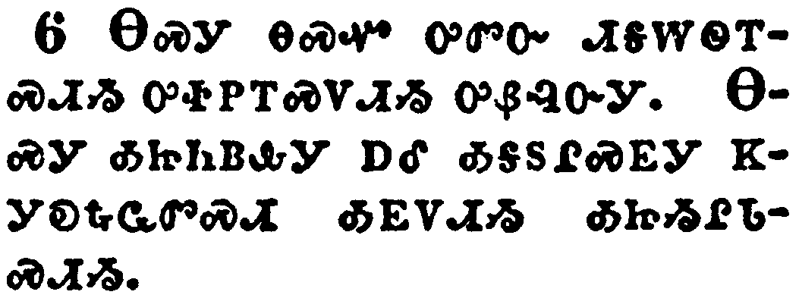</a></td>
</tr>
<tr class="even">
<td>Who also hath gone about to profane the temple: whom we took, and would have judged according to our law.</td>
</tr>
<tr class="odd">
<td>ᎾᏍᎩ ᎾᏍᏉ ᎤᏛᏅ ᏗᎦᎳᏫᎢᏍᏗᏱ ᎤᏐᏢᎢᏍᏙᏗᏱ ᎤᏰᎸᏅᎩ. ᎾᏍᎩ ᎣᏥᏂᏴᎲᎩ ᎠᎴ ᎣᎦᏚᎵᏍᎬᎩ ᏦᎩᎧᎿᎭᏩᏛᏍᏗ ᎣᎬᏙᏗᏱ ᎣᏥᏱᎵᏓᏍᏗᏱ.</td>
</tr>
<tr class="even">
<td>Na-s-gi na-s-quo u-dv-nv di-ga-la-wi-i-s-di-yi u-so-tlv-i-s-do-di-yi u-ye-lv-nv-gi. Na-s-gi o-tsi-ni-yv-hv-gi a-le o-ga-du-li-s-gv-gi tso-gi-ka-hna-wa-dv-s-di o-gv-do-di-yi o-tsi-yi-li-da-s-di-yi.</td>
</tr>
</tbody>
</table>

<table>
<tbody>
<tr class="odd">
<td><a href="052407.png">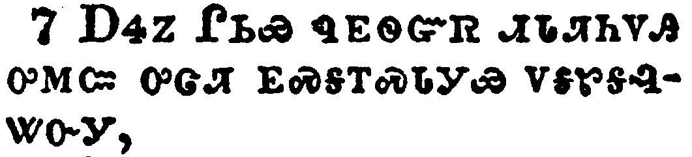</a></td>
</tr>
<tr class="even">
<td>But the chief captain Lysias came upon us, and with great violence took him away out of our hands,</td>
</tr>
<tr class="odd">
<td>ᎠᏎᏃ ᎵᏏᏯ ᏄᎬᏫᏳᏒ ᏗᏓᏘᏂᏙᎯ ᎤᎷᏨ ᎤᏣᏘ ᎬᏍᎦᎢᏍᏓᎩᏯ ᏙᎦᏑᎦᎸᏔᏅᎩ,</td>
</tr>
<tr class="even">
<td>A-se-no Li-si-ya nu-gv-wi-yu-sv di-da-ti-ni-do-hi u-lu-tsv u-tsa-ti gv-s-ga-i-s-da-gi-ya do-ga-su-ga-lv-ta-nv-gi,</td>
</tr>
</tbody>
</table>

<table>
<tbody>
<tr class="odd">
<td><a href="052408.png">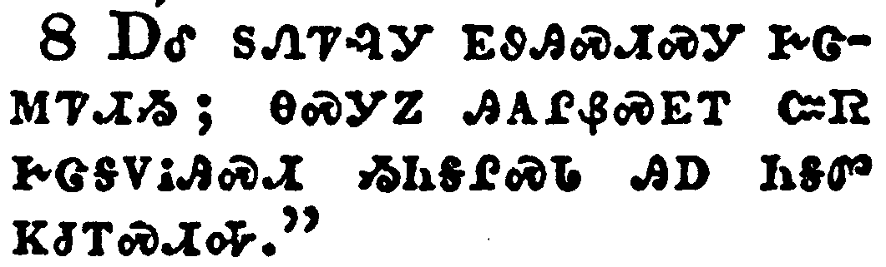</a></td>
</tr>
<tr class="even">
<td>Commanding his accusers to come unto thee: by examining of whom thyself mayest take knowledge of all these things, whereof we accuse him.</td>
</tr>
<tr class="odd">
<td>ᎠᎴ ᏚᏁᏤᎸᎩ ᎬᏭᎯᏍᏗᏍᎩ ᎨᏣᎷᏤᏗᏱ; ᎾᏍᎩᏃ ᎯᎪᎵᏰᏍᎬᎢ ᏨᏒ ᎨᏣᎦᏙᎥᎯᏍᏗ ᏱᏂᎦᎵᏍᏓ ᎯᎠ ᏂᎦᏛ ᏦᏧᎢᏍᏗᎭ."</td>
</tr>
<tr class="even">
<td>A-le du-ne-tse-lv-gi gv-wu-hi-s-di-s-gi ge-tsa-lu-tse-di-yi; na-s-gi-no hi-go-li-ye-s-gv-i tsv-sv ge-tsa-ga-do-v-hi-s-di yi-ni-ga-li-s-da hi-a ni-ga-dv tso-tsu-i-s-di-ha."</td>
</tr>
</tbody>
</table>

<table>
<tbody>
<tr class="odd">
<td></td>
</tr>
<tr class="even">
<td>And the Jews also assented, saying that these things were so.</td>
</tr>
<tr class="odd">
<td>ᎠᏂᏧᏏᏃ ᎾᏍᏉ ᎤᏂᏍᏓᏱᏛᎩ, ᎤᏙᎯᏳᎯ ᎾᏍᎩ ᏄᏍᏗ, ᎤᎾᏛᏅᎩ.</td>
</tr>
<tr class="even">
<td>A-ni-tsu-si-no na-s-quo u-ni-s-da-yi-dv-gi, u-do-hi-yu-hi na-s-gi nu-s-di, u-na-dv-nv-gi.</td>
</tr>
</tbody>
</table>

<table>
<tbody>
<tr class="odd">
<td><a href="052410.png">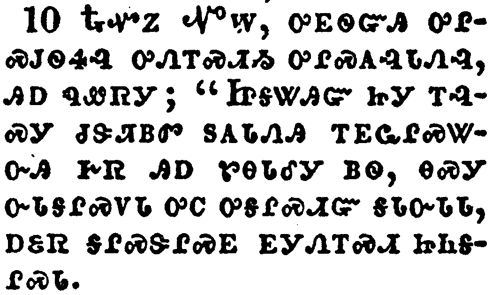</a></td>
</tr>
<tr class="even">
<td>Then Paul, after that the governor had beckoned unto him to speak, answered, Forasmuch as I know that thou hast been of many years a judge unto this nation, I do the more cheerfully answer for myself:</td>
</tr>
<tr class="odd">
<td>ᎿᎭᏉᏃ ᏉᎳ, ᎤᎬᏫᏳᎯ ᎤᎵᏍᎫᏫᏎᎸ ᎤᏁᎢᏍᏗᏱ ᎤᎵᏍᎪᎸᏓᏁᎸ, ᎯᎠ ᏄᏪᏒᎩ; "ᏥᎦᏔᎯᏳ ᏥᎩ ᎢᎸᏍᎩ ᏧᏕᏘᏴᏛ ᏚᎪᏓᏁᎯ ᎢᎬᏩᎵᏍᏔᏅᎯ ᎨᏒ ᎯᎠ ᏑᎾᏓᎴᎩ ᏴᏫ, ᎾᏍᎩ ᏅᏓᎦᎵᏍᏙᏓ ᎤᏟ ᎤᎦᎵᏍᏗᏳ ᎦᏓᏅᏓᏓ, ᎠᏋᏒ ᎦᎵᏍᏕᎵᏍᎬ ᎬᎩᏁᎢᏍᏗ ᏥᏂᎦᎵᏍᏓ.</td>
</tr>
<tr class="even">
<td>Hna-quo-no Quo-la, u-gv-wi-yu-hi u-li-s-gu-wi-se-lv u-ne-i-s-di-yi u-li-s-go-lv-da-ne-lv, hi-a nu-we-sv-gi; "Tsi-ga-ta-hi-yu tsi-gi i-lv-s-gi tsu-de-ti-yv-dv du-go-da-ne-hi i-gv-wa-li-s-ta-nv-hi ge-sv hi-a su-na-da-le-gi yv-wi, na-s-gi nv-da-ga-li-s-do-da u-tli u-ga-li-s-di-yu ga-da-nv-da-da, a-quv-sv ga-li-s-de-li-s-gv gv-gi-ne-i-s-di tsi-ni-ga-li-s-da.</td>
</tr>
</tbody>
</table>

<table>
<tbody>
<tr class="odd">
<td></td>
</tr>
<tr class="even">
<td>Because that thou mayest understand, that there are yet but twelve days since I went up to Jerusalem for to worship.</td>
</tr>
<tr class="odd">
<td>ᎨᏣᎦᏙᎥᎯᏍᏗᏰᏃ ᏂᎦᎵᏍᏗᎭ ᎾᏍᎩ ᎠᏏᏉ ᏔᎳᏚᏉ ᏄᏒᎭ ᏥᎷᏏᎵᎻ ᎬᏆᏓᏙᎵᏍᏔᏅᏒᎯ.</td>
</tr>
<tr class="even">
<td>Ge-tsa-ga-do-v-hi-s-di-ye-no ni-ga-li-s-di-ha na-s-gi a-si-quo ta-la-du-quo nu-sv-ha Tsi-lu-si-li-mi gv-qua-da-do-li-s-ta-nv-sv-hi.</td>
</tr>
</tbody>
</table>

<table>
<tbody>
<tr class="odd">
<td><a href="052412.png">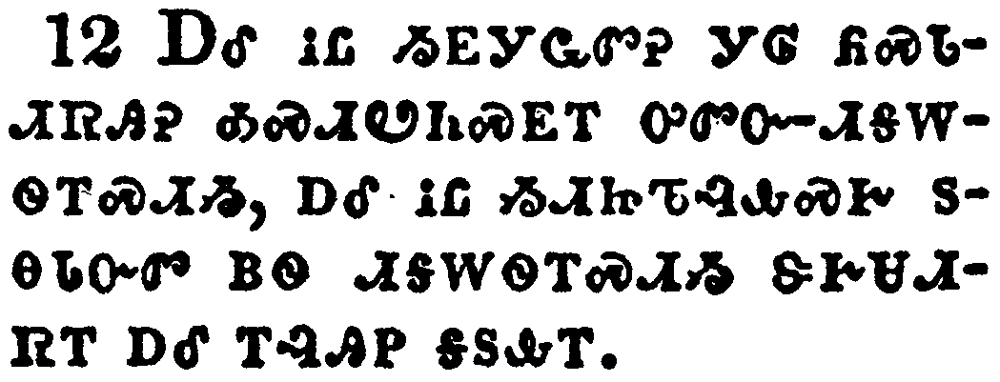</a></td>
</tr>
<tr class="even">
<td>And they neither found me in the temple disputing with any man, neither raising up the people, neither in the synagogues, nor in the city:</td>
</tr>
<tr class="odd">
<td>ᎠᎴ ᎥᏝ ᏱᎬᎩᏩᏛᎮ ᎩᎶ ᏲᏍᏓᏗᏒᎯᎮ ᎣᏍᏗᏬᏂᏍᎬᎢ ᎤᏛᏅ-ᏗᎦᎳᏫᎢᏍᏗᏱ, ᎠᎴ ᎥᏝ ᏱᏗᏥᏖᎸᎲᏍᎨ ᏚᎾᏓᏅᏛ ᏴᏫ ᏗᎦᎳᏫᎢᏍᏗᏱ ᏕᎨᏌᏗᏒᎢ ᎠᎴ ᎢᎸᎯᏢ ᎦᏚᎲᎢ.</td>
</tr>
<tr class="even">
<td>A-le v-tla yi-gv-gi-wa-dv-he gi-lo yo-s-da-di-sv-hi-he o-s-di-wo-ni-s-gv-i u-dv-nv--di-ga-la-wi-i-s-di-yi, a-le v-tla yi-di-tsi-te-lv-hv-s-ge du-na-da-nv-dv yv-wi di-ga-la-wi-i-s-di-yi de-ge-sa-di-sv-i a-le i-lv-hi-tlv ga-du-hv-i.</td>
</tr>
</tbody>
</table>

<table>
<tbody>
<tr class="odd">
<td><a href="052413.png">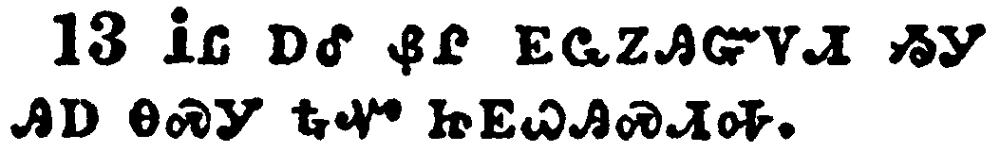</a></td>
</tr>
<tr class="even">
<td>Neither can they prove the things whereof they now accuse me.</td>
</tr>
<tr class="odd">
<td>ᎥᏝ ᎠᎴ ᏰᎵ ᎬᏩᏃᎯᏳᏙᏗ ᏱᎩ ᎯᎠ ᎾᏍᎩ ᎿᎭᏉ ᏥᎬᏇᎯᏍᏗᎭ.</td>
</tr>
<tr class="even">
<td>V-tla a-le ye-li gv-wa-no-hi-yu-do-di yi-gi hi-a na-s-gi hna-quo tsi-gv-que-hi-s-di-ha.</td>
</tr>
</tbody>
</table>

<table>
<tbody>
<tr class="odd">
<td><a href="052414.png">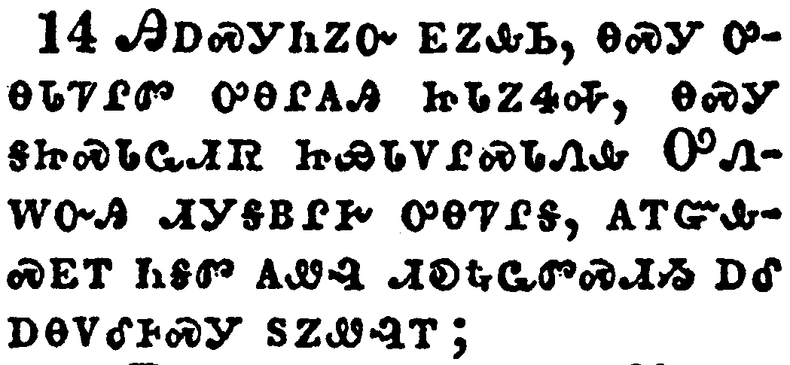</a></td>
</tr>
<tr class="even">
<td>But this I confess unto thee, that after the way which they call heresy, so worship I the God of my fathers, believing all things which are written in the law and in the prophets:</td>
</tr>
<tr class="odd">
<td>ᎯᎠᏍᎩᏂᏃᏅ ᎬᏃᎲᏏ, ᎾᏍᎩ ᎤᎾᏓᏤᎵᏛ ᎤᎾᎵᎪᎯ ᏥᏓᏃᏎᎭ, ᎾᏍᎩ ᎦᏥᏍᏓᏩᏗᏒ ᏥᏯᏓᏙᎵᏍᏓᏁᎲ ᎤᏁᎳᏅᎯ ᏗᎩᎦᏴᎵᎨ ᎤᎾᏤᎵᎦ, ᎪᎢᏳᎲᏍᎬᎢ ᏂᎦᏛ ᎪᏪᎸ ᏗᎧᎿᎭᏩᏛᏍᏗᏱ ᎠᎴ ᎠᎾᏙᎴᎰᏍᎩ ᏚᏃᏪᎸᎢ;</td>
</tr>
<tr class="even">
<td>Hi-a-s-gi-ni-no-nv gv-no-hv-si, na-s-gi u-na-da-tse-li-dv u-na-li-go-hi tsi-da-no-se-ha, na-s-gi ga-tsi-s-da-wa-di-sv tsi-ya-da-do-li-s-da-ne-hv U-ne-la-nv-hi di-gi-ga-yv-li-ge u-na-tse-li-ga, go-i-yu-hv-s-gv-i ni-ga-dv go-we-lv di-ka-hna-wa-dv-s-di-yi a-le a-na-do-le-ho-s-gi du-no-we-lv-i;</td>
</tr>
</tbody>
</table>

<table>
<tbody>
<tr class="odd">
<td><a href="052415.png">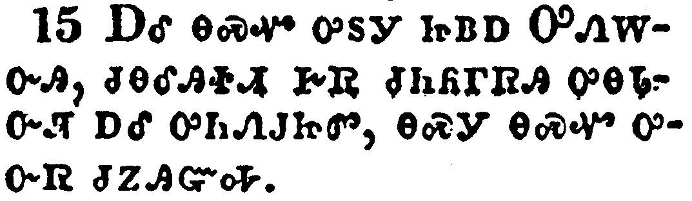</a></td>
</tr>
<tr class="even">
<td>And have hope toward God, which they themselves also allow, that there shall be a resurrection of the dead, both of the just and unjust.</td>
</tr>
<tr class="odd">
<td>ᎠᎴ ᎾᏍᏉ ᎤᏚᎩ ᏥᏴᎠ ᎤᏁᎳᏅᎯ, ᏧᎾᎴᎯᏐᏗ ᎨᏒ ᏧᏂᏲᎱᏒᎯ ᎤᎾᏓᏅᏘ ᎠᎴ ᎤᏂᏁᎫᏥᏛ, ᎾᏍᎩ ᎾᏍᏉ ᎤᏅᏒ ᏧᏃᎯᏳᎭ.</td>
</tr>
<tr class="even">
<td>A-le na-s-quo u-du-gi tsi-yv-a U-ne-la-nv-hi, tsu-na-le-hi-so-di ge-sv tsu-ni-yo-hu-sv-hi u-na-da-nv-ti a-le u-ni-ne-gu-tsi-dv, na-s-gi na-s-quo u-nv-sv tsu-no-hi-yu-ha.</td>
</tr>
</tbody>
</table>

<table>
<tbody>
<tr class="odd">
<td><a href="052416.png">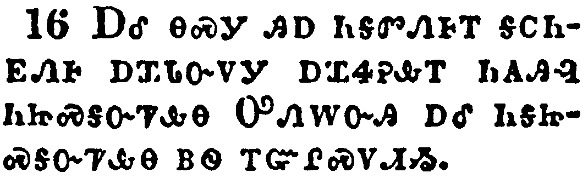</a></td>
</tr>
<tr class="even">
<td>And herein do I exercise myself, to have always a conscience void of offence toward God, and toward men.</td>
</tr>
<tr class="odd">
<td>ᎠᎴ ᎾᏍᎩ ᎯᎠ ᏂᎦᏛᏁᎰᎢ ᎦᏟᏂᎬᏁᎰ ᎠᏆᏓᏅᏙᎩ ᎠᏆᏎᎮᎲᎢ ᏂᎪᎯᎸ ᏂᏥᏍᎦᏅᏤᎲᎾ ᎤᏁᎳᏅᎯ ᎠᎴ ᏂᎦᏥᏍᎦᏅᏤᎲᎾ ᏴᏫ ᎢᏳᎵᏍᏙᏗᏱ.</td>
</tr>
<tr class="even">
<td>A-le na-s-gi hi-a ni-ga-dv-ne-ho-i ga-tli-ni-gv-ne-ho a-qua-da-nv-do-gi a-qua-se-he-hv-i ni-go-hi-lv ni-tsi-s-ga-nv-tse-hv-na U-ne-la-nv-hi a-le ni-ga-tsi-s-ga-nv-tse-hv-na yv-wi i-yu-li-s-do-di-yi.</td>
</tr>
</tbody>
</table>

<table>
<tbody>
<tr class="odd">
<td><a href="052417.png">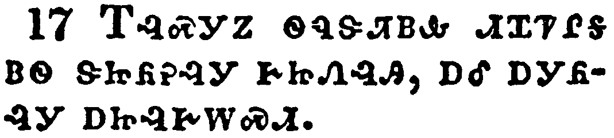</a></td>
</tr>
<tr class="even">
<td>Now after many years I came to bring alms to my nation, and offerings.</td>
</tr>
<tr class="odd">
<td>ᎢᎸᏍᎩᏃ ᏫᏄᏕᏘᏴᎲ ᏗᏆᏤᎵᎦ ᏴᏫ ᏕᏥᏲᎮᎸᎩ ᎨᏥᏁᎸᎯ, ᎠᎴ ᎠᎩᏲᎸᎩ ᎠᏥᎸᎨᎳᏍᏗ.</td>
</tr>
<tr class="even">
<td>I-lv-s-gi-no wi-nu-de-ti-yv-hv di-qua-tse-li-ga yv-wi de-tsi-yo-he-lv-gi ge-tsi-ne-lv-hi, a-le a-gi-yo-lv-gi a-tsi-lv-ge-la-s-di.</td>
</tr>
</tbody>
</table>

<table>
<tbody>
<tr class="odd">
<td><a href="052418.png">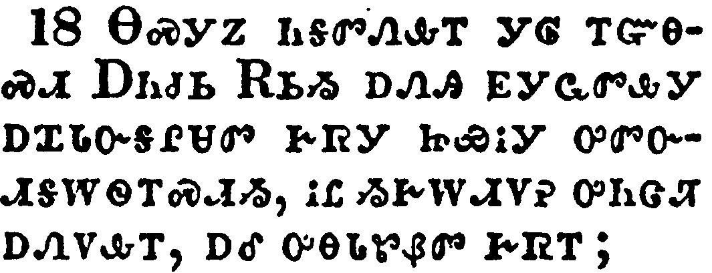</a></td>
</tr>
<tr class="even">
<td>Whereupon certain Jews from Asia found me purified in the temple, neither with multitude, nor with tumult.</td>
</tr>
<tr class="odd">
<td>ᎾᏍᎩᏃ ᏂᎦᏛᏁᎲᎢ ᎩᎶ ᎢᏳᎾᏍᏗ ᎠᏂᏧᏏ ᎡᏏᏱ ᎠᏁᎯ ᎬᎩᏩᏛᎲᎩ ᎠᏆᏓᏅᎦᎵᏌᏛ ᎨᏒᎩ ᏥᏯᎥᎩ ᎤᏛᏅᏗᎦᎳᏫᎢᏍᏗᏱ, ᎥᏝ ᏱᎨᎳᏗᏙᎮ ᎤᏂᏣᏘ ᎠᏁᏙᎲᎢ, ᎠᎴ ᎤᎾᏓᏑᏰᏛ ᎨᏒᎢ;</td>
</tr>
<tr class="even">
<td>Na-s-gi-no ni-ga-dv-ne-hv-i gi-lo i-yu-na-s-di A-ni-tsu-si E-si-yi a-ne-hi gv-gi-wa-dv-hv-gi a-qua-da-nv-ga-li-sa-dv ge-sv-gi tsi-ya-v-gi u-dv-nv-di-ga-la-wi-i-s-di-yi, v-tla yi-ge-la-di-do-he u-ni-tsa-ti a-ne-do-hv-i, a-le u-na-da-su-ye-dv ge-sv-i;</td>
</tr>
</tbody>
</table>

<table>
<tbody>
<tr class="odd">
<td><a href="052419.png">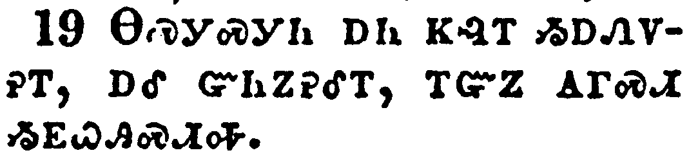</a></td>
</tr>
<tr class="even">
<td>Who ought to have been here before thee, and object, if they had ought against me.</td>
</tr>
<tr class="odd">
<td>ᎾᏍᎩᏍᎩᏂ ᎠᏂ ᏦᎸᎢ ᏱᎠᏁᏙᎮᎢ, ᎠᎴ ᏳᏂᏃᎮᎴᎢ, ᎢᏳᏃ ᎪᎱᏍᏗ ᏱᎬᏇᎯᏍᏗᎭ.</td>
</tr>
<tr class="even">
<td>Na-s-gi-s-gi-ni a-ni tso-lv-i yi-a-ne-do-he-i, a-le yu-ni-no-he-le-i, i-yu-no go-hu-s-di yi-gv-que-hi-s-di-ha.</td>
</tr>
</tbody>
</table>

<table>
<tbody>
<tr class="odd">
<td><a href="052420.png">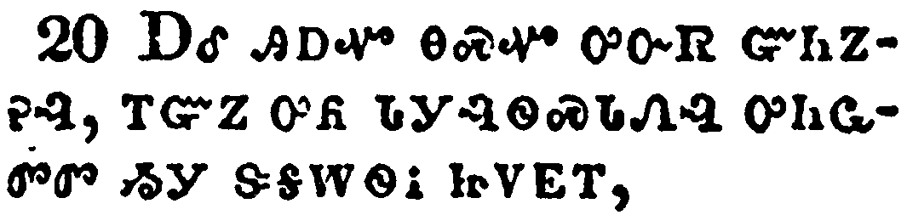</a></td>
</tr>
<tr class="even">
<td>Or else let these same here say, if they have found any evil doing in me, while I stood before the council,</td>
</tr>
<tr class="odd">
<td>ᎠᎴ ᎯᎠᏉ ᎾᏍᏉ ᎤᏅᏒ ᏳᏂᏃᎮᎸ, ᎢᏳᏃ ᎤᏲ ᏓᎩᎸᏫᏍᏓᏁᎸ ᎤᏂᏩᏛᏛ ᏱᎩ ᏕᎦᎳᏫᎥ ᏥᏙᎬᎢ,</td>
</tr>
<tr class="even">
<td>A-le hi-a-quo na-s-quo u-nv-sv yu-ni-no-he-lv, i-yu-no u-yo da-gi-lv-wi-s-da-ne-lv u-ni-wa-dv-dv yi-gi de-ga-la-wi-v tsi-do-gv-i,</td>
</tr>
</tbody>
</table>

<table>
<tbody>
<tr class="odd">
<td><a href="052421.png">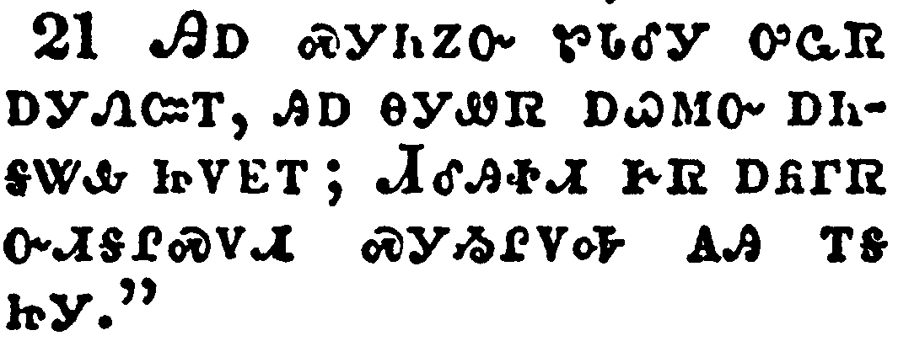</a></td>
</tr>
<tr class="even">
<td>Except it be for this one voice, that I cried standing among them, Touching the resurrection of the dead I am called in question by you this day.</td>
</tr>
<tr class="odd">
<td>ᎯᎠ ᏍᎩᏂᏃᏅ ᏑᏓᎴᎩ ᎤᏩᏒ ᎠᎩᏁᏨᎢ, ᎯᎠ ᎾᎩᏪᏒ ᎠᏇᎷᏅ ᎠᏂᎦᏔᎲ ᏥᏙᎬᎢ; ᏗᎴᎯᏐᏗ ᎨᏒ ᎠᏲᎱᏒ ᏅᏗᎦᎵᏍᏙᏗ ᏍᎩᏱᎵᏙᎭ ᎪᎯ ᎢᎦ ᏥᎩ."</td>
</tr>
<tr class="even">
<td>Hi-a s-gi-ni-no-nv su-da-le-gi u-wa-sv a-gi-ne-tsv-i, hi-a na-gi-we-sv a-que-lu-nv a-ni-ga-ta-hv tsi-do-gv-i; Di-le-hi-so-di ge-sv a-yo-hu-sv nv-di-ga-li-s-do-di s-gi-yi-li-do-ha go-hi i-ga tsi-gi."</td>
</tr>
</tbody>
</table>

<table>
<tbody>
<tr class="odd">
<td><a href="052422.png">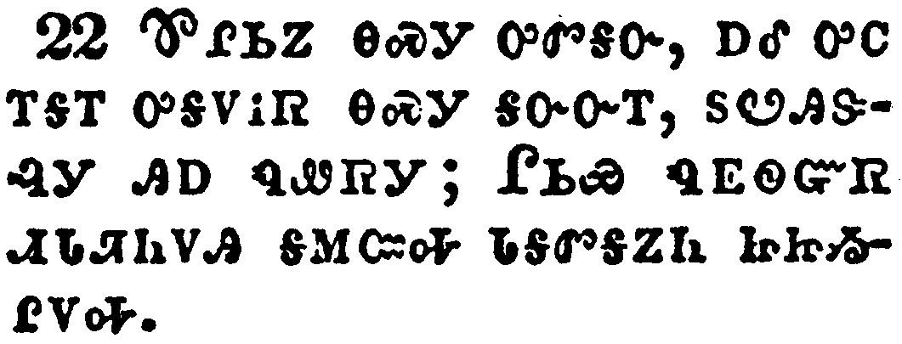</a></td>
</tr>
<tr class="even">
<td>And when Felix heard these things, having more perfect knowledge of that way, he deferred them, and said, When Lysias the chief captain shall come down, I will know the uttermost of your matter.</td>
</tr>
<tr class="odd">
<td>ᏈᎵᏏᏃ ᎾᏍᎩ ᎤᏛᎦᏅ, ᎠᎴ ᎤᏟ ᎢᎦᎢ ᎤᎦᏙᎥᏒ ᎾᏍᎩ ᎦᏅᏅᎢ, ᏚᏬᎯᏕᎸᎩ ᎯᎠ ᏄᏪᏒᎩ; ᎵᏏᏯ ᏄᎬᏫᏳᏒ ᏗᏓᏘᏂᏙᎯ ᎦᎷᏨᎭ ᏓᎦᏛᎦᏃᏂ ᏥᏥᏱᎵᏙᎭ.</td>
</tr>
<tr class="even">
<td>Qui-li-si-no na-s-gi u-dv-ga-nv, a-le u-tli i-ga-i u-ga-do-v-sv na-s-gi ga-nv-nv-i, du-wo-hi-de-lv-gi hi-a nu-we-sv-gi; Li-si-ya nu-gv-wi-yu-sv di-da-ti-ni-do-hi ga-lu-tsv-ha da-ga-dv-ga-no-ni tsi-tsi-yi-li-do-ha.</td>
</tr>
</tbody>
</table>

<table>
<tbody>
<tr class="odd">
<td></td>
</tr>
<tr class="even">
<td>And he commanded a centurion to keep Paul, and to let him have liberty, and that he should forbid none of his acquaintance to minister or come unto him.</td>
</tr>
<tr class="odd">
<td>ᎤᏁᏤᎸᎩᏃ ᎠᏍᎪᎯᏧᏛ ᏗᏘᏂᏙᎯ ᏧᎧᎿᎭᏩᏗᏓᏍᏗᏱ ᏉᎳ, ᎠᎴ ᎤᏁᎳᎩ ᏪᏓ ᎤᏪᎵᏎᏗᏱ, ᎠᎴ ᎯᎠ ᏄᏪᏎᎸᎩ; ᏞᏍᏗ ᏣᏅᏍᏙᏒᎩ ᎩᎶ ᎢᏳᏍᏗ ᎤᎾᎵᎢ ᎤᏍᏕᎸᎯᏓᏍᏗᏱ ᎠᎴ ᎤᏩᏛᎯᎯᏍᏗᏱ.</td>
</tr>
<tr class="even">
<td>U-ne-tse-lv-gi-no a-s-go-hi-tsu-dv di-ti-ni-do-hi tsu-ka-hna-wa-di-da-s-di-yi Quo-la, a-le u-ne-la-gi we-da u-we-li-se-di-yi, a-le hi-a nu-we-se-lv-gi; tle-s-di tsa-nv-s-do-sv-gi gi-lo i-yu-s-di u-na-li-i u-s-de-lv-hi-da-s-di-yi a-le u-wa-dv-hi-hi-s-di-yi.</td>
</tr>
</tbody>
</table>

<table>
<tbody>
<tr class="odd">
<td><a href="052424.png">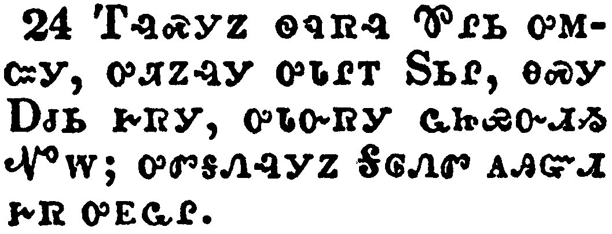</a></td>
</tr>
<tr class="even">
<td>And after certain days, when Felix came with his wife Drusilla, which was a Jewess, he sent for Paul, and heard him concerning the faith in Christ.</td>
</tr>
<tr class="odd">
<td>ᎢᎸᏍᎩᏃ ᏫᏄᏒᎸ ᏈᎵᏏ ᎤᎷᏨᎩ, ᎤᏘᏃᎸᎩ ᎤᏓᎵᎢ ᏚᏏᎵ, ᎾᏍᎩ ᎠᏧᏏ ᎨᏒᎩ, ᎤᏓᏅᏒᎩ ᏩᏥᏯᏅᏗᏱ ᏉᎳ; ᎤᏛᎦᏁᎸᎩᏃ ᎦᎶᏁᏛ ᎪᎯᏳᏗ ᎨᏒ ᎤᎬᏩᎵ.</td>
</tr>
<tr class="even">
<td>I-lv-s-gi-no wi-nu-sv-lv Qui-li-si u-lu-tsv-gi, u-ti-no-lv-gi u-da-li-i Du-si-li, na-s-gi A-tsu-si ge-sv-gi, u-da-nv-sv-gi wa-tsi-ya-nv-di-yi Quo-la; u-dv-ga-ne-lv-gi-no Ga-lo-ne-dv go-hi-yu-di ge-sv u-gv-wa-li.</td>
</tr>
</tbody>
</table>

<table>
<tbody>
<tr class="odd">
<td><a href="052425.png">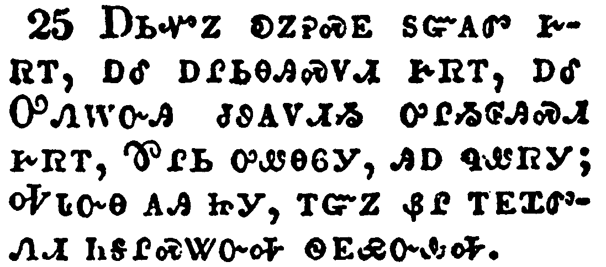</a></td>
</tr>
<tr class="even">
<td>And as he reasoned of righteousness, temperance, and judgment to come Felix trembled, and answered, Go thy way for this time; when I have a convenient season, I will call for thee.</td>
</tr>
<tr class="odd">
<td>ᎠᏏᏉᏃ ᎧᏃᎮᏍᎬ ᏚᏳᎪᏛ ᎨᏒᎢ, ᎠᎴ ᎠᎵᏏᎾᎯᏍᏙᏗ ᎨᏒᎢ, ᎠᎴ ᎤᏁᎳᏅᎯ ᏧᏭᎪᏙᏗᏱ ᎤᎵᏱᎶᎯᏍᏗ ᎨᏒᎢ, ᏈᎵᏏ ᎤᏪᎾᏮᎩ, ᎯᎠ ᏄᏪᏒᎩ; ᎭᏓᏅᎾ ᎪᎯ, ᎢᏳᏃ ᏰᎵ ᎢᎬᏆᏛᏁᏗ ᏂᎦᎵᏍᏔᏅᎭ ᏫᎬᏯᏅᎲᎭ.</td>
</tr>
<tr class="even">
<td>A-si-quo-no ka-no-he-s-gv du-yu-go-dv ge-sv-i, a-le a-li-si-na-hi-s-do-di ge-sv-i, a-le U-ne-la-nv-hi tsu-wu-go-do-di-yi u-li-yi-lo-hi-s-di ge-sv-i, Qui-li-si u-we-na-wv-gi, hi-a nu-we-sv-gi; Ha-da-nv-na go-hi, i-yu-no ye-li i-gv-qua-dv-ne-di ni-ga-li-s-ta-nv-ha wi-gv-ya-nv-hv-ha.</td>
</tr>
</tbody>
</table>

<table>
<tbody>
<tr class="odd">
<td><a href="052426.png">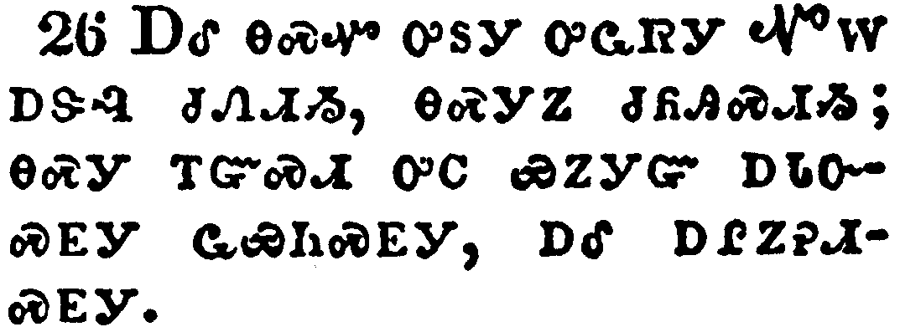</a></td>
</tr>
<tr class="even">
<td>He hoped also that money should have been given him of Paul, that he might loose him: wherefore he sent for him the oftener, and communed with him.</td>
</tr>
<tr class="odd">
<td>ᎠᎴ ᎾᏍᏉ ᎤᏚᎩ ᎤᏩᏒᎩ ᏉᎳ ᎠᏕᎸ ᏧᏁᏗᏱ, ᎾᏍᎩᏃ ᏧᏲᎯᏍᏗᏱ; ᎾᏍᎩ ᎢᏳᏍᏗ ᎤᏟ ᏯᏃᎩᏳ ᎠᏓᏅᏍᎬᎩ ᏩᏯᏂᏍᎬᎩ, ᎠᎴ ᎠᎵᏃᎮᏗᏍᎬᎩ.</td>
</tr>
<tr class="even">
<td>A-le na-s-quo u-du-gi u-wa-sv-gi Quo-la a-de-lv tsu-ne-di-yi, na-s-gi-no tsu-yo-hi-s-di-yi; na-s-gi i-yu-s-di u-tli ya-no-gi-yu a-da-nv-s-gv-gi wa-ya-ni-s-gv-gi, a-le a-li-no-he-di-s-gv-gi.</td>
</tr>
</tbody>
</table>

<table>
<tbody>
<tr class="odd">
<td><a href="052427.png">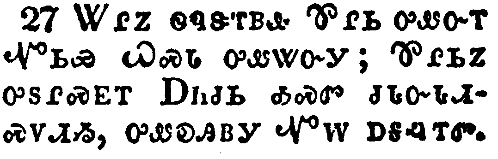</a></td>
</tr>
<tr class="even">
<td>But after two years Porcius Festus came into Felix' room: and Felix, willing to shew the Jews a pleasure, left Paul bound.</td>
</tr>
<tr class="odd">
<td>ᏔᎵᏃ ᏫᏄᏕᎢᏴᎲ ᏈᎵᏏ ᎤᏪᏅᎢ ᏉᏏᏯ ᏇᏍᏓ ᎤᏪᏔᏅᎩ; ᏈᎵᏏᏃ ᎤᏚᎵᏍᎬᎢ ᎠᏂᏧᏏ ᎣᏍᏛ ᏧᏓᏅᏓᏗᏍᏙᏗᏱ, ᎤᏪᎧᎯᏴᎩ ᏉᎳ ᎠᎦᎸᎢᏛ.</td>
</tr>
<tr class="even">
<td>Ta-li-no wi-nu-de-i-yv-hv Qui-li-si u-we-nv-i Quo-si-ya Que-s-da u-we-ta-nv-gi; Qui-li-si-no u-du-li-s-gv-i A-ni-tsu-si o-s-dv tsu-da-nv-da-di-s-do-di-yi, u-we-ka-hi-yv-gi Quo-la a-ga-lv-i-dv.</td>
</tr>
</tbody>
</table>

