+++
draft=false
date = 2014-12-18T21:11:07Z
title = "The Acts - Chapter 27 - Cherokee New Testament"
weight = 1418955067

[taxonomies]

authors = ["Timothy Legg"]
categories = []
tags = []

[extra]
+++

<table>
<tbody>
<tr class="odd">
<td><a href="052701.png">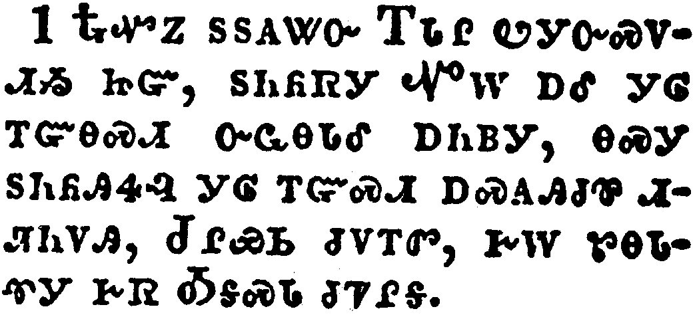</a></td>
</tr>
<tr class="even">
<td>And when it was determined that we should sail into Italy, they delivered Paul and certain other prisoners unto one named Julius, a centurion of Augustus' band.</td>
</tr>
<tr class="odd">
<td>ᎿᎭᏉᏃ ᏚᏚᎪᏔᏅ ᎢᏓᎵ ᏭᎩᏅᏍᏙᏗᏱ ᏥᏳ, ᏚᏂᏲᏒᎩ ᏉᎳ ᎠᎴ ᎩᎶ ᎢᏳᎾᏍᏗ ᏅᏩᎾᏓᎴ ᎠᏂᏴᎩ, ᎾᏍᎩ ᏚᏂᏲᎯᏎᎸ ᎩᎶ ᎢᏳᏍᏗ ᎠᏍᎪᎯᏧᏈ ᏗᏘᏂᏙᎯ, ᏧᎵᏯᏏ ᏧᏙᎢᏛ, ᎨᎳ ᏑᎾᏓᏡᎩ ᎨᏒ ᎣᎦᏍᏓ ᏧᏤᎵᎦ.</td>
</tr>
<tr class="even">
<td>Hna-quo-no du-du-go-ta-nv I-da-li wu-gi-nv-s-do-di-yi tsi-yu, du-ni-yo-sv-gi Quo-la a-le gi-lo i-yu-na-s-di nv-wa-na-da-le a-ni-yv-gi, na-s-gi du-ni-yo-hi-se-lv gi-lo i-yu-s-di a-s-go-hi-tsu-qui di-ti-ni-do-hi, Tsu-li-ya-si tsu-do-i-dv, ge-la su-na-da-tlu-gi ge-sv O-ga-s-da tsu-tse-li-ga.</td>
</tr>
</tbody>
</table>

<table>
<tbody>
<tr class="odd">
<td><a href="052702.png">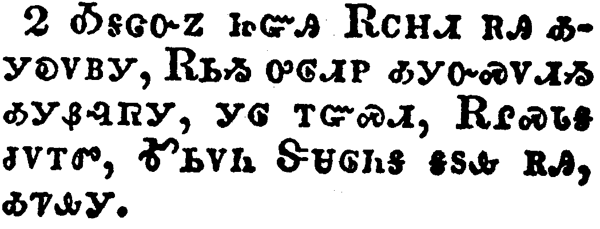</a></td>
</tr>
<tr class="even">
<td>And entering into a ship of Adramyttium, we launched, meaning to sail by the coasts of Asia; one Aristarchus, a Macedonian of Thessalonica, being with us.</td>
</tr>
<tr class="odd">
<td>ᎣᎦᏣᏅᏃ ᏥᏳᎯ ᎡᏟᎻᏗ ᎡᎯ ᎣᎩᎧᏙᏴᎩ, ᎡᏏᏱ ᎤᎶᏗᏢ ᎣᎩᏅᏍᏙᏗᏱ ᎣᎩᏰᎸᏒᎩ, ᎩᎶ ᎢᏳᏍᏗ, ᎡᎵᏍᏓᎦ ᏧᏙᎢᏛ, ᎹᏏᏙᏂ ᏕᏌᎶᏂᎦ ᎦᏚᎲ ᎡᎯ, ᎣᏤᎲᎩ.</td>
</tr>
<tr class="even">
<td>O-ga-tsa-nv-no tsi-yu-hi E-tli-mi-di e-hi o-gi-ka-do-yv-gi, E-si-yi u-lo-di-tlv o-gi-nv-s-do-di-yi o-gi-ye-lv-sv-gi, gi-lo i-yu-s-di, E-li-s-da-ga tsu-do-i-dv, Ma-si-do-ni De-sa-lo-ni-ga ga-du-hv e-hi, o-tse-hv-gi.</td>
</tr>
</tbody>
</table>

<table>
<tbody>
<tr class="odd">
<td><a href="052703.png">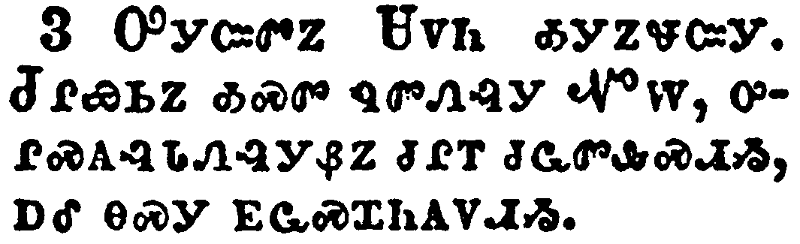</a></td>
</tr>
<tr class="even">
<td>And the next day we touched at Sidon. And Julius courteously entreated Paul, and gave him liberty to go unto his friends to refresh himself.</td>
</tr>
<tr class="odd">
<td>ᎤᎩᏨᏛᏃ ᏌᏙᏂ ᎣᎩᏃᏠᏨᎩ. ᏧᎵᏯᏏᏃ ᎣᏍᏛ ᏄᏛᏁᎸᎩ ᏉᎳ, ᎤᎵᏍᎪᎸᏓᏁᎸᎩᏰᏃ ᏧᎵᎢ ᏧᏩᏛᎲᏍᏗᏱ, ᎠᎴ ᎾᏍᎩ ᎬᏩᏍᏆᏂᎪᏙᏗᏱ.</td>
</tr>
<tr class="even">
<td>U-gi-tsv-dv-no Sa-do-ni o-gi-no-tlo-tsv-gi. Tsu-li-ya-si-no o-s-dv nu-dv-ne-lv-gi Quo-la, u-li-s-go-lv-da-ne-lv-gi-ye-no tsu-li-i tsu-wa-dv-hv-s-di-yi, a-le na-s-gi gv-wa-s-qua-ni-go-do-di-yi.</td>
</tr>
</tbody>
</table>

<table>
<tbody>
<tr class="odd">
<td><a href="052704.png">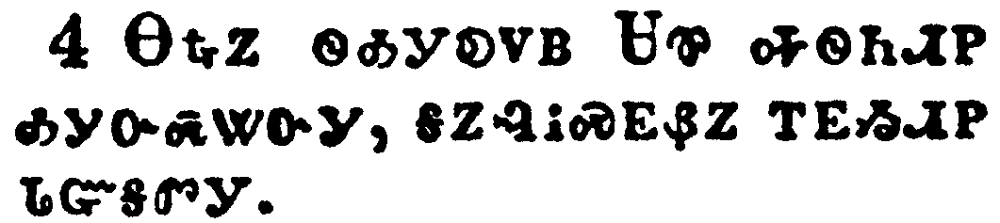</a></td>
</tr>
<tr class="even">
<td>And when we had launched from thence, we sailed under Cyprus, because the winds were contrary.</td>
</tr>
<tr class="odd">
<td>ᎾᎿᎭᏃ ᏫᎣᎩᎧᏙᏴ ᏌᏈ ᎭᏫᏂᏗᏢ ᎣᎩᏅᏍᏔᏅᎩ, ᎦᏃᎸᎥᏍᎬᏰᏃ ᎢᎬᏱᏗᏢ ᏓᏳᎦᏛᎩ.</td>
</tr>
<tr class="even">
<td>Na-hna-no wi-o-gi-ka-do-yv Sa-qui ha-wi-ni-di-tlv o-gi-nv-s-ta-nv-gi, ga-no-lv-v-s-gv-ye-no i-gv-yi-di-tlv da-yu-ga-dv-gi.</td>
</tr>
</tbody>
</table>

<table>
<tbody>
<tr class="odd">
<td><a href="052705.png">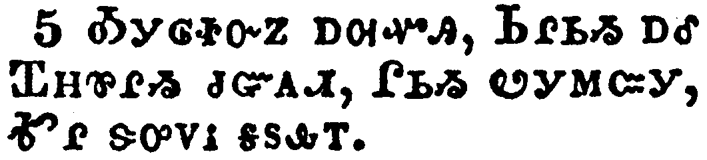</a></td>
</tr>
<tr class="even">
<td>And when we had sailed over the sea of Cilicia and Pamphylia, we came to Myra, a city of Lycia.</td>
</tr>
<tr class="odd">
<td>ᎣᎩᎶᏐᏅᏃ ᎠᎺᏉᎯ, ᏏᎵᏏᏱ ᎠᎴ ᏆᎻᏈᎵᏱ ᏧᏳᎪᏗ, ᎵᏏᏱ ᏬᎩᎷᏨᎩ, ᎹᎵ ᏕᎤᏙᎥ ᎦᏚᎲᎢ.</td>
</tr>
<tr class="even">
<td>O-gi-lo-so-nv-no a-me-quo-hi, Si-li-si-yi a-le Qua-mi-qui-li-yi tsu-yu-go-di, Li-si-yi wo-gi-lu-tsv-gi, Ma-li de-u-do-v ga-du-hv-i.</td>
</tr>
</tbody>
</table>

<table>
<tbody>
<tr class="odd">
<td><a href="052706.png">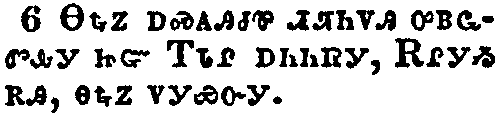</a></td>
</tr>
<tr class="even">
<td>And there the centurion found a ship of Alexandria sailing into Italy; and he put us therein.</td>
</tr>
<tr class="odd">
<td>ᎾᎿᎭᏃ ᎠᏍᎪᎯᏧᏈ ᏗᏘᏂᏙᎯ ᎤᏴᏩᏛᎲᎩ ᏥᏳ ᎢᏓᎵ ᎠᏂᏂᏒᎩ, ᎡᎵᎩᏱ ᎡᎯ, ᎾᎿᎭᏃ ᏙᎩᏯᏅᎩ.</td>
</tr>
<tr class="even">
<td>Na-hna-no a-s-go-hi-tsu-qui di-ti-ni-do-hi u-yv-wa-dv-hv-gi tsi-yu I-da-li a-ni-ni-sv-gi, E-li-gi-yi e-hi, na-hna-no do-gi-ya-nv-gi.</td>
</tr>
</tbody>
</table>

<table>
<tbody>
<tr class="odd">
<td><a href="052707.png">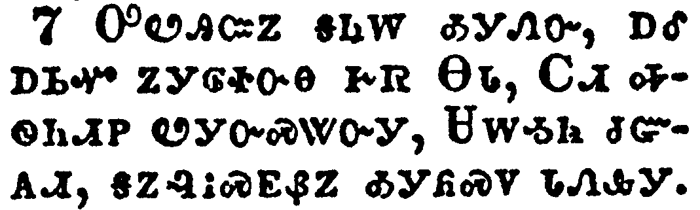</a></td>
</tr>
<tr class="even">
<td>And when we had sailed slowly many days, and scarce were come over against Cnidus, the wind not suffering us, we sailed under Crete, over against Salmone;</td>
</tr>
<tr class="odd">
<td>ᎤᏬᎯᏨᏃ ᎦᏂᎳ ᎣᎩᏁᏅ, ᎠᎴ ᎠᏏᏉ ᏃᎩᎶᏐᏅᎾ ᎨᏒ ᎾᏓ, ᏟᏗ ᎭᏫᏂᏗᏢ ᏬᎩᏅᏍᏔᏅᎩ, ᏌᎳᎼᏂ ᏧᏳᎪᏗ, ᎦᏃᎸᎥᏍᎬᏰᏃ ᎣᎩᏲᏍᏙ ᏓᏁᎲᎩ.</td>
</tr>
<tr class="even">
<td>U-wo-hi-tsv-no ga-ni-la o-gi-ne-nv, a-le a-si-quo no-gi-lo-so-nv-na ge-sv Na-da, Tli-di ha-wi-ni-di-tlv wo-gi-nv-s-ta-nv-gi, Sa-la-mo-ni tsu-yu-go-di, ga-no-lv-v-s-gv-ye-no o-gi-yo-s-do da-ne-hv-gi.</td>
</tr>
</tbody>
</table>

<table>
<tbody>
<tr class="odd">
<td><a href="052708.png">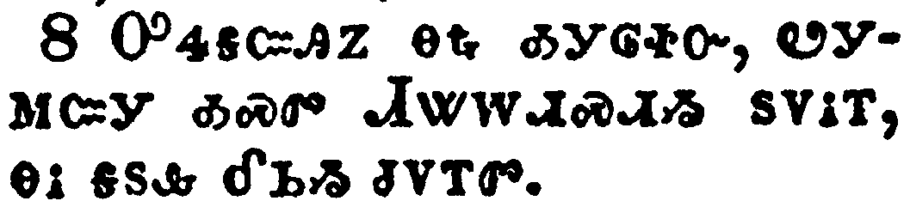</a></td>
</tr>
<tr class="even">
<td>And, hardly passing it, came unto a place which is called The fair havens; nigh whereunto was the city of Lasea.</td>
</tr>
<tr class="odd">
<td>ᎤᏎᎦᏨᎯᏃ ᎾᎿᎭᎣᎩᎶᏐᏅ, ᏬᎩᎷᏨᎩ ᎣᏍᏛ ᏗᏔᎳᏗᏍᏗᏱ ᏚᏙᎥᎢ, ᎾᎥ ᎦᏚᎲ ᎴᏏᏱ ᏧᏙᎢᏛ.</td>
</tr>
<tr class="even">
<td>U-se-ga-tsv-hi-no na-hna o-gi-lo-so-nv, wo-gi-lu-tsv-gi o-s-dv Di-ta-la-di-s-di-yi du-do-v-i, na-v ga-du-hv Le-si-yi tsu-do-i-dv.</td>
</tr>
</tbody>
</table>

<table>
<tbody>
<tr class="odd">
<td><a href="052709.png">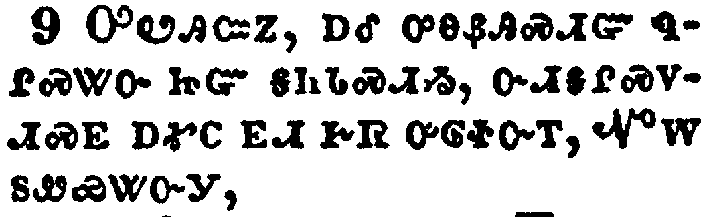</a></td>
</tr>
<tr class="even">
<td>Now when much time was spent, and when sailing was now dangerous, because the fast was now already past, Paul admonished them,</td>
</tr>
<tr class="odd">
<td>ᎤᏬᎯᏨᏃ, ᎠᎴ ᎤᎾᏰᎯᏍᏗᏳ ᏄᎵᏍᏔᏅ ᏥᏳ ᎦᏂᏓᏍᏗᏱ, ᏅᏗᎦᎵᏍᏙᏗᏍᎬ ᎠᎹᏟ ᎬᏗ ᎨᏒ ᎤᎶᏐᏅᎢ, ᏉᎳ ᏚᏪᏯᏔᏅᎩ,</td>
</tr>
<tr class="even">
<td>U-wo-hi-tsv-no, a-le u-na-ye-hi-s-di-yu nu-li-s-ta-nv tsi-yu ga-ni-da-s-di-yi, nv-di-ga-li-s-do-di-s-gv a-ma-tli gv-di ge-sv u-lo-so-nv-i, Quo-la du-we-ya-ta-nv-gi,</td>
</tr>
</tbody>
</table>

<table>
<tbody>
<tr class="odd">
<td><a href="052710.png">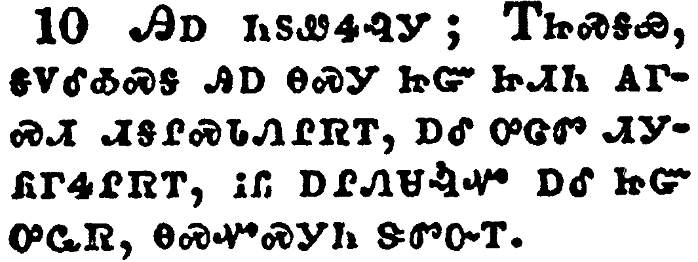</a></td>
</tr>
<tr class="even">
<td>And said unto them, Sirs, I perceive that this voyage will be with hurt and much damage, not only of the lading and ship, but also of our lives.</td>
</tr>
<tr class="odd">
<td>ᎯᎠ ᏂᏚᏪᏎᎸᎩ; ᎢᏥᏍᎦᏯ, ᎦᏙᎴᎣᏍᎦ ᎯᎠ ᎾᏍᎩ ᏥᏳ ᏥᏗᏂ ᎪᎱᏍᏗ ᏗᎦᎵᏍᏓᏁᎵᏒᎢ, ᎠᎴ ᎤᏣᏛ ᏗᎩᏲᎱᏎᎵᏒᎢ, ᎥᏝ ᎠᎵᏁᏌᎸᏉ ᎠᎴ ᏥᏳ ᎤᏩᏒ, ᎾᏍᏉᏍᎩᏂ ᏕᏛᏅᎢ.</td>
</tr>
<tr class="even">
<td>Hi-a ni-du-we-se-lv-gi; I-tsi-s-ga-ya, ga-do-le-o-s-ga hi-a na-s-gi tsi-yu tsi-di-ni go-hu-s-di di-ga-li-s-da-ne-li-sv-i, a-le u-tsa-dv di-gi-yo-hu-se-li-sv-i, v-tla a-li-ne-sa-lv-quo a-le tsi-yu u-wa-sv, na-s-quo-s-gi-ni de-dv-nv-i.</td>
</tr>
</tbody>
</table>

<table>
<tbody>
<tr class="odd">
<td><a href="052711.png">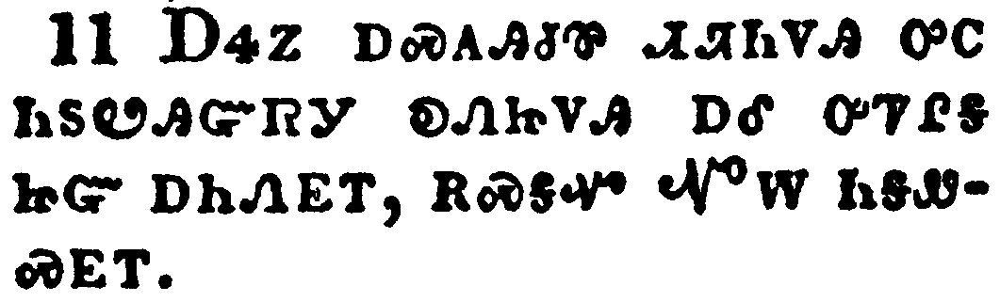</a></td>
</tr>
<tr class="even">
<td>Nevertheless the centurion believed the master and the owner of the ship, more than those things which were spoken by Paul.</td>
</tr>
<tr class="odd">
<td>ᎠᏎᏃ ᎠᏍᎪᎯᏧᏈ ᏗᏘᏂᏙᎯ ᎤᏟ ᏂᏚᏬᎯᏳᏒᎩ ᎧᏁᏥᏙᎯ ᎠᎴ ᎤᏤᎵᎦ ᏥᏳ ᎠᏂᏁᎬᎢ, ᎡᏍᎦᏉ ᏉᎳ ᏂᎦᏪᏍᎬᎢ.</td>
</tr>
<tr class="even">
<td>A-se-no a-s-go-hi-tsu-qui di-ti-ni-do-hi u-tli ni-du-wo-hi-yu-sv-gi ka-ne-tsi-do-hi a-le u-tse-li-ga tsi-yu a-ni-ne-gv-i, e-s-ga-quo Quo-la ni-ga-we-s-gv-i.</td>
</tr>
</tbody>
</table>

<table>
<tbody>
<tr class="odd">
<td><a href="052712.png">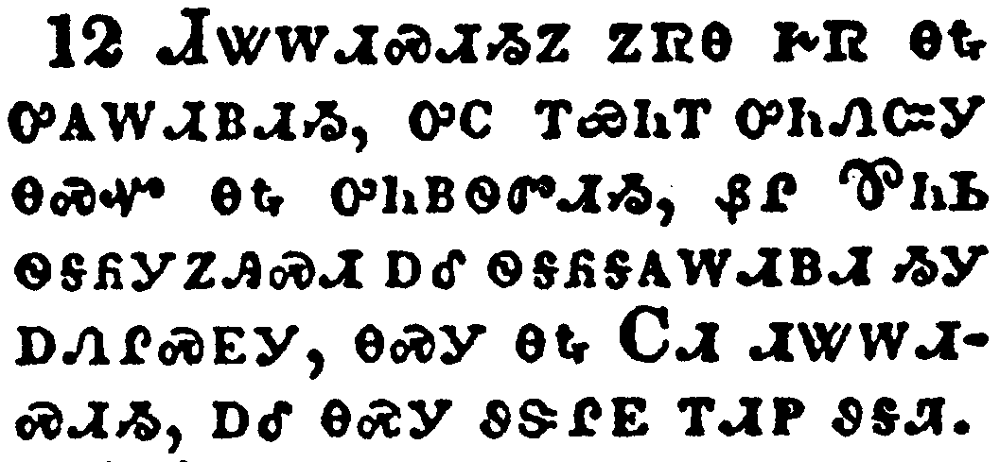</a></td>
</tr>
<tr class="even">
<td>And because the haven was not commodious to winter in, the more part advised to depart thence also, if by any means they might attain to Phenice, and there to winter; which is an haven of Crete, and lieth toward the south west and north west.</td>
</tr>
<tr class="odd">
<td>ᏗᏔᎳᏗᏍᏗᏱᏃ ᏃᏒᎾ ᎨᏒ ᎾᎿᎭᎤᎪᎳᏗᏴᏗᏱ, ᎤᏟ ᎢᏯᏂᎢ ᎤᏂᏁᏨᎩ ᎾᏍᏉ ᎾᎿᎭᎤᏂᏴᏫᏛᏗᏱ, ᏰᎵ ᏈᏂᏏ ᏫᎦᏲᎩᏃᎯᏍᏗ ᎠᎴ ᏫᎦᏲᎦᎪᎳᏗᏴᏗ ᏱᎩ ᎠᏁᎵᏍᎬᎩ, ᎾᏍᎩ ᎾᎿᎭᏟᏗ ᏗᏔᎳᏗᏍᏗᏱ, ᎠᎴ ᎾᏍᎩ ᏭᏕᎵᎬ ᎢᏗᏢ ᏭᎦᏘ.</td>
</tr>
<tr class="even">
<td>Di-ta-la-di-s-di-yi-no no-sv-na ge-sv na-hna u-go-la-di-yv-di-yi, u-tli i-ya-ni-i u-ni-ne-tsv-gi na-s-quo na-hna u-ni-yv-wi-dv-di-yi, ye-li Qui-ni-si wi-ga-yo-gi-no-hi-s-di a-le wi-ga-yo-ga-go-la-di-yv-di yi-gi a-ne-li-s-gv-gi, na-s-gi na-hna Tli-di di-ta-la-di-s-di-yi, a-le na-s-gi wu-de-li-gv i-di-tlv wu-ga-ti.</td>
</tr>
</tbody>
</table>

<table>
<tbody>
<tr class="odd">
<td><a href="052713.png">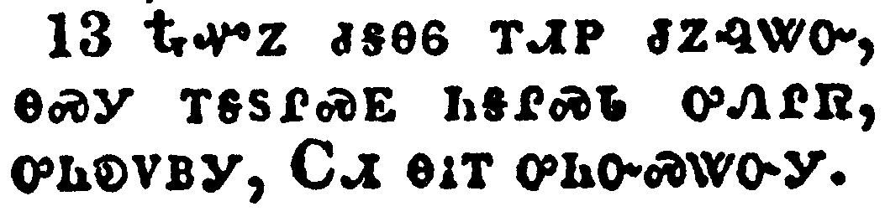</a></td>
</tr>
<tr class="even">
<td>And when the south wind blew softly, supposing that they had obtained their purpose, loosing thence, they sailed close by Crete.</td>
</tr>
<tr class="odd">
<td>ᎿᎭᏉᏃ ᏧᎦᎾᏮ ᎢᏗᏢ ᏧᏃᎸᏔᏅ, ᎾᏍᎩ ᎢᎦᏚᎵᏍᎬ ᏂᎦᎵᏍᏓ ᎤᏁᎵᏒ, ᎤᏂᎧᏙᏴᎩ, ᏟᏗ ᎾᎥᎢ ᎤᏂᏅᏍᏔᏅᎩ.</td>
</tr>
<tr class="even">
<td>Hna-quo-no tsu-ga-na-wv i-di-tlv tsu-no-lv-ta-nv, na-s-gi i-ga-du-li-s-gv ni-ga-li-s-da u-ne-li-sv, u-ni-ka-do-yv-gi, Tli-di na-v-i u-ni-nv-s-ta-nv-gi.</td>
</tr>
</tbody>
</table>

<table>
<tbody>
<tr class="odd">
<td><a href="052714.png">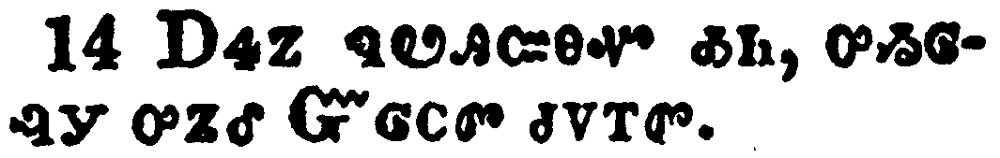</a></td>
</tr>
<tr class="even">
<td>But not long after there arose against it a tempestuous wind, called Euroclydon.</td>
</tr>
<tr class="odd">
<td>ᎠᏎᏃ ᏄᏬᎯᏨᎾᏉ ᎣᏂ, ᎤᏱᎶᎸᎩ ᎤᏃᎴ ᏳᎶᏟᏛ ᏧᏙᎢᏛ.</td>
</tr>
<tr class="even">
<td>A-se-no nu-wo-hi-tsv-na-quo o-ni, u-yi-lo-lv-gi u-no-le Yu-lo-tli-dv tsu-do-i-dv.</td>
</tr>
</tbody>
</table>

<table>
<tbody>
<tr class="odd">
<td><a href="052715.png">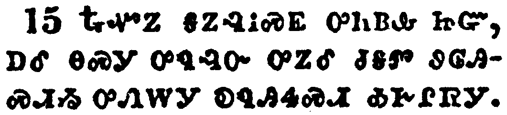</a></td>
</tr>
<tr class="even">
<td>And when the ship was caught, and could not bear up into the wind, we let her drive.</td>
</tr>
<tr class="odd">
<td>ᎿᎭᏉᏃ ᎦᏃᎸᎥᏍᎬ ᎤᏂᏴᎲ ᏥᏳ, ᎠᎴ ᎾᏍᎩ ᎤᏄᎸᏅ ᎤᏃᎴ ᏧᎦᏛ ᏭᎶᎯᏍᏗᏱ ᎤᏁᎳᎩ ᎧᏄᎯᏎᏍᏗ ᎣᎨᎵᏒᎩ.</td>
</tr>
<tr class="even">
<td>Hna-quo-no ga-no-lv-v-s-gv u-ni-yv-hv tsi-yu, a-le na-s-gi u-nu-lv-nv u-no-le tsu-ga-dv wu-lo-hi-s-di-yi u-ne-la-gi ka-nu-hi-se-s-di o-ge-li-sv-gi.</td>
</tr>
</tbody>
</table>

<table>
<tbody>
<tr class="odd">
<td><a href="052716.png">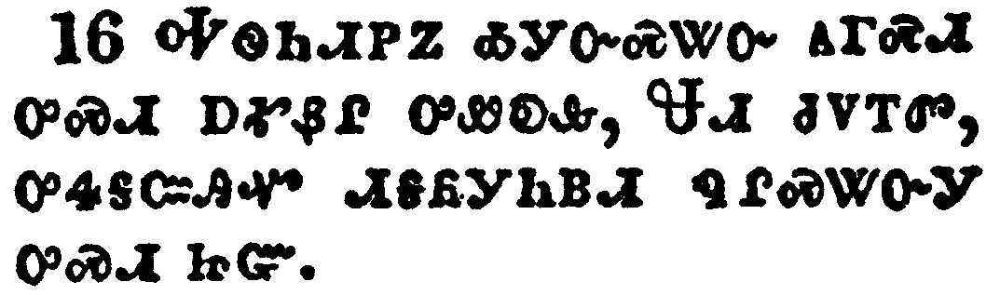</a></td>
</tr>
<tr class="even">
<td>And running under a certain island which is called Clauda, we had much work to come by the boat:</td>
</tr>
<tr class="odd">
<td>ᎭᏫᏂᏗᏢᏃ ᎣᎩᏅᏍᏔᏅ ᎪᎱᏍᏗ ᎤᏍᏗ ᎠᎹᏰᎵ ᎤᏪᎧᎲ, ᏠᏗ ᏧᏙᎢᏛ, ᎤᏎᎦᏨᎯᏉ ᏗᎦᏲᎩᏂᏴᏗ ᏄᎵᏍᏔᏅᎩ ᎤᏍᏗ ᏥᏳ.</td>
</tr>
<tr class="even">
<td>Ha-wi-ni-di-tlv-no o-gi-nv-s-ta-nv go-hu-s-di u-s-di a-ma-ye-li u-we-ka-hv, Tlo-di tsu-do-i-dv, u-se-ga-tsv-hi-quo di-ga-yo-gi-ni-yv-di nu-li-s-ta-nv-gi u-s-di tsi-yu.</td>
</tr>
</tbody>
</table>

<table>
<tbody>
<tr class="odd">
<td><a href="052717.png">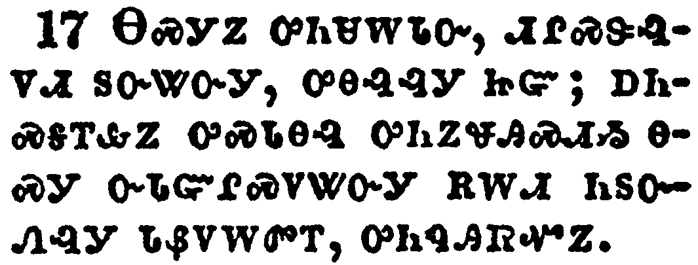</a></td>
</tr>
<tr class="even">
<td>Which when they had taken up, they used helps, undergirding the ship; and, fearing lest they should fall into the quicksands, strake sail, and so were driven.</td>
</tr>
<tr class="odd">
<td>ᎾᏍᎩᏃ ᎤᏂᏌᎳᏓᏅ, ᏗᎵᏍᏕᎸᏙᏗ ᏚᏅᏔᏅᎩ, ᎤᎾᎸᎸᎩ ᏥᏳ; ᎠᏂᏍᎦᎢᎲᏃ ᎤᏍᏓᎾᎸ ᎤᏂᏃᏠᎯᏍᏗᏱ ᎾᏍᎩ ᏅᏓᏳᎵᏍᏙᏔᏅᎩ ᎡᎳᏗ ᏂᏚᏅᏁᎸᎩ ᏓᏰᏙᎳᏛᎢ, ᎤᏂᏄᎯᏒᏉᏃ.</td>
</tr>
<tr class="even">
<td>Na-s-gi-no u-ni-sa-la-da-nv, di-li-s-de-lv-do-di du-nv-ta-nv-gi, u-na-lv-lv-gi tsi-yu; a-ni-s-ga-i-hv-no u-s-da-na-lv u-ni-no-tlo-hi-s-di-yi na-s-gi nv-da-yu-li-s-do-ta-nv-gi e-la-di ni-du-nv-ne-lv-gi da-ye-do-la-dv-i, u-ni-nu-hi-sv-quo-no.</td>
</tr>
</tbody>
</table>

<table>
<tbody>
<tr class="odd">
<td><a href="052718.png">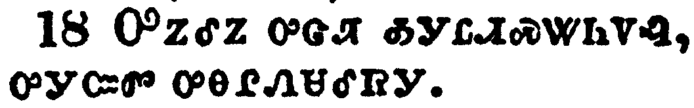</a></td>
</tr>
<tr class="even">
<td>And we being exceedingly tossed with a tempest, the next day they lightened the ship;</td>
</tr>
<tr class="odd">
<td>ᎤᏃᎴᏃ ᎤᏣᏘ ᎣᎩᏝᏗᏍᏔᏂᏙᎸ, ᎤᎩᏨᏛ ᎤᎾᎵᏁᏌᎴᏒᎩ.</td>
</tr>
<tr class="even">
<td>U-no-le-no u-tsa-ti o-gi-tla-di-s-ta-ni-do-lv, u-gi-tsv-dv u-na-li-ne-sa-le-sv-gi.</td>
</tr>
</tbody>
</table>

<table>
<tbody>
<tr class="odd">
<td></td>
</tr>
<tr class="even">
<td>And the third day we cast out with our own hands the tackling of the ship.</td>
</tr>
<tr class="odd">
<td>ᏦᎢᏁᏃ ᎢᎦ ᎣᎬᏒ ᏦᎪᏰᏂ ᏙᎬᏔᏅᎩ, ᎣᎦᏘᏅᏒᎩ ᎤᏤᎵᎦᏯ ᎤᎵᏁᏌᎸ ᏥᏳ.</td>
</tr>
<tr class="even">
<td>Tso-i-ne-no i-ga o-gv-sv tso-go-ye-ni do-gv-ta-nv-gi, o-ga-ti-nv-sv-gi u-tse-li-ga-ya u-li-ne-sa-lv tsi-yu.</td>
</tr>
</tbody>
</table>

<table>
<tbody>
<tr class="odd">
<td><a href="052720.png">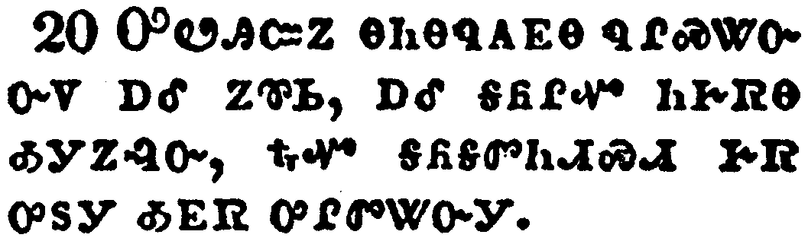</a></td>
</tr>
<tr class="even">
<td>And when neither sun nor stars in many days appeared, and no small tempest lay on us, all hope that we should be saved was then taken away.</td>
</tr>
<tr class="odd">
<td>ᎤᏬᎯᏨᏃ ᎾᏂᎾᏄᎪᎬᎾ ᏄᎵᏍᏔᏅ ᏅᏙ ᎠᎴ ᏃᏈᏏ, ᎠᎴ ᎦᏲᎵᏉ ᏂᎨᏒᎾ ᎣᎩᏃᎸᏅ, ᎿᎭᏉ ᎦᏲᎦᏛᏂᏗᏍᏗ ᎨᏒ ᎤᏚᎩ ᎣᎬᏒ ᎤᎵᏛᏔᏅᎩ.</td>
</tr>
<tr class="even">
<td>U-wo-hi-tsv-no na-ni-na-nu-go-gv-na nu-li-s-ta-nv nv-do a-le no-qui-si, a-le ga-yo-li-quo ni-ge-sv-na o-gi-no-lv-nv, hna-quo ga-yo-ga-dv-ni-di-s-di ge-sv u-du-gi o-gv-sv u-li-dv-ta-nv-gi.</td>
</tr>
</tbody>
</table>

<table>
<tbody>
<tr class="odd">
<td><a href="052721.png">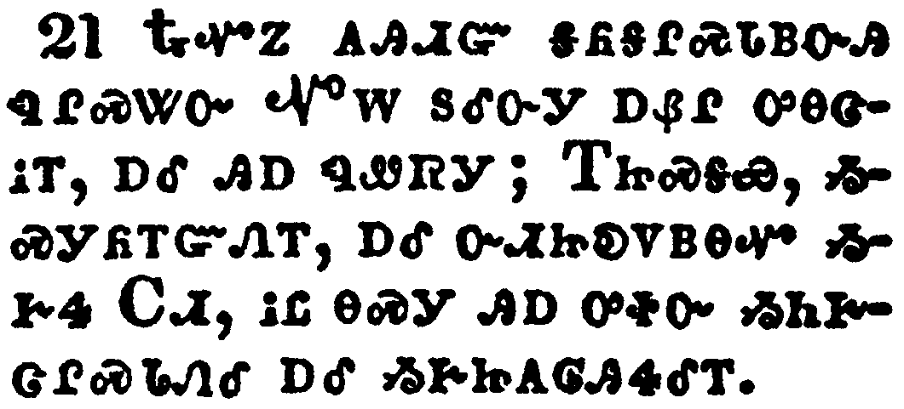</a></td>
</tr>
<tr class="even">
<td>But after long abstinence Paul stood forth in the midst of them, and said, Sirs, ye should have hearkened unto me, and not have loosed from Crete, and to have gained this harm and loss.</td>
</tr>
<tr class="odd">
<td>ᎿᎭᏉᏃ ᎪᎯᏗᏳ ᎦᏲᎦᎵᏍᏓᏴᏅᎯ ᏄᎵᏍᏔᏅ ᏉᎳ ᏚᎴᏅᎩ ᎠᏰᎵ ᎤᎾᏣᎥᎢ, ᎠᎴ ᎯᎠ ᏄᏪᏒᎩ; ᎢᏥᏍᎦᏯ, ᏱᏍᎩᏲᎢᏳᏁᎢ, ᎠᎴ ᏅᏗᏥᎧᏙᏴᎾᏉ ᏱᎨᏎ ᏟᏗ, ᎥᏝ ᎾᏍᎩ ᎯᎠ ᎤᏐᏅ ᏱᏂᎨᏣᎵᏍᏓᏁᎴ ᎠᎴ ᏱᎨᏥᎪᎶᎯᏎᎴᎢ.</td>
</tr>
<tr class="even">
<td>Hna-quo-no go-hi-di-yu ga-yo-ga-li-s-da-yv-nv-hi nu-li-s-ta-nv Quo-la du-le-nv-gi a-ye-li u-na-tsa-v-i, a-le hi-a nu-we-sv-gi; I-tsi-s-ga-ya, yi-s-gi-yo-i-yu-ne-i, a-le nv-di-tsi-ka-do-yv-na-quo yi-ge-se Tli-di, v-tla na-s-gi hi-a u-so-nv yi-ni-ge-tsa-li-s-da-ne-le a-le yi-ge-tsi-go-lo-hi-se-le-i.</td>
</tr>
</tbody>
</table>

<table>
<tbody>
<tr class="odd">
<td><a href="052722.png">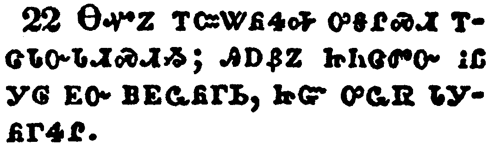</a></td>
</tr>
<tr class="even">
<td>And now I exhort you to be of good cheer: for there shall be no loss of any man's life among you, but of the ship.</td>
</tr>
<tr class="odd">
<td>ᎾᏉᏃ ᎢᏨᏔᏲᏎᎭ ᎤᎦᎵᏍᏗ ᎢᏣᏓᏅᏓᏗᏍᏗᏱ; ᎯᎠᏰᏃ ᏥᏂᏣᏛᏅ ᎥᏝ ᎩᎶᎬᏅ ᏴᎬᏩᏲᎱᏏ, ᏥᏳ ᎤᏩᏒ ᏓᎩᏲᎱᏎᎵ.</td>
</tr>
<tr class="even">
<td>na-quo-no i-tsv-ta-yo-se-ha u-ga-li-s-di i-tsa-da-nv-da-di-s-di-yi; hi-a-ye-no tsi-ni-tsa-dv-nv v-tla gi-lo-gv-nv yv-gv-wa-yo-hu-si, tsi-yu u-wa-sv da-gi-yo-hu-se-li.</td>
</tr>
</tbody>
</table>

<table>
<tbody>
<tr class="odd">
<td><a href="052723.png">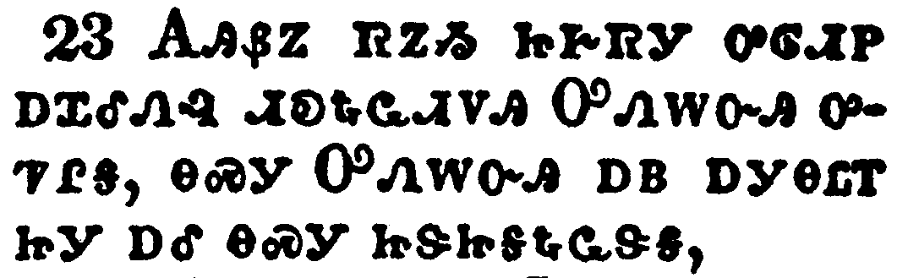</a></td>
</tr>
<tr class="even">
<td>For there stood by me this night the angel of God, whose I am, and whom I serve,</td>
</tr>
<tr class="odd">
<td>ᎪᎯᏰᏃ ᏒᏃᏱ ᏥᎨᏒᎩ ᎤᎶᏗᏢ ᎠᏆᎴᏁᎸ ᏗᎧᎿᎭᏩᏗᏙᎯ ᎤᏁᎳᏅᎯ ᎤᏤᎵᎦ, ᎾᏍᎩ ᎤᏁᎳᏅᎯ ᎠᏴ ᎠᎩᎾᏝᎢ ᏥᎩ ᎠᎴ ᎾᏍᎩ ᏥᏕᏥᎦᎿᎭᏩᏕᎦ,</td>
</tr>
<tr class="even">
<td>Go-hi-ye-no sv-no-yi tsi-ge-sv-gi u-lo-di-tlv a-qua-le-ne-lv di-ka-hna-wa-di-do-hi U-ne-la-nv-hi u-tse-li-ga, na-s-gi U-ne-la-nv-hi a-yv a-gi-na-tla-i tsi-gi a-le na-s-gi tsi-de-tsi-ga-hna-wa-de-ga,</td>
</tr>
</tbody>
</table>

<table>
<tbody>
<tr class="odd">
<td><a href="052724.png">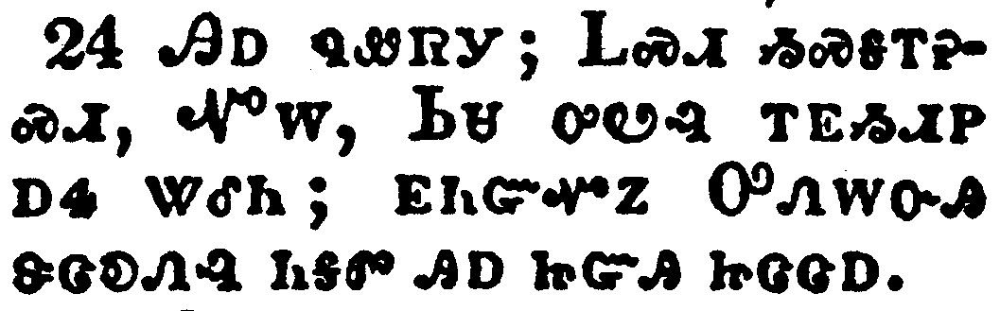</a></td>
</tr>
<tr class="even">
<td>Saying, Fear not, Paul; thou must be brought before Caesar: and, lo, God hath given thee all them that sail with thee.</td>
</tr>
<tr class="odd">
<td>ᎯᎠ ᏄᏪᏒᎩ; ᏞᏍᏗ ᏱᏍᎦᎢᎮᏍᏗ, ᏉᎳ, ᏏᏌ ᎤᏬᎸ ᎢᎬᏱᏗᏢ ᎠᏎ ᏔᎴᏂ; ᎬᏂᏳᏉᏃ ᎤᏁᎳᏅᎯ ᎦᏣᎧᏁᎸ ᏂᎦᏛ ᏥᏳᎯ ᏥᏣᏣᎠ.</td>
</tr>
<tr class="even">
<td>Hi-a nu-we-sv-gi; Tle-s-di yi-s-ga-i-he-s-di, Quo-la, Si-sa u-wo-lv i-gv-yi-di-tlv a-se ta-le-ni; gv-ni-yu-quo-no U-ne-la-nv-hi ga-tsa-ka-ne-lv ni-ga-dv tsi-yu-hi tsi-tsa-tsa-a.</td>
</tr>
</tbody>
</table>

<table>
<tbody>
<tr class="odd">
<td><a href="052725.png">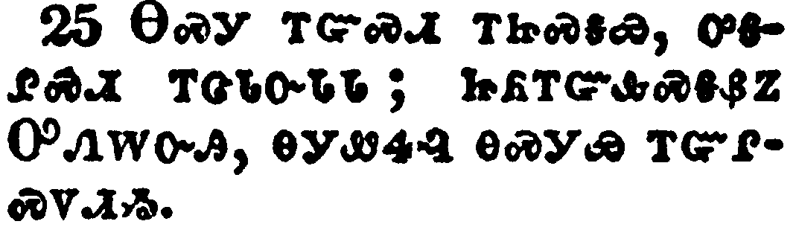</a></td>
</tr>
<tr class="even">
<td>Wherefore, sirs, be of good cheer: for I believe God, that it shall be even as it was told me.</td>
</tr>
<tr class="odd">
<td>ᎾᏍᎩ ᎢᏳᏍᏗ ᎢᏥᏍᎦᏯ, ᎤᎦᎵᏍᏗ ᎢᏣᏓᏅᏓᏓ; ᏥᏲᎢᏳᎲᏍᎦᏰᏃ ᎤᏁᎳᏅᎯ, ᎾᎩᏪᏎᎸ ᎾᏍᎩᏯ ᎢᏳᎵᏍᏙᏗᏱ.</td>
</tr>
<tr class="even">
<td>Na-s-gi i-yu-s-di i-tsi-s-ga-ya, u-ga-li-s-di i-tsa-da-nv-da-da; tsi-yo-i-yu-hv-s-ga-ye-no U-ne-la-nv-hi, na-gi-we-se-lv na-s-gi-ya i-yu-li-s-do-di-yi.</td>
</tr>
</tbody>
</table>

<table>
<tbody>
<tr class="odd">
<td><a href="052726.png">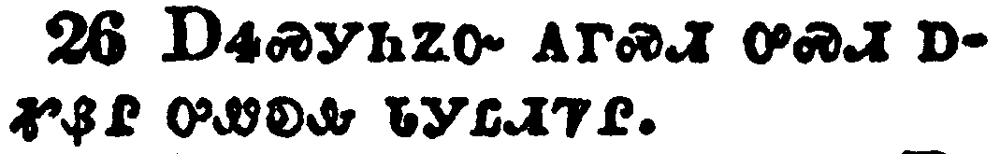</a></td>
</tr>
<tr class="even">
<td>Howbeit we must be cast upon a certain island.</td>
</tr>
<tr class="odd">
<td>ᎠᏎᏍᎩᏂᏃᏅ ᎪᎱᏍᏗ ᎤᏍᏗ ᎠᎹᏰᎵ ᎤᏪᎧᎲ ᏓᎩᏝᏗᏤᎵ.</td>
</tr>
<tr class="even">
<td>A-se-s-gi-ni-no-nv go-hu-s-di u-s-di a-ma-ye-li u-we-ka-hv da-gi-tla-di-tse-li.</td>
</tr>
</tbody>
</table>

<table>
<tbody>
<tr class="odd">
<td><a href="052727.png">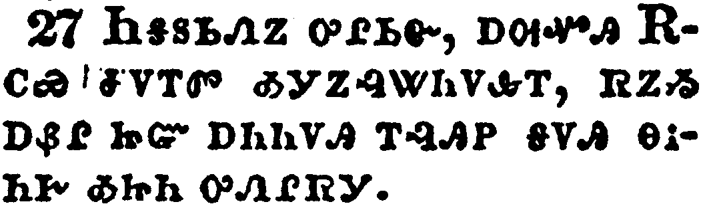</a></td>
</tr>
<tr class="even">
<td>But when the fourteenth night was come, as we were driven up and down in Adria, about midnight the shipmen deemed that they drew near to some country;</td>
</tr>
<tr class="odd">
<td>ᏂᎦᏚᏏᏁᏃ ᎤᎵᏏᏅ, ᎠᎺᏉᎯ ᎡᏟᏯ ᏧᏙᎢᏛ ᎣᎩᏃᎸᏔᏂᏙᎲᎢ, ᏒᏃᏱ ᎠᏰᎵ ᏥᏳ ᎠᏂᏂᏙᎯ ᎢᎸᎯᏢ ᎦᏙᎯ ᎾᎥᏂᎨ ᎣᏥᏂ ᎤᏁᎵᏒᎩ.</td>
</tr>
<tr class="even">
<td>Ni-ga-du-si-ne-no u-li-si-nv, a-me-quo-hi E-tli-ya tsu-do-i-dv o-gi-no-lv-ta-ni-do-hv-i, sv-no-yi a-ye-li tsi-yu a-ni-ni-do-hi i-lv-hi-tlv ga-do-hi na-v-ni-ge o-tsi-ni u-ne-li-sv-gi.</td>
</tr>
</tbody>
</table>

<table>
<tbody>
<tr class="odd">
<td><a href="052728.png">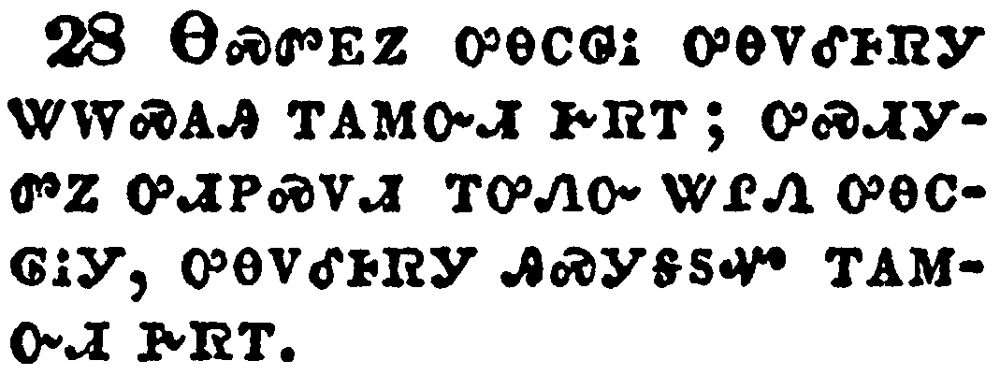</a></td>
</tr>
<tr class="even">
<td>And sounded, and found it twenty fathoms: and when they had gone a little further, they sounded again, and found it fifteen fathoms.</td>
</tr>
<tr class="odd">
<td>ᎾᏍᏛᎬᏃ ᎤᎾᏟᎶᎥ ᎤᎾᏙᎴᎰᏒᎩ ᏔᎳᏍᎪᎯ ᎢᎪᎷᏅᏗ ᎨᏒᎢ; ᎤᏍᏗᎩᏛᏃ ᎤᏗᏢᏍᏙᏗ ᎢᎤᏁᏅ ᏔᎵᏁ ᎤᎾᏟᎶᎥᎩ, ᎤᎾᏙᎴᎰᏒᎩ ᎯᏍᎩᎦᏚᏉ ᎢᎪᎷᏅᏗ ᎨᏒᎢ.</td>
</tr>
<tr class="even">
<td>Na-s-dv-gv-no u-na-tli-lo-v u-na-do-le-ho-sv-gi ta-la-s-go-hi i-go-lu-nv-di ge-sv-i; u-s-di-gi-dv-no u-di-tlv-s-do-di i-u-ne-nv ta-li-ne u-na-tli-lo-v-gi, u-na-do-le-ho-sv-gi hi-s-gi-ga-du-quo i-go-lu-nv-di ge-sv-i.</td>
</tr>
</tbody>
</table>

<table>
<tbody>
<tr class="odd">
<td><a href="052729.png">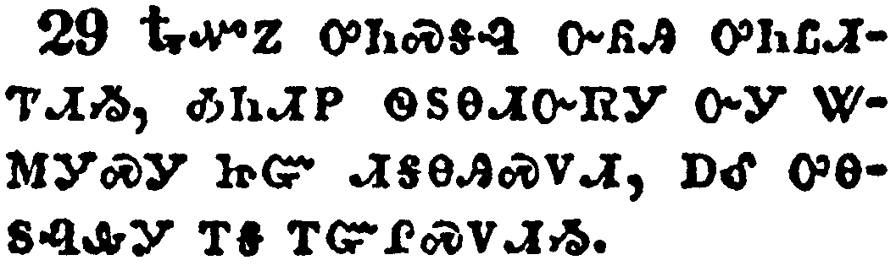</a></td>
</tr>
<tr class="even">
<td>Then fearing lest we should have fallen upon rocks, they cast four anchors out of the stern, and wished for the day.</td>
</tr>
<tr class="odd">
<td>ᎿᎭᏉᏃ ᎤᏂᏍᎦᎸ ᏅᏲᎯ ᎤᏂᏝᏗᏤᏗᏱ, ᎣᏂᏗᏢ ᏫᏚᎾᏗᏅᏒᎩ ᏅᎩ ᏔᎷᎩᏍᎩ ᏥᏳ ᏗᎦᎾᎯᏍᏙᏗ, ᎠᎴ ᎤᎾᏚᎸᎲᎩ ᎢᎦ ᎢᏳᎵᏍᏙᏗᏱ.</td>
</tr>
<tr class="even">
<td>Hna-quo-no u-ni-s-ga-lv nv-yo-hi u-ni-tla-di-tse-di-yi, o-ni-di-tlv wi-du-na-di-nv-sv-gi nv-gi ta-lu-gi-s-gi tsi-yu di-ga-na-hi-s-do-di, a-le u-na-du-lv-hv-gi i-ga i-yu-li-s-do-di-yi.</td>
</tr>
</tbody>
</table>

<table>
<tbody>
<tr class="odd">
<td><a href="052730.png">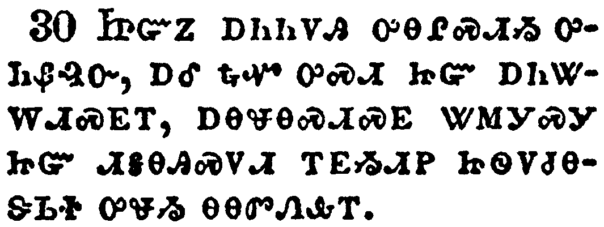</a></td>
</tr>
<tr class="even">
<td>And as the shipmen were about to flee out of the ship, when they had let down the boat into the sea, under colour as though they would have cast anchors out of the foreship,</td>
</tr>
<tr class="odd">
<td>ᏥᏳᏃ ᎠᏂᏂᏙᎯ ᎤᎾᎵᏍᏗᏱ ᎤᏂᏰᎸᏅ, ᎠᎴ ᎿᎭᏉ ᎤᏍᏗ ᏥᏳ ᎠᏂᏔᎳᏗᏍᎬᎢ, ᎠᎾᏠᎾᏍᏗᏍᎬ ᏔᎷᎩᏍᎩ ᏥᏳ ᏗᎦᎾᎯᏍᏙᏗ ᎢᎬᏴᏗᏢ ᏥᏫᏙᏧᎾᏕᏏᏐ ᎤᏠᏱ ᎾᎾᏛᏁᎲᎢ.</td>
</tr>
<tr class="even">
<td>Tsi-yu-no a-ni-ni-do-hi u-na-li-s-di-yi u-ni-ye-lv-nv, a-le hna-quo u-s-di tsi-yu a-ni-ta-la-di-s-gv-i, a-na-tlo-na-s-di-s-gv ta-lu-gi-s-gi tsi-yu di-ga-na-hi-s-do-di i-gv-yv-di-tlv tsi-wi-do-tsu-na-de-si-so u-tlo-yi na-na-dv-ne-hv-i.</td>
</tr>
</tbody>
</table>

<table>
<tbody>
<tr class="odd">
<td><a href="052731.png">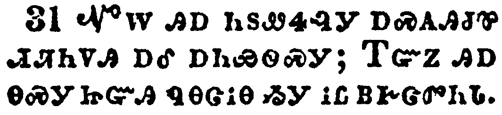</a></td>
</tr>
<tr class="even">
<td>Paul said to the centurion and to the soldiers, Except these abide in the ship, ye cannot be saved.</td>
</tr>
<tr class="odd">
<td>ᏉᎳ ᎯᎠ ᏂᏚᏪᏎᎸᎩ ᎠᏍᎪᎯᏧᏈ ᏗᏘᏂᏙᎯ ᎠᎴ ᎠᏂᏯᏫᏍᎩ; ᎢᏳᏃ ᎯᎠ ᎾᏍᎩ ᏥᏳᎯ ᏄᎾᏣᎥᎾ ᏱᎩ ᎥᏝ ᏴᎨᏣᏛᏂᏓ.</td>
</tr>
<tr class="even">
<td>Quo-la hi-a ni-du-we-se-lv-gi a-s-go-hi-tsu-qui di-ti-ni-do-hi a-le a-ni-ya-wi-s-gi; I-yu-no hi-a na-s-gi tsi-yu-hi nu-na-tsa-v-na yi-gi v-tla yv-ge-tsa-dv-ni-da.</td>
</tr>
</tbody>
</table>

<table>
<tbody>
<tr class="odd">
<td><a href="052732.png">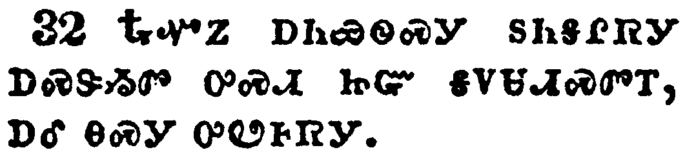</a></td>
</tr>
<tr class="even">
<td>Then the soldiers cut off the ropes of the boat, and let her fall off.</td>
</tr>
<tr class="odd">
<td>ᎿᎭᏉᏃ ᎠᏂᏯᏫᏍᎩ ᏚᏂᎦᎵᏒᎩ ᎠᏍᏕᏱᏛ ᎤᏍᏗ ᏥᏳ ᎦᏙᏌᏗᏍᏛᎢ, ᎠᎴ ᎾᏍᎩ ᎤᏬᎰᏒᎩ.</td>
</tr>
<tr class="even">
<td>Hna-quo-no a-ni-ya-wi-s-gi du-ni-ga-li-sv-gi a-s-de-yi-dv u-s-di tsi-yu ga-do-sa-di-s-dv-i, a-le na-s-gi u-wo-ho-sv-gi.</td>
</tr>
</tbody>
</table>

<table>
<tbody>
<tr class="odd">
<td></td>
</tr>
<tr class="even">
<td>And while the day was coming on, Paul besought them all to take meat, saying, This day is the fourteenth day that ye have tarried and continued fasting, having taken nothing.</td>
</tr>
<tr class="odd">
<td>ᎢᎦᏃ ᏅᏓᎦᎵᏍᏔᏂᏒᎩ, ᏉᎳ ᏚᏔᏲᏎᎸᎩ ᏂᎦᏛ ᎤᎾᎵᏍᏓᏴᏗᏱ, ᎯᎠ ᏄᏪᏒᎩ; ᎪᎯ ᎿᎭᏉ ᏂᎦᏚᏏᏁ ᎢᎦ ᏥᏥᎦᏘᏴ ᎠᎴ ᏂᏣᎵᏍᏓᏴᏍᎬᎾ ᎪᎱᏍᏗ ᏂᏥᎩᏍᎬᎾ ᏥᎩ.</td>
</tr>
<tr class="even">
<td>I-ga-no nv-da-ga-li-s-ta-ni-sv-gi, Quo-la du-ta-yo-se-lv-gi ni-ga-dv u-na-li-s-da-yv-di-yi, hi-a nu-we-sv-gi; Go-hi hna-quo ni-ga-du-si-ne i-ga tsi-tsi-ga-ti-yv a-le ni-tsa-li-s-da-yv-s-gv-na go-hu-s-di ni-tsi-gi-s-gv-na tsi-gi.</td>
</tr>
</tbody>
</table>

<table>
<tbody>
<tr class="odd">
<td><a href="052734.png">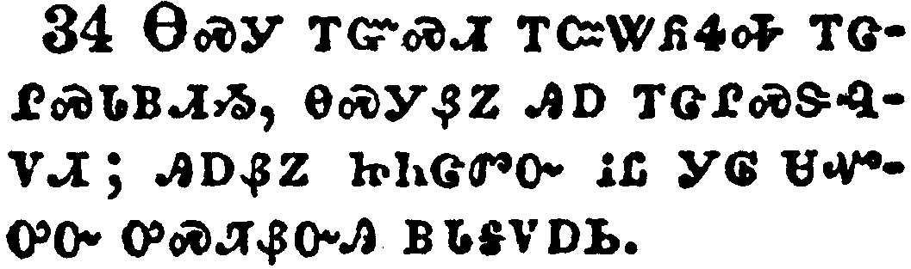</a></td>
</tr>
<tr class="even">
<td>Wherefore I pray you to take some meat: for this is for your health: for there shall not an hair fall from the head of any of you.</td>
</tr>
<tr class="odd">
<td>ᎾᏍᎩ ᎢᏳᏍᏗ ᎢᏨᏔᏲᏎᎭ ᎢᏣᎵᏍᏓᏴᏗᏱ, ᎾᏍᎩᏰᏃ ᎯᎠ ᎢᏣᎵᏍᏕᎸᏙᏗ; ᎯᎠᏰᏃ ᏥᏂᏣᏛᏅ ᎥᏝ ᎩᎶ ᏌᏉᎤᏅ ᎤᏍᏘᏰᏅᎯ ᎠᏓᎦᏙᎠᏏ.</td>
</tr>
<tr class="even">
<td>Na-s-gi i-yu-s-di i-tsv-ta-yo-se-ha i-tsa-li-s-da-yv-di-yi, na-s-gi-ye-no hi-a i-tsa-li-s-de-lv-do-di; hi-a-ye-no tsi-ni-tsa-dv-nv v-tla gi-lo sa-quo-u-nv u-s-ti-ye-nv-hi a-da-ga-do-a-si.</td>
</tr>
</tbody>
</table>

<table>
<tbody>
<tr class="odd">
<td><a href="052735.png">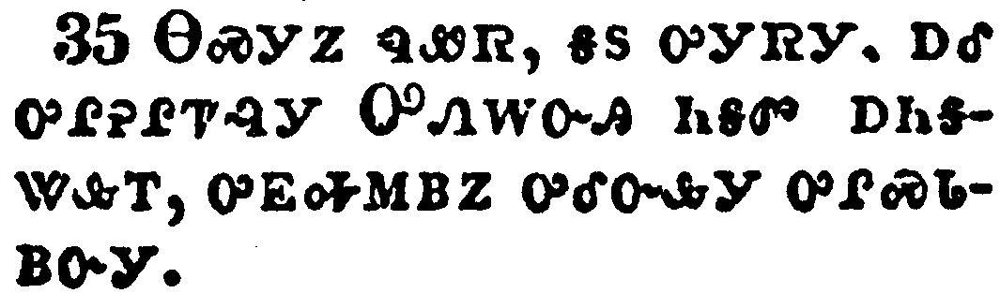</a></td>
</tr>
<tr class="even">
<td>And when he had thus spoken, he took bread, and gave thanks to God in presence of them all: and when he had broken it, he began to eat.</td>
</tr>
<tr class="odd">
<td>ᎾᏍᎩᏃ ᏄᏪᏒ, ᎦᏚ ᎤᎩᏒᎩ ᎠᎴ ᎤᎵᎮᎵᏤᎸᎩ ᎤᏁᎳᏅᎯ ᏂᎦᏛ ᎠᏂᎦᏔᎲᎢ, ᎤᎬᎭᎷᏴᏃ ᎤᎴᏅᎲᎩ ᎤᎵᏍᏓᏴᏅᎩ.</td>
</tr>
<tr class="even">
<td>Na-s-gi-no nu-we-sv, ga-du u-gi-sv-gi a-le u-li-he-li-tse-lv-gi U-ne-la-nv-hi ni-ga-dv a-ni-ga-ta-hv-i, u-gv-ha-lu-yv-no u-le-nv-hv-gi u-li-s-da-yv-nv-gi.</td>
</tr>
</tbody>
</table>

<table>
<tbody>
<tr class="odd">
<td><a href="052736.png">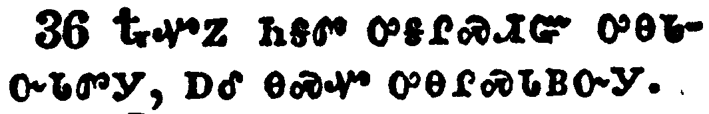</a></td>
</tr>
<tr class="even">
<td>Then were they all of good cheer, and they also took some meat.</td>
</tr>
<tr class="odd">
<td>ᎿᎭᏉᏃ ᏂᎦᏛ ᎤᎦᎵᏍᏗᏳ ᎤᎾᏓᏅᏓᏛᎩ, ᎠᎴ ᎾᏍᏉ ᎤᎾᎵᏍᏓᏴᏅᎩ.</td>
</tr>
<tr class="even">
<td>Hna-quo-no ni-ga-dv u-ga-li-s-di-yu u-na-da-nv-da-dv-gi, a-le na-s-quo u-na-li-s-da-yv-nv-gi.</td>
</tr>
</tbody>
</table>

<table>
<tbody>
<tr class="odd">
<td><a href="052737.png">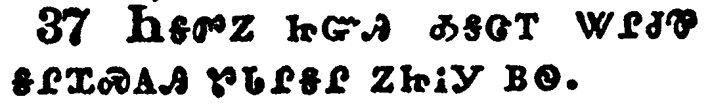</a></td>
</tr>
<tr class="even">
<td>And we were in all in the ship two hundred threescore and sixteen souls.</td>
</tr>
<tr class="odd">
<td>ᏂᎦᏛᏃ ᏥᏳᎯ ᎣᎦᏣᎢ ᏔᎵᏧᏈ ᎦᎵᏆᏍᎪᎯ ᏑᏓᎵᎦᎵ ᏃᏥᎥᎩ ᏴᏫ.</td>
</tr>
<tr class="even">
<td>Ni-ga-dv-no tsi-yu-hi o-ga-tsa-i ta-li-tsu-qui ga-li-qua-s-go-hi su-da-li-ga-li no-tsi-v-gi yv-wi.</td>
</tr>
</tbody>
</table>

<table>
<tbody>
<tr class="odd">
<td><a href="052738.png">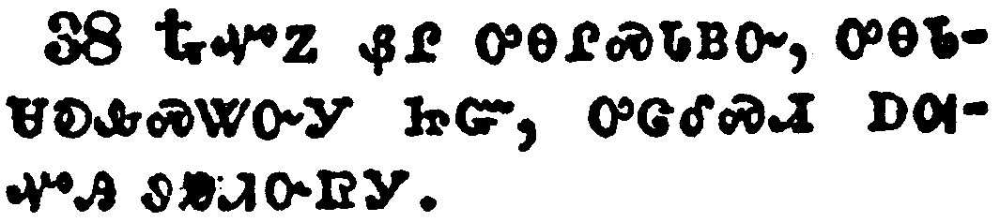</a></td>
</tr>
<tr class="even">
<td>And when they had eaten enough, they lightened the ship, and cast out the wheat into the sea.</td>
</tr>
<tr class="odd">
<td>ᎿᎭᏉᏃ ᏰᎵ ᎤᎾᎵᏍᏓᏴᏅ, ᎤᎾᏓᏌᎧᎲᏍᏔᏅᎩ ᏥᏳ, ᎤᏣᎴᏍᏗ ᎠᎺᏉᎯ ᏭᎾᏗᏅᏒᎩ.</td>
</tr>
<tr class="even">
<td>Hna-quo-no ye-li u-na-li-s-da-yv-nv, u-na-da-sa-ka-hv-s-ta-nv-gi tsi-yu, u-tsa-le-s-di a-me-quo-hi wu-na-di-nv-sv-gi.</td>
</tr>
</tbody>
</table>

<table>
<tbody>
<tr class="odd">
<td><a href="052739.png">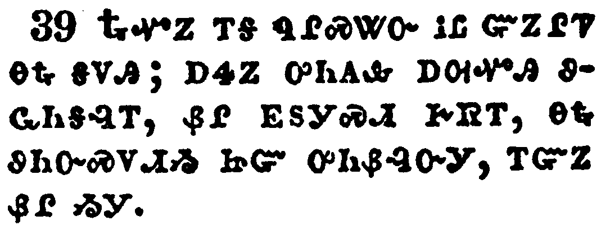</a></td>
</tr>
<tr class="even">
<td>And when it was day, they knew not the land: but they discovered a certain creek with a shore, into the which they were minded, if it were possible, to thrust in the ship.</td>
</tr>
<tr class="odd">
<td>ᎿᎭᏉᏃ ᎢᎦ ᏄᎵᏍᏔᏅ ᎥᏝ ᏳᏃᎵᏤ ᎾᎿᎭᎦᏙᎯ; ᎠᏎᏃ ᎤᏂᎪᎲ ᎠᎺᏉᎯ ᏭᏩᏂᎦᎸᎢ, ᏰᎵ ᎬᏚᎩᏍᏗ ᎨᏒᎢ, ᎾᎿᎭᏭᏂᏅᏍᏙᏗᏱ ᏥᏳ ᎤᏂᏰᎸᏅᎩ, ᎢᏳᏃ ᏰᎵ ᏱᎩ.</td>
</tr>
<tr class="even">
<td>Hna-quo-no i-ga nu-li-s-ta-nv v-tla yu-no-li-tse na-hna ga-do-hi; a-se-no u-ni-go-hv a-me-quo-hi wu-wa-ni-ga-lv-i, ye-li gv-du-gi-s-di ge-sv-i, na-hna wu-ni-nv-s-do-di-yi tsi-yu u-ni-ye-lv-nv-gi, i-yu-no ye-li yi-gi.</td>
</tr>
</tbody>
</table>

<table>
<tbody>
<tr class="odd">
<td><a href="052740.png">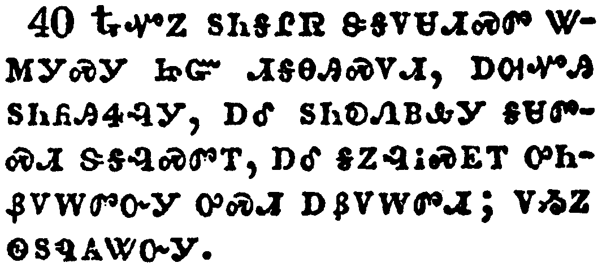</a></td>
</tr>
<tr class="even">
<td>And when they had taken up the anchors, they committed themselves unto the sea, and loosed the rudder bands, and hoised up the mainsail to the wind, and made toward shore.</td>
</tr>
<tr class="odd">
<td>ᎿᎭᏉᏃ ᏚᏂᎦᎵᏒ ᏕᎦᏙᏌᏗᏍᏛ ᏔᎷᎩᏍᎩ ᏥᏳ ᏗᎦᎾᎯᏍᏙᏗ, ᎠᎺᏉᎯ ᏚᏂᏲᎯᏎᎸᎩ, ᎠᎴ ᏚᏂᎧᏁᏴᎲᎩ ᎦᏌᏛᏍᏗ ᏕᎦᎸᏍᏛᎢ, ᎠᎴ ᎦᏃᎸᎥᏍᎬᎢ ᎤᏂᏰᏙᎳᏛᏅᎩ ᎤᏍᏗ ᎠᏰᏙᎳᏛᏗ; ᏙᏱᏃ ᏫᏚᏄᎪᏔᏅᎩ.</td>
</tr>
<tr class="even">
<td>Hna-quo-no du-ni-ga-li-sv de-ga-do-sa-di-s-dv ta-lu-gi-s-gi tsi-yu di-ga-na-hi-s-do-di, a-me-quo-hi du-ni-yo-hi-se-lv-gi, a-le du-ni-ka-ne-yv-hv-gi ga-sa-dv-s-di de-ga-lv-s-dv-i, a-le ga-no-lv-v-s-gv-i u-ni-ye-do-la-dv-nv-gi u-s-di a-ye-do-la-dv-di; do-yi-no wi-du-nu-go-ta-nv-gi.</td>
</tr>
</tbody>
</table>

<table>
<tbody>
<tr class="odd">
<td><a href="052741.png">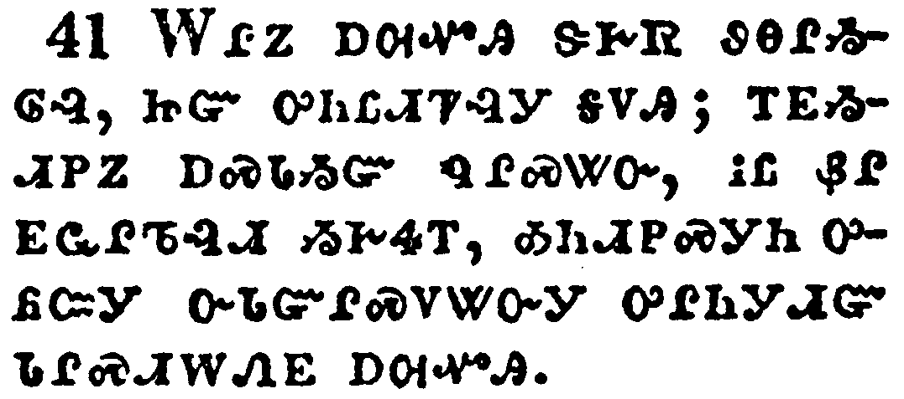</a></td>
</tr>
<tr class="even">
<td>And falling into a place where two seas met, they ran the ship aground; and the forepart stuck fast, and remained unmoveable, but the hinder part was broken with the violence of the waves.</td>
</tr>
<tr class="odd">
<td>ᏔᎵᏃ ᎠᎺᏉᎯ ᏕᎨᏒ ᏭᎾᎵᏱᎶᎸ, ᏥᏳ ᎤᏂᏝᏗᏤᎸᎩ ᎦᏙᎯ; ᎢᎬᏱᏗᏢᏃ ᎠᏍᏓᏱᏳ ᏄᎵᏍᏔᏅ, ᎥᏝ ᏰᎵ ᎬᏩᎵᏖᎸᏗ ᏱᎨᏎᎢ, ᎣᏂᏗᏢᏍᎩᏂ ᎤᏲᏨᎩ ᏅᏓᏳᎵᏍᏙᏔᏅᎩ ᎤᎵᏂᎩᏗᏳ ᏓᎵᏍᏗᎳᏁᎬ ᎠᎺᏉᎯ.</td>
</tr>
<tr class="even">
<td>Ta-li-no a-me-quo-hi de-ge-sv wu-na-li-yi-lo-lv, tsi-yu u-ni-tla-di-tse-lv-gi ga-do-hi; i-gv-yi-di-tlv-no a-s-da-yi-yu nu-li-s-ta-nv, v-tla ye-li gv-wa-li-te-lv-di yi-ge-se-i, o-ni-di-tlv-s-gi-ni u-yo-tsv-gi nv-da-yu-li-s-do-ta-nv-gi u-li-ni-gi-di-yu da-li-s-di-la-ne-gv a-me-quo-hi.</td>
</tr>
</tbody>
</table>

<table>
<tbody>
<tr class="odd">
<td><a href="052742.png">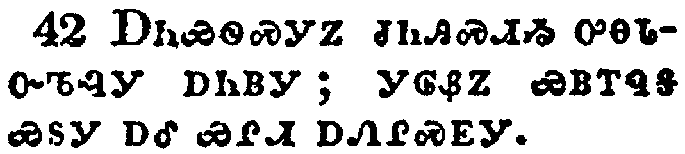</a></td>
</tr>
<tr class="even">
<td>And the soldiers' counsel was to kill the prisoners, lest any of them should swim out, and escape.</td>
</tr>
<tr class="odd">
<td>ᎠᏂᏯᏫᏍᎩᏃ ᏧᏂᎯᏍᏗᏱ ᎤᎾᏓᏅᏖᎸᎩ ᎠᏂᏴᎩ; ᎩᎶᏰᏃ ᏯᏴᎢᏄᎦ ᏯᏚᎩ ᎠᎴ ᏯᎵᏗ ᎠᏁᎵᏍᎬᎩ.</td>
</tr>
<tr class="even">
<td>A-ni-ya-wi-s-gi-no tsu-ni-hi-s-di-yi u-na-da-nv-te-lv-gi a-ni-yv-gi; gi-lo-ye-no ya-yv-i-nu-ga ya-du-gi a-le ya-li-di a-ne-li-s-gv-gi.</td>
</tr>
</tbody>
</table>

<table>
<tbody>
<tr class="odd">
<td><a href="052743.png">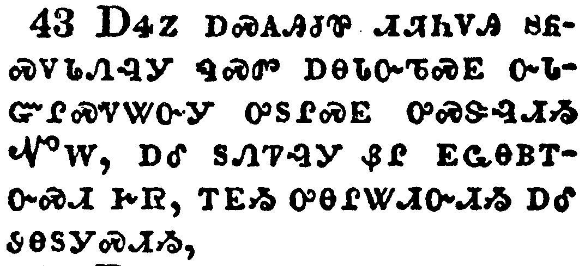</a></td>
</tr>
<tr class="even">
<td>But the centurion, willing to save Paul, kept them from their purpose; and commanded that they which could swim should cast themselves first into the sea, and get to land:</td>
</tr>
<tr class="odd">
<td>ᎠᏎᏃ ᎠᏍᎪᎯᏧᏈ ᏗᏘᏂᏙᎯ ᏚᏲᏍᏙᏓᏁᎸᎩ ᏄᏍᏛ ᎠᎾᏓᏅᏖᏍᎬ ᏅᏓᏳᎵᏍᏙᏔᏅᎩ ᎤᏚᎵᏍᎬ ᎤᏍᏕᎸᏗᏱ ᏉᎳ, ᎠᎴ ᏚᏁᏤᎸᎩ ᏰᎵ ᎬᏩᎾᏴᎢᏅᏍᏗ ᎨᏒ, ᎢᎬᏱ ᎤᎾᎵᏔᏗᏅᏗᏱ ᎠᎴ ᏭᎾᏚᎩᏍᏗᏱ,</td>
</tr>
<tr class="even">
<td>A-se-no a-s-go-hi-tsu-qui di-ti-ni-do-hi du-yo-s-do-da-ne-lv-gi nu-s-dv a-na-da-nv-te-s-gv nv-da-yu-li-s-do-ta-nv-gi u-du-li-s-gv u-s-de-lv-di-yi Quo-la, a-le du-ne-tse-lv-gi ye-li gv-wa-na-yv-i-nv-s-di ge-sv, i-gv-yi u-na-li-ta-di-nv-di-yi a-le wu-na-du-gi-s-di-yi,</td>
</tr>
</tbody>
</table>

<table>
<tbody>
<tr class="odd">
<td><a href="052744.png">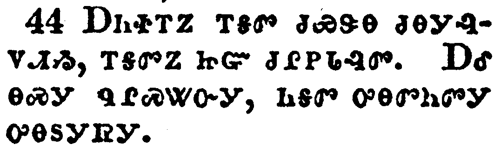</a></td>
</tr>
<tr class="even">
<td>And the rest, some on boards, and some on broken pieces of the ship. And so it came to pass, that they escaped all safe to land.</td>
</tr>
<tr class="odd">
<td>ᎠᏂᏐᎢᏃ ᎢᎦᏛ ᏧᏯᏕᎾ ᏧᎾᎩᎸᏙᏗᏱ, ᎢᎦᏛᏃ ᏥᏳ ᏧᎵᏢᎸᏛ. ᎠᎴ ᎾᏍᎩ ᏄᎵᏍᏔᏅᎩ, ᏂᎦᏛ ᎤᎾᏛᏂᏛᎩ ᎤᎾᏚᎩᏒᎩ.</td>
</tr>
<tr class="even">
<td>A-ni-so-i-no i-ga-dv tsu-ya-de-na tsu-na-gi-lv-do-di-yi, i-ga-dv-no tsi-yu tsu-li-tlv-lv-dv. A-le na-s-gi nu-li-s-ta-nv-gi, ni-ga-dv u-na-dv-ni-dv-gi u-na-du-gi-sv-gi.</td>
</tr>
</tbody>
</table>

