+++
draft=false
date = 2014-12-18T21:11:07Z
title = "Titus - Chapter 2 - Cherokee New Testament"
weight = 1418955067

[taxonomies]

authors = ["Timothy Legg"]
categories = []
tags = []

[extra]
+++

<table>
<tbody>
<tr class="odd">
<td></td>
</tr>
<tr class="even">
<td>But speak thou the things which become sound doctrine:</td>
</tr>
<tr class="odd">
<td>ᏂᎯᏍᎩᏂ ᎯᏃᎮᏍᎨᏍᏗ ᎾᏍᎩ ᎣᏍᏛ ᏗᏕᏲᏗ ᎨᏒ ᎤᎵᎶᎲᏍᎩ;</td>
</tr>
<tr class="even">
<td>Ni-hi-s-gi-ni hi-no-he-s-ge-s-di na-s-gi o-s-dv di-de-yo-di ge-sv u-li-lo-hv-s-gi;</td>
</tr>
</tbody>
</table>

<table>
<tbody>
<tr class="odd">
<td><a href="170202.png">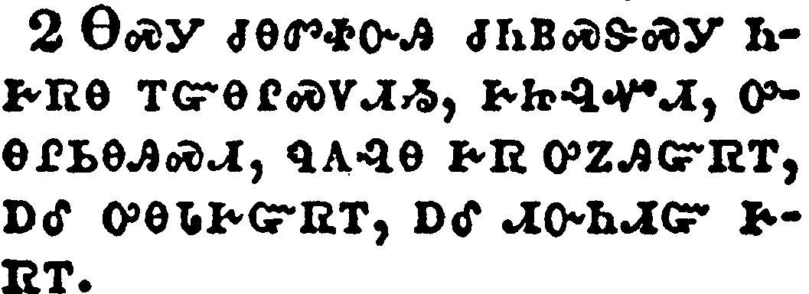</a></td>
</tr>
<tr class="even">
<td>That the aged men be sober, grave, temperate, sound in faith, in charity, in patience.</td>
</tr>
<tr class="odd">
<td>ᎾᏍᎩ ᏧᎾᏛᏐᏅᎯ ᏧᏂᏴᏍᏕᏍᎩ ᏂᎨᏒᎾ ᎢᏳᎾᎵᏍᏙᏗᏱ, ᎨᏥᎸᏉᏗ, ᎤᎾᎵᏏᎾᎯᏍᏗ, ᏄᎪᎸᎾ ᎨᏒ ᎤᏃᎯᏳᏒᎢ, ᎠᎴ ᎤᎾᏓᎨᏳᏒᎢ, ᎠᎴ ᏗᏅᏂᏗᏳ ᎨᏒᎢ.</td>
</tr>
<tr class="even">
<td>Na-s-gi tsu-na-dv-so-nv-hi tsu-ni-yv-s-de-s-gi ni-ge-sv-na i-yu-na-li-s-do-di-yi, ge-tsi-lv-quo-di, u-na-li-si-na-hi-s-di, nu-go-lv-na ge-sv u-no-hi-yu-sv-i, a-le u-na-da-ge-yu-sv-i, a-le di-nv-ni-di-yu ge-sv-i.</td>
</tr>
</tbody>
</table>

<table>
<tbody>
<tr class="odd">
<td><a href="170203.png">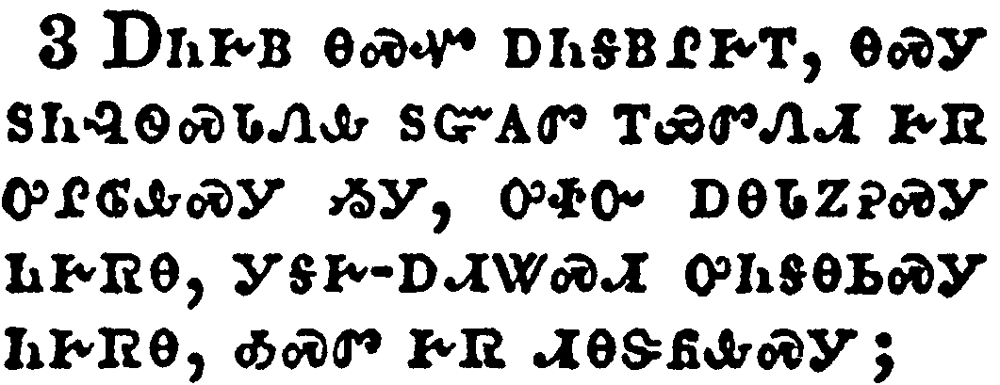</a></td>
</tr>
<tr class="even">
<td>The aged women likewise, that they be in behaviour as becometh holiness, not false accusers, not given to much wine, teachers of good things;</td>
</tr>
<tr class="odd">
<td>ᎠᏂᎨᏴ ᎾᏍᏉ ᎠᏂᎦᏴᎵᎨᎢ, ᎾᏍᎩ ᏚᏂᎸᏫᏍᏓᏁᎲ ᏚᏳᎪᏛ ᎢᏯᏛᏁᏗ ᎨᏒ ᎤᎵᎶᎲᏍᎩ ᏱᎩ, ᎤᏐᏅ ᎠᎾᏓᏃᎮᏍᎩ ᏂᎨᏒᎾ, ᎩᎦᎨ-ᎠᏗᏔᏍᏗ ᎤᏂᎦᎾᏏᏍᎩ ᏂᎨᏒᎾ, ᎣᏍᏛ ᎨᏒ ᏗᎾᏕᏲᎲᏍᎩ;</td>
</tr>
<tr class="even">
<td>A-ni-ge-yv na-s-quo a-ni-ga-yv-li-ge-i, na-s-gi du-ni-lv-wi-s-da-ne-hv du-yu-go-dv i-ya-dv-ne-di ge-sv u-li-lo-hv-s-gi yi-gi, u-so-nv a-na-da-no-he-s-gi ni-ge-sv-na, gi-ga-ge--a-di-ta-s-di u-ni-ga-na-si-s-gi ni-ge-sv-na, o-s-dv ge-sv di-na-de-yo-hv-s-gi;</td>
</tr>
</tbody>
</table>

<table>
<tbody>
<tr class="odd">
<td><a href="170204.png">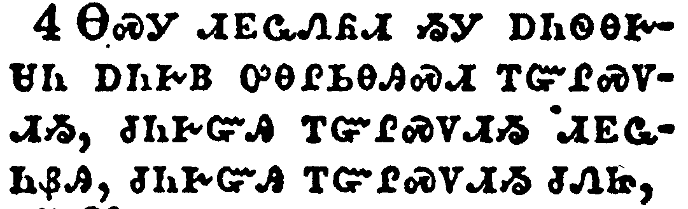</a></td>
</tr>
<tr class="even">
<td>That they may teach the young women to be sober, to love their husbands, to love their children,</td>
</tr>
<tr class="odd">
<td>ᎾᏍᎩ ᏗᎬᏩᏁᏲᏗ ᏱᎩ ᎠᏂᏫᎾᎨᏌᏂ ᎠᏂᎨᏴ ᎤᎾᎵᏏᎾᎯᏍᏗ ᎢᏳᎵᏍᏙᏗᏱ, ᏧᏂᎨᏳᎯ ᎢᏳᎵᏍᏙᏗᏱ ᏗᎬᏩᏂᏰᎯ, ᏧᏂᎨᏳᎯ ᎢᏳᎵᏍᏙᏗᏱ ᏧᏁᏥ,</td>
</tr>
<tr class="even">
<td>Na-s-gi di-gv-wa-ne-yo-di yi-gi a-ni-wi-na-ge-sa-ni a-ni-ge-yv u-na-li-si-na-hi-s-di i-yu-li-s-do-di-yi, tsu-ni-ge-yu-hi i-yu-li-s-do-di-yi di-gv-wa-ni-ye-hi, tsu-ni-ge-yu-hi i-yu-li-s-do-di-yi tsu-ne-tsi,</td>
</tr>
</tbody>
</table>

<table>
<tbody>
<tr class="odd">
<td><a href="170205.png">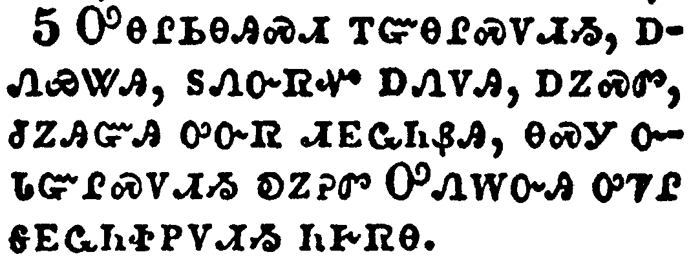</a></td>
</tr>
<tr class="even">
<td>To be discreet, chaste, keepers at home, good, obedient to their own husbands, that the word of God be not blasphemed.</td>
</tr>
<tr class="odd">
<td>ᎤᎾᎵᏏᎾᎯᏍᏗ ᎢᏳᎾᎵᏍᏙᏗᏱ, ᎠᏁᏯᏔᎯ, ᏚᏁᏅᏒᏉ ᎠᏁᏙᎯ, ᎠᏃᏍᏛ, ᏧᏃᎯᏳᎯ ᎤᏅᏒ ᏗᎬᏩᏂᏰᎯ, ᎾᏍᎩ ᏅᏓᏳᎵᏍᏙᏗᏱ ᎧᏃᎮᏛ ᎤᏁᎳᏅᎯ ᎤᏤᎵ ᎦᎬᏩᏂᏐᏢᏙᏗᏱ ᏂᎨᏒᎾ.</td>
</tr>
<tr class="even">
<td>U-na-li-si-na-hi-s-di i-yu-na-li-s-do-di-yi, a-ne-ya-ta-hi, du-ne-nv-sv-quo a-ne-do-hi, a-no-s-dv, tsu-no-hi-yu-hi u-nv-sv di-gv-wa-ni-ye-hi, na-s-gi nv-da-yu-li-s-do-di-yi ka-no-he-dv U-ne-la-nv-hi u-tse-li ga-gv-wa-ni-so-tlv-do-di-yi ni-ge-sv-na.</td>
</tr>
</tbody>
</table>

<table>
<tbody>
<tr class="odd">
<td><a href="170206.png">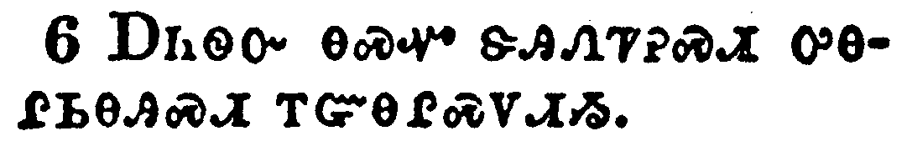</a></td>
</tr>
<tr class="even">
<td>Young men likewise exhort to be sober minded.</td>
</tr>
<tr class="odd">
<td>ᎠᏂᏫᏅ ᎾᏍᏉ ᏕᎯᏁᏤᎮᏍᏗ ᎤᎾᎵᏏᎾᎯᏍᏗ ᎢᏳᎾᎵᏍᏙᏗᏱ.</td>
</tr>
<tr class="even">
<td>A-ni-wi-nv na-s-quo de-hi-ne-tse-he-s-di u-na-li-si-na-hi-s-di i-yu-na-li-s-do-di-yi.</td>
</tr>
</tbody>
</table>

<table>
<tbody>
<tr class="odd">
<td><a href="170207.png">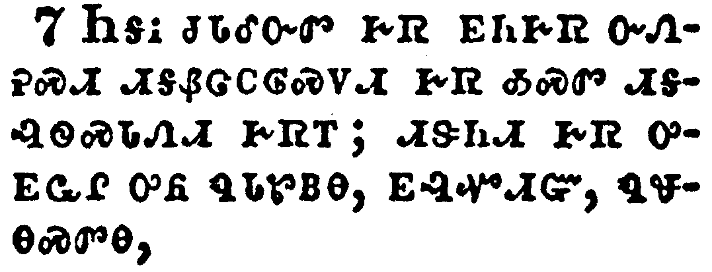</a></td>
</tr>
<tr class="even">
<td>In all things shewing thyself a pattern of good works: in doctrine shewing uncorruptness, gravity, sincerity,</td>
</tr>
<tr class="odd">
<td>ᏂᎦᎥ ᏧᏓᎴᏅᏛ ᎨᏒ ᎬᏂᎨᏒ ᏅᏁᎮᏍᏗ ᏗᎦᏰᏣᏟᎶᏍᏙᏗ ᎨᏒ ᎣᏍᏛ ᏗᎦᎸᏫᏍᏓᏁᏗ ᎨᏒᎢ; ᏗᏕᏂᏗ ᎨᏒ ᎤᎬᏩᎵ ᎤᏲ ᏄᏓᏑᏴᎾ, ᎬᎸᏉᏗᏳ, ᏄᏠᎾᏍᏛᎾ,</td>
</tr>
<tr class="even">
<td>Ni-ga-v tsu-da-le-nv-dv ge-sv gv-ni-ge-sv nv-ne-he-s-di di-ga-ye-tsa-tli-lo-s-do-di ge-sv o-s-dv di-ga-lv-wi-s-da-ne-di ge-sv-i; di-de-ni-di ge-sv u-gv-wa-li u-yo nu-da-su-yv-na, gv-lv-quo-di-yu, nu-tlo-na-s-dv-na,</td>
</tr>
</tbody>
</table>

<table>
<tbody>
<tr class="odd">
<td><a href="170208.png">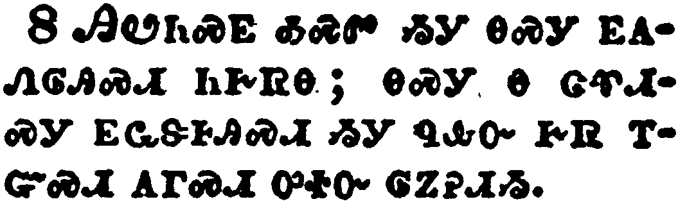</a></td>
</tr>
<tr class="even">
<td>Sound speech, that cannot be condemned; that he that is of the contrary part may be ashamed, having no evil thing to say of you.</td>
</tr>
<tr class="odd">
<td>ᎯᏬᏂᏍᎬ ᎣᏍᏛ ᏱᎩ ᎾᏍᎩ ᎬᎪᏁᎶᎯᏍᏗ ᏂᎨᏒᎾ; ᎾᏍᎩ Ꮎ ᏣᏡᏗᏍᎩ ᎬᏩᏕᎰᎯᏍᏗ ᏱᎩ ᏄᎲᏅ ᎨᏒ ᎢᏳᏍᏗ ᎪᎱᏍᏗ ᎤᏐᏅ ᎶᏃᎮᏗᏱ.</td>
</tr>
<tr class="even">
<td>Hi-wo-ni-s-gv o-s-dv yi-gi na-s-gi gv-go-ne-lo-hi-s-di ni-ge-sv-na; na-s-gi na tsa-tlu-di-s-gi gv-wa-de-ho-hi-s-di yi-gi nu-hv-nv ge-sv i-yu-s-di go-hu-s-di u-so-nv lo-no-he-di-yi.</td>
</tr>
</tbody>
</table>

<table>
<tbody>
<tr class="odd">
<td><a href="170209.png">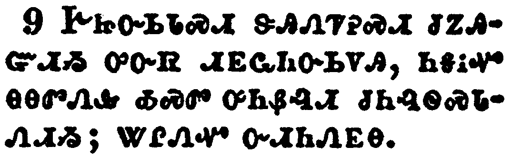</a></td>
</tr>
<tr class="even">
<td>Exhort servants to be obedient unto their own masters, and to please them well in all things; not answering again;</td>
</tr>
<tr class="odd">
<td>ᎨᏥᏅᏏᏓᏍᏗ ᏕᎯᏁᏤᎮᏍᏗ ᏧᏃᎯᏳᏗᏱ ᎤᏅᏒ ᏗᎬᏩᏂᏅᏏᏙᎯ, ᏂᎦᎥᏉ ᎾᎾᏛᏁᎲ ᎣᏍᏛ ᎤᏂᏰᎸᏗ ᏧᏂᎸᏫᏍᏓᏁᏗᏱ; ᏔᎵᏁᏉ ᏅᏗᏂᏁᎬᎾ.</td>
</tr>
<tr class="even">
<td>Ge-tsi-nv-si-da-s-di de-hi-ne-tse-he-s-di tsu-no-hi-yu-di-yi u-nv-sv di-gv-wa-ni-nv-si-do-hi, ni-ga-v-quo na-na-dv-ne-hv o-s-dv u-ni-ye-lv-di tsu-ni-lv-wi-s-da-ne-di-yi; ta-li-ne-quo nv-di-ni-ne-gv-na.</td>
</tr>
</tbody>
</table>

<table>
<tbody>
<tr class="odd">
<td><a href="170210.png">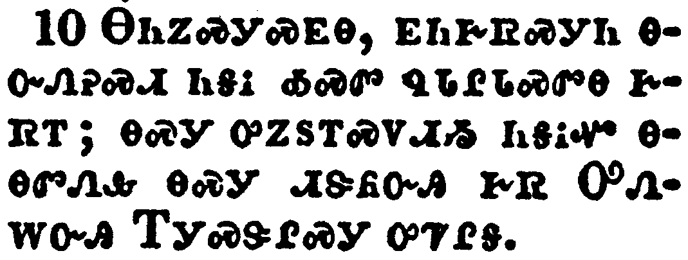</a></td>
</tr>
<tr class="even">
<td>Not purloining, but shewing all good fidelity; that they may adorn the doctrine of God our Saviour in all things.</td>
</tr>
<tr class="odd">
<td>ᎾᏂᏃᏍᎩᏍᎬᎾ, ᎬᏂᎨᏒᏍᎩᏂ ᎾᏅᏁᎮᏍᏗ ᏂᎦᎥ ᎣᏍᏛ ᏄᏓᎵᏓᏍᏛᎾ ᎨᏒᎢ; ᎾᏍᎩ ᎤᏃᏚᎢᏍᏙᏗᏱ ᏂᎦᎥᏉ ᎾᎾᏛᏁᎲ ᎾᏍᎩ ᏗᏕᏲᏅᎯ ᎨᏒ ᎤᏁᎳᏅᎯ ᎢᎩᏍᏕᎵᏍᎩ ᎤᏤᎵᎦ.</td>
</tr>
<tr class="even">
<td>Na-ni-no-s-gi-s-gv-na, gv-ni-ge-sv-s-gi-ni na-nv-ne-he-s-di ni-ga-v o-s-dv nu-da-li-da-s-dv-na ge-sv-i; na-s-gi u-no-du-i-s-do-di-yi ni-ga-v-quo na-na-dv-ne-hv na-s-gi di-de-yo-nv-hi ge-sv U-ne-la-nv-hi I-gi-s-de-li-s-gi u-tse-li-ga.</td>
</tr>
</tbody>
</table>

<table>
<tbody>
<tr class="odd">
<td><a href="170211.png">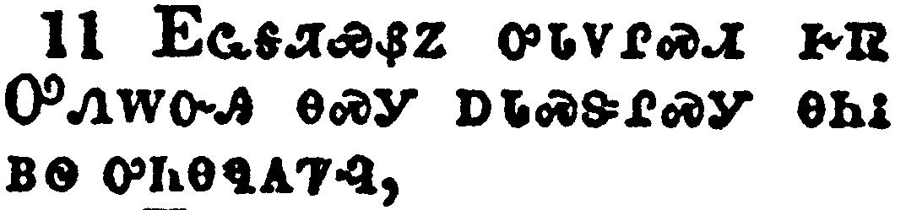</a></td>
</tr>
<tr class="even">
<td>For the grace of God that bringeth salvation hath appeared to all men,</td>
</tr>
<tr class="odd">
<td>ᎬᏩᎦᏘᏯᏰᏃ ᎤᏓᏙᎵᏍᏗ ᎨᏒ ᎤᏁᎳᏅᎯ ᎾᏍᎩ ᎠᏓᏍᏕᎵᏍᎩ ᎾᏂᎥ ᏴᏫ ᎤᏂᎾᏄᎪᏤᎸ,</td>
</tr>
<tr class="even">
<td>Gv-wa-ga-ti-ya-ye-no u-da-do-li-s-di ge-sv U-ne-la-nv-hi na-s-gi a-da-s-de-li-s-gi na-ni-v yv-wi u-ni-na-nu-go-tse-lv,</td>
</tr>
</tbody>
</table>

<table>
<tbody>
<tr class="odd">
<td><a href="170212.png">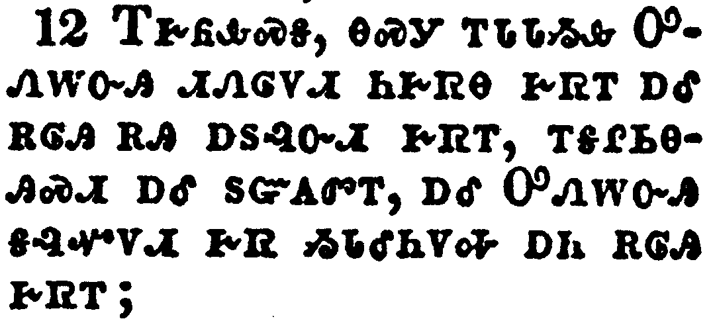</a></td>
</tr>
<tr class="even">
<td>Teaching us that, denying ungodliness and worldly lusts, we should live soberly, righteously, and godly, in this present world;</td>
</tr>
<tr class="odd">
<td>ᎢᎨᏲᎲᏍᎦ, ᎾᏍᎩ ᎢᏓᏓᏱᎲ ᎤᏁᎳᏅᎯ ᏗᏁᎶᏙᏗ ᏂᎨᏒᎾ ᎨᏒᎢ ᎠᎴ ᎡᎶᎯ ᎡᎯ ᎠᏚᎸᏅᏗ ᎨᏒᎢ, ᎢᎦᎵᏏᎾᎯᏍᏗ ᎠᎴ ᏚᏳᎪᏛᎢ, ᎠᎴ ᎤᏁᎳᏅᎯ ᎦᎸᏉᏙᏗ ᎨᏒ ᏱᏓᎴᏂᏙᎭ ᎠᏂ ᎡᎶᎯ ᎨᏒᎢ;</td>
</tr>
<tr class="even">
<td>I-ge-yo-hv-s-ga, na-s-gi i-da-da-yi-hv U-ne-la-nv-hi di-ne-lo-do-di ni-ge-sv-na ge-sv-i a-le e-lo-hi e-hi a-du-lv-nv-di ge-sv-i, i-ga-li-si-na-hi-s-di a-le du-yu-go-dv-i, a-le U-ne-la-nv-hi ga-lv-quo-do-di ge-sv yi-da-le-ni-do-ha a-ni e-lo-hi ge-sv-i;</td>
</tr>
</tbody>
</table>

<table>
<tbody>
<tr class="odd">
<td><a href="170213.png">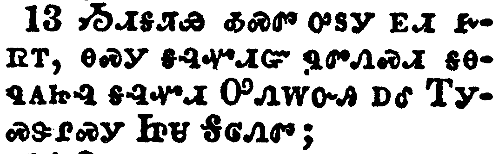</a></td>
</tr>
<tr class="even">
<td>Looking for that blessed hope, and the glorious appearing of the great God and our Saviour Jesus Christ;</td>
</tr>
<tr class="odd">
<td>ᏱᏗᎦᏘᏯ ᎣᏍᏛ ᎤᏚᎩ ᎬᏗ ᎨᏒᎢ, ᎾᏍᎩ ᎦᎸᏉᏗᏳ ᏄᏛᏁᏍᏗ ᎦᎾᏄᎪᏥᎸ ᎦᎸᏉᏗ ᎤᏁᎳᏅᎯ ᎠᎴ ᎢᎩᏍᏕᎵᏍᎩ ᏥᏌ ᎦᎶᏁᏛ;</td>
</tr>
<tr class="even">
<td>Yi-di-ga-ti-ya o-s-dv u-du-gi gv-di ge-sv-i, na-s-gi ga-lv-quo-di-yu nu-dv-ne-s-di ga-na-nu-go-tsi-lv ga-lv-quo-di U-ne-la-nv-hi a-le I-gi-s-de-li-s-gi Tsi-sa Ga-lo-ne-dv;</td>
</tr>
</tbody>
</table>

<table>
<tbody>
<tr class="odd">
<td><a href="170214.png">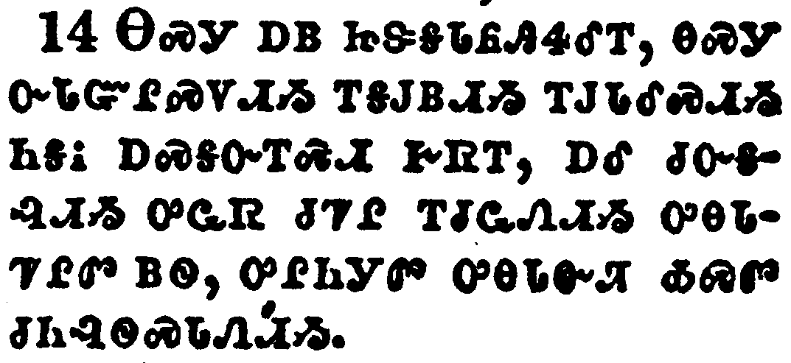</a></td>
</tr>
<tr class="even">
<td>Who gave himself for us, that he might redeem us from all iniquity, and purify unto himself a peculiar people, zealous of good works.</td>
</tr>
<tr class="odd">
<td>ᎾᏍᎩ ᎠᏴ ᏥᏕᎦᏓᎵᏲᎯᏎᎴᎢ, ᎾᏍᎩ ᏅᏓᏳᎵᏍᏙᏗᏱ ᎢᎦᎫᏴᏗᏱ ᎢᎫᏓᎴᏍᏗᏱ ᏂᎦᎥ ᎠᏍᎦᏅᎢᏍᏗ ᎨᏒᎢ, ᎠᎴ ᏧᏅᎦᎸᏗᏱ ᎤᏩᏒ ᏧᏤᎵ ᎢᏧᏩᏁᏗᏱ ᎤᎾᏓᏤᎵᏛ ᏴᏫ, ᎤᎵᏂᎩᏛ ᎤᎾᏓᏅᏘ ᎣᏍᏛ ᏧᏂᎸᏫᏍᏓᏁᏗᏱ.</td>
</tr>
<tr class="even">
<td>Na-s-gi a-yv tsi-de-ga-da-li-yo-hi-se-le-i, na-s-gi nv-da-yu-li-s-do-di-yi i-ga-gu-yv-di-yi i-gu-da-le-s-di-yi ni-ga-v a-s-ga-nv-i-s-di ge-sv-i, a-le tsu-nv-ga-lv-di-yi u-wa-sv tsu-tse-li i-tsu-wa-ne-di-yi u-na-da-tse-li-dv yv-wi, u-li-ni-gi-dv u-na-da-nv-ti o-s-dv tsu-ni-lv-wi-s-da-ne-di-yi.</td>
</tr>
</tbody>
</table>

<table>
<tbody>
<tr class="odd">
<td></td>
</tr>
<tr class="even">
<td>These things speak, and exhort, and rebuke with all authority. Let no man despise thee.</td>
</tr>
<tr class="odd">
<td>ᎾᏍᎩ ᎯᎠ ᏄᏍᏕᏍᏗ ᎯᏃᎮᏍᎨᏍᏗ, ᎠᎴ ᏕᎯᏬᏁᏗᏍᎨᏍᏗ, ᎠᎴ ᏕᎯᎬᏍᎪᎸᎥᏍᎨᏍᏗ ᎲᏗᏍᎨᏍᏗ ᏂᎦᎥ ᏣᏒᎦᎸᎢ. ᎲᏗᏍᎨᏍᏗ ᏞᏍᏗ ᎩᎶ ᎡᏍᎦ ᏱᏣᏰᎸᏎᏍᏗ.</td>
</tr>
<tr class="even">
<td>Na-s-gi hi-a nu-s-de-s-di hi-no-he-s-ge-s-di, a-le de-hi-wo-ne-di-s-ge-s-di, a-le de-hi-gv-s-go-lv-v-s-ge-s-di hv-di-s-ge-s-di ni-ga-v tsa-sv-ga-lv-i. Hv-di-s-ge-s-di Tle-s-di gi-lo e-s-ga yi-tsa-ye-lv-se-s-di.</td>
</tr>
</tbody>
</table>

